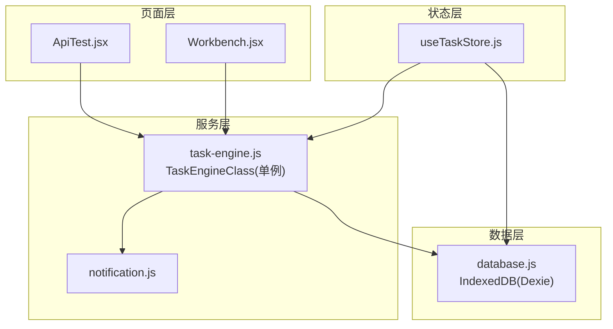
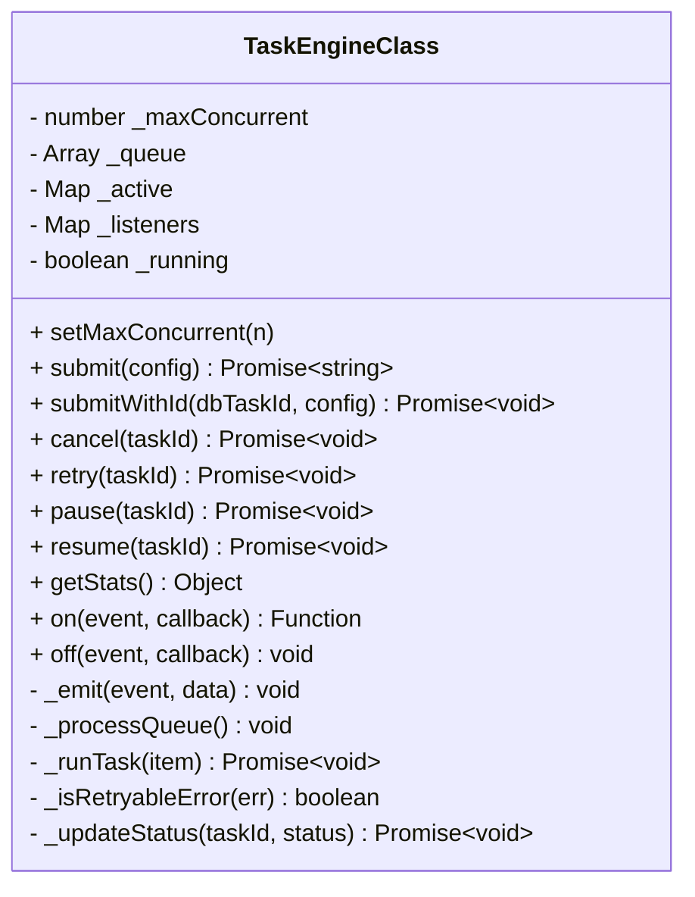
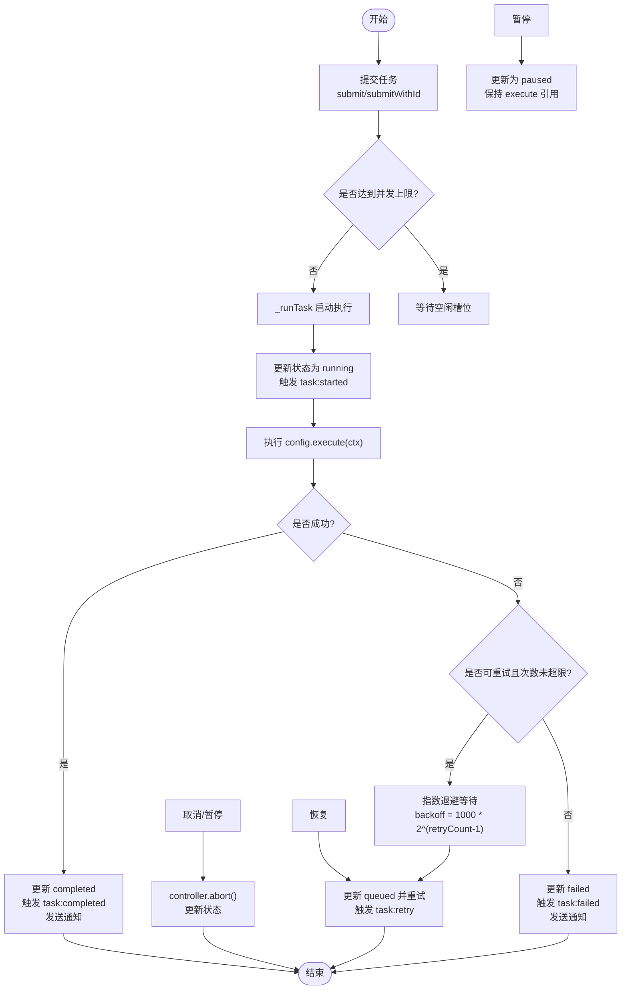
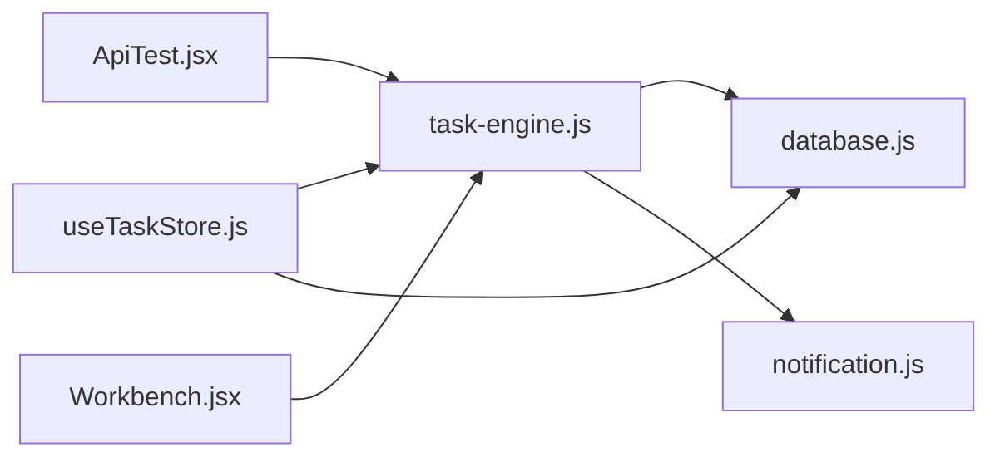

# 任务引擎核心

<cite>
**本文引用的文件**
- [task-engine.js](file://app/src/services/task-engine.js)
- [useTaskStore.js](file://app/src/stores/useTaskStore.js)
- [database.js](file://app/src/db/database.js)
- [notification.js](file://app/src/services/notification.js)
- [ApiTest.jsx](file://app/src/pages/ApiTest.jsx)
- [Workbench.jsx](file://app/src/pages/Workbench.jsx)
</cite>

## 更新摘要
**变更内容**
- 增强了并发控制机制，支持动态配置最大并发数
- 实现了完整的FIFO队列处理算法，确保任务执行顺序
- 添加了指数退避重试逻辑，自动处理网络错误和服务器错误
- 完善了状态机转换，支持任务的暂停、恢复和重新入队
- 增强了事件驱动架构，提供更细粒度的任务生命周期监控

## 目录
1. [简介](#简介)
2. [项目结构](#项目结构)
3. [核心组件](#核心组件)
4. [架构总览](#架构总览)
5. [详细组件分析](#详细组件分析)
6. [依赖关系分析](#依赖关系分析)
7. [性能考量](#性能考量)
8. [故障排查指南](#故障排查指南)
9. [结论](#结论)
10. [附录：使用示例与最佳实践](#附录使用示例与最佳实践)

## 简介
本文件聚焦 AI Image Studio 的任务引擎核心模块，围绕 TaskEngineClass 的架构设计、单例模式实现、构造函数初始化与属性管理展开，深入解析任务提交机制（submit 与 submitWithId）、任务执行上下文（ctx）的设计（AbortController 信号传递、进度回调、任务 ID 管理），以及任务生命周期管理的内部实现（队列处理算法、活动任务跟踪、事件发射器机制）。同时提供具体代码路径的使用示例，帮助读者正确进行异步任务调度。

**更新** 现在支持可配置的并行度、FIFO 队列处理、指数退避重试逻辑和全面的状态机转换。

## 项目结构
任务引擎位于 services 层，通过 stores 层桥接 UI 状态，持久化由 db 层负责，通知能力由 notification 服务提供。页面组件通过 store 或引擎 API 发起任务。



**图表来源**
- [task-engine.js:1-319](file://app/src/services/task-engine.js#L1-L319)
- [useTaskStore.js:1-173](file://app/src/stores/useTaskStore.js#L1-L173)
- [database.js:1-348](file://app/src/db/database.js#L1-L348)
- [notification.js:1-113](file://app/src/services/notification.js#L1-L113)
- [ApiTest.jsx:90-183](file://app/src/pages/ApiTest.jsx#L90-L183)
- [Workbench.jsx:395-423](file://app/src/pages/Workbench.jsx#L395-L423)

**章节来源**
- [task-engine.js:1-319](file://app/src/services/task-engine.js#L1-L319)
- [useTaskStore.js:1-173](file://app/src/stores/useTaskStore.js#L1-L173)
- [database.js:1-348](file://app/src/db/database.js#L1-L348)
- [notification.js:1-113](file://app/src/services/notification.js#L1-L113)
- [ApiTest.jsx:90-183](file://app/src/pages/ApiTest.jsx#L90-L183)
- [Workbench.jsx:395-423](file://app/src/pages/Workbench.jsx#L395-L423)

## 核心组件
- **TaskEngineClass**：后台任务调度器，采用单例导出，提供并发控制、FIFO 队列、指数退避重试、状态机、事件发射器、进度追踪与自动持久化等能力。
- **useTaskStore**：Zustand 状态存储，桥接 TaskEngine 事件到 UI 状态，提供任务增删改查、重试、取消、暂停、恢复等操作。
- **database**：基于 Dexie 的 IndexedDB 封装，提供 tasks 表的 CRUD 与统计接口。
- **notification**：浏览器通知封装，在任务完成或失败时推送系统通知。

**更新** 新增了可配置的并发控制和智能重试机制。

**章节来源**
- [task-engine.js:33-40](file://app/src/services/task-engine.js#L33-L40)
- [useTaskStore.js:14-172](file://app/src/stores/useTaskStore.js#L14-L172)
- [database.js:244-283](file://app/src/db/database.js#L244-L283)
- [notification.js:78-103](file://app/src/services/notification.js#L78-L103)

## 架构总览
任务从页面触发，经 TaskEngine 入队并调度执行；执行过程中通过 ctx 暴露的信号与进度回调与外部 API 交互；任务状态变更通过事件驱动更新 Zustand 状态，最终反映到 UI。

```mermaid
sequenceDiagram
participant UI as "页面组件"
participant Store as "useTaskStore"
participant Engine as "TaskEngine"
participant DB as "database"
participant Notify as "notification"
UI->>Engine : "submit(config)"
Engine->>DB : "addTask(queued)"
Engine-->>UI : "返回 taskId"
Engine->>Engine : "_processQueue()"
Engine->>DB : "updateTask(running)"
Engine-->>Store : "事件 task : started"
Store->>DB : "loadTasks() 刷新列表"
Engine->>DB : "updateTask(progress)"
Engine-->>Store : "事件 task : progress"
Store->>DB : "loadTasks() 刷新列表"
alt 成功
Engine->>DB : "updateTask(completed, result)"
Engine-->>Notify : "notifyTaskComplete"
Engine-->>Store : "事件 task : completed"
else 失败
Engine->>DB : "检查是否可重试"
opt 可重试且次数未超限
Engine->>Engine : "指数退避等待"
Engine->>DB : "updateTask(queued)"
Engine-->>Store : "事件 task : retry"
Engine->>Engine : "重新入队执行"
else 不可重试或超限
Engine->>DB : "updateTask(failed/error)"
Engine-->>Notify : "notifyTaskFailed"
Engine-->>Store : "事件 task : failed"
end
end
```

**图表来源**
- [task-engine.js:57-92](file://app/src/services/task-engine.js#L57-L92)
- [task-engine.js:215-297](file://app/src/services/task-engine.js#L215-L297)
- [useTaskStore.js:39-64](file://app/src/stores/useTaskStore.js#L39-L64)
- [database.js:244-283](file://app/src/db/database.js#L244-L283)
- [notification.js:78-103](file://app/src/services/notification.js#L78-L103)

## 详细组件分析

### TaskEngineClass 类设计与单例
- **单例模式**：模块末尾以 new TaskEngineClass() 导出单例实例，全局共享同一份队列与活动任务表。
- **构造函数初始化**：
  - `_maxConcurrent`：最大并发数，默认 3，可通过 setMaxConcurrent 动态调整。
  - `_queue`：FIFO 队列，元素包含 { taskId, config, resolve, reject }。
  - `_active`：Map 记录当前运行中的任务，键为 taskId，值为 { config, controller, resolve, reject }。
  - `_listeners`：事件监听器集合，支持 on/off/_emit。
  - `_running`：内部标记位。
- **关键属性职责**：
  - **并发控制**：_processQueue 循环检查 active.size < maxConcurrent 且 queue.length > 0，满足条件则出队执行。
  - **活动跟踪**：_active 保证可取消、暂停、清理资源。
  - **事件总线**：统一分发任务生命周期事件，供 store 订阅刷新 UI。

**更新** 新增了动态并发控制能力，支持运行时调整最大并发数。



**图表来源**
- [task-engine.js:33-40](file://app/src/services/task-engine.js#L33-L40)
- [task-engine.js:44-48](file://app/src/services/task-engine.js#L44-L48)
- [task-engine.js:57-92](file://app/src/services/task-engine.js#L57-L92)
- [task-engine.js:94-178](file://app/src/services/task-engine.js#L94-L178)
- [task-engine.js:189-211](file://app/src/services/task-engine.js#L189-L211)
- [task-engine.js:215-313](file://app/src/services/task-engine.js#L215-L313)

**章节来源**
- [task-engine.js:33-40](file://app/src/services/task-engine.js#L33-L40)
- [task-engine.js:316-319](file://app/src/services/task-engine.js#L316-L319)

### 任务提交机制：submit 与 submitWithId
- **submit(config)**
  - 生成 UUID 作为 taskId。
  - 持久化任务记录至数据库，初始状态 queued。
  - 将任务项推入队列，触发 task:queued 事件，并尝试调度执行。
  - 返回 Promise，resolve/reject 由执行结果决定。
- **submitWithId(dbTaskId, config)**
  - 用于与 store 集成：先由 store 写入数据库并拿到 id，再将该 id 交给引擎入队。
  - 直接入队并触发事件，不再生成新 UUID。

**配置对象结构要点**
- `type`：任务类型，如 'generation'、'test' 等。
- `model`：模型标识，如 'gpt-image-2'、'qwen-image-3'。
- `prompt`：提示词文本。
- `params`：业务参数，如尺寸、数量等。
- `execute`：异步函数，接收 ctx，返回结果。

**UUID 生成策略**
- 使用 uuid v4 生成唯一任务 ID，确保跨会话稳定标识。

**数据库持久化流程**
- addTask：插入任务记录，设置默认字段（status=queued、createdAt=now 等）。
- updateTask：在执行各阶段更新状态、进度、错误信息、结果等。

**章节来源**
- [task-engine.js:57-92](file://app/src/services/task-engine.js#L57-L92)
- [database.js:244-250](file://app/src/db/database.js#L244-L250)

### 任务执行上下文（ctx）设计
- **signal**：AbortController.signal，用于在取消/暂停时中断底层请求。
- **taskId**：当前任务的唯一标识，便于日志与调试。
- **onProgress(percent)**：进度回调，内部会持久化 progress 并广播 task:progress 事件。

**注意**
- 调用方应在网络请求中使用 ctx.signal 作为 abort 信号源，并在合适时机调用 ctx.onProgress 上报进度。

**章节来源**
- [task-engine.js:229-237](file://app/src/services/task-engine.js#L229-L237)

### 任务生命周期与状态机
- **状态定义与合法转换**：
  - queued -> running | cancelled | paused
  - running -> completed | failed | cancelled
  - paused -> queued | cancelled
  - failed -> queued（重试）
  - completed：终态
  - cancelled：可重新入队
- **关键流程**：
  - **入队**：submit/submitWithId/retry/resume 将任务置为 queued 并触发事件。
  - **启动**：_processQueue 取出任务，更新为 running，触发 started。
  - **执行**：调用 config.execute(ctx)，根据结果更新 completed/failed。
  - **取消/暂停**：cancel/pause 对活跃任务调用 controller.abort()，对排队任务移除或标记 paused。
  - **重试**：retry 读取任务记录，校验状态后重置计数并重新入队。
  - **恢复**：resume 仅将 paused 任务置回 queued，execute 引用不会保留，需上层重新提交。

**更新** 新增了暂停/恢复功能和更完善的状态转换验证。



**图表来源**
- [task-engine.js:24-31](file://app/src/services/task-engine.js#L24-L31)
- [task-engine.js:215-297](file://app/src/services/task-engine.js#L215-L297)

**章节来源**
- [task-engine.js:24-31](file://app/src/services/task-engine.js#L24-L31)
- [task-engine.js:215-297](file://app/src/services/task-engine.js#L215-L297)

### 队列处理算法与活动任务跟踪
- **队列处理算法**：
  - _processQueue 使用 while 循环，只要 active.size < maxConcurrent 且 queue.length > 0，就 shift 一个任务并执行 _runTask。
  - 该算法简单高效，保证 FIFO 顺序与并发上限。
- **活动任务跟踪**：
  - _active Map 维护每个正在运行的任务及其控制器、Promise 句柄。
  - 取消/暂停时通过 Map 快速定位并中止，避免悬挂任务。

**更新** 优化了队列处理算法，支持动态并发调整。

**章节来源**
- [task-engine.js:215-220](file://app/src/services/task-engine.js#L215-L220)
- [task-engine.js:222-227](file://app/src/services/task-engine.js#L222-L227)

### 指数退避重试逻辑
- **重试条件判断**：
  - 检查错误是否为可重试类型（5xx 服务器错误、网络错误、超时等）。
  - 验证重试次数是否超过最大限制（默认 3 次）。
- **指数退避算法**：
  - 计算公式：backoff = 1000 * Math.pow(2, retryCount - 1)
  - 第 1 次重试：1 秒延迟
  - 第 2 次重试：2 秒延迟  
  - 第 3 次重试：4 秒延迟
- **重试流程**：
  - 更新任务状态为 queued
  - 增加 retryCount
  - 触发 task:retry 事件
  - 重新入队等待执行

**新增** 这是全新的智能重试机制，提高了系统的健壮性。

**章节来源**
- [task-engine.js:265-282](file://app/src/services/task-engine.js#L265-L282)
- [task-engine.js:299-305](file://app/src/services/task-engine.js#L299-L305)

### 事件发射器机制
- **on/off/_emit** 实现轻量级发布订阅：
  - on 注册事件回调，返回注销函数。
  - off 删除指定回调。
  - _emit 遍历回调集合并安全调用，捕获异常避免影响主流程。
- **主要事件**：
  - task:queued、task:started、task:progress、task:completed、task:failed、task:cancelled、task:paused、task:retry。
- **与 store 的桥接**：
  - useTaskStore.initBridge 订阅所有事件，统一刷新任务列表，保持 UI 实时性。

**更新** 新增了 task:paused 和 task:retry 事件类型。

**章节来源**
- [task-engine.js:189-211](file://app/src/services/task-engine.js#L189-L211)
- [useTaskStore.js:39-64](file://app/src/stores/useTaskStore.js#L39-L64)

## 依赖关系分析
- **TaskEngine 依赖**：
  - database：任务持久化（addTask/updateTask/getTask 等）。
  - notification：完成/失败通知。
  - uuid：生成任务 ID。
- **useTaskStore 依赖**：
  - TaskEngine：调用 cancel/retry/pause/resume 等。
  - database：读写任务数据。
- **页面组件依赖**：
  - ApiTest.jsx、Workbench.jsx 通过 TaskEngine.submit 提交任务。



**图表来源**
- [task-engine.js:14-16](file://app/src/services/task-engine.js#L14-L16)
- [useTaskStore.js:10-12](file://app/src/stores/useTaskStore.js#L10-12)
- [ApiTest.jsx:11](file://app/src/pages/ApiTest.jsx#L11)
- [Workbench.jsx:15](file://app/src/pages/Workbench.jsx#L15)

**章节来源**
- [task-engine.js:14-16](file://app/src/services/task-engine.js#L14-L16)
- [useTaskStore.js:10-12](file://app/src/stores/useTaskStore.js#L10-12)
- [ApiTest.jsx:11](file://app/src/pages/ApiTest.jsx#L11)
- [Workbench.jsx:15](file://app/src/pages/Workbench.jsx#L15)

## 性能考量
- **并发控制**：默认 3 个并发，可根据后端限流与前端负载通过 setMaxConcurrent 调优。
- **队列复杂度**：shift 操作 O(1)，整体调度为线性扫描，适合中等规模任务。
- **重试退避**：指数退避降低瞬时压力，最大重试次数 3，避免无限重试。
- **事件刷新**：store 每次事件都 loadTasks 全量刷新，任务量大时可考虑增量更新或局部状态优化。
- **通知开销**：仅在完成/失败时触发，频率可控。

**更新** 新增了动态并发调整和智能重试的性能优化。

## 故障排查指南
- **任务无法启动**
  - 检查并发上限是否过小，确认 _processQueue 是否被调用。
  - 查看数据库任务状态是否为 queued。
- **任务被意外取消**
  - 检查是否有 cancel/pause 调用，确认 controller.abort() 是否被触发。
- **进度不更新**
  - 确认 execute 中是否调用 ctx.onProgress，且返回值未被忽略。
- **重试未生效**
  - 检查错误是否被判定为可重试（_isRetryableError），以及 retryCount 是否超过上限。
- **UI 不同步**
  - 确认 initBridge 已调用，事件订阅正常，loadTasks 能拉取最新数据。
- **任务卡住**
  - 检查是否有任务处于 paused 状态，需要手动 resume。
  - 确认活动任务 Map 中没有悬挂的任务引用。

**更新** 新增了任务暂停相关的故障排查指导。

**章节来源**
- [task-engine.js:299-305](file://app/src/services/task-engine.js#L299-L305)
- [useTaskStore.js:39-64](file://app/src/stores/useTaskStore.js#L39-L64)

## 结论
TaskEngineClass 以简洁而稳健的方式实现了后台任务调度：单例保障全局一致性，FIFO 队列与并发上限控制吞吐，状态机与事件驱动确保可观测性与可维护性，结合 IndexedDB 持久化与浏览器通知形成完整闭环。配合 useTaskStore 的事件桥接，UI 能够实时响应任务变化。建议在生产环境中根据后端限流与用户体验调优并发与重试策略，并对高频事件刷新做增量优化。

**更新** 现在具备更强的容错能力和更好的用户体验，包括智能重试、任务暂停恢复等功能。

## 附录：使用示例与最佳实践

### 基本用法：提交任务并获取结果
- **参考路径**
  - [ApiTest.jsx:93-107](file://app/src/pages/ApiTest.jsx#L93-L107)
  - [ApiTest.jsx:126-140](file://app/src/pages/ApiTest.jsx#L126-L140)
  - [ApiTest.jsx:159-173](file://app/src/pages/ApiTest.jsx#L159-L173)
- **要点**
  - 传入 type/model/prompt/params/execute。
  - 在 execute 中使用 ctx.signal 与 ctx.onProgress。
  - await 返回结果，处理成功/失败分支。

### 工作流集成：在画布操作中提交任务
- **参考路径**
  - [Workbench.jsx:399-406](file://app/src/pages/Workbench.jsx#L399-L406)
- **要点**
  - 构建 execute 函数，封装业务逻辑。
  - 将结果写回本地状态，展示给用户。

### 与 Store 协作：先入库再入队
- **参考路径**
  - [useTaskStore.js:67-87](file://app/src/stores/useTaskStore.js#L67-L87)
  - [useTaskStore.js:109-124](file://app/src/stores/useTaskStore.js#L109-L124)
- **要点**
  - 使用 addTask 创建记录并获取 id。
  - 使用 submitWithId 将已有 id 的任务入队。
  - 通过 retryTask/cancelTask/pauseTask/resumeTask 统一管理。

### 高级用法：动态并发控制
- **配置最大并发数**
  ```javascript
  // 应用启动时配置
  TaskEngine.setMaxConcurrent(5); // 设置为 5 个并发
  
  // 根据用户设置动态调整
  const userSettings = await getUserSettings();
  TaskEngine.setMaxConcurrent(userSettings.maxConcurrent || 3);
  ```

### 任务暂停与恢复
- **暂停任务**
  ```javascript
  // 暂停正在执行的任务
  await TaskEngine.pause(taskId);
  
  // 暂停排队中的任务
  await TaskEngine.pause(taskId);
  ```
- **恢复任务**
  ```javascript
  // 恢复暂停的任务
  await TaskEngine.resume(taskId);
  ```

### 最佳实践清单
- 始终在异步 I/O 中检查 ctx.signal.aborted，及时退出。
- 合理设置 onProgress 粒度，避免频繁 IO 与事件风暴。
- 对可重试错误进行分类，减少不必要的重试。
- 在应用启动时调用 store.initBridge，确保事件与 UI 同步。
- 根据后端限流调整 setMaxConcurrent，平衡吞吐与稳定性。
- 利用指数退避重试机制提高系统健壮性。
- 合理使用任务暂停/恢复功能提升用户体验。

**更新** 新增了动态并发控制和任务暂停恢复的最佳实践。

**章节来源**
- [ApiTest.jsx:93-107](file://app/src/pages/ApiTest.jsx#L93-L107)
- [ApiTest.jsx:126-140](file://app/src/pages/ApiTest.jsx#L126-L140)
- [ApiTest.jsx:159-173](file://app/src/pages/ApiTest.jsx#L159-L173)
- [Workbench.jsx:399-406](file://app/src/pages/Workbench.jsx#L399-L406)
- [useTaskStore.js:67-87](file://app/src/stores/useTaskStore.js#L67-L87)
- [useTaskStore.js:109-124](file://app/src/stores/useTaskStore.js#L109-L124)