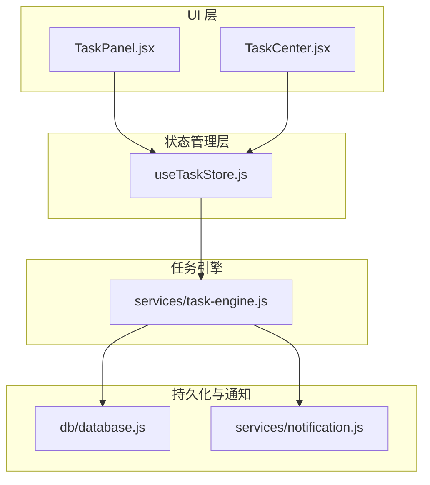
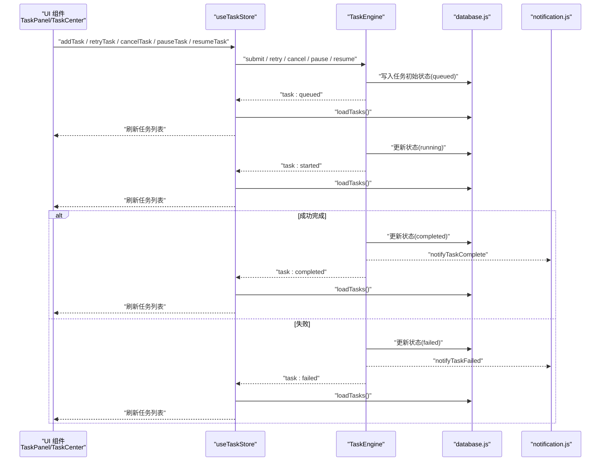
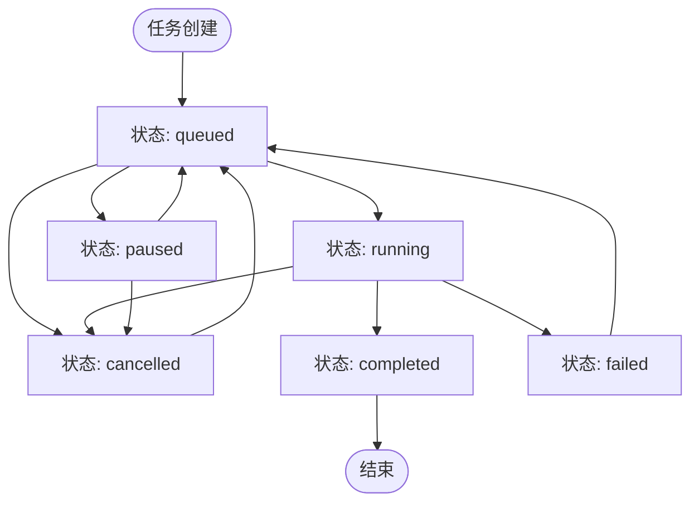
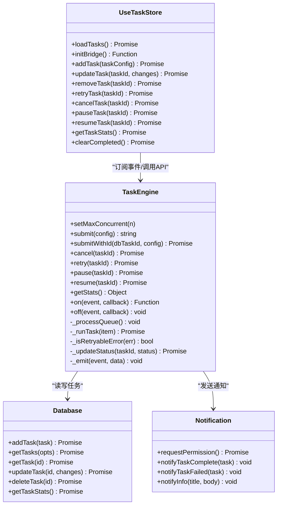

# 任务状态机

<cite>
**本文引用的文件**   
- [task-engine.js](file://app/src/services/task-engine.js)
- [useTaskStore.js](file://app/src/stores/useTaskStore.js)
- [database.js](file://app/src/db/database.js)
- [notification.js](file://app/src/services/notification.js)
- [TaskPanel.jsx](file://app/src/components/TaskPanel.jsx)
- [TaskCenter.jsx](file://app/src/pages/TaskCenter.jsx)
</cite>

## 目录
1. [简介](#简介)
2. [项目结构](#项目结构)
3. [核心组件](#核心组件)
4. [架构总览](#架构总览)
5. [详细组件分析](#详细组件分析)
6. [依赖关系分析](#依赖关系分析)
7. [性能考量](#性能考量)
8. [故障排查指南](#故障排查指南)
9. [结论](#结论)
10. [附录](#附录)

## 简介
本文件为 AI Image Studio 的任务状态机系统提供深入文档，覆盖以下要点：
- 六种任务状态的完整定义与转换规则：queued、running、completed、failed、cancelled、paused
- VALID_TRANSITIONS 常量表的设计原理与允许的状态转换路径
- 状态验证机制与 _updateStatus 方法的实现逻辑和错误处理策略
- 状态变更事件通知机制及触发时机、数据载荷（如 task:queued、task:started、task:completed、task:failed、task:cancelled、task:paused）
- 状态转换流程图与实际使用场景的代码示例路径，展示如何在业务逻辑中正确处理任务状态变化

## 项目结构
任务状态机相关代码主要分布在服务层、存储层、数据库层以及 UI 组件层：
- 服务层：任务调度与状态机核心（TaskEngine）
- 存储层：Zustand Store 桥接引擎事件到 UI 状态
- 数据库层：IndexedDB 持久化任务记录
- 通知层：浏览器通知封装
- UI 层：任务面板与任务中心页面按状态分组展示

图表来源
- [task-engine.js:1-319](file://app/src/services/task-engine.js#L1-L319)
- [useTaskStore.js:1-173](file://app/src/stores/useTaskStore.js#L1-L173)
- [database.js:1-339](file://app/src/db/database.js#L1-L339)
- [notification.js:1-113](file://app/src/services/notification.js#L1-L113)
- [TaskPanel.jsx:1-538](file://app/src/components/TaskPanel.jsx#L1-L538)
- [TaskCenter.jsx:1-120](file://app/src/pages/TaskCenter.jsx#L1-L120)

章节来源
- [task-engine.js:1-319](file://app/src/services/task-engine.js#L1-L319)
- [useTaskStore.js:1-173](file://app/src/stores/useTaskStore.js#L1-L173)
- [database.js:1-339](file://app/src/db/database.js#L1-L339)
- [notification.js:1-113](file://app/src/services/notification.js#L1-L113)
- [TaskPanel.jsx:1-538](file://app/src/components/TaskPanel.jsx#L1-L538)
- [TaskCenter.jsx:1-120](file://app/src/pages/TaskCenter.jsx#L1-L120)

## 核心组件
- 任务引擎（TaskEngine）：单例类，负责任务入队、并发控制、执行生命周期、重试退避、状态更新与事件广播。
- 任务存储（useTaskStore）：将 TaskEngine 的事件桥接到 Zustand 状态，驱动 UI 实时更新。
- 数据库（database.js）：基于 Dexie 的 IndexedDB 封装，提供任务的增删改查与统计。
- 通知（notification.js）：浏览器通知 API 封装，用于任务完成或失败时的用户提醒。
- UI 组件（TaskPanel、TaskCenter）：根据任务状态进行分组展示并提供操作入口（暂停、继续、取消、重试）。

章节来源
- [task-engine.js:1-319](file://app/src/services/task-engine.js#L1-L319)
- [useTaskStore.js:1-173](file://app/src/stores/useTaskStore.js#L1-L173)
- [database.js:1-339](file://app/src/db/database.js#L1-L339)
- [notification.js:1-113](file://app/src/services/notification.js#L1-L113)
- [TaskPanel.jsx:1-538](file://app/src/components/TaskPanel.jsx#L1-L538)
- [TaskCenter.jsx:1-120](file://app/src/pages/TaskCenter.jsx#L1-L120)

## 架构总览
下图展示了从 UI 发起任务到状态流转、持久化与通知的整体流程。

图表来源
- [task-engine.js:57-116](file://app/src/services/task-engine.js#L57-L116)
- [task-engine.js:222-297](file://app/src/services/task-engine.js#L222-L297)
- [useTaskStore.js:39-64](file://app/src/stores/useTaskStore.js#L39-L64)
- [database.js:235-274](file://app/src/db/database.js#L235-L274)
- [notification.js:78-103](file://app/src/services/notification.js#L78-L103)

## 详细组件分析

### 状态定义与转换规则
- 状态集合：queued、running、completed、failed、cancelled、paused
- 转换规则由 VALID_TRANSITIONS 常量表定义，表示每个状态下允许的目标状态集合：
  - queued → running | cancelled | paused
  - running → completed | failed | cancelled
  - paused → queued | cancelled
  - failed → queued（重试）
  - completed → （无后续转换）
  - cancelled → queued（重新排队）

设计原则：
- 明确“终态”：completed 不可再转换，避免误操作导致状态回滚。
- 支持“可恢复态”：failed 与 cancelled 可通过特定动作回到 queued，便于重试与重排。
- 支持“暂停态”：paused 作为中间态，允许在运行或排队时暂停，并在需要时恢复。

章节来源
- [task-engine.js:24-31](file://app/src/services/task-engine.js#L24-L31)

### 状态验证机制与 _updateStatus 方法
- 当前实现中，VALID_TRANSITIONS 定义了合法转换表，但 _updateStatus 仅负责将新状态写入数据库，并未对“当前状态→目标状态”的合法性进行校验。
- _updateStatus 的错误处理策略：捕获数据库写入异常并输出日志，不向上抛出，保证任务主流程不被阻塞。

建议改进：
- 在 _updateStatus 中加入状态合法性校验，若非法转换则拒绝更新并抛出错误，同时发出告警事件，便于上层统一处理。
- 在关键路径（cancel、pause、resume、retry）调用前增加前置条件检查，减少非法状态组合导致的副作用。

章节来源
- [task-engine.js:307-313](file://app/src/services/task-engine.js#L307-L313)

### 事件通知机制
TaskEngine 通过内部事件发射器广播状态变更，useTaskStore 订阅这些事件并刷新任务列表，从而驱动 UI 实时响应。

事件清单与触发时机：
- task:queued：任务入队时触发（提交或重试后），载荷包含 taskId
- task:started：任务开始执行时触发，载荷包含 taskId
- task:progress：进度上报时触发，载荷包含 taskId 与 progress
- task:completed：任务成功完成时触发，载荷包含 taskId 与 result
- task:failed：任务失败时触发，载荷包含 taskId 与 error
- task:cancelled：任务被取消时触发，载荷包含 taskId
- task:paused：任务被暂停时触发，载荷包含 taskId
- task:retry：自动重试时触发，载荷包含 taskId 与 retryCount

数据载荷说明：
- taskId：唯一标识任务
- result：成功结果对象（例如生成的图片信息）
- error：失败原因对象（通常为 Error 实例）
- progress：进度百分比（0-100）
- retryCount：重试次数

章节来源
- [task-engine.js:78-92](file://app/src/services/task-engine.js#L78-L92)
- [task-engine.js:101-116](file://app/src/services/task-engine.js#L101-L116)
- [task-engine.js:142-146](file://app/src/services/task-engine.js#L142-L146)
- [task-engine.js:162-165](file://app/src/services/task-engine.js#L162-L165)
- [task-engine.js:172-178](file://app/src/services/task-engine.js#L172-L178)
- [task-engine.js:226-228](file://app/src/services/task-engine.js#L226-L228)
- [task-engine.js:254-257](file://app/src/services/task-engine.js#L254-L257)
- [task-engine.js:280-291](file://app/src/services/task-engine.js#L280-L291)
- [useTaskStore.js:45-56](file://app/src/stores/useTaskStore.js#L45-L56)

### 状态转换流程图

图表来源
- [task-engine.js:24-31](file://app/src/services/task-engine.js#L24-L31)

### 实际使用场景与代码示例路径
- 提交任务并监听事件：
  - 参考路径：[task-engine.js:57-81](file://app/src/services/task-engine.js#L57-L81)、[useTaskStore.js:39-64](file://app/src/stores/useTaskStore.js#L39-L64)
- 取消任务：
  - 参考路径：[task-engine.js:95-116](file://app/src/services/task-engine.js#L95-L116)、[useTaskStore.js:127-135](file://app/src/stores/useTaskStore.js#L127-L135)
- 暂停与恢复任务：
  - 参考路径：[task-engine.js:148-178](file://app/src/services/task-engine.js#L148-L178)、[useTaskStore.js:137-157](file://app/src/stores/useTaskStore.js#L137-L157)
- 重试失败任务：
  - 参考路径：[task-engine.js:118-146](file://app/src/services/task-engine.js#L118-L146)、[useTaskStore.js:109-124](file://app/src/stores/useTaskStore.js#L109-L124)
- UI 按状态分组展示与操作：
  - 参考路径：[TaskPanel.jsx:30-37](file://app/src/components/TaskPanel.jsx#L30-L37)、[TaskCenter.jsx:43-53](file://app/src/pages/TaskCenter.jsx#L43-L53)

章节来源
- [task-engine.js:57-178](file://app/src/services/task-engine.js#L57-L178)
- [useTaskStore.js:39-157](file://app/src/stores/useTaskStore.js#L39-L157)
- [TaskPanel.jsx:30-37](file://app/src/components/TaskPanel.jsx#L30-L37)
- [TaskCenter.jsx:43-53](file://app/src/pages/TaskCenter.jsx#L43-L53)

## 依赖关系分析
- TaskEngine 依赖 database.js 进行任务持久化，依赖 notification.js 发送浏览器通知。
- useTaskStore 依赖 TaskEngine 的事件系统与 database.js 的数据读取。
- UI 组件依赖 useTaskStore 提供的状态与操作方法。

图表来源
- [task-engine.js:33-319](file://app/src/services/task-engine.js#L33-L319)
- [useTaskStore.js:14-173](file://app/src/stores/useTaskStore.js#L14-L173)
- [database.js:235-274](file://app/src/db/database.js#L235-L274)
- [notification.js:19-113](file://app/src/services/notification.js#L19-L113)

章节来源
- [task-engine.js:33-319](file://app/src/services/task-engine.js#L33-L319)
- [useTaskStore.js:14-173](file://app/src/stores/useTaskStore.js#L14-L173)
- [database.js:235-274](file://app/src/db/database.js#L235-L274)
- [notification.js:19-113](file://app/src/services/notification.js#L19-L113)

## 性能考量
- 并发控制：默认最大并发数为 3，可通过 setMaxConcurrent 调整，避免过多任务同时执行导致资源争用。
- 队列处理：FIFO 队列配合 _processQueue 循环出队，确保任务有序执行。
- 重试退避：指数退避策略（最大 3 次重试）降低瞬时失败对系统的冲击。
- 事件刷新：useTaskStore 在每次事件后调用 loadTasks 全量刷新，适合中小规模任务；当任务量较大时可考虑增量更新以减少 IO 压力。

章节来源
- [task-engine.js:35-40](file://app/src/services/task-engine.js#L35-L40)
- [task-engine.js:215-220](file://app/src/services/task-engine.js#L215-L220)
- [task-engine.js:269-282](file://app/src/services/task-engine.js#L269-L282)
- [useTaskStore.js:45-56](file://app/src/stores/useTaskStore.js#L45-L56)

## 故障排查指南
- 状态未更新：检查 _updateStatus 是否抛出异常或被吞掉；确认数据库写入是否成功。
- 事件未触发：确认 TaskEngine.on 是否正确注册，且 initBridge 已调用。
- 任务无法取消：检查任务是否在 active 或 queue 中；确认控制器 abort 是否生效。
- 重试未生效：查看 _isRetryableError 的判断逻辑，确认错误类型是否符合网络错误或 5xx 状态码。
- UI 不同步：确认 useTaskStore 的事件订阅是否初始化，以及 loadTasks 是否被正确调用。

章节来源
- [task-engine.js:307-313](file://app/src/services/task-engine.js#L307-L313)
- [useTaskStore.js:39-64](file://app/src/stores/useTaskStore.js#L39-L64)
- [task-engine.js:95-116](file://app/src/services/task-engine.js#L95-L116)
- [task-engine.js:299-305](file://app/src/services/task-engine.js#L299-L305)

## 结论
AI Image Studio 的任务状态机以 TaskEngine 为核心，结合 useTaskStore 的事件桥接与 database.js 的持久化能力，实现了清晰、可扩展的任务生命周期管理。通过 VALID_TRANSITIONS 定义的转换规则与丰富的事件体系，系统能够稳定地支撑图像生成等异步任务的编排与监控。建议在 _updateStatus 中引入状态合法性校验，进一步提升健壮性与可观测性。

## 附录
- 状态与事件对照表（摘要）
  - queued：入队时触发 task:queued
  - running：开始执行时触发 task:started
  - completed：成功完成时触发 task:completed
  - failed：失败时触发 task:failed
  - cancelled：取消时触发 task:cancelled
  - paused：暂停时触发 task:paused
  - progress：进度上报时触发 task:progress
  - retry：自动重试时触发 task:retry

章节来源
- [task-engine.js:78-92](file://app/src/services/task-engine.js#L78-L92)
- [task-engine.js:226-228](file://app/src/services/task-engine.js#L226-L228)
- [task-engine.js:254-257](file://app/src/services/task-engine.js#L254-L257)
- [task-engine.js:280-291](file://app/src/services/task-engine.js#L280-L291)
- [useTaskStore.js:45-56](file://app/src/stores/useTaskStore.js#L45-L56)