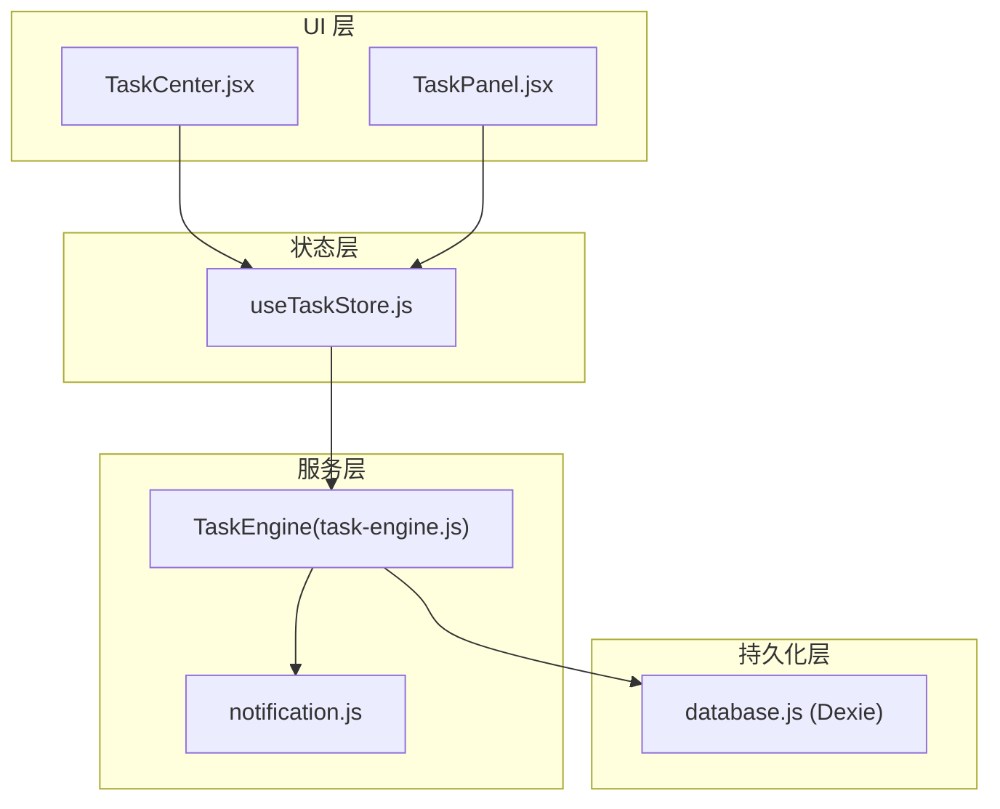
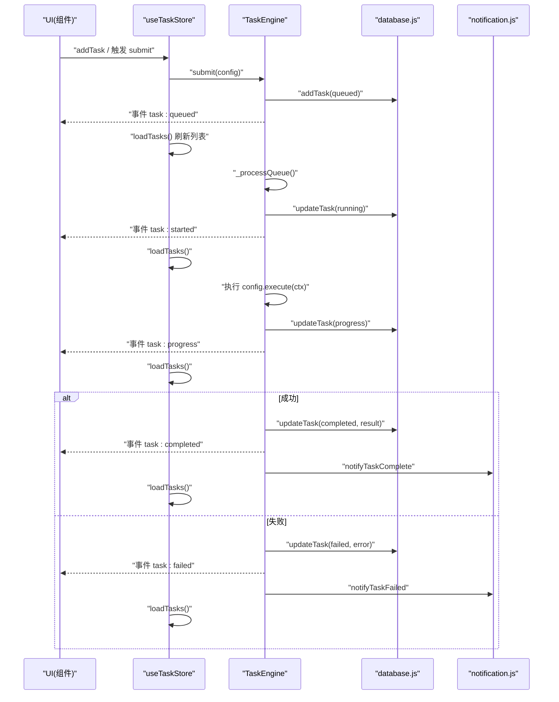
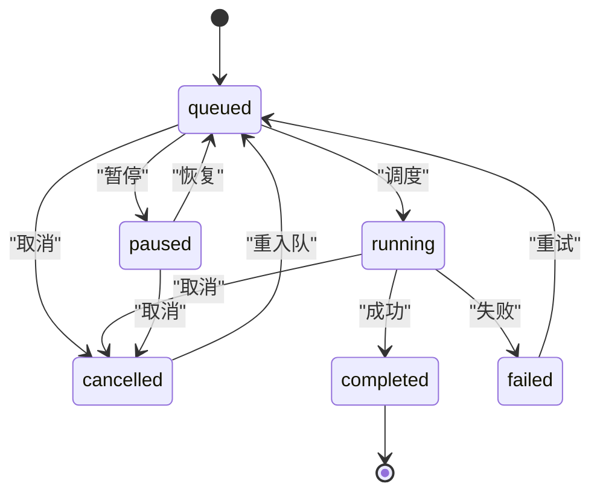
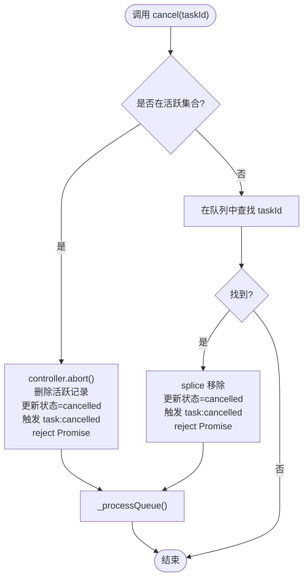
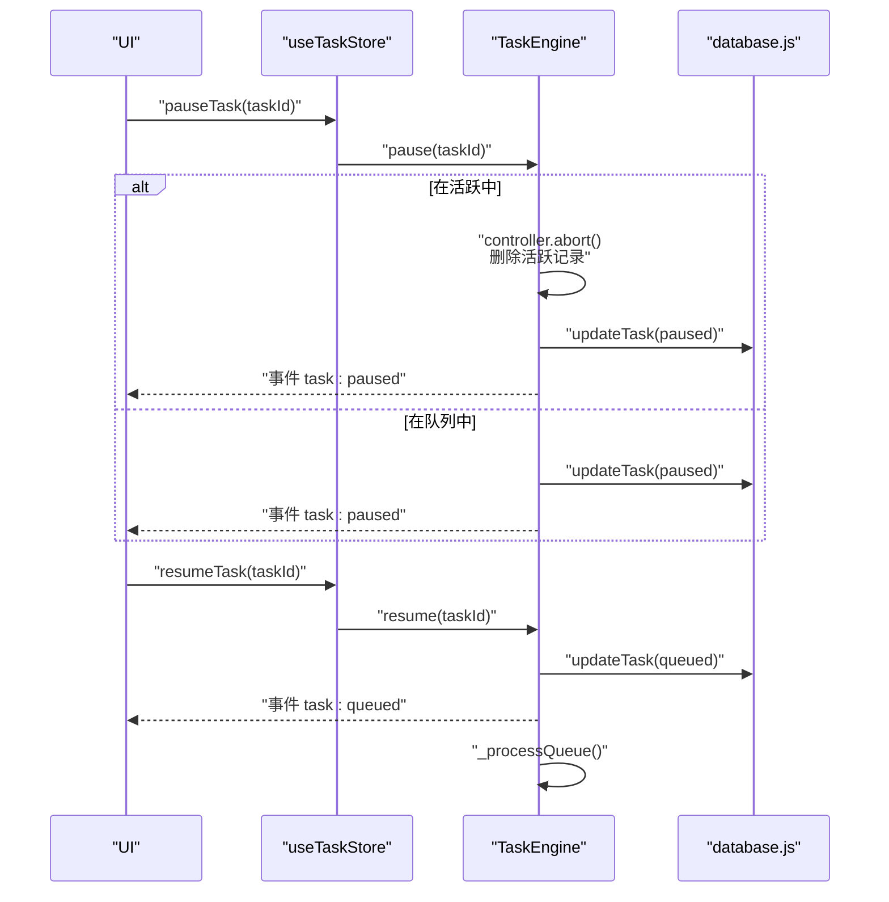
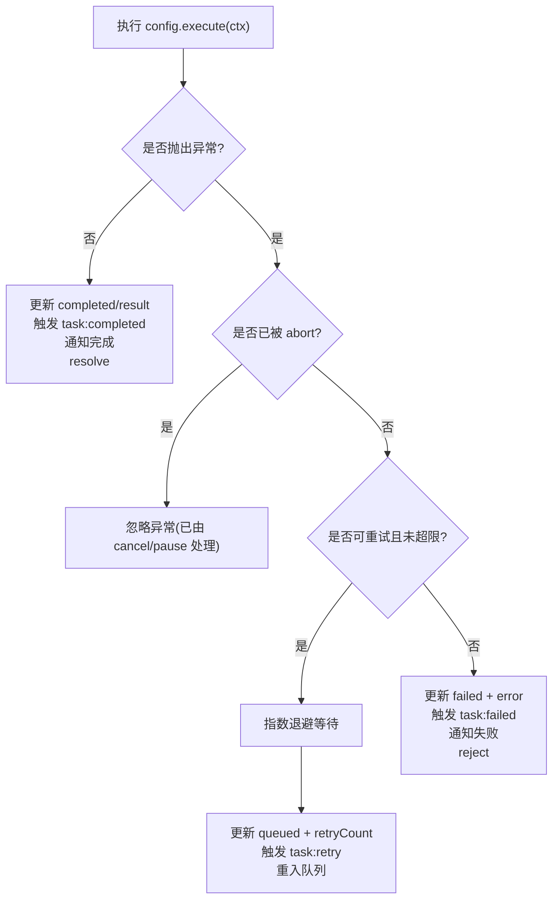
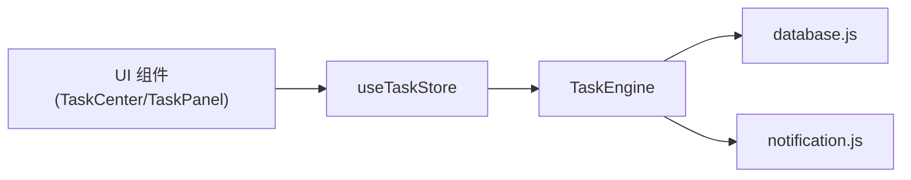

# 任务生命周期管理

<cite>
**本文引用的文件**   
- [task-engine.js](file://app/src/services/task-engine.js)
- [useTaskStore.js](file://app/src/stores/useTaskStore.js)
- [database.js](file://app/src/db/database.js)
- [notification.js](file://app/src/services/notification.js)
- [TaskCenter.jsx](file://app/src/pages/TaskCenter.jsx)
- [TaskPanel.jsx](file://app/src/components/TaskPanel.jsx)
</cite>

## 目录
1. [简介](#简介)
2. [项目结构](#项目结构)
3. [核心组件](#核心组件)
4. [架构总览](#架构总览)
5. [详细组件分析](#详细组件分析)
6. [依赖关系分析](#依赖关系分析)
7. [性能与并发特性](#性能与并发特性)
8. [故障排查指南](#故障排查指南)
9. [结论](#结论)
10. [附录：API 使用示例与最佳实践](#附录api-使用示例与最佳实践)

## 简介
本文件面向 AI Image Studio 的任务生命周期管理，系统性阐述从任务创建、排队、执行到完成的全流程；深入解析取消机制（cancel）、暂停与恢复（pause/resume）的实现细节与注意事项；说明结果处理与错误异常流程，以及浏览器通知集成；并给出统计信息收集方式与可视化图表。文档旨在帮助开发者正确理解和使用任务系统，确保在复杂交互场景下稳定可靠地管理后台任务。

## 项目结构
围绕任务生命周期，关键代码分布在服务层、状态管理层、持久化层与 UI 层：
- 服务层：任务引擎 TaskEngine 负责调度、并发控制、事件广播、重试与通知。
- 状态层：Zustand store useTaskStore 桥接引擎事件与 UI 状态。
- 持久化层：IndexedDB 封装 database.js 提供任务 CRUD 与统计。
- 通知层：notification.js 封装浏览器通知 API。
- 界面层：TaskCenter.jsx 与 TaskPanel.jsx 展示任务列表与操作入口。

图示来源
- [task-engine.js:1-319](file://app/src/services/task-engine.js#L1-L319)
- [useTaskStore.js:1-173](file://app/src/stores/useTaskStore.js#L1-L173)
- [database.js:232-274](file://app/src/db/database.js#L232-L274)
- [notification.js:1-113](file://app/src/services/notification.js#L1-L113)
- [TaskCenter.jsx:1-218](file://app/src/pages/TaskCenter.jsx#L1-L218)
- [TaskPanel.jsx:1-538](file://app/src/components/TaskPanel.jsx#L1-L538)

章节来源
- [task-engine.js:1-319](file://app/src/services/task-engine.js#L1-L319)
- [useTaskStore.js:1-173](file://app/src/stores/useTaskStore.js#L1-L173)
- [database.js:232-274](file://app/src/db/database.js#L232-L274)
- [notification.js:1-113](file://app/src/services/notification.js#L1-L113)
- [TaskCenter.jsx:1-218](file://app/src/pages/TaskCenter.jsx#L1-L218)
- [TaskPanel.jsx:1-538](file://app/src/components/TaskPanel.jsx#L1-L538)

## 核心组件
- TaskEngine（任务引擎）
  - 职责：维护最大并发数、FIFO 队列、活跃任务集合、事件总线、进度上报、自动持久化、指数退避重试、状态机转换。
  - 关键方法：submit、submitWithId、cancel、retry、pause、resume、getStats、on/off/_emit、_processQueue、_runTask、_isRetryableError、_updateStatus。
- useTaskStore（任务状态桥）
  - 职责：加载任务列表、监听引擎事件刷新 UI、封装 cancel/pause/resume/retry/clearCompleted 等动作。
- database.js（IndexedDB 封装）
  - 职责：任务表 schema、CRUD、按状态查询、统计聚合。
- notification.js（浏览器通知）
  - 职责：权限申请、成功/失败通知发送。
- UI 组件
  - TaskCenter.jsx：全量任务中心页面，分组展示运行中、排队、已完成、失败、已暂停任务并提供操作。
  - TaskPanel.jsx：侧边任务面板，快速查看与操作任务。

章节来源
- [task-engine.js:33-187](file://app/src/services/task-engine.js#L33-L187)
- [useTaskStore.js:14-172](file://app/src/stores/useTaskStore.js#L14-L172)
- [database.js:232-274](file://app/src/db/database.js#L232-L274)
- [notification.js:18-113](file://app/src/services/notification.js#L18-L113)
- [TaskCenter.jsx:24-218](file://app/src/pages/TaskCenter.jsx#L24-L218)
- [TaskPanel.jsx:9-538](file://app/src/components/TaskPanel.jsx#L9-L538)

## 架构总览
下图展示了任务从提交到完成的端到端调用链，包括状态更新、事件广播、持久化与通知。

图示来源
- [task-engine.js:57-116](file://app/src/services/task-engine.js#L57-L116)
- [task-engine.js:222-297](file://app/src/services/task-engine.js#L222-L297)
- [useTaskStore.js:39-64](file://app/src/stores/useTaskStore.js#L39-L64)
- [database.js:235-274](file://app/src/db/database.js#L235-L274)
- [notification.js:78-103](file://app/src/services/notification.js#L78-L103)

## 详细组件分析

### 任务状态机与生命周期
- 状态定义与合法转换
  - queued -> running | cancelled | paused
  - running -> completed | failed | cancelled
  - paused -> queued | cancelled
  - failed -> queued（重试）
  - completed -> 终态
  - cancelled -> queued（可重新入队）
- 生命周期阶段
  - 创建：submit 生成 taskId，写入数据库为 queued，加入内存队列，触发 task:queued。
  - 调度：_processQueue 根据 maxConcurrent 将队列项移入 _active 并标记 running。
  - 执行：构造 AbortController 与上下文 ctx（signal、taskId、onProgress），调用 execute。
  - 结果：成功则写 completed 与 result，触发 task:completed 与通知；失败则进入失败分支。
  - 重试：对可重试错误进行指数退避后回写 queued 并重入队列。
  - 取消/暂停：通过 abort 信号中断执行或从队列移除，并更新状态。
  - 恢复：仅对 paused 状态有效，将其置为 queued 并尝试调度。

图示来源
- [task-engine.js:24-31](file://app/src/services/task-engine.js#L24-L31)
- [task-engine.js:215-297](file://app/src/services/task-engine.js#L215-L297)

章节来源
- [task-engine.js:24-31](file://app/src/services/task-engine.js#L24-L31)
- [task-engine.js:215-297](file://app/src/services/task-engine.js#L215-L297)

### 取消机制（cancel）
- 活动任务中止
  - 若任务在 _active 中，调用 controller.abort() 中断执行，删除活跃记录，更新状态为 cancelled，触发 task:cancelled，并 reject 对应 Promise。
- 队列中任务移除
  - 若任务在 _queue 中，直接 splice 移除，更新状态为 cancelled，触发事件并 reject。
- 后续调度
  - 无论哪种路径，都会再次调用 _processQueue 以继续消费队列。

图示来源
- [task-engine.js:94-116](file://app/src/services/task-engine.js#L94-L116)
- [task-engine.js:215-220](file://app/src/services/task-engine.js#L215-L220)

章节来源
- [task-engine.js:94-116](file://app/src/services/task-engine.js#L94-L116)
- [task-engine.js:215-220](file://app/src/services/task-engine.js#L215-L220)

### 暂停与恢复（pause 与 resume）
- pause
  - 若在 _active 中：abort 当前执行，删除活跃记录，更新状态为 paused，触发 task:paused，并继续调度。
  - 若在 _queue 中：仅更新状态为 paused，触发事件。
- resume
  - 仅当任务状态为 paused 时生效，更新为 queued，触发 task:queued，并尝试调度。
  - 注意：暂停后 execute 引用可能丢失（见“实现注意点”）。

图示来源
- [task-engine.js:148-178](file://app/src/services/task-engine.js#L148-L178)
- [useTaskStore.js:137-157](file://app/src/stores/useTaskStore.js#L137-L157)

章节来源
- [task-engine.js:148-178](file://app/src/services/task-engine.js#L148-L178)
- [useTaskStore.js:137-157](file://app/src/stores/useTaskStore.js#L137-L157)

### 结果处理与错误流程
- 成功结果
  - 更新状态为 completed，progress=100，保存 result，触发 task:completed，调用 notifyTaskComplete，resolve Promise。
- 失败处理
  - 判断是否被 abort（由 cancel/pause 触发），若是则忽略。
  - 否则读取任务记录，计算 retryCount，若满足可重试条件且未超过最大重试次数，则指数退避后回写 queued 并重入队列，触发 task:retry。
  - 若不满足重试条件，则更新为 failed，触发 task:failed，调用 notifyTaskFailed，reject Promise。
- 可重试错误判定
  - 服务端 5xx 错误、网络错误或超时等。

图示来源
- [task-engine.js:222-297](file://app/src/services/task-engine.js#L222-L297)
- [task-engine.js:299-305](file://app/src/services/task-engine.js#L299-L305)

章节来源
- [task-engine.js:222-297](file://app/src/services/task-engine.js#L222-L297)
- [task-engine.js:299-305](file://app/src/services/task-engine.js#L299-L305)

### 浏览器通知集成
- 启动时请求权限，成功后缓存许可状态。
- 任务完成或失败时分别调用 notifyTaskComplete / notifyTaskFailed，包含模型名、提示词预览、图片数量或错误消息。
- 通知支持点击聚焦应用窗口与自动关闭。

章节来源
- [notification.js:18-43](file://app/src/services/notification.js#L18-L43)
- [notification.js:78-103](file://app/src/services/notification.js#L78-L103)

### 任务统计信息（getStats）
- TaskEngine.getStats 返回：
  - active：当前活跃任务数（_active.size）
  - queued：当前队列长度（_queue.length）
  - maxConcurrent：并发上限配置
- useTaskStore 也暴露 getTaskStats 用于获取持久化的统计（total/active/queued/completed/failed）。

章节来源
- [task-engine.js:180-187](file://app/src/services/task-engine.js#L180-L187)
- [database.js:265-274](file://app/src/db/database.js#L265-L274)
- [useTaskStore.js:159-162](file://app/src/stores/useTaskStore.js#L159-L162)

### UI 集成与用户操作
- TaskCenter.jsx
  - 分组展示运行中、排队、已完成、失败、已暂停任务，提供取消、重试、暂停、恢复、移除、清空已完成等操作。
  - 通过 useTaskStore 的 actions 驱动状态变化，并在 try/catch 中反馈 Toast。
- TaskPanel.jsx
  - 侧边栏任务面板，合并进行中（含暂停）为一组，提供快捷操作与跳转至任务中心。

章节来源
- [TaskCenter.jsx:24-218](file://app/src/pages/TaskCenter.jsx#L24-L218)
- [TaskPanel.jsx:9-538](file://app/src/components/TaskPanel.jsx#L9-L538)

## 依赖关系分析
- 模块耦合
  - TaskEngine 依赖 database.js 进行持久化，依赖 notification.js 进行通知。
  - useTaskStore 依赖 TaskEngine 的事件系统与 database.js 的统计接口。
  - UI 组件仅依赖 useTaskStore，不直接访问引擎或数据库。
- 潜在循环依赖
  - 当前无循环引用；store 订阅 engine 事件，engine 不反向依赖 store。
- 外部依赖
  - Dexie（IndexedDB 封装）
  - uuid（任务 ID 生成）
  - 浏览器 Notification API

图示来源
- [task-engine.js:1-319](file://app/src/services/task-engine.js#L1-L319)
- [useTaskStore.js:1-173](file://app/src/stores/useTaskStore.js#L1-L173)
- [database.js:232-274](file://app/src/db/database.js#L232-L274)
- [notification.js:1-113](file://app/src/services/notification.js#L1-L113)
- [TaskCenter.jsx:1-218](file://app/src/pages/TaskCenter.jsx#L1-L218)
- [TaskPanel.jsx:1-538](file://app/src/components/TaskPanel.jsx#L1-L538)

章节来源
- [task-engine.js:1-319](file://app/src/services/task-engine.js#L1-L319)
- [useTaskStore.js:1-173](file://app/src/stores/useTaskStore.js#L1-L173)
- [database.js:232-274](file://app/src/db/database.js#L232-L274)
- [notification.js:1-113](file://app/src/services/notification.js#L1-L113)
- [TaskCenter.jsx:1-218](file://app/src/pages/TaskCenter.jsx#L1-L218)
- [TaskPanel.jsx:1-538](file://app/src/components/TaskPanel.jsx#L1-L538)

## 性能与并发特性
- 并发控制
  - 通过 _maxConcurrent 限制同时运行的任务数，默认 3，可通过 setMaxConcurrent 调整。
- 队列策略
  - FIFO 队列，_processQueue 在空闲槽位出现时不断出队执行。
- 重试与退避
  - 指数退避避免雪崩，最大重试次数 3 次，适用于 5xx 和网络错误。
- 进度上报
  - onProgress 异步更新 progress 并广播事件，便于 UI 实时渲染。
- 资源释放
  - 任务完成后从 _active 清理，避免内存泄漏。

[本节为通用性能讨论，无需特定文件来源]

## 故障排查指南
- 任务无法取消
  - 检查 cancel 是否命中活跃任务或队列项；确认 _processQueue 是否被调用以继续调度。
- 暂停后无法恢复
  - 确认任务状态是否为 paused；resume 会更新为 queued 并尝试调度。
  - 注意：暂停后 execute 引用可能丢失，如需恢复执行逻辑，应重新提交任务配置。
- 失败任务未重试
  - 检查错误类型是否被 _isRetryableError 判定为可重试；确认 retryCount 未超过上限。
- 通知未显示
  - 确认 requestPermission 已调用且权限 granted；检查浏览器是否支持 Notification API。
- 统计不一致
  - 对比 TaskEngine.getStats 与 useTaskStore.getTaskStats，前者反映运行时内存状态，后者来自数据库持久化统计。

章节来源
- [task-engine.js:94-116](file://app/src/services/task-engine.js#L94-L116)
- [task-engine.js:148-178](file://app/src/services/task-engine.js#L148-L178)
- [task-engine.js:299-305](file://app/src/services/task-engine.js#L299-L305)
- [notification.js:18-43](file://app/src/services/notification.js#L18-L43)
- [database.js:265-274](file://app/src/db/database.js#L265-L274)

## 结论
AI Image Studio 的任务生命周期管理通过 TaskEngine 实现了高内聚的调度能力，结合 Zustand store 的事件桥接与 IndexedDB 持久化，提供了完整的任务状态机、并发控制、重试与通知机制。UI 层通过统一的状态与动作接口，能够直观地管理与监控任务。建议在生产环境中合理设置并发上限、完善错误分类与重试策略，并在需要长期保留的执行逻辑中避免依赖暂停后的 execute 引用。

[本节为总结性内容，无需特定文件来源]

## 附录：API 使用示例与最佳实践

### 基本用法（提交任务）
- 在 UI 中调用 store 的 addTask 或直接使用 TaskEngine.submit 提交任务。
- 监听 useTaskStore.initBridge 初始化事件桥，以便实时更新任务列表。
- 参考路径：
  - [useTaskStore.js:66-87](file://app/src/stores/useTaskStore.js#L66-L87)
  - [task-engine.js:57-81](file://app/src/services/task-engine.js#L57-L81)

### 取消任务
- 调用 store.cancelTask 或 TaskEngine.cancel。
- 参考路径：
  - [useTaskStore.js:126-135](file://app/src/stores/useTaskStore.js#L126-L135)
  - [task-engine.js:94-116](file://app/src/services/task-engine.js#L94-L116)

### 暂停与恢复
- 调用 store.pauseTask / resumeTask 或 TaskEngine.pause / resume。
- 注意：暂停后 execute 引用可能丢失，恢复时需考虑重新提交配置。
- 参考路径：
  - [useTaskStore.js:137-157](file://app/src/stores/useTaskStore.js#L137-L157)
  - [task-engine.js:148-178](file://app/src/services/task-engine.js#L148-L178)

### 重试失败任务
- 调用 store.retryTask 或 TaskEngine.retry。
- 参考路径：
  - [useTaskStore.js:109-124](file://app/src/stores/useTaskStore.js#L109-L124)
  - [task-engine.js:118-146](file://app/src/services/task-engine.js#L118-L146)

### 获取统计信息
- 使用 TaskEngine.getStats 获取运行时统计（活跃数、队列长度、并发上限）。
- 使用 store.getTaskStats 获取持久化统计（总数、各状态计数）。
- 参考路径：
  - [task-engine.js:180-187](file://app/src/services/task-engine.js#L180-L187)
  - [useTaskStore.js:159-162](file://app/src/stores/useTaskStore.js#L159-L162)
  - [database.js:265-274](file://app/src/db/database.js#L265-L274)

### 通知集成
- 在应用启动时调用 requestPermission。
- 任务完成或失败会自动触发通知。
- 参考路径：
  - [notification.js:18-43](file://app/src/services/notification.js#L18-L43)
  - [notification.js:78-103](file://app/src/services/notification.js#L78-L103)

### 最佳实践
- 合理设置并发上限，避免过载。
- 对长时间运行的任务，定期上报进度以提升用户体验。
- 明确区分“取消”和“暂停”的语义：取消不可恢复，暂停后可恢复但需保证执行函数可用。
- 在 UI 层统一捕获异常并反馈给用户，提升容错体验。

[本节为使用指导，无需特定文件来源]