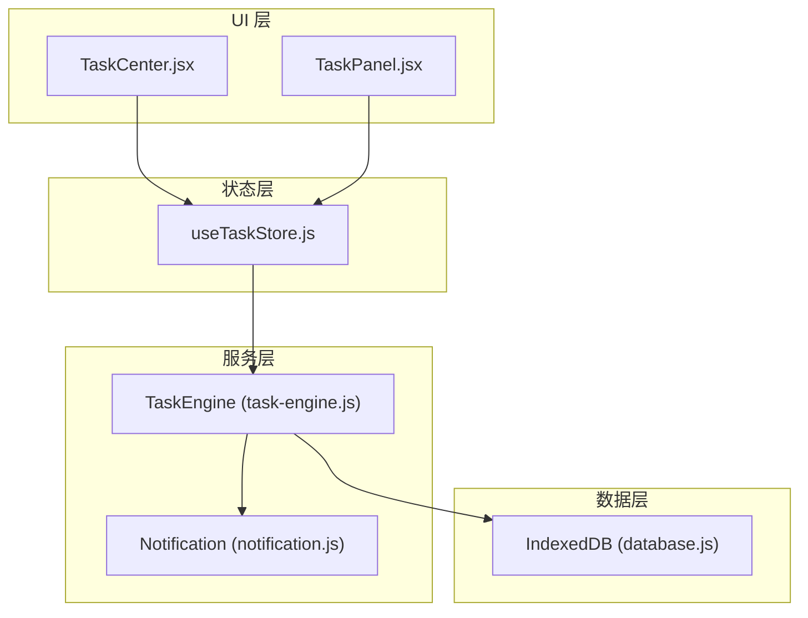
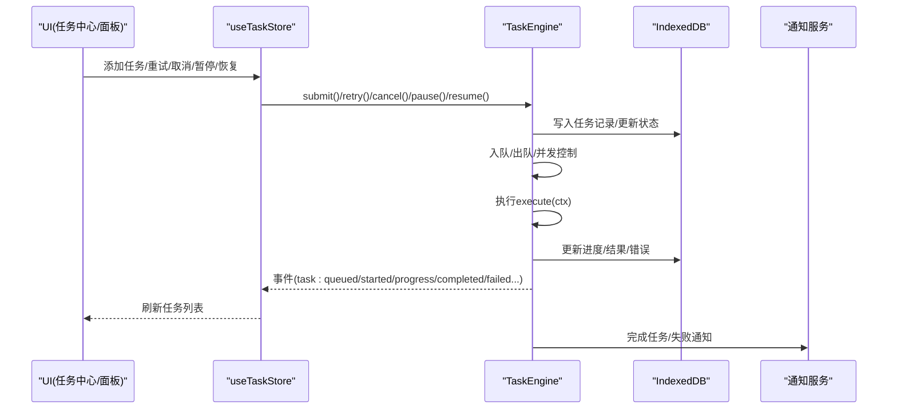
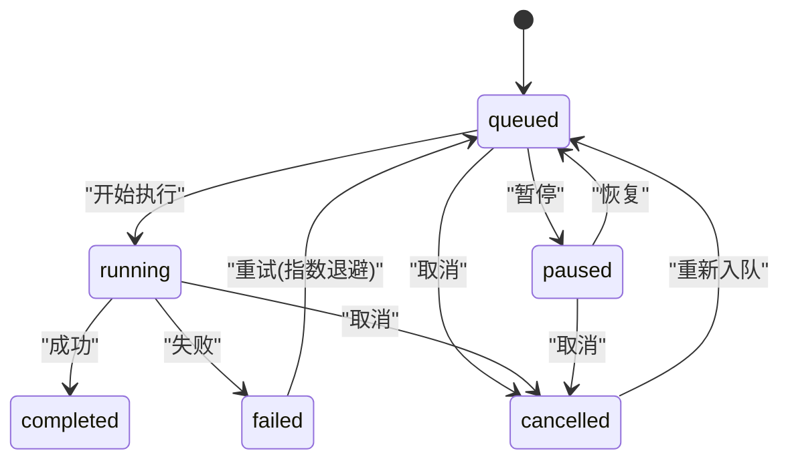
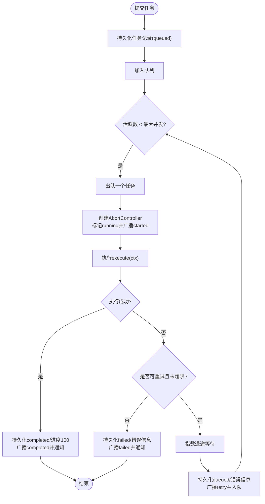
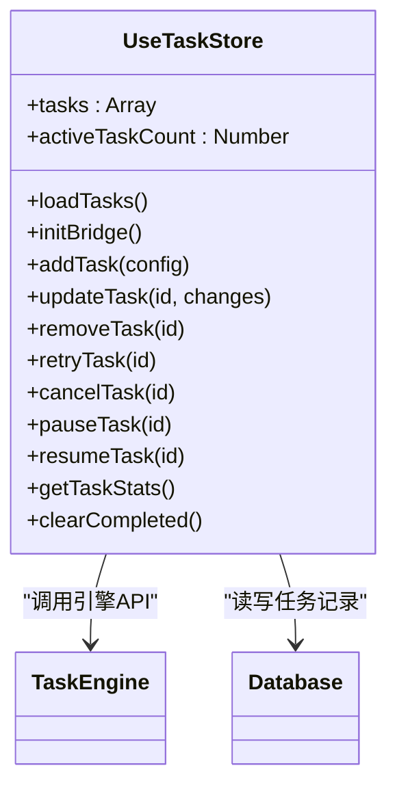
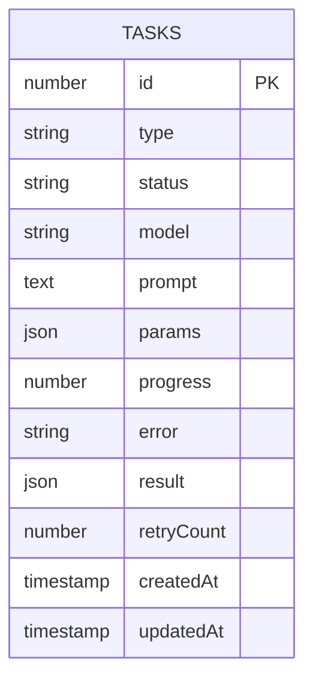
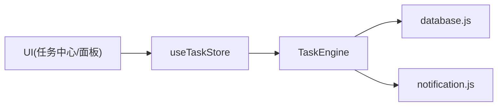

# 任务调度系统

<cite>
**本文引用的文件**   
- [task-engine.js](file://app/src/services/task-engine.js)
- [useTaskStore.js](file://app/src/stores/useTaskStore.js)
- [database.js](file://app/src/db/database.js)
- [notification.js](file://app/src/services/notification.js)
- [TaskCenter.jsx](file://app/src/pages/TaskCenter.jsx)
- [TaskPanel.jsx](file://app/src/components/TaskPanel.jsx)
</cite>

## 目录
1. [简介](#简介)
2. [项目结构](#项目结构)
3. [核心组件](#核心组件)
4. [架构总览](#架构总览)
5. [详细组件分析](#详细组件分析)
6. [依赖关系分析](#依赖关系分析)
7. [性能与并发优化](#性能与并发优化)
8. [错误恢复与重试策略](#错误恢复与重试策略)
9. [监控与告警](#监控与告警)
10. [故障排查指南](#故障排查指南)
11. [结论](#结论)

## 简介
本文件为 AI Image Studio 的任务调度系统提供系统化文档，覆盖任务引擎的架构设计、并发控制机制、任务生命周期管理、队列实现原理、状态机设计与重试策略、优先级排序、资源分配与进度跟踪机制。同时包含任务流程图与状态转换图，展示任务的完整生命周期，并讨论性能优化、错误恢复机制和监控告警策略。

## 项目结构
任务调度相关代码主要分布在服务层、数据持久化层、状态管理层与 UI 层：
- 服务层：任务引擎（TaskEngine）负责并发控制、事件分发、重试与通知；通知服务封装浏览器通知能力。
- 数据层：基于 IndexedDB（Dexie.js）的任务表与查询接口。
- 状态层：Zustand store 桥接 TaskEngine 事件到 UI 状态。
- UI 层：任务中心页面与侧边任务面板，提供查看、暂停、取消、重试等操作。

图表来源
- [task-engine.js:1-319](file://app/src/services/task-engine.js#L1-L319)
- [useTaskStore.js:1-173](file://app/src/stores/useTaskStore.js#L1-L173)
- [database.js:232-274](file://app/src/db/database.js#L232-L274)
- [notification.js:1-113](file://app/src/services/notification.js#L1-L113)
- [TaskCenter.jsx:1-218](file://app/src/pages/TaskCenter.jsx#L1-L218)
- [TaskPanel.jsx:1-538](file://app/src/components/TaskPanel.jsx#L1-L538)

章节来源
- [task-engine.js:1-319](file://app/src/services/task-engine.js#L1-L319)
- [useTaskStore.js:1-173](file://app/src/stores/useTaskStore.js#L1-L173)
- [database.js:232-274](file://app/src/db/database.js#L232-L274)
- [notification.js:1-113](file://app/src/services/notification.js#L1-L113)
- [TaskCenter.jsx:1-218](file://app/src/pages/TaskCenter.jsx#L1-L218)
- [TaskPanel.jsx:1-538](file://app/src/components/TaskPanel.jsx#L1-L538)

## 核心组件
- 任务引擎（TaskEngine）
  - 单例模式，维护最大并发数、任务队列、活跃任务集合、事件监听器。
  - 提供提交、取消、重试、暂停、恢复、统计等 API。
  - 内部使用 AbortController 支持中断执行。
  - 通过事件总线广播任务状态变更，供 Store 与 UI 订阅。
- 任务存储（useTaskStore）
  - 使用 Zustand 管理任务列表与活跃计数。
  - 初始化时桥接 TaskEngine 事件，统一刷新任务列表。
  - 暴露 add/update/retry/cancel/pause/resume 等动作，调用底层数据库或引擎。
- 数据持久化（database.js）
  - 基于 Dexie.js 的 IndexedDB 封装，定义 tasks 表结构与索引。
  - 提供增删改查与统计接口。
- 通知服务（notification.js）
  - 封装浏览器通知权限请求与发送。
  - 在任务完成或失败时推送系统通知。

章节来源
- [task-engine.js:33-319](file://app/src/services/task-engine.js#L33-L319)
- [useTaskStore.js:14-173](file://app/src/stores/useTaskStore.js#L14-L173)
- [database.js:232-274](file://app/src/db/database.js#L232-L274)
- [notification.js:19-113](file://app/src/services/notification.js#L19-L113)

## 架构总览
任务调度系统采用“引擎 + 事件 + 持久化”的分层架构：
- UI 层通过 Store 操作任务，Store 调用 TaskEngine 或数据库。
- TaskEngine 负责并发控制、状态机、重试与通知，并通过事件驱动更新 UI。
- 所有任务状态变更均持久化至 IndexedDB，保证刷新后状态一致。

图表来源
- [task-engine.js:57-146](file://app/src/services/task-engine.js#L57-L146)
- [useTaskStore.js:39-64](file://app/src/stores/useTaskStore.js#L39-L64)
- [database.js:235-274](file://app/src/db/database.js#L235-L274)
- [notification.js:78-103](file://app/src/services/notification.js#L78-L103)

## 详细组件分析

### 任务引擎（TaskEngine）
- 并发控制
  - 通过 _maxConcurrent 限制同时运行的任务数量。
  - 使用 _queue 作为 FIFO 队列，_active Map 保存当前运行任务上下文。
  - 每次状态变化或任务结束时触发 _processQueue 尝试从队列取出新任务。
- 任务生命周期与状态机
  - 状态包括 queued、running、completed、failed、cancelled、paused。
  - 合法转移由 VALID_TRANSITIONS 约束，确保状态一致性。
- 事件驱动
  - 提供 on/off/_emit 方法，发布 task:queued、task:started、task:progress、task:completed、task:failed、task:cancelled、task:paused、task:retry 等事件。
- 进度跟踪
  - 在执行上下文中提供 onProgress(percent)，引擎将进度持久化并广播事件。
- 重试策略
  - 捕获异常后判断是否可重试（如 5xx、网络错误），按指数退避（默认最多 3 次）重新入队。
- 取消与暂停
  - 对运行中任务使用 AbortController 中断；对排队中任务直接移除。
  - 暂停将状态置为 paused，恢复则重新入队（注意 execute 引用可能丢失）。

图表来源
- [task-engine.js:24-31](file://app/src/services/task-engine.js#L24-L31)
- [task-engine.js:215-297](file://app/src/services/task-engine.js#L215-L297)

图表来源
- [task-engine.js:57-146](file://app/src/services/task-engine.js#L57-L146)
- [task-engine.js:222-297](file://app/src/services/task-engine.js#L222-L297)

章节来源
- [task-engine.js:33-319](file://app/src/services/task-engine.js#L33-L319)

### 任务存储（useTaskStore）
- 职责
  - 加载任务列表并计算活跃任务数。
  - 初始化事件桥接，统一刷新任务列表以响应引擎事件。
  - 封装任务操作（add/update/remove/retry/cancel/pause/resume/stats/clearCompleted）。
- 与引擎交互
  - 通过 TaskEngine 的 retry/cancel/pause/resume 等方法驱动任务状态变更。
  - 在失败或异常时提供降级逻辑（直接更新数据库状态）。

图表来源
- [useTaskStore.js:14-173](file://app/src/stores/useTaskStore.js#L14-L173)
- [database.js:235-274](file://app/src/db/database.js#L235-L274)

章节来源
- [useTaskStore.js:14-173](file://app/src/stores/useTaskStore.js#L14-L173)

### 数据持久化（database.js）
- 任务表结构
  - 字段包括 id、type、status、model、prompt、params、progress、error、result、retryCount、createdAt、updatedAt。
  - 索引包括 status+createdAt 组合索引，便于按状态和时间范围查询。
- 常用接口
  - addTask/getTasks/getTask/updateTask/deleteTask/getTaskStats。

图表来源
- [database.js:22-31](file://app/src/db/database.js#L22-L31)
- [database.js:235-274](file://app/src/db/database.js#L235-L274)

章节来源
- [database.js:232-274](file://app/src/db/database.js#L232-L274)

### 通知服务（notification.js）
- 功能
  - 请求浏览器通知权限。
  - 在任务完成或失败时发送系统通知，自动关闭并在点击时聚焦应用窗口。
- 集成点
  - 任务引擎在任务完成或失败时调用通知函数。

章节来源
- [notification.js:19-113](file://app/src/services/notification.js#L19-L113)
- [task-engine.js:254-291](file://app/src/services/task-engine.js#L254-L291)

### UI 层（TaskCenter.jsx 与 TaskPanel.jsx）
- 任务中心页面
  - 分组显示进行中、排队中、已完成、失败、已暂停任务。
  - 提供统计栏、清空已完成、查看详情等功能。
- 任务面板
  - 右侧滑出面板，快速查看与管理任务，支持暂停/继续、取消、重试、移除。
- 与 Store 交互
  - 通过 useTaskStore 获取任务列表与操作方法，用户操作触发 Store 动作，最终由引擎或数据库处理。

章节来源
- [TaskCenter.jsx:24-218](file://app/src/pages/TaskCenter.jsx#L24-L218)
- [TaskPanel.jsx:9-538](file://app/src/components/TaskPanel.jsx#L9-L538)

## 依赖关系分析
- 组件耦合
  - UI 层仅依赖 Store，不直接访问引擎或数据库，降低耦合度。
  - Store 桥接引擎事件与数据库操作，承担协调职责。
  - 引擎依赖数据库与通知服务，保持业务逻辑集中。
- 外部依赖
  - Dexie.js 用于 IndexedDB 操作。
  - uuid 生成唯一任务 ID。
  - 浏览器 Notification API 用于系统通知。

图表来源
- [useTaskStore.js:14-173](file://app/src/stores/useTaskStore.js#L14-L173)
- [task-engine.js:14-16](file://app/src/services/task-engine.js#L14-L16)
- [database.js:14-31](file://app/src/db/database.js#L14-L31)
- [notification.js:1-113](file://app/src/services/notification.js#L1-L113)

章节来源
- [useTaskStore.js:14-173](file://app/src/stores/useTaskStore.js#L14-L173)
- [task-engine.js:14-16](file://app/src/services/task-engine.js#L14-L16)
- [database.js:14-31](file://app/src/db/database.js#L14-L31)
- [notification.js:1-113](file://app/src/services/notification.js#L1-L113)

## 性能与并发优化
- 并发控制
  - 通过 _maxConcurrent 限制并行任务数，避免过多并发导致后端限流或前端卡顿。
  - 建议根据模型 API 的速率限制与客户端资源动态调整该值。
- 队列与调度
  - 使用数组实现的 FIFO 队列，简单高效；在大量任务场景下可考虑优先队列或分段队列。
- 事件刷新
  - Store 在收到引擎事件后统一刷新任务列表，减少频繁 DOM 更新。
- 进度上报
  - 通过 onProgress 异步持久化进度，避免阻塞主流程。
- 内存占用
  - 活跃任务集合使用 Map，键为 taskId，查找与删除均为 O(1)。
  - 队列长度受并发上限控制，避免无限增长。

[本节为通用性能指导，无需特定文件引用]

## 错误恢复与重试策略
- 可重试判定
  - 针对 5xx 状态码、网络错误、超时等错误进行识别。
- 指数退避
  - 首次重试间隔约 1s，后续按 2^(n-1) 递增，避免雪崩效应。
- 最大重试次数
  - 默认最多 3 次，超过后标记为 failed 并通知用户。
- 取消与暂停
  - 取消通过 AbortController 中断执行；暂停将任务置为 paused，恢复后重新入队（注意 execute 引用可能丢失，需上层重新提交）。

章节来源
- [task-engine.js:265-305](file://app/src/services/task-engine.js#L265-L305)

## 监控与告警
- 事件驱动监控
  - 通过 TaskEngine 的事件（task:queued、task:started、task:progress、task:completed、task:failed、task:cancelled、task:paused、task:retry）可接入监控系统，采集指标与日志。
- 浏览器通知
  - 任务完成或失败时推送系统通知，提醒用户关注结果。
- 统计接口
  - 提供 getStats 与 getTaskStats，便于仪表盘展示活跃、排队、完成、失败等指标。

章节来源
- [task-engine.js:191-211](file://app/src/services/task-engine.js#L191-L211)
- [notification.js:78-103](file://app/src/services/notification.js#L78-L103)
- [database.js:265-274](file://app/src/db/database.js#L265-L274)

## 故障排查指南
- 常见问题
  - 任务无法启动：检查最大并发设置与队列是否为空；确认数据库连接正常。
  - 任务一直重试：查看错误类型是否被判定为可重试；必要时调整 _isRetryableError 逻辑。
  - 进度不更新：确认 execute 中调用了 ctx.onProgress；检查数据库写入是否成功。
  - 通知未弹出：确认浏览器通知权限已授予；检查通知服务调用路径。
- 定位步骤
  - 打开任务中心页面，观察各状态分组数量与时间戳。
  - 在控制台查看引擎事件输出与错误堆栈。
  - 检查 IndexedDB 中 tasks 表的最新记录与错误信息。

章节来源
- [task-engine.js:215-297](file://app/src/services/task-engine.js#L215-L297)
- [database.js:235-274](file://app/src/db/database.js#L235-L274)
- [notification.js:19-72](file://app/src/services/notification.js#L19-L72)

## 结论
AI Image Studio 的任务调度系统以 TaskEngine 为核心，结合事件驱动与 IndexedDB 持久化，实现了高内聚、低耦合的任务管理与执行框架。其并发控制、状态机、重试策略与通知机制共同保障了系统的稳定性与用户体验。未来可在优先级排序、细粒度资源配额、分布式扩展等方面进一步优化。