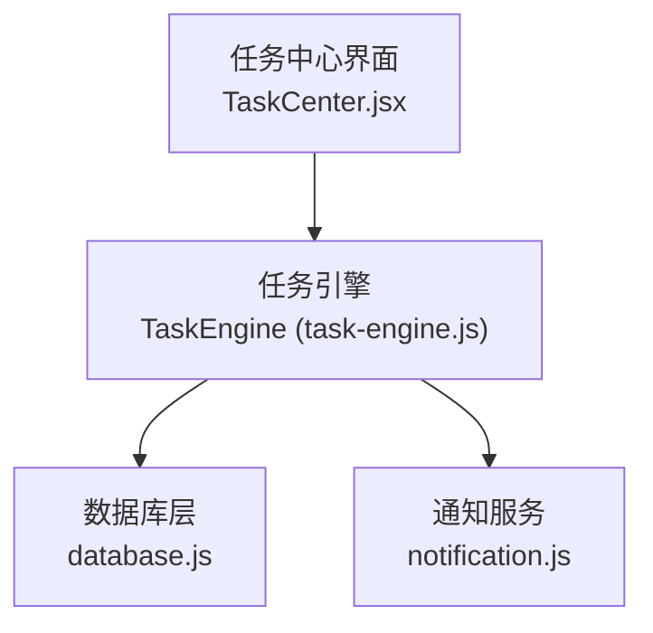
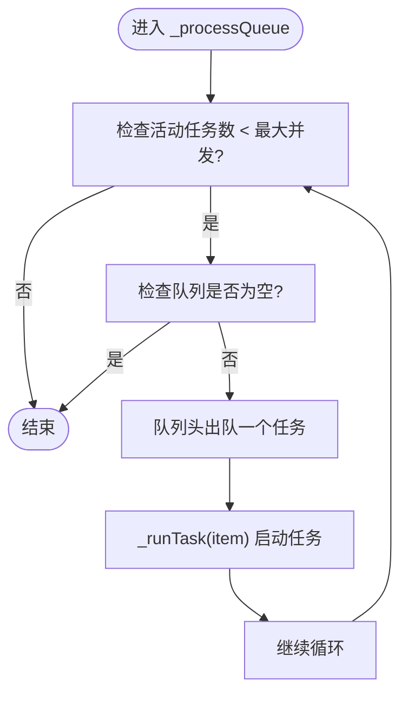
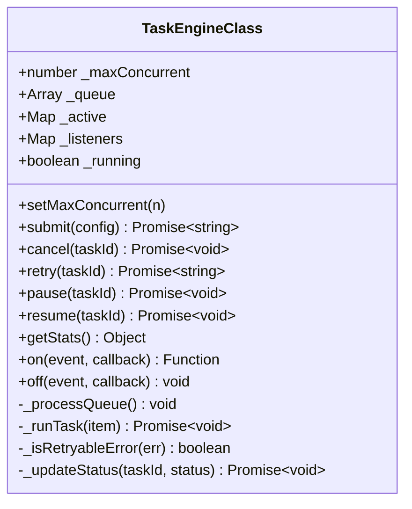
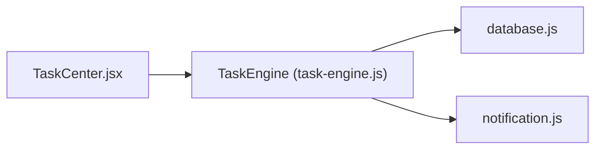

# 并发控制机制

<cite>
**本文引用的文件**   
- [task-engine.js](file://app/src/services/task-engine.js)
- [database.js](file://app/src/db/database.js)
- [notification.js](file://app/src/services/notification.js)
- [TaskCenter.jsx](file://app/src/pages/TaskCenter.jsx)
</cite>

## 目录
1. [简介](#简介)
2. [项目结构](#项目结构)
3. [核心组件](#核心组件)
4. [架构总览](#架构总览)
5. [详细组件分析](#详细组件分析)
6. [依赖关系分析](#依赖关系分析)
7. [性能考量与调优](#性能考量与调优)
8. [故障排查指南](#故障排查指南)
9. [结论](#结论)
10. [附录：动态调整与监控示例](#附录动态调整与监控示例)

## 简介
本文件聚焦 AI Image Studio 的后台任务调度与并发控制机制，围绕以下目标展开：
- 解释最大并发数配置（_maxConcurrent）的作用、影响与调优建议
- 深入解析任务队列处理算法，包括 _processQueue 的实现逻辑、FIFO 队列管理与调度策略
- 说明活动任务跟踪机制，包括 _active Map 的数据结构设计、任务启动与完成的生命周期管理
- 讨论并发控制的边界条件处理，如队列空检查、活动任务数量监控与资源释放策略
- 提供并发性能测试方法与优化建议，包括不同并发级别下的性能对比与内存使用分析
- 给出具体代码示例路径，展示如何动态调整并发数和监控任务执行情况

## 项目结构
与并发控制直接相关的核心模块位于 services 层与 db 层：
- services/task-engine.js：任务引擎单例，负责并发控制、队列调度、重试、事件通知与持久化状态更新
- db/database.js：IndexedDB 封装，提供任务记录的增删改查与统计
- services/notification.js：浏览器通知封装，用于任务完成/失败时的用户提示
- pages/TaskCenter.jsx：任务中心页面，演示对任务的暂停、取消、重试等操作



图表来源
- [task-engine.js:1-319](file://app/src/services/task-engine.js#L1-L319)
- [database.js:235-274](file://app/src/db/database.js#L235-L274)
- [notification.js:78-103](file://app/src/services/notification.js#L78-L103)
- [TaskCenter.jsx:60-127](file://app/src/pages/TaskCenter.jsx#L60-L127)

章节来源
- [task-engine.js:1-319](file://app/src/services/task-engine.js#L1-L319)
- [database.js:235-274](file://app/src/db/database.js#L235-L274)
- [notification.js:78-103](file://app/src/services/notification.js#L78-L103)
- [TaskCenter.jsx:60-127](file://app/src/pages/TaskCenter.jsx#L60-L127)

## 核心组件
- TaskEngineClass：实现并发控制的核心类，维护最大并发数、任务队列、活动任务集合、事件监听器。对外暴露提交、取消、重试、暂停/恢复、统计等 API。
- IndexedDB 任务表：持久化任务状态、进度、错误信息、重试次数等，保证任务可恢复与可观测。
- 通知服务：在任务完成或失败时触发系统通知，提升用户体验。

关键职责划分：
- 并发控制：通过 _maxConcurrent 限制同时运行的任务数
- 调度算法：_processQueue 采用 FIFO 出队并驱动 _runTask
- 生命周期：从 queued -> running -> completed/failed/cancelled/paused 的状态机流转
- 重试策略：指数退避，最多 3 次，仅对可重试错误生效
- 事件总线：task:queued、task:started、task:progress、task:completed、task:failed、task:cancelled、task:paused、task:retry
- 持久化：所有状态变更均落库，支持断点续跑与历史回溯

章节来源
- [task-engine.js:33-48](file://app/src/services/task-engine.js#L33-L48)
- [task-engine.js:215-220](file://app/src/services/task-engine.js#L215-L220)
- [task-engine.js:222-297](file://app/src/services/task-engine.js#L222-L297)
- [database.js:235-274](file://app/src/db/database.js#L235-L274)
- [notification.js:78-103](file://app/src/services/notification.js#L78-L103)

## 架构总览
下图展示了任务从提交到完成的全链路交互，以及并发控制的关键节点。

```mermaid
sequenceDiagram
participant UI as "调用方"
participant TE as "TaskEngine"
participant DB as "IndexedDB"
participant NOTI as "通知服务"
UI->>TE : submit(config)
TE->>DB : addTask({status : 'queued', ...})
TE->>TE : _queue.push(...)
TE->>TE : _emit('task : queued')
TE->>TE : _processQueue()
loop 直到达到并发上限或队列为空
TE->>TE : shift() 取下一个任务
TE->>TE : _runTask(item)
end
TE->>DB : updateTask(status : 'running')
TE->>TE : _emit('task : started')
alt 执行成功
TE->>DB : updateTask(status : 'completed', progress : 100, result)
TE->>NOTI : notifyTaskComplete(task)
TE-->>UI : resolve(result)
else 执行异常
TE->>DB : getTask()
alt 可重试且未超过最大重试次数
TE->>DB : updateTask(status : 'queued', retryCount++, error)
TE->>TE : _queue.push(...)
TE->>TE : setTimeout(指数退避)
TE->>TE : _emit('task : retry')
else 不可重试或已达上限
TE->>DB : updateTask(status : 'failed', error)
TE->>NOTI : notifyTaskFailed(task)
TE-->>UI : reject(error)
end
end
TE->>TE : finally { _active.delete(taskId); _processQueue(); }
```

图表来源
- [task-engine.js:57-81](file://app/src/services/task-engine.js#L57-L81)
- [task-engine.js:215-220](file://app/src/services/task-engine.js#L215-L220)
- [task-engine.js:222-297](file://app/src/services/task-engine.js#L222-L297)
- [database.js:235-274](file://app/src/db/database.js#L235-L274)
- [notification.js:78-103](file://app/src/services/notification.js#L78-L103)

## 详细组件分析

### 最大并发数配置（_maxConcurrent）
- 作用与影响
  - 控制同时处于 running 状态的任务数量，避免过多并发导致后端限流、网络拥塞或前端资源争用
  - 默认值为 3，可通过 setMaxConcurrent(n) 动态调整；内部会强制最小为 1，防止并发数为 0 导致死锁
- 性能调优建议
  - 根据后端 QPS 限制、模型推理耗时、带宽与 CPU/GPU 占用进行压测后确定最佳值
  - 对于 I/O 密集（网络请求为主）场景，可适当提高并发；对于计算密集（本地解码/渲染）场景，应降低并发
  - 建议在设置变更后立即触发一次 _processQueue，确保新并发阈值即时生效
- 最佳实践
  - 将 _maxConcurrent 作为全局配置项，结合运行时指标（如平均响应时间、错误率、队列长度）动态调节
  - 在高峰期自动降并发，低峰期适当提升，以平衡吞吐与稳定性

章节来源
- [task-engine.js:34-48](file://app/src/services/task-engine.js#L34-L48)
- [task-engine.js:45-48](file://app/src/services/task-engine.js#L45-L48)

### 任务队列处理算法（_processQueue）
- 实现逻辑
  - 使用 while 循环持续从队列头部取出任务，直到满足任一终止条件：活动任务数达到上限或队列为空
  - 每次取出一个任务即调用 _runTask 启动执行，形成典型的“生产者-消费者”模式中的消费者侧
- FIFO 队列管理
  - 队列是普通数组，push 入队，shift 出队，天然保证先进先出
  - 重试与重新入队均在尾部追加，保持顺序一致性
- 调度策略
  - 无优先级区分，严格 FIFO
  - 当任务被取消或暂停时，若仍在活动集合中则中止执行；若在队列中则移除并重试调度
- 复杂度分析
  - 单次 _processQueue 的时间复杂度为 O(k)，k 为本次拉起的任务数；队列操作均为常数时间
  - 空间复杂度取决于队列长度与活动任务数，线性增长



图表来源
- [task-engine.js:215-220](file://app/src/services/task-engine.js#L215-L220)

章节来源
- [task-engine.js:215-220](file://app/src/services/task-engine.js#L215-L220)

### 活动任务跟踪机制（_active Map）
- 数据结构设计
  - _active 为 Map，键为 taskId，值为包含 config、controller、resolve、reject 的对象
  - 使用 Map 便于 O(1) 查找、删除，避免遍历数组带来的性能损耗
- 生命周期管理
  - 启动：_runTask 创建 AbortController，写入 _active，更新状态为 running，发出 task:started 事件
  - 完成：无论成功或失败，finally 分支都会从 _active 删除该任务，并再次尝试 _processQueue 拉起后续任务
  - 取消/暂停：若任务在活动集合中，调用 controller.abort() 中断执行，并从 _active 删除；若在队列中则直接移除
- 资源释放策略
  - AbortController.signal 用于向 execute 函数传递取消信号，避免悬挂的网络请求或长时间计算
  - 任务完成后统一清理 _active 条目，避免内存泄漏



图表来源
- [task-engine.js:33-48](file://app/src/services/task-engine.js#L33-L48)
- [task-engine.js:215-220](file://app/src/services/task-engine.js#L215-L220)
- [task-engine.js:222-297](file://app/src/services/task-engine.js#L222-L297)

章节来源
- [task-engine.js:33-48](file://app/src/services/task-engine.js#L33-L48)
- [task-engine.js:222-297](file://app/src/services/task-engine.js#L222-L297)

### 并发控制的边界条件处理
- 队列空检查
  - _processQueue 在 while 条件中显式检查队列长度，避免空队列下误操作
- 活动任务数量监控
  - 通过 _active.size 与 _maxConcurrent 比较，确保不会超并发
  - getStats 返回 active、queued、maxConcurrent，便于外部监控
- 资源释放策略
  - 任务完成或失败后，finally 分支确保 _active.delete(taskId) 与 _processQueue() 执行
  - 取消/暂停时主动 abort 控制器并清理 _active，避免悬挂引用
- 重试与回退
  - 指数退避延迟后重新入队，避免瞬时抖动导致的雪崩
  - 仅对特定错误（如 5xx、网络错误）进行重试，其他错误直接标记失败

章节来源
- [task-engine.js:215-220](file://app/src/services/task-engine.js#L215-L220)
- [task-engine.js:222-297](file://app/src/services/task-engine.js#L222-L297)
- [task-engine.js:299-305](file://app/src/services/task-engine.js#L299-L305)
- [task-engine.js:181-187](file://app/src/services/task-engine.js#L181-L187)

### 任务状态机与事件
- 状态转换
  - queued -> running | cancelled | paused
  - running -> completed | failed | cancelled
  - paused -> queued | cancelled
  - failed -> queued（重试）
- 事件类型
  - task:queued、task:started、task:progress、task:completed、task:failed、task:cancelled、task:paused、task:retry
- 用途
  - 前端 UI 实时更新任务列表、进度条与按钮状态
  - 日志与监控采集，辅助定位问题

章节来源
- [task-engine.js:18-31](file://app/src/services/task-engine.js#L18-L31)
- [task-engine.js:203-211](file://app/src/services/task-engine.js#L203-L211)

## 依赖关系分析
- TaskEngine 依赖
  - database.js：读写任务记录，更新状态、进度、错误、重试次数等
  - notification.js：在任务完成或失败时发送系统通知
- 外部集成
  - 调用方通过 TaskEngine.submit 提交任务，传入 execute 函数执行实际业务逻辑
  - 任务中心页面通过 cancel、pause、retry 等方法与引擎交互



图表来源
- [task-engine.js:14-16](file://app/src/services/task-engine.js#L14-L16)
- [database.js:235-274](file://app/src/db/database.js#L235-L274)
- [notification.js:78-103](file://app/src/services/notification.js#L78-L103)
- [TaskCenter.jsx:60-127](file://app/src/pages/TaskCenter.jsx#L60-L127)

章节来源
- [task-engine.js:14-16](file://app/src/services/task-engine.js#L14-L16)
- [database.js:235-274](file://app/src/db/database.js#L235-L274)
- [notification.js:78-103](file://app/src/services/notification.js#L78-L103)
- [TaskCenter.jsx:60-127](file://app/src/pages/TaskCenter.jsx#L60-L127)

## 性能考量与调优
- 并发级别选择
  - 低并发（1-3）：适合高延迟或高资源消耗任务，减少竞争与错误率
  - 中等并发（4-8）：常见于网络 I/O 密集型场景，需结合后端限流与超时策略
  - 高并发（>8）：需谨慎评估后端承载能力与前端渲染压力，避免抖动
- 指标观测
  - 使用 getStats 获取 active、queued、maxConcurrent，结合任务中心 UI 观察排队堆积情况
  - 关注任务平均耗时、错误率、重试次数分布，识别瓶颈
- 内存与资源
  - 控制 _active 大小，避免大量悬挂任务导致内存增长
  - 合理设置 execute 函数的 onProgress 频率，避免频繁写库造成 IO 压力
- 重试与退避
  - 指数退避可有效缓解瞬时错误，但需配合最大重试次数，防止无限重试
  - 针对可重试错误的判定要精确，避免对非网络错误进行无效重试

[本节为通用指导，不直接分析具体文件]

## 故障排查指南
- 常见问题
  - 任务卡住：检查是否因 _maxConcurrent 过小导致队列长期积压；查看 _active.size 与 _queue.length
  - 频繁失败：确认 _isRetryableError 的判断是否符合预期；检查后端返回码与网络状况
  - 无法取消：确认任务是否已在 _active 中；若在队列中，需确保 remove 逻辑正确执行
- 定位步骤
  - 订阅 task:failed、task:retry 事件，打印错误信息与重试次数
  - 查看 IndexedDB 中任务记录的状态与更新时间，判断是否出现状态不一致
  - 使用 getStats 输出当前并发与队列情况，结合 UI 验证

章节来源
- [task-engine.js:299-305](file://app/src/services/task-engine.js#L299-L305)
- [task-engine.js:181-187](file://app/src/services/task-engine.js#L181-L187)
- [database.js:235-274](file://app/src/db/database.js#L235-L274)

## 结论
AI Image Studio 的并发控制机制以 TaskEngine 为核心，通过 _maxConcurrent 限制并行度、FIFO 队列保障顺序、_active Map 跟踪活动任务，并结合指数退避重试与完整的事件体系，实现了稳定、可观测、可恢复的任务调度。合理的并发调优与完善的监控手段，是保障在高负载场景下系统稳定性的关键。

[本节为总结性内容，不直接分析具体文件]

## 附录：动态调整与监控示例
以下示例展示如何在应用中动态调整并发数与监控任务执行情况。请根据实际业务替换相关路径与参数。

- 动态调整最大并发数
  - 参考路径：[task-engine.js:45-48](file://app/src/services/task-engine.js#L45-L48)
  - 说明：调用 setMaxConcurrent(n) 后会自动触发 _processQueue，确保新并发阈值立即生效
- 提交任务并监听事件
  - 参考路径：[task-engine.js:57-81](file://app/src/services/task-engine.js#L57-L81)
  - 说明：submit 会持久化任务、入队并触发 task:queued 事件；可在 UI 中订阅事件更新列表
- 取消/暂停任务
  - 参考路径：[task-engine.js:95-116](file://app/src/services/task-engine.js#L95-L116)、[task-engine.js:149-165](file://app/src/services/task-engine.js#L149-L165)
  - 说明：对活动任务调用 abort 并清理 _active；对队列任务直接移除并更新状态
- 重试失败任务
  - 参考路径：[task-engine.js:119-146](file://app/src/services/task-engine.js#L119-L146)
  - 说明：将任务状态重置为 queued 并重新入队，遵循指数退避策略
- 获取统计信息
  - 参考路径：[task-engine.js:181-187](file://app/src/services/task-engine.js#L181-L187)
  - 说明：返回 active、queued、maxConcurrent，可用于仪表盘展示
- 任务中心交互
  - 参考路径：[TaskCenter.jsx:60-127](file://app/src/pages/TaskCenter.jsx#L60-L127)
  - 说明：页面提供暂停、取消、重试等操作入口，与 TaskEngine 的公共 API 对应

章节来源
- [task-engine.js:45-48](file://app/src/services/task-engine.js#L45-L48)
- [task-engine.js:57-81](file://app/src/services/task-engine.js#L57-L81)
- [task-engine.js:95-116](file://app/src/services/task-engine.js#L95-L116)
- [task-engine.js:119-146](file://app/src/services/task-engine.js#L119-L146)
- [task-engine.js:149-165](file://app/src/services/task-engine.js#L149-L165)
- [task-engine.js:181-187](file://app/src/services/task-engine.js#L181-L187)
- [TaskCenter.jsx:60-127](file://app/src/pages/TaskCenter.jsx#L60-L127)