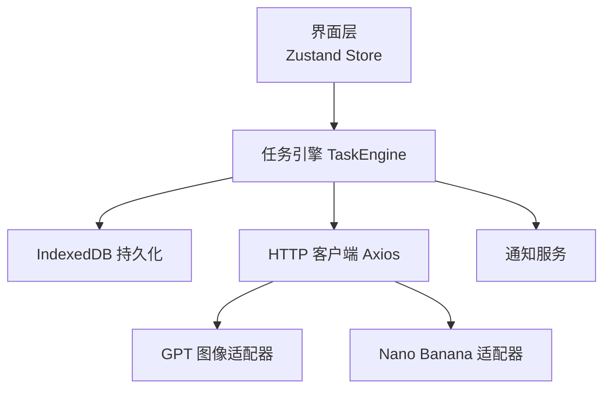
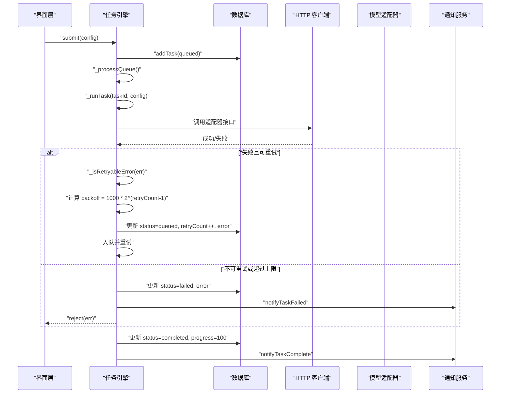
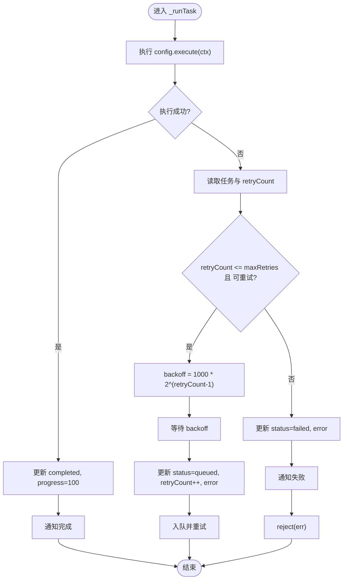
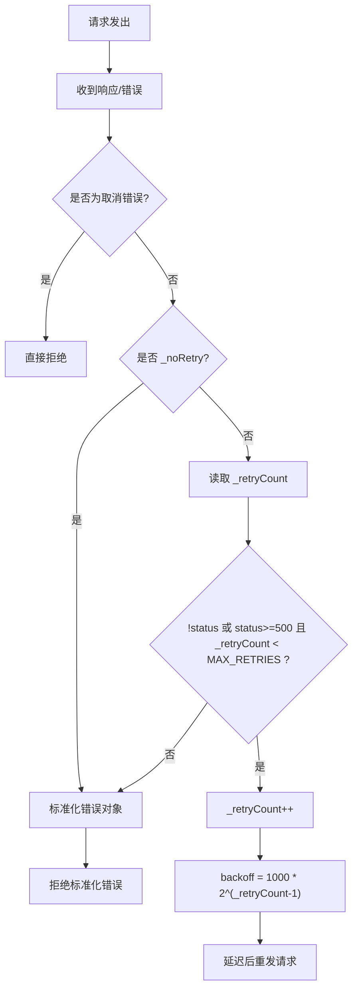
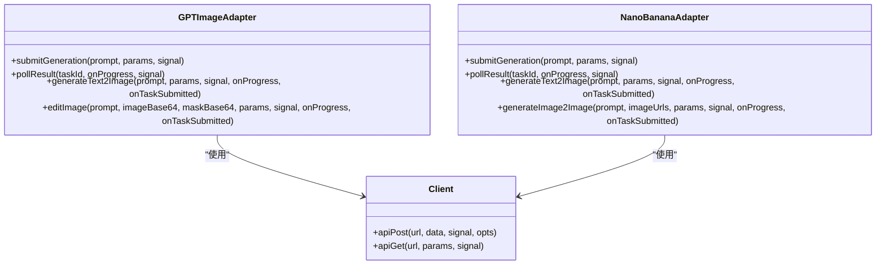
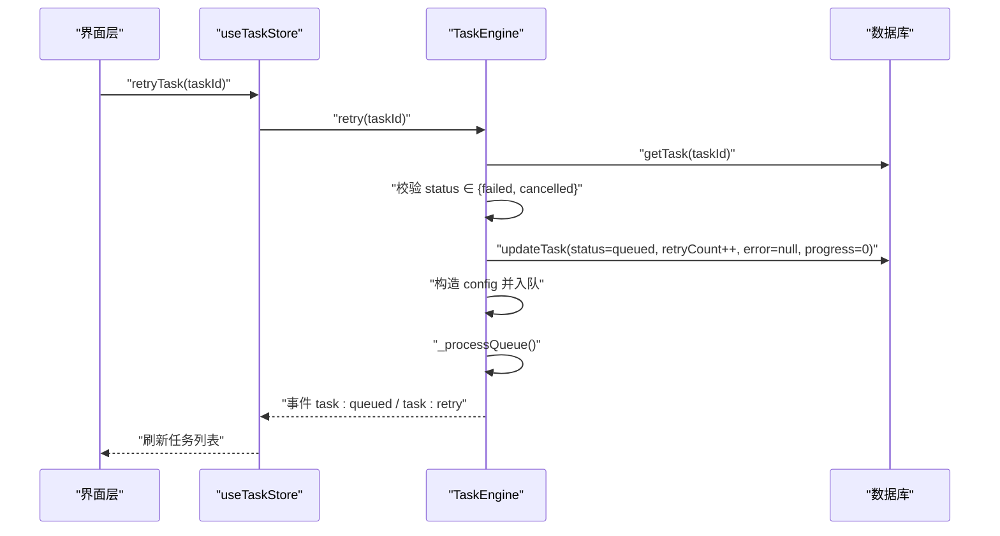
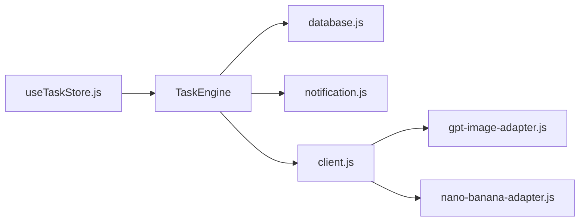

# 重试与退避策略

<cite>
**本文引用的文件**
- [task-engine.js](file://app/src/services/task-engine.js)
- [client.js](file://app/src/services/api/client.js)
- [database.js](file://app/src/db/database.js)
- [gpt-image-adapter.js](file://app/src/services/api/gpt-image-adapter.js)
- [nano-banana-adapter.js](file://app/src/services/api/nano-banana-adapter.js)
- [useTaskStore.js](file://app/src/stores/useTaskStore.js)
- [notification.js](file://app/src/services/notification.js)
</cite>

## 目录
1. [简介](#简介)
2. [项目结构](#项目结构)
3. [核心组件](#核心组件)
4. [架构总览](#架构总览)
5. [详细组件分析](#详细组件分析)
6. [依赖关系分析](#依赖关系分析)
7. [性能考量](#性能考量)
8. [故障排除指南](#故障排除指南)
9. [结论](#结论)
10. [附录](#附录)

## 简介
本文件聚焦 AI Image Studio 的重试与指数退避策略，系统性阐述自动重试机制、错误分类逻辑、最大重试次数限制、指数退避算法实现、失败恢复（数据库更新、重试计数管理、错误信息记录）、手动重试流程（任务状态验证、配置重建、队列重新插入），以及可配置的调优建议与不同网络环境下的参数设置。文档同时提供可视化图示与排障指引，帮助读者快速定位问题并优化系统稳定性与用户体验。

## 项目结构
与重试与退避相关的代码主要分布在以下模块：
- 任务调度与重试编排：services/task-engine.js
- HTTP 客户端与拦截器级重试：services/api/client.js
- IndexedDB 持久化层：db/database.js
- 模型适配器中的提交/轮询重试：services/api/gpt-image-adapter.js、services/api/nano-banana-adapter.js
- 前端状态桥接与手动重试入口：stores/useTaskStore.js
- 浏览器通知（完成/失败）：services/notification.js

图表来源
- [task-engine.js:1-319](file://app/src/services/task-engine.js#L1-L319)
- [client.js:1-146](file://app/src/services/api/client.js#L1-L146)
- [database.js:1-339](file://app/src/db/database.js#L1-L339)
- [gpt-image-adapter.js:1-336](file://app/src/services/api/gpt-image-adapter.js#L1-L336)
- [nano-banana-adapter.js:1-265](file://app/src/services/api/nano-banana-adapter.js#L1-L265)
- [useTaskStore.js:1-173](file://app/src/stores/useTaskStore.js#L1-L173)
- [notification.js:1-113](file://app/src/services/notification.js#L1-L113)

章节来源
- [task-engine.js:1-319](file://app/src/services/task-engine.js#L1-L319)
- [client.js:1-146](file://app/src/services/api/client.js#L1-L146)
- [database.js:1-339](file://app/src/db/database.js#L1-L339)
- [gpt-image-adapter.js:1-336](file://app/src/services/api/gpt-image-adapter.js#L1-L336)
- [nano-banana-adapter.js:1-265](file://app/src/services/api/nano-banana-adapter.js#L1-L265)
- [useTaskStore.js:1-173](file://app/src/stores/useTaskStore.js#L1-L173)
- [notification.js:1-113](file://app/src/services/notification.js#L1-L113)

## 核心组件
- 任务引擎（TaskEngine）
  - 负责任务生命周期管理、并发控制、FIFO 队列、事件广播、进度上报、自动重试与指数退避。
  - 关键方法：submit、_runTask、retry、_isRetryableError、_updateStatus。
- HTTP 客户端（Axios 封装）
  - 统一 baseURL、超时、请求/响应拦截器；在响应拦截器中实现基于状态码的自动重试与指数退避。
  - 关键常量：MAX_RETRIES、INITIAL_BACKOFF_MS。
- 数据库层（Dexie/IndexedDB）
  - 提供任务记录的增删改查与统计；任务状态变更与错误信息持久化。
- 模型适配器（GPT/Nano Banana）
  - 在提交阶段与轮询阶段分别实现带退避的重试与超时控制。
- 前端状态桥接（useTaskStore）
  - 监听任务引擎事件，刷新 UI；提供 retryTask 作为手动重试入口。
- 通知服务
  - 在任务完成或失败时推送浏览器通知。

章节来源
- [task-engine.js:1-319](file://app/src/services/task-engine.js#L1-L319)
- [client.js:1-146](file://app/src/services/api/client.js#L1-L146)
- [database.js:1-339](file://app/src/db/database.js#L1-L339)
- [gpt-image-adapter.js:1-336](file://app/src/services/api/gpt-image-adapter.js#L1-L336)
- [nano-banana-adapter.js:1-265](file://app/src/services/api/nano-banana-adapter.js#L1-L265)
- [useTaskStore.js:1-173](file://app/src/stores/useTaskStore.js#L1-L173)
- [notification.js:1-113](file://app/src/services/notification.js#L1-L113)

## 架构总览
下图展示了从任务提交到执行、错误处理、重试与退避的整体流程，包括任务引擎、HTTP 客户端、数据库与适配器的交互。

图表来源
- [task-engine.js:222-297](file://app/src/services/task-engine.js#L222-L297)
- [client.js:49-84](file://app/src/services/api/client.js#L49-L84)
- [database.js:235-274](file://app/src/db/database.js#L235-L274)
- [notification.js:78-103](file://app/src/services/notification.js#L78-L103)

## 详细组件分析

### 任务引擎：自动重试与指数退避
- 任务状态机
  - 有效转换：queued → running | cancelled | paused；running → completed | failed | cancelled；paused → queued | cancelled；failed → queued（重试）。
- 自动重试触发点
  - 在 _runTask 的 catch 分支中，读取当前任务的 retryCount，判断是否小于等于最大重试次数（默认 3），并通过 _isRetryableError 判定是否可重试。
- 错误分类逻辑（_isRetryableError）
  - 优先检查 err.status 或 err.response.status，若为 5xx 则视为可重试。
  - 若无状态码但消息包含“Network”，也视为可重试（覆盖网络中断等场景）。
- 指数退避公式
  - backoff = 1000 * Math.pow(2, retryCount - 1)
  - 首次重试等待 1s，第二次 2s，第三次 4s（受限于最大重试次数 3）。
- 失败恢复与持久化
  - 可重试：将任务状态更新为 queued，递增 retryCount，记录 error 信息，入队继续执行。
  - 不可重试或超限：将状态更新为 failed，记录 error，触发失败通知，拒绝 Promise。
- 并发与队列
  - 通过 _maxConcurrent 控制并行度，_processQueue 循环出队执行，确保资源占用可控。

图表来源
- [task-engine.js:222-297](file://app/src/services/task-engine.js#L222-L297)
- [task-engine.js:299-305](file://app/src/services/task-engine.js#L299-L305)

章节来源
- [task-engine.js:18-31](file://app/src/services/task-engine.js#L18-L31)
- [task-engine.js:222-297](file://app/src/services/task-engine.js#L222-L297)
- [task-engine.js:299-305](file://app/src/services/task-engine.js#L299-L305)

### HTTP 客户端：拦截器级重试与退避
- 全局拦截器
  - 请求拦截器透传 AbortController signal。
  - 响应拦截器对错误进行标准化，并在满足条件时执行重试。
- 重试判定
  - 忽略取消错误（axios.isCancel 或 ERR_CANCELED）。
  - 若调用方显式设置 _noRetry，则跳过客户端级重试，交由上层处理。
  - isRetryable 条件：无状态码或状态码 >= 500，且当前重试次数 < MAX_RETRIES（默认 3）。
- 指数退避
  - backoff = INITIAL_BACKOFF_MS * Math.pow(2, _retryCount - 1)，其中 INITIAL_BACKOFF_MS = 1000。
- 长连接客户端
  - longRunningClient 用于同步生成类接口，默认超时更长（5 分钟），同样应用相同拦截器。

图表来源
- [client.js:49-84](file://app/src/services/api/client.js#L49-L84)
- [client.js:12-13](file://app/src/services/api/client.js#L12-L13)

章节来源
- [client.js:1-146](file://app/src/services/api/client.js#L1-146)

### 模型适配器：提交与轮询阶段的退避
- GPT 图像适配器
  - 提交阶段 postWithRetry：支持网络错误与代理 5xx/502 的重试，使用 SUBMIT_BACKOFF_MS（2s）起始的指数退避，最多 SUBMIT_MAX_RETRIES（3）次。
  - 轮询阶段 pollWithBackoff：初始间隔 2s，指数增长至最大 10s，总超时 5 分钟，支持取消信号。
- Nano Banana 适配器
  - 与 GPT 适配器相同的提交与轮询策略，保证多模型一致的重试体验。

图表来源
- [gpt-image-adapter.js:1-336](file://app/src/services/api/gpt-image-adapter.js#L1-L336)
- [nano-banana-adapter.js:1-265](file://app/src/services/api/nano-banana-adapter.js#L1-L265)
- [client.js:100-132](file://app/src/services/api/client.js#L100-L132)

章节来源
- [gpt-image-adapter.js:25-91](file://app/src/services/api/gpt-image-adapter.js#L25-L91)
- [nano-banana-adapter.js:22-76](file://app/src/services/api/nano-banana-adapter.js#L22-L76)

### 手动重试功能（retry 方法）
- 入口
  - useTaskStore.retryTask 调用 TaskEngine.retry，失败时回退为直接更新任务状态为 queued。
- 任务状态验证
  - 仅允许对 failed 或 cancelled 的任务执行重试。
- 配置重建与队列重新插入
  - 从数据库读取任务元数据，构造新的 config（包含 type、model、prompt、params 与 execute 引用），递增 retryCount，更新状态为 queued，并将任务重新入队。
- 事件与 UI 同步
  - 通过 TaskEngine 的事件机制触发 UI 刷新，保持列表与状态一致。

图表来源
- [useTaskStore.js:109-124](file://app/src/stores/useTaskStore.js#L109-L124)
- [task-engine.js:118-146](file://app/src/services/task-engine.js#L118-L146)
- [database.js:253-259](file://app/src/db/database.js#L253-L259)

章节来源
- [useTaskStore.js:109-124](file://app/src/stores/useTaskStore.js#L109-L124)
- [task-engine.js:118-146](file://app/src/services/task-engine.js#L118-L146)

### 错误恢复机制
- 数据库更新
  - 任务状态变更（queued/running/completed/failed/cancelled/paused）与进度、错误信息均持久化。
- 重试计数管理
  - 自动重试：在 _runTask 中递增 retryCount。
  - 手动重试：在 retry 中递增 retryCount。
- 错误信息记录
  - 自动重试路径：记录 err.message。
  - 客户端拦截器：标准化错误对象，包含 message、status、data、originalError。
- 通知反馈
  - 完成与失败分别触发 notifyTaskComplete 与 notifyTaskFailed，便于用户感知。

章节来源
- [database.js:235-274](file://app/src/db/database.js#L235-L274)
- [task-engine.js:265-292](file://app/src/services/task-engine.js#L265-L292)
- [client.js:76-83](file://app/src/services/api/client.js#L76-L83)
- [notification.js:78-103](file://app/src/services/notification.js#L78-L103)

## 依赖关系分析
- 低耦合高内聚
  - 任务引擎不直接依赖具体适配器，而是通过 config.execute 回调解耦业务逻辑。
  - HTTP 客户端通过拦截器集中处理通用重试逻辑，适配器可在必要时关闭客户端重试（_noRetry）以启用自身更细粒度的重试。
- 外部依赖
  - axios：HTTP 请求与取消支持。
  - Dexie：IndexedDB 封装，提供事务与索引能力。
  - uuid：生成唯一 taskId。
- 潜在循环依赖
  - 当前结构未见循环导入；任务引擎与 store 通过事件解耦。

图表来源
- [task-engine.js:1-319](file://app/src/services/task-engine.js#L1-L319)
- [client.js:1-146](file://app/src/services/api/client.js#L1-L146)
- [database.js:1-339](file://app/src/db/database.js#L1-L339)
- [gpt-image-adapter.js:1-336](file://app/src/services/api/gpt-image-adapter.js#L1-L336)
- [nano-banana-adapter.js:1-265](file://app/src/services/api/nano-banana-adapter.js#L1-L265)
- [useTaskStore.js:1-173](file://app/src/stores/useTaskStore.js#L1-L173)
- [notification.js:1-113](file://app/src/services/notification.js#L1-L113)

章节来源
- [task-engine.js:1-319](file://app/src/services/task-engine.js#L1-L319)
- [client.js:1-146](file://app/src/services/api/client.js#L1-L146)
- [database.js:1-339](file://app/src/db/database.js#L1-L339)
- [gpt-image-adapter.js:1-336](file://app/src/services/api/gpt-image-adapter.js#L1-L336)
- [nano-banana-adapter.js:1-265](file://app/src/services/api/nano-banana-adapter.js#L1-L265)
- [useTaskStore.js:1-173](file://app/src/stores/useTaskStore.js#L1-L173)
- [notification.js:1-113](file://app/src/services/notification.js#L1-L113)

## 性能考量
- 并发控制
  - 通过 _maxConcurrent 限制并行任务数，避免瞬时峰值导致后端过载或前端卡顿。
- 退避策略
  - 指数退避能有效缓解服务端拥塞与网络抖动带来的雪崩效应；注意最大重试次数与初始退避时间对总体时延的影响。
- 长连接与超时
  - 同步生成接口使用 longRunningClient，默认 5 分钟超时，避免长时间阻塞被误杀。
- 数据库写入频率
  - 每次状态变更与进度更新都会落库，建议在高频进度上报时合并或节流（例如每 N% 或固定时间间隔）。
- 事件与 UI 刷新
  - 任务引擎事件驱动 UI 刷新，需避免在大量事件下频繁重渲染；可使用批量更新或防抖策略。

[本节为通用指导，无需特定文件引用]

## 故障排除指南
- 常见问题与定位
  - 任务反复重试但不成功
    - 检查 _isRetryableError 的分类规则，确认错误是否属于 5xx 或 Network 类型。
    - 查看数据库中的 error 字段与 retryCount，确认是否达到最大重试次数。
  - 手动重试无效
    - 确认任务状态是否为 failed 或 cancelled；否则会被拒绝。
    - 检查 useTaskStore.retryTask 的异常捕获与回退逻辑。
  - 客户端未触发重试
    - 确认请求是否设置了 _noRetry；若设置，客户端级重试将被禁用，需依赖上层适配器重试。
    - 检查状态码与错误对象标准化结果。
- 日志与调试
  - 适配器在提交与轮询阶段输出详细日志，便于定位上游返回结构与错误原因。
  - 通知服务在失败时推送消息，可作为快速告警手段。
- 恢复步骤
  - 对于非幂等操作，谨慎使用手动重试；必要时先清理中间状态再重试。
  - 调整退避参数与最大重试次数，结合网络质量与后端限流策略进行调优。

章节来源
- [task-engine.js:299-305](file://app/src/services/task-engine.js#L299-L305)
- [useTaskStore.js:109-124](file://app/src/stores/useTaskStore.js#L109-L124)
- [client.js:57-65](file://app/src/services/api/client.js#L57-L65)
- [gpt-image-adapter.js:115-154](file://app/src/services/api/gpt-image-adapter.js#L115-L154)
- [nano-banana-adapter.js:82-114](file://app/src/services/api/nano-banana-adapter.js#L82-L114)
- [notification.js:94-103](file://app/src/services/notification.js#L94-L103)

## 结论
AI Image Studio 的重试与退避策略采用分层设计：任务引擎负责任务级重试与状态管理，HTTP 客户端提供通用的网络级重试与退避，模型适配器在提交与轮询阶段进一步细化重试策略。通过统一的错误分类、指数退避公式与数据库持久化，系统在弱网与不稳定环境下具备较好的鲁棒性。配合手动重试与通知机制，开发者与用户均可高效定位与恢复问题。建议根据实际网络环境与后端限流策略，合理调优最大重试次数与退避参数，以获得最佳的用户体验与系统稳定性。

[本节为总结性内容，无需特定文件引用]

## 附录

### 配置选项与调优建议
- 任务引擎
  - 最大并发：setMaxConcurrent(n)，建议根据后端吞吐与前端资源设定。
  - 最大重试次数：默认 3，可根据业务容忍度调整。
- HTTP 客户端
  - MAX_RETRIES：默认 3，适用于大多数 5xx 与网络错误场景。
  - INITIAL_BACKOFF_MS：默认 1000ms，可按网络抖动情况调整。
  - longRunningClient：针对同步生成接口，默认 5 分钟超时。
- 模型适配器
  - SUBMIT_MAX_RETRIES 与 SUBMIT_BACKOFF_MS：提交阶段重试次数与初始退避。
  - POLL_INITIAL_MS、POLL_MAX_INTERVAL_MS、POLL_TOTAL_TIMEOUT_MS：轮询初始间隔、最大间隔与总超时。
- 不同网络环境建议
  - 稳定局域网：可适当降低退避时间与重试次数，提升响应速度。
  - 移动网络/跨域代理：适当提高退避时间与重试次数，增强容错能力。
  - 高负载后端：增大退避时间，减少重试频率，避免加剧拥塞。

章节来源
- [task-engine.js:44-48](file://app/src/services/task-engine.js#L44-L48)
- [client.js:12-13](file://app/src/services/api/client.js#L12-L13)
- [client.js:27-33](file://app/src/services/api/client.js#L27-L33)
- [gpt-image-adapter.js:19-23](file://app/src/services/api/gpt-image-adapter.js#L19-L23)
- [nano-banana-adapter.js:16-20](file://app/src/services/api/nano-banana-adapter.js#L16-L20)