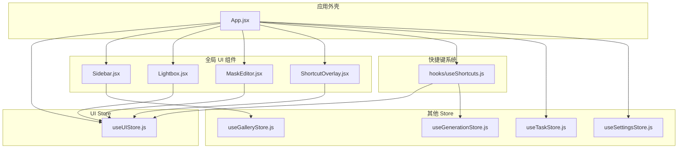
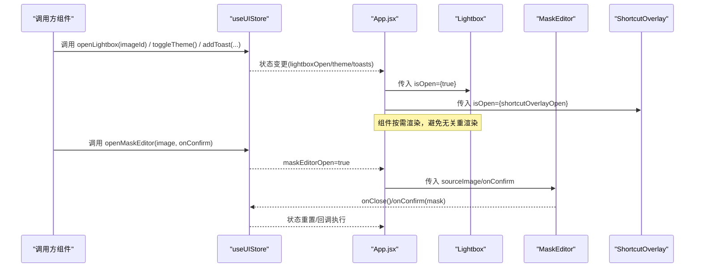
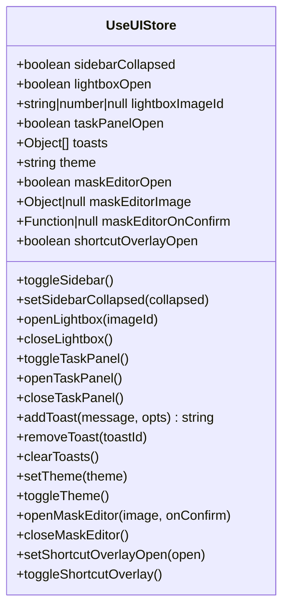
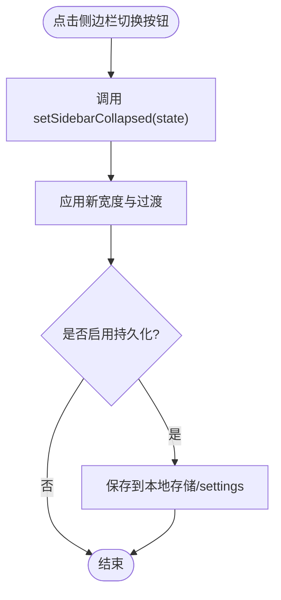
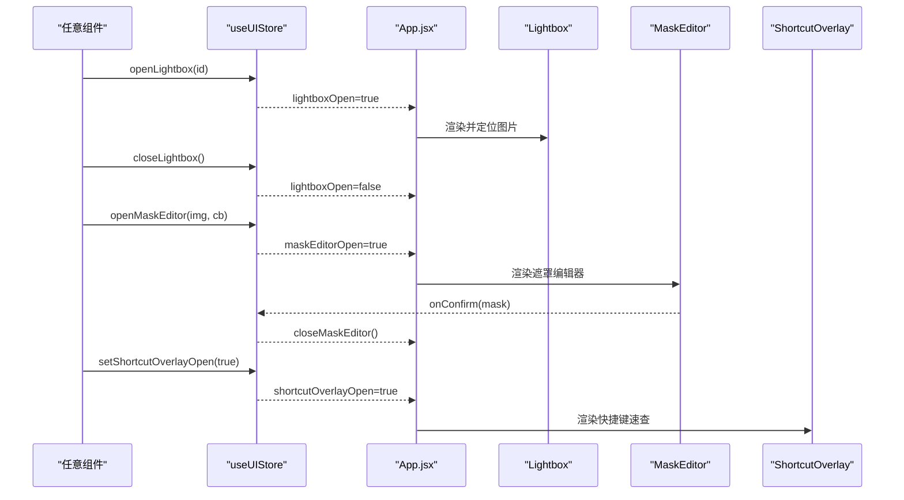
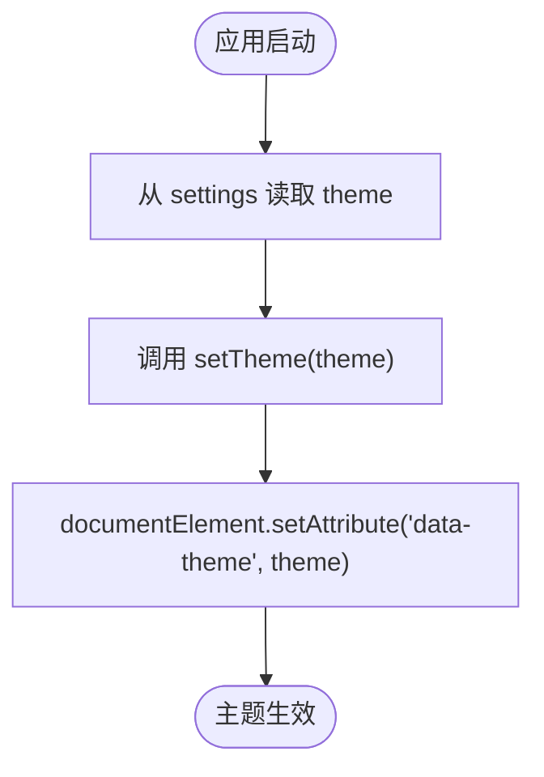
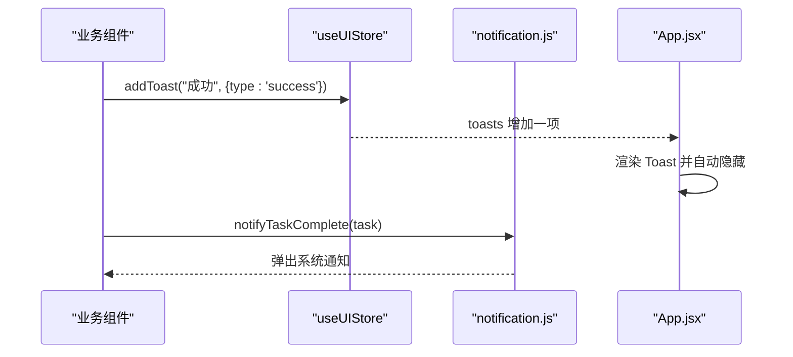
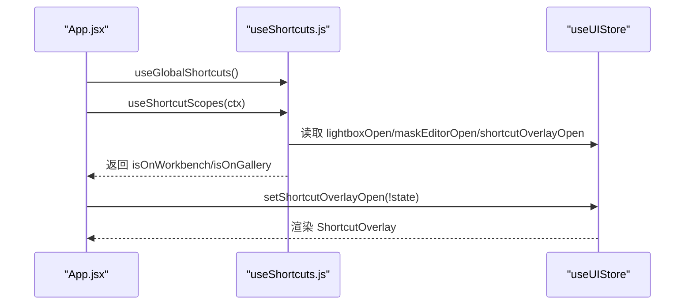
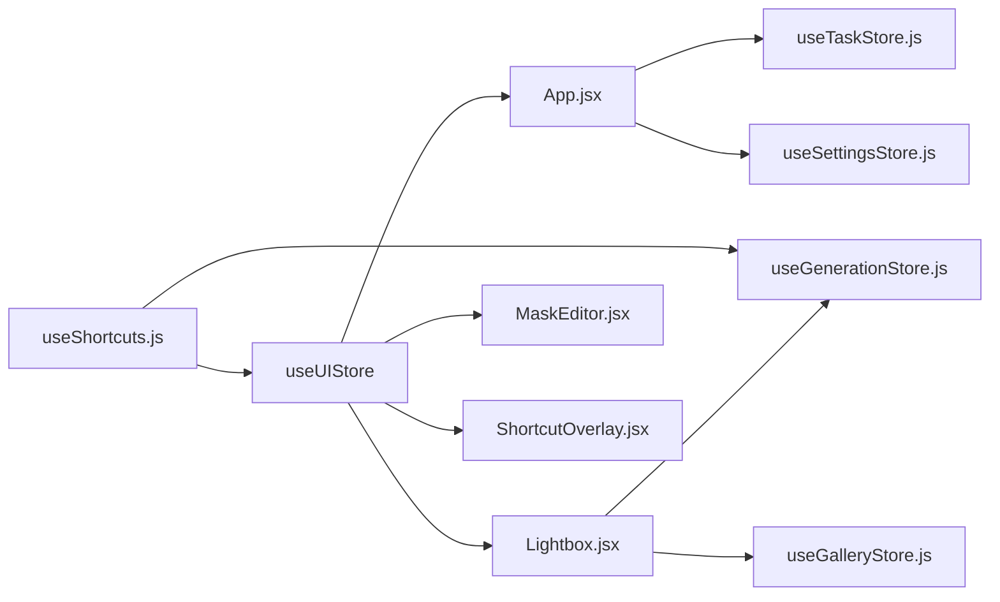

# UI 状态管理 (useUIStore)

<cite>
**本文引用的文件列表**
- [app/src/stores/useUIStore.js](file://app/src/stores/useUIStore.js)
- [app/src/App.jsx](file://app/src/App.jsx)
- [app/src/components/Sidebar.jsx](file://app/src/components/Sidebar.jsx)
- [app/src/components/Lightbox.jsx](file://app/src/components/Lightbox.jsx)
- [app/src/components/MaskEditor.jsx](file://app/src/components/MaskEditor.jsx)
- [app/src/components/ShortcutOverlay.jsx](file://app/src/components/ShortcutOverlay.jsx)
- [app/src/hooks/useShortcuts.js](file://app/src/hooks/useShortcuts.js)
- [app/src/services/notification.js](file://app/src/services/notification.js)
- [app/src/stores/useSettingsStore.js](file://app/src/stores/useSettingsStore.js)
- [app/src/stores/useGenerationStore.js](file://app/src/stores/useGenerationStore.js)
- [app/src/stores/useGalleryStore.js](file://app/src/stores/useGalleryStore.js)
- [app/src/stores/useTaskStore.js](file://app/src/stores/useTaskStore.js)
</cite>

## 目录
1. [简介](#简介)
2. [项目结构](#项目结构)
3. [核心组件](#核心组件)
4. [架构总览](#架构总览)
5. [详细组件分析](#详细组件分析)
6. [依赖关系分析](#依赖关系分析)
7. [性能与渲染优化](#性能与渲染优化)
8. [故障排查指南](#故障排查指南)
9. [结论](#结论)
10. [附录：扩展与最佳实践](#附录扩展与最佳实践)

## 简介
本文件围绕 useUIStore 构建的 UI 状态管理体系，系统性说明全局 UI 状态的设计模式、组件间通信机制、快捷键系统、通知系统与用户偏好设置的处理方式。重点覆盖以下能力：
- 侧边栏展开/折叠（当前由 Sidebar 本地 state 控制，但可迁移至 useUIStore）
- 模态框显示控制（Lightbox、MaskEditor、ShortcutOverlay）
- 主题切换（dark/light）
- 响应式布局状态（通过 CSS 变量与容器宽度联动）
- 全局 UI 组件的状态共享与订阅优化
- 快捷键系统的状态管理与作用域切换
- 通知系统的状态同步（Toast + 浏览器通知）
- 用户偏好设置的持久化策略（主题等）

## 项目结构
UI 状态集中在 useUIStore，配合 App 顶层组合多个全局 UI 组件（任务面板、Lightbox、遮罩编辑器、快捷键速查），并通过 hooks 和 store 实现跨页面状态共享。

图表来源
- [app/src/App.jsx:245-351](file://app/src/App.jsx#L245-L351)
- [app/src/stores/useUIStore.js:12-158](file://app/src/stores/useUIStore.js#L12-L158)
- [app/src/components/Sidebar.jsx:154-371](file://app/src/components/Sidebar.jsx#L154-L371)
- [app/src/components/Lightbox.jsx:13-702](file://app/src/components/Lightbox.jsx#L13-L702)
- [app/src/components/MaskEditor.jsx:20-800](file://app/src/components/MaskEditor.jsx#L20-L800)
- [app/src/components/ShortcutOverlay.jsx:9-137](file://app/src/components/ShortcutOverlay.jsx#L9-L137)
- [app/src/hooks/useShortcuts.js:22-134](file://app/src/hooks/useShortcuts.js#L22-L134)
- [app/src/stores/useGenerationStore.js:22-360](file://app/src/stores/useGenerationStore.js#L22-L360)
- [app/src/stores/useGalleryStore.js:11-204](file://app/src/stores/useGalleryStore.js#L11-L204)
- [app/src/stores/useTaskStore.js:14-173](file://app/src/stores/useTaskStore.js#L14-L173)
- [app/src/stores/useSettingsStore.js:47-162](file://app/src/stores/useSettingsStore.js#L47-L162)

章节来源
- [app/src/App.jsx:245-351](file://app/src/App.jsx#L245-L351)
- [app/src/stores/useUIStore.js:12-158](file://app/src/stores/useUIStore.js#L12-L158)

## 核心组件
- useUIStore：集中管理全局 UI 状态（侧边栏、Lightbox、任务面板、Toast、主题、遮罩编辑器、快捷键浮层）。提供增删改查与副作用（如将 data-theme 写入 DOM）。
- App.jsx：作为应用外壳，挂载全局 UI 组件，初始化快捷键作用域，请求通知权限，并桥接各 Store 的状态到 UI。
- Lightbox：基于 useUIStore 打开/关闭，展示图片详情与操作。
- MaskEditor：通过 useUIStore 打开，接收源图与回调，完成遮罩绘制后回传结果。
- ShortcutOverlay：受 useUIStore 控制显示，展示快捷键分组信息。
- useShortcuts：集中注册快捷键，按作用域（global/workbench/gallery/lightbox/mask-editor）启用/禁用。

章节来源
- [app/src/stores/useUIStore.js:12-158](file://app/src/stores/useUIStore.js#L12-L158)
- [app/src/App.jsx:245-351](file://app/src/App.jsx#L245-L351)
- [app/src/components/Lightbox.jsx:13-702](file://app/src/components/Lightbox.jsx#L13-L702)
- [app/src/components/MaskEditor.jsx:20-800](file://app/src/components/MaskEditor.jsx#L20-L800)
- [app/src/components/ShortcutOverlay.jsx:9-137](file://app/src/components/ShortcutOverlay.jsx#L9-L137)
- [app/src/hooks/useShortcuts.js:22-134](file://app/src/hooks/useShortcuts.js#L22-L134)

## 架构总览
useUIStore 作为单一事实来源，为所有全局 UI 组件提供状态与动作。App 在顶层订阅关键状态并渲染对应组件；组件通过 actions 修改状态，触发最小范围更新。

图表来源
- [app/src/stores/useUIStore.js:45-157](file://app/src/stores/useUIStore.js#L45-L157)
- [app/src/App.jsx:245-351](file://app/src/App.jsx#L245-L351)
- [app/src/components/Lightbox.jsx:13-702](file://app/src/components/Lightbox.jsx#L13-L702)
- [app/src/components/MaskEditor.jsx:20-800](file://app/src/components/MaskEditor.jsx#L20-L800)
- [app/src/components/ShortcutOverlay.jsx:9-137](file://app/src/components/ShortcutOverlay.jsx#L9-L137)

## 详细组件分析

### useUIStore 设计与数据模型
- 状态字段
  - sidebarCollapsed：侧边栏折叠状态（当前由 Sidebar 本地 state 控制，可在后续迁移至此处）
  - lightboxOpen / lightboxImageId：Lightbox 开关与目标图片 ID
  - taskPanelOpen：任务面板开关
  - toasts：通知队列（id、type、message、duration）
  - theme：'dark' | 'light'
  - maskEditorOpen / maskEditorImage / maskEditorOnConfirm：遮罩编辑器开关、源图与确认回调
  - shortcutOverlayOpen：快捷键速查浮层开关
- 动作方法
  - 侧边栏：toggleSidebar、setSidebarCollapsed
  - Lightbox：openLightbox、closeLightbox
  - 任务面板：toggleTaskPanel、openTaskPanel、closeTaskPanel
  - Toast：addToast、removeToast、clearToasts（支持自动消失）
  - 主题：setTheme、toggleTheme（同时写入 document.documentElement 的 data-theme）
  - 遮罩编辑器：openMaskEditor、closeMaskEditor
  - 快捷键浮层：setShortcutOverlayOpen、toggleShortcutOverlay
- 不可变更新
  - 使用 immer produce 进行局部更新，减少样板代码并确保一致性

图表来源
- [app/src/stores/useUIStore.js:12-158](file://app/src/stores/useUIStore.js#L12-L158)

章节来源
- [app/src/stores/useUIStore.js:12-158](file://app/src/stores/useUIStore.js#L12-L158)

### 侧边栏展开/折叠
- 现状：Sidebar 内部维护 collapsed 本地 state，点击按钮切换，影响宽度与内容可见性。
- 建议：将 collapsed 提升为 useUIStore 的 sidebarCollapsed，使多组件（如主内容区、任务面板）能一致响应布局变化。
- 交互流程
  - 点击“收起/展开”按钮 -> 调用 setSidebarCollapsed(true/false)
  - 主布局根据状态调整宽度与过渡动画
  - 可选：将状态持久化到 localStorage 或 settings store

章节来源
- [app/src/components/Sidebar.jsx:154-371](file://app/src/components/Sidebar.jsx#L154-L371)

### 模态框显示控制（Lightbox、MaskEditor、ShortcutOverlay）
- Lightbox
  - 由 App 顶层 GlobalLightbox 统一渲染，依据 useUIStore.lightboxOpen 与 lightboxImageId 决定显示与数据来源（生成结果或图库）。
  - 组件内处理图片导航、收藏、下载、加入知识库、移动到文件夹等操作。
- MaskEditor
  - 通过 useUIStore.openMaskEditor 打开，传入源图与 onConfirm 回调；完成后关闭并回传遮罩数据。
- ShortcutOverlay
  - 通过 useUIStore.shortcutOverlayOpen 控制显示，用于展示快捷键分组。

图表来源
- [app/src/App.jsx:245-351](file://app/src/App.jsx#L245-L351)
- [app/src/stores/useUIStore.js:45-157](file://app/src/stores/useUIStore.js#L45-L157)
- [app/src/components/Lightbox.jsx:13-702](file://app/src/components/Lightbox.jsx#L13-L702)
- [app/src/components/MaskEditor.jsx:20-800](file://app/src/components/MaskEditor.jsx#L20-L800)
- [app/src/components/ShortcutOverlay.jsx:9-137](file://app/src/components/ShortcutOverlay.jsx#L9-L137)

章节来源
- [app/src/components/Lightbox.jsx:13-702](file://app/src/components/Lightbox.jsx#L13-L702)
- [app/src/components/MaskEditor.jsx:20-800](file://app/src/components/MaskEditor.jsx#L20-L800)
- [app/src/components/ShortcutOverlay.jsx:9-137](file://app/src/components/ShortcutOverlay.jsx#L9-L137)

### 主题切换与用户偏好设置
- useUIStore.setTheme/toggleTheme 负责切换 theme 并写入 DOM 的 data-theme 属性，驱动 CSS 变量主题。
- useSettingsStore.generalConfig.theme 可作为持久化入口，结合 loadSettings/saveSettings 实现启动加载与保存。
- 建议：在应用启动时读取 generalConfig.theme 并调用 setTheme，保证刷新后主题一致。

图表来源
- [app/src/stores/useUIStore.js:119-131](file://app/src/stores/useUIStore.js#L119-L131)
- [app/src/stores/useSettingsStore.js:47-162](file://app/src/stores/useSettingsStore.js#L47-L162)

章节来源
- [app/src/stores/useUIStore.js:119-131](file://app/src/stores/useUIStore.js#L119-L131)
- [app/src/stores/useSettingsStore.js:47-162](file://app/src/stores/useSettingsStore.js#L47-L162)

### 通知系统状态同步（Toast + 浏览器通知）
- Toast
  - useUIStore.addToast 创建带 id 的通知项，支持类型与持续时间；自动定时移除。
  - App 中可渲染 Toast 容器，监听 toasts 数组并展示。
- 浏览器通知
  - services/notification 封装权限申请与发送，适用于后台任务完成/失败场景。
  - App 启动时调用 requestPermission，确保首次交互获得授权。

图表来源
- [app/src/stores/useUIStore.js:74-117](file://app/src/stores/useUIStore.js#L74-L117)
- [app/src/services/notification.js:19-113](file://app/src/services/notification.js#L19-L113)
- [app/src/App.jsx:281-284](file://app/src/App.jsx#L281-L284)

章节来源
- [app/src/stores/useUIStore.js:74-117](file://app/src/stores/useUIStore.js#L74-L117)
- [app/src/services/notification.js:19-113](file://app/src/services/notification.js#L19-L113)
- [app/src/App.jsx:281-284](file://app/src/App.jsx#L281-L284)

### 快捷键系统状态管理与作用域
- useGlobalShortcuts 注册全局与工作台相关快捷键，useShortcutScopes 根据路由与 UI 状态动态启用/禁用作用域。
- 优先级顺序：mask-editor > lightbox > workbench > gallery > global。
- 快捷键浮层由 useUIStore.shortcutOverlayOpen 控制显示。

图表来源
- [app/src/hooks/useShortcuts.js:22-134](file://app/src/hooks/useShortcuts.js#L22-L134)
- [app/src/stores/useUIStore.js:145-157](file://app/src/stores/useUIStore.js#L145-L157)
- [app/src/App.jsx:266-270](file://app/src/App.jsx#L266-L270)

章节来源
- [app/src/hooks/useShortcuts.js:22-134](file://app/src/hooks/useShortcuts.js#L22-L134)
- [app/src/components/ShortcutOverlay.jsx:9-137](file://app/src/components/ShortcutOverlay.jsx#L9-L137)

### 响应式布局状态
- 侧边栏宽度通过 CSS 变量与 collapsed 状态联动，主内容区自适应。
- 建议：将 collapsed 纳入 useUIStore，以便主内容区、任务面板、全屏组件等统一响应。

章节来源
- [app/src/components/Sidebar.jsx:246-333](file://app/src/components/Sidebar.jsx#L246-L333)

## 依赖关系分析
- useUIStore 被 App 及多个全局 UI 组件直接订阅；
- useShortcuts 依赖 useUIStore 的 UI 状态以决定作用域；
- Lightbox 与 MaskEditor 通过 useUIStore 打开/关闭，并与 useGenerationStore/useGalleryStore 协作获取数据；
- TaskStore 与 Notification 服务在应用生命周期中初始化，与 UI 状态解耦但共同影响用户体验。

图表来源
- [app/src/stores/useUIStore.js:12-158](file://app/src/stores/useUIStore.js#L12-L158)
- [app/src/App.jsx:245-351](file://app/src/App.jsx#L245-L351)
- [app/src/hooks/useShortcuts.js:22-134](file://app/src/hooks/useShortcuts.js#L22-L134)
- [app/src/components/Lightbox.jsx:13-702](file://app/src/components/Lightbox.jsx#L13-L702)
- [app/src/components/MaskEditor.jsx:20-800](file://app/src/components/MaskEditor.jsx#L20-L800)
- [app/src/components/ShortcutOverlay.jsx:9-137](file://app/src/components/ShortcutOverlay.jsx#L9-L137)
- [app/src/stores/useGenerationStore.js:22-360](file://app/src/stores/useGenerationStore.js#L22-L360)
- [app/src/stores/useGalleryStore.js:11-204](file://app/src/stores/useGalleryStore.js#L11-L204)
- [app/src/stores/useTaskStore.js:14-173](file://app/src/stores/useTaskStore.js#L14-L173)
- [app/src/stores/useSettingsStore.js:47-162](file://app/src/stores/useSettingsStore.js#L47-L162)

章节来源
- [app/src/stores/useUIStore.js:12-158](file://app/src/stores/useUIStore.js#L12-L158)
- [app/src/App.jsx:245-351](file://app/src/App.jsx#L245-L351)

## 性能与渲染优化
- 细粒度订阅
  - 在组件中仅订阅必要字段，例如 useUIStore(s => s.lightboxOpen)，避免订阅整个 store 导致不必要的重渲染。
- 不可变更新
  - 使用 immer produce 更新复杂对象（如 toasts 数组），减少样板代码并提高一致性。
- 副作用隔离
  - 将 DOM 副作用（如设置 data-theme）放在 action 中，避免在渲染阶段产生副作用。
- 延迟与去抖
  - Toast 自动消失使用 setTimeout，避免频繁更新；对高频输入（如搜索）可使用防抖。
- 条件渲染
  - 仅在 isOpen 为 true 时渲染大型组件（Lightbox、MaskEditor），降低初始渲染成本。
- 事件与监听
  - 在 useEffect 中注册/清理事件监听器，避免内存泄漏。

[本节为通用指导，不直接分析具体文件]

## 故障排查指南
- 主题未生效
  - 检查 setTheme 是否正确写入 document.documentElement 的 data-theme。
  - 确认 CSS 变量与选择器匹配。
- Toast 不消失
  - 检查 addToast 的 duration 参数与 removeToast 逻辑。
- 快捷键冲突
  - 确认 useShortcutScopes 正确启用/禁用作用域；在高优先级作用域（mask-editor、lightbox）下，低优先级快捷键应被屏蔽。
- 通知权限被拒绝
  - 检查 requestPermission 调用时机与返回值；必要时引导用户手动开启。

章节来源
- [app/src/stores/useUIStore.js:119-131](file://app/src/stores/useUIStore.js#L119-L131)
- [app/src/stores/useUIStore.js:74-117](file://app/src/stores/useUIStore.js#L74-L117)
- [app/src/hooks/useShortcuts.js:116-134](file://app/src/hooks/useShortcuts.js#L116-L134)
- [app/src/services/notification.js:19-43](file://app/src/services/notification.js#L19-L43)

## 结论
useUIStore 提供了清晰的全局 UI 状态中心，配合 App 顶层组合与组件级细粒度订阅，实现了良好的可扩展性与可维护性。通过 immer 的不可变更新与条件渲染策略，有效控制了重渲染范围。未来可将侧边栏折叠状态提升至 useUIStore，并完善主题持久化与更多 UI 状态的统一管理。

[本节为总结，不直接分析具体文件]

## 附录：扩展与最佳实践

### 如何扩展新的 UI 状态
- 在 useUIStore 中添加新字段与对应的 actions。
- 在 App 顶层订阅并渲染对应组件或区域。
- 在需要触发的组件中调用 actions，保持单向数据流。

示例路径参考
- [app/src/stores/useUIStore.js:12-158](file://app/src/stores/useUIStore.js#L12-L158)
- [app/src/App.jsx:245-351](file://app/src/App.jsx#L245-L351)

### 组件间状态同步
- 使用 useUIStore 作为共享状态源，避免 prop drilling。
- 对于跨模块的数据（如图片列表），结合 useGenerationStore/useGalleryStore 协同工作。

示例路径参考
- [app/src/components/Lightbox.jsx:13-702](file://app/src/components/Lightbox.jsx#L13-L702)
- [app/src/stores/useGenerationStore.js:22-360](file://app/src/stores/useGenerationStore.js#L22-L360)
- [app/src/stores/useGalleryStore.js:11-204](file://app/src/stores/useGalleryStore.js#L11-L204)

### 优化渲染性能
- 使用函数式订阅，只订阅需要的字段。
- 将大组件的条件渲染与懒加载结合（React.lazy 已在 App 中使用）。
- 避免在 render 中计算昂贵逻辑，使用 useMemo/useCallback 缓存。

示例路径参考
- [app/src/App.jsx:18-24](file://app/src/App.jsx#L18-L24)
- [app/src/components/Lightbox.jsx:42-57](file://app/src/components/Lightbox.jsx#L42-L57)

### 状态持久化策略
- 主题：在应用启动时从 useSettingsStore.generalConfig.theme 读取并调用 setTheme。
- 侧边栏折叠：可考虑存入 localStorage 或 settings store，并在初始化时恢复。
- 通知权限：在应用启动时请求，记录结果以避免重复弹窗。

示例路径参考
- [app/src/stores/useSettingsStore.js:108-149](file://app/src/stores/useSettingsStore.js#L108-L149)
- [app/src/services/notification.js:19-43](file://app/src/services/notification.js#L19-L43)