# Zustand 状态管理

<cite>
**本文引用的文件**
- [useGenerationStore.js](file://app/src/stores/useGenerationStore.js)
- [useGalleryStore.js](file://app/src/stores/useGalleryStore.js)
- [useTaskStore.js](file://app/src/stores/useTaskStore.js)
- [useSettingsStore.js](file://app/src/stores/useSettingsStore.js)
- [useUIStore.js](file://app/src/stores/useUIStore.js)
- [database.js](file://app/src/db/database.js)
- [electron-backend.js](file://app/src/db/electron-backend.js)
- [dexie-backend.js](file://app/src/db/dexie-backend.js)
- [storage.js](file://app/src/services/storage.js)
- [task-engine.js](file://app/src/services/task-engine.js)
- [models.js](file://app/src/constants/models.js)
- [package.json](file://app/package.json)
- [Workbench.jsx](file://app/src/pages/Workbench.jsx)
- [Gallery.jsx](file://app/src/pages/Gallery.jsx)
- [App.jsx](file://app/src/App.jsx)
- [main.jsx](file://app/src/main.jsx)
</cite>

## 更新摘要
**变更内容**
- 新增双后端架构说明，涵盖 Electron IPC + SQLite 与 Dexie + IndexedDB 的无缝切换机制
- 完善异步数据库操作适配层，详细说明 stores 如何处理不同环境下的 API 调用模式
- 增强 Blob 数据传输处理，展示 Electron 环境下 ArrayBuffer 与 Blob 的转换机制
- 补充 StorageService 的热区/冷区存储策略，包含本地 IndexedDB 与阿里云 OSS 的协同工作
- 优化错误处理和降级策略，确保在不同数据库后端下的一致性行为

## 目录
1. [简介](#简介)
2. [项目结构](#项目结构)
3. [核心组件](#核心组件)
4. [架构总览](#架构总览)
5. [详细组件分析](#详细组件分析)
6. [多 Store 集成模式](#多-store-集成模式)
7. [异步数据库操作适配层](#异步数据库操作适配层)
8. [Electron 环境特殊处理](#electron-环境特殊处理)
9. [StorageService 热区冷区存储](#storageservice-热区冷区存储)
10. [IndexedDB 持久化策略](#indexeddb-持久化策略)
11. [响应式更新机制](#响应式更新机制)
12. [依赖关系分析](#依赖关系分析)
13. [性能考量](#性能考量)
14. [故障排查指南](#故障排查指南)
15. [结论](#结论)
16. [附录](#附录)

## 简介
本文件面向 AI Image Studio 的 Zustand 状态管理层，系统性梳理多 Store 集成的设计模式、状态结构与更新机制。重点覆盖：
- useGenerationStore：图像生成工作流的状态管理与持久化
- useGalleryStore：图库浏览、筛选、批量操作的独立状态域
- useTaskStore：后台任务队列与 TaskEngine 事件桥接
- useSettingsStore：应用设置与模型配置的集中管理
- useUIStore：全局 UI 状态的无副作用管理

同时详细说明双后端架构（Electron IPC + SQLite / Dexie + IndexedDB）的适配机制、Immer 的使用方式、StorageService 的热区冷区存储策略、多 Store 间的响应式更新机制，并给出完整的应用初始化流程和性能优化技巧。

## 项目结构
Zustand Store 位于 app/src/stores 下，每个业务域一个 store；数据库层使用策略模式封装，支持 Electron IPC + SQLite 和浏览器 Dexie + IndexedDB 两种后端；任务调度由 TaskEngine 提供；StorageService 负责热区（本地）和冷区（OSS）存储；常量定义在 constants/models.js；页面组件通过 hooks 订阅对应 store。

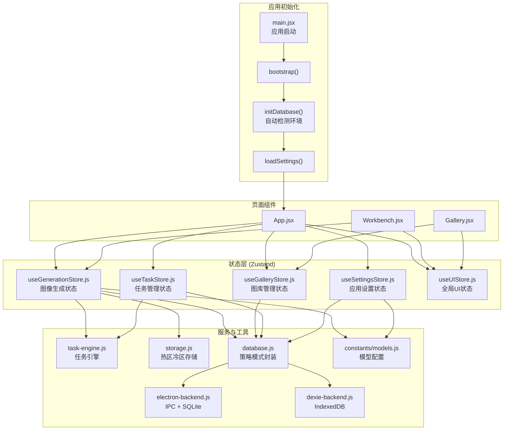

**图表来源**
- [main.jsx:12-29](file://app/src/main.jsx#L12-L29)
- [App.jsx:245-279](file://app/src/App.jsx#L245-L279)
- [useGenerationStore.js:1-430](file://app/src/stores/useGenerationStore.js#L1-L430)
- [useGalleryStore.js:1-224](file://app/src/stores/useGalleryStore.js#L1-L224)
- [useTaskStore.js:1-173](file://app/src/stores/useTaskStore.js#L1-L173)
- [useSettingsStore.js:1-179](file://app/src/stores/useSettingsStore.js#L1-L179)
- [useUIStore.js:1-159](file://app/src/stores/useUIStore.js#L1-L159)
- [database.js:1-98](file://app/src/db/database.js#L1-L98)
- [electron-backend.js:1-331](file://app/src/db/electron-backend.js#L1-L331)
- [dexie-backend.js:1-310](file://app/src/db/dexie-backend.js#L1-L310)
- [storage.js:1-457](file://app/src/services/storage.js#L1-L457)
- [task-engine.js:1-319](file://app/src/services/task-engine.js#L1-L319)
- [models.js:1-110](file://app/src/constants/models.js#L1-L110)

**章节来源**
- [package.json:1-30](file://app/package.json#L1-L30)

## 核心组件
本节概述各 Store 的职责边界与关键能力。

### useGenerationStore
- **职责**：维护当前模型、提示词、参考图、生成参数、结果集、批次历史、生成进度与错误信息
- **更新机制**：基于 Immer produce 进行不可变更新；异步生成流程通过 TaskEngine 执行适配器，回调中通过 StorageService 持久化到热区或冷区，完成后回写 store
- **关键点**：支持文本到图像与图像到图像两种路径；失败时尝试将"待处理"记录标记为失败；支持扩写提示词与收藏/删除结果；Blob URL 转换为 data URL 以兼容外部 API

### useGalleryStore  
- **职责**：图片列表、文件夹树、视图模式、搜索与过滤、多选与批量操作
- **更新机制**：从数据库层加载并按条件筛选；客户端二次过滤（如日期范围、纵横比）；批量操作后刷新列表；自动重建 blob URLs 以处理页面刷新后的过期引用
- **特点**：独立的图库状态域，与生成流程解耦；支持热区冷区图片的统一访问

### useTaskStore
- **职责**：后台任务列表、活跃计数、增删改查、重试/取消/暂停/恢复、统计
- **更新机制**：初始化一次事件桥，监听 TaskEngine 的事件并刷新任务列表；所有变更均落库后同步 store
- **桥接模式**：作为 TaskEngine 与 UI 之间的桥梁，确保状态一致性

### useSettingsStore
- **职责**：模型配置、存储配置、扩写配置、通用设置、引导完成标志
- **更新机制**：修改任一配置即持久化到数据库层；启动时加载合并默认值
- **配置管理**：基于 models.js 中的模型能力与默认参数动态构建 modelConfigs

### useUIStore
- **职责**：侧边栏折叠、灯箱、任务面板、Toast 通知、主题、遮罩编辑器开关、快捷键浮层
- **更新机制**：纯前端状态，部分动作触发 DOM 属性或定时器清理
- **无副作用**：最小化外部依赖，专注于 UI 状态管理

**章节来源**
- [useGenerationStore.js:1-430](file://app/src/stores/useGenerationStore.js#L1-L430)
- [useGalleryStore.js:1-224](file://app/src/stores/useGalleryStore.js#L1-L224)
- [useTaskStore.js:1-173](file://app/src/stores/useTaskStore.js#L1-L173)
- [useSettingsStore.js:1-179](file://app/src/stores/useSettingsStore.js#L1-L179)
- [useUIStore.js:1-159](file://app/src/stores/useUIStore.js#L1-L159)

## 架构总览
整体采用"领域分治 + 事件桥 + 持久化 + 双后端适配"的分层架构：
- 页面组件仅订阅最小必要字段，避免过度重渲染
- Store 内部通过 Immer 简化不可变更新逻辑
- 长耗时任务统一交由 TaskEngine 调度，Store 通过事件桥保持 UI 与任务状态一致
- 所有重要数据通过策略模式持久化，自动选择 Electron IPC + SQLite 或 Dexie + IndexedDB
- StorageService 提供热区（本地快速访问）和冷区（云端长期存储）的统一接口
- 应用启动时按序初始化数据库和设置，确保状态可用性

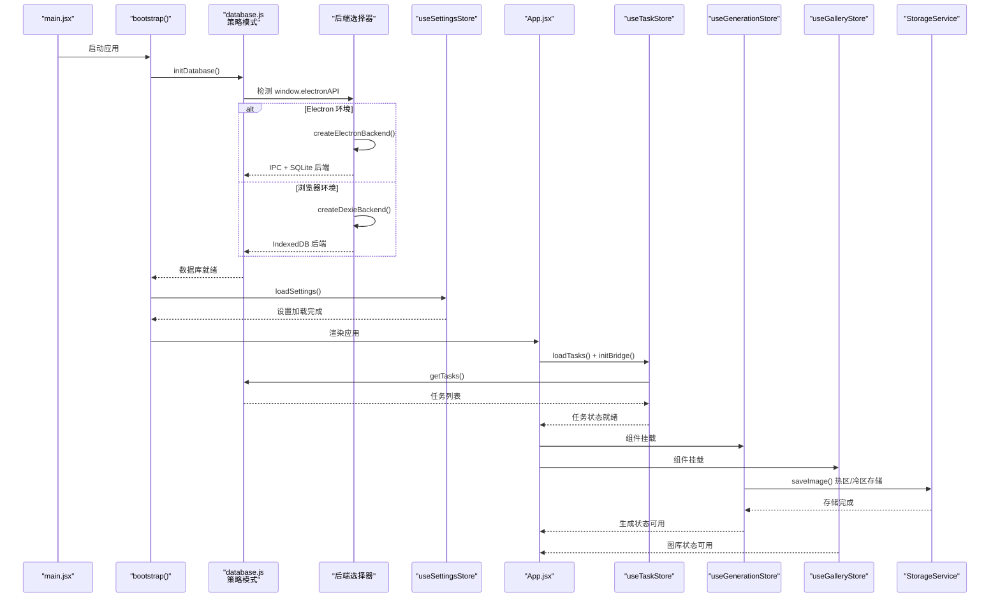

**图表来源**
- [main.jsx:12-29](file://app/src/main.jsx#L12-L29)
- [App.jsx:272-279](file://app/src/App.jsx#L272-L279)
- [database.js:22-30](file://app/src/db/database.js#L22-L30)
- [useTaskStore.js:22-33](file://app/src/stores/useTaskStore.js#L22-L33)
- [useTaskStore.js:39-64](file://app/src/stores/useTaskStore.js#L39-L64)

## 详细组件分析

### useGenerationStore 分析
- **状态结构**
  - 当前模型、提示词、扩写结果、参考图数组、参数对象、结果集、批次历史、生成标志与进度、错误信息
- **关键动作**
  - setModel/setPrompt/setParam：重置或更新参数
  - addReferenceImage/removeReferenceImage/setReferenceImageRole：管理参考图及其角色
  - generate：核心生成流程，包含：
    - 校验输入
    - 创建批次记录
    - 构建 execute 函数，根据是否含参考图选择 text2image 或 image2image 路径
    - 提交至 TaskEngine，并在 onProgress/onTaskSubmitted 回调中通过 StorageService 持久化图片和缩略图
    - 成功后更新 results 与 batchHistory
  - expandPrompt/selectExpandedPrompt：LLM 扩写提示词
  - favoriteImage/discardImage/regenerate/clearGeneration：结果集操作
- **错误处理**
  - 捕获适配器异常，若已写入"待处理"记录则更新为失败；最终在 finally 中重置 isGenerating
- **性能与一致性**
  - 使用 Immer produce 减少样板代码与浅比较开销
  - 首次成功结果优先更新"待处理"记录，避免重复插入
  - Blob URL 自动转换为 data URL 以兼容外部 API 要求

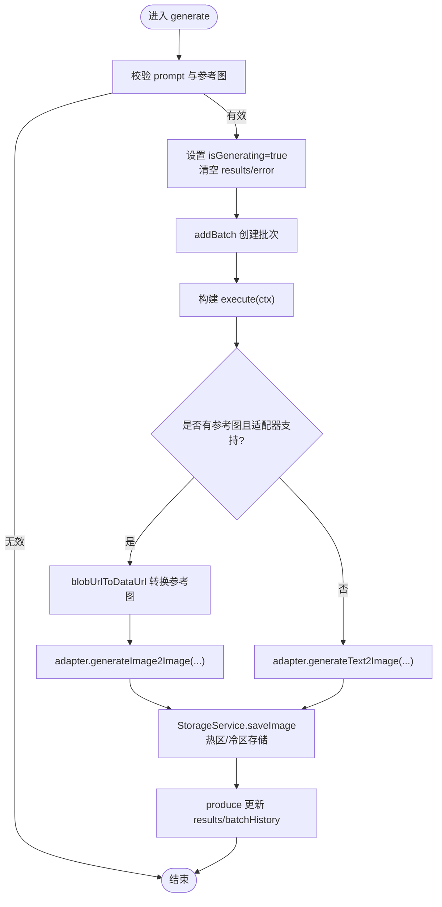

**图表来源**
- [useGenerationStore.js:136-360](file://app/src/stores/useGenerationStore.js#L136-L360)
- [storage.js:53-101](file://app/src/services/storage.js#L53-L101)

**章节来源**
- [useGenerationStore.js:1-430](file://app/src/stores/useGenerationStore.js#L1-L430)
- [models.js:1-110](file://app/src/constants/models.js#L1-L110)
- [database.js:34-50](file://app/src/db/database.js#L34-L50)

### useGalleryStore 分析
- **状态结构**
  - images、folders、currentFolder、viewMode、searchQuery/searchType、filters、selectedImages、isLoading
- **关键动作**
  - loadImages/loadFolders：按条件查询数据库层，支持关键词搜索与多字段过滤
  - search/filter：组合查询条件并重新加载
  - toggleFavorite/moveImages/deleteImages：单条或批量操作，随后刷新列表
  - createFolder/renameFolder/deleteFolder：文件夹 CRUD
  - setCurrentFolder/setViewMode/selectImage/clearSelection：导航与选择态
  - batchAction：统一入口处理收藏/移动/删除等批量行为
- **客户端过滤**
  - 在服务器端过滤基础上，再按 dateRange 与纵横比做客户端二次过滤，提升交互体验
- **Blob URL 重建**
  - 自动重建过期的 blob URLs，确保页面刷新后图片正常显示

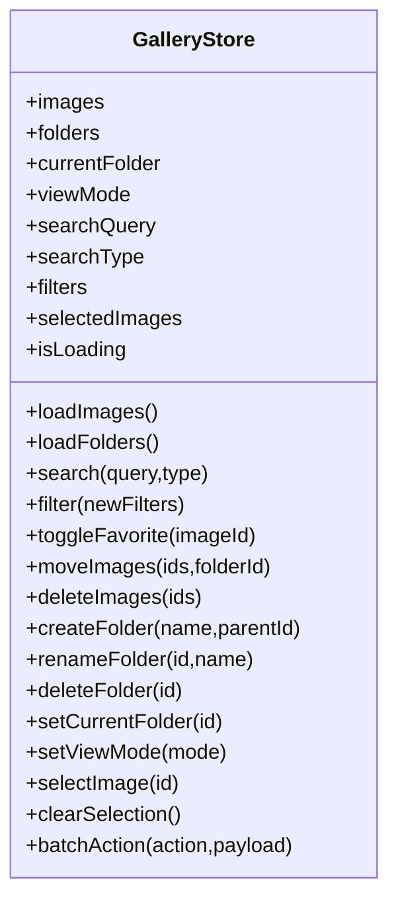

**图表来源**
- [useGalleryStore.js:11-223](file://app/src/stores/useGalleryStore.js#L11-L223)

**章节来源**
- [useGalleryStore.js:1-224](file://app/src/stores/useGalleryStore.js#L1-L224)
- [database.js:34-43](file://app/src/db/database.js#L34-L43)

### useTaskStore 分析
- **状态结构**
  - tasks、activeTaskCount、_bridgeInitialized
- **关键动作**
  - initBridge：一次性注册 TaskEngine 事件监听，自动刷新任务列表
  - loadTasks：读取数据库层并计算活跃任务数
  - addTask/updateTask/removeTask：基础 CRUD
  - retryTask/cancelTask/pauseTask/resumeTask：控制任务生命周期
  - getTaskStats/clearCompleted：统计与清理
- **事件桥设计**
  - 监听 queued/started/progress/completed/failed/cancelled/paused/retry 等事件，统一刷新任务列表，确保 UI 与引擎状态一致

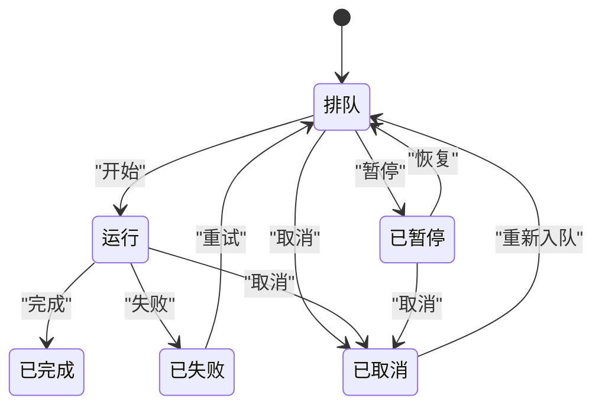

**图表来源**
- [task-engine.js:18-31](file://app/src/services/task-engine.js#L18-L31)
- [useTaskStore.js:39-64](file://app/src/stores/useTaskStore.js#L39-L64)

**章节来源**
- [useTaskStore.js:1-173](file://app/src/stores/useTaskStore.js#L1-L173)
- [task-engine.js:57-92](file://app/src/services/task-engine.js#L57-L92)

### useSettingsStore 分析
- **状态结构**
  - modelConfigs、storageConfig、expansionConfig、generalConfig、isSetupComplete、isLoaded
- **关键动作**
  - updateXxxConfig：局部合并配置并立即持久化
  - completeSetup：标记引导完成并保存
  - loadSettings：启动时拉取全部设置并合并默认值
  - saveSettings：批量持久化
  - resetToDefaults：重置为默认配置并保存
- **默认值构建**
  - 基于 models.js 中的模型能力与默认参数动态构建 modelConfigs

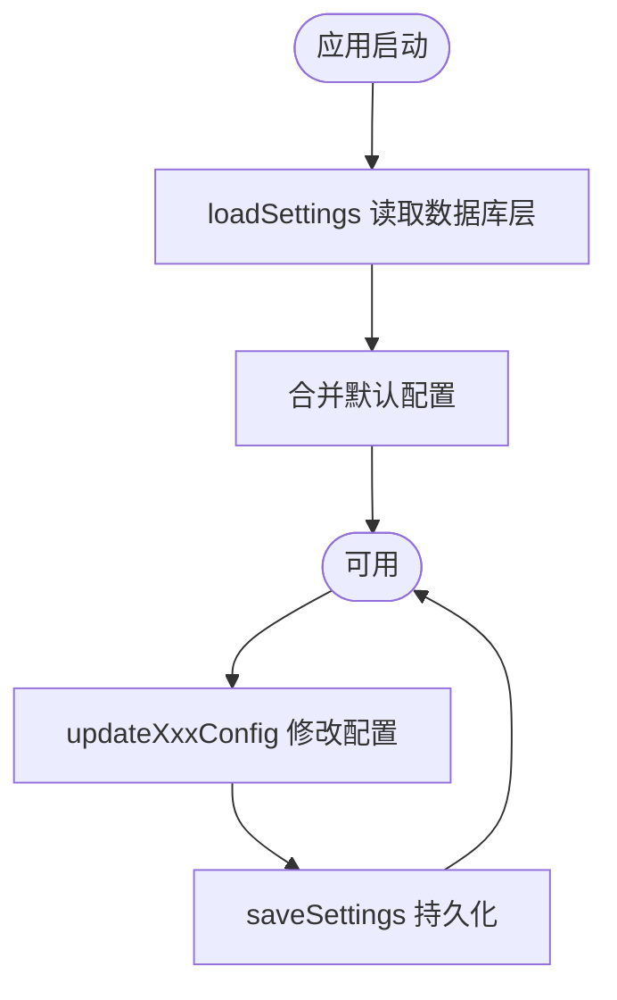

**图表来源**
- [useSettingsStore.js:125-166](file://app/src/stores/useSettingsStore.js#L125-L166)
- [models.js:1-110](file://app/src/constants/models.js#L1-L110)

**章节来源**
- [useSettingsStore.js:1-179](file://app/src/stores/useSettingsStore.js#L1-L179)
- [models.js:1-110](file://app/src/constants/models.js#L1-L110)

### useUIStore 分析
- **状态结构**
  - sidebarCollapsed、lightboxOpen/lightboxImageId、taskPanelOpen、toasts、theme、maskEditor 相关、shortcutOverlayOpen
- **关键动作**
  - 侧边栏/任务面板开关、灯箱打开关闭、主题切换（同步 DOM 属性）、Toast 添加与自动移除、遮罩编辑器开关与回调、快捷键浮层开关
- **特点**
  - 纯前端状态，无副作用或少量副作用（DOM 属性、定时器）

**章节来源**
- [useUIStore.js:1-159](file://app/src/stores/useUIStore.js#L1-L159)

## 多 Store 集成模式

### 应用级状态协调
应用启动时，多个 Store 按特定顺序初始化，确保依赖关系的正确性：

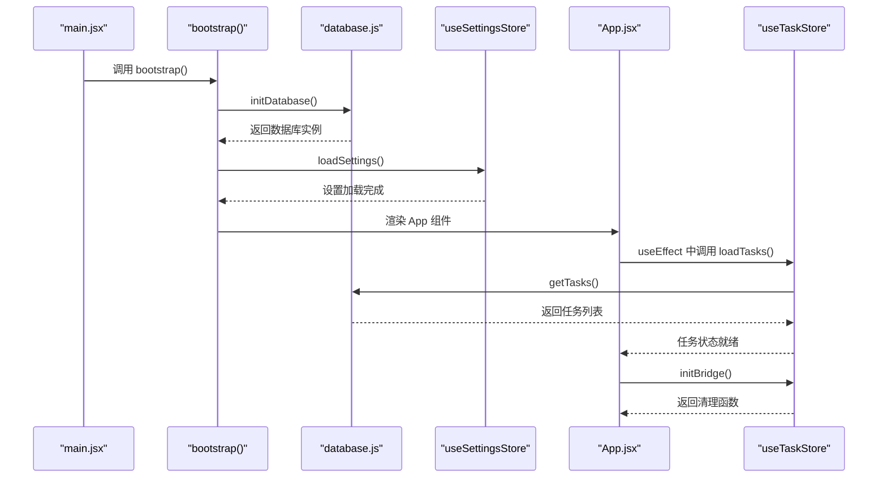

**图表来源**
- [main.jsx:12-29](file://app/src/main.jsx#L12-L29)
- [App.jsx:272-279](file://app/src/App.jsx#L272-L279)

### 跨 Store 数据流
不同 Store 之间通过共享数据和事件机制实现松耦合通信：

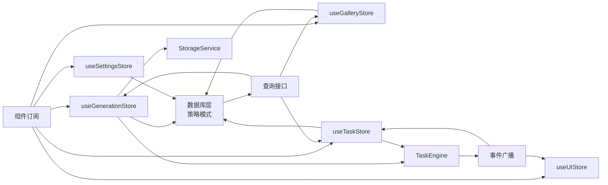

**图表来源**
- [useGenerationStore.js:18-21](file://app/src/stores/useGenerationStore.js#L18-L21)
- [useGalleryStore.js:9](file://app/src/stores/useGalleryStore.js#L9)
- [useTaskStore.js:11-12](file://app/src/stores/useTaskStore.js#L11-L12)
- [useSettingsStore.js:10-11](file://app/src/stores/useSettingsStore.js#L10-L11)

### 状态同步机制
- **单向数据流**：组件 → Store → 数据库层 → Store → 组件
- **事件驱动**：TaskEngine 事件 → useTaskStore → 其他 Store 监听
- **延迟加载**：按需加载数据，减少初始渲染压力
- **增量更新**：使用 Immer 进行局部状态更新，避免全量重渲染

**章节来源**
- [App.jsx:245-279](file://app/src/App.jsx#L245-L279)
- [useTaskStore.js:39-64](file://app/src/stores/useTaskStore.js#L39-L64)

## 异步数据库操作适配层

### 策略模式架构
数据库层采用策略模式，自动检测运行环境并选择合适的后端实现：

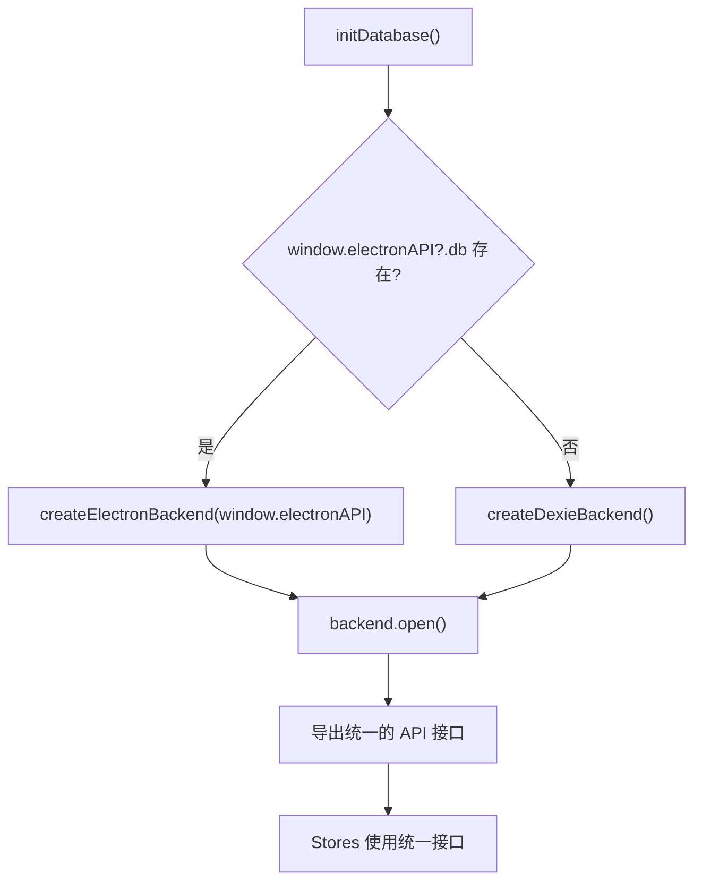

**图表来源**
- [database.js:22-30](file://app/src/db/database.js#L22-L30)

### Electron IPC + SQLite 后端
- **IPC 通信**：通过 `window.electronAPI.db.*` 方法调用主进程的 SQLite 操作
- **Blob 传输**：自动将 Blob 转换为 ArrayBuffer 进行 IPC 传输，零拷贝优化
- **返回值标准化**：确保与 Dexie 后端返回格式完全一致
- **文件系统操作**：通过 `window.electronAPI.fs.*` 进行图片文件的读写

### Dexie + IndexedDB 后端
- **直接访问**：在浏览器环境中直接使用 IndexedDB
- **索引优化**：预定义常用查询字段的索引
- **事务保护**：复杂操作使用数据库事务保证一致性
- **兼容性**：提供与 Electron 后端相同的 API 接口

**章节来源**
- [database.js:1-98](file://app/src/db/database.js#L1-L98)
- [electron-backend.js:1-331](file://app/src/db/electron-backend.js#L1-L331)
- [dexie-backend.js:1-310](file://app/src/db/dexie-backend.js#L1-L310)

## Electron 环境特殊处理

### Blob 数据传输优化
Electron 环境下，Blob 数据需要通过 IPC 传输到主进程，系统提供了高效的转换机制：

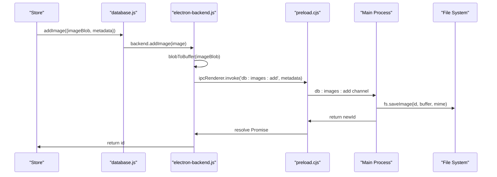

**图表来源**
- [electron-backend.js:48-69](file://app/src/db/electron-backend.js#L48-L69)
- [preload.cjs:8-17](file://app/electron/preload.cjs#L8-L17)

### 环境变量与 API 端口检测
Electron 环境下，系统会自动检测可用的 API 端口，并通过代理转发请求：

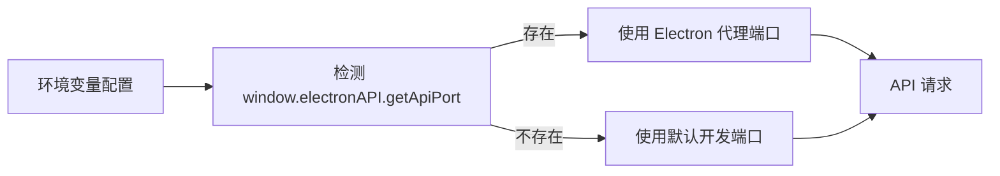

**图表来源**
- [client.js:23-25](file://app/src/services/api/client.js#L23-L25)

**章节来源**
- [electron-backend.js:13-37](file://app/src/db/electron-backend.js#L13-L37)
- [preload.cjs:1-39](file://app/electron/preload.cjs#L1-L39)

## StorageService 热区冷区存储

### 存储策略架构
StorageService 实现了智能的热区（Hot Zone）和冷区（Cold Zone）存储策略：

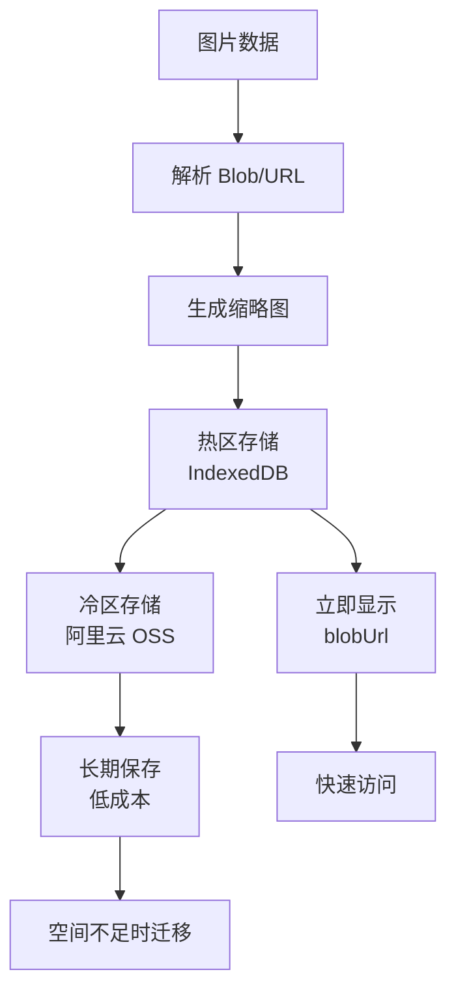

**图表来源**
- [storage.js:53-101](file://app/src/services/storage.js#L53-L101)

### 热区存储特性
- **快速访问**：图片以 Blob 形式存储在 IndexedDB 中，提供毫秒级访问速度
- **内存缓存**：同一会话内使用 blobUrl 缓存，避免重复下载
- **自动重建**：页面刷新后自动重建 blobUrl 引用
- **缩略图生成**：自动生成 200px 尺寸的缩略图用于预览

### 冷区存储特性
- **云端持久化**：图片上传到阿里云 OSS，实现长期安全存储
- **成本优化**：冷区存储成本远低于热区
- **按需下载**：需要时从 OSS 下载，节省本地存储空间
- **自动迁移**：当热区空间超过阈值时，自动将旧图片迁移到冷区

### 存储容量管理
系统提供智能的存储容量监控和自动迁移功能：

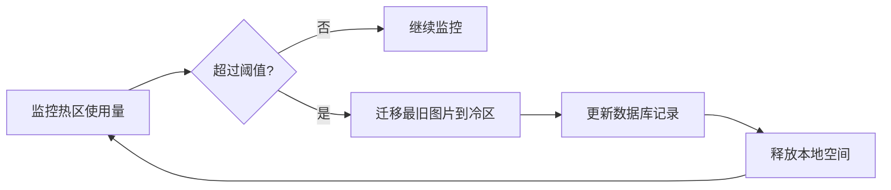

**图表来源**
- [storage.js:316-362](file://app/src/services/storage.js#L316-L362)

**章节来源**
- [storage.js:1-457](file://app/src/services/storage.js#L1-L457)

## IndexedDB 持久化策略

### 数据库架构
使用策略模式封装底层存储，定义了以下核心表结构：

| 表名 | 主键 | 索引 | 用途 |
|------|------|------|------|
| images | ++id | folderId, createdAt, [folderId+createdAt] | 生成的图片记录 |
| batches | ++id | sessionId, model, prompt, createdAt | 生成批次记录 |
| sessions | ++id | createdAt | 工作会话记录 |
| folders | ++id | name, parentId, createdAt | 文件夹结构 |
| tasks | ++id | type, status, model, createdAt, [status+createdAt] | 后台任务记录 |
| settings | key | - | 应用设置键值对 |
| casePackages | ++id | imageId, createdAt | 案例包记录 |

### 持久化时机
- **即时持久化**：任务状态变更、用户操作结果
- **批量持久化**：设置配置、批量操作
- **延迟持久化**：临时状态、缓存数据

### 数据一致性保证
- **事务保护**：复杂操作使用数据库事务
- **冲突解决**：乐观锁机制处理并发更新
- **数据迁移**：版本化管理数据库结构

**章节来源**
- [database.js:22-31](file://app/src/db/database.js#L22-L31)
- [dexie-backend.js:13-22](file://app/src/db/dexie-backend.js#L13-L22)

## 响应式更新机制

### 细粒度订阅
组件通过精确的 selector 订阅所需状态，避免不必要的重渲染：

```javascript
// 工作区组件只订阅必要的生成状态
const currentModel = useGenerationStore(s => s.currentModel);
const prompt = useGenerationStore(s => s.prompt);
const generate = useGenerationStore(s => s.generate);

// 图库组件只订阅图库相关状态
const images = useGalleryStore((s) => s.images);
const folders = useGalleryStore((s) => s.folders);
```

### 批量更新优化
- **Immer 集成**：使用 produce 进行不可变更新，减少浅比较开销
- **状态合并**：相关状态变更合并为单次更新
- **防抖处理**：频繁操作使用防抖减少更新频率

### 跨组件状态同步
- **全局事件**：通过 TaskEngine 事件实现跨 Store 通信
- **共享状态**：UI 状态集中在 useUIStore，供所有组件访问
- **派生状态**：组件内计算派生状态，避免重复计算

**章节来源**
- [Workbench.jsx:74-102](file://app/src/pages/Workbench.jsx#L74-L102)
- [Gallery.jsx:55-77](file://app/src/pages/Gallery.jsx#L55-L77)

## 依赖关系分析
- **外部依赖**
  - zustand：轻量级状态容器
  - immer：不可变更新辅助
  - dexie：IndexedDB 封装（仅浏览器环境）
  - uuid：唯一 ID 生成
  - ali-oss：阿里云 OSS SDK（可选）
- **模块耦合**
  - useGenerationStore 依赖 models.js 的模型能力与默认参数，依赖 database.js 的统一接口，依赖 TaskEngine 执行异步任务，依赖 StorageService 进行图片存储
  - useGalleryStore 主要依赖 database.js 的统一接口
  - useTaskStore 与 TaskEngine 双向协作：事件桥 + 状态持久化
  - useSettingsStore 依赖 database.js 的统一接口与 models.js 的默认配置
  - useUIStore 无外部依赖，仅与 DOM 交互

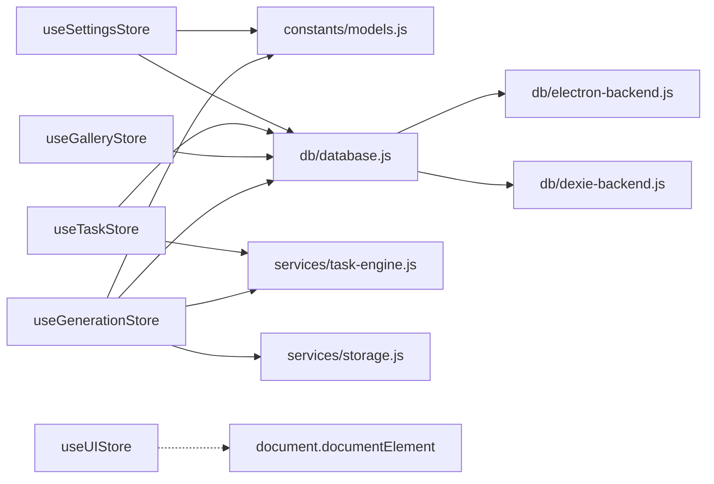

**图表来源**
- [useGenerationStore.js:14-21](file://app/src/stores/useGenerationStore.js#L14-L21)
- [useGalleryStore.js:7-9](file://app/src/stores/useGalleryStore.js#L7-L9)
- [useTaskStore.js:10-12](file://app/src/stores/useTaskStore.js#L10-L12)
- [useSettingsStore.js:8-11](file://app/src/stores/useSettingsStore.js#L8-L11)
- [useUIStore.js:8-10](file://app/src/stores/useUIStore.js#L8-L10)

**章节来源**
- [package.json:11-22](file://app/package.json#L11-L22)

## 性能考量
- **细粒度订阅**
  - 组件只订阅所需字段，例如 Workbench 与 Gallery 分别按需订阅各自 store 的字段，降低无关重渲染
- **Immer 优化**
  - 使用 produce 以声明式方式更新嵌套状态，减少样板代码与浅比较成本
- **批量与延迟**
  - Gallery 的搜索与过滤采用防抖与分页加载，减少频繁查询与渲染压力
- **任务并发控制**
  - TaskEngine 限制最大并发任务数，避免浏览器资源耗尽
- **存储优化**
  - StorageService 的智能热区冷区策略，平衡访问速度与存储成本
  - Blob URL 缓存机制，避免重复下载和转换
- **Electron 优化**
  - ArrayBuffer 零拷贝传输，减少 IPC 通信开销
  - 批量文件操作，减少文件系统调用次数
- **持久化时机**
  - 生成流程中尽早写入"待处理"记录，保证刷新可恢复；结果返回后优先更新已有记录，避免重复插入
- **客户端二次过滤**
  - 在数据库查询基础上再做轻量客户端过滤，兼顾性能与交互体验
- **懒加载策略**
  - 大组件使用 React.lazy 进行代码分割，减少初始包体积
- **内存管理**
  - 及时清理事件监听器和定时器，防止内存泄漏
  - 自动释放 blobUrl 引用，避免内存泄漏

## 故障排查指南
- **生成失败**
  - 检查 useGenerationStore.generate 的错误分支，确认是否已将"待处理"记录更新为 failed
  - 查看 TaskEngine 的 _isRetryableError 判断逻辑，确认是否为可重试错误（网络/5xx）
  - 验证 StorageService 的保存逻辑，确认热区/冷区存储是否正常
- **任务未更新**
  - 确认 useTaskStore.initBridge 是否被调用且未被重复初始化
  - 检查 TaskEngine 事件是否正确触发，以及事件监听器是否被正确卸载
- **设置未持久化**
  - 检查 useSettingsStore.saveSettings 是否抛出异常，确认数据库层是否正常工作
- **图库加载缓慢**
  - 检查数据库层的索引与排序字段，必要时增加 limit/offset 分页
  - 评估客户端过滤复杂度，尽量将过滤下推到数据库层
  - 验证 Blob URL 重建逻辑，确保图片能正常显示
- **应用启动失败**
  - 检查 main.jsx 的 bootstrap 流程，确认数据库初始化顺序
  - 验证 useSettingsStore.loadSettings 是否正确加载默认配置
  - 确认 Electron 环境下的 IPC 连接是否正常建立
- **跨 Store 状态不同步**
  - 检查事件桥接机制，确认 TaskEngine 事件是否正确分发
  - 验证组件订阅的 selector 是否足够精确
- **Electron 环境问题**
  - 检查 window.electronAPI 是否正确暴露
  - 验证 IPC 通道是否注册成功
  - 确认主进程的文件系统权限

**章节来源**
- [useGenerationStore.js:353-360](file://app/src/stores/useGenerationStore.js#L353-L360)
- [task-engine.js:299-305](file://app/src/services/task-engine.js#L299-L305)
- [useTaskStore.js:39-64](file://app/src/stores/useTaskStore.js#L39-L64)
- [useSettingsStore.js:154-166](file://app/src/stores/useSettingsStore.js#L154-L166)
- [database.js:22-30](file://app/src/db/database.js#L22-L30)
- [main.jsx:12-29](file://app/src/main.jsx#L12-L29)

## 结论
AI Image Studio 的 Zustand 状态管理以"领域分治 + 事件桥 + 持久化 + 双后端适配"为核心，结合 Immer、StorageService 与策略模式的数据库抽象，实现了高内聚、低耦合、可恢复的前端状态体系。通过多 Store 的合理分工、细粒度订阅、合理的并发控制以及智能的存储策略，系统在复杂工作流下仍保持良好性能与用户体验。双后端架构确保了在 Electron 桌面应用和浏览器环境下的无缝切换，而 StorageService 的热区冷区策略则在访问速度与存储成本之间取得了最佳平衡。建议后续继续完善错误上报、监控埋点与更丰富的调试工具。

## 附录

### 组件与状态响应式更新示例
- **工作区生成流程**
  - 组件调用 useGenerationStore.generate -> 提交 TaskEngine -> 事件回调更新数据库层 -> StorageService 保存到热区/冷区 -> produce 更新 results/batchHistory -> UI 自动刷新
- **图库筛选流程**
  - 组件调用 useGalleryStore.filter -> 更新 filters -> 触发 loadImages -> 数据库层查询 -> 重建 blob URLs -> set 更新 images -> UI 自动刷新
- **任务状态同步流程**
  - TaskEngine 事件 -> useTaskStore 监听 -> 更新 tasks 状态 -> 订阅组件自动更新
- **Electron IPC 流程**
  - Store 调用 database.js -> electron-backend.js -> preload.cjs -> Main Process -> SQLite -> 文件系统 -> 返回结果

**章节来源**
- [Workbench.jsx:184-200](file://app/src/pages/Workbench.jsx#L184-L200)
- [Gallery.jsx:112-124](file://app/src/pages/Gallery.jsx#L112-124)
- [useTaskStore.js:44-56](file://app/src/stores/useTaskStore.js#L44-L56)
- [electron-backend.js:48-69](file://app/src/db/electron-backend.js#L48-L69)