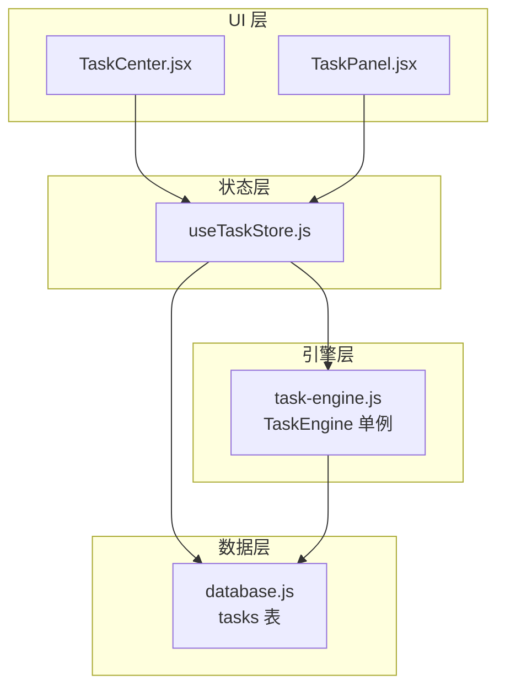
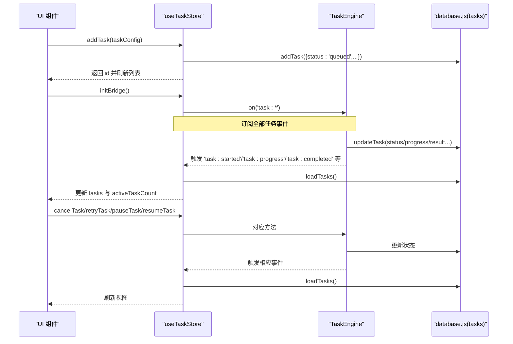
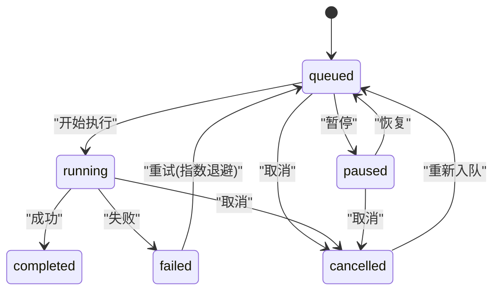
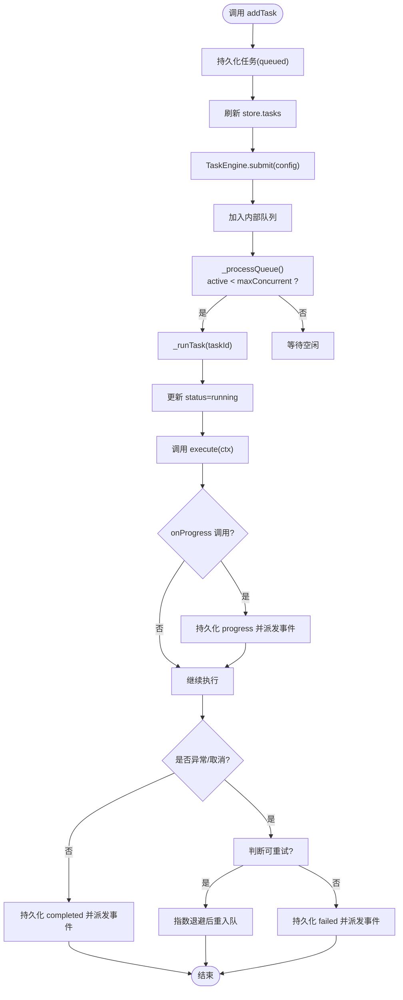
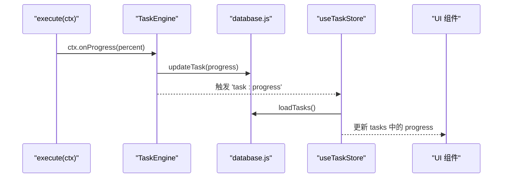
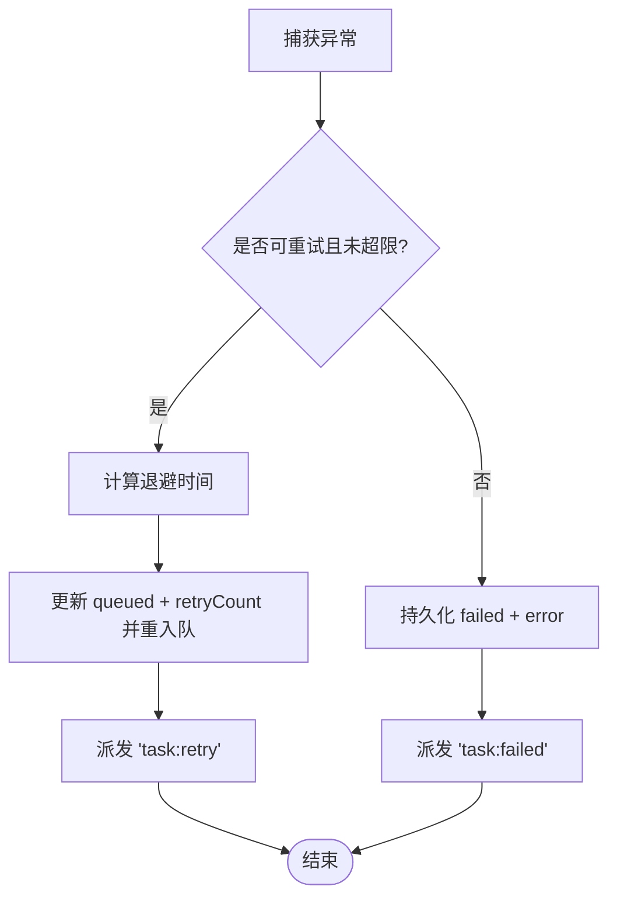
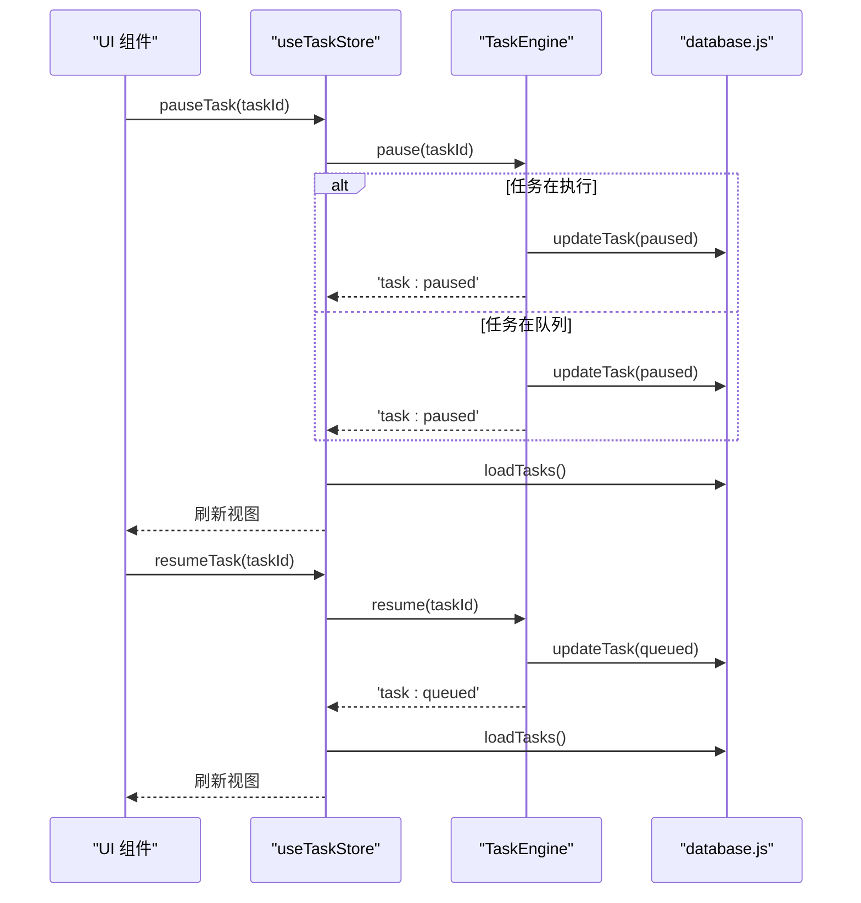
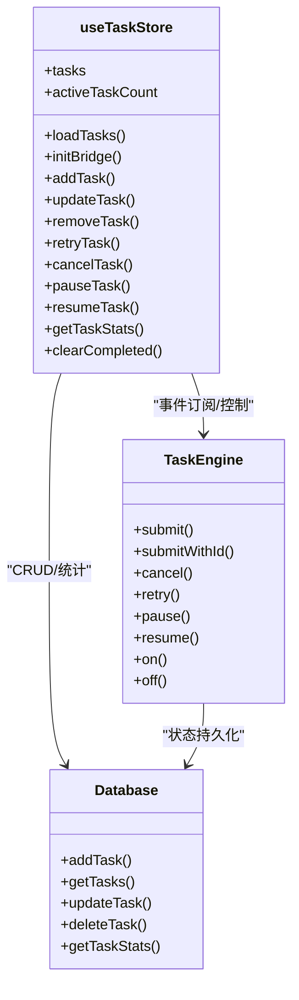
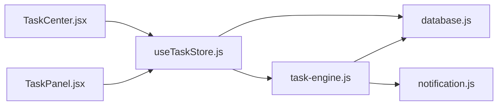

# 任务状态管理 (useTaskStore)

<cite>
**本文引用的文件**   
- [app/src/stores/useTaskStore.js](file://app/src/stores/useTaskStore.js)
- [app/src/services/task-engine.js](file://app/src/services/task-engine.js)
- [app/src/db/database.js](file://app/src/db/database.js)
- [app/src/pages/TaskCenter.jsx](file://app/src/pages/TaskCenter.jsx)
- [app/src/components/TaskPanel.jsx](file://app/src/components/TaskPanel.jsx)
</cite>

## 目录
1. [简介](#简介)
2. [项目结构](#项目结构)
3. [核心组件](#核心组件)
4. [架构总览](#架构总览)
5. [详细组件分析](#详细组件分析)
6. [依赖关系分析](#依赖关系分析)
7. [性能与并发控制](#性能与并发控制)
8. [故障排查指南](#故障排查指南)
9. [结论](#结论)
10. [附录：使用示例与最佳实践](#附录使用示例与最佳实践)

## 简介
本文件围绕 useTaskStore 的任务状态管理能力，系统化阐述后台任务队列的状态设计、生命周期管理、进度跟踪、错误处理与重试机制；解释任务的创建、调度、执行与完成状态转换过程；说明与 TaskEngine 的集成方式、事件监听机制与状态同步策略；并提供监控进度、处理失败与取消任务的实操示例。最后给出并发控制、资源管理与错误恢复的最佳实践建议。

## 项目结构
与任务状态管理相关的代码主要分布在以下位置：
- 状态层：Zustand store（useTaskStore）负责持久化读取、事件桥接与 UI 状态更新
- 引擎层：TaskEngine 单例负责任务调度、并发控制、重试与事件广播
- 数据层：IndexedDB（Dexie）封装 tasks 表读写
- 展示层：TaskCenter 页面与 TaskPanel 侧边栏消费 store 进行可视化呈现

图表来源
- [app/src/stores/useTaskStore.js:1-172](file://app/src/stores/useTaskStore.js#L1-L172)
- [app/src/services/task-engine.js:1-319](file://app/src/services/task-engine.js#L1-L319)
- [app/src/db/database.js:232-274](file://app/src/db/database.js#L232-L274)
- [app/src/pages/TaskCenter.jsx:1-218](file://app/src/pages/TaskCenter.jsx#L1-L218)
- [app/src/components/TaskPanel.jsx:1-538](file://app/src/components/TaskPanel.jsx#L1-L538)

章节来源
- [app/src/stores/useTaskStore.js:1-172](file://app/src/stores/useTaskStore.js#L1-L172)
- [app/src/services/task-engine.js:1-319](file://app/src/services/task-engine.js#L1-L319)
- [app/src/db/database.js:232-274](file://app/src/db/database.js#L232-L274)
- [app/src/pages/TaskCenter.jsx:1-218](file://app/src/pages/TaskCenter.jsx#L1-L218)
- [app/src/components/TaskPanel.jsx:1-538](file://app/src/components/TaskPanel.jsx#L1-L538)

## 核心组件
- useTaskStore（Zustand Store）
  - 职责：维护任务列表与活跃计数；提供加载、新增、更新、删除、重试、取消、暂停/恢复、统计等动作；订阅 TaskEngine 事件并刷新本地状态，实现 UI 实时同步。
- TaskEngine（任务引擎）
  - 职责：FIFO 队列 + 最大并发控制；任务状态机（queued/running/completed/failed/cancelled/paused）；指数退避重试；进度上报；浏览器通知；事件发射。
- database（IndexedDB 封装）
  - 职责：tasks 表的增删改查与统计聚合；为 store 和 engine 提供持久化能力。
- UI 组件（TaskCenter / TaskPanel）
  - 职责：按状态分组展示任务；支持暂停/恢复/取消/重试/移除等操作；通过 store 暴露的方法驱动状态变更。

章节来源
- [app/src/stores/useTaskStore.js:14-172](file://app/src/stores/useTaskStore.js#L14-L172)
- [app/src/services/task-engine.js:33-319](file://app/src/services/task-engine.js#L33-L319)
- [app/src/db/database.js:232-274](file://app/src/db/database.js#L232-L274)
- [app/src/pages/TaskCenter.jsx:24-218](file://app/src/pages/TaskCenter.jsx#L24-L218)
- [app/src/components/TaskPanel.jsx:9-538](file://app/src/components/TaskPanel.jsx#L9-L538)

## 架构总览
useTaskStore 作为“事件桥”将 TaskEngine 的事件转换为 Zustand 状态变化，从而驱动 UI 实时更新。TaskEngine 负责实际的任务调度与执行，所有状态变更均落盘到 IndexedDB，保证刷新后仍可恢复。

图表来源
- [app/src/stores/useTaskStore.js:39-64](file://app/src/stores/useTaskStore.js#L39-L64)
- [app/src/stores/useTaskStore.js:67-87](file://app/src/stores/useTaskStore.js#L67-L87)
- [app/src/stores/useTaskStore.js:109-157](file://app/src/stores/useTaskStore.js#L109-L157)
- [app/src/services/task-engine.js:57-92](file://app/src/services/task-engine.js#L57-L92)
- [app/src/services/task-engine.js:94-178](file://app/src/services/task-engine.js#L94-L178)
- [app/src/services/task-engine.js:222-297](file://app/src/services/task-engine.js#L222-L297)
- [app/src/db/database.js:235-274](file://app/src/db/database.js#L235-L274)

## 详细组件分析

### 任务状态机与生命周期
- 状态集合：queued、running、completed、failed、cancelled、paused
- 合法转移：
  - queued → running | cancelled | paused
  - running → completed | failed | cancelled
  - paused → queued | cancelled
  - failed → queued（重试）
  - cancelled → queued（重新入队）
- 关键行为：
  - 提交任务：写入 tasks 表，状态设为 queued，加入队列
  - 开始执行：状态改为 running，派发 started 事件
  - 进度更新：持久化 progress，派发 progress 事件
  - 完成：状态 completed，结果持久化，派发 completed 事件
  - 失败：根据可重试条件进入 retry 或 failed，派发 retry/failed 事件
  - 取消：从活动集或队列中移除，状态 cancelled，派发 cancelled 事件
  - 暂停/恢复：暂停时置 paused，恢复时置 queued 并尝试出队

图表来源
- [app/src/services/task-engine.js:18-31](file://app/src/services/task-engine.js#L18-L31)
- [app/src/services/task-engine.js:222-297](file://app/src/services/task-engine.js#L222-L297)

章节来源
- [app/src/services/task-engine.js:18-31](file://app/src/services/task-engine.js#L18-L31)
- [app/src/services/task-engine.js:222-297](file://app/src/services/task-engine.js#L222-L297)

### 任务创建与调度流程
- 创建入口：store.addTask 向数据库插入一条初始为 queued 的记录，随后刷新列表
- 调度执行：TaskEngine.submit 生成 taskId，持久化记录并推入内部队列，触发 _processQueue
- 并发控制：_processQueue 在 active.size < maxConcurrent 时不断出队执行
- 执行上下文：execute(ctx) 接收 signal、taskId、onProgress(percent)，用于中断与进度上报

图表来源
- [app/src/stores/useTaskStore.js:67-87](file://app/src/stores/useTaskStore.js#L67-L87)
- [app/src/services/task-engine.js:57-92](file://app/src/services/task-engine.js#L57-L92)
- [app/src/services/task-engine.js:215-220](file://app/src/services/task-engine.js#L215-L220)
- [app/src/services/task-engine.js:222-297](file://app/src/services/task-engine.js#L222-L297)

章节来源
- [app/src/stores/useTaskStore.js:67-87](file://app/src/stores/useTaskStore.js#L67-L87)
- [app/src/services/task-engine.js:57-92](file://app/src/services/task-engine.js#L57-L92)
- [app/src/services/task-engine.js:215-220](file://app/src/services/task-engine.js#L215-L220)
- [app/src/services/task-engine.js:222-297](file://app/src/services/task-engine.js#L222-L297)

### 进度跟踪与事件监听
- 进度上报：execute(ctx).onProgress(percent) 会持久化 progress 并派发 task:progress
- 事件桥：initBridge 订阅 TaskEngine 的全部任务事件，统一回调中调用 loadTasks 刷新 store
- UI 同步：TaskCenter/TaskPanel 通过 useTaskStore 选择器订阅 tasks，自动响应状态变化

图表来源
- [app/src/services/task-engine.js:230-237](file://app/src/services/task-engine.js#L230-L237)
- [app/src/stores/useTaskStore.js:39-64](file://app/src/stores/useTaskStore.js#L39-L64)
- [app/src/pages/TaskCenter.jsx:24-58](file://app/src/pages/TaskCenter.jsx#L24-L58)
- [app/src/components/TaskPanel.jsx:9-37](file://app/src/components/TaskPanel.jsx#L9-L37)

章节来源
- [app/src/services/task-engine.js:230-237](file://app/src/services/task-engine.js#L230-L237)
- [app/src/stores/useTaskStore.js:39-64](file://app/src/stores/useTaskStore.js#L39-L64)
- [app/src/pages/TaskCenter.jsx:24-58](file://app/src/pages/TaskCenter.jsx#L24-L58)
- [app/src/components/TaskPanel.jsx:9-37](file://app/src/components/TaskPanel.jsx#L9-L37)

### 错误处理与重试机制
- 可重试判定：网络错误、服务端 5xx 等视为可重试
- 指数退避：retryCount 递增，等待时间按 2^(retryCount-1) 秒级延迟
- 上限控制：最多重试 3 次，超过则标记 failed
- 失败路径：持久化 error 信息，派发 task:failed，并触发浏览器通知
- 手动重试：store.retryTask 优先走引擎重试，失败回退为直接重置状态入队

图表来源
- [app/src/services/task-engine.js:259-297](file://app/src/services/task-engine.js#L259-L297)
- [app/src/services/task-engine.js:299-305](file://app/src/services/task-engine.js#L299-L305)
- [app/src/stores/useTaskStore.js:109-124](file://app/src/stores/useTaskStore.js#L109-L124)

章节来源
- [app/src/services/task-engine.js:259-297](file://app/src/services/task-engine.js#L259-L297)
- [app/src/services/task-engine.js:299-305](file://app/src/services/task-engine.js#L299-L305)
- [app/src/stores/useTaskStore.js:109-124](file://app/src/stores/useTaskStore.js#L109-L124)

### 取消与暂停/恢复
- 取消：若任务在执行中，中止控制器并置 cancelled；若在队列中，直接从队列移除并置 cancelled
- 暂停：对运行中任务中止控制器并置 paused；对排队任务仅置 paused
- 恢复：将 paused 任务置 queued 并尝试出队（注意：暂停后 execute 引用丢失，需外部重新提交完整配置）

图表来源
- [app/src/stores/useTaskStore.js:137-157](file://app/src/stores/useTaskStore.js#L137-L157)
- [app/src/services/task-engine.js:148-178](file://app/src/services/task-engine.js#L148-L178)

章节来源
- [app/src/stores/useTaskStore.js:137-157](file://app/src/stores/useTaskStore.js#L137-L157)
- [app/src/services/task-engine.js:148-178](file://app/src/services/task-engine.js#L148-L178)

### 与 UI 的集成与状态同步
- 初始化桥接：应用启动时调用 store.initBridge，建立事件订阅
- 数据拉取：每次事件回调内统一调用 loadTasks 从 DB 拉取最新任务列表
- 组件订阅：TaskCenter/TaskPanel 通过 useTaskStore 选择器获取 tasks，按状态分组渲染

图表来源
- [app/src/stores/useTaskStore.js:14-172](file://app/src/stores/useTaskStore.js#L14-L172)
- [app/src/services/task-engine.js:33-319](file://app/src/services/task-engine.js#L33-L319)
- [app/src/db/database.js:232-274](file://app/src/db/database.js#L232-L274)

章节来源
- [app/src/stores/useTaskStore.js:14-172](file://app/src/stores/useTaskStore.js#L14-L172)
- [app/src/services/task-engine.js:33-319](file://app/src/services/task-engine.js#L33-L319)
- [app/src/db/database.js:232-274](file://app/src/db/database.js#L232-L274)

## 依赖关系分析
- useTaskStore 依赖：
  - database.js：任务持久化与统计
  - TaskEngine：任务生命周期控制与事件广播
- TaskEngine 依赖：
  - database.js：任务状态与进度持久化
  - notification：完成/失败时的浏览器通知
- UI 组件依赖：
  - useTaskStore：读取任务列表与操作接口
  - useUIStore：Toast 提示

图表来源
- [app/src/stores/useTaskStore.js:10-12](file://app/src/stores/useTaskStore.js#L10-L12)
- [app/src/services/task-engine.js:14-16](file://app/src/services/task-engine.js#L14-L16)
- [app/src/pages/TaskCenter.jsx:7-8](file://app/src/pages/TaskCenter.jsx#L7-L8)
- [app/src/components/TaskPanel.jsx:6-7](file://app/src/components/TaskPanel.jsx#L6-L7)

章节来源
- [app/src/stores/useTaskStore.js:10-12](file://app/src/stores/useTaskStore.js#L10-L12)
- [app/src/services/task-engine.js:14-16](file://app/src/services/task-engine.js#L14-L16)
- [app/src/pages/TaskCenter.jsx:7-8](file://app/src/pages/TaskCenter.jsx#L7-L8)
- [app/src/components/TaskPanel.jsx:6-7](file://app/src/components/TaskPanel.jsx#L6-L7)

## 性能与并发控制
- 并发上限：默认最大并发 3，可通过 setMaxConcurrent 调整，避免过多并行导致后端限流或前端卡顿
- 队列模型：FIFO 队列，确保任务顺序性；当活跃任务不足时自动出队
- 事件刷新策略：每个事件回调统一调用 loadTasks 全量刷新，简单可靠但可能带来一定开销；在高频率进度场景下可考虑增量更新或节流
- 索引优化：tasks 表已定义复合索引 [status+createdAt]，可按状态与时间高效查询
- 清理策略：提供 clearCompleted 批量清理已完成任务，降低存储压力

章节来源
- [app/src/services/task-engine.js:44-48](file://app/src/services/task-engine.js#L44-L48)
- [app/src/services/task-engine.js:215-220](file://app/src/services/task-engine.js#L215-L220)
- [app/src/stores/useTaskStore.js:39-64](file://app/src/stores/useTaskStore.js#L39-L64)
- [app/src/db/database.js:28](file://app/src/db/database.js#L28)
- [app/src/stores/useTaskStore.js:164-171](file://app/src/stores/useTaskStore.js#L164-L171)

## 故障排查指南
- 任务不更新
  - 检查是否调用了 store.initBridge 以建立事件桥
  - 确认 TaskEngine 是否正确派发事件
  - 查看 loadTasks 是否抛出异常
- 任务无法取消/暂停
  - 确认任务当前状态是否在允许范围内
  - 检查 TaskEngine.cancel/pause 是否成功持久化状态
- 重试不生效
  - 确认错误类型是否被判定为可重试
  - 检查 retryCount 是否已达上限
- 进度条不动
  - 确认 execute 中是否调用 ctx.onProgress
  - 检查 onProgress 是否成功持久化并派发事件

章节来源
- [app/src/stores/useTaskStore.js:39-64](file://app/src/stores/useTaskStore.js#L39-L64)
- [app/src/stores/useTaskStore.js:23-33](file://app/src/stores/useTaskStore.js#L23-L33)
- [app/src/services/task-engine.js:94-178](file://app/src/services/task-engine.js#L94-L178)
- [app/src/services/task-engine.js:259-297](file://app/src/services/task-engine.js#L259-L297)
- [app/src/services/task-engine.js:230-237](file://app/src/services/task-engine.js#L230-L237)

## 结论
useTaskStore 通过事件桥与持久化结合，实现了稳定可靠的后台任务状态管理。配合 TaskEngine 的并发控制、指数退避重试与完善的生命周期状态机，能够支撑复杂的异步任务场景。UI 层基于 Zustand 的选择器订阅，获得低耦合、高响应的体验。建议在高频进度场景下进一步优化刷新策略，并根据业务需要调整并发上限与重试策略。

## 附录：使用示例与最佳实践

- 监控任务进度
  - 在应用启动时调用 store.initBridge，使 UI 能实时响应任务事件
  - 在组件中使用 useTaskStore((s)=>s.tasks) 订阅任务列表，按 progress 字段渲染进度条
  - 参考路径：[app/src/stores/useTaskStore.js:39-64](file://app/src/stores/useTaskStore.js#L39-L64)、[app/src/pages/TaskCenter.jsx:106-126](file://app/src/pages/TaskCenter.jsx#L106-L126)、[app/src/components/TaskPanel.jsx:174-276](file://app/src/components/TaskPanel.jsx#L174-L276)

- 处理任务失败
  - 在失败列表中显示 error 字段，并提供“重试”按钮
  - 点击重试调用 store.retryTask，由引擎决定指数退避与重入队
  - 参考路径：[app/src/stores/useTaskStore.js:109-124](file://app/src/stores/useTaskStore.js#L109-L124)、[app/src/services/task-engine.js:259-297](file://app/src/services/task-engine.js#L259-L297)、[app/src/pages/TaskCenter.jsx:196-213](file://app/src/pages/TaskCenter.jsx#L196-L213)

- 实现任务取消
  - 对运行中任务调用 store.cancelTask，引擎将中止控制器并置 cancelled
  - 对排队任务同样可取消，直接从队列移除
  - 参考路径：[app/src/stores/useTaskStore.js:127-135](file://app/src/stores/useTaskStore.js#L127-L135)、[app/src/services/task-engine.js:94-116](file://app/src/services/task-engine.js#L94-L116)、[app/src/components/TaskPanel.jsx:264-272](file://app/src/components/TaskPanel.jsx#L264-L272)

- 并发控制与资源管理
  - 合理设置最大并发数，避免后端限流与前端过载
  - 利用 clearCompleted 定期清理历史任务，减少 IndexedDB 压力
  - 参考路径：[app/src/services/task-engine.js:44-48](file://app/src/services/task-engine.js#L44-L48)、[app/src/stores/useTaskStore.js:164-171](file://app/src/stores/useTaskStore.js#L164-L171)

- 错误恢复最佳实践
  - 区分可重试与不可重试错误，避免无意义重试
  - 在 UI 层提供用户可见的错误信息与重试入口
  - 对长时间运行的任务增加超时与中断信号支持
  - 参考路径：[app/src/services/task-engine.js:299-305](file://app/src/services/task-engine.js#L299-L305)、[app/src/services/task-engine.js:230-237](file://app/src/services/task-engine.js#L230-L237)