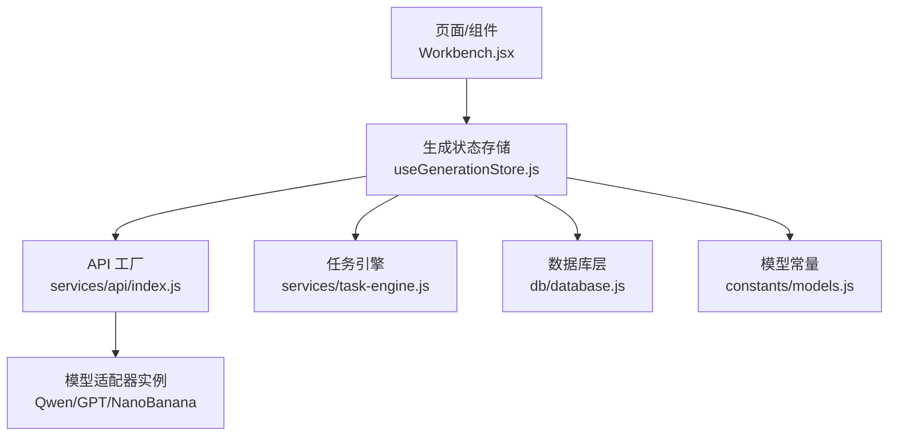
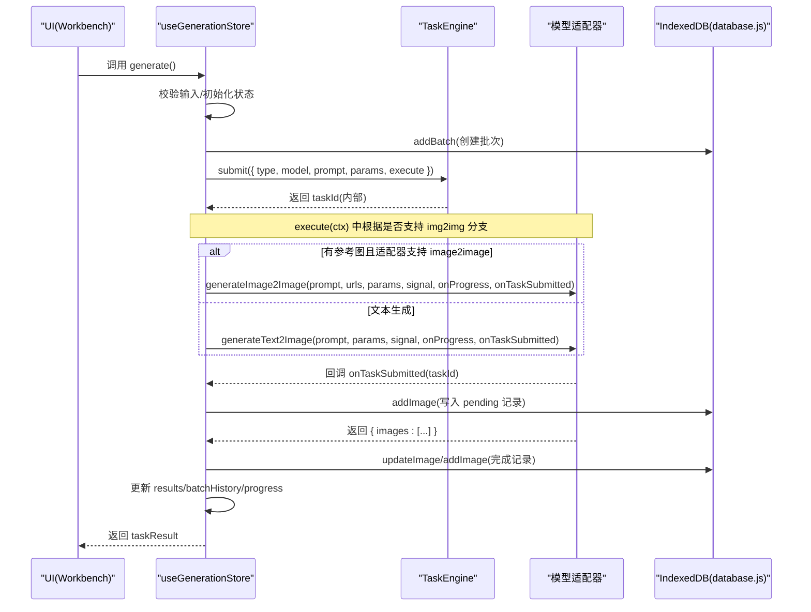
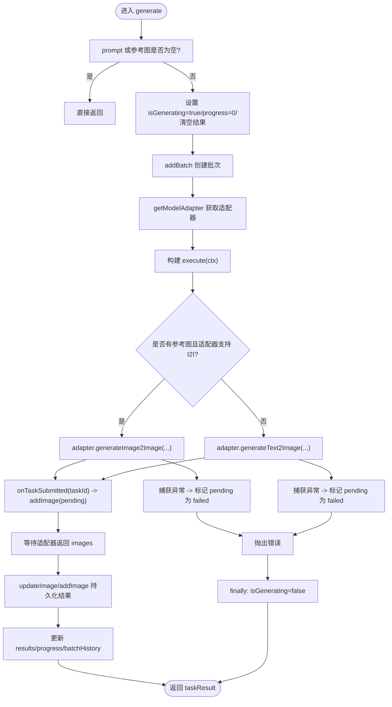
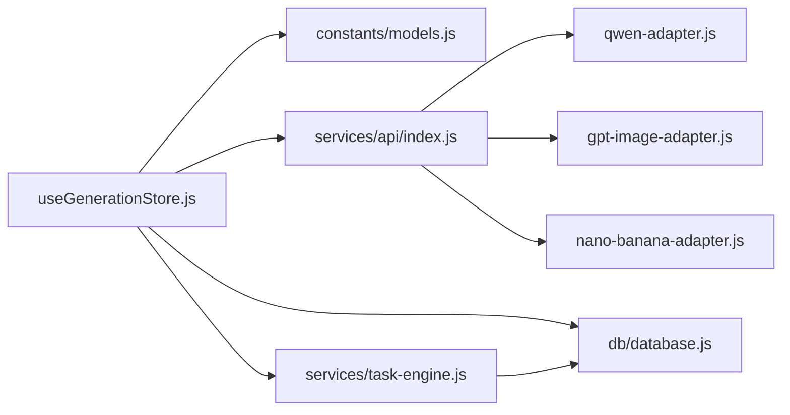

# 图像生成状态管理 (useGenerationStore)

<cite>
**本文引用的文件**
- [app/src/stores/useGenerationStore.js](file://app/src/stores/useGenerationStore.js)
- [app/src/services/task-engine.js](file://app/src/services/task-engine.js)
- [app/src/db/database.js](file://app/src/db/database.js)
- [app/src/constants/models.js](file://app/src/constants/models.js)
- [app/src/services/api/index.js](file://app/src/services/api/index.js)
- [app/src/pages/Workbench.jsx](file://app/src/pages/Workbench.jsx)
</cite>

## 目录
1. [简介](#简介)
2. [项目结构](#项目结构)
3. [核心组件](#核心组件)
4. [架构总览](#架构总览)
5. [详细组件分析](#详细组件分析)
6. [依赖关系分析](#依赖关系分析)
7. [性能与内存优化](#性能与内存优化)
8. [故障排查指南](#故障排查指南)
9. [结论](#结论)
10. [附录：扩展实践](#附录扩展实践)

## 简介
本文件围绕 useGenerationStore 的状态管理与图像生成工作流，提供从设计到实现、从数据流到错误处理的系统化文档。重点覆盖：
- 当前模型选择、提示词管理、参考图片处理、生成参数配置与结果展示
- generate() 的完整执行流程：任务提交至 TaskEngine、适配器调用、进度跟踪、IndexedDB 持久化、最终状态更新
- Immer 的使用模式、异步错误处理与状态同步机制
- 如何添加新参数、扩展参考图能力、自定义生成流程
- 性能优化策略与内存管理最佳实践

## 项目结构
useGenerationStore 位于 stores 层，负责“工作台”侧的生成态；其通过 services/api 获取模型适配器，借助 services/task-engine 进行后台任务调度，并通过 db/database 将批次、图片与任务记录落盘 IndexedDB。UI 层（如 Workbench）订阅 store 状态并触发动作。

图表来源
- [app/src/stores/useGenerationStore.js:1-360](file://app/src/stores/useGenerationStore.js#L1-L360)
- [app/src/services/task-engine.js:1-319](file://app/src/services/task-engine.js#L1-L319)
- [app/src/db/database.js:1-339](file://app/src/db/database.js#L1-L339)
- [app/src/constants/models.js:1-106](file://app/src/constants/models.js#L1-L106)
- [app/src/services/api/index.js:1-39](file://app/src/services/api/index.js#L1-L39)
- [app/src/pages/Workbench.jsx:60-295](file://app/src/pages/Workbench.jsx#L60-L295)

章节来源
- [app/src/stores/useGenerationStore.js:1-360](file://app/src/stores/useGenerationStore.js#L1-L360)
- [app/src/services/task-engine.js:1-319](file://app/src/services/task-engine.js#L1-L319)
- [app/src/db/database.js:1-339](file://app/src/db/database.js#L1-L339)
- [app/src/constants/models.js:1-106](file://app/src/constants/models.js#L1-L106)
- [app/src/services/api/index.js:1-39](file://app/src/services/api/index.js#L1-L39)
- [app/src/pages/Workbench.jsx:60-295](file://app/src/pages/Workbench.jsx#L60-L295)

## 核心组件
- 状态字段
  - currentModel：当前选用的模型 ID
  - prompt：主提示词
  - expandedPrompts：LLM 扩写后的候选提示词列表
  - referenceImages：参考图片数组，包含 id/url/name/blob/role
  - params：生成参数对象，默认值来自所选模型的 defaultParams
  - results：本次生成的结果集合（含 id/url/prompt/params 等）
  - batchHistory：历史批次快照
  - isGenerating/generatingProgress/currentBatchId/generationError：生成生命周期与错误信息
- 关键动作
  - setModel/setPrompt/setParam：切换模型、编辑提示词、设置单个参数
  - addReferenceImage/removeReferenceImage/setReferenceImageRole：增删改参考图及其角色
  - expandPrompt/selectExpandedPrompt：调用 LLM 扩写并选择
  - favoriteImage/discardImage：收藏/删除单条结果
  - regenerate/clearGeneration：重跑/清空
  - generate：核心入口，串联任务调度、适配器调用、持久化与状态更新

章节来源
- [app/src/stores/useGenerationStore.js:22-112](file://app/src/stores/useGenerationStore.js#L22-L112)
- [app/src/constants/models.js:8-92](file://app/src/constants/models.js#L8-L92)

## 架构总览
generate() 的执行时序如下：

图表来源
- [app/src/stores/useGenerationStore.js:112-290](file://app/src/stores/useGenerationStore.js#L112-L290)
- [app/src/services/task-engine.js:57-297](file://app/src/services/task-engine.js#L57-L297)
- [app/src/db/database.js:144-171](file://app/src/db/database.js#L144-L171)
- [app/src/db/database.js:43-91](file://app/src/db/database.js#L43-L91)

## 详细组件分析

### 状态设计与职责边界
- 模型与参数
  - 通过 MODELS 常量集中定义各模型的能力、尺寸、默认参数；setModel 会重置 params 为对应默认值，并清理相关中间态
  - setParam 使用 Immer produce 局部更新 params，避免不必要的深层拷贝
- 提示词与扩写
  - expandPrompt 调用 getLLMAdapter().expandPrompt，返回多条变体供用户选择；selectExpandedPrompt 将选定项回填 prompt 并清空候选
- 参考图片
  - addReferenceImage 依据当前模型的 capabilities.maxRefs 限制数量；自动分配 uuid、url/name/blob/role
  - removeReferenceImage 与 setReferenceImageRole 分别用于移除与修改角色
- 结果与历史
  - results 仅保存当前批次的轻量引用（id/url/prompt/params），便于 UI 渲染
  - batchHistory 保存批次级快照，便于回溯与复用

章节来源
- [app/src/stores/useGenerationStore.js:22-112](file://app/src/stores/useGenerationStore.js#L22-L112)
- [app/src/constants/models.js:8-92](file://app/src/constants/models.js#L8-L92)

### generate() 方法执行流程详解
- 前置校验与状态复位
  - 若 prompt 为空且无参考图则直接返回
  - 置 isGenerating=true、progress=0、清空 results 与 generationError
- 创建批次与适配器
  - 调用 addBatch 创建批次记录，得到 batchId
  - 通过 getModelAdapter(currentModel) 获取具体适配器实例
- 构建 execute 上下文
  - ctx.signal：由 TaskEngine 提供的 AbortController.signal，用于取消请求
  - ctx.onProgress(percent)：上报进度，TaskEngine 内部持久化并广播事件
  - onTaskSubmitted(taskId)：当适配器拿到远端 taskId 时回调，立即写入 pending 图片记录，确保刷新可恢复
- 分支调用
  - 若存在参考图且适配器具备 generateImage2Image，则走图生图路径
  - 否则走文生图路径
  - 任一分支捕获异常时，若已写入 pending 记录，则将其标记为 failed
- 结果持久化与状态更新
  - 遍历 result.images，首张优先尝试 updateImage(pending)，失败则回退为 addImage
  - 构造结果集 { id,url,prompt,params } 返回
  - 更新 results、progress=100，并将本次批次推入 batchHistory 头部
- 错误处理与收尾
  - catch 中记录 generationError 并抛出错误
  - finally 中确保 isGenerating=false

图表来源
- [app/src/stores/useGenerationStore.js:112-290](file://app/src/stores/useGenerationStore.js#L112-L290)
- [app/src/services/task-engine.js:222-297](file://app/src/services/task-engine.js#L222-L297)
- [app/src/db/database.js:43-91](file://app/src/db/database.js#L43-L91)

章节来源
- [app/src/stores/useGenerationStore.js:112-290](file://app/src/stores/useGenerationStore.js#L112-L290)
- [app/src/services/task-engine.js:57-297](file://app/src/services/task-engine.js#L57-L297)
- [app/src/db/database.js:144-171](file://app/src/db/database.js#L144-L171)
- [app/src/db/database.js:43-91](file://app/src/db/database.js#L43-L91)

### Immer 使用模式与不可变更新
- 所有需要变更 state 的地方统一通过 set(produce(...)) 进行不可变更新，避免手动浅拷贝与遗漏字段
- 典型场景：
  - setModel：重置多个字段（currentModel/params/expandedPrompts/referenceImages/results/generationError）
  - addReferenceImage/removeReferenceImage/setReferenceImageRole：对 referenceImages 做 push/filter/find+assign
  - setParam：对 params[key] 赋值
  - favoriteImage/discardImage：对 results 中的目标项就地修改或删除
- 优势：代码简洁、不易出错、天然支持嵌套更新

章节来源
- [app/src/stores/useGenerationStore.js:38-106](file://app/src/stores/useGenerationStore.js#L38-L106)
- [app/src/stores/useGenerationStore.js:315-339](file://app/src/stores/useGenerationStore.js#L315-L339)

### 异步错误处理与状态同步
- 适配器异常
  - 在 I2I/T2I 调用处 try/catch，若已写入 pending 记录，则 updateImage 标记为 failed，再向上抛出
- 任务引擎异常
  - TaskEngine 内部对网络/5xx 错误进行指数退避重试（最多 3 次），失败后持久化 status=failed 并广播事件
- 生成状态
  - generate 外层 try/catch 设置 generationError，finally 保证 isGenerating=false
- 进度同步
  - TaskEngine 的 onProgress 会持久化 progress 并广播 task:progress，UI 可通过任务中心监听刷新

章节来源
- [app/src/stores/useGenerationStore.js:163-187](file://app/src/stores/useGenerationStore.js#L163-L187)
- [app/src/stores/useGenerationStore.js:283-290](file://app/src/stores/useGenerationStore.js#L283-L290)
- [app/src/services/task-engine.js:259-305](file://app/src/services/task-engine.js#L259-L305)

### 与 UI 的集成
- Workbench 订阅 store 的 key 字段（model/prompt/params/results/isGenerating 等），并绑定交互动作（setModel/setPrompt/setParam/addReferenceImage/generate 等）
- 全局 Lightbox 同时读取 results 与 gallery 图片以定位当前查看的图片

章节来源
- [app/src/pages/Workbench.jsx:60-295](file://app/src/pages/Workbench.jsx#L60-L295)
- [app/src/App.jsx:199-239](file://app/src/App.jsx#L199-L239)

## 依赖关系分析
- 外部依赖
  - zustand：状态容器
  - immer：不可变更新
  - uuid：生成唯一 id
  - Dexie：IndexedDB 封装
- 模块耦合
  - useGenerationStore 依赖 constants/models（模型能力与默认参数）、services/api（适配器工厂）、services/task-engine（任务调度）、db/database（持久化）
  - TaskEngine 依赖 db/database 与 notification（浏览器通知）
  - database.js 暴露 images/batches/tasks/settings 等表的 CRUD

图表来源
- [app/src/stores/useGenerationStore.js:14-21](file://app/src/stores/useGenerationStore.js#L14-L21)
- [app/src/services/api/index.js:1-39](file://app/src/services/api/index.js#L1-L39)
- [app/src/services/task-engine.js:14-16](file://app/src/services/task-engine.js#L14-L16)
- [app/src/db/database.js:14-31](file://app/src/db/database.js#L14-L31)

章节来源
- [app/src/stores/useGenerationStore.js:14-21](file://app/src/stores/useGenerationStore.js#L14-L21)
- [app/src/services/api/index.js:1-39](file://app/src/services/api/index.js#L1-L39)
- [app/src/services/task-engine.js:14-16](file://app/src/services/task-engine.js#L14-L16)
- [app/src/db/database.js:14-31](file://app/src/db/database.js#L14-L31)

## 性能与内存优化
- 状态粒度与选择性订阅
  - 组件只订阅所需字段，减少不必要重渲染
- 批量操作与最小更新
  - 使用 Immer produce 精准更新，避免整树重建
  - 结果集仅保留必要字段（id/url/prompt/params），避免大对象驻留
- 任务并发控制
  - TaskEngine 默认最大并发 3，可按需 setMaxConcurrent 调整
- 进度与持久化
  - onProgress 与任务状态频繁落库，建议结合 UI 节流显示，避免过度刷新
- 内存管理
  - 参考图 URL.createObjectURL 产生的 blob URL 应在移除时释放（可在组件层维护引用并在移除时 URL.revokeObjectURL）
  - 大图缩略图建议在服务端或本地生成 thumbnailUrl，避免直接缓存全尺寸资源
- 重试与退避
  - 指数退避避免雪崩；对非重试错误快速失败，缩短阻塞时间

[本节为通用指导，不直接分析具体文件]

## 故障排查指南
- 常见问题定位
  - 生成未开始：检查 prompt 与 referenceImages 是否为空；确认 isGenerating 标志
  - 进度不更新：确认 TaskEngine 的 onProgress 是否被调用；检查任务中心事件是否触发
  - 刷新后丢失任务：确认 onTaskSubmitted 是否成功写入 pending 记录；检查 tasks/images 表是否存在
  - 适配器报错：查看 generationError 与日志；必要时在适配器层增加更详细的错误码
- 调试建议
  - 在 generate 的 try/catch 与 finally 处打点，观察状态流转
  - 在 TaskEngine 的事件回调中打印事件名与数据，辅助定位阶段问题
  - 打开 IndexedDB 控制台，核对 batches/images/tasks 表记录一致性

章节来源
- [app/src/stores/useGenerationStore.js:283-290](file://app/src/stores/useGenerationStore.js#L283-L290)
- [app/src/services/task-engine.js:259-305](file://app/src/services/task-engine.js#L259-L305)
- [app/src/db/database.js:235-274](file://app/src/db/database.js#L235-L274)

## 结论
useGenerationStore 将“模型选择—提示词—参考图—参数—结果—历史”整合为单一状态源，配合 TaskEngine 的并发与重试、Dexie 的持久化，形成稳定可靠的图像生成工作流。Immer 的不可变更新简化了复杂状态的维护，而清晰的错误处理与进度反馈提升了用户体验。通过合理的性能优化与内存管理，该方案可支撑高频、多模型的生成场景。

[本节为总结性内容，不直接分析具体文件]

## 附录：扩展实践

### 新增一个生成参数
- 步骤
  - 在 models.js 对应模型的 defaultParams 中添加新键值
  - 在 UI 中暴露该参数的控件，并调用 setParam(key, value) 更新
  - 在适配器实现中消费该参数（在 generateText2Image/generateImage2Image 的参数对象中）
- 参考位置
  - [app/src/constants/models.js:32-38](file://app/src/constants/models.js#L32-L38)
  - [app/src/stores/useGenerationStore.js:99-106](file://app/src/stores/useGenerationStore.js#L99-L106)

章节来源
- [app/src/constants/models.js:32-38](file://app/src/constants/models.js#L32-L38)
- [app/src/stores/useGenerationStore.js:99-106](file://app/src/stores/useGenerationStore.js#L99-L106)

### 扩展参考图片功能
- 步骤
  - 在 models.js 中调整 maxRefs 以允许更多参考图
  - 在 addReferenceImage 中可根据业务需求增加校验（如格式/大小/角色白名单）
  - 在适配器中按 role 组织 imageUrls 或附加元数据
- 参考位置
  - [app/src/constants/models.js:13-23](file://app/src/constants/models.js#L13-L23)
  - [app/src/stores/useGenerationStore.js:59-76](file://app/src/stores/useGenerationStore.js#L59-L76)

章节来源
- [app/src/constants/models.js:13-23](file://app/src/constants/models.js#L13-L23)
- [app/src/stores/useGenerationStore.js:59-76](file://app/src/stores/useGenerationStore.js#L59-L76)

### 自定义生成流程
- 思路
  - 在 generate 的 execute 中插入预处理/后处理逻辑（如提示词清洗、参数归一化、结果裁剪）
  - 利用 ctx.signal 支持取消；利用 ctx.onProgress 上报阶段性进度
  - 如需新的持久化实体，可在 database.js 新增表并在 store 中调用
- 参考位置
  - [app/src/stores/useGenerationStore.js:129-254](file://app/src/stores/useGenerationStore.js#L129-L254)
  - [app/src/services/task-engine.js:222-297](file://app/src/services/task-engine.js#L222-L297)

章节来源
- [app/src/stores/useGenerationStore.js:129-254](file://app/src/stores/useGenerationStore.js#L129-L254)
- [app/src/services/task-engine.js:222-297](file://app/src/services/task-engine.js#L222-L297)