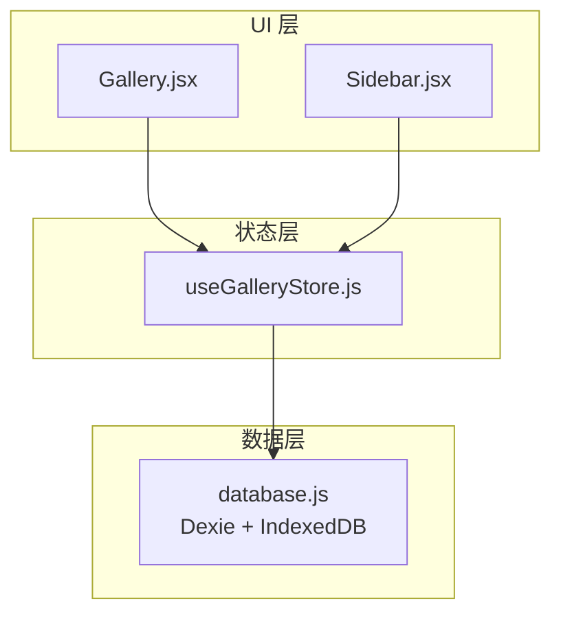
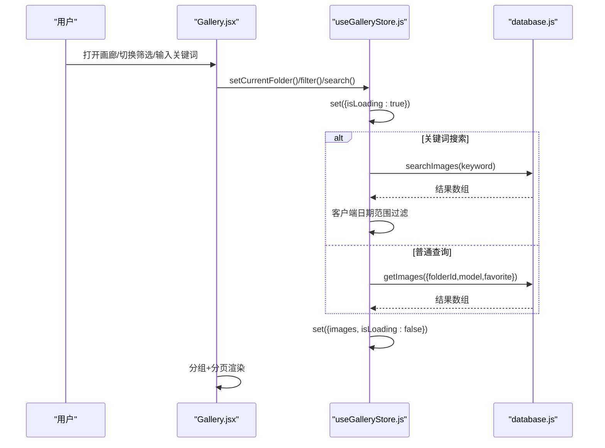
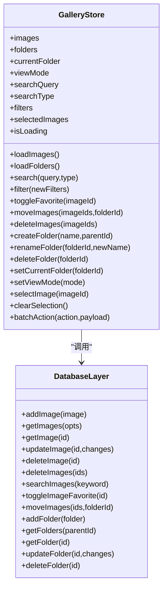
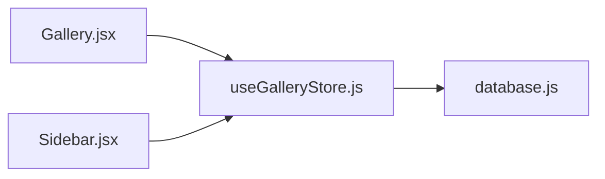

# 图库状态管理 (useGalleryStore)

<cite>
**本文引用的文件**   
- [app/src/stores/useGalleryStore.js](file://app/src/stores/useGalleryStore.js)
- [app/src/db/database.js](file://app/src/db/database.js)
- [app/src/pages/Gallery.jsx](file://app/src/pages/Gallery.jsx)
- [app/src/components/Sidebar.jsx](file://app/src/components/Sidebar.jsx)
</cite>

## 目录
1. [简介](#简介)
2. [项目结构](#项目结构)
3. [核心组件](#核心组件)
4. [架构总览](#架构总览)
5. [详细组件分析](#详细组件分析)
6. [依赖关系分析](#依赖关系分析)
7. [性能与内存优化](#性能与内存优化)
8. [故障排查指南](#故障排查指南)
9. [结论](#结论)
10. [附录：使用示例](#附录使用示例)

## 简介
本文件围绕 useGalleryStore 提供一份面向开发与产品人员的完整文档，涵盖图库数据的状态结构设计、图片列表与文件夹分类、收藏与搜索过滤机制、CRUD 与批量操作、分页加载策略、索引优化、与数据库层的交互模式（懒加载、缓存、状态同步），以及大数据量下的性能优化与内存管理方案。文末附带可直接落地的使用示例路径，便于快速上手高级搜索、批量操作与文件管理功能。

## 项目结构
- 状态层：useGalleryStore 基于 Zustand + Immer 维护全局图库状态，封装所有与图片/文件夹相关的读写动作。
- 数据层：database.js 基于 Dexie.js 封装 IndexedDB 表结构与 CRUD 方法，提供 getImages、searchImages、moveImages、deleteImages、toggleImageFavorite、getFolders 等能力。
- 页面层：Gallery.jsx 负责 UI 渲染与用户交互，调用 store 的 actions 完成加载、筛选、搜索、批量操作等；同时实现前端分页与分组展示。
- 侧边栏：Sidebar.jsx 提供文件夹树管理与导航，通过 store 创建/重命名/删除文件夹并切换当前文件夹。

图表来源
- [app/src/pages/Gallery.jsx:1-120](file://app/src/pages/Gallery.jsx#L1-L120)
- [app/src/components/Sidebar.jsx:158-231](file://app/src/components/Sidebar.jsx#L158-L231)
- [app/src/stores/useGalleryStore.js:11-203](file://app/src/stores/useGalleryStore.js#L11-L203)
- [app/src/db/database.js:22-31](file://app/src/db/database.js#L22-L31)

章节来源
- [app/src/stores/useGalleryStore.js:11-203](file://app/src/stores/useGalleryStore.js#L11-L203)
- [app/src/db/database.js:22-31](file://app/src/db/database.js#L22-L31)
- [app/src/pages/Gallery.jsx:1-120](file://app/src/pages/Gallery.jsx#L1-L120)
- [app/src/components/Sidebar.jsx:158-231](file://app/src/components/Sidebar.jsx#L158-L231)

## 核心组件
- 状态字段
  - images：当前视图的图片数组
  - folders：文件夹树
  - currentFolder：当前所在文件夹（null 表示全部）
  - viewMode：grid/list
  - searchQuery/searchType：关键词/语义/以图搜图
  - filters：model/favorite/dateRange
  - selectedImages：多选集合
  - isLoading：加载态
- 关键动作
  - loadImages/loadFolders：从 IndexedDB 拉取数据
  - search/filter：更新搜索与筛选条件并触发加载
  - toggleFavorite/moveImages/deleteImages：单条或批量修改
  - createFolder/renameFolder/deleteFolder/currentFolder/setViewMode/selectImage/clearSelection/batchAction：组织与批量操作

章节来源
- [app/src/stores/useGalleryStore.js:11-203](file://app/src/stores/useGalleryStore.js#L11-L203)

## 架构总览
useGalleryStore 作为单一事实源，聚合 UI 所需的所有图库状态，并通过 database.js 与 IndexedDB 进行持久化交互。Gallery.jsx 在挂载时初始化加载，并在搜索/筛选变化时触发增量刷新；同时在前端实现“按时间分组 + 滚动加载更多”的分页体验。

图表来源
- [app/src/stores/useGalleryStore.js:29-88](file://app/src/stores/useGalleryStore.js#L29-L88)
- [app/src/db/database.js:56-110](file://app/src/db/database.js#L56-L110)
- [app/src/pages/Gallery.jsx:98-133](file://app/src/pages/Gallery.jsx#L98-L133)

## 详细组件分析

### 状态设计与数据结构
- 图片记录（IndexedDB images 表）包含 id、batchId、folderId、model、favorite、createdAt、storageZone、prompt、url、thumbnailUrl、width、height、params 等字段，用于支撑展示、筛选与二次生成。
- 文件夹记录（folders 表）支持 parentId 形成树形结构。
- 复合索引 [folderId+createdAt] 用于按文件夹和时间排序的高效查询。

章节来源
- [app/src/db/database.js:22-31](file://app/src/db/database.js#L22-L31)
- [app/src/db/database.js:56-76](file://app/src/db/database.js#L56-L76)

### 图片列表与文件夹分类
- 列表加载：根据 currentFolder 与 filters 组合查询；若存在关键词且类型为 keyword，则走全文检索分支，再按 folderId 做客户端过滤。
- 文件夹导航：setCurrentFolder 会清空选择并重新加载图片；删除文件夹会将子文件夹递归删除并把其图片移出到根目录。

章节来源
- [app/src/stores/useGalleryStore.js:148-152](file://app/src/stores/useGalleryStore.js#L148-L152)
- [app/src/stores/useGalleryStore.js:138-146](file://app/src/stores/useGalleryStore.js#L138-L146)
- [app/src/db/database.js:219-229](file://app/src/db/database.js#L219-L229)

### 收藏功能
- 单张收藏：toggleFavorite 读取并翻转 favorite 标志，随后局部更新本地 images 对应项。
- 批量收藏：batchAction('favorite') 对选中图片逐一执行收藏切换。

章节来源
- [app/src/stores/useGalleryStore.js:90-99](file://app/src/stores/useGalleryStore.js#L90-L99)
- [app/src/stores/useGalleryStore.js:178-202](file://app/src/stores/useGalleryStore.js#L178-L202)
- [app/src/db/database.js:112-120](file://app/src/db/database.js#L112-L120)

### 搜索与过滤机制
- 关键词搜索：searchImages 在 prompt/model/tags 中做子串匹配，返回后由 store 结合 currentFolder 与 dateRange 进一步过滤。
- 多维过滤：filters.model/favorite/dateRange 在 getImages 阶段下推至服务端（IndexedDB），dateRange 在客户端执行。
- 比例筛选：Gallery.jsx 在客户端按 width/height 计算纵横比进行过滤。

章节来源
- [app/src/stores/useGalleryStore.js:35-55](file://app/src/stores/useGalleryStore.js#L35-L55)
- [app/src/db/database.js:98-110](file://app/src/db/database.js#L98-L110)
- [app/src/pages/Gallery.jsx:128-133](file://app/src/pages/Gallery.jsx#L128-L133)

### 图片 CRUD 与批量处理
- 新增：addImage 写入默认值（favorite/storageZone/createdAt）。
- 更新：updateImage 支持部分字段更新。
- 删除：deleteImage/deleteImages 支持单条与批量删除。
- 移动：moveImages 批量更新 folderId。
- 批量操作：batchAction 统一入口，支持收藏/移动/删除三类。

章节来源
- [app/src/db/database.js:43-96](file://app/src/db/database.js#L43-L96)
- [app/src/db/database.js:122-127](file://app/src/db/database.js#L122-L127)
- [app/src/stores/useGalleryStore.js:101-123](file://app/src/stores/useGalleryStore.js#L101-L123)
- [app/src/stores/useGalleryStore.js:178-202](file://app/src/stores/useGalleryStore.js#L178-L202)

### 分页加载策略与索引优化
- 分页策略：Gallery.jsx 维护 displayCount，初始 50，滚动接近底部时追加 50 条；同时按时间分组显示，提升浏览效率。
- 索引优化：
  - 复合索引 [folderId+createdAt] 加速按文件夹与时间的排序与范围查询。
  - tasks 表也采用 [status+createdAt] 复合索引，体现统一的索引设计思路。
- 注意：当前 getImages 未使用 limit/offset 参数，分页主要在前端切片实现。

章节来源
- [app/src/pages/Gallery.jsx:135-138](file://app/src/pages/Gallery.jsx#L135-L138)
- [app/src/db/database.js:22-31](file://app/src/db/database.js#L22-L31)
- [app/src/db/database.js:56-76](file://app/src/db/database.js#L56-L76)

### 与数据库层的交互模式
- 懒加载：Gallery.jsx 在挂载时调用 loadImages/loadFolders；切换文件夹/筛选/搜索时按需刷新。
- 缓存策略：store 将 images/folders 常驻内存，避免重复请求；toggleFavorite 仅局部更新，减少全量刷新。
- 状态同步：所有写操作先落库，再更新 store 状态；删除/移动后主动 reload 保证一致性。

章节来源
- [app/src/pages/Gallery.jsx:98-103](file://app/src/pages/Gallery.jsx#L98-L103)
- [app/src/stores/useGalleryStore.js:30-62](file://app/src/stores/useGalleryStore.js#L30-L62)
- [app/src/stores/useGalleryStore.js:90-99](file://app/src/stores/useGalleryStore.js#L90-L99)

### 类与方法关系（代码级）

图表来源
- [app/src/stores/useGalleryStore.js:11-203](file://app/src/stores/useGalleryStore.js#L11-L203)
- [app/src/db/database.js:43-229](file://app/src/db/database.js#L43-L229)

## 依赖关系分析
- Gallery.jsx 订阅 store 的 images/folders/viewMode/selectedImages/isLoading 等状态，并调用 actions 驱动数据流。
- Sidebar.jsx 通过 store 管理文件夹树，创建/重命名/删除文件夹，并设置当前文件夹。
- useGalleryStore 依赖 database.js 提供的函数完成持久化读写。

图表来源
- [app/src/pages/Gallery.jsx:1-120](file://app/src/pages/Gallery.jsx#L1-L120)
- [app/src/components/Sidebar.jsx:158-231](file://app/src/components/Sidebar.jsx#L158-L231)
- [app/src/stores/useGalleryStore.js:11-203](file://app/src/stores/useGalleryStore.js#L11-L203)
- [app/src/db/database.js:43-229](file://app/src/db/database.js#L43-L229)

章节来源
- [app/src/pages/Gallery.jsx:1-120](file://app/src/pages/Gallery.jsx#L1-L120)
- [app/src/components/Sidebar.jsx:158-231](file://app/src/components/Sidebar.jsx#L158-L231)
- [app/src/stores/useGalleryStore.js:11-203](file://app/src/stores/useGalleryStore.js#L11-L203)
- [app/src/db/database.js:43-229](file://app/src/db/database.js#L43-L229)

## 性能与内存优化
- 前端分页与分组
  - 使用 displayCount 控制渲染数量，滚动到底部再追加，降低首屏压力。
  - 按时间分组减少单次渲染节点规模，提升滚动流畅度。
- 索引利用
  - 充分利用 [folderId+createdAt] 复合索引，优先在服务端完成排序与范围过滤。
- 局部更新
  - toggleFavorite 仅更新命中项，避免整表刷新。
- 批量操作
  - moveImages/deleteImages 使用 bulkUpdate/bulkDelete 减少往返次数。
- 潜在优化点
  - 引入服务端分页：在 getImages 中使用 limit/offset 替代前端切片，适合万级数据场景。
  - 虚拟列表：当单页超过数百条时，考虑虚拟化渲染以降低 DOM 压力。
  - 去抖与节流：搜索输入已使用 300ms 延迟，可结合节流进一步优化高频事件。
  - 对象 URL 回收：导入流程中及时 revokeObjectURL，避免内存泄漏。

章节来源
- [app/src/pages/Gallery.jsx:135-138](file://app/src/pages/Gallery.jsx#L135-L138)
- [app/src/db/database.js:22-31](file://app/src/db/database.js#L22-L31)
- [app/src/db/database.js:94-96](file://app/src/db/database.js#L94-L96)
- [app/src/stores/useGalleryStore.js:90-99](file://app/src/stores/useGalleryStore.js#L90-L99)

## 故障排查指南
- 加载失败
  - 检查 IndexedDB 是否成功初始化；确认 getImages/searchImages 返回值是否符合预期。
- 搜索无结果
  - 确认关键词大小写与字段覆盖（prompt/model/tags）；必要时扩展 tags 字段或使用更完善的全文索引。
- 收藏不同步
  - 确认 toggleImageFavorite 返回的新值是否正确回写到 images 对应项。
- 批量操作异常
  - 检查 selectedImages 是否为空；确保 moveImages/deleteImages 传入的 ids 有效。
- 文件夹删除后图片丢失
  - 确认 deleteFolder 已将子文件夹内图片的 folderId 置空，并正确刷新列表。

章节来源
- [app/src/stores/useGalleryStore.js:30-62](file://app/src/stores/useGalleryStore.js#L30-L62)
- [app/src/stores/useGalleryStore.js:90-99](file://app/src/stores/useGalleryStore.js#L90-L99)
- [app/src/stores/useGalleryStore.js:101-123](file://app/src/stores/useGalleryStore.js#L101-L123)
- [app/src/db/database.js:219-229](file://app/src/db/database.js#L219-L229)

## 结论
useGalleryStore 以简洁清晰的状态模型与动作接口，为图库提供了完整的增删改查、分类组织、收藏与搜索过滤能力。配合 IndexedDB 的索引设计与前端分页策略，可在中等数据规模下获得良好体验。针对更大规模数据，建议引入服务端分页与虚拟列表，进一步提升性能与稳定性。

## 附录：使用示例

### 高级搜索（关键词 + 多条件过滤）
- 步骤
  - 在 Gallery.jsx 中监听搜索输入与筛选变化，调用 store.search/filter。
  - 关键词搜索走 db.searchImages，随后应用 currentFolder 与 dateRange 过滤。
  - 非关键词查询走 db.getImages，下推 model/favorite 过滤。
- 参考路径
  - [app/src/pages/Gallery.jsx:109-126](file://app/src/pages/Gallery.jsx#L109-L126)
  - [app/src/stores/useGalleryStore.js:35-55](file://app/src/stores/useGalleryStore.js#L35-L55)
  - [app/src/db/database.js:98-110](file://app/src/db/database.js#L98-L110)

### 批量操作（收藏/移动/删除）
- 步骤
  - 在 Gallery.jsx 中收集 selectedImages，调用 batchAction 或 moveImages/deleteImages。
  - 完成后清空选择并刷新列表。
- 参考路径
  - [app/src/pages/Gallery.jsx:142-144](file://app/src/pages/Gallery.jsx#L142-L144)
  - [app/src/stores/useGalleryStore.js:178-202](file://app/src/stores/useGalleryStore.js#L178-L202)
  - [app/src/stores/useGalleryStore.js:101-123](file://app/src/stores/useGalleryStore.js#L101-L123)

### 文件管理（文件夹树与导航）
- 步骤
  - 在 Sidebar.jsx 中调用 createFolder/renameFolder/deleteFolder 管理文件夹。
  - 使用 setCurrentFolder 切换当前文件夹，自动触发 loadImages。
- 参考路径
  - [app/src/components/Sidebar.jsx:197-231](file://app/src/components/Sidebar.jsx#L197-L231)
  - [app/src/stores/useGalleryStore.js:125-152](file://app/src/stores/useGalleryStore.js#L125-L152)