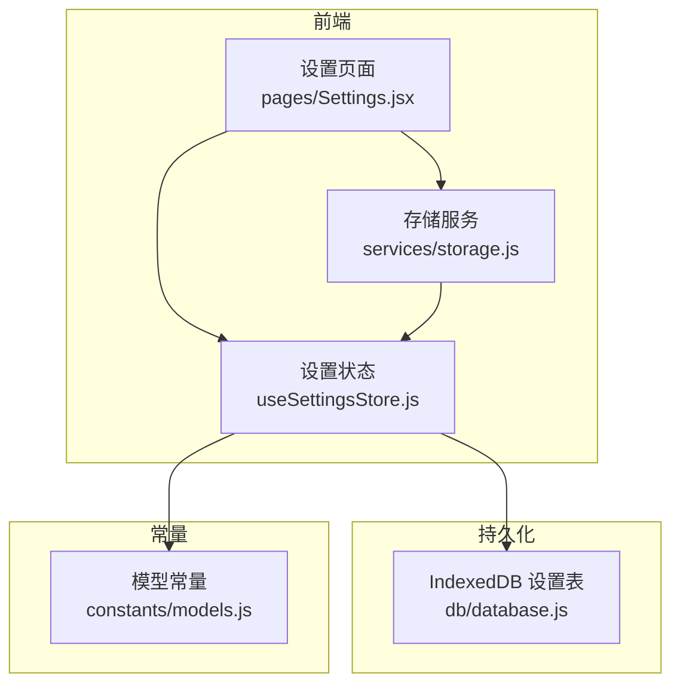
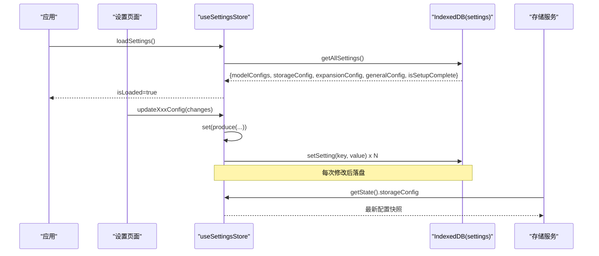
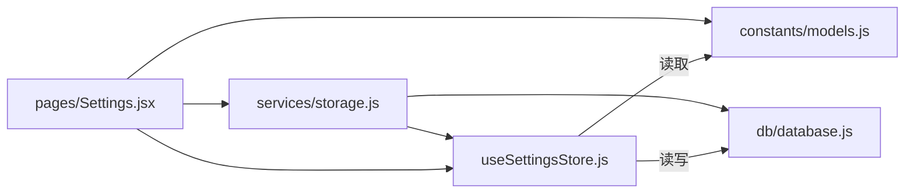

# 设置状态管理 (useSettingsStore)

<cite>
**本文引用的文件**   
- [app/src/stores/useSettingsStore.js](file://app/src/stores/useSettingsStore.js)
- [app/src/db/database.js](file://app/src/db/database.js)
- [app/src/constants/models.js](file://app/src/constants/models.js)
- [app/src/pages/Settings.jsx](file://app/src/pages/Settings.jsx)
- [app/src/services/storage.js](file://app/src/services/storage.js)
</cite>

## 目录
1. [简介](#简介)
2. [项目结构](#项目结构)
3. [核心组件](#核心组件)
4. [架构总览](#架构总览)
5. [详细组件分析](#详细组件分析)
6. [依赖关系分析](#依赖关系分析)
7. [性能与一致性](#性能与一致性)
8. [故障排查指南](#故障排查指南)
9. [结论](#结论)
10. [附录：扩展与最佳实践](#附录扩展与最佳实践)

## 简介
本文件围绕 useSettingsStore 提供一份深入、可操作的“设置状态管理”文档。内容覆盖应用配置的状态结构设计（模型配置、存储设置、API 密钥、用户偏好）、配置的加载/验证/持久化/热重载机制、与本地存储的同步策略、版本管理与迁移处理，以及添加新配置项、实现配置验证、导入导出功能的示例路径与步骤。同时讨论安全性、默认值管理和多环境配置的最佳实践。

## 项目结构
与设置相关的关键位置如下：
- 状态层：stores/useSettingsStore.js
- 数据持久化：db/database.js（IndexedDB，Dexie）
- 常量与模型能力定义：constants/models.js
- 设置界面：pages/Settings.jsx
- 存储服务（读取存储配置并调用 OSS）：services/storage.js

图表来源
- [app/src/pages/Settings.jsx:1-301](file://app/src/pages/Settings.jsx#L1-L301)
- [app/src/stores/useSettingsStore.js:1-162](file://app/src/stores/useSettingsStore.js#L1-L162)
- [app/src/db/database.js:276-295](file://app/src/db/database.js#L276-L295)
- [app/src/constants/models.js:1-106](file://app/src/constants/models.js#L1-L106)
- [app/src/services/storage.js:1-43](file://app/src/services/storage.js#L1-L43)

章节来源
- [app/src/stores/useSettingsStore.js:1-162](file://app/src/stores/useSettingsStore.js#L1-L162)
- [app/src/db/database.js:276-295](file://app/src/db/database.js#L276-L295)
- [app/src/constants/models.js:1-106](file://app/src/constants/models.js#L1-L106)
- [app/src/pages/Settings.jsx:1-301](file://app/src/pages/Settings.jsx#L1-L301)
- [app/src/services/storage.js:1-43](file://app/src/services/storage.js#L1-L43)

## 核心组件
- useSettingsStore
  - 职责：集中管理模型配置、存储配置、扩写配置、通用设置、初始化向导完成标记；负责从 IndexedDB 加载与保存；提供更新动作与重置到默认值。
  - 关键状态字段：modelConfigs、storageConfig、expansionConfig、generalConfig、isSetupComplete、isLoaded。
  - 关键方法：updateModelConfig、updateStorageConfig、updateExpansionConfig、updateGeneralConfig、loadSettings、saveSettings、completeSetup、resetToDefaults。
- database.js（settings 表）
  - 职责：通过 Dexie 维护 settings 键值表，提供 getSetting/setSetting/getAllSettings 等接口。
- models.js
  - 职责：声明可用模型的能力、尺寸、默认参数等，用于构建默认模型配置。
- Settings.jsx
  - 职责：渲染各设置页签，驱动 store 更新，触发连接测试与保存。
- storage.js
  - 职责：根据当前 store 中的 storageConfig 动态构造 OSS 客户端，执行上传/下载/连通性检测等操作。

章节来源
- [app/src/stores/useSettingsStore.js:47-161](file://app/src/stores/useSettingsStore.js#L47-L161)
- [app/src/db/database.js:276-295](file://app/src/db/database.js#L276-L295)
- [app/src/constants/models.js:8-92](file://app/src/constants/models.js#L8-L92)
- [app/src/pages/Settings.jsx:38-86](file://app/src/pages/Settings.jsx#L38-L86)
- [app/src/services/storage.js:20-42](file://app/src/services/storage.js#L20-L42)

## 架构总览
设置数据的生命周期包括：
- 启动时：从 IndexedDB 加载所有设置，合并到默认结构，标记 isLoaded。
- 运行时：UI 变更通过 store 的 update* 方法写入状态并自动持久化。
- 外部消费：如存储服务在需要时从 store 读取最新配置（懒加载）。

图表来源
- [app/src/stores/useSettingsStore.js:108-149](file://app/src/stores/useSettingsStore.js#L108-L149)
- [app/src/db/database.js:289-295](file://app/src/db/database.js#L289-L295)
- [app/src/services/storage.js:20-42](file://app/src/services/storage.js#L20-L42)

## 详细组件分析

### 状态结构与默认值
- modelConfigs
  - 由 constants/models.js 中每个模型的 defaultParams 生成，包含 enabled 与 defaultParams 等。
  - 新增模型时，无需手动维护默认配置，store 会基于常量自动生成。
- storageConfig
  - 包含 zone、autoCleanupDays、thumbnailMaxDimension、ossBucket、ossRegion 等。
  - 部分默认值来自环境变量（VITE_OSS_BUCKET、VITE_OSS_REGION），便于多环境部署。
- expansionConfig
  - 包含 LLM 扩写所需的基础参数（模型、最大变体数、温度等），默认值同样支持环境变量注入。
- generalConfig
  - 主题、语言、自动保存、并发任务数等通用偏好。
- 其他标志位
  - isSetupComplete：引导流程完成标记。
  - isLoaded：首次加载完成标记，供 UI 控制渲染时机。

章节来源
- [app/src/stores/useSettingsStore.js:13-54](file://app/src/stores/useSettingsStore.js#L13-L54)
- [app/src/constants/models.js:8-92](file://app/src/constants/models.js#L8-L92)

### 加载与合并策略
- 启动时调用 loadSettings：
  - 从 IndexedDB 获取全部设置，按 key 合并到对应 state 分支。
  - 若某 key 不存在则保留默认值，保证向后兼容。
  - 异常情况下仍标记 isLoaded=true，避免 UI 阻塞。
- 合并顺序：先默认值，再覆盖已保存值，确保新增字段有合理默认值。

章节来源
- [app/src/stores/useSettingsStore.js:108-135](file://app/src/stores/useSettingsStore.js#L108-L135)
- [app/src/db/database.js:289-295](file://app/src/db/database.js#L289-L295)

### 持久化与热重载
- 持久化：
  - 所有 update* 方法内部使用 produce 进行不可变更新，随后调用 saveSettings 将五个 key 分别写入 IndexedDB。
  - completeSetup 也会单独写入 isSetupComplete 并统一保存。
- 热重载：
  - 由于 services/storage.js 通过 useSettingsStore.getState() 按需读取最新配置，任何对 storageConfig 的更新都会立即影响后续 OSS 操作，无需重启或刷新。

章节来源
- [app/src/stores/useSettingsStore.js:58-106](file://app/src/stores/useSettingsStore.js#L58-L106)
- [app/src/stores/useSettingsStore.js:137-149](file://app/src/stores/useSettingsStore.js#L137-L149)
- [app/src/services/storage.js:20-42](file://app/src/services/storage.js#L20-L42)

### 与本地存储的同步策略
- 读写分离：
  - 读：loadSettings 一次性拉取所有设置。
  - 写：每次变更立即落盘，避免丢失。
- 幂等与容错：
  - 加载失败不影响 isLoaded 标记，UI 仍可继续运行。
  - 保存失败仅记录错误日志，不中断用户操作。

章节来源
- [app/src/stores/useSettingsStore.js:108-149](file://app/src/stores/useSettingsStore.js#L108-L149)

### 配置版本管理与迁移处理
现状与建议：
- 现状：未显式维护配置版本号，采用“默认值 + 增量合并”的方式实现向后兼容。
- 建议：
  - 引入 settingsVersion 字段，配合迁移函数在 loadSettings 前执行。
  - 当检测到旧版本时，执行迁移逻辑（例如重命名字段、补齐缺失字段、清理废弃字段）。
  - 迁移完成后更新 settingsVersion 并保存。

参考实现位置（待扩展）：
- 可在 loadSettings 之前插入版本检查与迁移逻辑，并在 saveSettings 中一并持久化 version。

章节来源
- [app/src/stores/useSettingsStore.js:108-135](file://app/src/stores/useSettingsStore.js#L108-L135)
- [app/src/db/database.js:289-295](file://app/src/db/database.js#L289-L295)

### 配置验证
现状与建议：
- 现状：store 层未内置校验逻辑，主要依赖 UI 输入与业务侧使用时的容错。
- 建议：
  - 在 update* 方法中加入轻量校验（非空、类型、范围），失败时返回错误对象而非直接抛错，以便 UI 提示。
  - 针对敏感字段（如 API Key、AccessKey）增加格式与长度校验。
  - 为不同模块提供独立校验器，保持单一职责。

参考实现位置（待扩展）：
- 在 updateModelConfig/updateStorageConfig/updateExpansionConfig/updateGeneralConfig 中嵌入校验。

章节来源
- [app/src/stores/useSettingsStore.js:58-99](file://app/src/stores/useSettingsStore.js#L58-L99)

### 导入与导出
现状与建议：
- 现状：未提供内置导入/导出功能。
- 建议：
  - 导出：序列化 store 的 modelConfigs/storageConfig/expansionConfig/generalConfig/isSetupComplete 为 JSON 文件，并提供下载。
  - 导入：读取 JSON，合并到当前状态，必要时执行校验与迁移，然后保存。
  - 安全：导入前进行白名单校验，拒绝未知字段；对敏感字段做脱敏展示与二次确认。

参考实现位置（待扩展）：
- 可在 Settings.jsx 中添加“导出/导入”按钮，调用 store 暴露的 exportSettings/importSettings 方法。

章节来源
- [app/src/pages/Settings.jsx:1-301](file://app/src/pages/Settings.jsx#L1-L301)
- [app/src/stores/useSettingsStore.js:137-149](file://app/src/stores/useSettingsStore.js#L137-L149)

### 与服务的集成点
- 存储服务读取 storageConfig：
  - 通过 useSettingsStore.getState() 获取最新配置，构造 OSS 客户端。
  - 若配置不完整，抛出明确错误，便于 UI 提示补全。
- 设置页面触发连接测试：
  - 模型 API 测试通过代理端点发送最小请求，依据响应码判断连通性与鉴权结果。
  - OSS 测试通过 headBucket 快速验证权限与可达性。
  - 扩写服务测试通过 chat completions 最小请求验证。

章节来源
- [app/src/services/storage.js:20-42](file://app/src/services/storage.js#L20-L42)
- [app/src/pages/Settings.jsx:88-203](file://app/src/pages/Settings.jsx#L88-L203)

## 依赖关系分析
- useSettingsStore 依赖：
  - zustand（状态容器）
  - immer（不可变更新）
  - constants/models.js（模型能力与默认参数）
  - db/database.js（IndexedDB 设置表读写）
- Settings.jsx 依赖：
  - useSettingsStore（读写设置）
  - constants/models.js（模型列表与排序）
  - services/storage.js（OSS 连通性测试）
- services/storage.js 依赖：
  - useSettingsStore（读取 storageConfig）
  - db/database.js（图片元数据读写）

图表来源
- [app/src/stores/useSettingsStore.js:8-11](file://app/src/stores/useSettingsStore.js#L8-L11)
- [app/src/pages/Settings.jsx:1-7](file://app/src/pages/Settings.jsx#L1-L7)
- [app/src/services/storage.js:10-12](file://app/src/services/storage.js#L10-L12)

章节来源
- [app/src/stores/useSettingsStore.js:8-11](file://app/src/stores/useSettingsStore.js#L8-L11)
- [app/src/pages/Settings.jsx:1-7](file://app/src/pages/Settings.jsx#L1-L7)
- [app/src/services/storage.js:10-12](file://app/src/services/storage.js#L10-L12)

## 性能与一致性
- 更新频率与落盘：
  - 每次 update* 都触发 saveSettings，可能导致频繁 IndexedDB 写入。建议在高频场景下引入防抖/批处理策略，或在 UI 层面合并多次更改后再保存。
- 读取路径：
  - loadSettings 一次性拉取所有设置，适合小体量配置；未来若配置膨胀，可按需分块加载。
- 热重载：
  - 通过 getState() 懒读取最新配置，避免全局订阅带来的额外开销。

[本节为通用指导，不直接分析具体文件]

## 故障排查指南
- 常见问题定位
  - 设置未生效：检查 isLoaded 是否为 true；确认 loadSettings 是否成功执行。
  - 保存失败：查看控制台错误日志；确认 IndexedDB 可用且配额充足。
  - OSS 连接失败：检查 bucket/region/accessKeyId/accessKeySecret 是否完整；确认网络与跨域策略。
  - 模型 API 测试失败：区分 401/403 与网络错误；确认代理端点可达与鉴权头正确。
- 建议的诊断手段
  - 在 Settings.jsx 中增加“导出当前设置”功能，便于复现问题。
  - 在 store 的 saveSettings/loadSettings 中增加更详细的错误上下文（key、大小、时间戳）。

章节来源
- [app/src/stores/useSettingsStore.js:108-149](file://app/src/stores/useSettingsStore.js#L108-L149)
- [app/src/pages/Settings.jsx:88-203](file://app/src/pages/Settings.jsx#L88-L203)
- [app/src/services/storage.js:180-197](file://app/src/services/storage.js#L180-L197)

## 结论
useSettingsStore 以简洁清晰的分层设计实现了应用设置的集中化管理：默认值驱动、增量合并、即时持久化、按需热重载。结合 Settings 页面的交互与 Services 的集成，形成了完整的“配置—界面—服务—持久化”闭环。为进一步提升健壮性与可维护性，建议补充配置版本与迁移、输入校验、导入导出与批量落盘优化。

[本节为总结性内容，不直接分析具体文件]

## 附录：扩展与最佳实践

### 如何添加新的配置项
- 在 useSettingsStore 的对应 DEFAULT_*_CONFIG 中新增字段与默认值。
- 在 updateXxxConfig 的 produce 中允许该字段被覆盖。
- 在 Settings.jsx 中新增表单控件，绑定到 store 的对应字段，并在保存时传入 updateXxxConfig。
- 若该配置影响服务行为，确保服务通过 getState() 读取最新值。

章节来源
- [app/src/stores/useSettingsStore.js:25-54](file://app/src/stores/useSettingsStore.js#L25-L54)
- [app/src/stores/useSettingsStore.js:71-99](file://app/src/stores/useSettingsStore.js#L71-L99)
- [app/src/pages/Settings.jsx:205-208](file://app/src/pages/Settings.jsx#L205-L208)

### 如何实现配置验证
- 在 updateXxxConfig 中增加校验函数，返回错误信息或抛出结构化错误。
- 在 Settings.jsx 中捕获错误并显示给用户，阻止无效保存。
- 对敏感字段（API Key、AccessKey）进行格式与长度校验，必要时进行脱敏展示。

章节来源
- [app/src/stores/useSettingsStore.js:58-99](file://app/src/stores/useSettingsStore.js#L58-L99)
- [app/src/pages/Settings.jsx:205-208](file://app/src/pages/Settings.jsx#L205-L208)

### 如何实现配置导入导出
- 导出：序列化 store 的 modelConfigs/storageConfig/expansionConfig/generalConfig/isSetupComplete 为 JSON 并下载。
- 导入：读取 JSON，校验字段白名单，合并到当前状态，执行迁移（如有），最后保存。
- 安全：导入前进行二次确认，避免覆盖重要配置。

章节来源
- [app/src/stores/useSettingsStore.js:137-149](file://app/src/stores/useSettingsStore.js#L137-L149)
- [app/src/pages/Settings.jsx:1-301](file://app/src/pages/Settings.jsx#L1-L301)

### 安全性与默认值管理
- 安全性
  - 避免在日志中打印敏感字段（API Key、AccessKey）。
  - 在 UI 中对敏感字段默认隐藏，提供可见切换。
  - 导入时严格校验字段白名单，拒绝未知字段。
- 默认值管理
  - 所有配置必须存在默认值，确保向前兼容。
  - 通过常量与环境变量组合提供可移植的默认值。

章节来源
- [app/src/stores/useSettingsStore.js:25-54](file://app/src/stores/useSettingsStore.js#L25-L54)
- [app/src/pages/Settings.jsx:16-24](file://app/src/pages/Settings.jsx#L16-L24)

### 多环境配置最佳实践
- 使用环境变量注入默认值（如 VITE_OSS_BUCKET、VITE_EXPANSION_LLM_MODEL）。
- 在 Settings.jsx 中提供“恢复默认”和“重置到出厂设置”的操作，便于在不同环境间切换。
- 对于团队共享配置，可通过导入导出功能分发，但需做好版本与兼容性说明。

章节来源
- [app/src/stores/useSettingsStore.js:25-38](file://app/src/stores/useSettingsStore.js#L25-L38)
- [app/src/pages/Settings.jsx:205-208](file://app/src/pages/Settings.jsx#L205-L208)