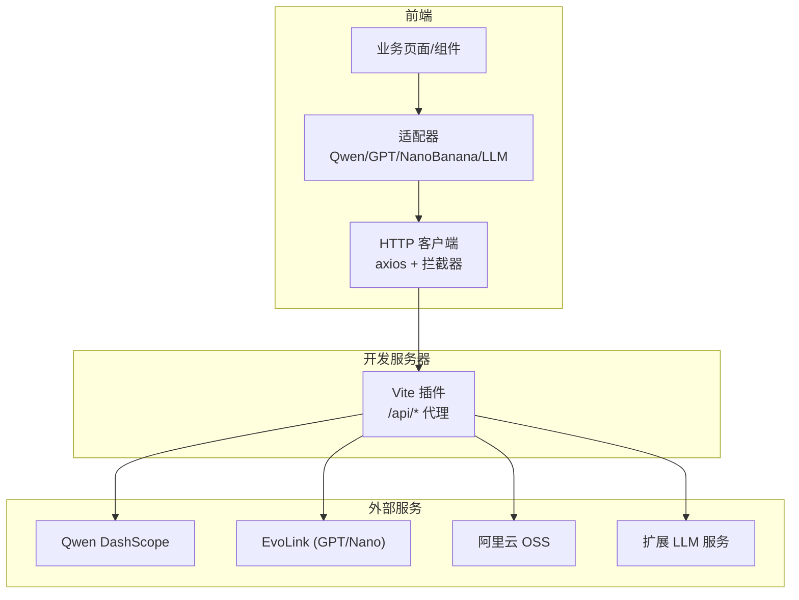
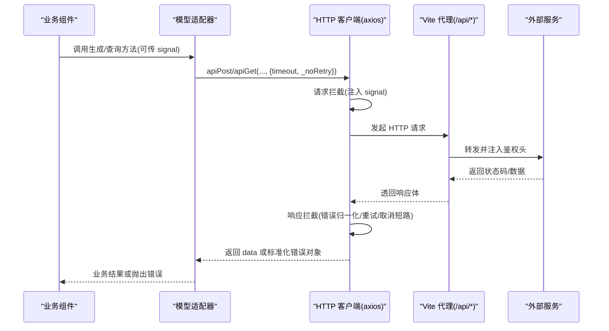
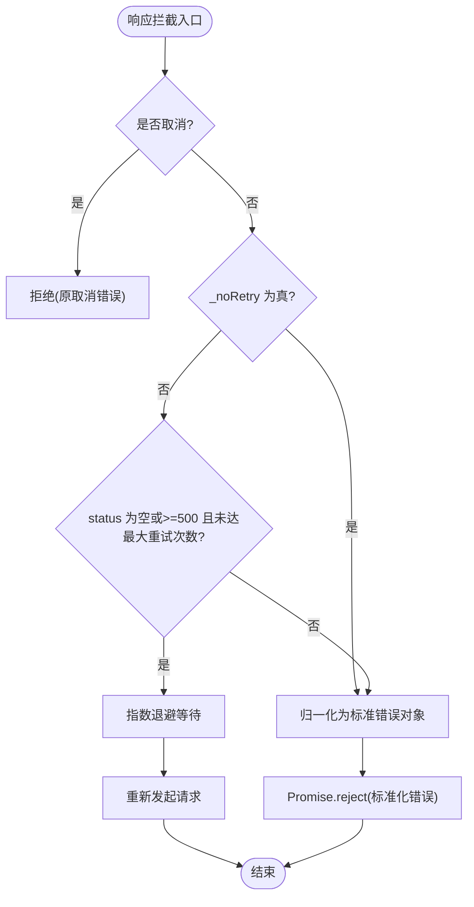
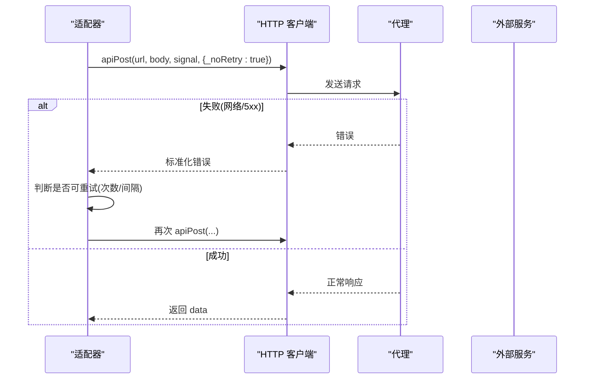
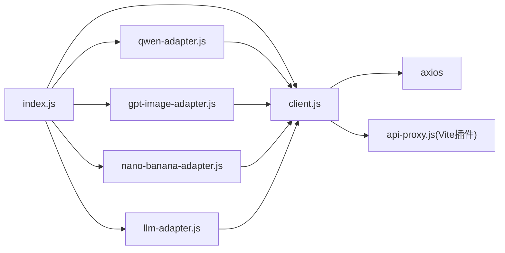

# API 请求管理

<cite>
**本文引用的文件**
- [client.js](file://app/src/services/api/client.js)
- [index.js](file://app/src/services/api/index.js)
- [qwen-adapter.js](file://app/src/services/api/qwen-adapter.js)
- [gpt-image-adapter.js](file://app/src/services/api/gpt-image-adapter.js)
- [nano-banana-adapter.js](file://app/src/services/api/nano-banana-adapter.js)
- [llm-adapter.js](file://app/src/services/api/llm-adapter.js)
- [api-proxy.js](file://app/src/server/api-proxy.js)
</cite>

## 目录
1. [简介](#简介)
2. [项目结构](#项目结构)
3. [核心组件](#核心组件)
4. [架构总览](#架构总览)
5. [详细组件分析](#详细组件分析)
6. [依赖关系分析](#依赖关系分析)
7. [性能与可靠性](#性能与可靠性)
8. [故障排查指南](#故障排查指南)
9. [结论](#结论)
10. [附录：异常处理示例路径](#附录：异常处理示例路径)

## 简介
本文件面向 AI Image Studio 的 API 请求管理层，系统性说明 Axios 客户端封装、拦截器、错误归一化、重试策略、取消机制（AbortController）、超时控制、代理转发与日志监控等。文档同时给出关键流程的时序图与流程图，帮助读者快速理解并正确使用该层能力。

## 项目结构
API 请求管理位于 services/api 目录，包含统一的 HTTP 客户端、适配器工厂以及各模型适配器的实现；服务端通过 Vite 插件提供 /api/* 路由代理，将前端请求转发至第三方服务。

图表来源
- [client.js:18-33](file://app/src/services/api/client.js#L18-L33)
- [api-proxy.js:121-189](file://app/src/server/api-proxy.js#L121-L189)

章节来源
- [client.js:1-146](file://app/src/services/api/client.js#L1-L146)
- [index.js:1-39](file://app/src/services/api/index.js#L1-L39)
- [api-proxy.js:1-190](file://app/src/server/api-proxy.js#L1-L190)

## 核心组件
- Axios 实例与默认配置
  - 基础实例：baseURL=/api，默认超时 60s，统一 Content-Type。
  - 长耗时实例：用于同步生成类接口，默认超时 5 分钟。
- 拦截器
  - 请求拦截：透传 AbortSignal，支持调用方传入 _signal。
  - 响应拦截：错误归一化、可重试判定、指数退避重试、取消信号短路。
- 便捷方法
  - apiGet/apiPost/apiPut/apiDelete：统一返回 res.data，支持 signal 与可选 timeout/_noRetry。
  - createCancellable：创建 AbortController 并暴露 signal/cancel。
- 适配器与工厂
  - QwenAdapter：同步直出，长超时。
  - GPTImageAdapter/NanoBananaAdapter：异步提交+轮询，内置 postWithRetry 与 pollWithBackoff。
  - LLMAdapter：提示词扩写，OpenAI/DashScope 兼容。
  - 工厂：根据 modelId 返回对应适配器实例。

章节来源
- [client.js:18-88](file://app/src/services/api/client.js#L18-L88)
- [client.js:100-145](file://app/src/services/api/client.js#L100-L145)
- [index.js:20-31](file://app/src/services/api/index.js#L20-L31)
- [qwen-adapter.js:51-209](file://app/src/services/api/qwen-adapter.js#L51-L209)
- [gpt-image-adapter.js:156-336](file://app/src/services/api/gpt-image-adapter.js#L156-L336)
- [nano-banana-adapter.js:125-265](file://app/src/services/api/nano-banana-adapter.js#L125-L265)
- [llm-adapter.js:23-150](file://app/src/services/api/llm-adapter.js#L23-L150)

## 架构总览
下图展示从业务到外部服务的完整链路，包括取消、重试、超时与代理转发的关键点。

图表来源
- [client.js:38-88](file://app/src/services/api/client.js#L38-L88)
- [api-proxy.js:55-116](file://app/src/server/api-proxy.js#L55-L116)

## 详细组件分析

### Axios 客户端与拦截器
- 双实例设计
  - 短超时实例：适用于常规 REST 接口。
  - 长超时实例：适用于同步图像生成等长耗时接口。
- 请求拦截
  - 自动将调用方传入的 _signal 映射为 axios 的 signal，确保 AbortController 生效。
- 响应拦截
  - 取消短路：若为 axios 取消或 ERR_CANCELED，直接拒绝，不进入重试逻辑。
  - 外部重试开关：当 _noRetry=true 时，跳过内部重试，直接返回标准化错误对象。
  - 自动重试：仅对无状态码或 >=500 的错误进行重试，最多 3 次，指数退避（1s→2s→4s）。
  - 错误归一化：统一返回 { message, status, data, originalError }，便于上层捕获与展示。

图表来源
- [client.js:49-85](file://app/src/services/api/client.js#L49-L85)

章节来源
- [client.js:18-33](file://app/src/services/api/client.js#L18-L33)
- [client.js:38-88](file://app/src/services/api/client.js#L38-L88)
- [client.js:100-145](file://app/src/services/api/client.js#L100-L145)

### 请求取消（AbortController）
- 使用方式
  - 通过 createCancellable() 获取 { signal, cancel(reason) }。
  - 在调用 apiGet/apiPost/apiPut/apiDelete 时传入 signal。
- 行为
  - 请求拦截会将 signal 注入 axios 底层。
  - 响应拦截识别取消错误后直接拒绝，避免误触发重试。
- 典型场景
  - 用户切换任务、关闭弹窗、导航离开时中断长耗时请求。
  - 批量任务中取消某一项而不影响其他项。

章节来源
- [client.js:137-143](file://app/src/services/api/client.js#L137-L143)
- [client.js:38-55](file://app/src/services/api/client.js#L38-L55)

### 重试机制与自动重试策略
- 全局自动重试（Axios 拦截器）
  - 条件：无状态码或 5xx；最大 3 次；指数退避。
  - 适用：网络抖动、上游临时不可用。
- 业务级重试（postWithRetry）
  - 由 GPT/NanoBanana 适配器自行实现，针对提交阶段的重试。
  - 通过 _noRetry=true 禁用拦截器重试，避免重复重试。
  - 指数退避：2s→4s→8s，最多 3 次。
  - 可重试判定：status=0、>=500 或消息包含 network/fetch/timeout/ECONN 等关键字。

图表来源
- [gpt-image-adapter.js:33-54](file://app/src/services/api/gpt-image-adapter.js#L33-L54)
- [nano-banana-adapter.js:26-47](file://app/src/services/api/nano-banana-adapter.js#L26-L47)
- [client.js:57-85](file://app/src/services/api/client.js#L57-L85)

章节来源
- [client.js:66-85](file://app/src/services/api/client.js#L66-L85)
- [gpt-image-adapter.js:33-54](file://app/src/services/api/gpt-image-adapter.js#L33-L54)
- [nano-banana-adapter.js:26-47](file://app/src/services/api/nano-banana-adapter.js#L26-L47)

### 超时处理
- 默认超时
  - 短超时实例：60s。
  - 长超时实例：300s（用于同步生成接口）。
- 动态超时
  - apiPost 支持 opts.timeout，超过 60s 自动切换到长超时实例。
- 代理侧
  - 代理转发本身不做额外超时控制，超时由客户端决定。

章节来源
- [client.js:18-33](file://app/src/services/api/client.js#L18-L33)
- [client.js:112-116](file://app/src/services/api/client.js#L112-L116)

### 网络错误与 HTTP 状态码处理
- 网络错误
  - 表现为 status=0 或错误消息包含 network/fetch/timeout/ECONN 等。
  - 会被自动重试或业务级重试捕获。
- 服务端错误
  - 5xx：自动重试（上限 3 次）。
  - 4xx：不进行自动重试，直接归一化错误返回给调用方。
- 取消错误
  - 直接拒绝，不参与重试。

章节来源
- [client.js:52-85](file://app/src/services/api/client.js#L52-L85)
- [gpt-image-adapter.js:33-54](file://app/src/services/api/gpt-image-adapter.js#L33-L54)
- [nano-banana-adapter.js:26-47](file://app/src/services/api/nano-banana-adapter.js#L26-L47)

### 代理转发与鉴权注入
- 路由
  - /api/qwen → Qwen DashScope
  - /api/evolink → EvoLink（GPT/Nano）
  - /api/oss → 阿里云 OSS
  - /api/llm → 扩展 LLM
- 鉴权
  - 从环境变量读取密钥，注入 Authorization/Bearer 或 OSS 相关头。
- 请求体与响应体
  - 兼容已解析的 req.body 与流式读取。
  - 过滤部分响应头（如 content-encoding/content-length），避免浏览器二次解压问题。

章节来源
- [api-proxy.js:121-189](file://app/src/server/api-proxy.js#L121-L189)
- [api-proxy.js:55-116](file://app/src/server/api-proxy.js#L55-L116)

### 适配器与业务编排
- QwenAdapter
  - 同步直出，长超时，参数校验与尺寸对齐，错误信息提取。
- GPTImageAdapter/NanoBananaAdapter
  - 提交+轮询模式，指数退避轮询，进度回调，取消支持。
- LLMAdapter
  - 提示词扩写，兼容 Markdown JSON 包裹，容错解析。

章节来源
- [qwen-adapter.js:51-209](file://app/src/services/api/qwen-adapter.js#L51-L209)
- [gpt-image-adapter.js:156-336](file://app/src/services/api/gpt-image-adapter.js#L156-L336)
- [nano-banana-adapter.js:125-265](file://app/src/services/api/nano-banana-adapter.js#L125-L265)
- [llm-adapter.js:23-150](file://app/src/services/api/llm-adapter.js#L23-L150)

## 依赖关系分析
- 模块耦合
  - 适配器依赖 client 提供的 apiGet/apiPost 等便捷方法与 createCancellable。
  - index.js 作为统一出口，导出客户端与适配器工厂。
- 外部依赖
  - axios：HTTP 客户端。
  - vite：开发期代理插件。
- 潜在循环
  - 当前未发现循环依赖。适配器只依赖 client，client 不反向依赖适配器。

图表来源
- [index.js:1-39](file://app/src/services/api/index.js#L1-L39)
- [client.js:1-146](file://app/src/services/api/client.js#L1-L146)
- [api-proxy.js:1-190](file://app/src/server/api-proxy.js#L1-L190)

章节来源
- [index.js:1-39](file://app/src/services/api/index.js#L1-L39)
- [client.js:1-146](file://app/src/services/api/client.js#L1-L146)

## 性能与可靠性
- 超时策略
  - 短接口 60s，长耗时接口 300s，避免长时间阻塞。
- 重试策略
  - 全局自动重试（5xx/网络错误）+ 业务级重试（提交阶段），双重保障。
- 取消机制
  - 通过 AbortController 及时释放资源，减少无效请求与内存占用。
- 代理优化
  - 过滤不必要响应头，避免浏览器二次解压导致的性能问题。
- 建议
  - 对幂等 GET/DELETE 可考虑更激进的重试；POST 谨慎重试。
  - 大文件上传/下载建议使用分片与断点续传（当前未实现）。
  - 结合前端埋点统计成功率、P95/P99 延迟与重试率。

[本节为通用指导，无需代码来源]

## 故障排查指南
- 常见问题定位
  - 请求被取消：检查是否调用了 cancel(reason)，确认未在业务层意外中断。
  - 一直重试：确认是否为 5xx 或网络错误；必要时设置 _noRetry 交由上层控制。
  - 超时：核对是否使用了长超时实例或传入 opts.timeout。
  - 代理错误：查看控制台 [api-proxy] 日志，确认目标地址与鉴权头是否正确。
- 调试技巧
  - 打开浏览器 Network 面板，观察请求 URL、状态码与响应体。
  - 关注控制台中的 [QwenAdapter]/[GPTImageAdapter]/[NanoBananaAdapter]/[LLMAdapter]/[api-proxy] 日志。
  - 对于轮询任务，关注 progress 字段与最终状态值（completed/succeeded/failed/error）。

章节来源
- [client.js:38-88](file://app/src/services/api/client.js#L38-L88)
- [api-proxy.js:55-116](file://app/src/server/api-proxy.js#L55-L116)
- [gpt-image-adapter.js:115-154](file://app/src/services/api/gpt-image-adapter.js#L115-L154)
- [nano-banana-adapter.js:82-114](file://app/src/services/api/nano-banana-adapter.js#L82-L114)
- [llm-adapter.js:85-122](file://app/src/services/api/llm-adapter.js#L85-L122)

## 结论
该请求管理层以 Axios 为核心，结合拦截器、取消与重试机制，为多模型适配器提供了稳定可靠的网络访问能力。配合 Vite 代理与完善的日志输出，开发者可以快速定位问题并持续优化用户体验。建议在后续迭代中补充结构化日志与指标上报，进一步提升可观测性与稳定性。

[本节为总结性内容，无需代码来源]

## 附录：异常处理示例路径
以下为常见异常的处理参考位置（不包含具体代码片段，仅提供源码路径以便查阅）：
- 取消错误处理
  - [client.js:52-55](file://app/src/services/api/client.js#L52-L55)
- 自动重试与指数退避
  - [client.js:66-85](file://app/src/services/api/client.js#L66-L85)
- 业务级重试（提交阶段）
  - [gpt-image-adapter.js:33-54](file://app/src/services/api/gpt-image-adapter.js#L33-L54)
  - [nano-banana-adapter.js:26-47](file://app/src/services/api/nano-banana-adapter.js#L26-L47)
- 轮询超时与进度
  - [gpt-image-adapter.js:63-91](file://app/src/services/api/gpt-image-adapter.js#L63-L91)
  - [nano-banana-adapter.js:52-76](file://app/src/services/api/nano-banana-adapter.js#L52-L76)
- 代理错误与 502 兜底
  - [api-proxy.js:109-116](file://app/src/server/api-proxy.js#L109-L116)
- 适配器错误信息提取与抛错
  - [qwen-adapter.js:41-49](file://app/src/services/api/qwen-adapter.js#L41-L49)
  - [gpt-image-adapter.js:115-154](file://app/src/services/api/gpt-image-adapter.js#L115-L154)
  - [nano-banana-adapter.js:82-114](file://app/src/services/api/nano-banana-adapter.js#L82-L114)
  - [llm-adapter.js:85-122](file://app/src/services/api/llm-adapter.js#L85-L122)