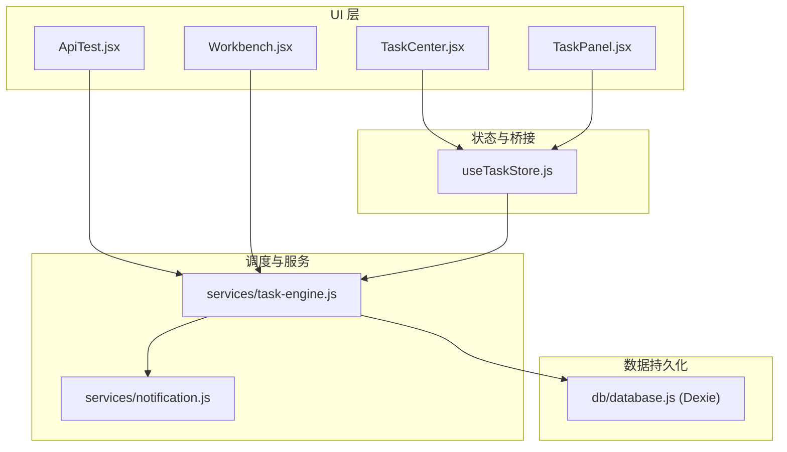
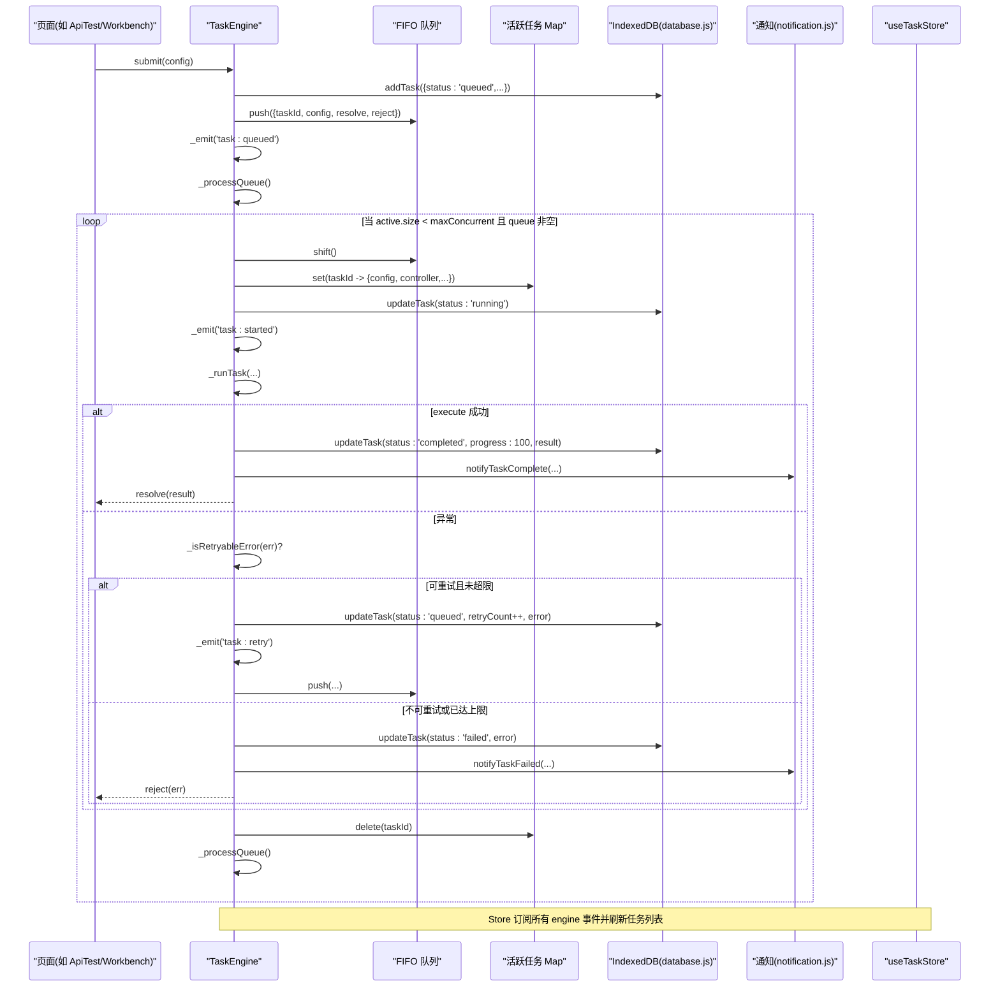
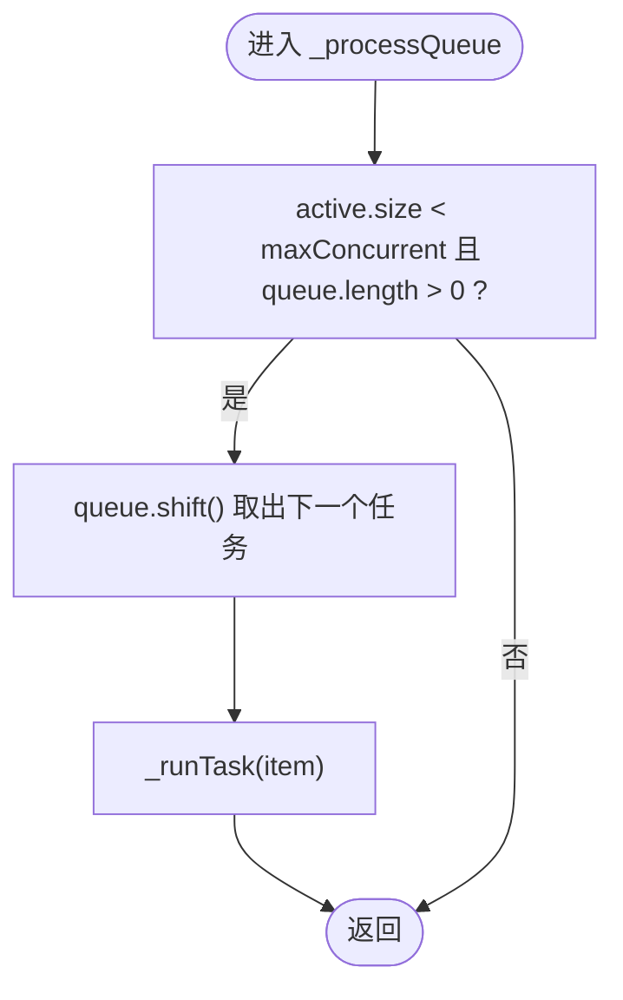
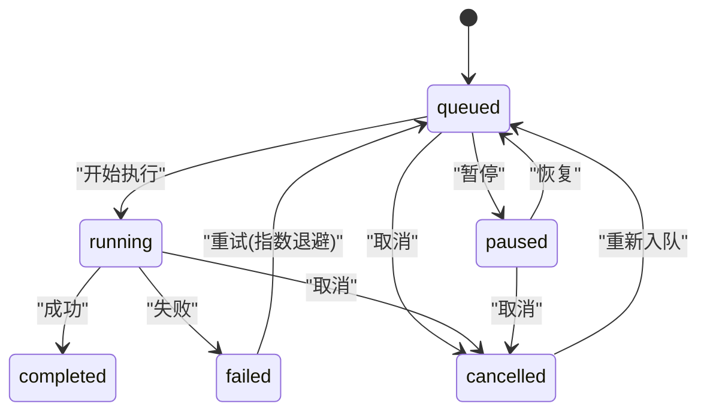
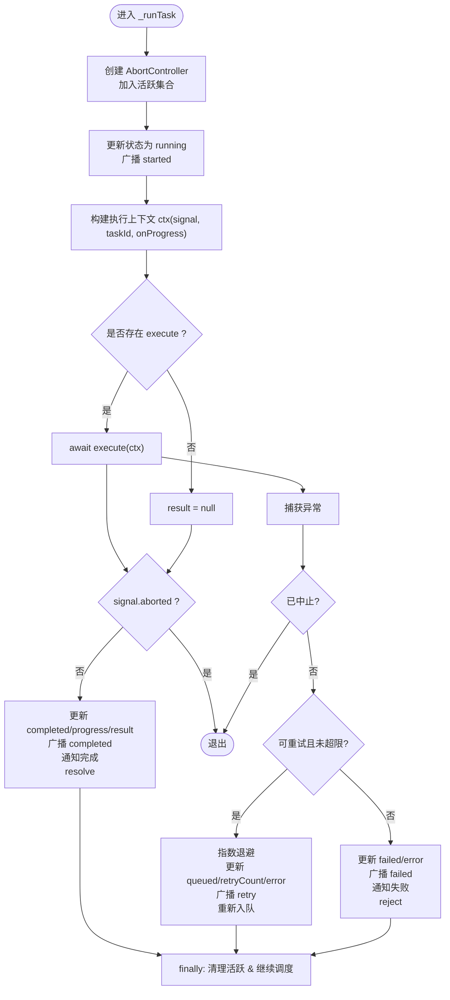
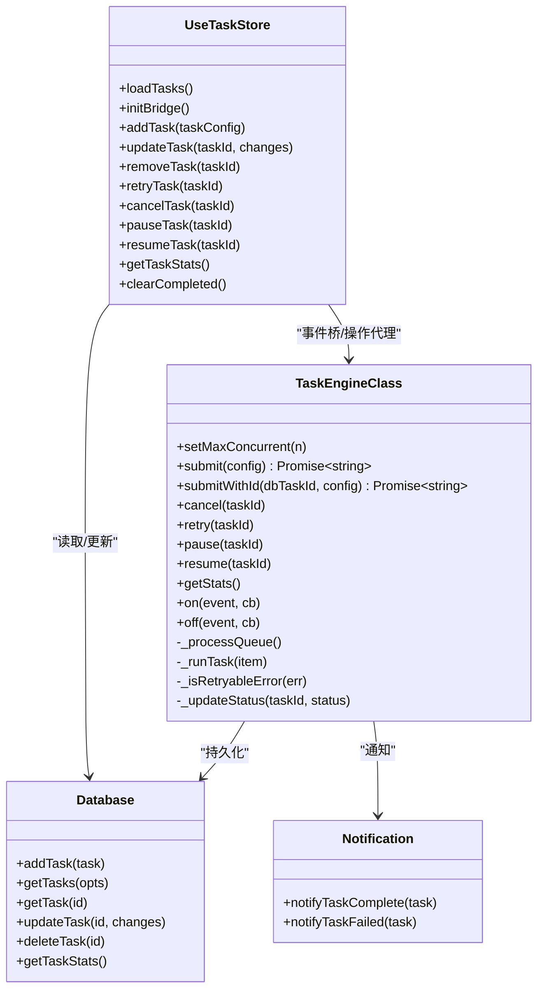

# 任务调度机制

<cite>
**本文引用的文件**
- [task-engine.js](file://app/src/services/task-engine.js)
- [useTaskStore.js](file://app/src/stores/useTaskStore.js)
- [database.js](file://app/src/db/database.js)
- [notification.js](file://app/src/services/notification.js)
- [ApiTest.jsx](file://app/src/pages/ApiTest.jsx)
- [Workbench.jsx](file://app/src/pages/Workbench.jsx)
</cite>

## 目录
1. [简介](#简介)
2. [项目结构](#项目结构)
3. [核心组件](#核心组件)
4. [架构总览](#架构总览)
5. [详细组件分析](#详细组件分析)
6. [依赖关系分析](#依赖关系分析)
7. [性能与并发控制](#性能与并发控制)
8. [故障排查指南](#故障排查指南)
9. [结论](#结论)
10. [附录：使用示例路径](#附录使用示例路径)

## 简介
本文件面向 AI Image Studio 的任务调度子系统，系统性阐述 TaskEngine 的并发控制算法、FIFO 队列管理、任务状态机设计、生命周期转换规则，以及 _processQueue 调度逻辑与 _runTask 执行流程。同时说明重试策略、进度上报、事件总线与持久化集成，并给出正确的异步任务提交与管理实践。

## 项目结构
围绕任务调度的关键代码分布在以下模块：
- 服务层：TaskEngine（调度器）、通知服务
- 数据层：IndexedDB 封装（Dexie）
- 状态桥接：Zustand Store（将引擎事件同步到 UI 状态）
- 页面调用：API 测试与工作台中对 TaskEngine 的实际使用

图表来源
- [task-engine.js:1-319](file://app/src/services/task-engine.js#L1-L319)
- [useTaskStore.js:1-173](file://app/src/stores/useTaskStore.js#L1-L173)
- [database.js:1-339](file://app/src/db/database.js#L1-L339)
- [notification.js:1-113](file://app/src/services/notification.js#L1-L113)
- [ApiTest.jsx:90-183](file://app/src/pages/ApiTest.jsx#L90-L183)
- [Workbench.jsx:395-423](file://app/src/pages/Workbench.jsx#L395-L423)

章节来源
- [task-engine.js:1-319](file://app/src/services/task-engine.js#L1-L319)
- [useTaskStore.js:1-173](file://app/src/stores/useTaskStore.js#L1-L173)
- [database.js:1-339](file://app/src/db/database.js#L1-L339)
- [notification.js:1-113](file://app/src/services/notification.js#L1-L113)
- [ApiTest.jsx:90-183](file://app/src/pages/ApiTest.jsx#L90-L183)
- [Workbench.jsx:395-423](file://app/src/pages/Workbench.jsx#L395-L423)

## 核心组件
- TaskEngine（单例）
  - 职责：任务入队、并发控制、执行编排、状态机、重试与退避、进度上报、事件广播、持久化更新。
  - 关键属性：最大并发数、FIFO 队列、活跃任务集合、事件监听器。
- useTaskStore（Zustand）
  - 职责：维护任务列表与统计；初始化 TaskEngine 事件桥，统一刷新 UI。
- database（Dexie）
  - 职责：提供 IndexedDB 的 CRUD 接口，包含 tasks 表结构与查询聚合。
- notification
  - 职责：浏览器通知封装，用于任务完成/失败提示。

章节来源
- [task-engine.js:33-40](file://app/src/services/task-engine.js#L33-L40)
- [useTaskStore.js:14-64](file://app/src/stores/useTaskStore.js#L14-L64)
- [database.js:22-31](file://app/src/db/database.js#L22-L31)
- [notification.js:78-103](file://app/src/services/notification.js#L78-L103)

## 架构总览
下图展示了从 UI 发起任务到执行、持久化与通知的完整链路，以及状态变更如何驱动 UI 刷新。

图表来源
- [task-engine.js:57-81](file://app/src/services/task-engine.js#L57-L81)
- [task-engine.js:215-220](file://app/src/services/task-engine.js#L215-L220)
- [task-engine.js:222-297](file://app/src/services/task-engine.js#L222-L297)
- [useTaskStore.js:39-64](file://app/src/stores/useTaskStore.js#L39-L64)
- [database.js:235-274](file://app/src/db/database.js#L235-L274)
- [notification.js:78-103](file://app/src/services/notification.js#L78-L103)

## 详细组件分析

### TaskEngine 类与并发控制
- 最大并发数配置
  - 通过 setMaxConcurrent(n) 设置，默认 3，最小为 1。
  - 修改后立即尝试消费队列以应用新限制。
- FIFO 队列
  - 内部数组作为队列，push 入队，shift 出队，保证先进先出。
- 活跃任务集合
  - Map 记录当前正在运行的任务及其控制器、Promise 回调等，用于取消/暂停与并发计数。
- 调度循环
  - _processQueue 在每次任务开始/结束/取消/暂停后触发，只要 active.size < maxConcurrent 且队列非空，就持续出队并启动任务。

图表来源
- [task-engine.js:215-220](file://app/src/services/task-engine.js#L215-L220)

章节来源
- [task-engine.js:44-48](file://app/src/services/task-engine.js#L44-L48)
- [task-engine.js:215-220](file://app/src/services/task-engine.js#L215-L220)

### 任务状态机与生命周期
- 状态定义
  - queued、running、completed、failed、cancelled、paused。
- 合法转换
  - queued → running | cancelled | paused
  - running → completed | failed | cancelled
  - paused → queued | cancelled
  - failed → queued（仅重试）
  - cancelled → queued（重新入队）
  - completed 无后续转换
- 实现要点
  - 状态常量集中定义，便于校验与扩展。
  - 所有状态变更均持久化至数据库并广播事件。

图表来源
- [task-engine.js:24-31](file://app/src/services/task-engine.js#L24-L31)

章节来源
- [task-engine.js:24-31](file://app/src/services/task-engine.js#L24-L31)

### _runTask 执行流程
- 创建 AbortController，加入活跃集合，写入 running 状态并广播 started。
- 构造执行上下文 ctx：包含 signal、taskId、onProgress(percent)。
- 若提供 execute 函数则执行，否则直接视为完成。
- 成功分支：写入 completed、progress=100、result，发送完成通知，resolve。
- 异常分支：
  - 若已中止（cancel/pause），直接返回。
  - 判断是否可重试（_isRetryableError）且未超过最大重试次数（默认 3）。
  - 可重试：指数退避后回写 queued，增加 retryCount，重新入队，广播 retry。
  - 不可重试或超限：写入 failed，发送失败通知，reject。
- finally：清理活跃集合，再次尝试消费队列。

图表来源
- [task-engine.js:222-297](file://app/src/services/task-engine.js#L222-L297)

章节来源
- [task-engine.js:222-297](file://app/src/services/task-engine.js#L222-L297)

### 重试与退避策略
- 可重试判定
  - HTTP 5xx 错误、网络错误、超时等。
- 最大重试次数
  - 默认 3 次。
- 指数退避
  - 基于 retryCount 计算等待时间，避免雪崩。
- 状态回写
  - 重试前将状态置为 queued，记录 error 与 retryCount。

章节来源
- [task-engine.js:299-305](file://app/src/services/task-engine.js#L299-L305)
- [task-engine.js:265-281](file://app/src/services/task-engine.js#L265-L281)

### 进度上报与事件总线
- 进度上报
  - 通过 ctx.onProgress(percent) 持久化 progress 并广播 task:progress。
- 事件类型
  - task:queued、task:started、task:progress、task:completed、task:failed、task:cancelled、task:paused、task:retry。
- 事件订阅
  - useTaskStore 在 initBridge 中订阅全部事件，统一刷新任务列表，驱动 UI 实时响应。

章节来源
- [task-engine.js:230-236](file://app/src/services/task-engine.js#L230-L236)
- [useTaskStore.js:39-64](file://app/src/stores/useTaskStore.js#L39-L64)

### 取消与暂停
- 取消
  - 若任务在活跃集合：调用 controller.abort()，删除活跃项，更新 cancelled，reject 调用方，继续调度。
  - 若任务在队列：从队列移除，更新 cancelled，reject 调用方。
- 暂停
  - 运行中：abort 并标记 paused。
  - 排队中：仅标记 paused。
- 恢复
  - 将 paused 任务状态改为 queued，并触发调度。注意：execute 引用可能丢失，需由调用方重新提交。

章节来源
- [task-engine.js:94-116](file://app/src/services/task-engine.js#L94-L116)
- [task-engine.js:148-178](file://app/src/services/task-engine.js#L148-L178)

### 资源分配与负载均衡策略
- 并发控制
  - 通过最大并发数限制同时运行的任务数量，避免过载。
- 公平性
  - 采用 FIFO 队列，保证先来先执行。
- 可扩展点
  - 可按模型或任务类型拆分多个队列与并发池，实现更细粒度的资源隔离与优先级调度（当前未实现，可作为演进方向）。

章节来源
- [task-engine.js:44-48](file://app/src/services/task-engine.js#L44-L48)
- [task-engine.js:215-220](file://app/src/services/task-engine.js#L215-L220)

### 与持久化的集成
- 任务记录字段
  - id、type、status、model、prompt、params、progress、error、result、retryCount、createdAt、updatedAt。
- 索引与查询
  - tasks 表按 createdAt 倒序，支持按 status 过滤与分页。
- 统计
  - 提供 getTaskStats 汇总 total/active/queued/completed/failed。

章节来源
- [database.js:22-31](file://app/src/db/database.js#L22-L31)
- [database.js:235-274](file://app/src/db/database.js#L235-L274)

## 依赖关系分析
- TaskEngine 依赖
  - database：读写任务记录、更新状态与进度。
  - notification：任务完成/失败时推送系统通知。
  - uuid：生成唯一 taskId。
- useTaskStore 依赖
  - TaskEngine：事件订阅与操作代理（重试、取消、暂停、恢复）。
  - database：加载任务列表与统计数据。
- UI 组件依赖
  - TaskCenter/TaskPanel：读取 store 中的任务列表与动作方法。
  - ApiTest/Workbench：直接调用 TaskEngine.submit 提交任务。

图表来源
- [task-engine.js:33-318](file://app/src/services/task-engine.js#L33-L318)
- [useTaskStore.js:14-172](file://app/src/stores/useTaskStore.js#L14-L172)
- [database.js:235-274](file://app/src/db/database.js#L235-L274)
- [notification.js:78-103](file://app/src/services/notification.js#L78-L103)

章节来源
- [task-engine.js:33-318](file://app/src/services/task-engine.js#L33-L318)
- [useTaskStore.js:14-172](file://app/src/stores/useTaskStore.js#L14-L172)
- [database.js:235-274](file://app/src/db/database.js#L235-L274)
- [notification.js:78-103](file://app/src/services/notification.js#L78-L103)

## 性能与并发控制
- 并发上限
  - 建议根据浏览器能力与后端限流策略调整，默认 3。
- 队列长度
  - 长队列会增大内存占用与 UI 刷新压力，应结合清理策略（如清空已完成）控制历史数据规模。
- 重试退避
  - 指数退避降低瞬时风暴风险，但需注意总耗时与用户体验。
- I/O 密集
  - 频繁持久化与通知可能造成抖动，可在高吞吐场景下合并更新或节流通知。

[本节为通用指导，不直接分析具体文件]

## 故障排查指南
- 任务无法启动
  - 检查 _maxConcurrent 是否为 0 或负数（会被修正为至少 1）。
  - 确认 _processQueue 是否在 submit 后被调用。
- 任务卡住
  - 检查 execute 是否正确响应 AbortController.signal。
  - 确认 onProgress 调用频率，避免过于频繁导致 UI 卡顿。
- 重复重试
  - 查看 _isRetryableError 判定条件，确保错误对象携带 status 或 message 字段。
- 状态不一致
  - 核对 _updateStatus 是否抛出异常被吞掉；必要时增加日志。
- 通知未显示
  - 确认已请求权限并在 granted 状态下调用通知。

章节来源
- [task-engine.js:44-48](file://app/src/services/task-engine.js#L44-L48)
- [task-engine.js:299-305](file://app/src/services/task-engine.js#L299-L305)
- [notification.js:19-43](file://app/src/services/notification.js#L19-L43)

## 结论
TaskEngine 以简洁的状态机与 FIFO 队列实现了稳定可靠的后台任务调度，配合指数退避重试、进度上报与事件总线，形成了端到端的任务生命周期闭环。通过最大并发数与活跃集合控制，有效避免了资源争用与过载。建议在后续版本引入任务优先级与多队列分流，以满足不同模型/任务的差异化资源需求。

[本节为总结，不直接分析具体文件]

## 附录：使用示例路径
- 提交图像生成任务（工作流）
  - [Workbench.jsx:395-423](file://app/src/pages/Workbench.jsx#L395-L423)
- 提交多种模型的测试任务（含进度回调）
  - [ApiTest.jsx:90-183](file://app/src/pages/ApiTest.jsx#L90-L183)
- 任务中心与侧边栏面板（展示与操作）
  - [TaskCenter.jsx:1-218](file://app/src/pages/TaskCenter.jsx#L1-L218)
  - [TaskPanel.jsx:1-538](file://app/src/components/TaskPanel.jsx#L1-L538)
- 任务存储与事件桥接
  - [useTaskStore.js:1-173](file://app/src/stores/useTaskStore.js#L1-L173)
- 数据库任务表与统计
  - [database.js:235-274](file://app/src/db/database.js#L235-L274)
- 通知服务
  - [notification.js:78-103](file://app/src/services/notification.js#L78-L103)