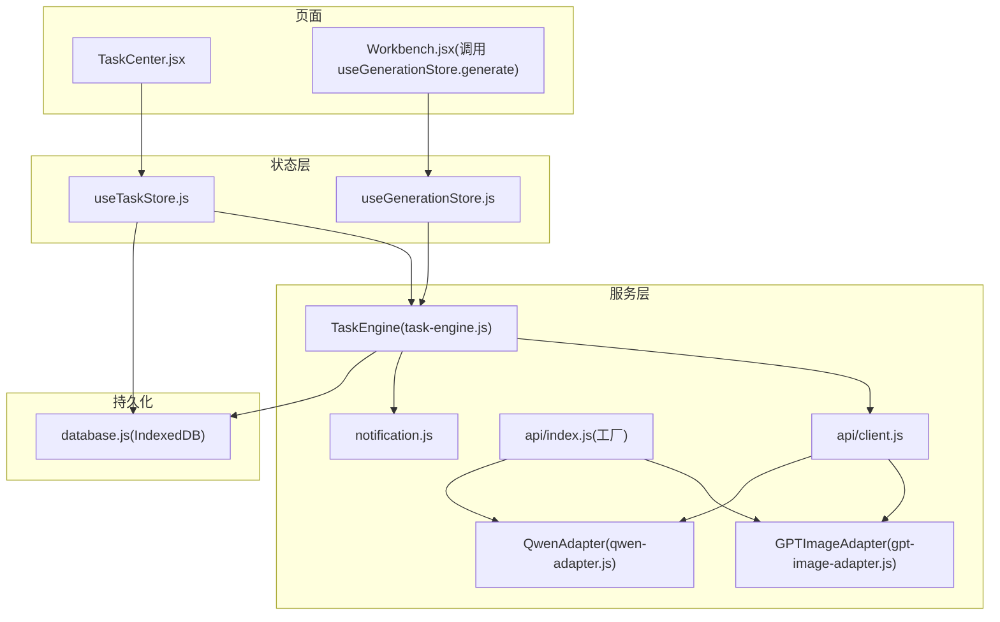
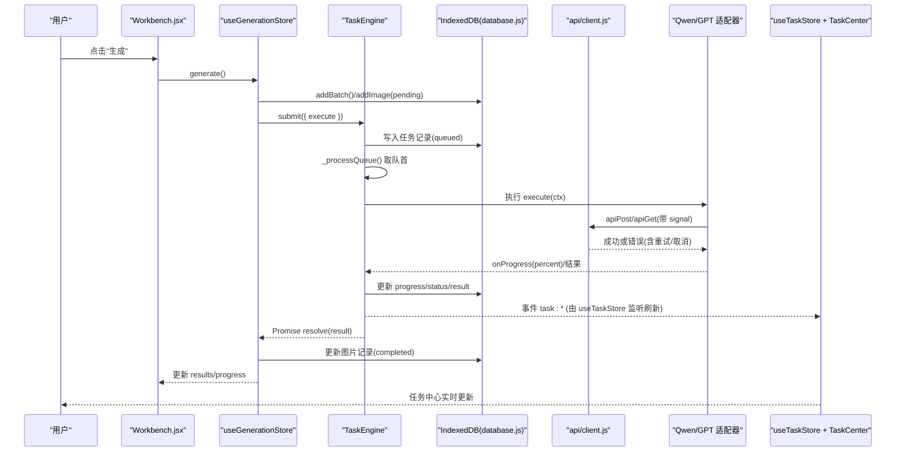
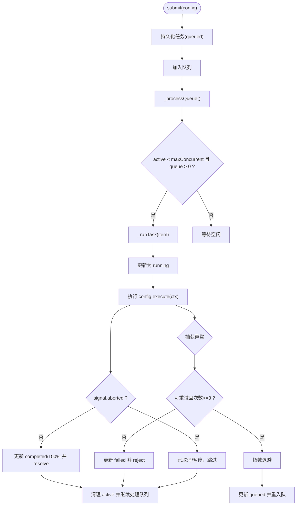
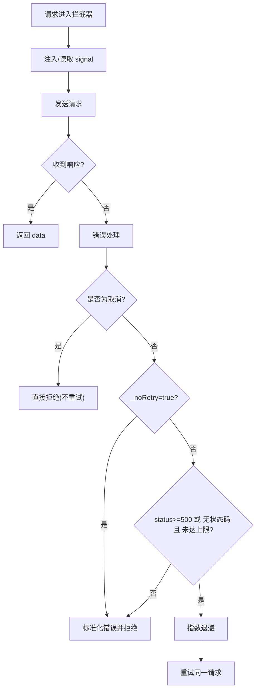
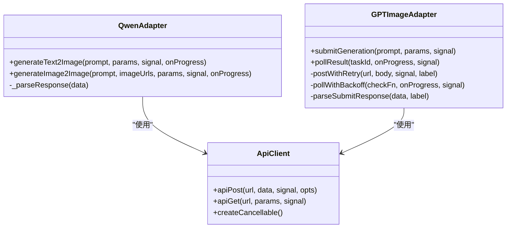
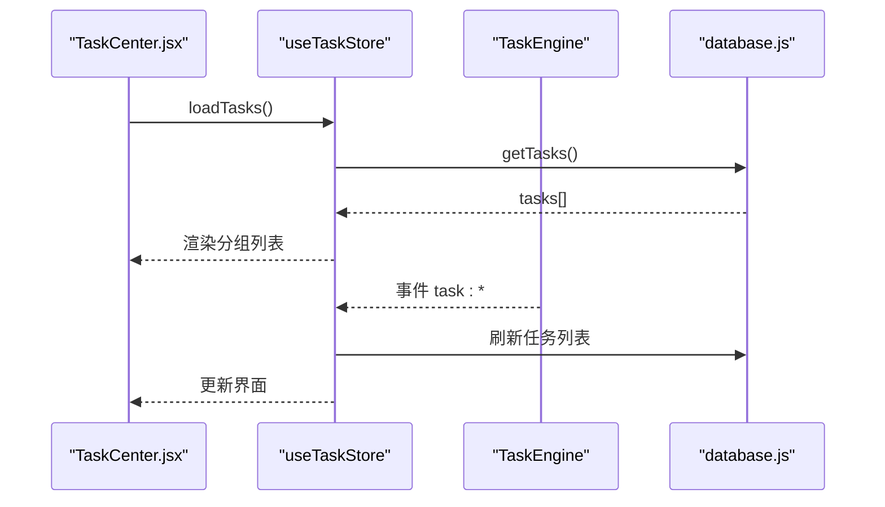
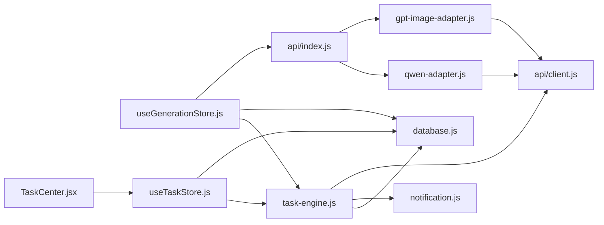

# 异步数据处理

<cite>
**本文引用的文件**
- [task-engine.js](file://app/src/services/task-engine.js)
- [client.js](file://app/src/services/api/client.js)
- [index.js](file://app/src/services/api/index.js)
- [qwen-adapter.js](file://app/src/services/api/qwen-adapter.js)
- [gpt-image-adapter.js](file://app/src/services/api/gpt-image-adapter.js)
- [useTaskStore.js](file://app/src/stores/useTaskStore.js)
- [useGenerationStore.js](file://app/src/stores/useGenerationStore.js)
- [database.js](file://app/src/db/database.js)
- [notification.js](file://app/src/services/notification.js)
- [TaskCenter.jsx](file://app/src/pages/TaskCenter.jsx)
</cite>

## 目录
1. [简介](#简介)
2. [项目结构](#项目结构)
3. [核心组件](#核心组件)
4. [架构总览](#架构总览)
5. [详细组件分析](#详细组件分析)
6. [依赖关系分析](#依赖关系分析)
7. [性能与内存管理](#性能与内存管理)
8. [错误处理策略](#错误处理策略)
9. [调试与排障指南](#调试与排障指南)
10. [结论](#结论)

## 简介
本文件面向 AI Image Studio 的异步数据处理子系统，聚焦以下目标：
- 任务引擎 TaskEngine 的异步流程、Promise 链管理与错误处理机制
- 任务调度算法、并发控制策略与进度跟踪
- API 客户端的请求拦截器、重试机制与取消请求能力
- 从用户操作到数据返回的完整异步链路（含序列图）
- 内存管理、性能监控与调试技巧

## 项目结构
围绕异步数据处理的代码主要分布在服务层、存储层与页面层：
- 服务层
  - 任务引擎：services/task-engine.js
  - HTTP 客户端与适配器：services/api/client.js, services/api/index.js, services/api/qwen-adapter.js, services/api/gpt-image-adapter.js
  - 通知：services/notification.js
- 状态与持久化
  - 任务状态桥接：stores/useTaskStore.js
  - 生成工作流状态：stores/useGenerationStore.js
  - IndexedDB 封装：db/database.js
- 页面
  - 任务中心：pages/TaskCenter.jsx

图表来源
- [task-engine.js:1-319](file://app/src/services/task-engine.js#L1-L319)
- [client.js:1-146](file://app/src/services/api/client.js#L1-L146)
- [index.js:1-39](file://app/src/services/api/index.js#L1-L39)
- [qwen-adapter.js:1-200](file://app/src/services/api/qwen-adapter.js#L1-L200)
- [gpt-image-adapter.js:1-200](file://app/src/services/api/gpt-image-adapter.js#L1-L200)
- [useTaskStore.js:1-173](file://app/src/stores/useTaskStore.js#L1-L173)
- [useGenerationStore.js:1-360](file://app/src/stores/useGenerationStore.js#L1-L360)
- [database.js:1-339](file://app/src/db/database.js#L1-L339)
- [notification.js:1-113](file://app/src/services/notification.js#L1-L113)
- [TaskCenter.jsx:1-218](file://app/src/pages/TaskCenter.jsx#L1-L218)

章节来源
- [task-engine.js:1-319](file://app/src/services/task-engine.js#L1-L319)
- [client.js:1-146](file://app/src/services/api/client.js#L1-L146)
- [index.js:1-39](file://app/src/services/api/index.js#L1-L39)
- [qwen-adapter.js:1-200](file://app/src/services/api/qwen-adapter.js#L1-L200)
- [gpt-image-adapter.js:1-200](file://app/src/services/api/gpt-image-adapter.js#L1-L200)
- [useTaskStore.js:1-173](file://app/src/stores/useTaskStore.js#L1-L173)
- [useGenerationStore.js:1-360](file://app/src/stores/useGenerationStore.js#L1-L360)
- [database.js:1-339](file://app/src/db/database.js#L1-L339)
- [notification.js:1-113](file://app/src/services/notification.js#L1-L113)
- [TaskCenter.jsx:1-218](file://app/src/pages/TaskCenter.jsx#L1-L218)

## 核心组件
- TaskEngine：后台任务调度器，提供最大并发、FIFO 队列、指数退避重试、状态机、事件发射、进度上报与自动持久化。
- API 客户端：基于 axios 的统一 HTTP 客户端，包含请求/响应拦截器、自动重试、取消支持、长耗时专用实例。
- 模型适配器：QwenAdapter（同步直出）、GPTImageAdapter（异步提交+轮询）。
- 状态桥接：useTaskStore 将 TaskEngine 事件映射为 Zustand 状态；useGenerationStore 编排生成流程并持久化结果。
- 持久化：IndexedDB 通过 Dexie 维护 images、batches、tasks 等表。
- 通知：浏览器通知包装，用于任务完成/失败提醒。

章节来源
- [task-engine.js:1-319](file://app/src/services/task-engine.js#L1-L319)
- [client.js:1-146](file://app/src/services/api/client.js#L1-L146)
- [qwen-adapter.js:1-200](file://app/src/services/api/qwen-adapter.js#L1-L200)
- [gpt-image-adapter.js:1-200](file://app/src/services/api/gpt-image-adapter.js#L1-L200)
- [useTaskStore.js:1-173](file://app/src/stores/useTaskStore.js#L1-L173)
- [useGenerationStore.js:1-360](file://app/src/stores/useGenerationStore.js#L1-L360)
- [database.js:1-339](file://app/src/db/database.js#L1-L339)
- [notification.js:1-113](file://app/src/services/notification.js#L1-L113)

## 架构总览
下图展示从用户触发生成到结果落库与 UI 更新的端到端异步链路。

图表来源
- [useGenerationStore.js:112-290](file://app/src/stores/useGenerationStore.js#L112-L290)
- [task-engine.js:57-297](file://app/src/services/task-engine.js#L57-L297)
- [client.js:38-88](file://app/src/services/api/client.js#L38-L88)
- [qwen-adapter.js:60-105](file://app/src/services/api/qwen-adapter.js#L60-L105)
- [gpt-image-adapter.js:164-200](file://app/src/services/api/gpt-image-adapter.js#L164-L200)
- [useTaskStore.js:39-64](file://app/src/stores/useTaskStore.js#L39-L64)
- [database.js:235-274](file://app/src/db/database.js#L235-L274)

## 详细组件分析

### TaskEngine 任务调度与并发控制
- 并发上限：可配置的最大并发数，默认 3。内部使用 Map 维护正在运行的任务集合，循环从 FIFO 队列中取出任务直到达到上限。
- 任务生命周期：queued -> running -> completed/failed/cancelled/paused；failed 可重试回 queued；cancelled 可重新入队。
- 取消与暂停：对运行中任务通过 AbortController.abort 中断；对排队中任务直接移除并标记 cancelled。
- 重试策略：捕获异常后判断是否可重试（如 5xx、网络错误），按指数退避延迟后重新入队，最多 3 次。
- 进度跟踪：execute 上下文提供 onProgress(percent)，内部持久化并广播 task:progress。
- 事件系统：on/off/_emit 实现轻量事件总线，供 useTaskStore 订阅刷新 UI。
- 持久化：所有关键状态变更均写库，确保刷新后可恢复。

图表来源
- [task-engine.js:57-81](file://app/src/services/task-engine.js#L57-L81)
- [task-engine.js:215-297](file://app/src/services/task-engine.js#L215-L297)
- [task-engine.js:299-305](file://app/src/services/task-engine.js#L299-L305)

章节来源
- [task-engine.js:1-319](file://app/src/services/task-engine.js#L1-L319)

### API 客户端：拦截器、重试与取消
- 基础实例与长时实例：默认 60s 超时；针对同步图像生成提供 5 分钟超时的 longRunningClient。
- 请求拦截器：统一注入 AbortSignal，便于上层取消。
- 响应拦截器：
  - 标准化错误对象（message/status/data/originalError）。
  - 自动重试：仅当无显式禁用(_noRetry=false)且状态码>=500或无状态码时，进行指数退避重试，最多 3 次。
  - 取消优先：若为 axios 取消或 ERR_CANCELED，直接拒绝，不重试。
- 便捷方法：apiGet/apiPost/apiPut/apiDelete，以及 createCancellable 辅助创建信号与取消函数。

图表来源
- [client.js:38-88](file://app/src/services/api/client.js#L38-L88)
- [client.js:100-146](file://app/src/services/api/client.js#L100-L146)

章节来源
- [client.js:1-146](file://app/src/services/api/client.js#L1-L146)

### 模型适配器：同步与异步两种模式
- QwenAdapter（同步直出）
  - 文本转图像与图像转图像均为 POST 直出结果，使用长超时。
  - 在调用前后上报进度（10%/90%/100%），错误信息规范化抛出。
- GPTImageAdapter（异步提交+轮询）
  - 提交阶段：POST 获取 taskId，内置 postWithRetry 重试逻辑（_noRetry=true，避免与拦截器重复重试）。
  - 轮询阶段：pollWithBackoff 指数退避查询任务状态，最长 5 分钟，支持取消。
  - 解析多种响应格式，兼容 id/task_id/results/data 等字段。

图表来源
- [qwen-adapter.js:51-200](file://app/src/services/api/qwen-adapter.js#L51-L200)
- [gpt-image-adapter.js:33-91](file://app/src/services/api/gpt-image-adapter.js#L33-L91)
- [gpt-image-adapter.js:156-200](file://app/src/services/api/gpt-image-adapter.js#L156-L200)
- [client.js:100-146](file://app/src/services/api/client.js#L100-L146)

章节来源
- [qwen-adapter.js:1-200](file://app/src/services/api/qwen-adapter.js#L1-L200)
- [gpt-image-adapter.js:1-200](file://app/src/services/api/gpt-image-adapter.js#L1-L200)
- [client.js:1-146](file://app/src/services/api/client.js#L1-L146)

### 状态桥接与 UI 联动
- useTaskStore
  - initBridge：一次性订阅 TaskEngine 的所有事件，统一刷新任务列表，驱动 TaskCenter 实时显示。
  - 提供 add/update/remove/retry/cancel/pause/resume 等操作，最终都落到数据库并刷新本地状态。
- useGenerationStore
  - generate：构建 execute 函数，先持久化 pending 图片记录，再提交至 TaskEngine；完成后更新图片记录与 store 结果集。
  - 错误路径：若 adapter 抛错，尝试将 pending 记录标记为 failed，并将错误上抛给 UI。

图表来源
- [useTaskStore.js:39-64](file://app/src/stores/useTaskStore.js#L39-L64)
- [useTaskStore.js:23-33](file://app/src/stores/useTaskStore.js#L23-L33)
- [TaskCenter.jsx:24-66](file://app/src/pages/TaskCenter.jsx#L24-L66)
- [database.js:243-274](file://app/src/db/database.js#L243-L274)

章节来源
- [useTaskStore.js:1-173](file://app/src/stores/useTaskStore.js#L1-L173)
- [useGenerationStore.js:112-290](file://app/src/stores/useGenerationStore.js#L112-L290)
- [TaskCenter.jsx:1-218](file://app/src/pages/TaskCenter.jsx#L1-L218)
- [database.js:235-274](file://app/src/db/database.js#L235-L274)

## 依赖关系分析
- TaskEngine 依赖 database.js 进行任务持久化，依赖 notification.js 做外部通知，依赖 axios 客户端发起网络请求。
- useGenerationStore 依赖 TaskEngine 与 database.js，并通过 api/index.js 工厂选择具体适配器。
- 适配器依赖 client.js 提供的 apiPost/apiGet 与 cancel 能力。
- useTaskStore 作为中间层，解耦 UI 与 TaskEngine，统一刷新策略。

图表来源
- [useGenerationStore.js:112-290](file://app/src/stores/useGenerationStore.js#L112-L290)
- [task-engine.js:1-319](file://app/src/services/task-engine.js#L1-L319)
- [client.js:1-146](file://app/src/services/api/client.js#L1-L146)
- [index.js:1-39](file://app/src/services/api/index.js#L1-L39)
- [qwen-adapter.js:1-200](file://app/src/services/api/qwen-adapter.js#L1-L200)
- [gpt-image-adapter.js:1-200](file://app/src/services/api/gpt-image-adapter.js#L1-L200)
- [useTaskStore.js:1-173](file://app/src/stores/useTaskStore.js#L1-L173)
- [TaskCenter.jsx:1-218](file://app/src/pages/TaskCenter.jsx#L1-L218)

章节来源
- [useGenerationStore.js:112-290](file://app/src/stores/useGenerationStore.js#L112-L290)
- [task-engine.js:1-319](file://app/src/services/task-engine.js#L1-L319)
- [client.js:1-146](file://app/src/services/api/client.js#L1-L146)
- [index.js:1-39](file://app/src/services/api/index.js#L1-L39)
- [qwen-adapter.js:1-200](file://app/src/services/api/qwen-adapter.js#L1-L200)
- [gpt-image-adapter.js:1-200](file://app/src/services/api/gpt-image-adapter.js#L1-L200)
- [useTaskStore.js:1-173](file://app/src/stores/useTaskStore.js#L1-L173)
- [TaskCenter.jsx:1-218](file://app/src/pages/TaskCenter.jsx#L1-L218)

## 性能与内存管理
- 并发控制
  - 通过最大并发限制避免同时过多长耗时请求导致浏览器卡顿或后端过载。
  - 建议根据网络与后端能力动态调整，例如移动端降低并发。
- 重试与退避
  - 客户端与服务端双重重试：axios 拦截器负责通用 5xx/网络错误；适配器内部对提交阶段再做一次可控重试，避免重复重试叠加。
  - 指数退避有效缓解瞬时拥塞，注意设置合理上限与总超时。
- 取消与资源释放
  - 使用 AbortController 贯穿请求链路，取消后及时清理 active 任务与 DOM 引用，避免悬挂 Promise。
  - 轮询场景需检查 signal.aborted，防止无效轮询占用 CPU。
- 持久化频率
  - 任务状态与进度频繁落库，建议批量更新或节流（当前实现为每次进度更新即写库，适合小粒度反馈，但需注意 I/O 压力）。
- 内存优化
  - 大对象（如 base64 图片）尽量以 URL 形式传递，避免在内存中复制多份。
  - 已完成任务定期清理或归档，减少 IndexedDB 体积。
- 性能监控
  - 利用日志输出关键节点耗时（提交、轮询间隔、总时长），结合浏览器 Performance 面板定位瓶颈。
  - 统计重试率、失败率、平均耗时，评估稳定性与用户体验。

[本节为通用指导，无需特定文件引用]

## 错误处理策略
- 客户端层
  - 标准化错误对象，保留原始错误以便排查。
  - 区分取消错误与其他错误，取消不走重试。
- 适配器层
  - QwenAdapter：将上游错误信息规范化后抛出，便于上层统一处理。
  - GPTImageAdapter：对提交阶段自定义重试，轮询阶段支持取消与超时。
- 任务引擎层
  - 可重试错误判定：5xx、网络错误、超时等。
  - 指数退避重试，超过上限则标记失败并通知。
- 状态层
  - useGenerationStore 在异常路径尝试将 pending 图片记录标记为 failed，保证数据一致性。
  - useTaskStore 在调用 TaskEngine 失败时提供降级更新，保障 UI 可用。

章节来源
- [client.js:38-88](file://app/src/services/api/client.js#L38-L88)
- [qwen-adapter.js:93-105](file://app/src/services/api/qwen-adapter.js#L93-L105)
- [gpt-image-adapter.js:33-54](file://app/src/services/api/gpt-image-adapter.js#L33-L54)
- [task-engine.js:259-305](file://app/src/services/task-engine.js#L259-L305)
- [useGenerationStore.js:163-186](file://app/src/stores/useGenerationStore.js#L163-L186)
- [useTaskStore.js:110-157](file://app/src/stores/useTaskStore.js#L110-L157)

## 调试与排障指南
- 启用详细日志
  - 适配器层已输出请求体与响应键，便于快速定位接口差异。
  - 任务引擎在事件分发与状态更新处有 console 输出，配合 useTaskStore 的事件日志可追踪全链路。
- 常见错误定位
  - 网络错误/超时：检查 axios 拦截器重试计数与退避时间，确认代理与后端可用性。
  - 取消未生效：确认传入 signal 是否正确传递到 apiPost/apiGet，并在轮询中检查 aborted。
  - 进度不更新：检查 onProgress 回调是否在适配器中被调用，以及 TaskEngine 是否广播了 task:progress。
  - 任务无法重试：确认错误类型是否被判定为可重试，必要时扩展 _isRetryableError 条件。
- 断点与回放
  - 在 TaskEngine._runTask 与适配器关键分支打断点，观察 ctx.signal、onProgress 与返回值。
  - 使用 IndexedDB 查看器检查任务与图片记录的状态流转。
- 性能剖析
  - 使用浏览器 Network 面板查看请求耗时与重试次数。
  - 使用 Performance 面板录制生成过程，关注主线程阻塞与长时间轮询。

章节来源
- [qwen-adapter.js:90-105](file://app/src/services/api/qwen-adapter.js#L90-L105)
- [gpt-image-adapter.js:115-154](file://app/src/services/api/gpt-image-adapter.js#L115-L154)
- [task-engine.js:203-211](file://app/src/services/task-engine.js#L203-L211)
- [useTaskStore.js:44-56](file://app/src/stores/useTaskStore.js#L44-L56)
- [database.js:327-336](file://app/src/db/database.js#L327-L336)

## 结论
AI Image Studio 的异步数据处理体系以 TaskEngine 为核心，结合 axios 拦截器与适配器层的差异化策略，实现了高可用的任务调度、稳定的重试与取消机制、完善的进度跟踪与持久化。通过 useTaskStore 与 useGenerationStore 的状态桥接，UI 能够实时反映任务进展与结果。建议在后续迭代中引入更细粒度的性能指标采集、批量持久化与任务优先级策略，以进一步提升大规模并发下的稳定性与用户体验。