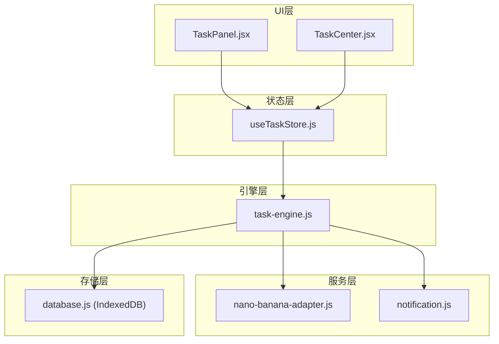
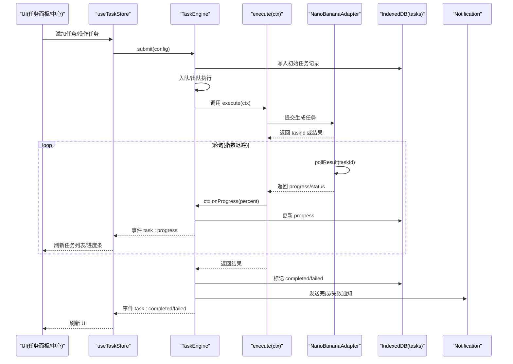
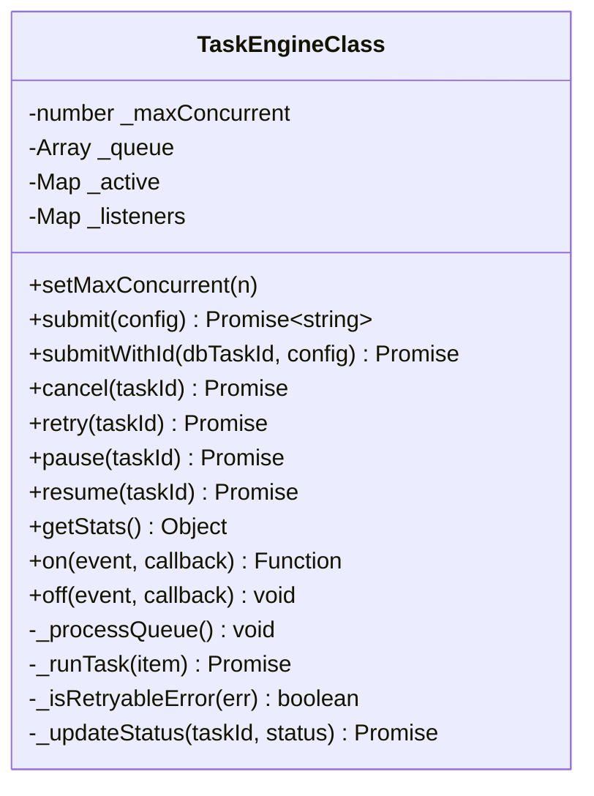
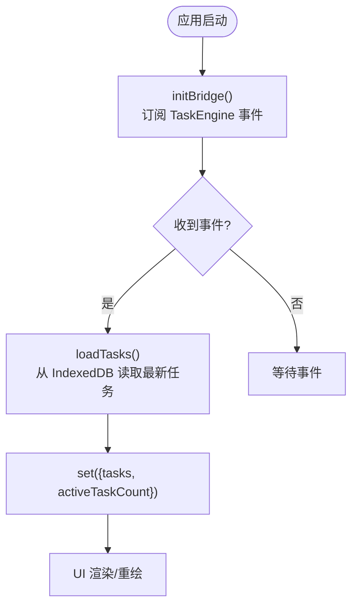
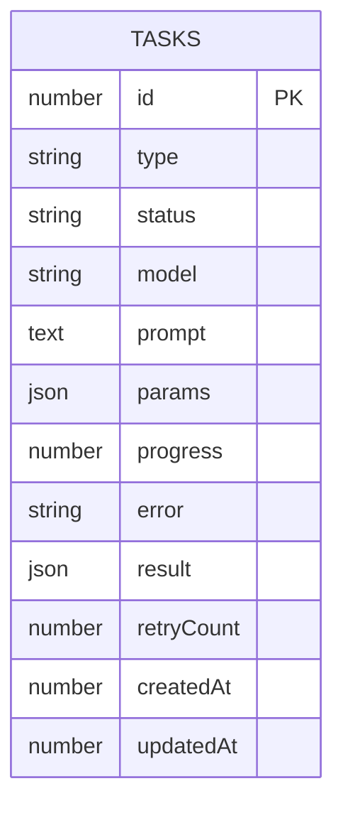
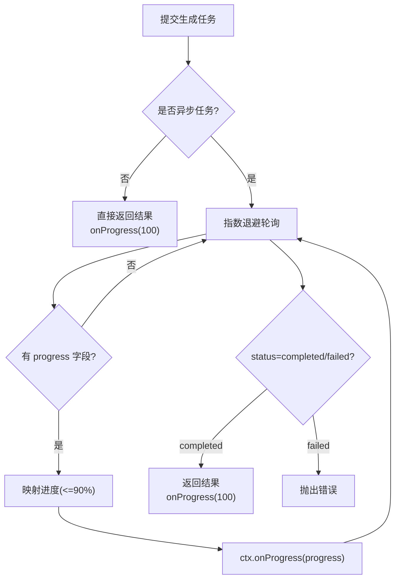
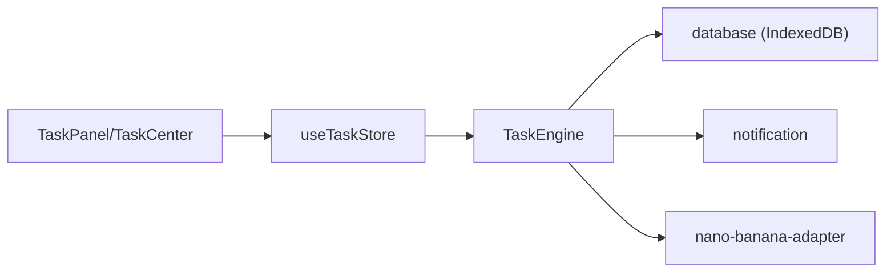

# 进度跟踪系统

<cite>
**本文引用的文件**
- [task-engine.js](file://app/src/services/task-engine.js)
- [useTaskStore.js](file://app/src/stores/useTaskStore.js)
- [database.js](file://app/src/db/database.js)
- [notification.js](file://app/src/services/notification.js)
- [nano-banana-adapter.js](file://app/src/services/api/nano-banana-adapter.js)
- [TaskPanel.jsx](file://app/src/components/TaskPanel.jsx)
- [TaskCenter.jsx](file://app/src/pages/TaskCenter.jsx)
</cite>

## 目录
1. [简介](#简介)
2. [项目结构](#项目结构)
3. [核心组件](#核心组件)
4. [架构总览](#架构总览)
5. [详细组件分析](#详细组件分析)
6. [依赖关系分析](#依赖关系分析)
7. [性能与优化](#性能与优化)
8. [故障排查指南](#故障排查指南)
9. [结论](#结论)
10. [附录：复杂场景实现示例](#附录复杂场景实现示例)

## 简介
本文件面向 AI Image Studio 的“进度跟踪系统”，系统性阐述任务进度更新的机制、数据持久化策略、实时更新与事件通知、长时任务的轮询与增量更新优化，以及 UI 组件的数据绑定与用户体验优化。文档同时提供分块上传、批量处理、多步骤任务的实现思路与参考路径，帮助读者快速落地复杂的进度跟踪场景。

## 项目结构
与进度跟踪相关的代码主要分布在以下模块：
- 任务调度与执行：services/task-engine.js
- 状态桥接与 UI 驱动：stores/useTaskStore.js
- 持久化存储（IndexedDB）：db/database.js
- 浏览器通知：services/notification.js
- 模型适配器（异步任务 + 轮询）：services/api/nano-banana-adapter.js
- 进度展示 UI：components/TaskPanel.jsx, pages/TaskCenter.jsx

图表来源
- [task-engine.js:1-319](file://app/src/services/task-engine.js#L1-L319)
- [useTaskStore.js:1-173](file://app/src/stores/useTaskStore.js#L1-L173)
- [database.js:1-339](file://app/src/db/database.js#L1-L339)
- [notification.js:1-113](file://app/src/services/notification.js#L1-L113)
- [nano-banana-adapter.js:1-265](file://app/src/services/api/nano-banana-adapter.js#L1-L265)
- [TaskPanel.jsx:1-538](file://app/src/components/TaskPanel.jsx#L1-L538)
- [TaskCenter.jsx:1-218](file://app/src/pages/TaskCenter.jsx#L1-L218)

章节来源
- [task-engine.js:1-319](file://app/src/services/task-engine.js#L1-L319)
- [useTaskStore.js:1-173](file://app/src/stores/useTaskStore.js#L1-L173)
- [database.js:1-339](file://app/src/db/database.js#L1-L339)
- [notification.js:1-113](file://app/src/services/notification.js#L1-L113)
- [nano-banana-adapter.js:1-265](file://app/src/services/api/nano-banana-adapter.js#L1-L265)
- [TaskPanel.jsx:1-538](file://app/src/components/TaskPanel.jsx#L1-L538)
- [TaskCenter.jsx:1-218](file://app/src/pages/TaskCenter.jsx#L1-L218)

## 核心组件
- TaskEngine：后台任务调度器，负责并发控制、FIFO 队列、重试、取消/暂停/恢复、事件发射、进度上报与持久化。
- useTaskStore：Zustand 状态管理，桥接 TaskEngine 事件到前端状态，提供加载、增删改查、统计等动作。
- database：基于 Dexie 的 IndexedDB 封装，定义 tasks 表结构与查询接口。
- notification：浏览器通知封装，在任务完成或失败时推送系统通知。
- nano-banana-adapter：模型适配层，支持提交异步任务并轮询结果，内部使用指数退避与超时控制。
- TaskPanel / TaskCenter：进度条与任务列表 UI，按状态分组显示，支持操作与实时刷新。

章节来源
- [task-engine.js:1-319](file://app/src/services/task-engine.js#L1-L319)
- [useTaskStore.js:1-173](file://app/src/stores/useTaskStore.js#L1-L173)
- [database.js:1-339](file://app/src/db/database.js#L1-L339)
- [notification.js:1-113](file://app/src/services/notification.js#L1-L113)
- [nano-banana-adapter.js:1-265](file://app/src/services/api/nano-banana-adapter.js#L1-L265)
- [TaskPanel.jsx:1-538](file://app/src/components/TaskPanel.jsx#L1-L538)
- [TaskCenter.jsx:1-218](file://app/src/pages/TaskCenter.jsx#L1-L218)

## 架构总览
下图展示了从 UI 触发到任务执行、进度上报、持久化与通知的全链路流程。

图表来源
- [task-engine.js:222-297](file://app/src/services/task-engine.js#L222-L297)
- [useTaskStore.js:39-64](file://app/src/stores/useTaskStore.js#L39-L64)
- [nano-banana-adapter.js:157-193](file://app/src/services/api/nano-banana-adapter.js#L157-L193)
- [database.js:235-274](file://app/src/db/database.js#L235-L274)
- [notification.js:78-103](file://app/src/services/notification.js#L78-L103)

## 详细组件分析

### 任务引擎 TaskEngine
- 并发与队列：维护最大并发数与 FIFO 队列，空闲时自动拉取任务执行。
- 生命周期与状态机：queued -> running -> completed/failed/cancelled/paused；支持失败重试与重新排队。
- 事件总线：对外暴露 on/off/_emit，统一派发 task:queued/started/progress/completed/failed/cancelled/paused/retry 等事件。
- 进度上报：通过 ctx.onProgress(percent) 将百分比持久化并广播事件。
- 错误与重试：对可重试错误进行指数退避重试，超过上限则标记失败。
- 取消/暂停/恢复：通过 AbortController 中断运行中任务；暂停/恢复仅影响队列与状态。

图表来源
- [task-engine.js:33-314](file://app/src/services/task-engine.js#L33-L314)

章节来源
- [task-engine.js:1-319](file://app/src/services/task-engine.js#L1-L319)

### 状态桥接 useTaskStore
- 职责：集中管理任务列表与活跃计数；初始化事件桥接，监听 TaskEngine 所有关键事件后统一刷新任务列表。
- 动作：addTask/updateTask/removeTask/retryTask/cancelTask/pauseTask/resumeTask/getTaskStats/clearCompleted。
- 一致性：每次写操作后都会 loadTasks 保证 UI 与数据库一致。

图表来源
- [useTaskStore.js:39-64](file://app/src/stores/useTaskStore.js#L39-L64)
- [useTaskStore.js:23-33](file://app/src/stores/useTaskStore.js#L23-L33)

章节来源
- [useTaskStore.js:1-173](file://app/src/stores/useTaskStore.js#L1-L173)

### 持久化 database（tasks 表）
- 表结构：包含 id、type、status、model、prompt、params、progress、error、result、retryCount、createdAt、updatedAt 等字段。
- 索引：按 createdAt 倒序；支持按 status 过滤；复合索引用于排序与分页。
- 常用接口：addTask/getTasks/getTask/updateTask/deleteTask/getTaskStats。

图表来源
- [database.js:22-31](file://app/src/db/database.js#L22-L31)
- [database.js:235-274](file://app/src/db/database.js#L235-L274)

章节来源
- [database.js:1-339](file://app/src/db/database.js#L1-L339)

### 通知服务 notification
- 能力：请求权限、发送系统通知；在任务完成/失败时推送消息。
- 集成点：TaskEngine 在任务完成或失败时调用通知函数。

章节来源
- [notification.js:1-113](file://app/src/services/notification.js#L1-L113)
- [task-engine.js:254-291](file://app/src/services/task-engine.js#L254-L291)

### 模型适配器 nano-banana-adapter（轮询与进度）
- 提交与轮询：先提交任务，若为异步任务则进入轮询循环；支持指数退避与总超时。
- 进度映射：当上游返回 progress 字段时，按比例映射至 0-90%；完成时置 100%。
- 取消支持：轮询期间检查 AbortSignal，支持外部取消。

图表来源
- [nano-banana-adapter.js:52-76](file://app/src/services/api/nano-banana-adapter.js#L52-L76)
- [nano-banana-adapter.js:157-193](file://app/src/services/api/nano-banana-adapter.js#L157-L193)
- [nano-banana-adapter.js:199-217](file://app/src/services/api/nano-banana-adapter.js#L199-L217)

章节来源
- [nano-banana-adapter.js:1-265](file://app/src/services/api/nano-banana-adapter.js#L1-L265)

### UI 组件 TaskPanel / TaskCenter（进度条与交互）
- 分组展示：进行中/排队中/已完成/失败/已暂停，支持折叠展开。
- 进度条：根据任务 progress 字段渲染宽度，带过渡动画提升体验。
- 交互：暂停/继续/取消/重试/移除/清空已完成，均通过 store 动作触发。
- 实时性：store 监听 engine 事件后刷新任务列表，UI 自动更新。

章节来源
- [TaskPanel.jsx:1-538](file://app/src/components/TaskPanel.jsx#L1-L538)
- [TaskCenter.jsx:1-218](file://app/src/pages/TaskCenter.jsx#L1-L218)

## 依赖关系分析
- TaskEngine 依赖 database 进行持久化，依赖 notification 进行通知，依赖 adapter 进行具体业务执行。
- useTaskStore 依赖 TaskEngine 的事件与 database 的读写，作为 UI 与引擎之间的桥梁。
- UI 组件仅依赖 useTaskStore，不直接访问数据库或引擎，降低耦合度。

图表来源
- [task-engine.js:1-319](file://app/src/services/task-engine.js#L1-L319)
- [useTaskStore.js:1-173](file://app/src/stores/useTaskStore.js#L1-L173)
- [database.js:1-339](file://app/src/db/database.js#L1-L339)
- [notification.js:1-113](file://app/src/services/notification.js#L1-L113)
- [nano-banana-adapter.js:1-265](file://app/src/services/api/nano-banana-adapter.js#L1-L265)
- [TaskPanel.jsx:1-538](file://app/src/components/TaskPanel.jsx#L1-L538)
- [TaskCenter.jsx:1-218](file://app/src/pages/TaskCenter.jsx#L1-L218)

章节来源
- [task-engine.js:1-319](file://app/src/services/task-engine.js#L1-L319)
- [useTaskStore.js:1-173](file://app/src/stores/useTaskStore.js#L1-L173)
- [database.js:1-339](file://app/src/db/database.js#L1-L339)
- [notification.js:1-113](file://app/src/services/notification.js#L1-L113)
- [nano-banana-adapter.js:1-265](file://app/src/services/api/nano-banana-adapter.js#L1-L265)
- [TaskPanel.jsx:1-538](file://app/src/components/TaskPanel.jsx#L1-L538)
- [TaskCenter.jsx:1-218](file://app/src/pages/TaskCenter.jsx#L1-L218)

## 性能与优化
- 事件驱动刷新：通过 TaskEngine 事件驱动 useTaskStore 刷新，避免轮询带来的额外开销。
- 进度增量更新：engine 仅在 onProgress 调用时更新 progress 字段，减少不必要的状态变更。
- 指数退避轮询：适配器采用指数退避与最大间隔限制，降低网络压力。
- 并发控制：默认最大并发 3，可按需调整以平衡吞吐与资源占用。
- UI 平滑过渡：进度条使用 CSS transition，提升视觉流畅度。

[本节为通用指导，无需列出具体文件]

## 故障排查指南
- 任务未更新：确认 initBridge 是否调用；检查 TaskEngine 事件是否正常派发；查看 console 日志中的事件输出。
- 进度不变化：检查 execute 中是否正确调用 ctx.onProgress；确认 adapter 是否返回 progress 字段。
- 任务失败：查看 database 中 error 字段；检查重试次数与可重试条件；关注通知内容。
- 取消无效：确认任务是否在 active 集合中；检查 AbortController 信号是否被正确传递到 adapter。

章节来源
- [useTaskStore.js:39-64](file://app/src/stores/useTaskStore.js#L39-L64)
- [task-engine.js:259-297](file://app/src/services/task-engine.js#L259-L297)
- [nano-banana-adapter.js:52-76](file://app/src/services/api/nano-banana-adapter.js#L52-L76)

## 结论
AI Image Studio 的进度跟踪系统以 TaskEngine 为核心，结合 Zustand 状态管理与 IndexedDB 持久化，实现了高内聚、低耦合的任务调度与进度上报机制。通过事件驱动与指数退避轮询，系统在稳定性与性能之间取得良好平衡。UI 层通过 store 提供的统一接口，实现了直观的进度展示与丰富的用户交互。

[本节为总结，无需列出具体文件]

## 附录：复杂场景实现示例

### 分块上传（大文件分片）
- 思路：将大文件切分为多个 chunk，逐个上传；每上传一个 chunk 调用 ctx.onProgress 累计进度。
- 关键点：
  - 计算总块数与当前进度比例。
  - 使用 AbortController 支持中途取消。
  - 失败重试与断点续传（可选）。
- 参考路径：
  - 进度上报入口：[task-engine.js:233-236](file://app/src/services/task-engine.js#L233-L236)
  - 状态持久化：[database.js:257-259](file://app/src/db/database.js#L257-L259)
  - UI 展示：[TaskPanel.jsx:222-242](file://app/src/components/TaskPanel.jsx#L222-L242), [TaskCenter.jsx:113-115](file://app/src/pages/TaskCenter.jsx#L113-L115)

### 批量处理（多任务并行）
- 思路：创建多个子任务，每个子任务独立进度；外层聚合进度 = 各子任务进度加权平均。
- 关键点：
  - 使用 TaskEngine.submit 多次提交子任务。
  - 监听 task:progress 事件，汇总计算整体进度。
  - 全部完成后设置整体进度为 100%。
- 参考路径：
  - 任务提交与事件：[task-engine.js:57-81](file://app/src/services/task-engine.js#L57-L81), [task-engine.js:203-211](file://app/src/services/task-engine.js#L203-L211)
  - 状态刷新：[useTaskStore.js:39-64](file://app/src/stores/useTaskStore.js#L39-L64)

### 多步骤任务（流水线）
- 思路：将任务拆分为若干步骤（如预处理、推理、后处理），每步完成调用 ctx.onProgress 推进进度。
- 关键点：
  - 步骤权重分配（例如每步占 30%、40%、30%）。
  - 步骤间异常处理与回滚（可选）。
  - 最终结果合并与持久化。
- 参考路径：
  - 进度上报与持久化：[task-engine.js:233-236](file://app/src/services/task-engine.js#L233-L236), [database.js:257-259](file://app/src/db/database.js#L257-L259)
  - UI 展示：[TaskPanel.jsx:222-242](file://app/src/components/TaskPanel.jsx#L222-L242), [TaskCenter.jsx:113-115](file://app/src/pages/TaskCenter.jsx#L113-L115)

### 长时任务轮询与增量更新优化
- 思路：适配器内部使用指数退避轮询，逐步推进进度；上层通过 ctx.onProgress 增量更新。
- 关键点：
  - 合理设置初始间隔与最大间隔，避免频繁请求。
  - 支持取消与超时保护。
  - 将进度映射到 0-90%，完成时置 100%。
- 参考路径：
  - 轮询与进度映射：[nano-banana-adapter.js:52-76](file://app/src/services/api/nano-banana-adapter.js#L52-L76), [nano-banana-adapter.js:157-193](file://app/src/services/api/nano-banana-adapter.js#L157-L193)
  - 进度持久化与事件：[task-engine.js:233-236](file://app/src/services/task-engine.js#L233-L236)