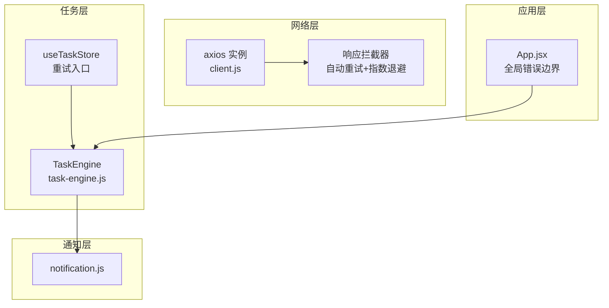
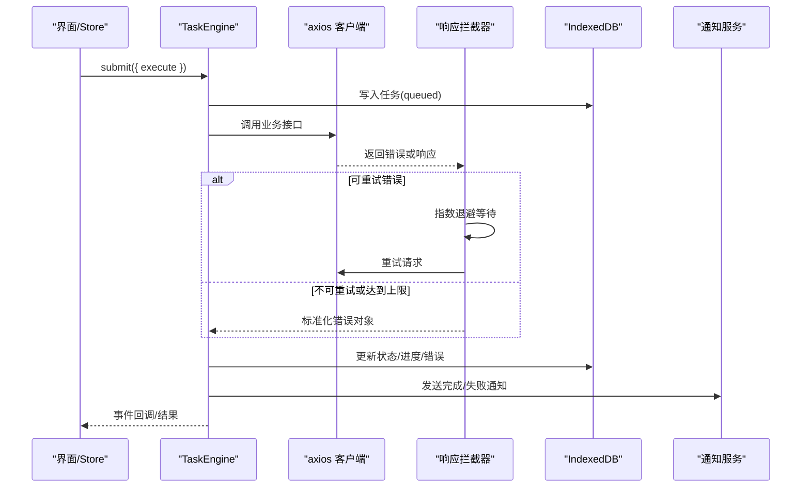
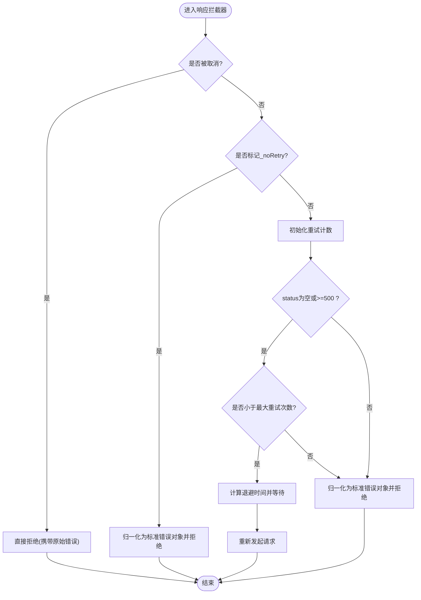
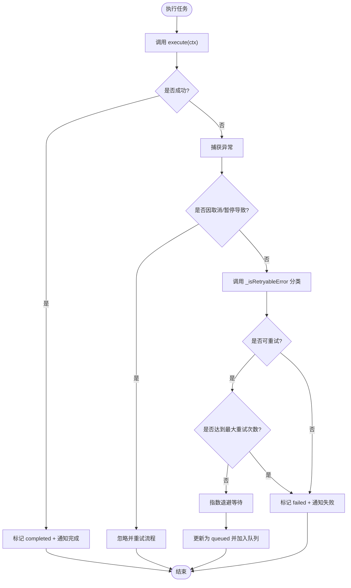
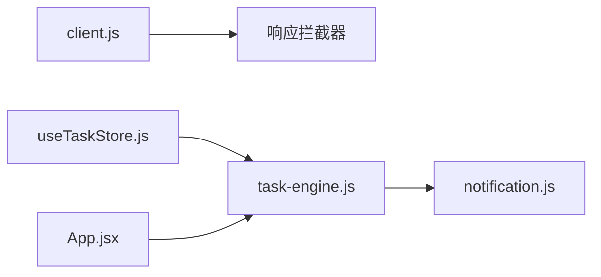

# 错误处理与重试机制

<cite>
**本文引用的文件**   
- [app/src/services/api/client.js](file://app/src/services/api/client.js)
- [app/src/services/task-engine.js](file://app/src/services/task-engine.js)
- [app/src/services/notification.js](file://app/src/services/notification.js)
- [app/src/stores/useTaskStore.js](file://app/src/stores/useTaskStore.js)
- [app/src/App.jsx](file://app/src/App.jsx)
</cite>

## 目录
1. [简介](#简介)
2. [项目结构](#项目结构)
3. [核心组件](#核心组件)
4. [架构总览](#架构总览)
5. [详细组件分析](#详细组件分析)
6. [依赖关系分析](#依赖关系分析)
7. [性能考量](#性能考量)
8. [故障排查指南](#故障排查指南)
9. [结论](#结论)
10. [附录：自定义重试与恢复示例路径](#附录自定义重试与恢复示例路径)

## 简介
本文件面向 AI Image Studio 的错误处理与重试机制，系统性说明以下要点：
- 指数退避重试算法的实现原理与配置参数
- 可重试错误的判断逻辑（_isRetryableError）
- 错误分类策略与不同处理流程
- 重试次数限制、退避时间计算与失败后的降级处理
- 错误日志记录、用户反馈与故障恢复策略
- 如何扩展实现自定义的重试逻辑和错误恢复机制

## 项目结构
本项目在“网络层”和“任务调度层”分别实现了错误处理与重试能力：
- 网络层（axios 拦截器）：对 HTTP 请求进行统一错误归一化、自动重试与指数退避
- 任务层（TaskEngine）：对后台任务执行过程中的异常进行分类、重试与状态机流转
- 通知层：通过浏览器通知 API 向用户反馈任务完成/失败
- 存储层（store）：提供重试入口与兜底降级

图表来源
- [app/src/services/api/client.js:1-146](file://app/src/services/api/client.js#L1-L146)
- [app/src/services/task-engine.js:1-319](file://app/src/services/task-engine.js#L1-L319)
- [app/src/services/notification.js:1-113](file://app/src/services/notification.js#L1-L113)
- [app/src/stores/useTaskStore.js:79-131](file://app/src/stores/useTaskStore.js#L79-L131)
- [app/src/App.jsx:26-62](file://app/src/App.jsx#L26-L62)

章节来源
- [app/src/services/api/client.js:1-146](file://app/src/services/api/client.js#L1-L146)
- [app/src/services/task-engine.js:1-319](file://app/src/services/task-engine.js#L1-L319)
- [app/src/services/notification.js:1-113](file://app/src/services/notification.js#L1-L113)
- [app/src/stores/useTaskStore.js:79-131](file://app/src/stores/useTaskStore.js#L79-L131)
- [app/src/App.jsx:26-62](file://app/src/App.jsx#L26-L62)

## 核心组件
- axios 客户端与拦截器：负责统一超时、取消、错误归一化、自动重试与指数退避
- TaskEngine：负责任务生命周期、并发控制、状态机、重试判定与通知
- Notification：封装浏览器通知，用于成功/失败提示
- useTaskStore：提供重试入口，并在调用失败时做本地降级

章节来源
- [app/src/services/api/client.js:1-146](file://app/src/services/api/client.js#L1-L146)
- [app/src/services/task-engine.js:1-319](file://app/src/services/task-engine.js#L1-L319)
- [app/src/services/notification.js:1-113](file://app/src/services/notification.js#L1-L113)
- [app/src/stores/useTaskStore.js:79-131](file://app/src/stores/useTaskStore.js#L79-L131)

## 架构总览
下图展示一次生成任务的端到端错误处理与重试路径。

图表来源
- [app/src/services/task-engine.js:222-297](file://app/src/services/task-engine.js#L222-L297)
- [app/src/services/api/client.js:49-85](file://app/src/services/api/client.js#L49-L85)
- [app/src/services/notification.js:78-103](file://app/src/services/notification.js#L78-L103)

## 详细组件分析

### 网络层：axios 客户端与响应拦截器
- 默认超时：60s；长耗时接口使用独立实例（5分钟）
- 取消支持：AbortController 信号透传
- 自动重试：
  - 触发条件：无响应状态码或状态码≥500，且未达到最大重试次数
  - 最大重试次数：3次
  - 初始退避：1000ms
  - 退避公式：INITIAL_BACKOFF_MS × 2^(retryCount-1)
- 外部重试开关：当传入 _noRetry=true 时，跳过 axios 级重试，由上层自行处理
- 错误归一化：将 response.data.message / message 等字段统一为 { message, status, data, originalError }

图表来源
- [app/src/services/api/client.js:49-85](file://app/src/services/api/client.js#L49-L85)

章节来源
- [app/src/services/api/client.js:1-146](file://app/src/services/api/client.js#L1-L146)

### 任务层：TaskEngine 错误分类与重试
- 状态机：queued → running → completed/failed/cancelled/paused；failed 允许回退到 queued 进行重试
- 重试判定方法 _isRetryableError：
  - 若错误包含 status 且 ≥500，视为可重试
  - 若无 status 且消息中包含 “Network”，视为可重试
  - 其他情况不可重试
- 重试策略：
  - 最大重试次数：3次
  - 退避时间：1000 × 2^(retryCount-1) ms
  - 每次重试前更新任务状态为 queued，并记录错误信息
- 失败降级：
  - 超过重试上限或不可重试错误：标记 failed，持久化错误信息，触发失败通知
- 并发与队列：
  - 最大并发数可配置（默认 3）
  - FIFO 队列驱动执行

图表来源
- [app/src/services/task-engine.js:222-297](file://app/src/services/task-engine.js#L222-L297)
- [app/src/services/task-engine.js:299-305](file://app/src/services/task-engine.js#L299-L305)

章节来源
- [app/src/services/task-engine.js:1-319](file://app/src/services/task-engine.js#L1-L319)

### 通知与用户反馈
- 成功通知：包含模型名称、图片数量、提示词预览
- 失败通知：包含模型名称与错误信息摘要
- 权限管理：启动时请求权限，避免重复弹窗

章节来源
- [app/src/services/notification.js:1-113](file://app/src/services/notification.js#L1-L113)

### Store 层：重试入口与降级
- 提供 retryTask(taskId) 入口，内部调用 TaskEngine.retry
- 若引擎重试失败，则回退为本地更新任务状态（重置错误、进度、重试计数），保证 UI 可继续操作

章节来源
- [app/src/stores/useTaskStore.js:79-131](file://app/src/stores/useTaskStore.js#L79-L131)

### 应用层：全局错误边界
- 捕获 React 渲染期错误，提供“重新加载”按钮以恢复应用

章节来源
- [app/src/App.jsx:26-62](file://app/src/App.jsx#L26-L62)

## 依赖关系分析
- client.js 定义两个 axios 实例并挂载相同的响应拦截器，形成统一的错误处理与重试基线
- task-engine.js 作为单例，集中管理任务执行、重试与通知
- notification.js 被 task-engine.js 调用，提供用户可见的反馈
- useTaskStore.js 暴露重试入口，并对引擎调用失败做兜底

图表来源
- [app/src/services/api/client.js:1-146](file://app/src/services/api/client.js#L1-L146)
- [app/src/services/task-engine.js:1-319](file://app/src/services/task-engine.js#L1-L319)
- [app/src/services/notification.js:1-113](file://app/src/services/notification.js#L1-L113)
- [app/src/stores/useTaskStore.js:79-131](file://app/src/stores/useTaskStore.js#L79-L131)
- [app/src/App.jsx:26-62](file://app/src/App.jsx#L26-L62)

## 性能考量
- 指数退避有效降低瞬时拥塞导致的连续失败风暴
- 最大重试次数限制避免无限重试造成的资源浪费
- 长耗时接口使用独立 axios 实例，避免短超时误杀
- 建议结合业务指标动态调整 MAX_RETRIES 与 INITIAL_BACKOFF_MS

## 故障排查指南
- 确认是否命中可重试条件：
  - 检查错误是否包含 status 且 ≥500
  - 检查是否为网络错误（message 包含 “Network”）
- 查看重试次数与退避时间是否符合预期
- 观察通知是否正确发出（成功/失败）
- 若 store 层重试失败，检查本地降级是否生效

章节来源
- [app/src/services/task-engine.js:299-305](file://app/src/services/task-engine.js#L299-L305)
- [app/src/services/api/client.js:49-85](file://app/src/services/api/client.js#L49-L85)
- [app/src/services/notification.js:78-103](file://app/src/services/notification.js#L78-L103)
- [app/src/stores/useTaskStore.js:109-124](file://app/src/stores/useTaskStore.js#L109-L124)

## 结论
AI Image Studio 在网络层与任务层均实现了稳健的错误处理与指数退避重试机制。通过明确的可重试错误判定、严格的次数限制与合理的退避策略，系统在保障用户体验的同时提升了鲁棒性。配合通知与降级策略，可在复杂网络环境下稳定运行。

## 附录：自定义重试与恢复示例路径
以下为可直接参考的代码片段路径，便于扩展自定义重试逻辑与恢复策略：
- 网络层自动重试与指数退避实现
  - [app/src/services/api/client.js:49-85](file://app/src/services/api/client.js#L49-L85)
- 任务层错误分类与重试判定
  - [app/src/services/task-engine.js:299-305](file://app/src/services/task-engine.js#L299-L305)
- 任务层重试流程与退避计算
  - [app/src/services/task-engine.js:269-282](file://app/src/services/task-engine.js#L269-L282)
- 任务层失败降级与通知
  - [app/src/services/task-engine.js:283-292](file://app/src/services/task-engine.js#L283-L292)
- Store 层重试入口与兜底
  - [app/src/stores/useTaskStore.js:109-124](file://app/src/stores/useTaskStore.js#L109-L124)
- 通知服务（成功/失败）
  - [app/src/services/notification.js:78-103](file://app/src/services/notification.js#L78-L103)
- 全局错误边界（应用恢复）
  - [app/src/App.jsx:26-62](file://app/src/App.jsx#L26-L62)