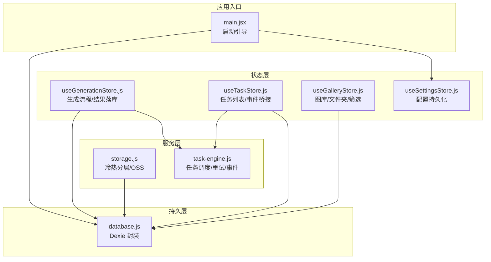
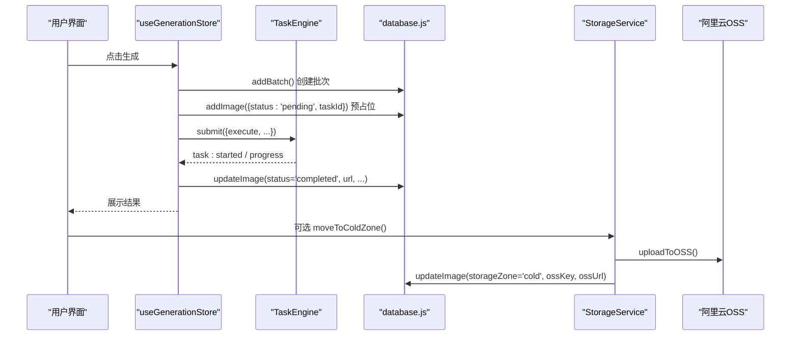
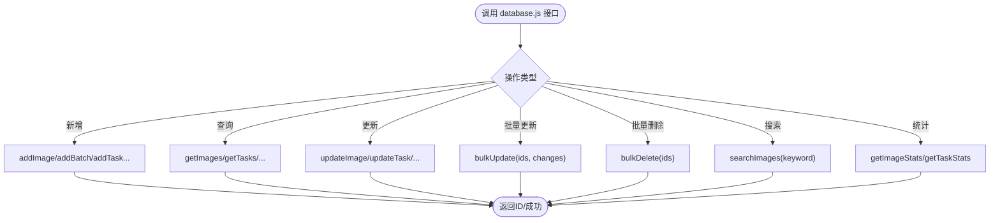
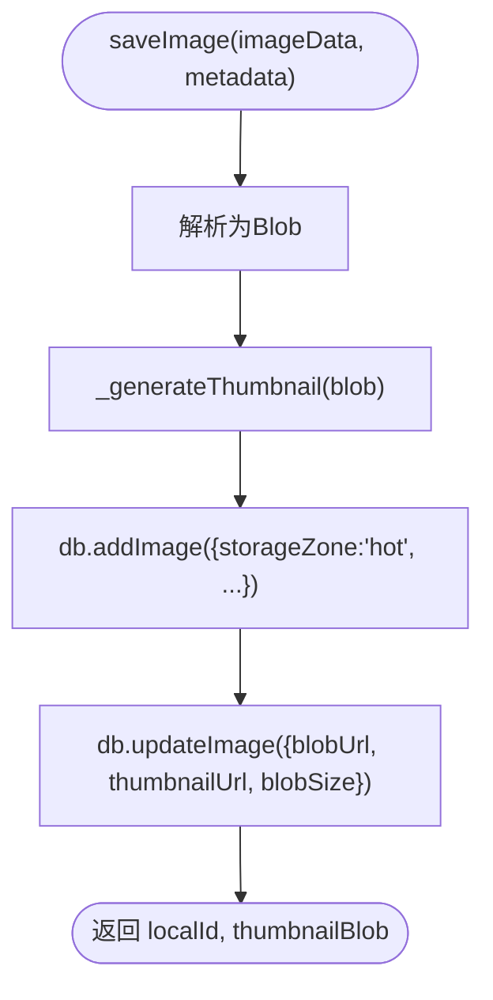
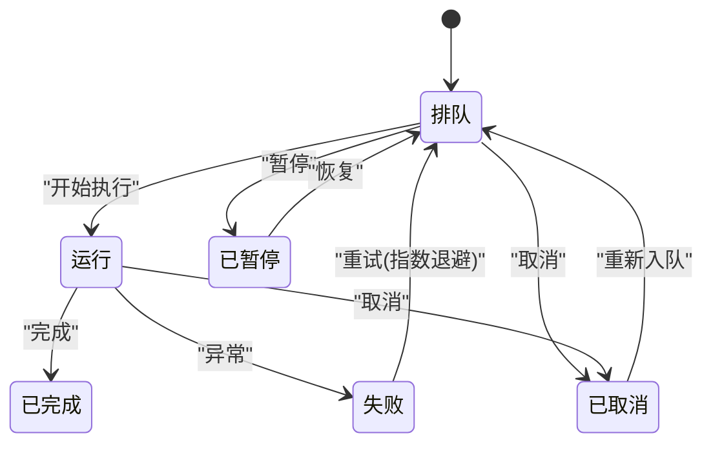
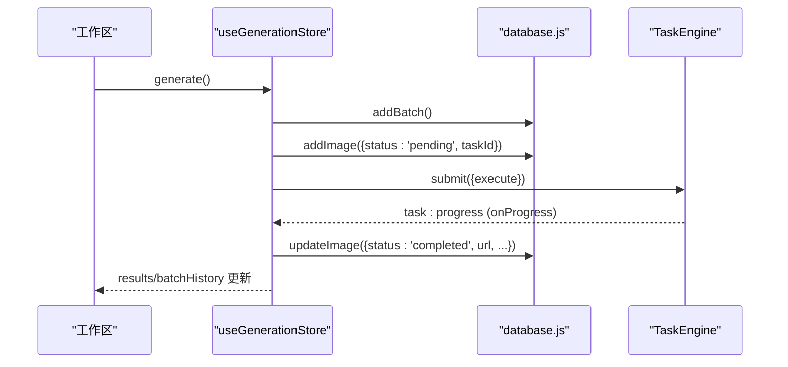
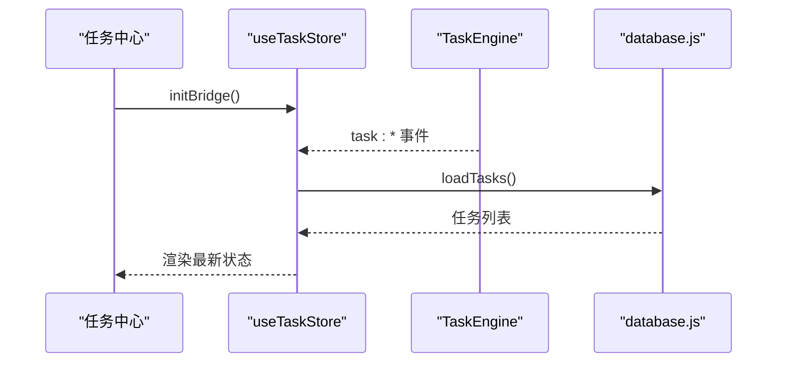
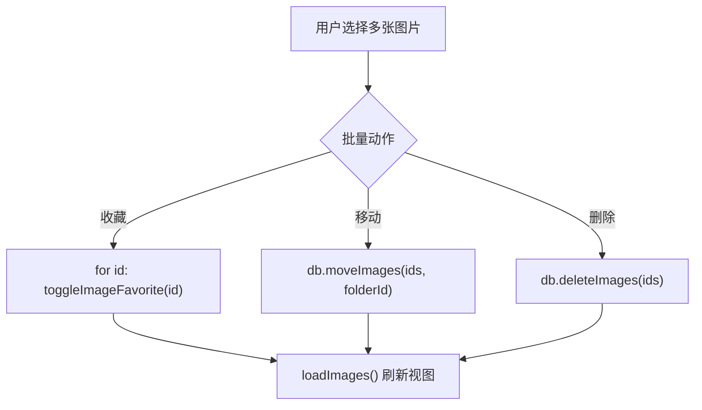
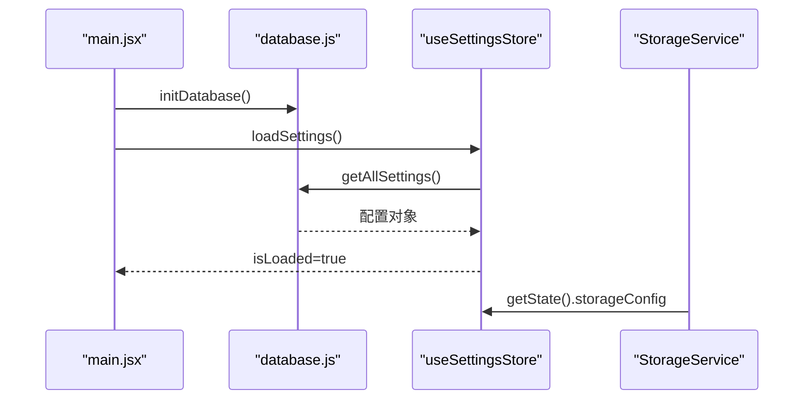
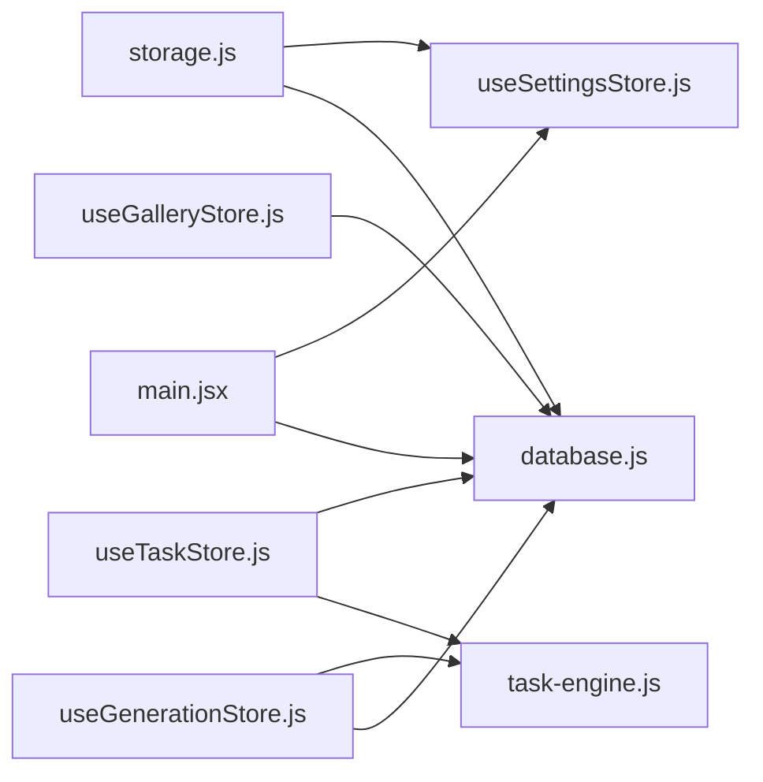

# 数据同步机制

<cite>
**本文引用的文件**   
- [README.md](file://README.md)
- [database.js](file://app/src/db/database.js)
- [storage.js](file://app/src/services/storage.js)
- [task-engine.js](file://app/src/services/task-engine.js)
- [useGenerationStore.js](file://app/src/stores/useGenerationStore.js)
- [useTaskStore.js](file://app/src/stores/useTaskStore.js)
- [useGalleryStore.js](file://app/src/stores/useGalleryStore.js)
- [useSettingsStore.js](file://app/src/stores/useSettingsStore.js)
- [main.jsx](file://app/src/main.jsx)
</cite>

## 目录
1. [简介](#简介)
2. [项目结构](#项目结构)
3. [核心组件](#核心组件)
4. [架构总览](#架构总览)
5. [详细组件分析](#详细组件分析)
6. [依赖关系分析](#依赖关系分析)
7. [性能考虑](#性能考虑)
8. [故障排查指南](#故障排查指南)
9. [结论](#结论)
10. [附录](#附录)

## 简介
本文件面向 AI Image Studio 的数据同步机制，围绕“状态与数据库的同步策略、实时数据更新机制、冲突解决算法、脏检查机制、增量更新与批量操作优化、本地存储与远程数据的同步策略、离线支持与一致性保证”展开。文档提供数据同步流程图与状态转换图，并给出性能优化、错误恢复与调试方法建议。

## 项目结构
本项目采用分层组织：
- 持久层：基于 Dexie（IndexedDB）的数据库封装，提供图像、批次、会话、文件夹、任务、设置等表的操作。
- 服务层：存储服务（冷热分层、缩略图生成、OSS 上传/下载）、任务引擎（并发控制、重试、事件驱动）。
- 状态层：Zustand Store（工作区生成、任务中心、画廊管理、设置），负责 UI 状态与持久化桥接。
- 入口：应用启动时初始化数据库与设置，随后渲染 React 界面。

图表来源
- [main.jsx:1-31](file://app/src/main.jsx#L1-L31)
- [database.js:1-339](file://app/src/db/database.js#L1-L339)
- [storage.js:1-393](file://app/src/services/storage.js#L1-L393)
- [task-engine.js:1-319](file://app/src/services/task-engine.js#L1-L319)
- [useGenerationStore.js:1-360](file://app/src/stores/useGenerationStore.js#L1-L360)
- [useTaskStore.js:1-173](file://app/src/stores/useTaskStore.js#L1-L173)
- [useGalleryStore.js:1-204](file://app/src/stores/useGalleryStore.js#L1-L204)
- [useSettingsStore.js:1-162](file://app/src/stores/useSettingsStore.js#L1-L162)

章节来源
- [README.md:1-10](file://README.md#L1-L10)
- [main.jsx:1-31](file://app/src/main.jsx#L1-L31)

## 核心组件
- 数据库层（database.js）
  - 定义 images、batches、sessions、folders、tasks、settings、casePackages 等表及索引。
  - 提供增删改查、批量更新、搜索、统计等 API。
- 存储服务（storage.js）
  - 热区：IndexedDB 中保存 Blob URL 与元信息；冷区：阿里云 OSS 长期存储。
  - 缩略图生成、冷热迁移、容量阈值判断、连接测试。
- 任务引擎（task-engine.js）
  - 最大并发、FIFO 队列、指数退避重试、状态机（queued/running/completed/failed/cancelled/paused）。
  - 事件总线（task:*）用于 UI 实时更新。
- 状态层（stores）
  - useGenerationStore：编排生成流程，提交任务，持久化结果与批次。
  - useTaskStore：订阅任务事件，刷新任务列表，提供重试/取消/暂停/恢复等操作。
  - useGalleryStore：图库浏览、筛选、批量操作（收藏/移动/删除）。
  - useSettingsStore：模型/存储/扩写/通用配置加载与持久化。

章节来源
- [database.js:1-339](file://app/src/db/database.js#L1-L339)
- [storage.js:1-393](file://app/src/services/storage.js#L1-L393)
- [task-engine.js:1-319](file://app/src/services/task-engine.js#L1-L319)
- [useGenerationStore.js:1-360](file://app/src/stores/useGenerationStore.js#L1-L360)
- [useTaskStore.js:1-173](file://app/src/stores/useTaskStore.js#L1-L173)
- [useGalleryStore.js:1-204](file://app/src/stores/useGalleryStore.js#L1-L204)
- [useSettingsStore.js:1-162](file://app/src/stores/useSettingsStore.js#L1-L162)

## 架构总览
数据同步的关键路径包括：
- 生成流程：UI 触发 → 创建批次与待处理记录 → 提交任务 → 适配器执行 → 进度上报 → 结果落库 → 状态更新。
- 存储分层：新图写入热区（IndexedDB），超过阈值后按时间顺序迁移到冷区（OSS）。
- 任务状态：通过事件驱动将任务状态变更同步至 UI。
- 设置与配置：应用启动时加载设置，运行时可更新并持久化。

图表来源
- [useGenerationStore.js:112-290](file://app/src/stores/useGenerationStore.js#L112-L290)
- [task-engine.js:57-297](file://app/src/services/task-engine.js#L57-L297)
- [database.js:43-138](file://app/src/db/database.js#L43-L138)
- [storage.js:204-244](file://app/src/services/storage.js#L204-L244)

## 详细组件分析

### 数据库层（持久化与索引）
- 表结构与索引
  - images：支持按 folderId+createdAt 复合索引，便于分页与排序。
  - batches/sessions/folders/tasks/settings/casePackages：各自主键与常用查询字段。
- 关键操作
  - 批量更新：moveImages 使用 bulkUpdate。
  - 批量删除：deleteImages 使用 bulkDelete。
  - 搜索：searchImages 客户端过滤关键词。
  - 统计：getImageStats/getTaskStats 聚合计数。
- 初始化
  - initDatabase 在应用启动时打开数据库。

图表来源
- [database.js:43-138](file://app/src/db/database.js#L43-L138)
- [database.js:144-171](file://app/src/db/database.js#L144-L171)
- [database.js:235-274](file://app/src/db/database.js#L235-L274)
- [database.js:280-295](file://app/src/db/database.js#L280-L295)
- [database.js:327-336](file://app/src/db/database.js#L327-L336)

章节来源
- [database.js:1-339](file://app/src/db/database.js#L1-L339)

### 存储服务（冷热分层与缩略图）
- 热区（IndexedDB）
  - saveImage：接收 Blob/URL，生成缩略图，写入元信息与 Blob URL。
  - getImage/getThumbnail：从 Blob URL 拉取二进制。
  - deleteImage：释放 Object URL 并删除记录。
- 冷区（OSS）
  - uploadToOSS/downloadFromOSS：基于 ali-oss SDK 上传/下载。
  - moveToColdZone/moveToHotZone：冷热迁移，更新 storageZone 与地址字段。
  - checkAndMigrate：根据阈值（来自设置）自动迁移最旧图片。
- 缩略图
  - Canvas 生成，限制最大维度，降低预览开销。

图表来源
- [storage.js:51-80](file://app/src/services/storage.js#L51-L80)
- [storage.js:323-347](file://app/src/services/storage.js#L323-L347)

章节来源
- [storage.js:1-393](file://app/src/services/storage.js#L1-L393)

### 任务引擎（并发、重试与事件）
- 并发与队列
  - setMaxConcurrent 控制并行度；_processQueue 循环出队执行。
- 状态机
  - queued → running → completed/failed/cancelled；failed 可重试；paused 可恢复。
- 重试策略
  - _isRetryableError 判定网络/5xx 错误；指数退避（默认最多 3 次）。
- 事件总线
  - on/off/_emit 分发 task:queued/started/progress/completed/failed/cancelled/paused/retry。
- 持久化
  - 所有状态变更均通过 db.updateTask 落库，确保刷新后可恢复。

图表来源
- [task-engine.js:18-31](file://app/src/services/task-engine.js#L18-L31)
- [task-engine.js:215-297](file://app/src/services/task-engine.js#L215-L297)

章节来源
- [task-engine.js:1-319](file://app/src/services/task-engine.js#L1-L319)

### 生成流程（状态与数据库同步）
- 步骤概览
  - 创建批次（addBatch）。
  - 预占位记录（addImage，status=pending，taskId）。
  - 提交任务（TaskEngine.submit），适配器执行期间通过 onProgress 上报进度。
  - 完成后更新记录（updateImage，status=completed，url/thumbnailUrl/尺寸等）。
  - 更新 UI 状态（results/batchHistory/isGenerating）。
- 错误处理
  - 若适配器抛错且存在 pending 记录，则标记为 failed 并携带错误信息。

图表来源
- [useGenerationStore.js:112-290](file://app/src/stores/useGenerationStore.js#L112-L290)
- [task-engine.js:222-297](file://app/src/services/task-engine.js#L222-L297)
- [database.js:43-138](file://app/src/db/database.js#L43-L138)

章节来源
- [useGenerationStore.js:1-360](file://app/src/stores/useGenerationStore.js#L1-L360)

### 任务中心（实时数据更新）
- 事件桥接
  - initBridge 监听 TaskEngine 的所有事件，统一刷新任务列表。
- 操作封装
  - retryTask/cancelTask/pauseTask/resumeTask 调用引擎并刷新列表。
- 统计
  - getTaskStats 直接读取数据库聚合结果。

图表来源
- [useTaskStore.js:39-64](file://app/src/stores/useTaskStore.js#L39-L64)
- [useTaskStore.js:23-33](file://app/src/stores/useTaskStore.js#L23-L33)
- [task-engine.js:191-211](file://app/src/services/task-engine.js#L191-L211)

章节来源
- [useTaskStore.js:1-173](file://app/src/stores/useTaskStore.js#L1-L173)

### 图库与批量操作（增量更新与批量优化）
- 加载与筛选
  - loadImages 支持 folderId/model/favorite/dateRange 等条件；keyword 搜索走 searchImages。
- 批量操作
  - batchAction 支持 favorite/move/delete，优先使用 bulkUpdate/bulkDelete 提升性能。
- 选择与交互
  - selectImage/clearSelection 维护选中集合，配合 UI 批量动作。

图表来源
- [useGalleryStore.js:179-202](file://app/src/stores/useGalleryStore.js#L179-L202)
- [database.js:94-127](file://app/src/db/database.js#L94-L127)
- [database.js:99-110](file://app/src/db/database.js#L99-L110)

章节来源
- [useGalleryStore.js:1-204](file://app/src/stores/useGalleryStore.js#L1-L204)

### 设置与配置（启动加载与持久化）
- 启动加载
  - main.jsx 先 initDatabase，再 loadSettings，确保 UI 首次渲染前具备配置。
- 配置项
  - modelConfigs/storageConfig/expansionConfig/generalConfig 分别持久化为 key/value。
- 动态生效
  - StorageService.getOSSClient 从 useSettingsStore.getState() 懒读取最新配置。

图表来源
- [main.jsx:12-22](file://app/src/main.jsx#L12-L22)
- [useSettingsStore.js:109-149](file://app/src/stores/useSettingsStore.js#L109-L149)
- [storage.js:20-42](file://app/src/services/storage.js#L20-L42)

章节来源
- [main.jsx:1-31](file://app/src/main.jsx#L1-L31)
- [useSettingsStore.js:1-162](file://app/src/stores/useSettingsStore.js#L1-L162)
- [storage.js:1-393](file://app/src/services/storage.js#L1-L393)

## 依赖关系分析
- 模块耦合
  - stores 依赖 services 与 db；services 依赖 db 与外部 SDK（ali-oss）。
  - task-engine 与 stores 通过事件解耦，避免强引用。
- 外部依赖
  - Dexie（IndexedDB 封装）、ali-oss（云存储）、uuid（任务 ID）。
- 潜在环路与风险
  - 当前未见循环依赖；注意在浏览器环境中对 OSS 鉴权的安全性与跨域策略。

图表来源
- [main.jsx:1-31](file://app/src/main.jsx#L1-L31)
- [useGenerationStore.js:1-360](file://app/src/stores/useGenerationStore.js#L1-L360)
- [useTaskStore.js:1-173](file://app/src/stores/useTaskStore.js#L1-L173)
- [useGalleryStore.js:1-204](file://app/src/stores/useGalleryStore.js#L1-L204)
- [storage.js:1-393](file://app/src/services/storage.js#L1-L393)
- [task-engine.js:1-319](file://app/src/services/task-engine.js#L1-L319)
- [database.js:1-339](file://app/src/db/database.js#L1-L339)
- [useSettingsStore.js:1-162](file://app/src/stores/useSettingsStore.js#L1-L162)

章节来源
- [package-lock.json:1580-1585](file://app/package-lock.json#L1580-L1585)

## 性能考虑
- 批量操作
  - 使用 bulkUpdate/bulkDelete 减少事务次数，提高吞吐。
- 分页与索引
  - images 表使用 createdAt 排序与 folderId+createdAt 复合索引，利于分页与范围查询。
- 冷热分层
  - 热区仅保留活跃数据，冷区归档历史，降低 IndexedDB 压力。
- 缩略图
  - 固定最大维度，减少内存占用与渲染成本。
- 任务并发
  - 合理设置最大并发，避免阻塞 UI 与后端限流。
- 事件刷新
  - 任务中心统一刷新，避免重复计算与频繁重绘。

[本节为通用指导，不直接分析具体文件]

## 故障排查指南
- 常见问题定位
  - 数据库初始化失败：检查 initDatabase 日志与抛出异常。
  - OSS 配置不完整：StorageService 会抛出明确错误提示。
  - 任务失败：查看任务状态与 error 字段，确认是否可重试。
- 调试建议
  - 开启控制台日志，关注各模块输出（如 [db]/[StorageService]/[TaskEngine]）。
  - 使用任务中心查看进度与错误详情，必要时重试或取消。
  - 设置页测试连接（API/OSS/LLM），快速验证配置有效性。

章节来源
- [database.js:327-336](file://app/src/db/database.js#L327-L336)
- [storage.js:20-42](file://app/src/services/storage.js#L20-L42)
- [task-engine.js:299-313](file://app/src/services/task-engine.js#L299-L313)

## 结论
AI Image Studio 的数据同步机制以 IndexedDB 为核心，结合冷热分层与任务引擎的事件驱动，实现了高可用、可扩展的本地-云端协同方案。通过批量操作、索引优化与合理的并发控制，系统在大规模图片管理与异步任务场景下具备良好的性能表现。未来可在以下方面进一步增强：
- 引入更完善的脏检查与增量同步协议，减少全量刷新。
- 增加冲突检测与合并策略（如基于时间戳/版本号）。
- 扩展离线模式下的缓存与回滚能力，提升弱网体验。

[本节为总结性内容，不直接分析具体文件]

## 附录
- 术语
  - 热区：本地 IndexedDB 中的活跃数据区域。
  - 冷区：云端 OSS 中的归档数据区域。
  - 任务状态机：描述任务生命周期与合法转移的规则集合。
- 参考
  - README 与 ADR 文档位于 docs 目录，可作为产品与架构决策背景参考。

章节来源
- [README.md:1-10](file://README.md#L1-L10)