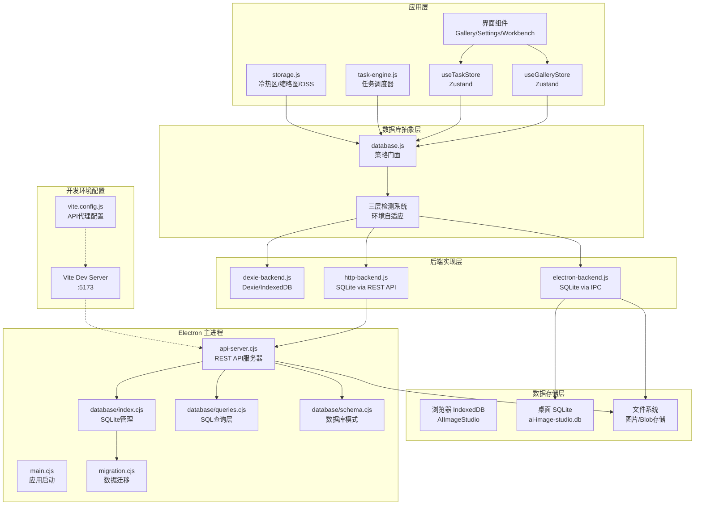
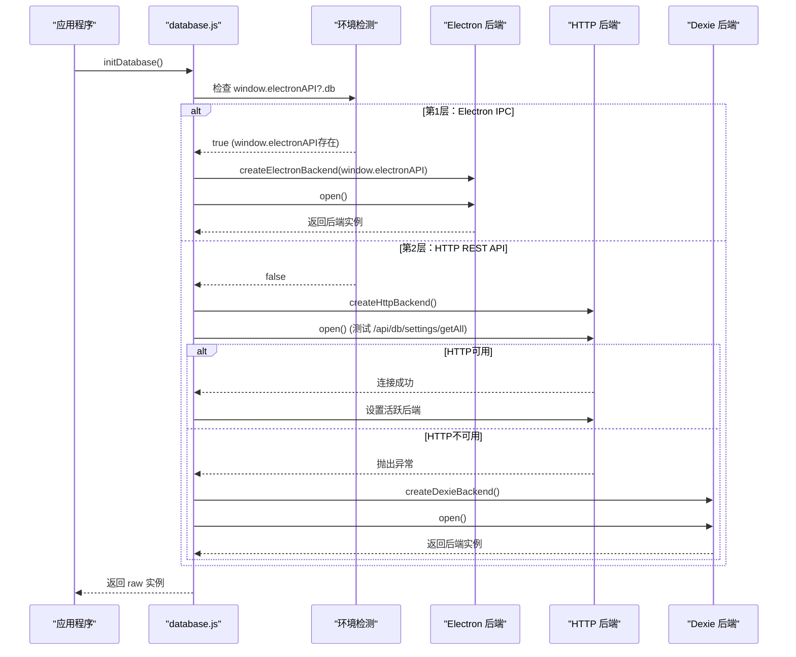
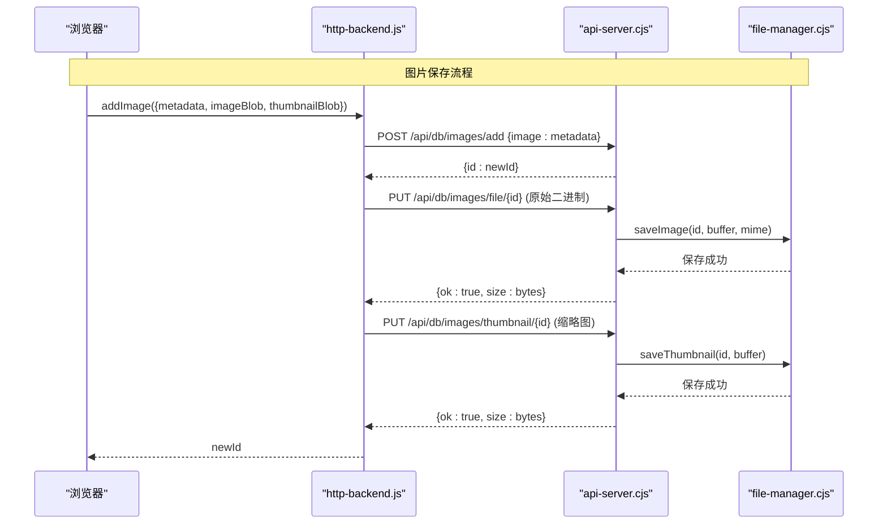
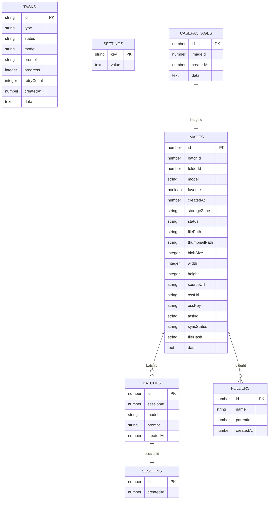
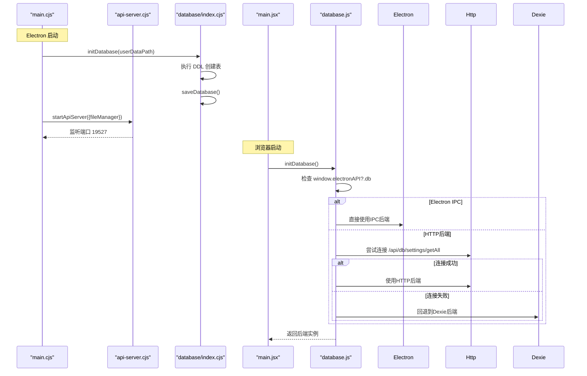
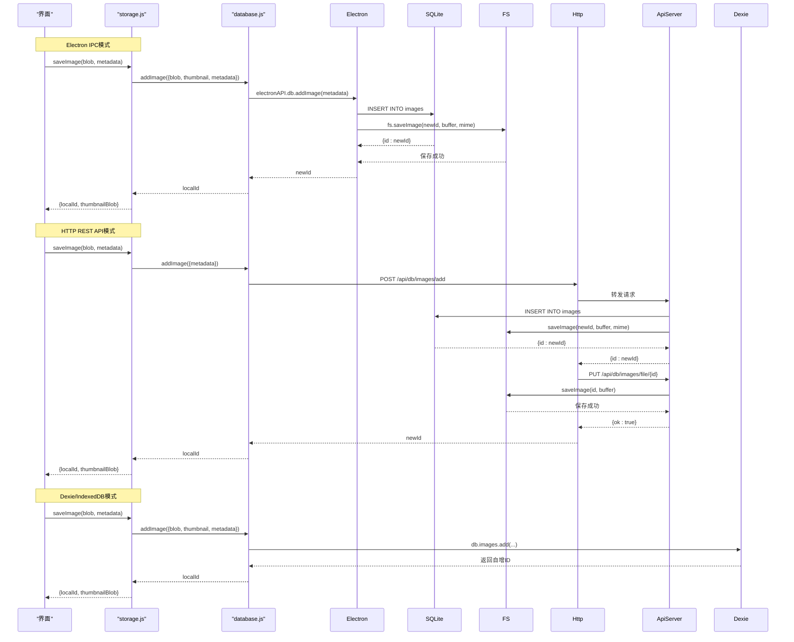
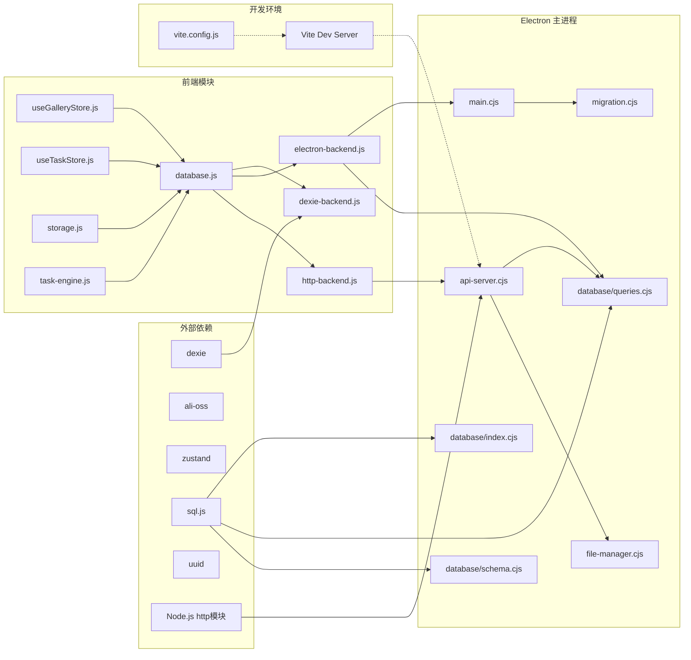
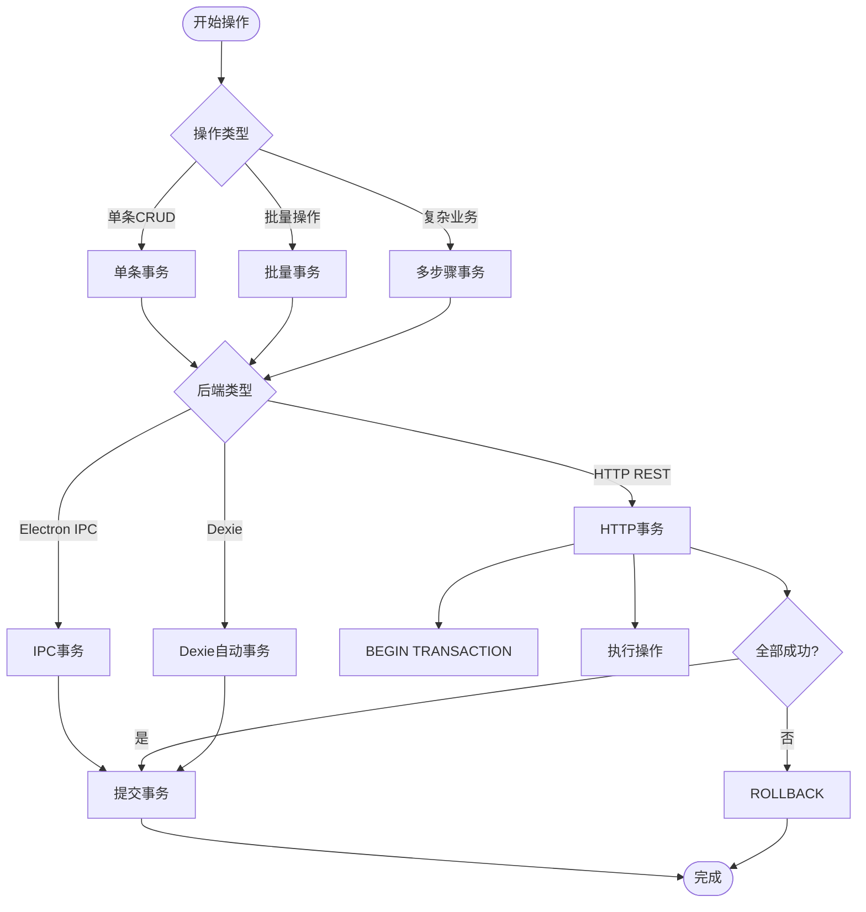
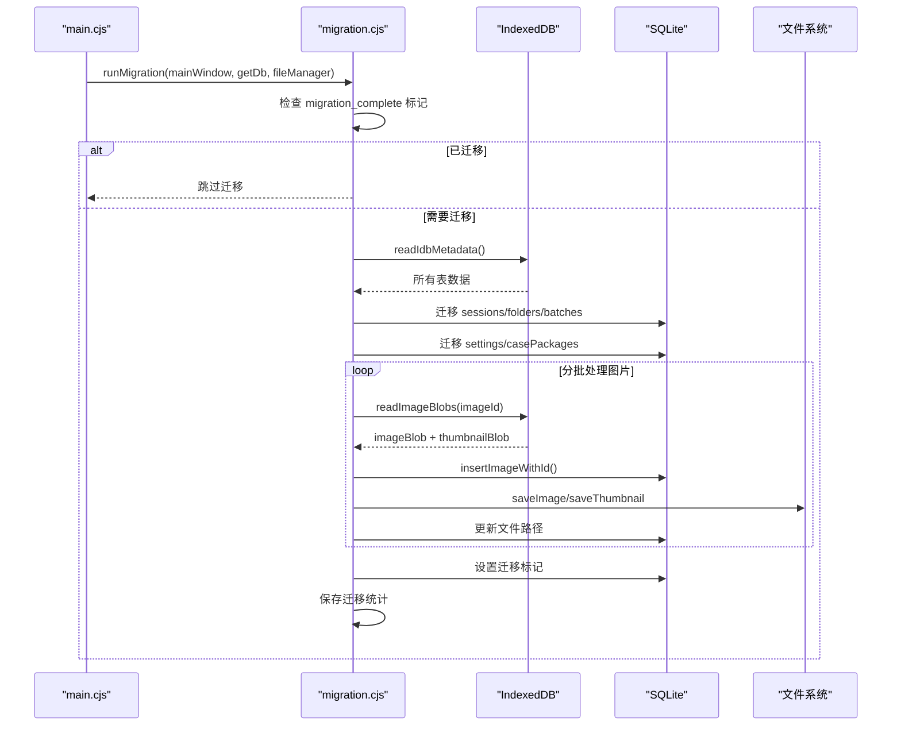

# 数据库持久化

<cite>
**本文引用的文件**   
- [database.js](file://app/src/db/database.js)
- [dexie-backend.js](file://app/src/db/dexie-backend.js)
- [electron-backend.js](file://app/src/db/electron-backend.js)
- [http-backend.js](file://app/src/db/http-backend.js)
- [api-server.cjs](file://app/electron/api-server.cjs)
- [index.cjs](file://app/electron/database/index.cjs)
- [schema.cjs](file://app/electron/database/schema.cjs)
- [queries.cjs](file://app/electron/database/queries.cjs)
- [migration.cjs](file://app/electron/migration.cjs)
- [main.cjs](file://app/electron/main.cjs)
- [vite.config.js](file://app/vite.config.js)
- [storage.js](file://app/src/services/storage.js)
- [useGalleryStore.js](file://app/src/stores/useGalleryStore.js)
- [useTaskStore.js](file://app/src/stores/useTaskStore.js)
- [task-engine.js](file://app/src/services/task-engine.js)
- [main.jsx](file://app/src/main.jsx)
</cite>

## 更新摘要
**变更内容**   
- 新增完整的HTTP后端实现，支持浏览器通过REST API访问SQLite数据库
- 数据库初始化升级为三层检测系统（Electron IPC → HTTP后端 → Dexie/IndexedDB）
- 新增API服务器，提供统一的REST API接口供浏览器端访问
- 支持跨环境无缝数据访问，包括开发环境和生产环境的不同部署场景
- 增强二进制数据传输机制，优化大文件上传下载性能

## 目录
1. [简介](#简介)
2. [架构总览](#架构总览)
3. [核心组件](#核心组件)
4. [三层检测系统设计](#三层检测系统设计)
5. [后端实现详解](#后端实现详解)
6. [HTTP REST API设计](#http-rest-api设计)
7. [数据模型与表结构](#数据模型与表结构)
8. [关键流程时序](#关键流程时序)
9. [依赖关系分析](#依赖关系分析)
10. [性能与索引优化](#性能与索引优化)
11. [事务与一致性](#事务与一致性)
12. [数据迁移机制](#数据迁移机制)
13. [备份与恢复](#备份与恢复)
14. [故障排查指南](#故障排查指南)
15. [结论](#结论)

## 简介
AI Image Studio 的数据库持久化层经过重大重构，从单一的后端架构演进为支持多环境的三层检测系统。新架构在Electron环境中使用IPC直接访问SQLite，在浏览器环境中通过HTTP REST API访问同一SQLite数据库，在独立浏览器模式下回退到Dexie/IndexedDB。该设计实现了跨环境的统一数据访问体验，同时保持了向后兼容性。

## 架构总览
下图展示了新的三层检测架构，包括环境检测、后端选择和数据流路径。



**图表来源**
- [database.js:26-46](file://app/src/db/database.js#L26-L46)
- [http-backend.js:75-82](file://app/src/db/http-backend.js#L75-L82)
- [api-server.cjs:575-603](file://app/electron/api-server.cjs#L575-L603)
- [vite.config.js:12-17](file://app/vite.config.js#L12-L17)

## 核心组件
- **数据库门面（database.js）**：三层检测系统的门面类，负责环境检测和后端选择，向上层提供统一的 API 接口
- **Dexie 后端（dexie-backend.js）**：浏览器环境下的 IndexedDB 实现，保持原有 Dexie 逻辑不变
- **Electron 后端（electron-backend.js）**：桌面环境下的 SQLite 实现，通过 IPC 调用主进程的数据库操作
- **HTTP 后端（http-backend.js）**：浏览器环境下的 REST API 客户端，通过HTTP请求访问Electron主进程的SQLite数据库
- **API 服务器（api-server.cjs）**：Electron主进程内嵌的HTTP服务器，提供REST API接口并路由到数据库操作
- **SQLite 数据库管理（index.cjs）**：主进程中的 SQLite 数据库生命周期管理，包含 WAL 模式和延迟写入
- **数据库模式（schema.cjs）**：SQLite 表的 DDL 定义，包含 7 个核心表和相应的索引
- **查询层（queries.cjs）**：SQLite 查询封装，提供与 Dexie 后端兼容的 API 接口
- **数据迁移器（migration.cjs）**：一次性迁移工具，将 IndexedDB 数据迁移到 SQLite

**章节来源**
- [database.js:1-114](file://app/src/db/database.js#L1-L114)
- [http-backend.js:1-345](file://app/src/db/http-backend.js#L1-L345)
- [api-server.cjs:1-606](file://app/electron/api-server.cjs#L1-L606)

## 三层检测系统设计
新的数据库层采用三层检测系统实现，通过运行时环境检测自动选择合适的后端实现。

### 环境检测优先级


**图表来源**
- [database.js:26-46](file://app/src/db/database.js#L26-L46)

### 部署场景支持
| 场景 | 检测条件 | 使用后端 | 说明 |
|------|----------|----------|------|
| Electron桌面应用 | `window.electronAPI?.db` 存在 | Electron IPC | 直接IPC通信，性能最优 |
| 浏览器+Electron | `/api/db/settings/getAll` 可达 | HTTP REST API | 通过Vite代理或生产环境API服务器 |
| 纯浏览器模式 | 以上条件都不满足 | Dexie/IndexedDB | 本地存储，无网络依赖 |

**章节来源**
- [database.js:26-46](file://app/src/db/database.js#L26-L46)

## 后端实现详解

### HTTP 后端实现
HTTP后端是新增的核心组件，实现了浏览器到Electron SQLite数据库的REST API通信：

#### 二进制数据传输机制


#### 错误处理和重试机制
- **连接验证**：启动时测试 `/api/db/settings/getAll` 端点可用性
- **超时处理**：所有HTTP请求都有内置的错误处理
- **降级策略**：HTTP失败时自动回退到Dexie后端

**章节来源**
- [http-backend.js:77-82](file://app/src/db/http-backend.js#L77-L82)
- [http-backend.js:86-103](file://app/src/db/http-backend.js#L86-L103)

### API 服务器实现
API服务器是Electron主进程内的HTTP服务器，提供完整的REST API接口：

#### 路由设计
```mermaid
flowchart TD
Request[HTTP请求] --> CheckPath{路径匹配}
CheckPath --> |/api/db/*| DbRouter[数据库路由处理器]
CheckPath --> |/api/qwen/*| QwenProxy[Qwen API代理]
CheckPath --> |/api/evolink/*| EvoLinkProxy[EvoLink API代理]
CheckPath --> |/api/oss/*| OssProxy[OSS代理]
CheckPath --> |/api/llm/*| LlmProxy[LLM代理]
CheckPath --> |/api/proxy-image| ImageProxy[图片CORS代理]
CheckPath --> |其他| NotFound[404响应]
DbRouter --> Images[/images/*]
DbRouter --> Batches[/batches/*]
DbRouter --> Sessions[/sessions/*]
DbRouter --> Folders[/folders/*]
DbRouter --> Tasks[/tasks/*]
DbRouter --> Settings[/settings/*]
DbRouter --> CasePackages[/casePackages/*]
Images --> FileOps[/images/file/:id<br/>/images/thumbnail/:id]
```

#### CORS和安全配置
- **跨域支持**：开发环境下允许跨域访问
- **请求体解析**：支持JSON和二进制数据
- **错误处理**：统一的错误响应格式

**章节来源**
- [api-server.cjs:190-458](file://app/electron/api-server.cjs#L190-L458)
- [api-server.cjs:462-564](file://app/electron/api-server.cjs#L462-L564)

## HTTP REST API设计
HTTP后端实现了完整的REST API接口，支持所有数据库操作：

### API端点概览
| 资源 | 方法 | 端点 | 功能 |
|------|------|------|------|
| 图片 | POST | `/api/db/images/add` | 创建图片记录 |
| 图片 | GET | `/api/db/images/get/:id` | 获取图片详情 |
| 图片 | POST | `/api/db/images/list` | 列表查询 |
| 图片 | PUT | `/api/db/images/file/:id` | 上传图片文件 |
| 图片 | GET | `/api/db/images/file/:id` | 下载图片文件 |
| 图片 | PUT | `/api/db/images/thumbnail/:id` | 上传缩略图 |
| 图片 | GET | `/api/db/images/thumbnail/:id` | 下载缩略图 |
| 批次 | POST | `/api/db/batches/add` | 创建批次 |
| 会话 | POST | `/api/db/sessions/add` | 创建会话 |
| 文件夹 | POST | `/api/db/folders/add` | 创建文件夹 |
| 任务 | POST | `/api/db/tasks/add` | 创建任务 |
| 设置 | GET | `/api/db/settings/getAll` | 获取所有设置 |
| 设置 | POST | `/api/db/settings/set` | 设置键值对 |

### 请求响应格式
```json
// 成功响应
{
  "id": 123,
  "ok": true,
  "size": 1024
}

// 错误响应
{
  "error": "Invalid id",
  "message": "具体错误信息"
}
```

**章节来源**
- [api-server.cjs:199-447](file://app/electron/api-server.cjs#L199-L447)

## 数据模型与表结构
新的架构保持了相同的数据模型，但在不同后端中有不同的实现细节。

### 核心表结构


### 索引设计对比

| 表名 | Dexie 索引 | SQLite 索引 | 用途 |
|------|------------|-------------|------|
| images | ++id, batchId, folderId, model, favorite, createdAt, storageZone, [folderId+createdAt] | idx_images_folder_created, idx_images_model, idx_images_favorite, idx_images_status, idx_images_batch, idx_images_storage | 复合查询优化 |
| batches | ++id, sessionId, model, prompt, createdAt | idx_batches_session | 按会话查询 |
| folders | ++id, name, parentId, createdAt | idx_folders_parent | 文件夹树构建 |
| tasks | ++id, type, status, model, createdAt, [status+createdAt] | idx_tasks_status | 任务状态查询 |
| casePackages | ++id, imageId, createdAt | idx_case_packages_image | 按图片关联查询 |

**章节来源**
- [dexie-backend.js:13-22](file://app/src/db/dexie-backend.js#L13-L22)
- [schema.cjs:11-111](file://app/electron/database/schema.cjs#L11-L111)

## 关键流程时序

### 数据库初始化流程（三层检测）


**图表来源**
- [main.cjs:70-102](file://app/electron/main.cjs#L70-L102)
- [database.js:26-46](file://app/src/db/database.js#L26-L46)

### 图片保存流程（三后端对比）


**图表来源**
- [storage.js:53-101](file://app/src/services/storage.js#L53-L101)
- [http-backend.js:86-103](file://app/src/db/http-backend.js#L86-L103)

## 依赖关系分析
新的架构引入了更清晰的依赖层次，特别是HTTP后端的引入：



**图表来源**
- [database.js:12-14](file://app/src/db/database.js#L12-L14)
- [http-backend.js:15](file://app/src/db/http-backend.js#L15)
- [api-server.cjs:16](file://app/electron/api-server.cjs#L16)
- [vite.config.js:12-17](file://app/vite.config.js#L12-L17)

**章节来源**
- [database.js:12-14](file://app/src/db/database.js#L12-L14)
- [http-backend.js:15](file://app/src/db/http-backend.js#L15)
- [api-server.cjs:16](file://app/electron/api-server.cjs#L16)
- [vite.config.js:12-17](file://app/vite.config.js#L12-L17)

## 性能与索引优化
新的架构在不同后端中实现了针对性的性能优化，特别是HTTP后端的优化：

### HTTP后端优化
- **批量操作**：支持批量删除等操作的REST API
- **流式传输**：二进制数据使用流式传输，避免内存溢出
- **连接复用**：HTTP连接池提升并发性能
- **压缩传输**：支持gzip压缩减少网络开销

### 开发环境优化
- **热重载**：Vite开发服务器的热重载支持
- **调试友好**：详细的日志输出和错误信息
- **代理透明**：API代理对前端完全透明

### 查询性能对比
| 操作类型 | Electron IPC | HTTP REST API | Dexie/IndexedDB | 性能差异 |
|----------|--------------|---------------|-----------------|----------|
| 单条查询 | O(1) 主键查找 | O(1) + 网络延迟 | O(1) 主键查找 | IPC最快 |
| 条件查询 | 服务器端WHERE | 服务器端WHERE | 客户端过滤 | IPC=HTTP > Dexie |
| 批量操作 | IN子句批量 | 批量API调用 | bulkUpdate/bulkDelete | IPC > HTTP ≈ Dexie |
| 全文搜索 | LIKE模糊匹配 | LIKE模糊匹配 | 客户端filter | 相当 |
| 统计分析 | SQL聚合函数 | SQL聚合函数 | 内存计算 | IPC=HTTP > Dexie |

**章节来源**
- [http-backend.js:105-112](file://app/src/db/http-backend.js#L105-L112)
- [api-server.cjs:242-257](file://app/electron/api-server.cjs#L242-L257)

## 事务与一致性
新的架构在不同后端中实现了不同的事务处理策略，HTTP后端增加了网络层面的考虑：

### HTTP后端事务处理
- **原子性保证**：图片元数据和文件上传的原子性通过业务逻辑保证
- **幂等性设计**：所有API端点都支持幂等操作
- **重试机制**：网络失败时的自动重试逻辑
- **状态同步**：确保数据库状态与文件系统状态一致

### 一致性策略


**图表来源**
- [http-backend.js:86-103](file://app/src/db/http-backend.js#L86-L103)
- [api-server.cjs:199-229](file://app/electron/api-server.cjs#L199-L229)

**章节来源**
- [http-backend.js:86-103](file://app/src/db/http-backend.js#L86-L103)
- [api-server.cjs:199-229](file://app/electron/api-server.cjs#L199-L229)

## 数据迁移机制
系统提供了完整的数据迁移机制，支持从旧版 IndexedDB 迁移到新版 SQLite。

### 迁移流程


### 迁移特性
- **增量迁移**：仅迁移有数据的表，避免空表迁移开销
- **批处理**：图片数据按批次处理，每批 10 条记录
- **错误容忍**：单个记录迁移失败不影响整体迁移过程
- **数据保留**：迁移完成后保留原始 IndexedDB 数据作为回退

**章节来源**
- [migration.cjs:160-349](file://app/electron/migration.cjs#L160-L349)

## 备份与恢复
新的架构提供了多种备份和恢复策略，特别考虑了HTTP后端的网络因素：

### 备份策略
- **SQLite 文件备份**：直接复制 ai-image-studio.db 文件
- **增量备份**：基于 WAL 文件的增量同步
- **导出功能**：通过 queries.cjs 提供的 API 导出数据为 JSON
- **混合备份**：同时备份数据库文件和文件系统图片
- **远程备份**：通过HTTP API进行远程备份操作

### 恢复策略
- **完整恢复**：替换数据库文件并重启应用
- **增量恢复**：应用 WAL 文件恢复到最新状态
- **选择性恢复**：通过 API 导入特定表数据
- **冲突解决**：基于时间戳和唯一键的合并策略
- **网络恢复**：支持断点续传的远程恢复

**章节来源**
- [index.cjs:66-75](file://app/electron/database/index.cjs#L66-L75)
- [queries.cjs:703-721](file://app/electron/database/queries.cjs#L703-L721)

## 故障排查指南
针对新架构的常见问题和解决方案，特别关注HTTP后端的网络问题：

### 环境问题诊断
- **后端选择失败**：检查 window.electronAPI?.db 是否存在
- **IPC 通信异常**：验证 preload.cjs 是否正确暴露 API
- **HTTP连接失败**：检查API服务器是否启动，端口是否被占用
- **权限问题**：确认 Electron 主进程的文件系统访问权限

### HTTP后端专用问题
- **CORS错误**：检查开发环境的代理配置
- **网络超时**：调整HTTP请求超时设置
- **大文件传输**：监控内存使用和磁盘空间
- **API端点404**：验证路由配置和请求路径

### 数据一致性检查
- **迁移状态**：检查 settings 表中的 migration_complete 标记
- **数据完整性**：对比 IndexedDB 和 SQLite 的记录数量
- **文件关联**：验证图片文件路径与实际文件存在性
- **API响应一致性**：比较不同后端的响应格式

### 性能问题定位
- **慢查询分析**：使用 SQLite EXPLAIN QUERY PLAN 分析查询计划
- **内存泄漏**：监控 Blob URL 的创建和释放情况
- **I/O 瓶颈**：观察 WAL 文件的写入频率和大小
- **网络延迟**：监控HTTP请求的响应时间和成功率

**章节来源**
- [database.js:26-46](file://app/src/db/database.js#L26-L46)
- [http-backend.js:77-82](file://app/src/db/http-backend.js#L77-L82)
- [api-server.cjs:575-603](file://app/electron/api-server.cjs#L575-L603)

## 结论
AI Image Studio 的数据库持久化层经过重大重构，成功实现了从单一后端架构到支持多环境的三层检测系统的演进。新架构不仅保持了向后兼容性，还显著提升了性能和可扩展性。

主要优势包括：
- **环境自适应**：自动检测运行环境并选择最优后端
- **跨环境统一**：通过REST API实现浏览器和桌面的统一数据访问
- **性能提升**：SQLite在后端提供更强的查询能力和更好的并发支持
- **灵活部署**：支持多种部署场景，从纯浏览器到完整Electron应用
- **数据迁移**：无缝的数据迁移机制确保平滑升级
- **维护简化**：统一的API接口降低了上层代码的维护成本

建议在未来进一步优化：
- 实现更细粒度的事务控制
- 添加数据库健康检查和自动修复机制
- 完善监控和日志系统
- 考虑分布式数据库支持
- 优化HTTP后端的连接池和缓存机制