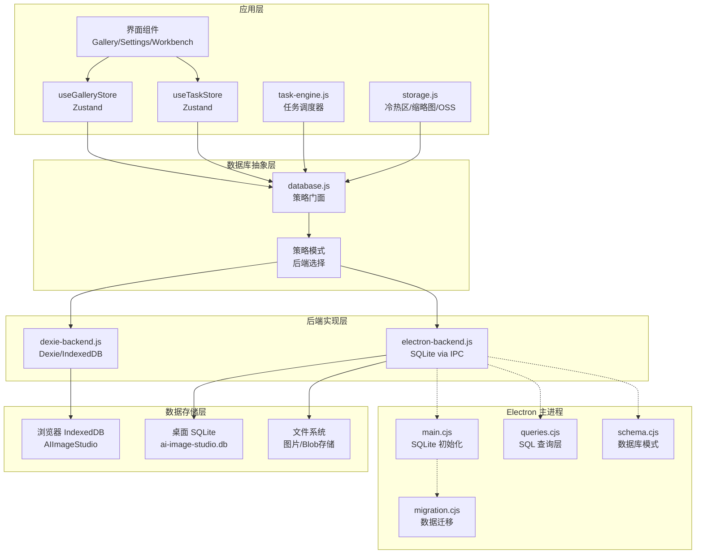
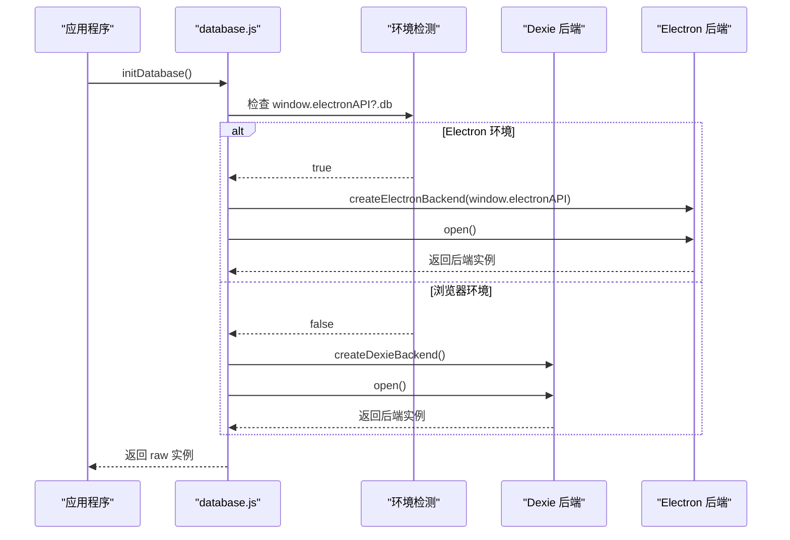
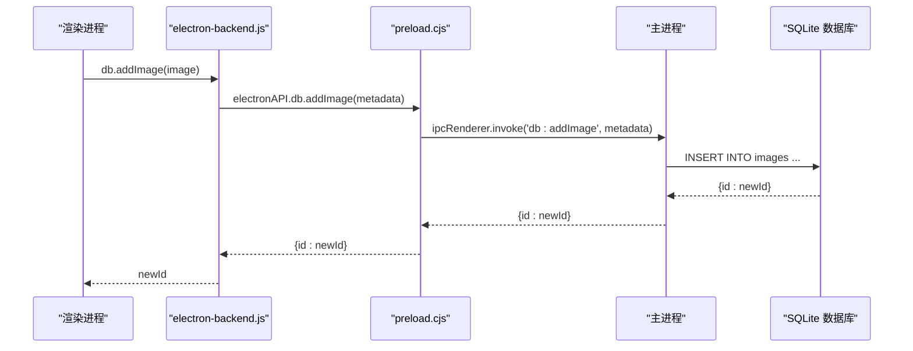
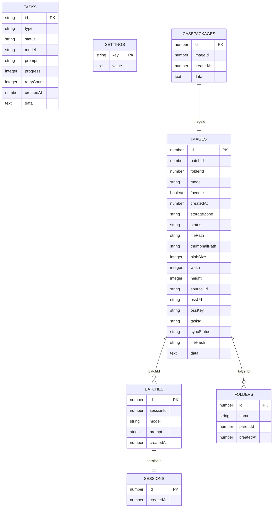
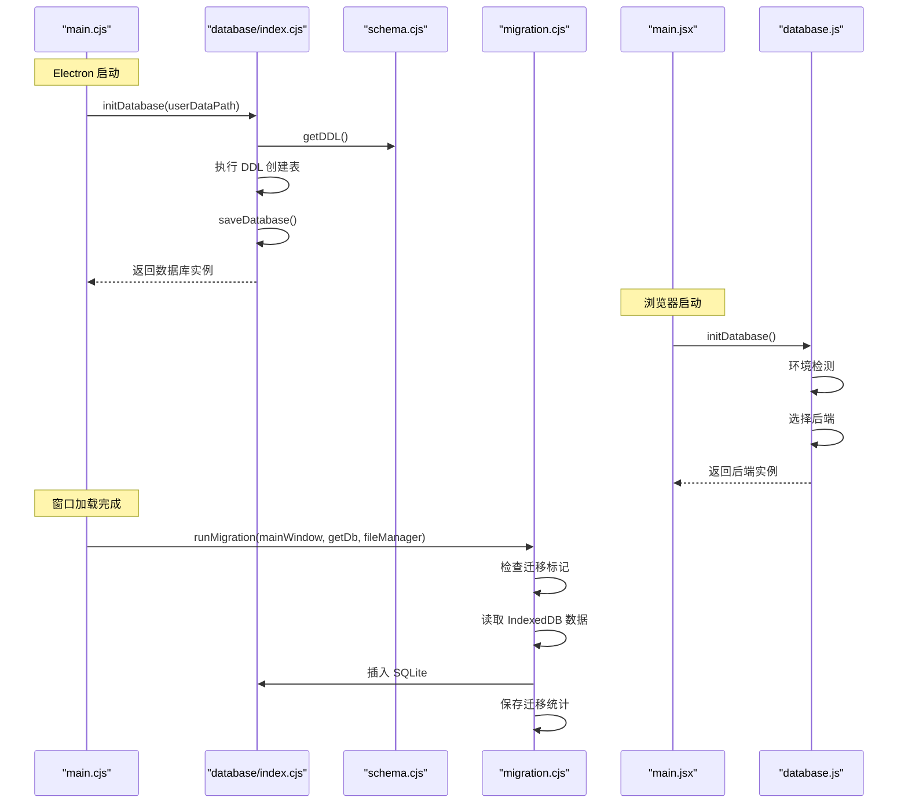
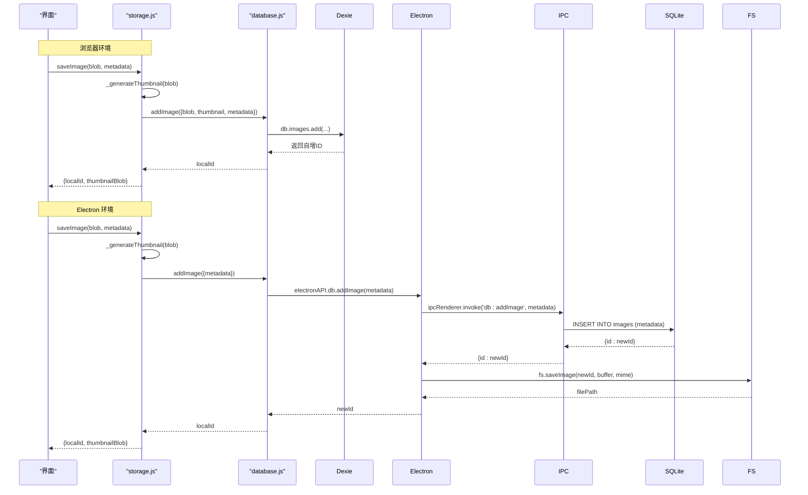
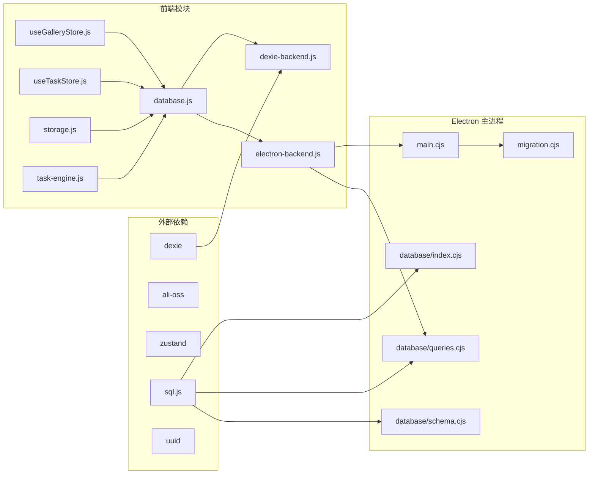
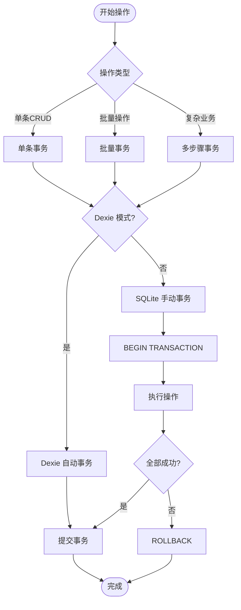
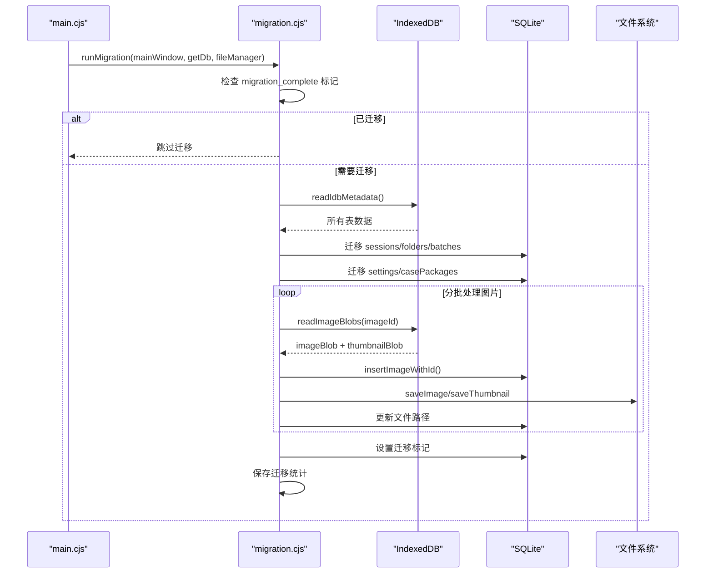

# 数据库持久化

<cite>
**本文引用的文件**   
- [database.js](file://app/src/db/database.js)
- [dexie-backend.js](file://app/src/db/dexie-backend.js)
- [electron-backend.js](file://app/src/db/electron-backend.js)
- [index.cjs](file://app/electron/database/index.cjs)
- [schema.cjs](file://app/electron/database/schema.cjs)
- [queries.cjs](file://app/electron/database/queries.cjs)
- [migration.cjs](file://app/electron/migration.cjs)
- [storage.js](file://app/src/services/storage.js)
- [useGalleryStore.js](file://app/src/stores/useGalleryStore.js)
- [useTaskStore.js](file://app/src/stores/useTaskStore.js)
- [task-engine.js](file://app/src/services/task-engine.js)
- [main.jsx](file://app/src/main.jsx)
- [main.cjs](file://app/electron/main.cjs)
</cite>

## 更新摘要
**变更内容**   
- 数据库层从纯 Dexie.js/IndexedDB 架构重构为策略模式
- 新增双后端支持：浏览器端使用 IndexedDB，桌面端使用 SQLite
- 废弃直接 Dexie 实例访问方式，统一通过策略接口访问
- 新增数据迁移机制，支持从 IndexedDB 到 SQLite 的自动迁移
- 增强 Electron 集成，通过 IPC 实现跨进程数据库操作

## 目录
1. [简介](#简介)
2. [架构总览](#架构总览)
3. [核心组件](#核心组件)
4. [策略模式设计](#策略模式设计)
5. [后端实现详解](#后端实现详解)
6. [数据模型与表结构](#数据模型与表结构)
7. [关键流程时序](#关键流程时序)
8. [依赖关系分析](#依赖关系分析)
9. [性能与索引优化](#性能与索引优化)
10. [事务与一致性](#事务与一致性)
11. [数据迁移机制](#数据迁移机制)
12. [备份与恢复](#备份与恢复)
13. [故障排查指南](#故障排查指南)
14. [结论](#结论)

## 简介
AI Image Studio 的数据库持久化层经过重大重构，从单一的 Dexie.js/IndexedDB 架构演进为支持双后端的策略模式架构。该架构在浏览器环境中使用 IndexedDB，在 Electron 桌面环境中使用 SQLite，通过统一的 API 接口向上层应用提供一致的数据访问体验。文档详细说明新的策略模式设计、双后端实现、数据迁移机制以及性能优化策略。

## 架构总览
下图展示了新的策略模式架构，包括环境检测、后端选择和数据流路径。

**图表来源**
- [database.js:1-30](file://app/src/db/database.js#L1-L30)
- [dexie-backend.js:1-30](file://app/src/db/dexie-backend.js#L1-L30)
- [electron-backend.js:1-45](file://app/src/db/electron-backend.js#L1-L45)
- [index.cjs:19-45](file://app/electron/database/index.cjs#L19-L45)

## 核心组件
- **数据库门面（database.js）**：策略模式的门面类，负责环境检测和后端选择，向上层提供统一的 API 接口
- **Dexie 后端（dexie-backend.js）**：浏览器环境下的 IndexedDB 实现，保持原有 Dexie 逻辑不变
- **Electron 后端（electron-backend.js）**：桌面环境下的 SQLite 实现，通过 IPC 调用主进程的数据库操作
- **SQLite 数据库管理（index.cjs）**：主进程中的 SQLite 数据库生命周期管理，包含 WAL 模式和延迟写入
- **数据库模式（schema.cjs）**：SQLite 表的 DDL 定义，包含 7 个核心表和相应的索引
- **查询层（queries.cjs）**：SQLite 查询封装，提供与 Dexie 后端兼容的 API 接口
- **数据迁移器（migration.cjs）**：一次性迁移工具，将 IndexedDB 数据迁移到 SQLite

**章节来源**
- [database.js:1-98](file://app/src/db/database.js#L1-L98)
- [dexie-backend.js:1-310](file://app/src/db/dexie-backend.js#L1-L310)
- [electron-backend.js:1-331](file://app/src/db/electron-backend.js#L1-L331)
- [index.cjs:1-93](file://app/electron/database/index.cjs#L1-L93)
- [schema.cjs:1-115](file://app/electron/database/schema.cjs#L1-L115)
- [queries.cjs:1-721](file://app/electron/database/queries.cjs#L1-L721)
- [migration.cjs:1-352](file://app/electron/migration.cjs#L1-L352)

## 策略模式设计
新的数据库层采用策略模式实现，通过运行时环境检测自动选择合适的后端实现。

### 环境检测与后端选择

**图表来源**
- [database.js:22-30](file://app/src/db/database.js#L22-L30)

### 统一 API 接口
所有数据库操作都通过门面函数转发到当前活跃的后端，确保上层代码无需修改：

| 操作类型 | 接口方法 | 说明 |
|---------|----------|------|
| 图片管理 | addImage, getImages, getImage, updateImage, deleteImage | 图片 CRUD 操作 |
| 批量操作 | deleteImages, moveImages, searchImages | 批量删除、移动、搜索 |
| 批次管理 | addBatch, getBatches, getBatch, deleteBatch | 生成批次记录 |
| 会话管理 | addSession, getSessions, getSession | 工作会话记录 |
| 文件夹管理 | addFolder, getFolders, getFolder, updateFolder, deleteFolder | 文件夹树操作 |
| 任务管理 | addTask, getTasks, getTask, updateTask, deleteTask | 异步任务队列 |
| 设置管理 | getSetting, setSetting, getAllSettings | 键值对配置存储 |
| 案例包管理 | addCasePackage, getCasePackages, updateCasePackage, deleteCasePackage | 知识库包管理 |

**章节来源**
- [database.js:32-87](file://app/src/db/database.js#L32-L87)

## 后端实现详解

### Dexie 后端实现
Dexie 后端完全保留了原有的 IndexedDB 逻辑，确保浏览器环境的向后兼容性：

- **数据库初始化**：使用 Dexie('AIImageStudio') 创建数据库实例
- **版本管理**：db.version(1).stores({...}) 声明表结构和索引
- **查询优化**：利用 Dexie 的链式查询 API 实现高效过滤和排序
- **Blob 处理**：原生支持 Blob 对象的存储和检索

### Electron 后端实现
Electron 后端通过 IPC 机制与主进程的 SQLite 数据库通信：

#### IPC 通信协议

#### 数据序列化与传输
- **Blob 处理**：将 Blob 转换为 ArrayBuffer 进行 IPC 传输
- **元数据分离**：将图片元数据和二进制数据分离存储
- **类型转换**：确保返回值与 Dexie 后端保持一致

**章节来源**
- [dexie-backend.js:10-29](file://app/src/db/dexie-backend.js#L10-L29)
- [electron-backend.js:8-45](file://app/src/db/electron-backend.js#L8-L45)
- [electron-backend.js:48-69](file://app/src/db/electron-backend.js#L48-L69)

## 数据模型与表结构
新的架构保持了相同的数据模型，但在不同后端中有不同的实现细节。

### 核心表结构

### 索引设计对比

| 表名 | Dexie 索引 | SQLite 索引 | 用途 |
|------|------------|-------------|------|
| images | ++id, batchId, folderId, model, favorite, createdAt, storageZone, [folderId+createdAt] | idx_images_folder_created, idx_images_model, idx_images_favorite, idx_images_status, idx_images_batch, idx_images_storage | 复合查询优化 |
| batches | ++id, sessionId, model, prompt, createdAt | idx_batches_session | 按会话查询 |
| folders | ++id, name, parentId, createdAt | idx_folders_parent | 文件夹树构建 |
| tasks | ++id, type, status, model, createdAt, [status+createdAt] | idx_tasks_status | 任务状态查询 |
| casePackages | ++id, imageId, createdAt | idx_case_packages_image | 按图片关联查询 |

**章节来源**
- [dexie-backend.js:13-22](file://app/src/db/dexie-backend.js#L13-L22)
- [schema.cjs:11-111](file://app/electron/database/schema.cjs#L11-L111)

## 关键流程时序

### 数据库初始化流程

**图表来源**
- [main.cjs:46-92](file://app/electron/main.cjs#L46-L92)
- [index.cjs:19-45](file://app/electron/database/index.cjs#L19-L45)
- [main.jsx:12-29](file://app/src/main.jsx#L12-L29)
- [database.js:22-30](file://app/src/db/database.js#L22-L30)

### 图片保存流程（双后端对比）

**图表来源**
- [storage.js:53-101](file://app/src/services/storage.js#L53-L101)
- [dexie-backend.js:32-39](file://app/src/db/dexie-backend.js#L32-L39)
- [electron-backend.js:48-69](file://app/src/db/electron-backend.js#L48-L69)

## 依赖关系分析
新的架构引入了更清晰的依赖层次：

**图表来源**
- [database.js:12-13](file://app/src/db/database.js#L12-L13)
- [dexie-backend.js:8](file://app/src/db/dexie-backend.js#L8)
- [index.cjs:6](file://app/electron/database/index.cjs#L6)
- [main.cjs:7](file://app/electron/main.cjs#L7)

**章节来源**
- [database.js:12-13](file://app/src/db/database.js#L12-L13)
- [dexie-backend.js:8](file://app/src/db/dexie-backend.js#L8)
- [index.cjs:6](file://app/electron/database/index.cjs#L6)
- [main.cjs:7](file://app/electron/main.cjs#L7)

## 性能与索引优化
新的架构在不同后端中实现了针对性的性能优化：

### Dexie 后端优化
- **链式查询**：利用 Dexie 的 orderBy、where、filter 等链式 API 减少内存占用
- **分页支持**：通过 limit/skip 参数实现结果集分页
- **复合索引**：[folderId+createdAt] 等复合索引优化复杂查询

### SQLite 后端优化
- **WAL 模式**：启用 Write-Ahead Logging 提升并发性能
- **延迟写入**：300ms 防抖机制减少频繁磁盘 I/O
- **预编译语句**：使用 prepare/bind 提高 SQL 执行效率
- **JSON 列**：将非结构化数据存储在 JSON 字段中，保持灵活性

### 查询性能对比
| 操作类型 | Dexie 后端 | SQLite 后端 | 性能差异 |
|----------|------------|-------------|----------|
| 单条查询 | O(1) 主键查找 | O(1) 主键查找 | 基本持平 |
| 条件查询 | 客户端过滤 | 服务器端 WHERE 子句 | SQLite 更快 |
| 批量操作 | bulkUpdate/bulkDelete | IN 子句批量操作 | SQLite 更高效 |
| 全文搜索 | 客户端 filter | LIKE 模糊匹配 | 相当 |
| 统计分析 | 全表扫描 + 内存计算 | SQL SUM/COUNT 聚合 | SQLite 更快 |

**章节来源**
- [dexie-backend.js:41-65](file://app/src/db/dexie-backend.js#L41-L65)
- [queries.cjs:217-257](file://app/electron/database/queries.cjs#L217-L257)
- [index.cjs:58-75](file://app/electron/database/index.cjs#L58-L75)

## 事务与一致性
新的架构在不同后端中实现了不同的事务处理策略：

### Dexie 后端事务
- **隐式事务**：Dexie 自动包裹每个操作在事务中
- **多步操作**：使用 db.transaction() 显式包裹多步写操作
- **错误回滚**：单个操作失败时自动回滚整个事务

### SQLite 后端事务
- **手动事务**：通过 BEGIN/COMMIT/ROLLBACK 控制事务边界
- **原子性保证**：同一事务内的多个操作要么全部成功，要么全部失败
- **并发控制**：WAL 模式允许多读一写，提升并发性能

### 一致性策略

**图表来源**
- [dexie-backend.js:71-73](file://app/src/db/dexie-backend.js#L71-L73)
- [queries.cjs:165-193](file://app/electron/database/queries.cjs#L165-L193)

**章节来源**
- [dexie-backend.js:71-73](file://app/src/db/dexie-backend.js#L71-L73)
- [queries.cjs:165-193](file://app/electron/database/queries.cjs#L165-L193)

## 数据迁移机制
系统提供了完整的数据迁移机制，支持从旧版 IndexedDB 迁移到新版 SQLite。

### 迁移流程

### 迁移特性
- **增量迁移**：仅迁移有数据的表，避免空表迁移开销
- **批处理**：图片数据按批次处理，每批 10 条记录
- **错误容忍**：单个记录迁移失败不影响整体迁移过程
- **数据保留**：迁移完成后保留原始 IndexedDB 数据作为回退

**章节来源**
- [migration.cjs:160-349](file://app/electron/migration.cjs#L160-L349)

## 备份与恢复
新的架构提供了多种备份和恢复策略：

### 备份策略
- **SQLite 文件备份**：直接复制 ai-image-studio.db 文件
- **增量备份**：基于 WAL 文件的增量同步
- **导出功能**：通过 queries.cjs 提供的 API 导出数据为 JSON
- **混合备份**：同时备份数据库文件和文件系统图片

### 恢复策略
- **完整恢复**：替换数据库文件并重启应用
- **增量恢复**：应用 WAL 文件恢复到最新状态
- **选择性恢复**：通过 API 导入特定表数据
- **冲突解决**：基于时间戳和唯一键的合并策略

**章节来源**
- [index.cjs:66-75](file://app/electron/database/index.cjs#L66-L75)
- [queries.cjs:703-721](file://app/electron/database/queries.cjs#L703-L721)

## 故障排查指南
针对新架构的常见问题和解决方案：

### 环境问题诊断
- **后端选择失败**：检查 window.electronAPI?.db 是否存在
- **IPC 通信异常**：验证 preload.cjs 是否正确暴露 API
- **权限问题**：确认 Electron 主进程的文件系统访问权限

### 数据一致性检查
- **迁移状态**：检查 settings 表中的 migration_complete 标记
- **数据完整性**：对比 IndexedDB 和 SQLite 的记录数量
- **文件关联**：验证图片文件路径与实际文件存在性

### 性能问题定位
- **慢查询分析**：使用 SQLite EXPLAIN QUERY PLAN 分析查询计划
- **内存泄漏**：监控 Blob URL 的创建和释放情况
- **I/O 瓶颈**：观察 WAL 文件的写入频率和大小

**章节来源**
- [database.js:22-30](file://app/src/db/database.js#L22-L30)
- [migration.cjs:164-169](file://app/electron/migration.cjs#L164-L169)
- [index.cjs:66-75](file://app/electron/database/index.cjs#L66-L75)

## 结论
AI Image Studio 的数据库持久化层经过重大重构，成功实现了从单一 Dexie.js/IndexedDB 架构到支持双后端的策略模式架构的演进。新架构不仅保持了向后兼容性，还显著提升了性能和可扩展性。

主要优势包括：
- **环境自适应**：自动检测运行环境并选择最优后端
- **性能提升**：SQLite 在后端提供更强的查询能力和更好的并发支持
- **数据迁移**：无缝的数据迁移机制确保平滑升级
- **维护简化**：统一的 API 接口降低了上层代码的维护成本

建议在未来进一步优化：
- 实现更细粒度的事务控制
- 添加数据库健康检查和自动修复机制
- 完善监控和日志系统
- 考虑分布式数据库支持