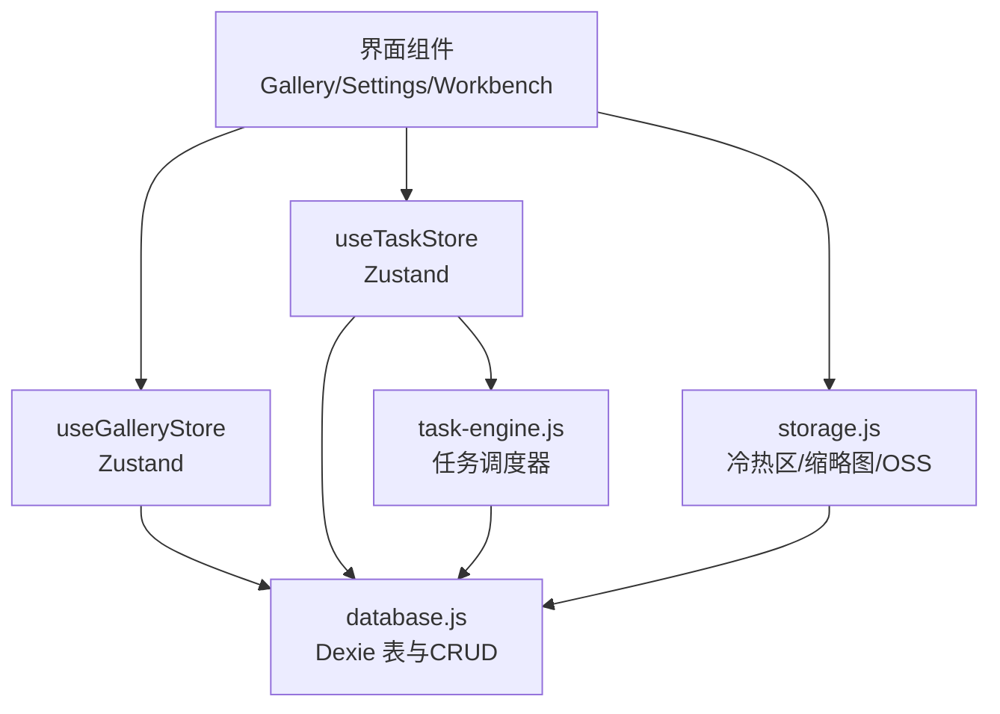
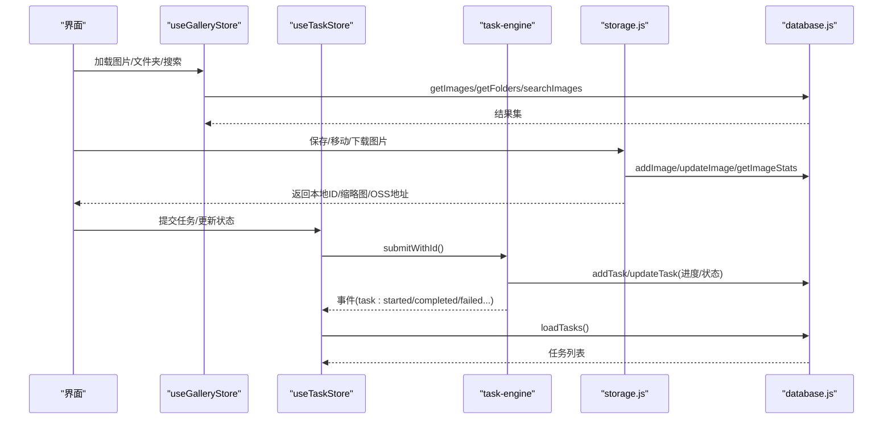
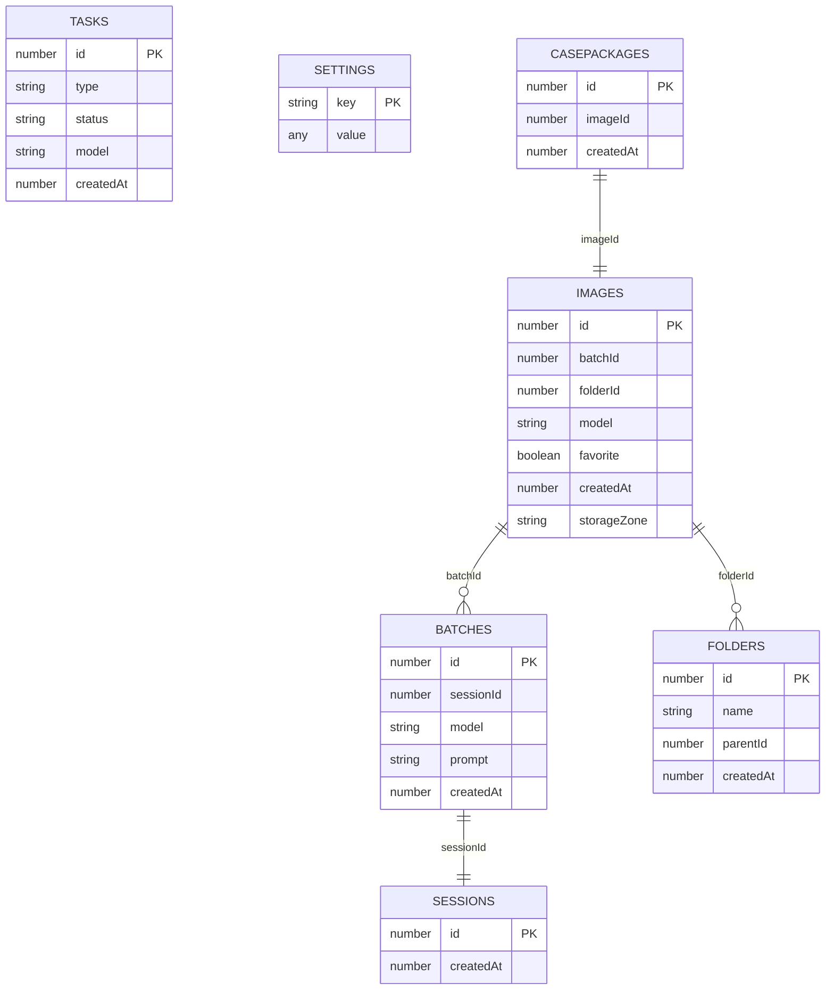
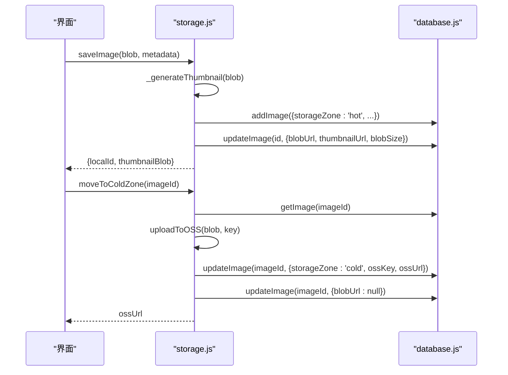
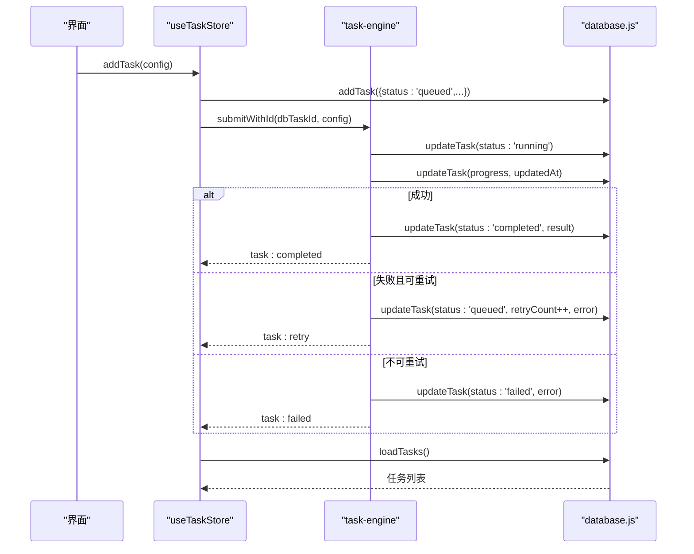
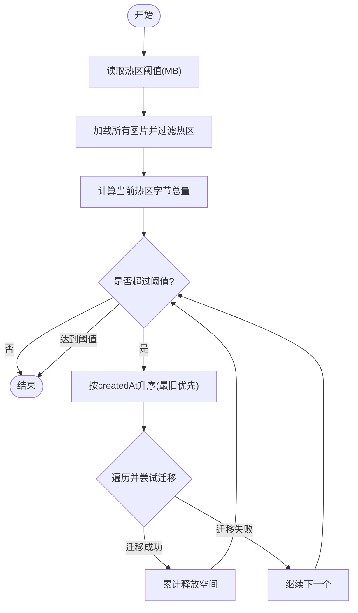
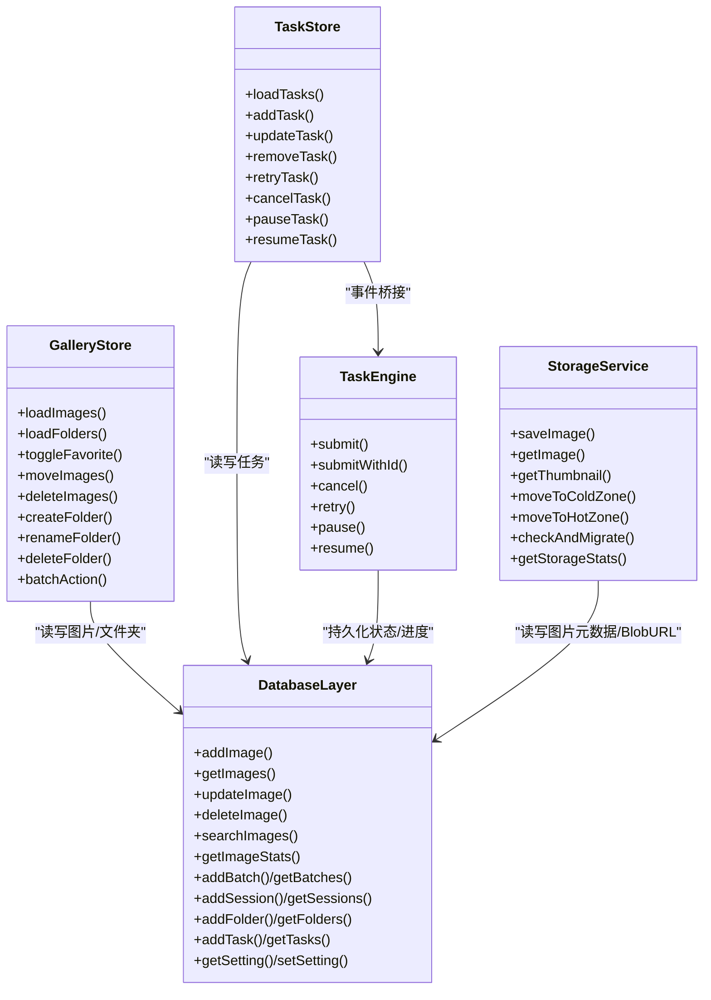
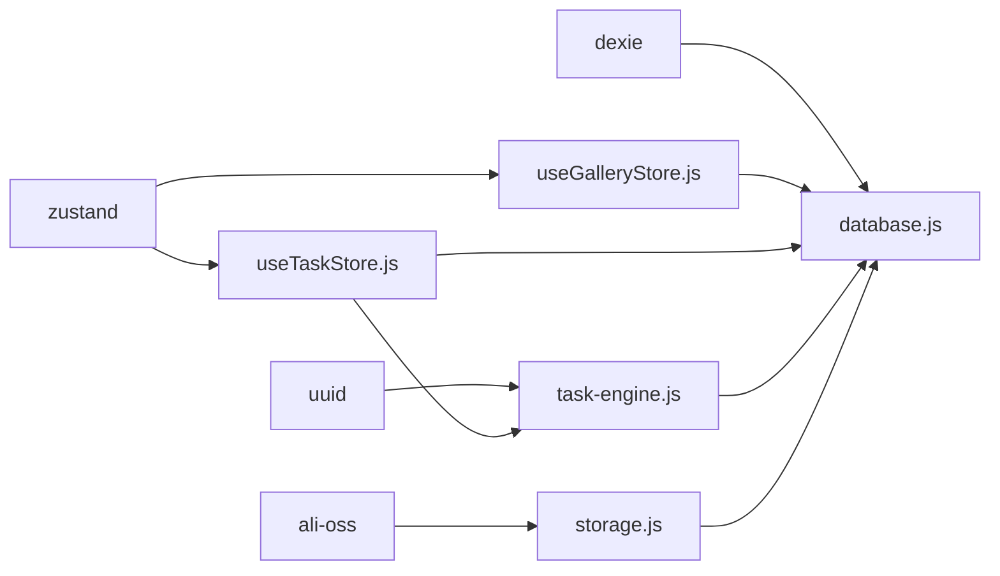

# 数据库持久化

<cite>
**本文引用的文件**   
- [database.js](file://app/src/db/database.js)
- [storage.js](file://app/src/services/storage.js)
- [useGalleryStore.js](file://app/src/stores/useGalleryStore.js)
- [useTaskStore.js](file://app/src/stores/useTaskStore.js)
- [task-engine.js](file://app/src/services/task-engine.js)
</cite>

## 目录
1. [简介](#简介)
2. [项目结构](#项目结构)
3. [核心组件](#核心组件)
4. [架构总览](#架构总览)
5. [详细组件分析](#详细组件分析)
6. [依赖关系分析](#依赖关系分析)
7. [性能与索引优化](#性能与索引优化)
8. [事务与一致性](#事务与一致性)
9. [数据迁移机制](#数据迁移机制)
10. [备份与恢复](#备份与恢复)
11. [故障排查指南](#故障排查指南)
12. [结论](#结论)

## 简介
本文件面向 AI Image Studio 的前端持久化层，围绕 IndexedDB + Dexie.js 的数据模型、CRUD 封装、查询优化、事务处理、状态同步、迁移策略、一致性与备份恢复进行系统化说明。文档同时提供架构图与数据流图，帮助读者快速理解“UI 状态 ↔ Store ↔ 服务层 ↔ 数据库”的完整链路。

## 项目结构
与数据库持久化相关的核心代码位于以下位置：
- 数据库定义与基础 CRUD：app/src/db/database.js
- 图片冷热分层存储与缩略图生成：app/src/services/storage.js
- 画廊与文件夹管理（Zustand Store）：app/src/stores/useGalleryStore.js
- 任务中心（Zustand Store）：app/src/stores/useTaskStore.js
- 后台任务调度器（事件驱动、自动持久化）：app/src/services/task-engine.js

图表来源
- [database.js:1-31](file://app/src/db/database.js#L1-L31)
- [storage.js:1-42](file://app/src/services/storage.js#L1-L42)
- [useGalleryStore.js:1-20](file://app/src/stores/useGalleryStore.js#L1-L20)
- [useTaskStore.js:1-20](file://app/src/stores/useTaskStore.js#L1-L20)
- [task-engine.js:1-40](file://app/src/services/task-engine.js#L1-L40)

章节来源
- [database.js:1-31](file://app/src/db/database.js#L1-L31)
- [storage.js:1-42](file://app/src/services/storage.js#L1-L42)
- [useGalleryStore.js:1-20](file://app/src/stores/useGalleryStore.js#L1-L20)
- [useTaskStore.js:1-20](file://app/src/stores/useTaskStore.js#L1-L20)
- [task-engine.js:1-40](file://app/src/services/task-engine.js#L1-L40)

## 核心组件
- 数据库层（database.js）
  - 基于 Dexie 初始化名为 AIImageStudio 的数据库，声明版本与表结构。
  - 提供 images、batches、sessions、folders、tasks、settings、casePackages 等表的增删改查与统计方法。
- 存储服务（storage.js）
  - 实现热区（IndexedDB Blob URL）与冷区（OSS）之间的迁移、缩略图生成、容量阈值检查与自动迁移。
- 画廊 Store（useGalleryStore.js）
  - 负责图片列表、文件夹树、搜索与筛选、批量操作；调用 database.js 完成持久化。
- 任务 Store（useTaskStore.js）
  - 桥接 TaskEngine 的事件到 Zustand 状态，统一刷新任务列表与活跃计数。
- 任务引擎（task-engine.js）
  - 并发控制、FIFO 队列、指数退避重试、状态机、进度上报与自动持久化。

章节来源
- [database.js:1-339](file://app/src/db/database.js#L1-L339)
- [storage.js:1-393](file://app/src/services/storage.js#L1-L393)
- [useGalleryStore.js:1-204](file://app/src/stores/useGalleryStore.js#L1-L204)
- [useTaskStore.js:1-173](file://app/src/stores/useTaskStore.js#L1-L173)
- [task-engine.js:1-319](file://app/src/services/task-engine.js#L1-L319)

## 架构总览
下图展示从 UI 到数据库的端到端数据流，包括冷热区迁移与任务执行路径。

图表来源
- [useGalleryStore.js:29-62](file://app/src/stores/useGalleryStore.js#L29-L62)
- [database.js:56-138](file://app/src/db/database.js#L56-L138)
- [storage.js:51-80](file://app/src/services/storage.js#L51-L80)
- [useTaskStore.js:66-87](file://app/src/stores/useTaskStore.js#L66-L87)
- [task-engine.js:57-92](file://app/src/services/task-engine.js#L57-L92)
- [task-engine.js:222-297](file://app/src/services/task-engine.js#L222-L297)

## 详细组件分析

### 数据模型与表结构
- images：生成的或导入的图片记录，包含批次、文件夹、模型、收藏标记、创建时间、存储分区、尺寸等信息。复合索引支持按文件夹+时间排序。
- batches：一次提示词生成的批次聚合。
- sessions：工作会话。
- folders：用户创建的文件夹树（支持父子关系）。
- tasks：后台任务记录，含类型、状态、模型、创建时间、复合索引用于按状态+时间查询。
- settings：键值对应用设置。
- casePackages：图片+提示词的组合包。

图表来源
- [database.js:22-31](file://app/src/db/database.js#L22-L31)

章节来源
- [database.js:22-31](file://app/src/db/database.js#L22-L31)

### 关键流程时序

#### 图片保存与缩略图生成（热区→可选冷区）

图表来源
- [storage.js:51-80](file://app/src/services/storage.js#L51-L80)
- [storage.js:204-244](file://app/src/services/storage.js#L204-L244)
- [database.js:43-86](file://app/src/db/database.js#L43-L86)

章节来源
- [storage.js:51-80](file://app/src/services/storage.js#L51-L80)
- [storage.js:204-244](file://app/src/services/storage.js#L204-L244)
- [database.js:43-86](file://app/src/db/database.js#L43-L86)

#### 任务生命周期（提交→运行→完成/失败→重试）

图表来源
- [useTaskStore.js:66-87](file://app/src/stores/useTaskStore.js#L66-L87)
- [task-engine.js:57-92](file://app/src/services/task-engine.js#L57-L92)
- [task-engine.js:222-297](file://app/src/services/task-engine.js#L222-L297)
- [database.js:235-274](file://app/src/db/database.js#L235-L274)

章节来源
- [useTaskStore.js:66-87](file://app/src/stores/useTaskStore.js#L66-L87)
- [task-engine.js:57-92](file://app/src/services/task-engine.js#L57-L92)
- [task-engine.js:222-297](file://app/src/services/task-engine.js#L222-L297)
- [database.js:235-274](file://app/src/db/database.js#L235-L274)

#### 热区容量超限自动迁移（冷热区搬迁）

图表来源
- [storage.js:252-298](file://app/src/services/storage.js#L252-L298)
- [database.js:130-138](file://app/src/db/database.js#L130-L138)

章节来源
- [storage.js:252-298](file://app/src/services/storage.js#L252-L298)
- [database.js:130-138](file://app/src/db/database.js#L130-L138)

### 对象关系与类图（概念性）
以下为概念性类图，便于理解职责边界与交互。

图表来源
- [database.js:43-138](file://app/src/db/database.js#L43-L138)
- [storage.js:51-315](file://app/src/services/storage.js#L51-L315)
- [useGalleryStore.js:29-204](file://app/src/stores/useGalleryStore.js#L29-L204)
- [useTaskStore.js:22-173](file://app/src/stores/useTaskStore.js#L22-L173)
- [task-engine.js:57-297](file://app/src/services/task-engine.js#L57-L297)

## 依赖关系分析
- 模块耦合
  - database.js 为底层依赖，被 services 与 stores 共同使用，内聚度高、对外暴露稳定的函数接口。
  - storage.js 依赖 database.js 与 OSS SDK，承担冷热区迁移与缩略图生成。
  - useGalleryStore.js 与 useTaskStore.js 通过 database.js 访问数据，并通过 TaskEngine 事件保持 UI 实时性。
- 外部依赖
  - Dexie（IndexedDB ORM）
  - ali-oss（云存储客户端）
  - zustand（前端状态库）
  - uuid（任务ID生成）

图表来源
- [database.js:14-31](file://app/src/db/database.js#L14-L31)
- [storage.js:10-42](file://app/src/services/storage.js#L10-L42)
- [useGalleryStore.js:7-9](file://app/src/stores/useGalleryStore.js#L7-L9)
- [useTaskStore.js:10-12](file://app/src/stores/useTaskStore.js#L10-L12)
- [task-engine.js:14-16](file://app/src/services/task-engine.js#L14-L16)

章节来源
- [database.js:14-31](file://app/src/db/database.js#L14-L31)
- [storage.js:10-42](file://app/src/services/storage.js#L10-L42)
- [useGalleryStore.js:7-9](file://app/src/stores/useGalleryStore.js#L7-L9)
- [useTaskStore.js:10-12](file://app/src/stores/useTaskStore.js#L10-L12)
- [task-engine.js:14-16](file://app/src/services/task-engine.js#L14-L16)

## 性能与索引优化
- 现有索引设计
  - images：主键自增 id；常用过滤字段 batchId、folderId、model、favorite、createdAt；复合索引 [folderId+createdAt] 支持按文件夹分组并按时间倒序浏览。
  - tasks：主键 id；type、status、model、createdAt；复合索引 [status+createdAt] 支持按状态和时间范围高效查询。
  - folders：主键 id；name、parentId、createdAt 便于构建文件夹树。
  - settings：key 作为主键，适合 O(1) 查找。
  - casePackages：主键 id；imageId、createdAt 便于按图片关联查询。
- 查询优化建议
  - 分页与游标：对于大图库，建议在 getImages 中引入 Dexie 的分页 API（如 limit/skip 或基于主键的游标），避免一次性 toArray 造成内存峰值。
  - 预取与缓存：结合 Store 的最近访问集合，在首屏渲染时仅拉取必要字段，详情按需再取。
  - 复合索引扩展：若频繁按 model+createdAt 或 favorite+createdAt 查询，可增加相应复合索引以减少全表扫描。
  - 搜索优化：当前 searchImages 使用客户端 filter，数据量大时可考虑将关键词分词后落库或使用 WebAssembly 全文检索方案。
- 资源释放
  - 删除图片时务必 revokeObjectURL，避免 Blob URL 泄漏导致内存增长。
  - 冷热迁移完成后及时清理热区 Blob，降低 IndexedDB 占用。

章节来源
- [database.js:22-31](file://app/src/db/database.js#L22-L31)
- [database.js:56-110](file://app/src/db/database.js#L56-L110)
- [storage.js:117-128](file://app/src/services/storage.js#L117-L128)

## 事务与一致性
- 事务使用现状
  - 当前各表操作多为单条记录的独立写入，未显式使用 Dexie 的事务 API 包裹多步写操作。
  - 典型的多步场景（如删除文件夹时移动其下图片、递归删除子文件夹）采用 Promise.all 或循环顺序执行，但不在同一事务中。
- 潜在风险
  - 异常中断可能导致部分更新已落盘而另一些未落盘，出现不一致（例如文件夹删除中途崩溃）。
  - 高并发任务更新可能产生竞态条件（如进度覆盖）。
- 改进建议
  - 使用 db.transaction(...) 包裹多步写操作，确保原子性。
  - 对高频更新字段（如 progress、updatedAt）采用增量更新与幂等逻辑，避免覆盖更早的状态。
  - 在关键路径加入乐观锁或版本号字段，防止脏写。

章节来源
- [database.js:219-229](file://app/src/db/database.js#L219-L229)
- [task-engine.js:307-313](file://app/src/services/task-engine.js#L307-L313)

## 数据迁移机制
- 当前实现
  - 使用 Dexie 的版本化 schema 声明（db.version(1).stores({...})），并在 initDatabase 中打开数据库以触发迁移。
- 演进建议
  - 随着字段扩展（如新增 tags、width/height、参数快照等），应递增版本号并使用 upgrade 回调逐步迁移历史数据。
  - 对大表迁移可采用分批处理与进度上报，避免阻塞主线程。

章节来源
- [database.js:22-31](file://app/src/db/database.js#L22-L31)
- [database.js:327-336](file://app/src/db/database.js#L327-L336)

## 备份与恢复
- 现状
  - 代码中未发现内置的导出/导入或备份恢复功能。
- 可行方案
  - 导出：遍历各表，序列化 JSON 并打包下载（注意 Blob URL 需先转换为 Base64 或二进制数组）。
  - 导入：校验数据结构与版本，逐表 put/bulkPut，必要时重建索引。
  - 增量备份：基于 createdAt 或自增主键增量导出，减少体积。
  - 冲突处理：导入时根据业务规则合并或覆盖（如 settings 以 key 为主键）。

[本节为通用指导，不直接分析具体文件]

## 故障排查指南
- 常见问题定位
  - 数据库无法打开：检查 initDatabase 的异常日志与浏览器隐私模式限制。
  - 图片无法显示：确认 blobUrl/thumbnailUrl 是否存在且未被回收，检查跨域与 MIME 类型。
  - 任务状态不同步：核对 TaskEngine 事件与 Store 刷新逻辑，确认 updateTask 是否被正确调用。
  - 冷热迁移失败：检查 OSS 配置与网络连通性，关注迁移过程中的错误日志。
- 调试建议
  - 在关键路径增加结构化日志（包含 id、时间戳、耗时）。
  - 使用浏览器开发者工具查看 IndexedDB 内容与 Dexie 内部日志。
  - 对热点查询添加性能埋点，观察慢查询与内存峰值。

章节来源
- [database.js:327-336](file://app/src/db/database.js#L327-L336)
- [storage.js:138-197](file://app/src/services/storage.js#L138-L197)
- [task-engine.js:259-297](file://app/src/services/task-engine.js#L259-L297)

## 结论
AI Image Studio 的持久化层以 Dexie 为核心，围绕图片、任务、文件夹与设置构建了清晰的数据模型与服务封装。当前实现已满足基本业务需求，但在事务一致性、分页与索引优化、备份恢复等方面仍有提升空间。建议优先落地事务包裹与分页查询，完善迁移脚本与监控指标，以提升稳定性与可扩展性。