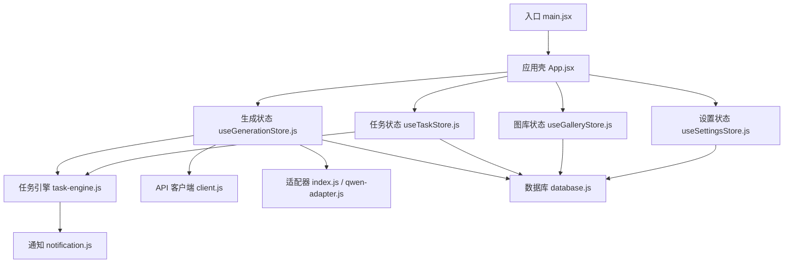
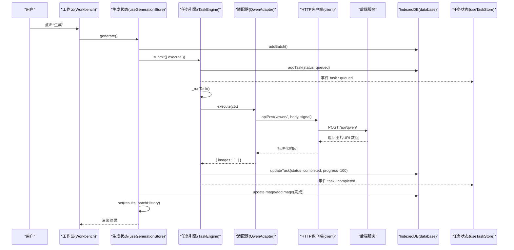
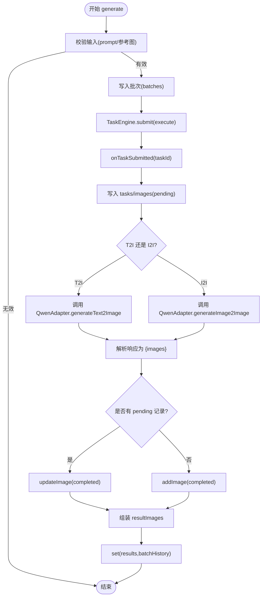
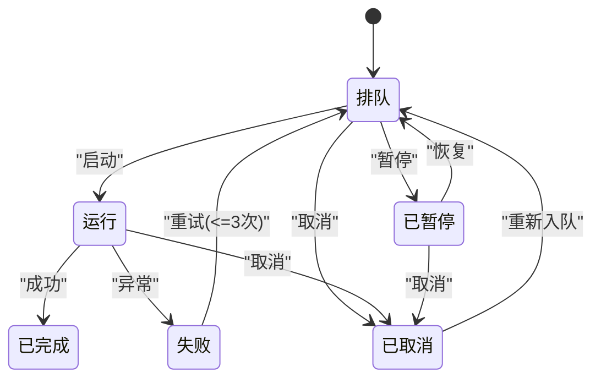
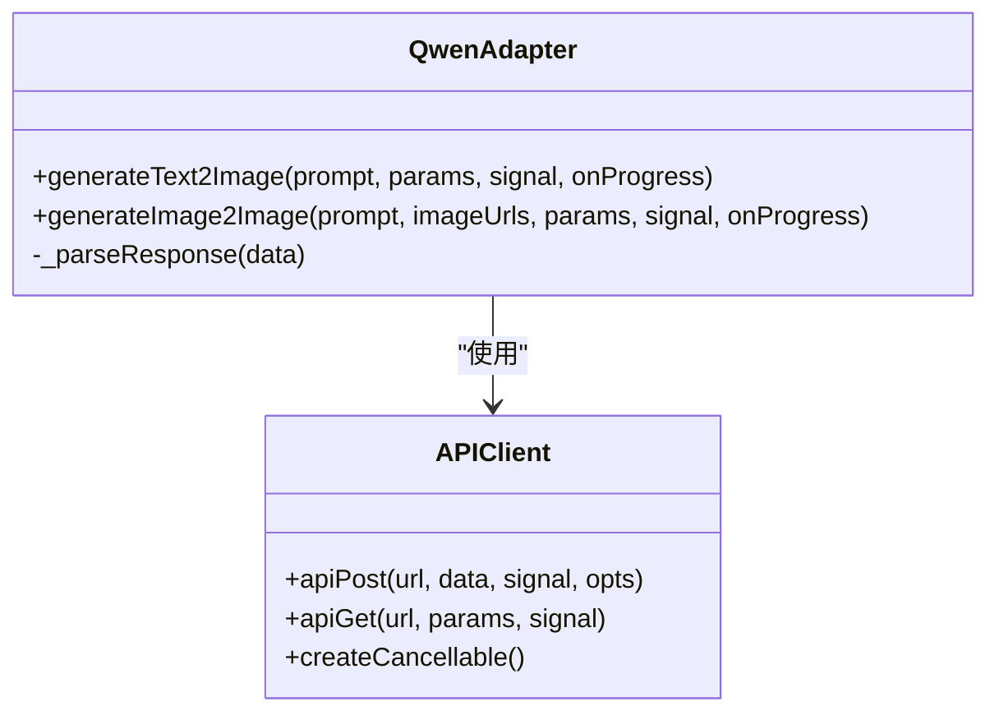
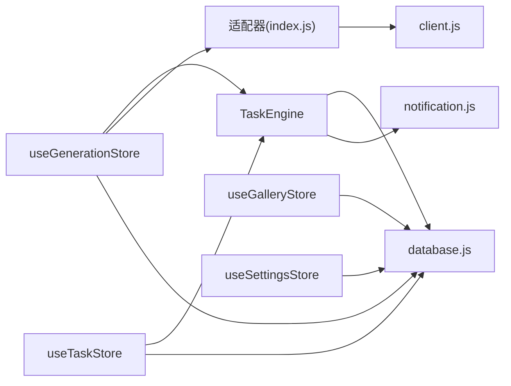

# 数据流设计

<cite>
**本文引用的文件**   
- [main.jsx](file://app/src/main.jsx)
- [App.jsx](file://app/src/App.jsx)
- [useGenerationStore.js](file://app/src/stores/useGenerationStore.js)
- [useTaskStore.js](file://app/src/stores/useTaskStore.js)
- [task-engine.js](file://app/src/services/task-engine.js)
- [database.js](file://app/src/db/database.js)
- [client.js](file://app/src/services/api/client.js)
- [index.js](file://app/src/services/api/index.js)
- [qwen-adapter.js](file://app/src/services/api/qwen-adapter.js)
- [models.js](file://app/src/constants/models.js)
- [notification.js](file://app/src/services/notification.js)
</cite>

## 目录
1. [引言](#引言)
2. [项目结构](#项目结构)
3. [核心组件](#核心组件)
4. [架构总览](#架构总览)
5. [详细组件分析](#详细组件分析)
6. [依赖关系分析](#依赖关系分析)
7. [性能考虑](#性能考虑)
8. [故障排查指南](#故障排查指南)
9. [结论](#结论)

## 引言
本文件面向 AI Image Studio 的数据流设计，聚焦以下目标：
- 描述应用内数据的流动路径、状态更新机制与跨模块同步策略
- 说明 Zustand 状态管理实现模式、异步数据处理流程与 IndexedDB 持久化机制
- 解释任务引擎的数据流转、API 调用数据格式转换与重试/取消等策略
- 提供数据流图与状态转换图，展示关键业务流程中的数据变化
- 讨论数据一致性保证、错误处理机制与性能优化策略

## 项目结构
应用采用“页面 + Store + 服务层 + 数据库层”的分层组织方式：
- 入口与初始化：main.jsx 负责打开 IndexedDB、加载设置后挂载 React
- 应用壳：App.jsx 路由、全局 UI 面板、任务指示器、通知权限申请
- 状态层（Zustand）：useGenerationStore、useTaskStore、useGalleryStore、useSettingsStore
- 服务层：TaskEngine（任务调度）、API Client（统一 HTTP 客户端与适配器工厂）、通知服务
- 数据层：IndexedDB（Dexie），包含 images、batches、tasks、settings 等表

图表来源
- [main.jsx:12-29](file://app/src/main.jsx#L12-L29)
- [App.jsx:245-350](file://app/src/App.jsx#L245-L350)
- [useGenerationStore.js:112-290](file://app/src/stores/useGenerationStore.js#L112-L290)
- [useTaskStore.js:39-64](file://app/src/stores/useTaskStore.js#L39-L64)
- [task-engine.js:33-81](file://app/src/services/task-engine.js#L33-L81)
- [client.js:18-88](file://app/src/services/api/client.js#L18-L88)
- [index.js:20-31](file://app/src/services/api/index.js#L20-L31)
- [qwen-adapter.js:51-105](file://app/src/services/api/qwen-adapter.js#L51-L105)
- [database.js:22-31](file://app/src/db/database.js#L22-L31)
- [notification.js:78-103](file://app/src/services/notification.js#L78-L103)

章节来源
- [main.jsx:12-29](file://app/src/main.jsx#L12-L29)
- [App.jsx:245-350](file://app/src/App.jsx#L245-L350)

## 核心组件
- 生成状态 store（useGenerationStore）
  - 职责：维护当前模型、提示词、参考图、参数、结果、批次历史、生成进度与错误；发起生成任务并持久化结果
  - 关键点：通过 TaskEngine.submit 提交执行函数；在适配器回调中先落库“待处理”记录，完成后更新为“已完成”
- 任务状态 store（useTaskStore）
  - 职责：桥接 TaskEngine 事件到 Zustand 状态，提供任务增删改查、重试/取消/暂停/恢复等操作
  - 关键点：initBridge 订阅 Engine 事件，刷新任务列表以驱动 UI
- 任务引擎（TaskEngine）
  - 职责：并发控制、FIFO 队列、指数退避重试、状态机、进度上报、自动持久化、浏览器通知
  - 关键点：execute(ctx) 由上层传入；ctx.onProgress 可被适配器或业务逻辑调用
- API 客户端（client）
  - 职责：统一 axios 实例、拦截器（错误归一化、自动重试）、长耗时请求专用实例、AbortController 支持
- 适配器（QwenAdapter 等）
  - 职责：将通用参数转换为具体厂商 API 的请求体，解析响应为标准格式 { images: [{ url, ... }] }
- 数据库（database）
  - 职责：基于 Dexie 的 images、batches、tasks、settings 等表的 CRUD 与查询聚合

章节来源
- [useGenerationStore.js:112-290](file://app/src/stores/useGenerationStore.js#L112-L290)
- [useTaskStore.js:22-64](file://app/src/stores/useTaskStore.js#L22-L64)
- [task-engine.js:33-81](file://app/src/services/task-engine.js#L33-L81)
- [client.js:18-88](file://app/src/services/api/client.js#L18-L88)
- [qwen-adapter.js:51-105](file://app/src/services/api/qwen-adapter.js#L51-L105)
- [database.js:22-31](file://app/src/db/database.js#L22-L31)

## 架构总览
整体数据流遵循“UI -> Store -> TaskEngine -> Adapter -> API Client -> 后端 -> 返回 -> Store -> DB -> UI”的闭环。

图表来源
- [useGenerationStore.js:112-290](file://app/src/stores/useGenerationStore.js#L112-L290)
- [task-engine.js:222-297](file://app/src/services/task-engine.js#L222-L297)
- [qwen-adapter.js:60-105](file://app/src/services/api/qwen-adapter.js#L60-L105)
- [client.js:112-116](file://app/src/services/api/client.js#L112-L116)
- [database.js:235-274](file://app/src/db/database.js#L235-L274)
- [useTaskStore.js:39-64](file://app/src/stores/useTaskStore.js#L39-L64)

## 详细组件分析

### 生成流程数据流（文本/图像到图像）
- 触发点：用户在 Workbench 调用 useGenerationStore.generate()
- 步骤要点：
  - 创建批次记录（batches）
  - 构建 execute 函数，内部根据是否含参考图选择 T2I/I2I 分支
  - 在适配器回调 onTaskSubmitted 时，立即写入 tasks/images 的“pending”记录，确保刷新不丢失
  - 适配器调用成功后，更新 pending 记录为 completed，并追加其他图片记录
  - 更新本地 results 与 batchHistory，供 UI 展示
- 异常路径：
  - 适配器抛出异常时，若已存在 pending 记录则标记 failed
  - 最终在 finally 中重置 isGenerating 标志

图表来源
- [useGenerationStore.js:112-290](file://app/src/stores/useGenerationStore.js#L112-L290)
- [qwen-adapter.js:60-105](file://app/src/services/api/qwen-adapter.js#L60-L105)
- [database.js:43-91](file://app/src/db/database.js#L43-L91)

章节来源
- [useGenerationStore.js:112-290](file://app/src/stores/useGenerationStore.js#L112-L290)

### 任务引擎状态机与并发控制
- 状态定义与合法转移：
  - queued -> running | cancelled | paused
  - running -> completed | failed | cancelled
  - paused -> queued | cancelled
  - failed -> queued（重试）
  - completed/cancelled 无出边
- 并发与队列：
  - 最大并发数可配置，默认 3
  - FIFO 队列，空闲时从队列取任务执行
- 重试策略：
  - 指数退避，最多 3 次
  - 仅对 5xx、网络错误、超时等可重试错误生效
- 事件总线：
  - 对外暴露 task:queued/started/progress/completed/failed/cancelled/paused/retry 事件
  - useTaskStore.initBridge 订阅这些事件并刷新任务列表

图表来源
- [task-engine.js:24-31](file://app/src/services/task-engine.js#L24-L31)
- [task-engine.js:215-297](file://app/src/services/task-engine.js#L215-L297)

章节来源
- [task-engine.js:33-81](file://app/src/services/task-engine.js#L33-L81)
- [task-engine.js:215-297](file://app/src/services/task-engine.js#L215-L297)
- [useTaskStore.js:39-64](file://app/src/stores/useTaskStore.js#L39-L64)

### API 客户端与适配器数据转换
- HTTP 客户端
  - 统一 baseURL=/api，请求头 application/json
  - 拦截器：错误归一化、自动重试（指数退避，最多 3 次）、支持 AbortController
  - 长耗时专用实例用于同步生成接口（如 Qwen）
- 适配器（以 Qwen 为例）
  - 将通用参数 size/n/seed 等规范化为厂商要求（尺寸对齐、可选 seed）
  - 构造消息体 messages/content，区分 T2I/I2I
  - 解析响应 output.choices[*].message.content[*].image 为统一 { images:[{url}] }
  - 通过 onProgress 上报进度（10/90/100）

图表来源
- [qwen-adapter.js:51-105](file://app/src/services/api/qwen-adapter.js#L51-L105)
- [client.js:112-116](file://app/src/services/api/client.js#L112-L116)

章节来源
- [client.js:18-88](file://app/src/services/api/client.js#L18-L88)
- [qwen-adapter.js:60-105](file://app/src/services/api/qwen-adapter.js#L60-L105)
- [index.js:20-31](file://app/src/services/api/index.js#L20-L31)

### 数据库持久化与索引
- 表结构与索引
  - images：按 createdAt 排序，支持 folderId+createdAt 复合索引
  - batches：按 createdAt 倒序
  - tasks：按 status+createdAt 复合索引，便于筛选活跃任务
  - settings：key/value 配置
- 常用操作
  - 批量插入/更新、分页/过滤、统计聚合
  - 删除文件夹时级联移动子项图片至根目录

章节来源
- [database.js:22-31](file://app/src/db/database.js#L22-L31)
- [database.js:56-76](file://app/src/db/database.js#L56-L76)
- [database.js:243-274](file://app/src/db/database.js#L243-L274)

### 通知与外部交互
- 启动时申请系统通知权限
- 任务完成/失败时通过浏览器 Notification 推送摘要信息

章节来源
- [App.jsx:282-284](file://app/src/App.jsx#L282-L284)
- [notification.js:78-103](file://app/src/services/notification.js#L78-L103)

## 依赖关系分析
- 低耦合分层
  - Store 仅依赖 TaskEngine、API 适配器和数据库层，不直接耦合 UI
  - TaskEngine 仅依赖数据库与通知服务，保持调度职责单一
  - 适配器仅依赖 HTTP 客户端，屏蔽厂商差异
- 可能的循环依赖风险
  - 当前未见显式循环引用；Store 与 TaskEngine 通过事件解耦
- 外部依赖
  - Axios（HTTP）、Dexie（IndexedDB）、uuid（ID 生成）

图表来源
- [useGenerationStore.js:112-290](file://app/src/stores/useGenerationStore.js#L112-L290)
- [useTaskStore.js:39-64](file://app/src/stores/useTaskStore.js#L39-L64)
- [task-engine.js:33-81](file://app/src/services/task-engine.js#L33-L81)
- [client.js:18-88](file://app/src/services/api/client.js#L18-L88)
- [database.js:22-31](file://app/src/db/database.js#L22-L31)

章节来源
- [useGenerationStore.js:112-290](file://app/src/stores/useGenerationStore.js#L112-L290)
- [useTaskStore.js:39-64](file://app/src/stores/useTaskStore.js#L39-L64)
- [task-engine.js:33-81](file://app/src/services/task-engine.js#L33-L81)

## 性能考虑
- 并发与吞吐
  - 任务引擎默认最大并发 3，可通过设置调整；避免同时过多长耗时请求导致浏览器卡顿
- 请求超时与重试
  - 短请求使用默认 60s 超时；同步生成接口使用 5 分钟超时
  - 自动重试仅在可重试错误下触发，避免雪崩
- 前端缓存策略
  - 图片 URL 有效期有限（例如 24h），建议在服务端或 CDN 侧做缓存；前端可在需要时下载并落盘（IndexedDB Blob）以减少重复网络开销
- 数据库查询优化
  - 利用复合索引（folderId+createdAt、status+createdAt）提升筛选与排序性能
  - 分页/限制返回条数，避免一次性加载大量图片
- UI 渲染优化
  - 使用 Zustand + Immer 进行不可变更新，减少不必要的重渲染
  - 懒加载页面与骨架屏提升首屏体验

[本节为通用指导，无需特定文件来源]

## 故障排查指南
- 常见问题定位
  - 生成失败：检查 TaskEngine 的失败事件与错误信息；确认适配器抛出的错误是否来自网络或 5xx
  - 任务未推进：查看任务状态是否为 paused/cancelled；必要时手动 resume/retry
  - 结果未显示：确认 pending 记录是否被正确更新为 completed；检查 results 与 batchHistory 是否更新
- 日志与断点
  - 关注控制台输出中的 “[GenerationStore]”、“[TaskEngine]”、“[QwenAdapter]” 等标签
  - 在 adapter 的 onProgress 与 parseResponse 处设置断点验证数据形态
- 恢复与重试
  - 对于可重试错误，引擎会自动重试；如需立即重试，调用 TaskEngine.retry 或通过 useTaskStore.retryTask
  - 取消任务会中断正在进行的请求（AbortController），并更新状态为 cancelled

章节来源
- [task-engine.js:259-305](file://app/src/services/task-engine.js#L259-L305)
- [useTaskStore.js:109-157](file://app/src/stores/useTaskStore.js#L109-L157)
- [useGenerationStore.js:283-290](file://app/src/stores/useGenerationStore.js#L283-L290)

## 结论
AI Image Studio 的数据流围绕“生成任务”展开，采用 Zustand 作为状态中枢、TaskEngine 作为异步调度器、适配器封装多厂商 API、IndexedDB 保障离线与刷新鲁棒性。通过事件驱动的 TaskEngine 与统一的 HTTP 客户端，系统在并发控制、重试与错误归一化方面具备良好扩展性与稳定性。结合合理的数据库索引与前端缓存策略，可在大规模图片生成场景下维持良好的用户体验。