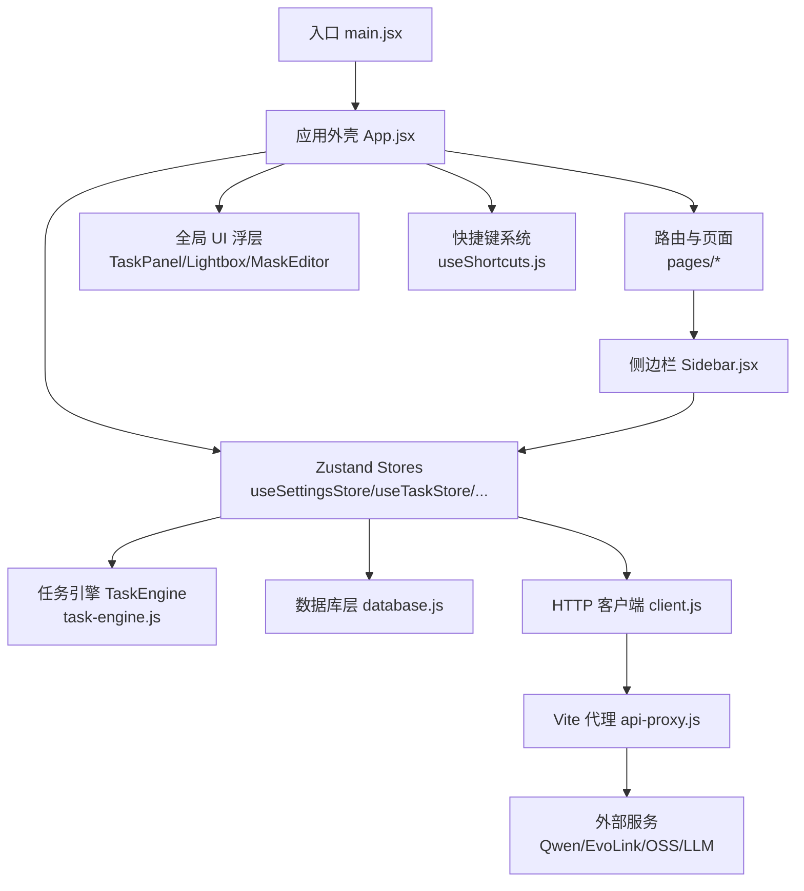
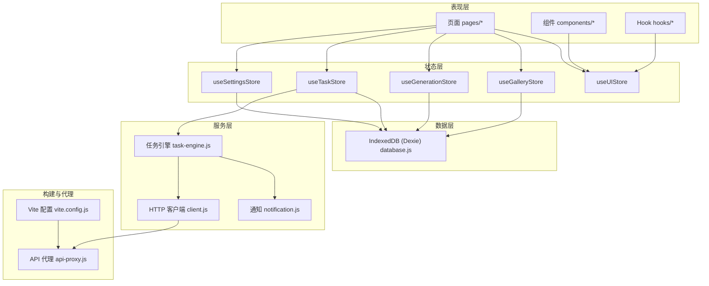
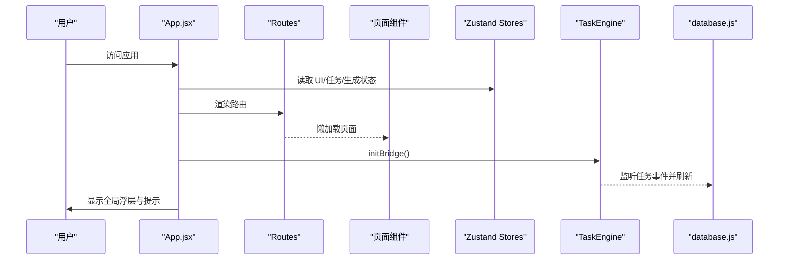
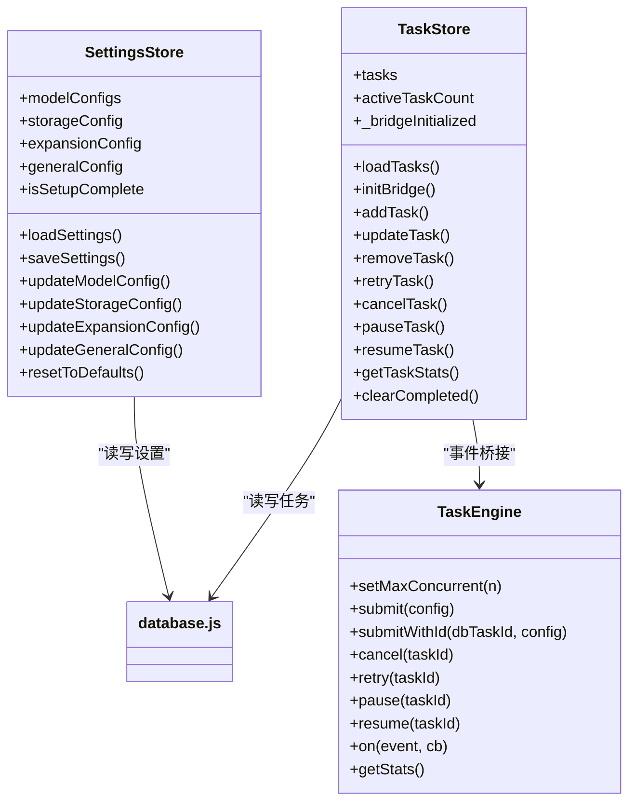
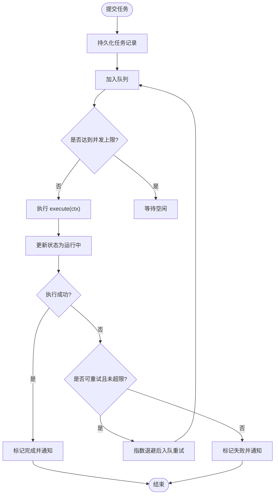
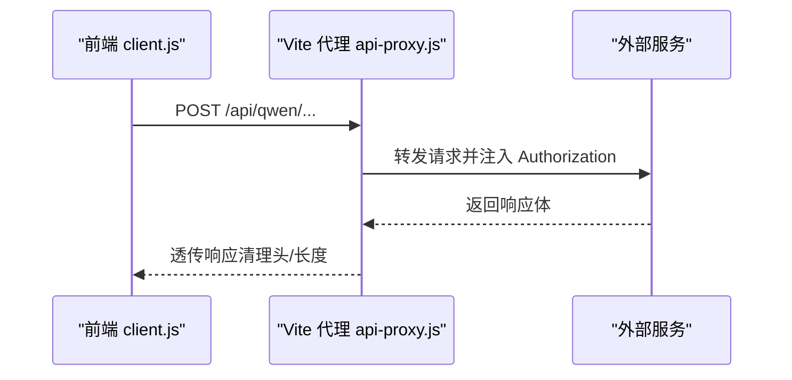
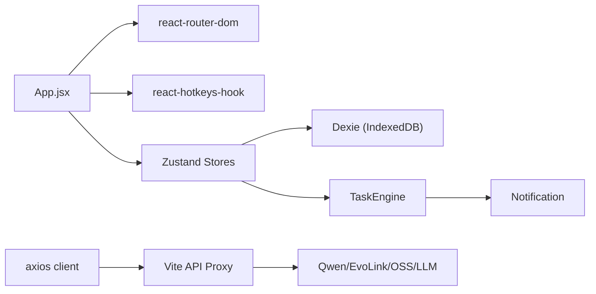

# 整体架构概览

<cite>
**本文引用的文件**   
- [README.md](file://README.md)
- [package.json](file://app/package.json)
- [vite.config.js](file://app/vite.config.js)
- [main.jsx](file://app/src/main.jsx)
- [App.jsx](file://app/src/App.jsx)
- [database.js](file://app/src/db/database.js)
- [useSettingsStore.js](file://app/src/stores/useSettingsStore.js)
- [useTaskStore.js](file://app/src/stores/useTaskStore.js)
- [task-engine.js](file://app/src/services/task-engine.js)
- [client.js](file://app/src/services/api/client.js)
- [api-proxy.js](file://app/src/server/api-proxy.js)
- [notification.js](file://app/src/services/notification.js)
- [useShortcuts.js](file://app/src/hooks/useShortcuts.js)
- [models.js](file://app/src/constants/models.js)
- [Sidebar.jsx](file://app/src/components/Sidebar.jsx)
</cite>

## 目录
1. [简介](#简介)
2. [项目结构](#项目结构)
3. [核心组件](#核心组件)
4. [架构总览](#架构总览)
5. [详细组件分析](#详细组件分析)
6. [依赖关系分析](#依赖关系分析)
7. [性能考量](#性能考量)
8. [故障排查指南](#故障排查指南)
9. [结论](#结论)
10. [附录](#附录)

## 简介
AI Image Studio 是一款面向多模型统一调用的专业级 AI 图像生成工作站，提供提示词工程、批量生成、知识库 RAG 与完整资产管理能力。前端采用 React + Vite 构建，使用 Zustand 进行全局状态管理，Dexie（IndexedDB）作为本地持久化存储，并通过自定义 Vite 插件实现开发期 API 代理，屏蔽敏感密钥并统一错误处理与重试策略。

本概览文档从系统架构、分层模式、组件层次、入口与路由、错误边界、全局状态、模块化与懒加载、性能优化、技术选型权衡与可扩展性等方面进行全面阐述，帮助读者快速理解并扩展应用。

## 项目结构
- 应用入口：main.jsx 负责初始化数据库与设置，随后挂载 React 根节点。
- 应用外壳：App.jsx 提供错误边界、快捷键上下文、路由容器、全局 UI 浮层（任务面板、灯箱、遮罩编辑器等）。
- 页面与组件：pages 下为功能页面；components 下为通用 UI 与业务组件；hooks 提供可复用交互逻辑。
- 状态管理：stores 下基于 Zustand 的领域 Store（设置、任务、图库、生成、UI）。
- 服务层：services 包含 HTTP 客户端、任务引擎、通知等。
- 数据层：db/database.js 封装 Dexie 表结构与 CRUD。
- 配置与常量：constants/models.js 定义模型能力与默认参数。
- 构建与代理：vite.config.js 引入 api-proxy 插件，将 /api/* 转发至后端或第三方服务。

图表来源
- [main.jsx:1-32](file://app/src/main.jsx#L1-L32)
- [App.jsx:1-364](file://app/src/App.jsx#L1-L364)
- [useSettingsStore.js:1-162](file://app/src/stores/useSettingsStore.js#L1-L162)
- [useTaskStore.js:1-173](file://app/src/stores/useTaskStore.js#L1-L173)
- [task-engine.js:1-319](file://app/src/services/task-engine.js#L1-L319)
- [database.js:1-339](file://app/src/db/database.js#L1-L339)
- [client.js:1-146](file://app/src/services/api/client.js#L1-L146)
- [api-proxy.js:1-190](file://app/src/server/api-proxy.js#L1-L190)
- [Sidebar.jsx:1-371](file://app/src/components/Sidebar.jsx#L1-L371)

章节来源
- [README.md:1-10](file://README.md#L1-L10)
- [package.json:1-30](file://app/package.json#L1-L30)
- [vite.config.js:1-13](file://app/vite.config.js#L1-L13)
- [main.jsx:1-32](file://app/src/main.jsx#L1-L32)
- [App.jsx:1-364](file://app/src/App.jsx#L1-L364)

## 核心组件
- 应用启动与引导
  - 在应用启动时打开 IndexedDB，预加载持久化设置，再渲染 React 根节点，确保首屏可用。
- 应用外壳与路由
  - 通过 HashRouter 管理路由，使用 Suspense + lazy 对页面模块进行懒加载，配合 LoadingSkeleton 提升首屏体验。
  - 顶层 ErrorBoundary 捕获渲染异常并提供“重新加载”恢复路径。
- 全局状态管理
  - 使用 Zustand 拆分领域 Store：设置（含模型配置、存储策略、通用配置）、任务（队列与事件桥接）、图库、生成流程、UI 状态。
  - useSettingsStore 负责模型能力与默认参数、存储策略（热/冷）、扩展 LLM 配置、主题语言等，并持久化到 IndexedDB。
  - useTaskStore 与 TaskEngine 事件桥接，刷新任务列表与活跃计数，支持增删改查、重试、取消、暂停/恢复等操作。
- 后台任务调度
  - TaskEngine 单例维护并发上限、FIFO 队列、指数退避重试、状态机流转、进度上报与浏览器通知。
- HTTP 客户端与代理
  - axios 实例统一 baseURL、超时、拦截器（自动重试、错误归一化、AbortController 支持），并提供长耗时专用实例。
  - Vite 插件 api-proxy 在开发环境注入中间件，将 /api/qwen、/api/evolink、/api/oss、/api/llm 转发至对应后端，并在请求头中注入鉴权信息。
- 键盘快捷键
  - 基于 react-hotkeys-hook 的 Scope 机制，按优先级（遮罩编辑器 > 灯箱 > 工作台 > 图库 > 全局）动态启用/禁用，提供快捷导航与操作。
- 侧边栏与文件夹树
  - 提供导航、文件夹树形结构、拖拽移动图片、右键菜单、重命名/删除确认等能力，并与图库 Store 联动。

章节来源
- [main.jsx:1-32](file://app/src/main.jsx#L1-L32)
- [App.jsx:1-364](file://app/src/App.jsx#L1-L364)
- [useSettingsStore.js:1-162](file://app/src/stores/useSettingsStore.js#L1-L162)
- [useTaskStore.js:1-173](file://app/src/stores/useTaskStore.js#L1-L173)
- [task-engine.js:1-319](file://app/src/services/task-engine.js#L1-L319)
- [client.js:1-146](file://app/src/services/api/client.js#L1-L146)
- [api-proxy.js:1-190](file://app/src/server/api-proxy.js#L1-L190)
- [useShortcuts.js:1-185](file://app/src/hooks/useShortcuts.js#L1-L185)
- [Sidebar.jsx:1-371](file://app/src/components/Sidebar.jsx#L1-L371)

## 架构总览
应用采用清晰的分层架构：
- 表现层（React 组件与页面）：负责用户交互与视图渲染。
- 状态层（Zustand Stores）：集中管理领域状态，提供订阅与更新。
- 服务层（HTTP 客户端、任务引擎、通知）：封装网络请求、任务调度与系统通知。
- 数据层（IndexedDB/Dexie）：持久化图片、批次、会话、文件夹、任务、设置、案例包等。
- 构建与代理（Vite + 自定义插件）：开发期统一代理外部 API，屏蔽密钥并简化跨域问题。

图表来源
- [vite.config.js:1-13](file://app/vite.config.js#L1-L13)
- [api-proxy.js:1-190](file://app/src/server/api-proxy.js#L1-L190)
- [client.js:1-146](file://app/src/services/api/client.js#L1-L146)
- [task-engine.js:1-319](file://app/src/services/task-engine.js#L1-L319)
- [notification.js:1-113](file://app/src/services/notification.js#L1-L113)
- [database.js:1-339](file://app/src/db/database.js#L1-L339)
- [useSettingsStore.js:1-162](file://app/src/stores/useSettingsStore.js#L1-L162)
- [useTaskStore.js:1-173](file://app/src/stores/useTaskStore.js#L1-L173)

## 详细组件分析

### 应用外壳与路由（App.jsx）
- 错误边界：捕获子树渲染异常，提供友好错误页与一键重载。
- 路由：HashRouter + Routes，懒加载各页面，Suspense 包裹显示骨架屏。
- 全局浮层：任务指示器、任务面板、Toast、快捷键覆盖层、全局灯箱、遮罩编辑器。
- 快捷键上下文：HotkeysProvider 初始作用域，结合 useGlobalShortcuts 与 useShortcutScopes 实现作用域切换。
- 初始化：挂载时加载任务、初始化任务引擎桥接、请求通知权限。

图表来源
- [App.jsx:1-364](file://app/src/App.jsx#L1-L364)
- [useTaskStore.js:1-173](file://app/src/stores/useTaskStore.js#L1-L173)
- [task-engine.js:1-319](file://app/src/services/task-engine.js#L1-L319)
- [database.js:1-339](file://app/src/db/database.js#L1-L339)

章节来源
- [App.jsx:1-364](file://app/src/App.jsx#L1-L364)

### 全局状态管理（Zustand Stores）
- useSettingsStore
  - 管理模型配置、存储策略、扩展 LLM 配置、通用设置与向导完成标记。
  - 提供增量更新与持久化方法，首次加载合并已保存配置。
- useTaskStore
  - 维护任务列表与活跃计数，桥接 TaskEngine 事件，提供任务生命周期操作。
  - 失败/取消/暂停/恢复均回写数据库并刷新 UI。
- 其他 Store（生成、图库、UI）
  - 分别承载生成流程状态、图库资源与筛选、UI 浮层与主题等。

图表来源
- [useSettingsStore.js:1-162](file://app/src/stores/useSettingsStore.js#L1-L162)
- [useTaskStore.js:1-173](file://app/src/stores/useTaskStore.js#L1-L173)
- [task-engine.js:1-319](file://app/src/services/task-engine.js#L1-L319)
- [database.js:1-339](file://app/src/db/database.js#L1-L339)

章节来源
- [useSettingsStore.js:1-162](file://app/src/stores/useSettingsStore.js#L1-L162)
- [useTaskStore.js:1-173](file://app/src/stores/useTaskStore.js#L1-L173)

### 后台任务引擎（TaskEngine）
- 并发控制：可配置最大并发数，内部维护队列与活动任务集。
- 状态机：queued -> running -> completed/failed/cancelled/paused，支持失败重试与取消/暂停/恢复。
- 事件驱动：对外暴露 on/off 事件，供 Store 订阅以刷新 UI。
- 持久化：每次状态变更写入 IndexedDB，保证刷新后状态一致。
- 进度上报：execute(ctx) 可通过 ctx.onProgress(percent) 上报进度。

图表来源
- [task-engine.js:1-319](file://app/src/services/task-engine.js#L1-L319)
- [database.js:1-339](file://app/src/db/database.js#L1-L339)
- [notification.js:1-113](file://app/src/services/notification.js#L1-L113)

章节来源
- [task-engine.js:1-319](file://app/src/services/task-engine.js#L1-L319)

### HTTP 客户端与 API 代理
- axios 实例
  - 统一 baseURL、超时、Content-Type。
  - 响应拦截器实现自动重试（指数退避）、错误归一化、AbortController 支持。
  - 提供长耗时专用实例用于同步图像生成接口。
- Vite 代理插件
  - 在开发服务器注册中间件，将 /api/qwen、/api/evolink、/api/oss、/api/llm 转发至目标服务。
  - 自动注入鉴权头（Bearer Token 或 OSS 访问密钥），过滤不需要的响应头，避免重复解压导致的长度不一致。

图表来源
- [client.js:1-146](file://app/src/services/api/client.js#L1-L146)
- [api-proxy.js:1-190](file://app/src/server/api-proxy.js#L1-L190)

章节来源
- [client.js:1-146](file://app/src/services/api/client.js#L1-L146)
- [api-proxy.js:1-190](file://app/src/server/api-proxy.js#L1-L190)

### 键盘快捷键系统（useShortcuts.js）
- 基于 react-hotkeys-hook 的作用域机制，按优先级动态启用/禁用。
- 全局导航（G+W/G+G/G+K/G+T）、工作区生成（Cmd/Ctrl+Enter）、扩写提示词（E）、模型切换（1/2/3）等。
- 提供快捷键覆盖层展示所有分组与说明。

章节来源
- [useShortcuts.js:1-185](file://app/src/hooks/useShortcuts.js#L1-L185)

### 侧边栏与文件夹树（Sidebar.jsx）
- 导航项与分隔线，支持折叠/展开。
- 文件夹树形结构，支持创建根/子文件夹、重命名、删除（级联清理）、右键菜单、拖拽移动图片。
- 与图库 Store 联动，当前选中文件夹与 URL 查询参数保持一致。

章节来源
- [Sidebar.jsx:1-371](file://app/src/components/Sidebar.jsx#L1-L371)

## 依赖关系分析
- 模块耦合
  - App.jsx 聚合路由、全局 UI 与快捷键，低耦合地组合各 Store 与组件。
  - Store 之间职责清晰：设置、任务、图库、生成、UI 各自独立，通过 actions 与持久化层交互。
  - TaskEngine 与 Store 通过事件解耦，便于扩展新的事件类型。
- 外部依赖
  - React、ReactDOM、react-router-dom、react-hotkeys-hook、zustand、immer、dexie、axios、uuid、lucide-react。
  - 构建工具 Vite 与 @vitejs/plugin-react。
- 潜在循环依赖
  - 当前未发现直接循环引用；Store 仅依赖 db 与 services，页面与组件依赖 Store，单向依赖清晰。

图表来源
- [App.jsx:1-364](file://app/src/App.jsx#L1-L364)
- [useSettingsStore.js:1-162](file://app/src/stores/useSettingsStore.js#L1-L162)
- [useTaskStore.js:1-173](file://app/src/stores/useTaskStore.js#L1-L173)
- [task-engine.js:1-319](file://app/src/services/task-engine.js#L1-L319)
- [client.js:1-146](file://app/src/services/api/client.js#L1-L146)
- [api-proxy.js:1-190](file://app/src/server/api-proxy.js#L1-L190)

章节来源
- [package.json:1-30](file://app/package.json#L1-L30)
- [vite.config.js:1-13](file://app/vite.config.js#L1-L13)

## 性能考量
- 首屏与懒加载
  - 页面模块使用 lazy 与 Suspense 延迟加载，减少初始包体积；LoadingSkeleton 提升感知性能。
- 并发与重试
  - TaskEngine 限制最大并发，避免阻塞 UI；指数退避重试降低瞬时失败影响。
  - axios 拦截器内置重试与超时控制，长耗时接口使用专用实例。
- 本地缓存与索引
  - IndexedDB 通过 Dexie 建立复合索引（如 folderId+createdAt、status+createdAt），提高查询与分页效率。
- 渲染优化
  - Zustand 细粒度订阅，仅更新受影响组件；immer 简化不可变更新，减少不必要的重渲染。
- 构建优化
  - Vite 开发服务器严格端口与 host 配置，便于稳定调试；生产构建由 vite build 完成代码分割与压缩。

[本节为通用指导，无需特定文件来源]

## 故障排查指南
- 启动阶段
  - 若数据库初始化失败，应用仍会渲染但可能缺少持久化能力；检查控制台日志与 IndexedDB 状态。
- 路由与懒加载
  - 若页面空白，检查路由路径与懒加载模块是否正确导出；查看 Suspense fallback 是否正常显示。
- 任务执行
  - 任务失败时查看 TaskEngine 事件与 IndexedDB 任务记录；确认重试次数与错误类型（网络/5xx）。
- 网络请求
  - 检查代理中间件是否生效（开发环境为 Vite 插件，生产环境为 Electron 内嵌服务器），确认环境变量中的密钥与基础地址；观察代理日志输出。若环境变量加载失败，检查 .env 文件路径是否正确。
- 快捷键冲突
  - 确认作用域开关逻辑，必要时在覆盖层查看当前启用的作用域与快捷键映射。

章节来源
- [main.jsx:1-32](file://app/src/main.jsx#L1-L32)
- [App.jsx:1-364](file://app/src/App.jsx#L1-L364)
- [task-engine.js:1-319](file://app/src/services/task-engine.js#L1-L319)
- [client.js:1-146](file://app/src/services/api/client.js#L1-L146)
- [api-proxy.js:1-190](file://app/src/server/api-proxy.js#L1-L190)
- [useShortcuts.js:1-185](file://app/src/hooks/useShortcuts.js#L1-L185)

## 结论
AI Image Studio 采用清晰的分层与模块化设计，通过 Zustand 统一管理状态、TaskEngine 协调后台任务、Dexie 持久化关键数据，并以 Vite 代理屏蔽外部服务细节。该架构具备良好的可扩展性与可维护性，适合持续迭代与功能扩展。建议在后续版本中继续完善错误上报、监控指标与国际化方案，进一步提升用户体验与稳定性。

[本节为总结性内容，无需特定文件来源]

## 附录
- 技术栈选择原因
  - React + Vite：生态成熟、构建速度快、插件体系丰富。
  - Zustand：轻量、直观、易于与 immer 集成，适合中小型应用的全局状态管理。
  - Dexie（IndexedDB）：浏览器原生离线存储，适合图片元数据与任务记录的持久化。
  - axios：统一的 HTTP 客户端，拦截器与重试机制完善。
  - react-hotkeys-hook：作用域化的快捷键管理，便于复杂交互场景。
- 架构决策权衡
  - 使用 HashRouter 而非 BrowserRouter：便于静态部署与分享链接。
  - 开发期代理而非服务端网关：简化密钥管理与跨域问题，利于本地调试。
  - 任务引擎与 Store 解耦：通过事件桥接，避免强耦合，便于替换或扩展调度策略。
- 可扩展性设计
  - 模型配置集中在 constants/models.js，新增模型只需扩展配置与适配器。
  - Store 按领域划分，新增功能可新增 Store 并在页面中订阅。
  - TaskEngine 支持任意 execute 函数，便于接入新的异步任务类型。

章节来源
- [package.json:1-30](file://app/package.json#L1-L30)
- [models.js:1-106](file://app/src/constants/models.js#L1-L106)
- [useSettingsStore.js:1-162](file://app/src/stores/useSettingsStore.js#L1-L162)
- [task-engine.js:1-319](file://app/src/services/task-engine.js#L1-L319)
- [api-proxy.js:1-190](file://app/src/server/api-proxy.js#L1-L190)