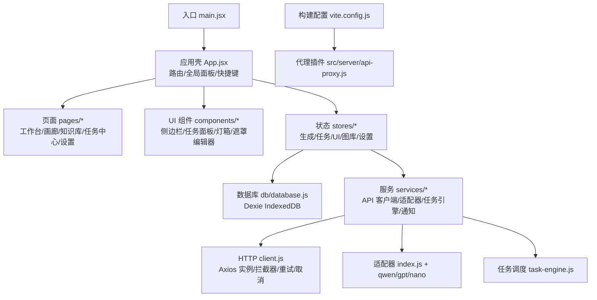
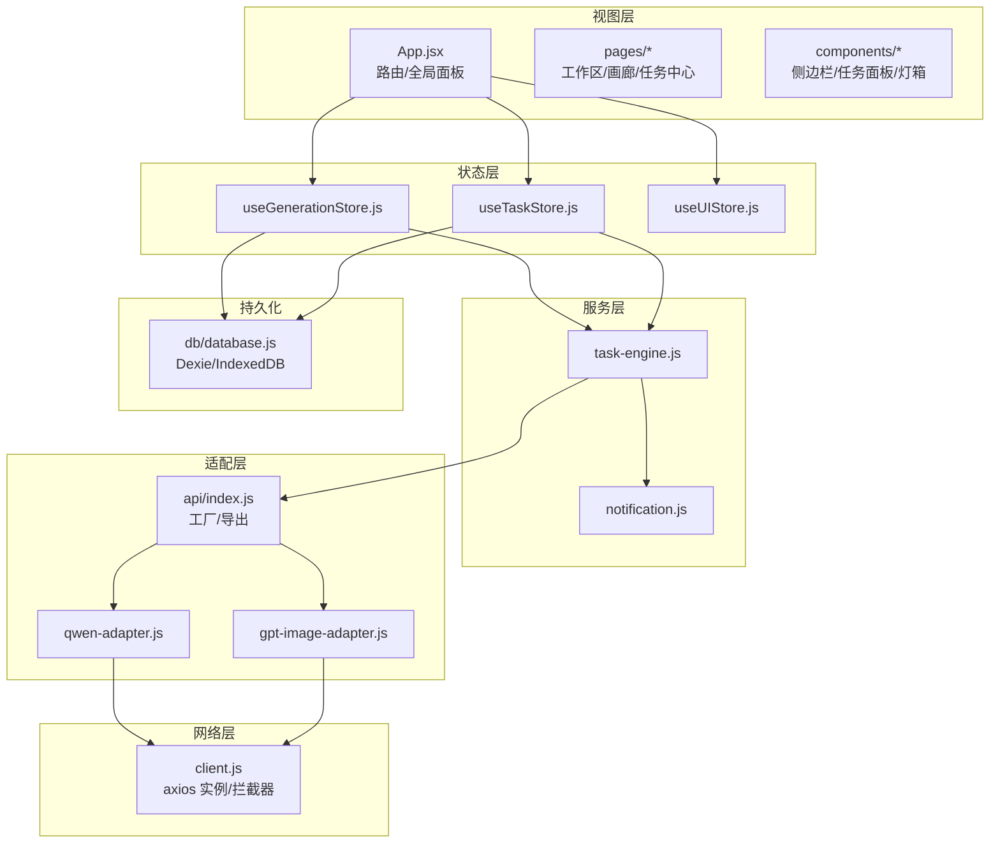
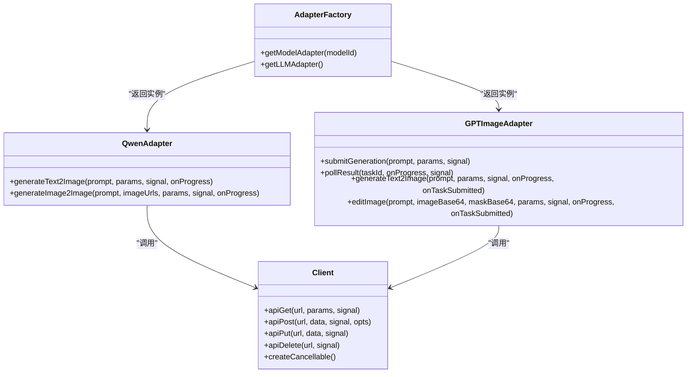
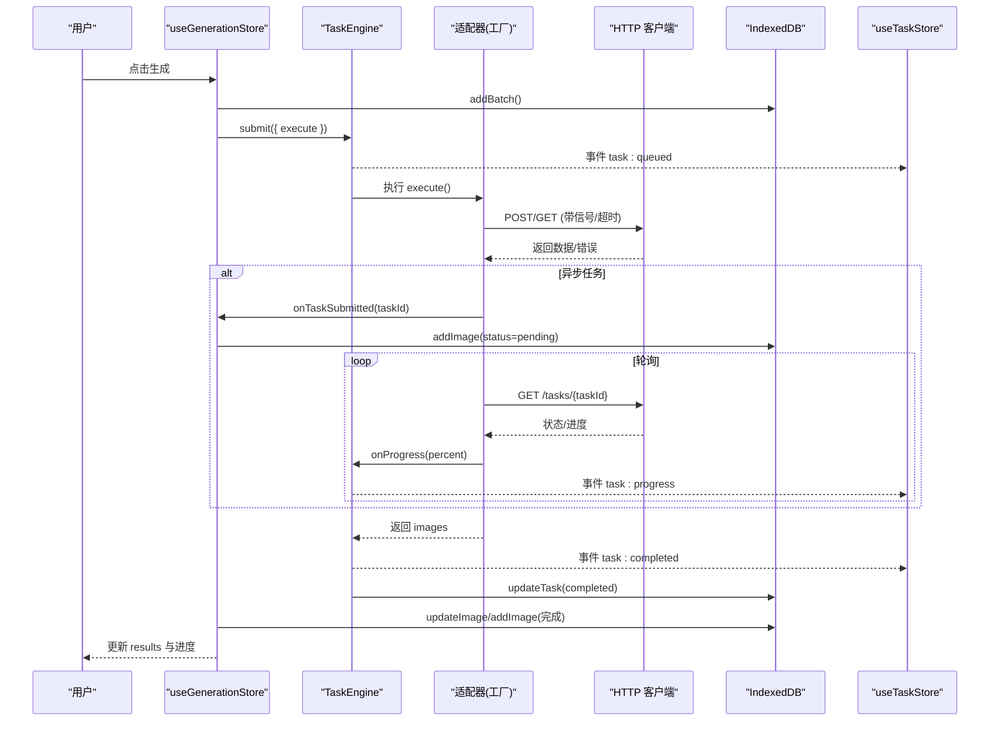
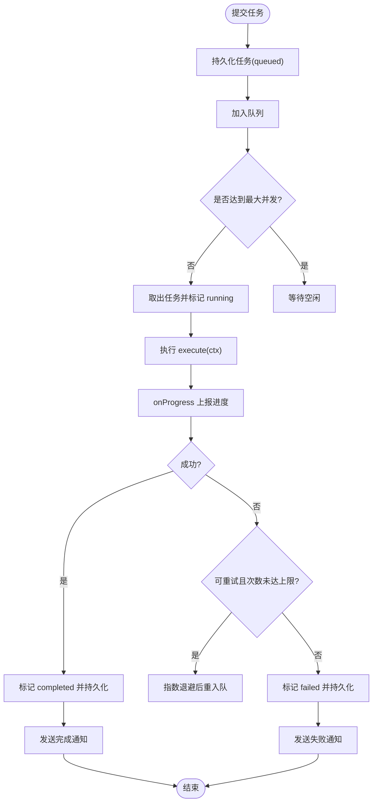
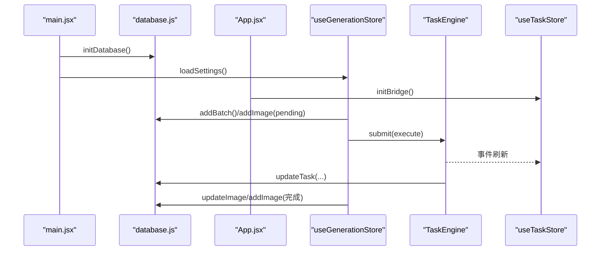
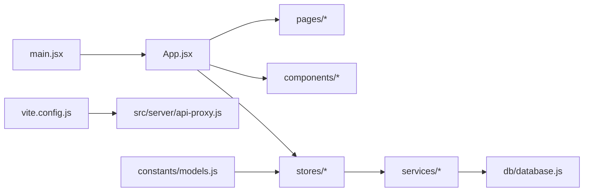
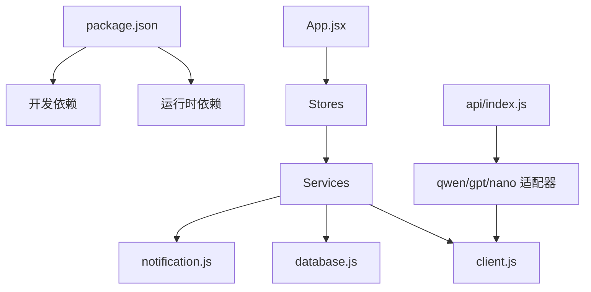

# 架构设计

<cite>
**本文引用的文件**
- [README.md](file://README.md)
- [package.json](file://app/package.json)
- [vite.config.js](file://app/vite.config.js)
- [main.jsx](file://app/src/main.jsx)
- [App.jsx](file://app/src/App.jsx)
- [database.js](file://app/src/db/database.js)
- [client.js](file://app/src/services/api/client.js)
- [index.js](file://app/src/services/api/index.js)
- [qwen-adapter.js](file://app/src/services/api/qwen-adapter.js)
- [gpt-image-adapter.js](file://app/src/services/api/gpt-image-adapter.js)
- [task-engine.js](file://app/src/services/task-engine.js)
- [useTaskStore.js](file://app/src/stores/useTaskStore.js)
- [useGenerationStore.js](file://app/src/stores/useGenerationStore.js)
- [useUIStore.js](file://app/src/stores/useUIStore.js)
- [notification.js](file://app/src/services/notification.js)
- [models.js](file://app/src/constants/models.js)
</cite>

## 目录
1. [引言](#引言)
2. [项目结构](#项目结构)
3. [核心组件](#核心组件)
4. [架构总览](#架构总览)
5. [详细组件分析](#详细组件分析)
6. [依赖关系分析](#依赖关系分析)
7. [性能考虑](#性能考虑)
8. [故障排查指南](#故障排查指南)
9. [结论](#结论)
10. [附录](#附录)

## 引言
本文件为 AI Image Studio 的架构设计文档，面向前端应用的整体结构与分层设计、适配器模式在 API 层的应用、状态管理架构、数据流设计与任务调度机制。同时涵盖技术决策权衡、系统边界与扩展点、性能优化策略、安全考量与可维护性原则，并配以架构图与组件关系图，帮助读者快速理解系统全貌与关键实现路径。

## 项目结构
项目采用 Vite + React 的前端工程化方案，使用 Zustand 进行全局状态管理，Dexie（IndexedDB）作为本地持久化存储，通过 Axios 封装 HTTP 客户端，并以适配器模式统一多模型 API 调用。开发服务器通过自定义插件代理外部服务请求。

图表来源
- [main.jsx:1-32](file://app/src/main.jsx#L1-L32)
- [App.jsx:1-364](file://app/src/App.jsx#L1-L364)
- [database.js:1-339](file://app/src/db/database.js#L1-L339)
- [client.js:1-146](file://app/src/services/api/client.js#L1-L146)
- [index.js:1-39](file://app/src/services/api/index.js#L1-L39)
- [qwen-adapter.js:1-209](file://app/src/services/api/qwen-adapter.js#L1-L209)
- [gpt-image-adapter.js:1-336](file://app/src/services/api/gpt-image-adapter.js#L1-L336)
- [task-engine.js:1-319](file://app/src/services/task-engine.js#L1-L319)
- [vite.config.js:1-13](file://app/vite.config.js#L1-L13)

章节来源
- [README.md:1-10](file://README.md#L1-L10)
- [package.json:1-30](file://app/package.json#L1-L30)
- [vite.config.js:1-13](file://app/vite.config.js#L1-L13)
- [main.jsx:1-32](file://app/src/main.jsx#L1-L32)
- [App.jsx:1-364](file://app/src/App.jsx#L1-L364)

## 核心组件
- 应用壳与路由：负责全局布局、懒加载页面、全局快捷方式、任务指示器、灯箱与遮罩编辑器的挂载。
- 状态管理：Zustand 分域 store（生成、任务、UI），以事件桥接后台任务状态到 UI。
- 数据持久化：Dexie 封装 IndexedDB，提供图片、批次、会话、文件夹、任务、设置等表操作。
- API 层：Axios 统一客户端，带重试、超时、取消；适配器工厂按模型 id 返回具体实现。
- 任务调度：单例 TaskEngine 管理并发队列、状态机、进度上报、失败重试与浏览器通知。
- 通知服务：封装浏览器 Notification API，用于任务完成/失败提醒。

章节来源
- [App.jsx:1-364](file://app/src/App.jsx#L1-L364)
- [useGenerationStore.js:1-360](file://app/src/stores/useGenerationStore.js#L1-L360)
- [useTaskStore.js:1-173](file://app/src/stores/useTaskStore.js#L1-L173)
- [useUIStore.js:1-159](file://app/src/stores/useUIStore.js#L1-L159)
- [database.js:1-339](file://app/src/db/database.js#L1-L339)
- [client.js:1-146](file://app/src/services/api/client.js#L1-L146)
- [index.js:1-39](file://app/src/services/api/index.js#L1-L39)
- [task-engine.js:1-319](file://app/src/services/task-engine.js#L1-L319)
- [notification.js:1-113](file://app/src/services/notification.js#L1-L113)

## 架构总览
整体采用“视图层 → 状态层 → 服务层 → 适配层 → 网络层”的分层架构。视图层通过 Zustand store 订阅状态变化；状态层编排业务动作并调用服务层；服务层包含任务调度与通知；适配层屏蔽不同模型的差异；网络层提供统一的 HTTP 能力。

图表来源
- [App.jsx:1-364](file://app/src/App.jsx#L1-L364)
- [useGenerationStore.js:1-360](file://app/src/stores/useGenerationStore.js#L1-L360)
- [useTaskStore.js:1-173](file://app/src/stores/useTaskStore.js#L1-L173)
- [useUIStore.js:1-159](file://app/src/stores/useUIStore.js#L1-L159)
- [task-engine.js:1-319](file://app/src/services/task-engine.js#L1-L319)
- [index.js:1-39](file://app/src/services/api/index.js#L1-L39)
- [qwen-adapter.js:1-209](file://app/src/services/api/qwen-adapter.js#L1-L209)
- [gpt-image-adapter.js:1-336](file://app/src/services/api/gpt-image-adapter.js#L1-L336)
- [client.js:1-146](file://app/src/services/api/client.js#L1-L146)
- [database.js:1-339](file://app/src/db/database.js#L1-L339)
- [notification.js:1-113](file://app/src/services/notification.js#L1-L113)

## 详细组件分析

### API 层与适配器模式
- 统一客户端：基于 Axios 创建默认与长耗时两个实例，统一拦截错误、指数退避重试、支持 AbortController 取消。
- 适配器工厂：根据 modelId 返回对应适配器实例，屏蔽 Qwen/GPT/NanoBanana 的差异。
- 适配器职责：
  - QwenAdapter：同步接口，较长超时，参数规范化（尺寸对齐）、响应解析。
  - GPTImageAdapter：异步提交+轮询，含提交重试、指数退避轮询、结果解析与进度回调。
- 扩展点：新增模型时，新增适配器类并在工厂中注册即可。

图表来源
- [client.js:1-146](file://app/src/services/api/client.js#L1-L146)
- [index.js:1-39](file://app/src/services/api/index.js#L1-L39)
- [qwen-adapter.js:1-209](file://app/src/services/api/qwen-adapter.js#L1-L209)
- [gpt-image-adapter.js:1-336](file://app/src/services/api/gpt-image-adapter.js#L1-L336)

章节来源
- [client.js:1-146](file://app/src/services/api/client.js#L1-L146)
- [index.js:1-39](file://app/src/services/api/index.js#L1-L39)
- [qwen-adapter.js:1-209](file://app/src/services/api/qwen-adapter.js#L1-L209)
- [gpt-image-adapter.js:1-336](file://app/src/services/api/gpt-image-adapter.js#L1-L336)

### 状态管理架构
- useGenerationStore：维护当前模型、提示词、参考图、参数、结果、批历史、生成标志与进度；触发 generate 时创建批次记录并提交任务；在适配器回调中持久化待处理记录，完成后更新结果。
- useTaskStore：维护任务列表与活跃计数，初始化 TaskEngine 事件桥，监听任务事件刷新列表；提供增删改查、重试/取消/暂停/恢复等操作。
- useUIStore：管理侧边栏、灯箱、任务面板、主题、遮罩编辑器与快捷键覆盖层等全局 UI 状态。

图表来源
- [useGenerationStore.js:1-360](file://app/src/stores/useGenerationStore.js#L1-L360)
- [task-engine.js:1-319](file://app/src/services/task-engine.js#L1-L319)
- [useTaskStore.js:1-173](file://app/src/stores/useTaskStore.js#L1-L173)
- [client.js:1-146](file://app/src/services/api/client.js#L1-L146)
- [database.js:1-339](file://app/src/db/database.js#L1-L339)

章节来源
- [useGenerationStore.js:1-360](file://app/src/stores/useGenerationStore.js#L1-L360)
- [useTaskStore.js:1-173](file://app/src/stores/useTaskStore.js#L1-L173)
- [useUIStore.js:1-159](file://app/src/stores/useUIStore.js#L1-L159)

### 任务调度机制
- 状态机：queued → running → completed/failed/cancelled/paused，支持失败重试与重新入队。
- 并发控制：可配置最大并发数，FIFO 队列驱动。
- 进度上报：execute 上下文提供 onProgress，持久化并广播事件。
- 失败重试：对 5xx、网络错误、超时进行指数退避重试，最多 3 次。
- 事件总线：对外发布任务生命周期事件，供 UI 刷新与通知。

图表来源
- [task-engine.js:1-319](file://app/src/services/task-engine.js#L1-L319)
- [notification.js:1-113](file://app/src/services/notification.js#L1-L113)

章节来源
- [task-engine.js:1-319](file://app/src/services/task-engine.js#L1-L319)
- [notification.js:1-113](file://app/src/services/notification.js#L1-L113)

### 数据流与持久化
- 启动流程：初始化 Dexie 数据库，加载持久化设置，再渲染 React 应用。
- 生成数据流：生成前创建批次记录；异步任务提交后立即写入 pending 图像记录；完成后更新或插入最终图像记录；任务状态变更实时反映到任务面板。
- 查询与过滤：支持按文件夹、模型、收藏等条件分页查询；任务统计聚合。

图表来源
- [main.jsx:1-32](file://app/src/main.jsx#L1-L32)
- [database.js:1-339](file://app/src/db/database.js#L1-L339)
- [App.jsx:1-364](file://app/src/App.jsx#L1-L364)
- [useGenerationStore.js:1-360](file://app/src/stores/useGenerationStore.js#L1-L360)
- [useTaskStore.js:1-173](file://app/src/stores/useTaskStore.js#L1-L173)
- [task-engine.js:1-319](file://app/src/services/task-engine.js#L1-L319)

章节来源
- [main.jsx:1-32](file://app/src/main.jsx#L1-L32)
- [database.js:1-339](file://app/src/db/database.js#L1-L339)
- [App.jsx:1-364](file://app/src/App.jsx#L1-L364)
- [useGenerationStore.js:1-360](file://app/src/stores/useGenerationStore.js#L1-L360)
- [useTaskStore.js:1-173](file://app/src/stores/useTaskStore.js#L1-L173)

### 前端应用结构与模块依赖
- 入口与壳：main.jsx 初始化数据库与设置，App.jsx 提供路由、全局面板、快捷键与错误边界。
- 页面与组件：Workbench/Gallery/KnowledgeBase/TaskCenter/Settings/SetupWizard/ApiTest 等页面按需懒加载；Sidebar/TaskPanel/Lightbox/MaskEditor/ShortcutOverlay 等通用组件复用。
- 常量与配置：models.js 定义模型能力、尺寸、默认参数与排序；Vite 配置引入代理插件。

图表来源
- [main.jsx:1-32](file://app/src/main.jsx#L1-L32)
- [App.jsx:1-364](file://app/src/App.jsx#L1-L364)
- [vite.config.js:1-13](file://app/vite.config.js#L1-L13)
- [models.js:1-106](file://app/src/constants/models.js#L1-L106)

章节来源
- [App.jsx:1-364](file://app/src/App.jsx#L1-L364)
- [vite.config.js:1-13](file://app/vite.config.js#L1-L13)
- [models.js:1-106](file://app/src/constants/models.js#L1-L106)

## 依赖关系分析
- 运行时依赖：React、ReactDOM、react-router-dom、zustand、immer、dexie、axios、uuid、lucide-react、react-hotkeys-hook、ali-oss。
- 构建与开发：Vite、@vitejs/plugin-react、dotenv。
- 模块耦合：
  - 视图层仅依赖 stores，不直接访问网络或数据库。
  - stores 组合 services 与 db，保持单一职责。
  - services 内部解耦：task-engine 与 notification 独立；api 层通过工厂与适配器隔离模型差异。
  - 无循环依赖迹象，依赖方向清晰。

图表来源
- [package.json:1-30](file://app/package.json#L1-L30)
- [App.jsx:1-364](file://app/src/App.jsx#L1-L364)
- [client.js:1-146](file://app/src/services/api/client.js#L1-L146)
- [database.js:1-339](file://app/src/db/database.js#L1-L339)
- [notification.js:1-113](file://app/src/services/notification.js#L1-L113)
- [index.js:1-39](file://app/src/services/api/index.js#L1-L39)
- [qwen-adapter.js:1-209](file://app/src/services/api/qwen-adapter.js#L1-L209)
- [gpt-image-adapter.js:1-336](file://app/src/services/api/gpt-image-adapter.js#L1-L336)

章节来源
- [package.json:1-30](file://app/package.json#L1-L30)

## 性能考虑
- 网络层
  - 指数退避重试与可取消请求，避免雪崩与资源浪费。
  - 长耗时客户端用于同步图像生成，合理区分超时阈值。
- 任务调度
  - 可配置并发度，防止过多并发导致后端限流或前端卡顿。
  - 失败自动重试与进度上报，提升用户体验与成功率。
- 状态与渲染
  - Zustand + Immer 减少不必要的重渲染。
  - 页面级懒加载降低首屏体积。
- 存储
  - IndexedDB 适合大量图片元数据与任务记录的本地持久化。
  - 批量更新与索引优化查询性能。

[本节为通用指导，无需源码引用]

## 故障排查指南
- 网络错误
  - 检查 axios 拦截器返回的错误对象字段（message/status/data/originalError）。
  - 确认代理配置是否正确转发至外部服务。
- 任务失败
  - 查看任务状态与错误信息；必要时手动重试或重新入队。
  - 关注通知消息中的模型与错误摘要。
- 数据库异常
  - 确认 Dexie 初始化成功；检查表结构与索引。
  - 对批量操作进行事务化与错误回滚。
- 权限问题
  - 浏览器通知需用户授权；若被拒绝，引导用户开启权限。

章节来源
- [client.js:1-146](file://app/src/services/api/client.js#L1-L146)
- [task-engine.js:1-319](file://app/src/services/task-engine.js#L1-L319)
- [notification.js:1-113](file://app/src/services/notification.js#L1-L113)
- [database.js:1-339](file://app/src/db/database.js#L1-L339)

## 结论
AI Image Studio 通过分层架构与适配器模式实现了多模型统一接入，结合任务调度与状态管理形成稳定可靠的前端工作流。系统在可维护性、可扩展性与用户体验方面做了充分设计，具备持续演进的基础。后续可在模型能力扩展、缓存策略、错误监控与可观测性方面继续增强。

[本节为总结，无需源码引用]

## 附录
- 技术决策权衡
  - 选择 Zustand 而非 Redux：更简洁的 API 与更好的 DX，适合中小型应用。
  - 使用 Dexie 封装 IndexedDB：简化复杂查询与迁移，提高可维护性。
  - 适配器模式：屏蔽多模型差异，便于新增模型与统一测试。
- 系统边界
  - 前端负责编排与展示，外部服务负责实际推理计算。
  - 代理层仅用于开发环境转发，生产环境应使用服务端网关。
- 安全考虑
  - 敏感凭据不应硬编码在前端；建议通过环境变量与服务端代理注入。
  - 对输入进行校验与白名单限制，避免恶意 payload。
- 可维护性原则
  - 单一职责与低耦合：各层职责清晰，依赖方向单向。
  - 可测试性：适配器与任务引擎可独立单元测试。
  - 可观测性：日志与通知辅助定位问题。

[本节为概念性内容，无需源码引用]