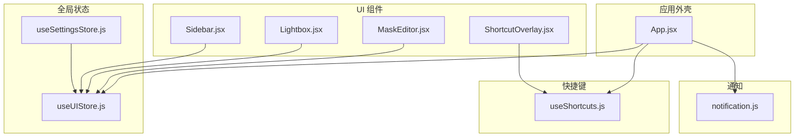
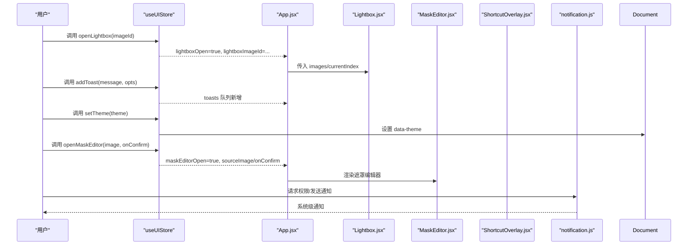
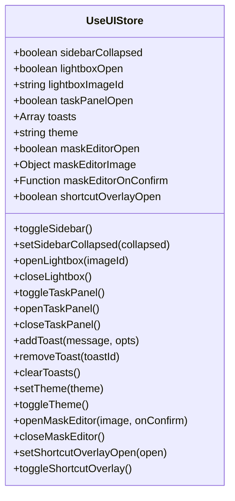
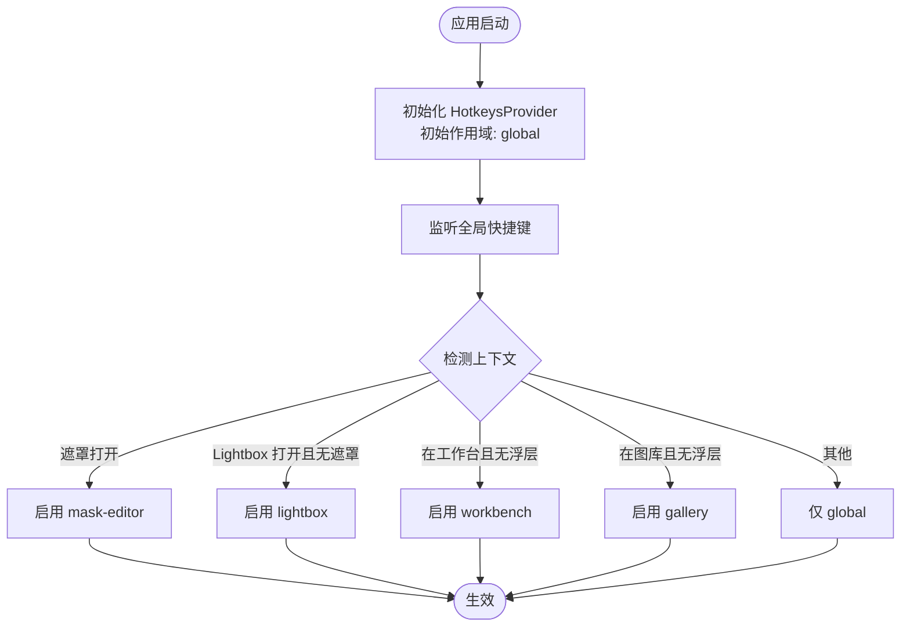
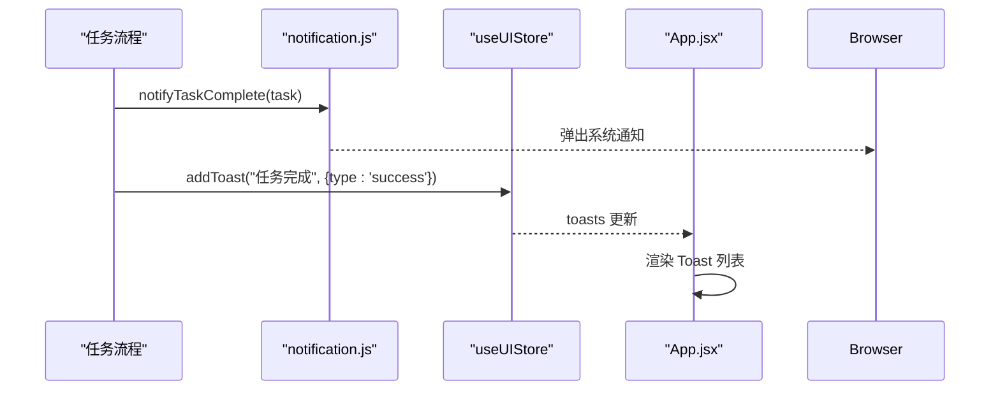
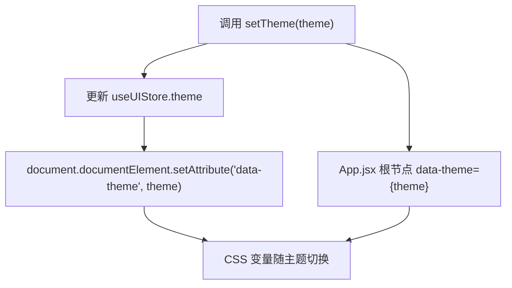
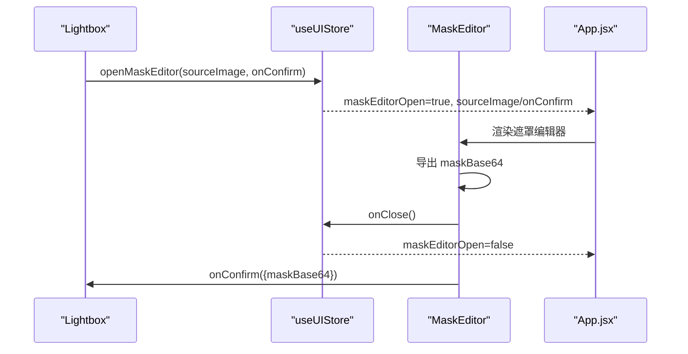
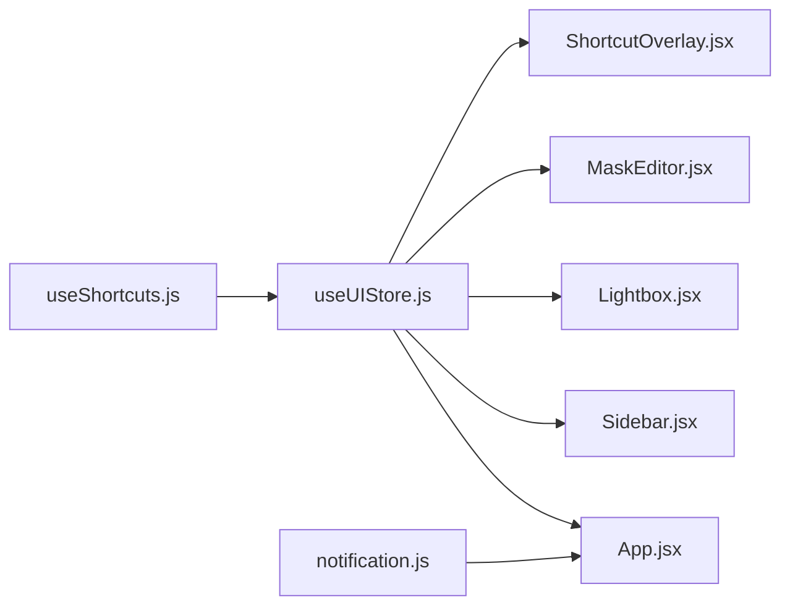

# UI状态管理 (useUIStore)

<cite>
**本文引用的文件**   
- [app/src/stores/useUIStore.js](file://app/src/stores/useUIStore.js)
- [app/src/hooks/useShortcuts.js](file://app/src/hooks/useShortcuts.js)
- [app/src/components/Sidebar.jsx](file://app/src/components/Sidebar.jsx)
- [app/src/components/Lightbox.jsx](file://app/src/components/Lightbox.jsx)
- [app/src/components/MaskEditor.jsx](file://app/src/components/MaskEditor.jsx)
- [app/src/components/ShortcutOverlay.jsx](file://app/src/components/ShortcutOverlay.jsx)
- [app/src/App.jsx](file://app/src/App.jsx)
- [app/src/services/notification.js](file://app/src/services/notification.js)
- [app/src/stores/useSettingsStore.js](file://app/src/stores/useSettingsStore.js)
</cite>

## 目录
1. [简介](#简介)
2. [项目结构](#项目结构)
3. [核心组件](#核心组件)
4. [架构总览](#架构总览)
5. [详细组件分析](#详细组件分析)
6. [依赖关系分析](#依赖关系分析)
7. [性能与优化建议](#性能与优化建议)
8. [故障排查指南](#故障排查指南)
9. [结论](#结论)
10. [附录](#附录)

## 简介
本文件聚焦于 AI Image Studio 的 UI 全局状态管理，围绕 useUIStore 展开，系统阐述以下能力：
- 侧边栏展开/折叠、模态框（Lightbox）显示控制、任务面板切换、遮罩编辑器开关、快捷键速查浮层开关
- 主题设置与 DOM 级应用
- 通知系统（Toast 队列 + 浏览器通知）的状态管理与用户交互反馈
- 快捷键系统的状态绑定与全局键盘事件处理
- 动画与加载指示器在 UI 层的体现方式
- 组件间状态共享的最佳实践与性能优化建议

## 项目结构
与 UI 状态相关的核心位置如下：
- 全局 UI Store：app/src/stores/useUIStore.js
- 快捷键系统与范围控制：app/src/hooks/useShortcuts.js
- 关键 UI 组件：Sidebar、Lightbox、MaskEditor、ShortcutOverlay
- 应用外壳与全局挂载点：App.jsx
- 通知服务（浏览器通知）：services/notification.js
- 设置持久化（含主题默认值）：stores/useSettingsStore.js

图表来源
- [app/src/App.jsx:245-351](file://app/src/App.jsx#L245-L351)
- [app/src/stores/useUIStore.js:12-158](file://app/src/stores/useUIStore.js#L12-L158)
- [app/src/hooks/useShortcuts.js:22-134](file://app/src/hooks/useShortcuts.js#L22-L134)
- [app/src/components/Sidebar.jsx:154-371](file://app/src/components/Sidebar.jsx#L154-L371)
- [app/src/components/Lightbox.jsx:13-702](file://app/src/components/Lightbox.jsx#L13-L702)
- [app/src/components/MaskEditor.jsx:20-800](file://app/src/components/MaskEditor.jsx#L20-L800)
- [app/src/components/ShortcutOverlay.jsx:9-137](file://app/src/components/ShortcutOverlay.jsx#L9-L137)
- [app/src/services/notification.js:19-113](file://app/src/services/notification.js#L19-L113)
- [app/src/stores/useSettingsStore.js:47-162](file://app/src/stores/useSettingsStore.js#L47-L162)

章节来源
- [app/src/App.jsx:245-351](file://app/src/App.jsx#L245-L351)
- [app/src/stores/useUIStore.js:12-158](file://app/src/stores/useUIStore.js#L12-L158)

## 核心组件
- useUIStore：基于 Zustand 的全局 UI 状态中心，提供侧边栏、Lightbox、任务面板、遮罩编辑器、快捷键浮层、主题、Toast 等状态与操作方法。
- useGlobalShortcuts / useShortcutScopes：集中式快捷键系统，按作用域优先级（遮罩 > Lightbox > 工作台 > 图库 > 全局）启用/禁用快捷键。
- Sidebar：导航与文件夹树，负责页面跳转与本地交互；当前实现使用组件内 state 控制收起/展开，未直接订阅 store 的 sidebarCollapsed。
- Lightbox：全局图片查看器，通过 store 打开/关闭并定位目标图片。
- MaskEditor：遮罩绘制工具，由 store 驱动打开/关闭及回调传递。
- ShortcutOverlay：快捷键速查浮层，受 store 控制显示。
- notification.js：封装浏览器通知 API，用于任务完成/失败的系统级提示。
- useSettingsStore：保存通用设置（包含 theme 默认值），与 UIStore 的主题设置配合。

章节来源
- [app/src/stores/useUIStore.js:12-158](file://app/src/stores/useUIStore.js#L12-L158)
- [app/src/hooks/useShortcuts.js:22-134](file://app/src/hooks/useShortcuts.js#L22-L134)
- [app/src/components/Sidebar.jsx:154-371](file://app/src/components/Sidebar.jsx#L154-L371)
- [app/src/components/Lightbox.jsx:13-702](file://app/src/components/Lightbox.jsx#L13-L702)
- [app/src/components/MaskEditor.jsx:20-800](file://app/src/components/MaskEditor.jsx#L20-L800)
- [app/src/components/ShortcutOverlay.jsx:9-137](file://app/src/components/ShortcutOverlay.jsx#L9-L137)
- [app/src/services/notification.js:19-113](file://app/src/services/notification.js#L19-L113)
- [app/src/stores/useSettingsStore.js:47-162](file://app/src/stores/useSettingsStore.js#L47-L162)

## 架构总览
UI 状态以 useUIStore 为中心，被多个组件订阅；快捷键系统根据 UI 状态动态切换作用域；通知服务作为外部系统桥接，与 UI 反馈（Toast）协同工作。

图表来源
- [app/src/stores/useUIStore.js:45-131](file://app/src/stores/useUIStore.js#L45-L131)
- [app/src/App.jsx:203-239](file://app/src/App.jsx#L203-L239)
- [app/src/components/Lightbox.jsx:13-702](file://app/src/components/Lightbox.jsx#L13-L702)
- [app/src/components/MaskEditor.jsx:20-800](file://app/src/components/MaskEditor.jsx#L20-L800)
- [app/src/components/ShortcutOverlay.jsx:9-137](file://app/src/components/ShortcutOverlay.jsx#L9-L137)
- [app/src/services/notification.js:19-113](file://app/src/services/notification.js#L19-L113)

## 详细组件分析

### useUIStore 状态与方法
- 状态字段
  - 侧边栏：sidebarCollapsed
  - Lightbox：lightboxOpen, lightboxImageId
  - 任务面板：taskPanelOpen
  - Toast 通知：toasts（数组，含 id/type/message/duration）
  - 主题：theme（'dark'|'light'）
  - 遮罩编辑器：maskEditorOpen, maskEditorImage, maskEditorOnConfirm
  - 快捷键浮层：shortcutOverlayOpen
- 方法
  - 侧边栏：toggleSidebar(), setSidebarCollapsed(collapsed)
  - Lightbox：openLightbox(imageId), closeLightbox()
  - 任务面板：toggleTaskPanel(), openTaskPanel(), closeTaskPanel()
  - Toast：addToast(message, opts), removeToast(id), clearToasts()
  - 主题：setTheme(theme), toggleTheme()
  - 遮罩编辑器：openMaskEditor(image, onConfirm), closeMaskEditor()
  - 快捷键浮层：setShortcutOverlayOpen(open), toggleShortcutOverlay()

图表来源
- [app/src/stores/useUIStore.js:12-158](file://app/src/stores/useUIStore.js#L12-L158)

章节来源
- [app/src/stores/useUIStore.js:12-158](file://app/src/stores/useUIStore.js#L12-L158)

### 快捷键系统与状态绑定
- 作用域优先级：遮罩编辑器 > Lightbox > 工作台 > 图库 > 全局
- 全局快捷键：
  - Shift+/ 打开/关闭快捷键速查浮层
  - Esc 关闭浮层或 Lightbox
  - G+W/G+G/G+K/G+T 快速导航到对应页面
- 工作台快捷键：
  - Ctrl/Cmd+Enter 生成图片
  - E 扩写提示词
  - 1/2/3 切换模型
- 作用域切换逻辑：
  - useShortcutScopes 根据路由与 UI 状态动态启用/禁用各作用域

图表来源
- [app/src/hooks/useShortcuts.js:22-134](file://app/src/hooks/useShortcuts.js#L22-L134)
- [app/src/App.jsx:353-363](file://app/src/App.jsx#L353-L363)

章节来源
- [app/src/hooks/useShortcuts.js:22-134](file://app/src/hooks/useShortcuts.js#L22-L134)
- [app/src/App.jsx:353-363](file://app/src/App.jsx#L353-L363)

### 通知系统状态管理
- 浏览器通知（system-level）
  - requestPermission：启动时请求权限
  - notifyTaskComplete / notifyTaskFailed：任务结果通知
- 应用内 Toast（UI-level）
  - useUIStore.addToast：入队消息，支持类型与自动消失时长
  - App.jsx 中展示一个一次性欢迎 Toast（独立 local state）

图表来源
- [app/src/services/notification.js:78-113](file://app/src/services/notification.js#L78-L113)
- [app/src/stores/useUIStore.js:80-117](file://app/src/stores/useUIStore.js#L80-L117)
- [app/src/App.jsx:79-113](file://app/src/App.jsx#L79-L113)

章节来源
- [app/src/services/notification.js:19-113](file://app/src/services/notification.js#L19-L113)
- [app/src/stores/useUIStore.js:80-117](file://app/src/stores/useUIStore.js#L80-L117)
- [app/src/App.jsx:79-113](file://app/src/App.jsx#L79-L113)

### 主题设置与 DOM 应用
- useUIStore.setTheme 将 theme 写入 store，并在 document.documentElement 上设置 data-theme 属性
- App.jsx 根节点也同步 data-theme={theme}，确保样式变量随主题变化
- useSettingsStore 维护 generalConfig.theme 默认值，供设置页读取/保存

图表来源
- [app/src/stores/useUIStore.js:119-131](file://app/src/stores/useUIStore.js#L119-L131)
- [app/src/App.jsx:298-302](file://app/src/App.jsx#L298-L302)
- [app/src/stores/useSettingsStore.js:40-46](file://app/src/stores/useSettingsStore.js#L40-L46)

章节来源
- [app/src/stores/useUIStore.js:119-131](file://app/src/stores/useUIStore.js#L119-L131)
- [app/src/App.jsx:298-302](file://app/src/App.jsx#L298-L302)
- [app/src/stores/useSettingsStore.js:40-46](file://app/src/stores/useSettingsStore.js#L40-L46)

### 遮罩编辑器与 Lightbox 联动
- Lightbox 触发“局部重绘”时，调用 openMaskEditor 传入源图与确认回调
- MaskEditor 确认后，通过回调返回 maskBase64 给上层进行后续生成

图表来源
- [app/src/components/Lightbox.jsx:101-120](file://app/src/components/Lightbox.jsx#L101-L120)
- [app/src/stores/useUIStore.js:135-143](file://app/src/stores/useUIStore.js#L135-L143)
- [app/src/components/MaskEditor.jsx:348-360](file://app/src/components/MaskEditor.jsx#L348-L360)
- [app/src/App.jsx:342-348](file://app/src/App.jsx#L342-L348)

章节来源
- [app/src/components/Lightbox.jsx:101-120](file://app/src/components/Lightbox.jsx#L101-L120)
- [app/src/stores/useUIStore.js:135-143](file://app/src/stores/useUIStore.js#L135-L143)
- [app/src/components/MaskEditor.jsx:348-360](file://app/src/components/MaskEditor.jsx#L348-L360)
- [app/src/App.jsx:342-348](file://app/src/App.jsx#L342-L348)

### 侧边栏展开/折叠现状与建议
- 现状：Sidebar 内部使用本地 state 控制 collapsed，未直接使用 useUIStore.sidebarCollapsed
- 建议：若需跨组件共享侧边栏状态（例如从顶部按钮或快捷键控制），可将 Sidebar 改为订阅 store 的 sidebarCollapsed 并通过 setSidebarCollapsed 更新

章节来源
- [app/src/components/Sidebar.jsx:154-371](file://app/src/components/Sidebar.jsx#L154-L371)
- [app/src/stores/useUIStore.js:31-43](file://app/src/stores/useUIStore.js#L31-L43)

### 响应式布局与屏幕尺寸适配
- 当前代码库未发现对 window.innerWidth/screen.width/matchMedia 的直接使用
- 现有布局主要基于 CSS 变量与 flex/grid 自适应
- 如需增强响应式行为（如移动端隐藏侧边栏、调整面板宽度），建议在 useUIStore 中增加 isMobile/breakpoint 状态，并提供 setBreakpoint 方法，结合 useEffect 监听 resize 事件更新

[本节为概念性说明，不直接分析具体文件]

## 依赖关系分析
- useUIStore 被 App.jsx、Sidebar、Lightbox、MaskEditor、ShortcutOverlay 等组件订阅
- useShortcuts 依赖 useUIStore 中的 lightboxOpen、maskEditorOpen、shortcutOverlayOpen 等状态来判定作用域
- App.jsx 作为外壳，统一挂载 Lightbox、MaskEditor、ShortcutOverlay 和 Toast 展示
- notification.js 与 UIStore 的 Toast 并行存在，分别负责系统级与应用内反馈

图表来源
- [app/src/stores/useUIStore.js:12-158](file://app/src/stores/useUIStore.js#L12-L158)
- [app/src/hooks/useShortcuts.js:22-134](file://app/src/hooks/useShortcuts.js#L22-L134)
- [app/src/App.jsx:245-351](file://app/src/App.jsx#L245-L351)
- [app/src/components/Sidebar.jsx:154-371](file://app/src/components/Sidebar.jsx#L154-L371)
- [app/src/components/Lightbox.jsx:13-702](file://app/src/components/Lightbox.jsx#L13-L702)
- [app/src/components/MaskEditor.jsx:20-800](file://app/src/components/MaskEditor.jsx#L20-L800)
- [app/src/components/ShortcutOverlay.jsx:9-137](file://app/src/components/ShortcutOverlay.jsx#L9-L137)
- [app/src/services/notification.js:19-113](file://app/src/services/notification.js#L19-L113)

章节来源
- [app/src/stores/useUIStore.js:12-158](file://app/src/stores/useUIStore.js#L12-L158)
- [app/src/hooks/useShortcuts.js:22-134](file://app/src/hooks/useShortcuts.js#L22-L134)
- [app/src/App.jsx:245-351](file://app/src/App.jsx#L245-L351)

## 性能与优化建议
- 避免不必要的重渲染
  - 在组件中使用细粒度选择器订阅 store 字段，而非整块对象
  - 对频繁更新的 toasts 数组，可考虑限制最大长度或使用去重策略
- 减少副作用开销
  - setTheme 已直接操作 DOM，注意避免高频切换主题
  - addToast 的 setTimeout 清理应在组件卸载前取消（当前由 store 内部管理，保持简单即可）
- 快捷键作用域切换
  - useShortcutScopes 已在 useEffect 中集中管理，避免在每次渲染中重复注册/注销监听
- 遮罩编辑器
  - Canvas 操作密集，尽量使用 useRef 缓存中间数据，避免 React state 频繁更新导致重绘
- 响应式扩展
  - 若引入窗口尺寸监听，建议使用防抖/节流，避免频繁触发 re-render

[本节为通用指导，不直接分析具体文件]

## 故障排查指南
- 主题未生效
  - 检查 useUIStore.setTheme 是否被调用，以及 document.documentElement 的 data-theme 是否正确设置
  - 确认 App.jsx 根节点的 data-theme 是否与 store 一致
- 快捷键冲突或无效
  - 确认当前作用域是否被正确启用（遮罩 > Lightbox > 工作台 > 图库 > 全局）
  - 检查 useShortcutScopes 的依赖项是否包含必要的 UI 状态
- Toast 不显示或无法关闭
  - 检查 useUIStore.toasts 队列是否更新
  - 确认 App.jsx 的 Toast 组件渲染逻辑是否正常
- 浏览器通知未弹出
  - 检查 requestPermission 是否成功，permission 是否为 granted
  - 确认 notifyTaskComplete/notifyTaskFailed 是否被调用

章节来源
- [app/src/stores/useUIStore.js:119-131](file://app/src/stores/useUIStore.js#L119-L131)
- [app/src/App.jsx:298-302](file://app/src/App.jsx#L298-L302)
- [app/src/hooks/useShortcuts.js:116-134](file://app/src/hooks/useShortcuts.js#L116-L134)
- [app/src/services/notification.js:19-43](file://app/src/services/notification.js#L19-L43)

## 结论
useUIStore 作为全局 UI 状态中枢，有效串联了侧边栏、Lightbox、任务面板、遮罩编辑器、快捷键浮层与主题等关键界面能力。配合 useShortcuts 的作用域机制与 notification.js 的系统通知，形成了完整的用户反馈闭环。建议在后续迭代中：
- 将侧边栏状态纳入 store 统一管理，提升跨组件一致性
- 按需引入响应式断点状态，完善移动端体验
- 持续优化高频率状态更新的性能表现

[本节为总结性内容，不直接分析具体文件]

## 附录
- 相关常量与默认配置
  - 默认主题值来源于 useSettingsStore.generalConfig.theme
- 快捷键速查展示
  - SHORTCUT_GROUPS 定义用于 ShortcutOverlay 的分组展示

章节来源
- [app/src/stores/useSettingsStore.js:40-46](file://app/src/stores/useSettingsStore.js#L40-L46)
- [app/src/hooks/useShortcuts.js:139-184](file://app/src/hooks/useShortcuts.js#L139-L184)
- [app/src/components/ShortcutOverlay.jsx:9-137](file://app/src/components/ShortcutOverlay.jsx#L9-L137)