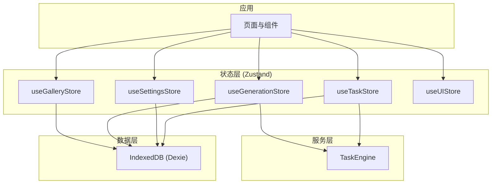
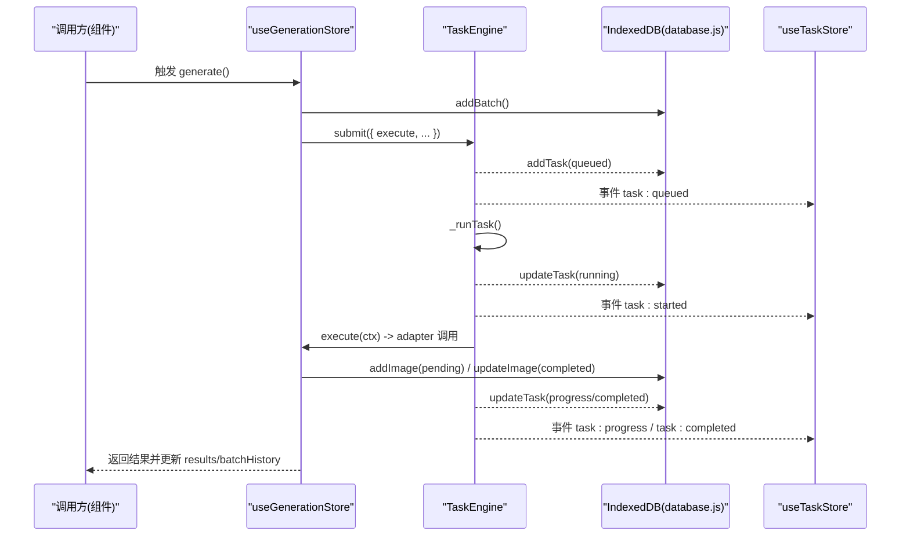
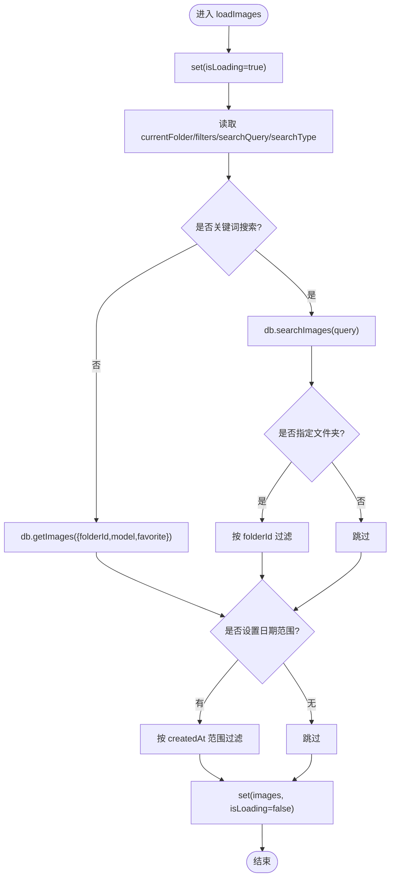
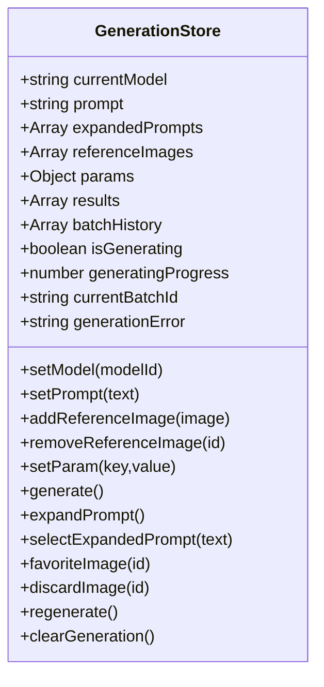
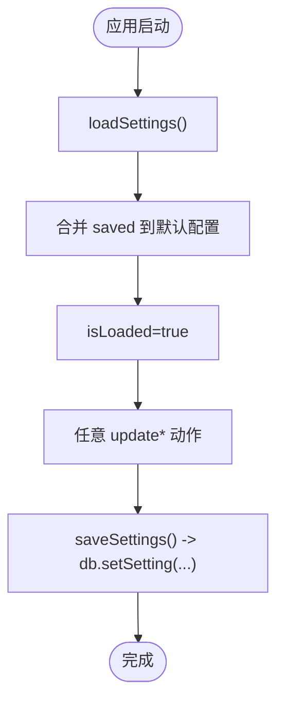
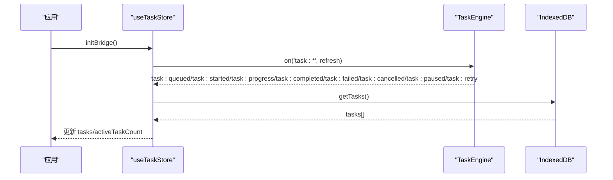
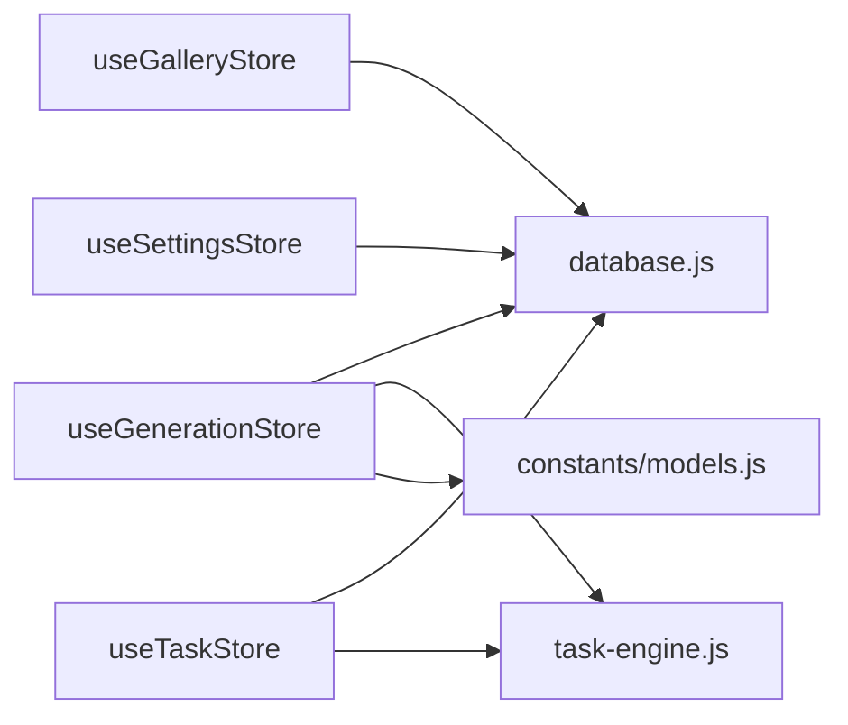

# Zustand Store 架构设计

<cite>
**本文引用的文件列表**
- [useGalleryStore.js](file://app/src/stores/useGalleryStore.js)
- [useGenerationStore.js](file://app/src/stores/useGenerationStore.js)
- [useSettingsStore.js](file://app/src/stores/useSettingsStore.js)
- [useTaskStore.js](file://app/src/stores/useTaskStore.js)
- [useUIStore.js](file://app/src/stores/useUIStore.js)
- [database.js](file://app/src/db/database.js)
- [task-engine.js](file://app/src/services/task-engine.js)
- [models.js](file://app/src/constants/models.js)
- [package.json](file://app/package.json)
</cite>

## 目录
1. [简介](#简介)
2. [项目结构](#项目结构)
3. [核心组件](#核心组件)
4. [架构总览](#架构总览)
5. [详细组件分析](#详细组件分析)
6. [依赖关系分析](#依赖关系分析)
7. [性能与优化](#性能与优化)
8. [故障排查指南](#故障排查指南)
9. [结论](#结论)
10. [附录：开发最佳实践与测试策略](#附录开发最佳实践与测试策略)

## 简介
本文件为 AI Image Studio 的 Zustand Store 架构设计文档。重点阐述基于 Zustand 的状态管理整体架构、Store 模块划分原则、状态结构设计模式与方法封装策略；解释各 Store 的职责边界与依赖关系，说明跨组件状态共享机制与状态同步方案；提供状态关系图与数据流图，展示状态变化的传播路径和更新流程；讨论性能优化策略（Immer 集成、状态持久化、调试技巧），并给出 Store 开发与测试的最佳实践。

## 项目结构
本项目采用“按领域/功能”组织 Store 的方式，每个 Store 聚焦一个业务域，并通过数据库层与任务引擎进行外部交互。关键目录与职责如下：
- stores：Zustand Store 实现，包含 Gallery、Generation、Settings、Task、UI 五大领域
- db：IndexedDB 数据访问层（Dexie）
- services：后台任务调度器 TaskEngine 与通知等
- constants：模型能力与默认参数常量

图表来源
- [useGalleryStore.js:1-204](file://app/src/stores/useGalleryStore.js#L1-L204)
- [useGenerationStore.js:1-360](file://app/src/stores/useGenerationStore.js#L1-L360)
- [useSettingsStore.js:1-162](file://app/src/stores/useSettingsStore.js#L1-L162)
- [useTaskStore.js:1-173](file://app/src/stores/useTaskStore.js#L1-L173)
- [useUIStore.js:1-159](file://app/src/stores/useUIStore.js#L1-L159)
- [task-engine.js:1-319](file://app/src/services/task-engine.js#L1-L319)
- [database.js:1-339](file://app/src/db/database.js#L1-L339)

章节来源
- [useGalleryStore.js:1-204](file://app/src/stores/useGalleryStore.js#L1-L204)
- [useGenerationStore.js:1-360](file://app/src/stores/useGenerationStore.js#L1-L360)
- [useSettingsStore.js:1-162](file://app/src/stores/useSettingsStore.js#L1-L162)
- [useTaskStore.js:1-173](file://app/src/stores/useTaskStore.js#L1-L173)
- [useUIStore.js:1-159](file://app/src/stores/useUIStore.js#L1-L159)
- [task-engine.js:1-319](file://app/src/services/task-engine.js#L1-L319)
- [database.js:1-339](file://app/src/db/database.js#L1-L339)

## 核心组件
- useGalleryStore：图库与文件夹管理，负责图片列表、筛选、搜索、选择与批量操作
- useGenerationStore：工作区生成状态，负责提示词、参考图、参数、结果与批处理历史，协调 TaskEngine 执行生成任务
- useSettingsStore：应用设置与模型配置，持久化到 IndexedDB
- useTaskStore：后台任务管理，桥接 TaskEngine 事件到 Zustand 状态，提供任务增删改查与统计
- useUIStore：全局 UI 状态，侧边栏、灯箱、任务面板、Toast、主题、遮罩编辑器与快捷键覆盖层

章节来源
- [useGalleryStore.js:1-204](file://app/src/stores/useGalleryStore.js#L1-L204)
- [useGenerationStore.js:1-360](file://app/src/stores/useGenerationStore.js#L1-L360)
- [useSettingsStore.js:1-162](file://app/src/stores/useSettingsStore.js#L1-L162)
- [useTaskStore.js:1-173](file://app/src/stores/useTaskStore.js#L1-L173)
- [useUIStore.js:1-159](file://app/src/stores/useUIStore.js#L1-L159)

## 架构总览
Zustand Store 作为状态中心，通过 Immer produce 进行不可变式更新；通过 database.js 读写 IndexedDB；通过 TaskEngine 统一调度异步任务，并以事件驱动方式将进度与状态变化广播给 UI。

图表来源
- [useGenerationStore.js:112-290](file://app/src/stores/useGenerationStore.js#L112-L290)
- [task-engine.js:57-297](file://app/src/services/task-engine.js#L57-L297)
- [database.js:144-171](file://app/src/db/database.js#L144-L171)
- [useTaskStore.js:39-64](file://app/src/stores/useTaskStore.js#L39-L64)

## 详细组件分析

### useGalleryStore（图库与文件夹）
- 职责边界
  - 维护 images、folders、currentFolder、viewMode、searchQuery、filters、selectedImages 等状态
  - 提供加载、搜索、筛选、收藏切换、移动、删除、批量操作、文件夹 CRUD 等方法
- 状态结构设计模式
  - 扁平化主集合 + 过滤条件对象（filters）+ 当前上下文（currentFolder）
  - 使用 produce 对局部嵌套字段（如 filters）进行安全合并
- 方法封装策略
  - 读多写少：loadImages/loadFolders 从 DB 拉取后 set
  - 写操作先落库再更新本地状态，保证一致性
  - 批量操作聚合多次 DB 写入，最后统一刷新
- 错误处理
  - try/catch 包裹异步操作，失败时保留或重置 isLoading 标志
- 性能考量
  - 客户端日期范围过滤在内存中完成，避免额外查询
  - 使用 produce 减少不必要的深层比较开销

图表来源
- [useGalleryStore.js:30-62](file://app/src/stores/useGalleryStore.js#L30-L62)

章节来源
- [useGalleryStore.js:1-204](file://app/src/stores/useGalleryStore.js#L1-L204)

### useGenerationStore（工作区生成）
- 职责边界
  - 管理当前模型、提示词、展开提示词、参考图、生成参数、结果集、批次历史、生成标志与进度
  - 协调 TaskEngine 执行文本转图像或图像转图像，并将中间态与最终结果持久化
- 状态结构设计模式
  - 以“当前会话”为中心的结构：prompt/referenceImages/params/results/batchHistory
  - 使用 produce 对 params、referenceImages、results 等复杂对象进行增量更新
- 方法封装策略
  - generate：创建批次记录 -> 提交任务 -> 适配器执行 -> 持久化结果 -> 更新 store
  - expandPrompt：调用 LLM 适配器扩展提示词
  - favoriteImage/discardImage：单条结果级操作，先写库再更新本地
- 错误处理
  - 捕获适配器异常，必要时回写 pending 记录为 failed
  - 统一在 finally 中重置 isGenerating
- 性能考量
  - 首次结果优先更新 pending 记录，避免重复插入
  - 使用 produce 仅变更受影响字段，降低重渲染成本

图表来源
- [useGenerationStore.js:22-359](file://app/src/stores/useGenerationStore.js#L22-L359)

章节来源
- [useGenerationStore.js:1-360](file://app/src/stores/useGenerationStore.js#L1-L360)

### useSettingsStore（应用设置）
- 职责边界
  - 管理模型配置、存储配置、扩展配置、通用配置与引导完成标记
  - 提供保存/加载/重置设置的方法
- 状态结构设计模式
  - 分块对象：modelConfigs/storageConfig/expansionConfig/generalConfig
  - 初始化时根据 MODELS 常量构建默认 modelConfigs
- 方法封装策略
  - 所有修改动作均调用 saveSettings 持久化
  - loadSettings 合并已保存配置到默认值之上
- 错误处理
  - 加载失败时仍标记 isLoaded=true，避免阻塞 UI

图表来源
- [useSettingsStore.js:108-149](file://app/src/stores/useSettingsStore.js#L108-L149)

章节来源
- [useSettingsStore.js:1-162](file://app/src/stores/useSettingsStore.js#L1-L162)
- [models.js:1-106](file://app/src/constants/models.js#L1-L106)

### useTaskStore（后台任务）
- 职责边界
  - 维护 tasks 列表与 activeTaskCount
  - 初始化 TaskEngine 事件桥，监听任务生命周期事件并刷新本地状态
  - 提供任务的增删改查、重试、取消、暂停/恢复、统计与清理
- 状态结构设计模式
  - 扁平任务数组 + 计数指标，便于 UI 直接渲染
- 方法封装策略
  - initBridge：一次性订阅 TaskEngine 事件，返回清理函数
  - 所有写操作后统一 loadTasks 刷新
- 错误处理
  - 对 TaskEngine 控制类操作提供降级逻辑（如无法取消则本地置状态）

图表来源
- [useTaskStore.js:39-64](file://app/src/stores/useTaskStore.js#L39-L64)
- [task-engine.js:191-211](file://app/src/services/task-engine.js#L191-L211)

章节来源
- [useTaskStore.js:1-173](file://app/src/stores/useTaskStore.js#L1-L173)

### useUIStore（全局 UI）
- 职责边界
  - 管理侧边栏折叠、灯箱、任务面板、Toast、主题、遮罩编辑器与快捷键覆盖层
- 状态结构设计模式
  - 布尔开关 + 轻量对象（如 toasts 数组）
- 方法封装策略
  - 提供 toggle/open/close 三类 API，保持语义清晰
  - Toast 自动移除通过 setTimeout 触发 removeToast
  - 主题切换同时更新 DOM 属性

章节来源
- [useUIStore.js:1-159](file://app/src/stores/useUIStore.js#L1-L159)

## 依赖关系分析
- Store 对外依赖
  - database.js：所有持久化读写
  - task-engine.js：任务调度与事件广播
  - models.js：模型能力与默认参数
- Store 间依赖
  - useGenerationStore 与 useTaskStore 通过 TaskEngine 事件间接耦合
  - useGalleryStore 与 useGenerationStore 通过 IndexedDB 的 images/batches 表形成弱耦合（共享数据源）
- 外部依赖
  - zustand、immer、dexie、uuid 等

图表来源
- [useGalleryStore.js:1-204](file://app/src/stores/useGalleryStore.js#L1-L204)
- [useGenerationStore.js:1-360](file://app/src/stores/useGenerationStore.js#L1-L360)
- [useSettingsStore.js:1-162](file://app/src/stores/useSettingsStore.js#L1-L162)
- [useTaskStore.js:1-173](file://app/src/stores/useTaskStore.js#L1-L173)
- [task-engine.js:1-319](file://app/src/services/task-engine.js#L1-L319)
- [database.js:1-339](file://app/src/db/database.js#L1-L339)
- [models.js:1-106](file://app/src/constants/models.js#L1-L106)

章节来源
- [package.json:1-30](file://app/package.json#L1-L30)

## 性能与优化
- Immer 集成
  - 所有 Store 广泛使用 produce 进行不可变更新，避免手动深拷贝，提升可读性与性能
- 状态持久化
  - Settings 与任务/图库/批次等关键数据通过 IndexedDB 持久化，保障刷新不丢失
- 事件驱动更新
  - TaskEngine 事件驱动 useTaskStore 刷新，避免轮询，降低 CPU 占用
- 选择性渲染
  - 使用 produce 精确更新受影响的子树，减少 React 重渲染范围
- 建议优化点
  - 大列表分页与虚拟滚动（图库）
  - 批量操作合并请求与最小化 set 次数
  - 对高频更新字段（如 progress）考虑节流或去抖
  - 按需懒加载 Adapter 与工具模块（已在部分处使用动态 import）

[本节为通用指导，无需具体文件引用]

## 故障排查指南
- 常见问题定位
  - 任务未执行：检查 TaskEngine 并发限制与队列状态，确认 initBridge 是否调用
  - 状态不同步：确认写库成功后是否调用了 loadTasks/loadImages 刷新
  - 生成失败：查看 GenerationStore 的 error 日志与 pending 记录状态
- 日志与断点
  - 关注 console 输出中的 Store 前缀（如 [GenerationStore]、[TaskStore]）
  - 在 TaskEngine._runTask 与 Store 的异步分支处设置断点
- 恢复策略
  - 失败任务可重试（TaskEngine 支持指数退避）
  - 设置项可通过 resetToDefaults 恢复

章节来源
- [useGenerationStore.js:283-290](file://app/src/stores/useGenerationStore.js#L283-L290)
- [useTaskStore.js:109-157](file://app/src/stores/useTaskStore.js#L109-L157)
- [task-engine.js:259-296](file://app/src/services/task-engine.js#L259-L296)

## 结论
本架构以 Zustand 为核心，结合 Immer 与 Dexie，形成了“领域化 Store + 事件驱动 + 持久化”的稳定形态。通过清晰的职责边界与统一的持久化/任务调度抽象，实现了跨组件状态共享与可靠的数据同步。后续可在列表渲染、批量操作与网络重试等方面继续优化体验与性能。

[本节为总结性内容，无需具体文件引用]

## 附录：开发最佳实践与测试策略
- 开发最佳实践
  - 单一职责：每个 Store 只负责一个领域，避免跨域耦合
  - 不可变更新：优先使用 produce，避免直接修改 state
  - 写库先行：先持久化再更新本地状态，确保一致性与可恢复性
  - 事件解耦：通过 TaskEngine 事件驱动 UI 刷新，避免直接互相调用
  - 错误兜底：异步操作统一 try/catch，并提供降级逻辑
- 测试策略
  - 单元测试
    - 针对 Store Actions 编写用例，模拟 DB 与 TaskEngine 行为
    - 验证 produce 更新后的状态快照是否符合预期
  - 集成测试
    - 端到端验证 generate 流程：提交任务 -> 事件回调 -> 结果入库 -> UI 更新
  - 工具与框架
    - 可使用 zustand/middleware 的 devtools 辅助调试
    - 使用 mock 替换 Dexie 与 TaskEngine，隔离外部依赖

[本节为通用指导，无需具体文件引用]