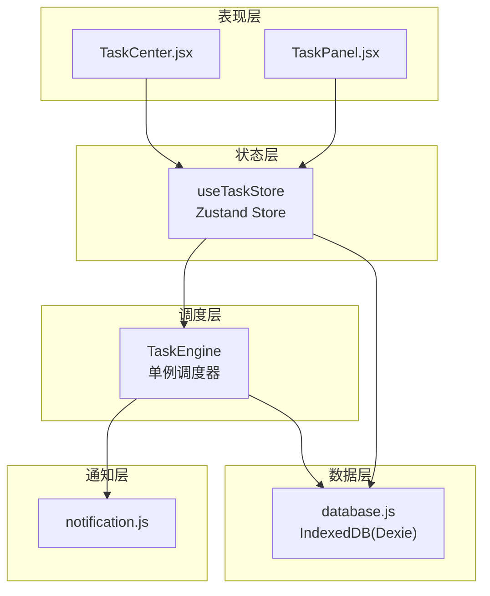
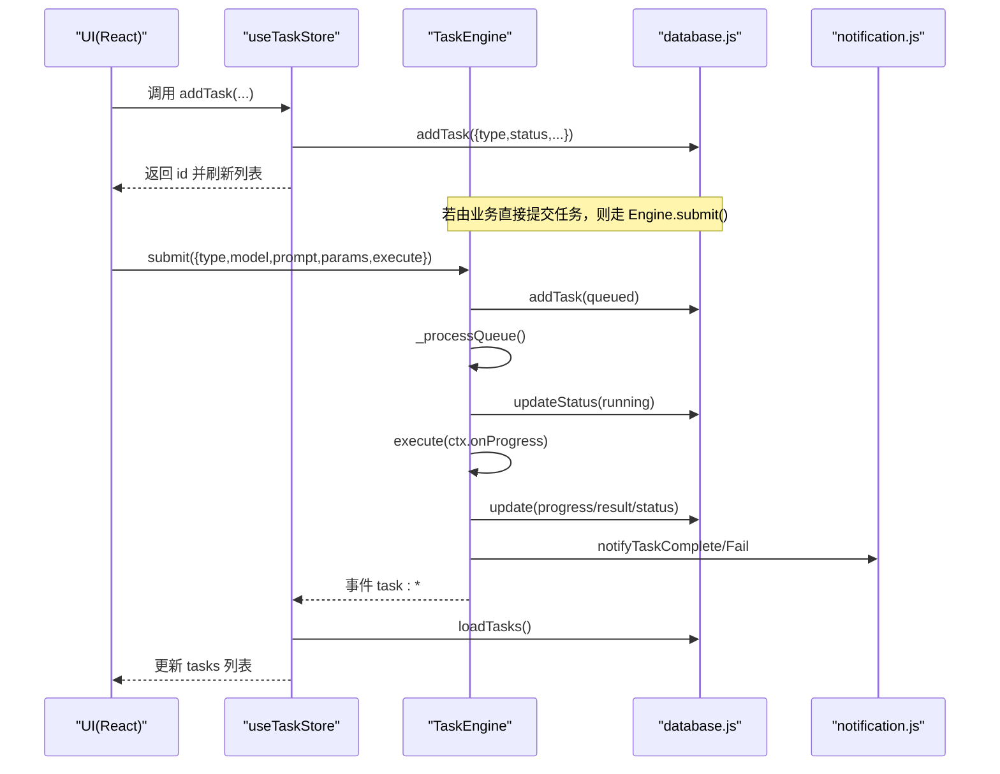
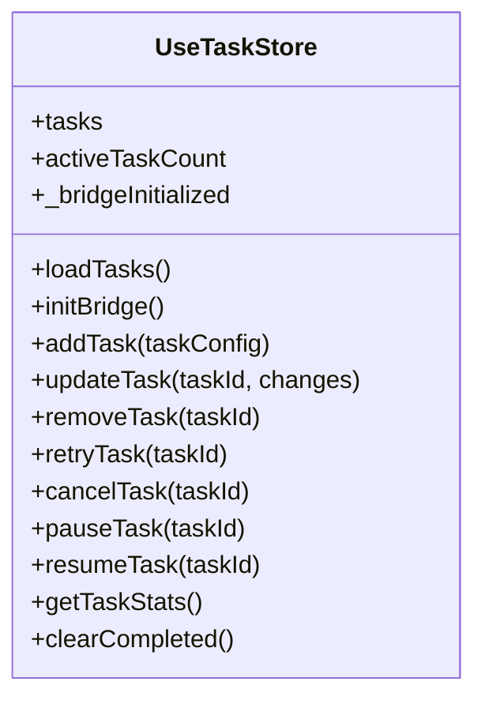
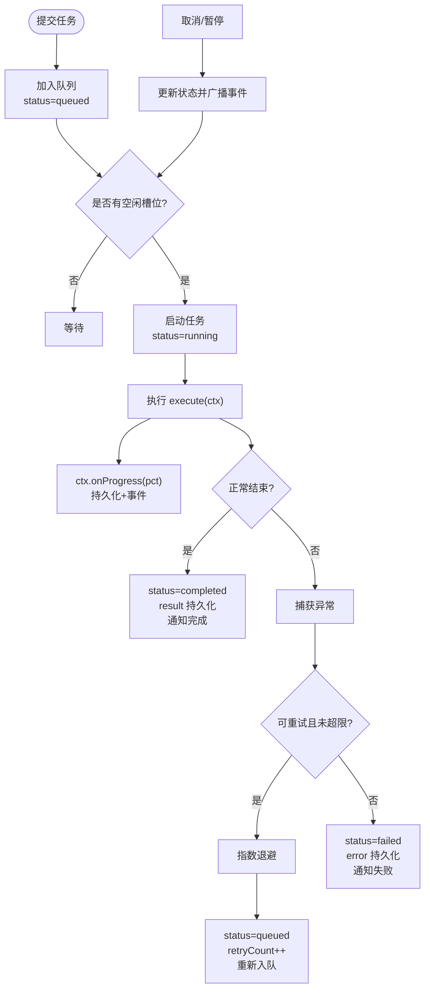
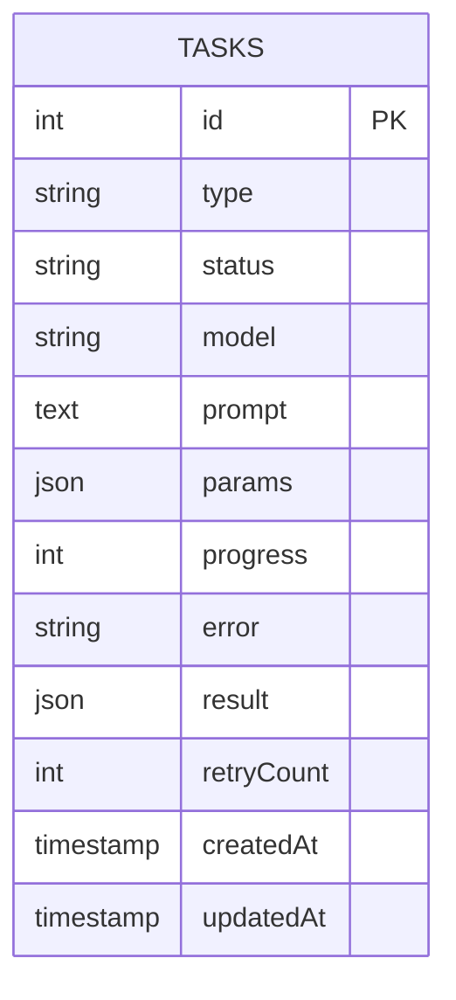
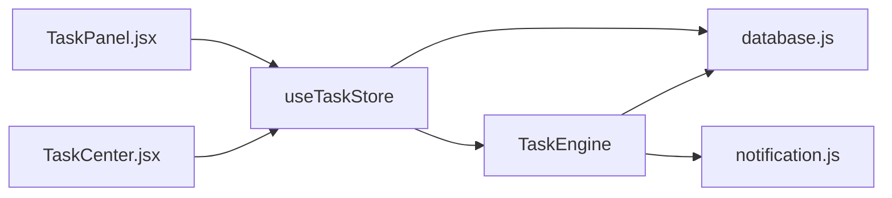

# 任务状态管理 (useTaskStore)

<cite>
**本文引用的文件**
- [app/src/stores/useTaskStore.js](file://app/src/stores/useTaskStore.js)
- [app/src/services/task-engine.js](file://app/src/services/task-engine.js)
- [app/src/db/database.js](file://app/src/db/database.js)
- [app/src/components/TaskPanel.jsx](file://app/src/components/TaskPanel.jsx)
- [app/src/pages/TaskCenter.jsx](file://app/src/pages/TaskCenter.jsx)
- [app/src/services/notification.js](file://app/src/services/notification.js)
</cite>

## 目录
1. [简介](#简介)
2. [项目结构](#项目结构)
3. [核心组件](#核心组件)
4. [架构总览](#架构总览)
5. [详细组件分析](#详细组件分析)
6. [依赖关系分析](#依赖关系分析)
7. [性能考量](#性能考量)
8. [故障排除指南](#故障排除指南)
9. [结论](#结论)
10. [附录](#附录)

## 简介
本文件为 AI Image Studio 的任务状态管理 Store（useTaskStore）提供系统化文档。重点说明 useTaskStore 如何与 TaskEngine 协作，完成后台任务的入队、执行、进度跟踪、错误处理、取消/暂停/恢复/重试等生命周期管理；解释任务类型定义、优先级与并发控制机制；阐述事件驱动的状态同步与 UI 响应式更新；并给出统计信息计算、历史记录维护、性能监控数据收集以及调试与排障建议。

## 项目结构
围绕任务管理的核心代码分布在以下模块：
- 状态层：useTaskStore（Zustand store），负责持久化加载、事件桥接、对外暴露操作接口
- 调度层：TaskEngine（单例），负责队列、并发、状态机、重试与通知
- 数据层：database（IndexedDB/Dexie），负责任务记录 CRUD 与统计
- 表现层：TaskPanel、TaskCenter，消费 store 进行分组展示与交互
- 通知层：notification，封装浏览器通知能力

图表来源
- [app/src/stores/useTaskStore.js:1-173](file://app/src/stores/useTaskStore.js#L1-L173)
- [app/src/services/task-engine.js:1-319](file://app/src/services/task-engine.js#L1-L319)
- [app/src/db/database.js:1-339](file://app/src/db/database.js#L1-L339)
- [app/src/components/TaskPanel.jsx:1-538](file://app/src/components/TaskPanel.jsx#L1-L538)
- [app/src/pages/TaskCenter.jsx:1-218](file://app/src/pages/TaskCenter.jsx#L1-L218)
- [app/src/services/notification.js:1-113](file://app/src/services/notification.js#L1-L113)

章节来源
- [app/src/stores/useTaskStore.js:1-173](file://app/src/stores/useTaskStore.js#L1-L173)
- [app/src/services/task-engine.js:1-319](file://app/src/services/task-engine.js#L1-L319)
- [app/src/db/database.js:1-339](file://app/src/db/database.js#L1-L339)
- [app/src/components/TaskPanel.jsx:1-538](file://app/src/components/TaskPanel.jsx#L1-L538)
- [app/src/pages/TaskCenter.jsx:1-218](file://app/src/pages/TaskCenter.jsx#L1-L218)
- [app/src/services/notification.js:1-113](file://app/src/services/notification.js#L1-L113)

## 核心组件
- useTaskStore
  - 职责：从 IndexedDB 加载任务列表、维护 activeTaskCount、将 TaskEngine 的事件桥接到 Zustand 状态，提供 add/update/remove/retry/cancel/pause/resume/getStats/clearCompleted 等操作
  - 关键特性：initBridge 一次性订阅 Engine 事件，统一刷新任务列表，保证 UI 实时性
- TaskEngine
  - 职责：FIFO 队列 + 最大并发控制、任务状态机、指数退避重试、进度上报、取消/暂停/恢复、失败通知
  - 关键特性：_processQueue 循环拉取队列项，_runTask 包装执行上下文（AbortController、onProgress）、异常分类与自动重试
- database
  - 职责：基于 Dexie 的 IndexedDB 表结构与任务相关 CRUD、统计查询
  - 关键特性：tasks 表索引设计支持按状态和时间排序，getTaskStats 聚合统计
- TaskPanel / TaskCenter
  - 职责：消费 useTaskStore 的 tasks 与 actions，按状态分组渲染，提供用户交互入口
- notification
  - 职责：封装浏览器通知 API，在任务完成或失败时推送系统通知

章节来源
- [app/src/stores/useTaskStore.js:1-173](file://app/src/stores/useTaskStore.js#L1-L173)
- [app/src/services/task-engine.js:1-319](file://app/src/services/task-engine.js#L1-L319)
- [app/src/db/database.js:1-339](file://app/src/db/database.js#L1-L339)
- [app/src/components/TaskPanel.jsx:1-538](file://app/src/components/TaskPanel.jsx#L1-L538)
- [app/src/pages/TaskCenter.jsx:1-218](file://app/src/pages/TaskCenter.jsx#L1-L218)
- [app/src/services/notification.js:1-113](file://app/src/services/notification.js#L1-L113)

## 架构总览
useTaskStore 作为“UI 状态门面”，通过 initBridge 订阅 TaskEngine 的事件，统一触发 loadTasks 从数据库拉取最新任务集合，从而驱动 React 组件的响应式更新。TaskEngine 负责实际的任务编排与执行，所有状态变更均持久化到 IndexedDB，确保刷新后仍可恢复。

图表来源
- [app/src/stores/useTaskStore.js:39-64](file://app/src/stores/useTaskStore.js#L39-L64)
- [app/src/stores/useTaskStore.js:66-87](file://app/src/stores/useTaskStore.js#L66-L87)
- [app/src/services/task-engine.js:57-81](file://app/src/services/task-engine.js#L57-L81)
- [app/src/services/task-engine.js:215-297](file://app/src/services/task-engine.js#L215-L297)
- [app/src/db/database.js:235-274](file://app/src/db/database.js#L235-L274)
- [app/src/services/notification.js:78-103](file://app/src/services/notification.js#L78-L103)

## 详细组件分析

### useTaskStore 详解
- 状态字段
  - tasks: 任务数组
  - activeTaskCount: 运行中/排队中的任务计数
  - _bridgeInitialized: 是否已初始化事件桥
- 关键方法
  - loadTasks(): 从 DB 读取任务并计算活跃数
  - initBridge(): 监听 TaskEngine 的多种事件，统一刷新任务列表
  - addTask/updateTask/removeTask: 对任务记录的增删改
  - retryTask/cancelTask/pauseTask/resumeTask: 委托 TaskEngine 执行，失败回退本地状态
  - getTaskStats/clearCompleted: 统计与清理
- 事件桥接
  - 监听事件包括：task:queued、task:started、task:progress、task:completed、task:failed、task:cancelled、task:paused、task:retry
  - 每次事件触发后异步刷新任务列表，确保 UI 与持久化一致

图表来源
- [app/src/stores/useTaskStore.js:14-172](file://app/src/stores/useTaskStore.js#L14-L172)

章节来源
- [app/src/stores/useTaskStore.js:22-33](file://app/src/stores/useTaskStore.js#L22-L33)
- [app/src/stores/useTaskStore.js:39-64](file://app/src/stores/useTaskStore.js#L39-L64)
- [app/src/stores/useTaskStore.js:66-172](file://app/src/stores/useTaskStore.js#L66-L172)

### TaskEngine 详解
- 并发与队列
  - 默认最大并发 3，可通过 setMaxConcurrent 调整
  - FIFO 队列，_processQueue 在空闲槽位时拉取任务
- 任务状态机
  - 合法转换：queued -> running | cancelled | paused；running -> completed | failed | cancelled；paused -> queued | cancelled；failed -> queued（重试）
- 执行上下文
  - ctx.signal: AbortController.signal，用于取消/暂停
  - ctx.onProgress(percent): 上报进度并持久化
  - ctx.taskId: 当前任务 ID
- 重试策略
  - 指数退避：backoff = 1000 * 2^(retryCount-1)，最多 3 次
  - 可重试判定：HTTP 5xx、网络错误、超时等
- 事件与通知
  - 内部事件：task:queued、task:started、task:progress、task:completed、task:failed、task:cancelled、task:paused、task:retry
  - 完成后调用通知服务推送系统通知

图表来源
- [app/src/services/task-engine.js:24-31](file://app/src/services/task-engine.js#L24-L31)
- [app/src/services/task-engine.js:44-48](file://app/src/services/task-engine.js#L44-L48)
- [app/src/services/task-engine.js:57-81](file://app/src/services/task-engine.js#L57-L81)
- [app/src/services/task-engine.js:215-297](file://app/src/services/task-engine.js#L215-L297)
- [app/src/services/task-engine.js:299-305](file://app/src/services/task-engine.js#L299-L305)

章节来源
- [app/src/services/task-engine.js:33-40](file://app/src/services/task-engine.js#L33-L40)
- [app/src/services/task-engine.js:57-92](file://app/src/services/task-engine.js#L57-L92)
- [app/src/services/task-engine.js:94-178](file://app/src/services/task-engine.js#L94-L178)
- [app/src/services/task-engine.js:215-313](file://app/src/services/task-engine.js#L215-L313)

### 数据库与任务模型
- 表结构
  - tasks: 主键自增，索引包含 type、status、model、createdAt，复合索引 [status+createdAt] 便于分页与排序
- 常用接口
  - addTask/getTasks/getTask/updateTask/deleteTask
  - getTaskStats: 返回 total、active、queued、completed、failed
- 任务字段约定
  - id、type、status、model、prompt、params、progress、error、result、retryCount、createdAt、updatedAt

图表来源
- [app/src/db/database.js:22-31](file://app/src/db/database.js#L22-L31)
- [app/src/db/database.js:235-274](file://app/src/db/database.js#L235-L274)

章节来源
- [app/src/db/database.js:235-274](file://app/src/db/database.js#L235-L274)

### UI 组件与响应式更新
- TaskPanel
  - 按状态分组显示：进行中（含暂停）、排队中、已完成、失败
  - 提供暂停/继续、取消、移除、重试等操作按钮
- TaskCenter
  - 更全面的任务中心页面，支持清空已完成、时间格式化、批量统计展示
- 响应式机制
  - 组件订阅 useTaskStore.tasks，当 store 更新时自动重渲染
  - 事件桥 initBridge 确保后台状态变化即时反映到前端

章节来源
- [app/src/components/TaskPanel.jsx:1-538](file://app/src/components/TaskPanel.jsx#L1-L538)
- [app/src/pages/TaskCenter.jsx:1-218](file://app/src/pages/TaskCenter.jsx#L1-L218)
- [app/src/stores/useTaskStore.js:39-64](file://app/src/stores/useTaskStore.js#L39-L64)

## 依赖关系分析
- useTaskStore 依赖
  - database：读写任务记录与统计
  - TaskEngine：事件源与任务执行
- TaskEngine 依赖
  - database：持久化任务状态与结果
  - notification：完成/失败通知
- UI 组件依赖
  - useTaskStore：获取任务列表与操作方法

图表来源
- [app/src/stores/useTaskStore.js:10-12](file://app/src/stores/useTaskStore.js#L10-L12)
- [app/src/services/task-engine.js:14-16](file://app/src/services/task-engine.js#L14-L16)
- [app/src/components/TaskPanel.jsx:6-7](file://app/src/components/TaskPanel.jsx#L6-L7)
- [app/src/pages/TaskCenter.jsx:7-8](file://app/src/pages/TaskCenter.jsx#L7-L8)

章节来源
- [app/src/stores/useTaskStore.js:10-12](file://app/src/stores/useTaskStore.js#L10-L12)
- [app/src/services/task-engine.js:14-16](file://app/src/services/task-engine.js#L14-L16)
- [app/src/components/TaskPanel.jsx:6-7](file://app/src/components/TaskPanel.jsx#L6-L7)
- [app/src/pages/TaskCenter.jsx:7-8](file://app/src/pages/TaskCenter.jsx#L7-L8)

## 性能考量
- 并发控制
  - 默认最大并发 3，可根据设备能力与后端限流调优 setMaxConcurrent
- 事件刷新策略
  - 使用 initBridge 统一刷新任务列表，避免频繁局部更新导致闪烁
  - 建议在高频进度事件中合并刷新或使用节流策略（如需进一步优化）
- 数据库索引
  - tasks 表使用 [status+createdAt] 复合索引，利于按状态筛选与时间倒序
- 重试与退避
  - 指数退避降低瞬时压力，避免雪崩；合理设置最大重试次数
- UI 渲染
  - 组件内使用 useMemo 分组，减少重复计算

[本节为通用指导，不直接分析具体文件]

## 故障排除指南
- 常见问题
  - 任务无法开始：检查队列是否为空、是否达到最大并发限制
  - 任务卡住无进度：确认 execute 是否正确调用 onProgress，或是否存在阻塞逻辑
  - 任务反复失败：查看错误类型是否被判定为可重试，必要时扩展 _isRetryableError 判断
  - 取消/暂停无效：确认任务是否在 active 集合或 queue 中，必要时回退本地状态
- 定位手段
  - 控制台日志：TaskEngine 与 useTaskStore 均有 console.log/error 输出
  - 浏览器通知：观察完成/失败通知是否触发，辅助验证最终状态
  - IndexedDB 检查：通过 DevTools 查看 tasks 表状态与字段更新
- 快速修复
  - 手动重试：使用 retryTask 或 UI 的重试按钮
  - 强制清理：clearCompleted 清理已完成任务，释放空间
  - 重置并发：setActiveTaskCount 或重启应用以重置内存状态

章节来源
- [app/src/services/task-engine.js:299-305](file://app/src/services/task-engine.js#L299-L305)
- [app/src/stores/useTaskStore.js:109-157](file://app/src/stores/useTaskStore.js#L109-L157)
- [app/src/services/notification.js:78-103](file://app/src/services/notification.js#L78-L103)

## 结论
useTaskStore 与 TaskEngine 形成清晰的前端任务管理闭环：Store 负责状态门面与事件桥接，Engine 负责调度与执行，数据库保障持久化，UI 组件实现可视化与交互。该方案具备高内聚低耦合、可扩展性强、易于调试的特点，适合在复杂生成型工作流中稳定运行。

[本节为总结性内容，不直接分析具体文件]

## 附录

### 任务类型与用途
- generation：单次图像生成任务
- batch：批量生成任务（同一参数多次执行）
- system：系统级任务（如导入、迁移等）
- 其他自定义类型：可在提交时指定 type 字段

章节来源
- [app/src/services/task-engine.js:57-81](file://app/src/services/task-engine.js#L57-L81)
- [app/src/stores/useTaskStore.js:66-87](file://app/src/stores/useTaskStore.js#L66-L87)

### 任务状态与转换
- 状态集合：queued、running、completed、failed、cancelled、paused
- 转换规则见 TaskEngine 的 VALID_TRANSITIONS

章节来源
- [app/src/services/task-engine.js:24-31](file://app/src/services/task-engine.js#L24-L31)

### 操作接口一览
- 新增：addTask(taskConfig)
- 更新：updateTask(taskId, changes)
- 删除：removeTask(taskId)
- 重试：retryTask(taskId)
- 取消：cancelTask(taskId)
- 暂停：pauseTask(taskId)
- 恢复：resumeTask(taskId)
- 统计：getTaskStats()
- 清理：clearCompleted()

章节来源
- [app/src/stores/useTaskStore.js:66-172](file://app/src/stores/useTaskStore.js#L66-L172)

### 事件清单
- task:queued、task:started、task:progress、task:completed、task:failed、task:cancelled、task:paused、task:retry

章节来源
- [app/src/stores/useTaskStore.js:44-56](file://app/src/stores/useTaskStore.js#L44-L56)
- [app/src/services/task-engine.js:191-211](file://app/src/services/task-engine.js#L191-L211)