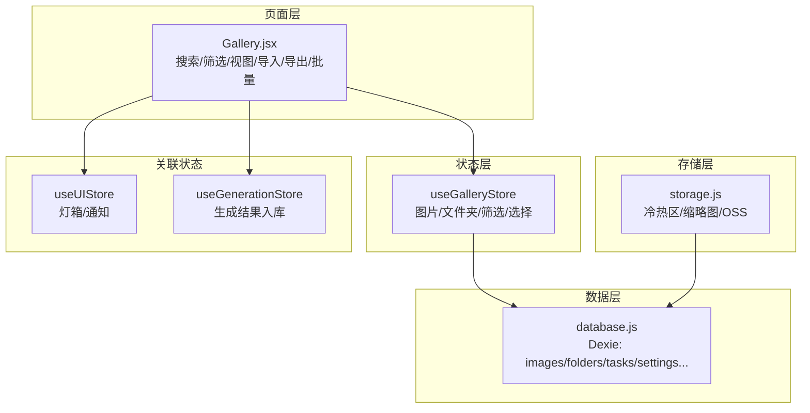
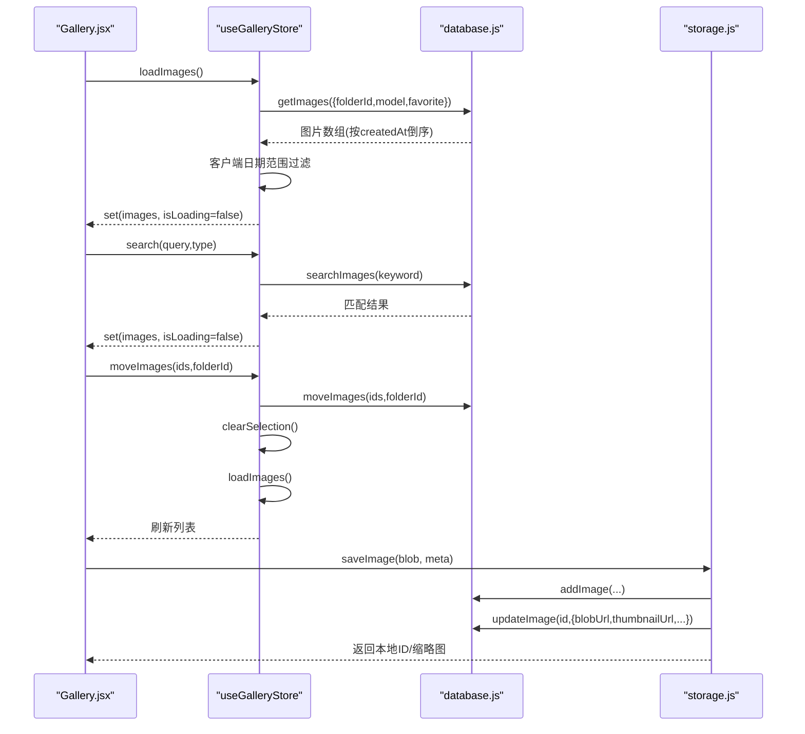
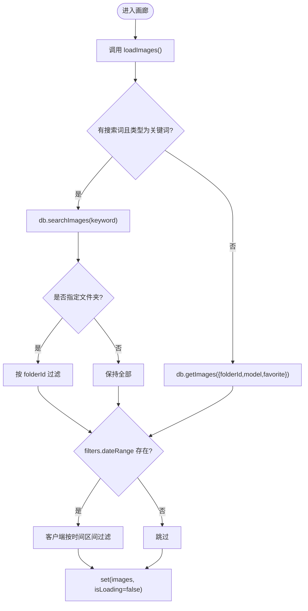
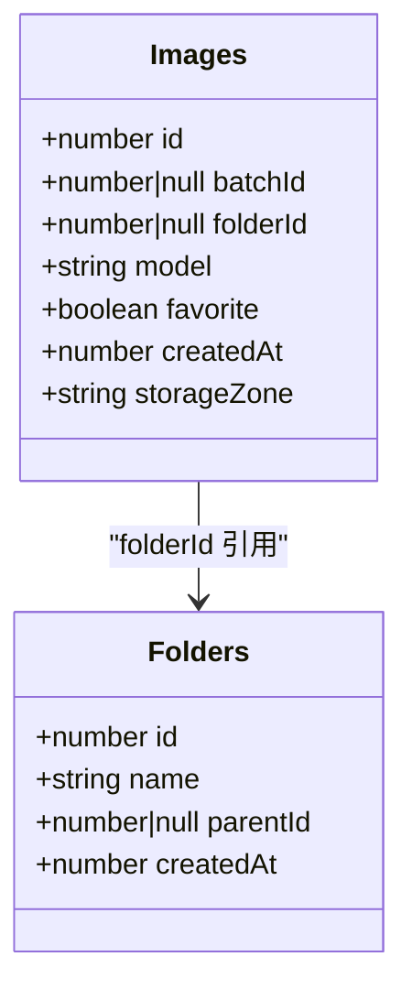
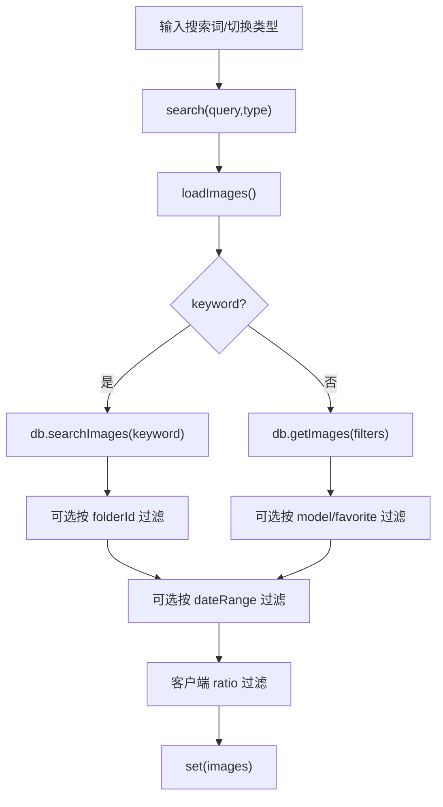
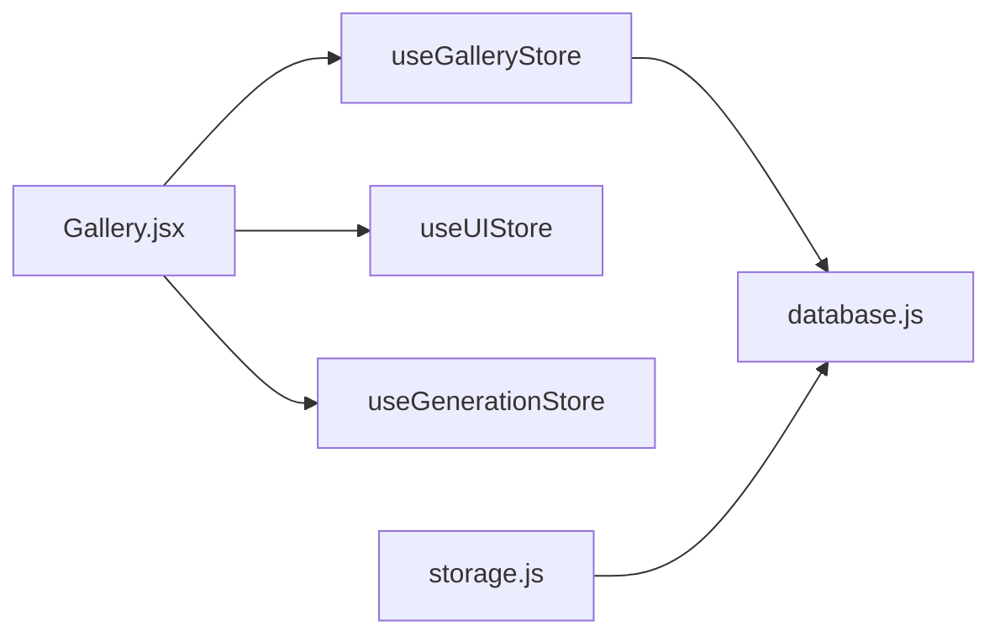

# 图库状态管理 (useGalleryStore)

<cite>
**本文引用的文件**   
- [app/src/stores/useGalleryStore.js](file://app/src/stores/useGalleryStore.js)
- [app/src/db/database.js](file://app/src/db/database.js)
- [app/src/pages/Gallery.jsx](file://app/src/pages/Gallery.jsx)
- [app/src/services/storage.js](file://app/src/services/storage.js)
- [app/src/stores/useUIStore.js](file://app/src/stores/useUIStore.js)
- [app/src/stores/useGenerationStore.js](file://app/src/stores/useGenerationStore.js)
</cite>

## 目录
1. [简介](#简介)
2. [项目结构](#项目结构)
3. [核心组件](#核心组件)
4. [架构总览](#架构总览)
5. [详细组件分析](#详细组件分析)
6. [依赖关系分析](#依赖关系分析)
7. [性能考量](#性能考量)
8. [故障排查指南](#故障排查指南)
9. [结论](#结论)
10. [附录：API 与使用示例](#附录api-与使用示例)

## 简介
本文件为 AI Image Studio 的图库状态管理 Store（useGalleryStore）提供系统化、可操作的文档。内容覆盖图片集合管理、文件夹分类系统、搜索过滤、批量操作、数据模型与元数据、存储区域分配与缩略图处理、与数据库层的交互模式（分页/索引/同步）、文件夹树维护、移动与复制实现、筛选条件与排序规则、视图模式切换，以及完整的 API 接口说明与实际使用场景。

## 项目结构
围绕 useGalleryStore 的相关代码分布在以下模块：
- 状态层：useGalleryStore（Zustand + Immer）
- 数据层：database.js（Dexie IndexedDB 封装）
- 页面层：Gallery.jsx（调用 store 并驱动 UI）
- 存储层：storage.js（冷热区迁移、缩略图生成、OSS 上传下载）
- 关联状态：useUIStore（灯箱、通知等）、useGenerationStore（生成结果写入 DB）

图表来源
- [app/src/stores/useGalleryStore.js:1-204](file://app/src/stores/useGalleryStore.js#L1-L204)
- [app/src/db/database.js:1-339](file://app/src/db/database.js#L1-L339)
- [app/src/pages/Gallery.jsx:1-527](file://app/src/pages/Gallery.jsx#L1-L527)
- [app/src/services/storage.js:1-393](file://app/src/services/storage.js#L1-L393)
- [app/src/stores/useUIStore.js:1-159](file://app/src/stores/useUIStore.js#L1-L159)
- [app/src/stores/useGenerationStore.js:1-360](file://app/src/stores/useGenerationStore.js#L1-L360)

章节来源
- [app/src/stores/useGalleryStore.js:1-204](file://app/src/stores/useGalleryStore.js#L1-L204)
- [app/src/db/database.js:1-339](file://app/src/db/database.js#L1-L339)
- [app/src/pages/Gallery.jsx:1-527](file://app/src/pages/Gallery.jsx#L1-L527)

## 核心组件
- useGalleryStore
  - 职责：集中管理图片列表、文件夹树、当前文件夹、视图模式、搜索与筛选、选中项与加载态；提供增删改查、批量操作与导航到文件夹的能力。
  - 关键状态：images、folders、currentFolder、viewMode、searchQuery、searchType、filters、selectedImages、isLoading。
  - 关键动作：loadImages、loadFolders、search、filter、toggleFavorite、moveImages、deleteImages、createFolder、renameFolder、deleteFolder、setCurrentFolder、setViewMode、selectImage、clearSelection、batchAction。
- database.js
  - 职责：基于 Dexie 的 IndexedDB 封装，定义表结构与索引，提供图片、批次、会话、文件夹、任务、设置、案例包等 CRUD 与查询方法。
  - 关键能力：按 folderId/model/favorite 过滤、关键词搜索、批量更新/删除、统计、递归删除文件夹。
- Gallery.jsx
  - 职责：组合 useGalleryStore 与 UI 状态，实现搜索框、筛选器、视图切换、导入导出、批量操作、上下文菜单、懒加载分组展示等。
- storage.js
  - 职责：冷热区存储策略、缩略图生成、OSS 上传下载、容量阈值迁移、存储统计。
- useUIStore / useGenerationStore
  - 职责：UI 全局状态（灯箱、通知、遮罩编辑器）；工作区生成流程与结果持久化。

章节来源
- [app/src/stores/useGalleryStore.js:11-203](file://app/src/stores/useGalleryStore.js#L11-L203)
- [app/src/db/database.js:22-31](file://app/src/db/database.js#L22-L31)
- [app/src/pages/Gallery.jsx:53-127](file://app/src/pages/Gallery.jsx#L53-L127)
- [app/src/services/storage.js:44-314](file://app/src/services/storage.js#L44-L314)
- [app/src/stores/useUIStore.js:12-158](file://app/src/stores/useUIStore.js#L12-L158)
- [app/src/stores/useGenerationStore.js:22-290](file://app/src/stores/useGenerationStore.js#L22-L290)

## 架构总览
useGalleryStore 作为“状态控制器”，通过 database.js 访问 IndexedDB，Gallery.jsx 作为“视图控制器”驱动用户交互，storage.js 负责冷热区与缩略图，其他 store 提供跨域状态协作。

图表来源
- [app/src/stores/useGalleryStore.js:29-108](file://app/src/stores/useGalleryStore.js#L29-L108)
- [app/src/db/database.js:56-127](file://app/src/db/database.js#L56-L127)
- [app/src/pages/Gallery.jsx:98-127](file://app/src/pages/Gallery.jsx#L98-L127)
- [app/src/services/storage.js:51-79](file://app/src/services/storage.js#L51-L79)

## 详细组件分析

### 数据模型与组织结构
- 图片记录字段（images 表）
  - 标识与归属：id、batchId、folderId
  - 元数据：model、prompt、params、tags、width、height、status、taskId、error
  - 存储与显示：url、thumbnailUrl、blobUrl、blobSize、storageZone、ossKey、ossUrl
  - 时间戳与标记：createdAt、favorite
- 文件夹记录（folders 表）
  - id、name、parentId、createdAt
- 索引与排序
  - images 表复合索引 [folderId+createdAt]，用于按文件夹和时间排序
  - tasks 表复合索引 [status+createdAt]，用于任务队列与时间排序
  - getImages 默认按 createdAt 倒序（最新优先），支持 limit/offset 分页

章节来源
- [app/src/db/database.js:22-31](file://app/src/db/database.js#L22-L31)
- [app/src/db/database.js:56-76](file://app/src/db/database.js#L56-L76)

### 图片集合管理与加载流程
- 加载入口：loadImages
  - 若处于关键词搜索且 searchType=keyword，则走 db.searchImages 并在客户端按 currentFolder 二次过滤
  - 否则走 db.getImages，传入 folderId、model、favorite 等过滤条件
  - 若 filters.dateRange 存在，则在客户端进行时间区间过滤
  - 最终 set(images)，并关闭 isLoading
- 分页加载
  - 页面层通过 displayCount 控制初始渲染数量，滚动到底部时追加 50 条，结合 clientFiltered.length 判断是否继续加载
  - 数据层 getImages 支持 limit/offset，但当前页面采用前端切片方式实现“加载更多”

图表来源
- [app/src/stores/useGalleryStore.js:29-62](file://app/src/stores/useGalleryStore.js#L29-L62)
- [app/src/pages/Gallery.jsx:128-138](file://app/src/pages/Gallery.jsx#L128-L138)

章节来源
- [app/src/stores/useGalleryStore.js:29-62](file://app/src/stores/useGalleryStore.js#L29-L62)
- [app/src/pages/Gallery.jsx:128-138](file://app/src/pages/Gallery.jsx#L128-L138)

### 文件夹分类系统与树形维护
- 树形结构
  - folders 表以 parentId 表示层级关系，getFolders(parentId=null) 返回根或子级
  - deleteFolder 会递归删除子文件夹，并将该文件夹下所有图片的 folderId 置空（回退至根）
- 导航与切换
  - setCurrentFolder(folderId) 切换当前文件夹并清空选中项，随后重新加载图片
  - createFolder/renameFolder/deleteFolder 均触发 loadFolders 刷新树

图表来源
- [app/src/db/database.js:22-31](file://app/src/db/database.js#L22-L31)
- [app/src/db/database.js:196-229](file://app/src/db/database.js#L196-L229)

章节来源
- [app/src/db/database.js:196-229](file://app/src/db/database.js#L196-L229)
- [app/src/stores/useGalleryStore.js:125-152](file://app/src/stores/useGalleryStore.js#L125-L152)

### 搜索与筛选
- 搜索类型
  - keyword：在 prompt、model、tags 中做子串匹配（大小写不敏感）
  - semantic/image：预留扩展点，当前仅提示即将推出
- 筛选维度
  - 模型（model）、收藏（favorite）、日期（dateRange）、比例（ratio，客户端计算）
- 行为
  - search(query,type) 更新搜索状态并触发 loadImages
  - filter(newFilters) 合并 filters 并触发 loadImages
  - ratio 过滤在客户端执行，基于 width/height 计算横版/竖版/方形

图表来源
- [app/src/stores/useGalleryStore.js:74-88](file://app/src/stores/useGalleryStore.js#L74-L88)
- [app/src/db/database.js:98-110](file://app/src/db/database.js#L98-L110)
- [app/src/pages/Gallery.jsx:113-132](file://app/src/pages/Gallery.jsx#L113-L132)

章节来源
- [app/src/stores/useGalleryStore.js:74-88](file://app/src/stores/useGalleryStore.js#L74-L88)
- [app/src/db/database.js:98-110](file://app/src/db/database.js#L98-L110)
- [app/src/pages/Gallery.jsx:113-132](file://app/src/pages/Gallery.jsx#L113-L132)

### 批量操作支持
- 支持的批量动作
  - favorite：遍历 selectedImages 逐个 toggleFavorite
  - move：批量移动到目标文件夹
  - delete：批量删除
- 操作流程
  - 根据 action 分发到对应 DB 方法
  - 清空 selectedImages 并重新加载图片列表
- 界面集成
  - 顶部批量工具栏与右键菜单联动，统一调用 store 的 batchAction

章节来源
- [app/src/stores/useGalleryStore.js:178-202](file://app/src/stores/useGalleryStore.js#L178-L202)
- [app/src/pages/Gallery.jsx:342-353](file://app/src/pages/Gallery.jsx#L342-L353)

### 图片移动与复制
- 移动
  - moveImages(imageIds, folderId) 调用 db.moveImages 批量更新 folderId
  - 成功后清空选中项并刷新列表
- 复制
  - 当前未提供直接复制接口；如需复制，可在业务层读取原图元数据后新增一条记录（参考 addImage 字段），再指向同一 url/thumbnailUrl 或重新生成缩略图

章节来源
- [app/src/stores/useGalleryStore.js:101-108](file://app/src/stores/useGalleryStore.js#L101-L108)
- [app/src/db/database.js:122-127](file://app/src/db/database.js#L122-L127)
- [app/src/db/database.js:43-50](file://app/src/db/database.js#L43-L50)

### 元数据管理、收藏状态与缩略图
- 元数据
  - 包含 model、prompt、params、width、height、status、taskId 等，便于详情展示与再生成复用
- 收藏
  - toggleFavorite 单条切换，batchAction('favorite') 批量切换
- 缩略图
  - 导入流程中使用 Canvas 生成缩略图并保存 thumbnailUrl
  - storage.js 提供统一的缩略图生成逻辑（最大边长限制）

章节来源
- [app/src/pages/Gallery.jsx:148-228](file://app/src/pages/Gallery.jsx#L148-L228)
- [app/src/services/storage.js:323-347](file://app/src/services/storage.js#L323-L347)
- [app/src/stores/useGalleryStore.js:90-99](file://app/src/stores/useGalleryStore.js#L90-L99)

### 存储区域分配与冷热迁移
- 热区（hot）：IndexedDB 内 Blob，适合快速预览
- 冷区（cold）：阿里云 OSS，适合长期归档
- 迁移策略
  - checkAndMigrate 按 hotCapacity 阈值从旧到新迁移，直到低于阈值
  - moveToColdZone 将 blob 上传 OSS，更新 storageZone/ossKey/ossUrl，释放本地 blobUrl
  - moveToHotZone 从 OSS 拉取并重建 blobUrl
- 统计
  - getImageStats 与 getStorageStats 提供总量、分区计数与已用字节数

章节来源
- [app/src/services/storage.js:204-298](file://app/src/services/storage.js#L204-L298)
- [app/src/db/database.js:129-138](file://app/src/db/database.js#L129-L138)

### 与数据库层的交互模式
- 分页加载
  - 数据层 getImages 支持 limit/offset；页面层通过 displayCount 与滚动事件实现“加载更多”
- 索引查询
  - images 表使用 [folderId+createdAt] 复合索引优化按文件夹与时间查询
  - tasks 表使用 [status+createdAt] 复合索引优化任务队列
- 数据同步
  - 变更（移动/删除/收藏）后统一调用 loadImages 刷新列表
  - 生成流程通过 useGenerationStore 写入 images 表，Gallery 侧通过 loadImages 获取最新数据

章节来源
- [app/src/db/database.js:56-76](file://app/src/db/database.js#L56-L76)
- [app/src/db/database.js:22-31](file://app/src/db/database.js#L22-L31)
- [app/src/stores/useGalleryStore.js:101-108](file://app/src/stores/useGalleryStore.js#L101-L108)
- [app/src/stores/useGenerationStore.js:192-253](file://app/src/stores/useGenerationStore.js#L192-L253)

### 视图模式与排序规则
- 视图模式
  - viewMode: 'grid' | 'list'，由 setViewMode 切换
- 排序规则
  - 默认按 createdAt 倒序（最新优先）
  - 页面层按时间分组（今天/昨天/本周/本月/更早）并支持折叠

章节来源
- [app/src/stores/useGalleryStore.js:154-157](file://app/src/stores/useGalleryStore.js#L154-L157)
- [app/src/db/database.js:56-76](file://app/src/db/database.js#L56-L76)
- [app/src/pages/Gallery.jsx:34-51](file://app/src/pages/Gallery.jsx#L34-L51)

## 依赖关系分析
- useGalleryStore 依赖 database.js 完成数据读写
- Gallery.jsx 消费 useGalleryStore 并提供用户交互
- storage.js 独立于 store，直接操作 database.js 与 OSS
- useUIStore 提供 UI 辅助能力（灯箱、通知）
- useGenerationStore 与 database.js 协作写入生成结果

图表来源
- [app/src/stores/useGalleryStore.js:1-204](file://app/src/stores/useGalleryStore.js#L1-L204)
- [app/src/db/database.js:1-339](file://app/src/db/database.js#L1-L339)
- [app/src/pages/Gallery.jsx:1-527](file://app/src/pages/Gallery.jsx#L1-L527)
- [app/src/services/storage.js:1-393](file://app/src/services/storage.js#L1-L393)
- [app/src/stores/useUIStore.js:1-159](file://app/src/stores/useUIStore.js#L1-L159)
- [app/src/stores/useGenerationStore.js:1-360](file://app/src/stores/useGenerationStore.js#L1-L360)

章节来源
- [app/src/stores/useGalleryStore.js:1-204](file://app/src/stores/useGalleryStore.js#L1-L204)
- [app/src/db/database.js:1-339](file://app/src/db/database.js#L1-L339)
- [app/src/pages/Gallery.jsx:1-527](file://app/src/pages/Gallery.jsx#L1-L527)
- [app/src/services/storage.js:1-393](file://app/src/services/storage.js#L1-L393)
- [app/src/stores/useUIStore.js:1-159](file://app/src/stores/useUIStore.js#L1-L159)
- [app/src/stores/useGenerationStore.js:1-360](file://app/src/stores/useGenerationStore.js#L1-L360)

## 性能考量
- 列表渲染
  - 使用 displayCount 与滚动监听实现增量加载，避免一次性渲染大量 DOM
  - 分组渲染减少首屏复杂度
- 过滤与搜索
  - 关键词搜索在内存中进行子串匹配，建议对 tags/prompt 建立合适索引或在数据量增大时引入后端检索
  - 客户端 ratio/dateRange 过滤在内存执行，注意大数据集下的性能
- 缩略图
  - 使用 Canvas 生成固定尺寸缩略图，降低大图渲染开销
- 冷热迁移
  - 按创建时间升序迁移最旧图片，避免频繁大对象 IO
  - 迁移过程中保留缩略图，保障预览体验

[本节为通用指导，无需源码引用]

## 故障排查指南
- 常见问题
  - 搜索无结果：确认 searchType 是否为 keyword；检查 prompt/model/tags 是否包含关键词
  - 移动失败：确认目标文件夹是否存在；检查 moveImages 返回值
  - 缩略图缺失：检查 thumbnailUrl 是否存在；确认导入流程是否正确生成
  - 冷热迁移异常：检查 OSS 配置与权限；查看迁移日志定位失败图片
- 调试建议
  - 打开浏览器控制台，关注 [GalleryStore]/[db]/[StorageService] 相关日志
  - 使用 IndexedDB 开发者工具验证 records 与索引
  - 针对批量操作，先小批量验证再扩大规模

章节来源
- [app/src/stores/useGalleryStore.js:58-61](file://app/src/stores/useGalleryStore.js#L58-L61)
- [app/src/db/database.js:327-336](file://app/src/db/database.js#L327-L336)
- [app/src/services/storage.js:147-150](file://app/src/services/storage.js#L147-L150)

## 结论
useGalleryStore 以清晰的状态边界与动作语义组织图库核心能力，配合 database.js 的索引与分页、storage.js 的冷热区策略，形成高效可扩展的图库子系统。建议在数据量增长时逐步引入服务端检索与更细粒度的分页策略，同时完善复制与更多批量动作。

[本节为总结性内容，无需源码引用]

## 附录：API 与使用示例

### useGalleryStore 公开 API
- 状态
  - images: Array<Image>
  - folders: Array<Folder>
  - currentFolder: number|null
  - viewMode: 'grid'|'list'
  - searchQuery: string
  - searchType: 'keyword'|'semantic'|'visual'
  - filters: { model?: string|null; favorite?: boolean|null; dateRange?: [start,end]|null }
  - selectedImages: number[]
  - isLoading: boolean
- 动作
  - loadImages(): Promise<void>
  - loadFolders(): Promise<void>
  - search(query: string, type?: string): Promise<void>
  - filter(newFilters: Partial<typeof filters>): void
  - toggleFavorite(imageId: number): Promise<boolean>
  - moveImages(imageIds?: number[], folderId: number|null): Promise<void>
  - deleteImages(imageIds?: number[]): Promise<void>
  - createFolder(name: string, parentId?: number|null): Promise<number>
  - renameFolder(folderId: number, newName: string): Promise<void>
  - deleteFolder(folderId: number): Promise<void>
  - setCurrentFolder(folderId: number|null): void
  - setViewMode(mode: 'grid'|'list'): void
  - selectImage(imageId: number): void
  - clearSelection(): void
  - batchAction(action: 'favorite'|'move'|'delete', payload?: { folderId?: number }): Promise<void>

章节来源
- [app/src/stores/useGalleryStore.js:11-203](file://app/src/stores/useGalleryStore.js#L11-L203)

### 典型使用场景（路径指引）
- 初始化加载与文件夹导航
  - 页面挂载时调用 loadImages/loadFolders；URL 参数 folder 驱动 setCurrentFolder
  - 参考：[app/src/pages/Gallery.jsx:98-100](file://app/src/pages/Gallery.jsx#L98-L100)
- 关键词搜索与筛选联动
  - 输入框防抖触发 search；筛选器变化触发 filter
  - 参考：[app/src/pages/Gallery.jsx:109-122](file://app/src/pages/Gallery.jsx#L109-L122)
- 批量收藏/移动/删除
  - 顶部工具栏与右键菜单调用 batchAction/moveImages/deleteImages
  - 参考：[app/src/pages/Gallery.jsx:342-353](file://app/src/pages/Gallery.jsx#L342-L353)、[app/src/stores/useGalleryStore.js:178-202](file://app/src/stores/useGalleryStore.js#L178-L202)
- 导入图片并生成缩略图
  - 选择文件后生成缩略图并写入 DB，完成后刷新列表
  - 参考：[app/src/pages/Gallery.jsx:148-228](file://app/src/pages/Gallery.jsx#L148-L228)
- 冷热区迁移与统计
  - 调用 StorageService.checkAndMigrate/getStorageStats 监控与迁移
  - 参考：[app/src/services/storage.js:252-314](file://app/src/services/storage.js#L252-L314)

### 数据库层关键方法（路径指引）
- 图片
  - addImage/updateImage/deleteImage/deleteImages/getImage/getImages/searchImages/toggleImageFavorite/moveImages/getImageStats
  - 参考：[app/src/db/database.js:43-138](file://app/src/db/database.js#L43-L138)
- 文件夹
  - addFolder/getFolders/getFolder/updateFolder/deleteFolder
  - 参考：[app/src/db/database.js:196-229](file://app/src/db/database.js#L196-L229)
- 初始化
  - initDatabase
  - 参考：[app/src/db/database.js:327-336](file://app/src/db/database.js#L327-L336)

### 与生成流程的协作（路径指引）
- 生成结果写入 images 表，Gallery 通过 loadImages 获取最新数据
- 参考：[app/src/stores/useGenerationStore.js:192-253](file://app/src/stores/useGenerationStore.js#L192-L253)