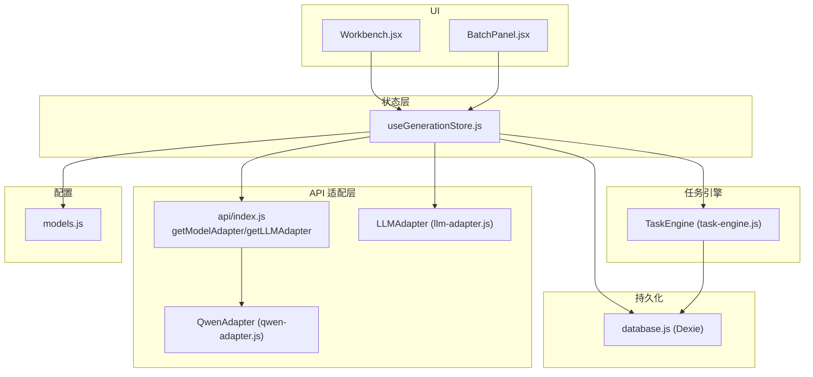
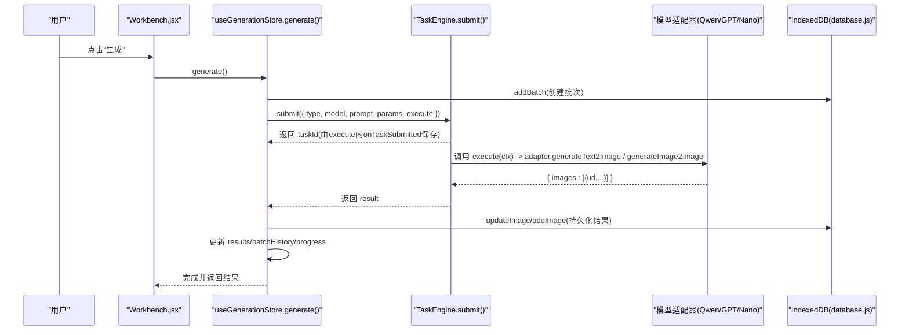
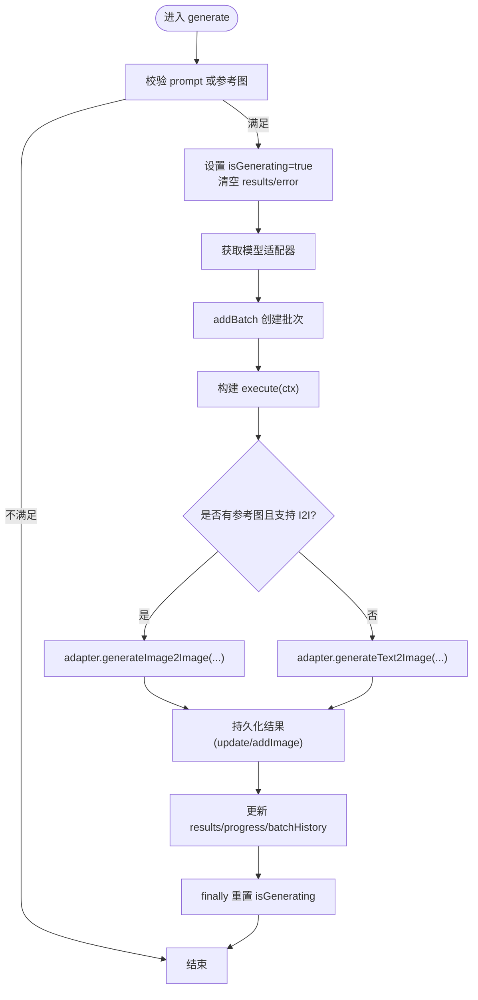
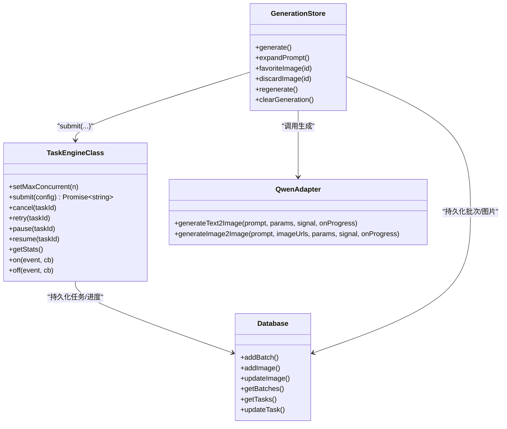
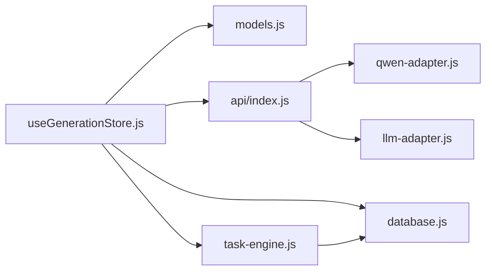

# 生成状态管理 (useGenerationStore)

<cite>
**本文引用的文件**   
- [app/src/stores/useGenerationStore.js](file://app/src/stores/useGenerationStore.js)
- [app/src/services/task-engine.js](file://app/src/services/task-engine.js)
- [app/src/services/api/index.js](file://app/src/services/api/index.js)
- [app/src/constants/models.js](file://app/src/constants/models.js)
- [app/src/db/database.js](file://app/src/db/database.js)
- [app/src/services/api/qwen-adapter.js](file://app/src/services/api/qwen-adapter.js)
- [app/src/services/api/llm-adapter.js](file://app/src/services/api/llm-adapter.js)
- [app/src/pages/Workbench.jsx](file://app/src/pages/Workbench.jsx)
- [app/src/components/BatchPanel.jsx](file://app/src/components/BatchPanel.jsx)
</cite>

## 目录
1. [简介](#简介)
2. [项目结构](#项目结构)
3. [核心组件](#核心组件)
4. [架构总览](#架构总览)
5. [详细组件分析](#详细组件分析)
6. [依赖关系分析](#依赖关系分析)
7. [性能与内存优化](#性能与内存优化)
8. [故障排查指南](#故障排查指南)
9. [结论](#结论)
10. [附录：接口与使用示例](#附录接口与使用示例)

## 简介
本文件聚焦 AI Image Studio 的“生成状态管理 Store”——useGenerationStore，系统性阐述其职责边界、数据模型、方法契约、与 TaskEngine 的集成机制、图像生成的端到端流程（从用户触发到结果持久化）、批量历史管理与提示词扩写能力，以及基于 Immer 的性能优化策略与内存管理建议。

## 项目结构
围绕 useGenerationStore 的关键代码分布在以下位置：
- 状态与动作定义：stores/useGenerationStore.js
- 任务调度与进度回调：services/task-engine.js
- 模型适配器工厂与 LLM 适配器：services/api/index.js, services/api/qwen-adapter.js, services/api/llm-adapter.js
- 模型能力与默认参数：constants/models.js
- 本地持久化（IndexedDB）：db/database.js
- UI 调用入口与工作流：pages/Workbench.jsx, components/BatchPanel.jsx

图表来源
- [app/src/stores/useGenerationStore.js:1-360](file://app/src/stores/useGenerationStore.js#L1-L360)
- [app/src/services/task-engine.js:1-319](file://app/src/services/task-engine.js#L1-L319)
- [app/src/services/api/index.js:1-39](file://app/src/services/api/index.js#L1-L39)
- [app/src/services/api/qwen-adapter.js:1-209](file://app/src/services/api/qwen-adapter.js#L1-L209)
- [app/src/services/api/llm-adapter.js:1-150](file://app/src/services/api/llm-adapter.js#L1-L150)
- [app/src/constants/models.js:1-106](file://app/src/constants/models.js#L1-L106)
- [app/src/db/database.js:1-339](file://app/src/db/database.js#L1-L339)
- [app/src/pages/Workbench.jsx:1-800](file://app/src/pages/Workbench.jsx#L1-L800)
- [app/src/components/BatchPanel.jsx:1-675](file://app/src/components/BatchPanel.jsx#L1-L675)

章节来源
- [app/src/stores/useGenerationStore.js:1-360](file://app/src/stores/useGenerationStore.js#L1-L360)
- [app/src/services/task-engine.js:1-319](file://app/src/services/task-engine.js#L1-L319)
- [app/src/services/api/index.js:1-39](file://app/src/services/api/index.js#L1-L39)
- [app/src/constants/models.js:1-106](file://app/src/constants/models.js#L1-L106)
- [app/src/db/database.js:1-339](file://app/src/db/database.js#L1-L339)
- [app/src/pages/Workbench.jsx:1-800](file://app/src/pages/Workbench.jsx#L1-L800)
- [app/src/components/BatchPanel.jsx:1-675](file://app/src/components/BatchPanel.jsx#L1-L675)

## 核心组件
useGenerationStore 是工作区“生成”相关的全局状态中心，负责：
- 当前模型与默认参数管理
- 提示词输入与扩写变体管理
- 参考图片集合（角色、数量限制）
- 生成参数配置（尺寸、质量、种子等）
- 生成结果展示与收藏/删除
- 批量历史记录（按批次聚合）
- 生成中标志与进度条
- 错误信息暴露

关键状态字段概览（类型说明见附录）：
- currentModel、prompt、expandedPrompts、referenceImages、params、results、batchHistory、isGenerating、generatingProgress、currentBatchId、generationError

章节来源
- [app/src/stores/useGenerationStore.js:22-35](file://app/src/stores/useGenerationStore.js#L22-L35)
- [app/src/constants/models.js:8-92](file://app/src/constants/models.js#L8-L92)

## 架构总览
useGenerationStore 通过 TaskEngine 将异步生成任务提交到后台执行，内部构造 execute 函数以桥接具体模型适配器（如 QwenAdapter），并在适配器返回结果后写入 IndexedDB，同时更新 store 的 results 与 batchHistory。

图表来源
- [app/src/stores/useGenerationStore.js:112-290](file://app/src/stores/useGenerationStore.js#L112-L290)
- [app/src/services/task-engine.js:57-81](file://app/src/services/task-engine.js#L57-L81)
- [app/src/services/api/qwen-adapter.js:60-105](file://app/src/services/api/qwen-adapter.js#L60-L105)
- [app/src/db/database.js:144-171](file://app/src/db/database.js#L144-L171)
- [app/src/db/database.js:43-91](file://app/src/db/database.js#L43-L91)

## 详细组件分析

### 状态结构与初始化
- 当前模型：currentModel 初始为 qwen-image-3
- 提示词：prompt 为空字符串
- 扩写变体：expandedPrompts 空数组
- 参考图：referenceImages 支持多张，受模型 capabilities.maxRefs 限制
- 参数：params 来自所选模型的 defaultParams
- 结果：results 当前批次的图片记录
- 批量历史：batchHistory 按时间倒序插入最新批次
- 生成控制：isGenerating、generatingProgress、currentBatchId、generationError

章节来源
- [app/src/stores/useGenerationStore.js:22-35](file://app/src/stores/useGenerationStore.js#L22-L35)
- [app/src/constants/models.js:8-92](file://app/src/constants/models.js#L8-L92)

### 模型切换与参数重置
setModel(modelId) 会：
- 校验模型是否存在
- 重置 currentModel、params 为默认值
- 清空 expandedPrompts、referenceImages、results、generationError

章节来源
- [app/src/stores/useGenerationStore.js:38-52](file://app/src/stores/useGenerationStore.js#L38-L52)

### 提示词与扩写
- setPrompt(text)：直接设置 prompt
- expandPrompt()：通过 getLLMAdapter().expandPrompt(prompt, { model }) 获取变体，存入 expandedPrompts
- selectExpandedPrompt(text)：选择某一条变体作为当前 prompt，并清空变体列表

章节来源
- [app/src/stores/useGenerationStore.js:54-57](file://app/src/stores/useGenerationStore.js#L54-L57)
- [app/src/stores/useGenerationStore.js:295-313](file://app/src/stores/useGenerationStore.js#L295-L313)
- [app/src/services/api/llm-adapter.js:35-61](file://app/src/services/api/llm-adapter.js#L35-L61)

### 参考图片管理
- addReferenceImage(image)：根据当前模型 maxRefs 限制添加，自动分配 id/url/name/blob/role
- removeReferenceImage(imageId)：按 id 移除
- setReferenceImageRole(imageId, role)：修改角色标签

章节来源
- [app/src/stores/useGenerationStore.js:59-97](file://app/src/stores/useGenerationStore.js#L59-L97)
- [app/src/constants/models.js:8-92](file://app/src/constants/models.js#L8-L92)

### 生成参数配置
- setParam(key, value)：增量更新 params 中的某个键

章节来源
- [app/src/stores/useGenerationStore.js:99-106](file://app/src/stores/useGenerationStore.js#L99-L106)

### 图像生成主流程 generate()
整体步骤：
1. 前置校验：prompt 或 referenceImages 至少有一个非空
2. 设置 isGenerating=true、progress=0、清空 results 和 generationError
3. 获取适配器 getModelAdapter(currentModel)
4. 创建批次 addBatch(...)，得到 batchId
5. 构建 execute(ctx)：
   - 根据是否包含参考图且适配器支持 I2I，决定调用 generateImage2Image 或 generateText2Image
   - onTaskSubmitted(taskId)：在适配器返回 task_id 时立即持久化 pending 记录（status=pending），确保刷新后可恢复
   - 捕获适配器异常：若已存在 pending 记录则标记 failed
   - 解析 result.images，逐个持久化：优先更新第一条的 pending 记录，其余新增
   - 返回 { images:[...], batchId }
6. TaskEngine.submit 执行 execute，完成后：
   - 更新 results、progress=100
   - 将本次结果推入 batchHistory 头部
7. finally 中重置 isGenerating=false；catch 中记录 generationError

图表来源
- [app/src/stores/useGenerationStore.js:112-290](file://app/src/stores/useGenerationStore.js#L112-L290)
- [app/src/services/api/index.js:20-31](file://app/src/services/api/index.js#L20-L31)
- [app/src/db/database.js:144-171](file://app/src/db/database.js#L144-L171)
- [app/src/db/database.js:43-91](file://app/src/db/database.js#L43-L91)

章节来源
- [app/src/stores/useGenerationStore.js:112-290](file://app/src/stores/useGenerationStore.js#L112-L290)

### 与 TaskEngine 的集成
- TaskEngine.submit(config)：持久化任务记录、入队、并发控制、事件广播、指数退避重试、取消/暂停/恢复
- execute(ctx) 上下文：
  - signal：用于中断请求
  - onProgress(percent)：上报进度，TaskEngine 持久化并广播 task:progress
  - onTaskSubmitted(taskId)：在适配器侧获得 task_id 时回调，用于提前落库 pending 记录
- 错误处理：
  - 适配器抛错：若已有 pending 记录则更新为 failed
  - TaskEngine 对可重试错误进行指数退避重试，最多 3 次

图表来源
- [app/src/services/task-engine.js:33-319](file://app/src/services/task-engine.js#L33-L319)
- [app/src/stores/useGenerationStore.js:112-290](file://app/src/stores/useGenerationStore.js#L112-L290)
- [app/src/services/api/qwen-adapter.js:51-173](file://app/src/services/api/qwen-adapter.js#L51-L173)
- [app/src/db/database.js:144-171](file://app/src/db/database.js#L144-L171)
- [app/src/db/database.js:43-91](file://app/src/db/database.js#L43-L91)

章节来源
- [app/src/services/task-engine.js:57-81](file://app/src/services/task-engine.js#L57-L81)
- [app/src/services/task-engine.js:222-297](file://app/src/services/task-engine.js#L222-L297)
- [app/src/stores/useGenerationStore.js:112-290](file://app/src/stores/useGenerationStore.js#L112-L290)

### 批量历史管理与提示词扩写
- 批量历史：每次成功生成后，将 { batchId, prompt, model, images[], createdAt } 插入 batchHistory 头部
- 提示词扩写：expandPrompt 调用 LLMAdapter.expandPrompt，返回多条变体，selectExpandedPrompt 将其设为当前 prompt

章节来源
- [app/src/stores/useGenerationStore.js:268-280](file://app/src/stores/useGenerationStore.js#L268-L280)
- [app/src/stores/useGenerationStore.js:295-313](file://app/src/stores/useGenerationStore.js#L295-L313)
- [app/src/services/api/llm-adapter.js:35-61](file://app/src/services/api/llm-adapter.js#L35-L61)

### UI 集成与使用方式
- Workbench.jsx 订阅 store 的状态与方法，绑定键盘快捷键（Ctrl/Cmd+Enter 触发生成）
- BatchPanel.jsx 提供三种批量模式：重复批次、多变体组合、Prompt 队列，均循环调用 generate()

章节来源
- [app/src/pages/Workbench.jsx:63-182](file://app/src/pages/Workbench.jsx#L63-L182)
- [app/src/components/BatchPanel.jsx:48-101](file://app/src/components/BatchPanel.jsx#L48-L101)

## 依赖关系分析
- useGenerationStore 依赖：
  - models.js：模型能力与默认参数
  - api/index.js：getModelAdapter/getLLMAdapter 工厂
  - task-engine.js：TaskEngine 单例
  - database.js：批次/图片/任务持久化
- TaskEngine 依赖：
  - database.js：任务表读写
  - notification.js：浏览器通知（外部模块）
- 适配器依赖：
  - QwenAdapter：DashScope API 封装
  - LLMAdapter：提示词扩写

图表来源
- [app/src/stores/useGenerationStore.js:1-21](file://app/src/stores/useGenerationStore.js#L1-L21)
- [app/src/services/task-engine.js:1-16](file://app/src/services/task-engine.js#L1-L16)
- [app/src/services/api/index.js:1-13](file://app/src/services/api/index.js#L1-L13)

章节来源
- [app/src/stores/useGenerationStore.js:1-21](file://app/src/stores/useGenerationStore.js#L1-L21)
- [app/src/services/task-engine.js:1-16](file://app/src/services/task-engine.js#L1-L16)
- [app/src/services/api/index.js:1-13](file://app/src/services/api/index.js#L1-L13)

## 性能与内存优化
- Immer 的使用：
  - 所有 set 操作普遍使用 produce 包裹，避免手动深拷贝，提升不可变更新的效率与可读性
- 批量更新与最小化重渲染：
  - 仅变更必要字段，减少不必要的 re-render
- 进度上报节流：
  - 适配器在关键阶段调用 onProgress，TaskEngine 统一持久化与广播，避免 UI 频繁刷新
- 内存管理建议：
  - 参考图 URL.createObjectURL 产生的对象 URL 应在不再使用时释放，避免内存泄漏
  - 大体积图片下载与缓存需结合 StorageService 与 IndexedDB 的冷热分层策略
- 并发控制：
  - TaskEngine 默认最大并发 3，可通过 setMaxConcurrent 调整，平衡吞吐与资源占用

章节来源
- [app/src/stores/useGenerationStore.js:42-51](file://app/src/stores/useGenerationStore.js#L42-L51)
- [app/src/stores/useGenerationStore.js:63-75](file://app/src/stores/useGenerationStore.js#L63-L75)
- [app/src/stores/useGenerationStore.js:100-106](file://app/src/stores/useGenerationStore.js#L100-L106)
- [app/src/services/task-engine.js:44-48](file://app/src/services/task-engine.js#L44-L48)
- [app/src/services/task-engine.js:233-236](file://app/src/services/task-engine.js#L233-L236)

## 故障排查指南
- 生成失败：
  - 检查 generationError 字段，查看 catch 分支记录的错误消息
  - 适配器抛错时，pending 记录会被标记为 failed，可在数据库 tasks/images 表中定位
- 进度无更新：
  - 确认适配器是否正确调用 onProgress，TaskEngine 会持久化并广播 task:progress
- 任务无法重试：
  - 仅 failed/cancelled 状态的任务可重试；TaskEngine 内置指数退避与最大重试次数
- 批量历史未显示：
  - 确认 addBatch 与 batchHistory.unshift 是否执行成功；页面启动时会从数据库加载历史

章节来源
- [app/src/stores/useGenerationStore.js:283-289](file://app/src/stores/useGenerationStore.js#L283-L289)
- [app/src/stores/useGenerationStore.js:167-186](file://app/src/stores/useGenerationStore.js#L167-L186)
- [app/src/services/task-engine.js:265-292](file://app/src/services/task-engine.js#L265-L292)
- [app/src/pages/Workbench.jsx:274-295](file://app/src/pages/Workbench.jsx#L274-L295)

## 结论
useGenerationStore 将“生成”这一复杂业务抽象为清晰的状态与动作，借助 TaskEngine 实现可靠的异步任务编排与进度反馈，并通过 IndexedDB 保障数据持久化与可恢复性。配合模型适配器与 LLM 扩写能力，形成从提示词工程到结果展示的完整闭环。合理使用 Immer 与并发控制，可在保证用户体验的同时兼顾性能与稳定性。

## 附录：接口与使用示例

### 状态字段定义（摘要）
- currentModel: string — 当前选用的模型 ID
- prompt: string — 当前提示词
- expandedPrompts: string[] — 扩写得到的多个变体
- referenceImages: Array<{id,url,name,blob,role}> — 参考图集合
- params: Object — 生成参数（size/n/seed/quality 等）
- results: Array<{id,url,prompt,params,...}> — 当前批次结果
- batchHistory: Array<{batchId,prompt,model,images[],createdAt}> — 历史批次
- isGenerating: boolean — 是否正在生成
- generatingProgress: number — 进度 0-100
- currentBatchId: number | null — 当前批次 ID
- generationError: string | null — 最近一次错误信息

章节来源
- [app/src/stores/useGenerationStore.js:22-35](file://app/src/stores/useGenerationStore.js#L22-L35)

### 主要方法接口
- setModel(modelId): void — 切换模型并重置相关状态
- setPrompt(text): void — 设置提示词
- addReferenceImage(image): void — 添加参考图（受 maxRefs 限制）
- removeReferenceImage(imageId): void — 移除参考图
- setReferenceImageRole(imageId, role): void — 设置参考图角色
- setParam(key, value): void — 更新单个参数
- generate(): Promise — 触发生成，返回结果
- expandPrompt(): Promise<string[]> — 扩写提示词
- selectExpandedPrompt(text): void — 选择扩写结果作为当前提示词
- favoriteImage(imageId): Promise — 收藏/取消收藏
- discardImage(imageId): Promise — 删除结果图片
- regenerate(): Promise — 用相同参数重新生成
- clearGeneration(): void — 清空生成状态

章节来源
- [app/src/stores/useGenerationStore.js:38-106](file://app/src/stores/useGenerationStore.js#L38-L106)
- [app/src/stores/useGenerationStore.js:112-358](file://app/src/stores/useGenerationStore.js#L112-L358)

### 典型使用示例（路径引用）
- 基础生成：
  - 参见 [Workbench.jsx 生成处理:164-182](file://app/src/pages/Workbench.jsx#L164-L182)
- 批量生成：
  - 参见 [BatchPanel 多批次/多变体/队列:48-101](file://app/src/components/BatchPanel.jsx#L48-L101)
- 提示词扩写：
  - 参见 [Workbench 扩写按钮与展开面板:184-195](file://app/src/pages/Workbench.jsx#L184-L195)