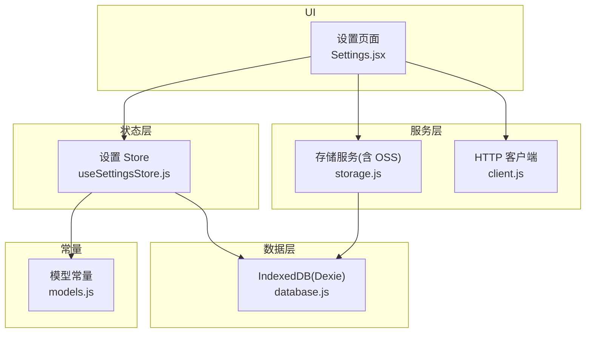
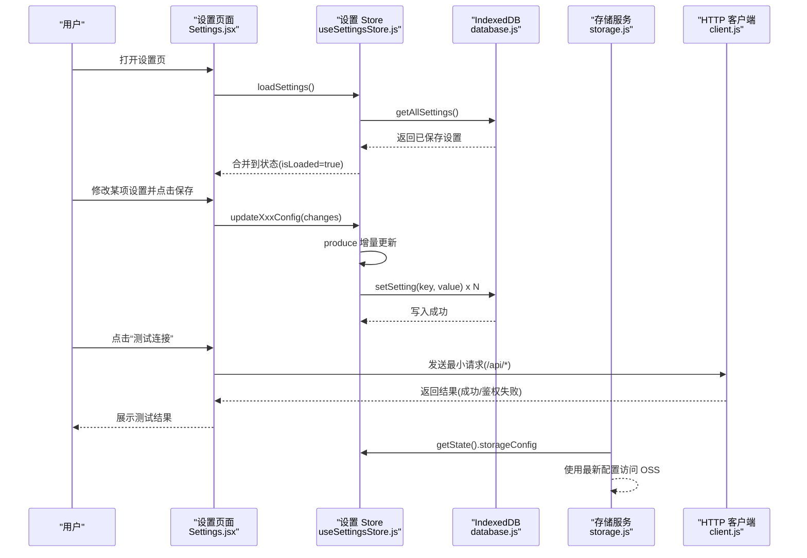
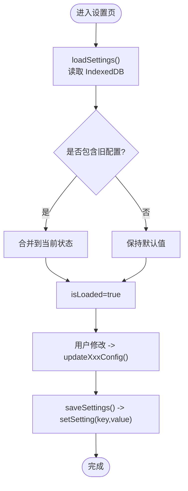
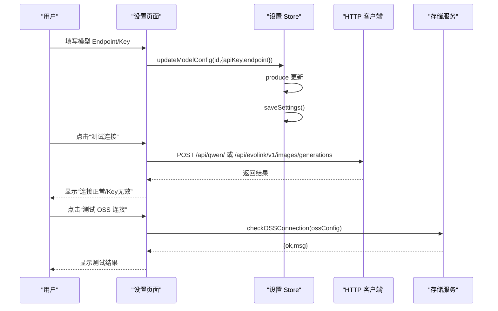
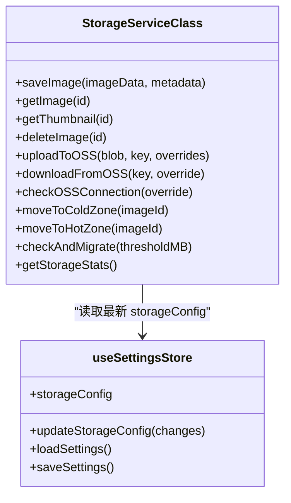
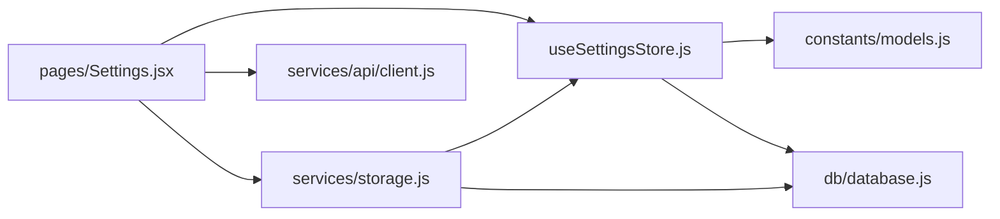

# 设置状态管理 (useSettingsStore)

<cite>
**本文引用的文件**   
- [app/src/stores/useSettingsStore.js](file://app/src/stores/useSettingsStore.js)
- [app/src/pages/Settings.jsx](file://app/src/pages/Settings.jsx)
- [app/src/db/database.js](file://app/src/db/database.js)
- [app/src/constants/models.js](file://app/src/constants/models.js)
- [app/src/services/storage.js](file://app/src/services/storage.js)
- [app/src/services/api/client.js](file://app/src/services/api/client.js)
- [app/src/App.jsx](file://app/src/App.jsx)
</cite>

## 目录
1. [简介](#简介)
2. [项目结构](#项目结构)
3. [核心组件](#核心组件)
4. [架构总览](#架构总览)
5. [详细组件分析](#详细组件分析)
6. [依赖关系分析](#依赖关系分析)
7. [性能与实时性](#性能与实时性)
8. [安全与权限](#安全与权限)
9. [故障排查指南](#故障排查指南)
10. [结论](#结论)
11. [附录：迁移、模板与恢复](#附录：迁移模板与恢复)

## 简介
本文件围绕 AI Image Studio 的设置状态管理 Store（useSettingsStore）进行系统化文档化，覆盖以下方面：
- 模型 API 密钥配置、存储路径与容量、性能参数调优、扩展插件配置
- 设置的持久化机制（IndexedDB）、云端同步（OSS 连接测试与上传/下载能力）、导入导出（建议方案）
- 设置验证规则、默认值管理与版本兼容性处理
- 设置变更的实时生效机制与热重载支持
- 安全敏感信息保护、权限控制与审计日志记录（现状与建议）
- 设置迁移工具、配置模板与故障恢复方案

## 项目结构
与设置相关的核心文件与职责如下：
- useSettingsStore.js：基于 Zustand + Immer 的状态管理，负责加载、更新、保存设置；提供默认值构建与重置能力
- Settings.jsx：设置页面 UI，聚合各模块设置项并提供连接测试、保存反馈等交互
- database.js：Dexie.js 封装的 IndexedDB 层，提供 settings 表的 key/value 读写
- models.js：模型常量定义，包含能力、尺寸、默认参数等，用于生成默认模型配置
- storage.js：存储服务，读取当前设置中的 OSS 配置并执行上传/下载/连接测试等操作
- client.js：统一 HTTP 客户端，为设置页的连接测试提供网络请求能力
- App.jsx：应用入口，路由中包含 /settings 页面

图表来源
- [app/src/stores/useSettingsStore.js:1-162](file://app/src/stores/useSettingsStore.js#L1-L162)
- [app/src/pages/Settings.jsx:1-301](file://app/src/pages/Settings.jsx#L1-L301)
- [app/src/db/database.js:1-339](file://app/src/db/database.js#L1-L339)
- [app/src/services/storage.js:1-393](file://app/src/services/storage.js#L1-L393)
- [app/src/services/api/client.js:1-146](file://app/src/services/api/client.js#L1-L146)
- [app/src/constants/models.js:1-106](file://app/src/constants/models.js#L1-L106)

章节来源
- [app/src/stores/useSettingsStore.js:1-162](file://app/src/stores/useSettingsStore.js#L1-L162)
- [app/src/pages/Settings.jsx:1-301](file://app/src/pages/Settings.jsx#L1-L301)
- [app/src/db/database.js:1-339](file://app/src/db/database.js#L1-L339)
- [app/src/constants/models.js:1-106](file://app/src/constants/models.js#L1-L106)
- [app/src/services/storage.js:1-393](file://app/src/services/storage.js#L1-L393)
- [app/src/services/api/client.js:1-146](file://app/src/services/api/client.js#L1-L146)
- [app/src/App.jsx:1-364](file://app/src/App.jsx#L1-L364)

## 核心组件
- useSettingsStore
  - 状态字段：modelConfigs、storageConfig、expansionConfig、generalConfig、isSetupComplete、isLoaded
  - 动作方法：updateModelConfig、updateStorageConfig、updateExpansionConfig、updateGeneralConfig、completeSetup、loadSettings、saveSettings、resetToDefaults
  - 默认值构建：从 models.js 推导 modelConfigs 的默认 defaultParams；内置 storage/expansion/general 默认对象
  - 持久化：通过 database.js 的 settings 表以 key/value 形式落盘
- Settings.jsx
  - 将 store 状态映射到表单输入，提供“测试连接”、“保存”等交互
  - 调用 StorageService.checkOSSConnection 进行 OSS 连通性测试
  - 调用 update* 系列 action 触发即时保存
- database.js
  - 提供 getSetting/setSetting/getAllSettings 等设置读写接口
  - 初始化 Dexie 数据库与 schema
- storage.js
  - 根据当前 store 的 storageConfig 动态构造 OSS 客户端
  - 提供 upload/download/checkOSSConnection/moveToColdZone/moveToHotZone 等方法
- client.js
  - 统一的 axios 实例，带重试与超时策略，供设置页发起连接测试
- models.js
  - 定义模型能力、尺寸、质量等级、默认参数等，作为默认配置来源

章节来源
- [app/src/stores/useSettingsStore.js:1-162](file://app/src/stores/useSettingsStore.js#L1-L162)
- [app/src/pages/Settings.jsx:1-301](file://app/src/pages/Settings.jsx#L1-L301)
- [app/src/db/database.js:1-339](file://app/src/db/database.js#L1-L339)
- [app/src/services/storage.js:1-393](file://app/src/services/storage.js#L1-L393)
- [app/src/services/api/client.js:1-146](file://app/src/services/api/client.js#L1-L146)
- [app/src/constants/models.js:1-106](file://app/src/constants/models.js#L1-L106)

## 架构总览
设置管理的整体流程包括：
- 启动时加载：Settings 页面在挂载后调用 loadSettings，从 IndexedDB 合并到内存状态
- 用户修改：通过 update* 动作使用 Immer produce 增量更新状态并立即持久化
- 外部消费：StorageService 在运行时读取最新设置（如 OSS 配置），实现热更新
- 连接测试：通过 api client 向代理端点发送最小请求，校验 Key/Endpoint 有效性

图表来源
- [app/src/pages/Settings.jsx:74-86](file://app/src/pages/Settings.jsx#L74-L86)
- [app/src/stores/useSettingsStore.js:108-149](file://app/src/stores/useSettingsStore.js#L108-L149)
- [app/src/db/database.js:277-295](file://app/src/db/database.js#L277-L295)
- [app/src/services/storage.js:20-42](file://app/src/services/storage.js#L20-L42)
- [app/src/services/api/client.js:18-33](file://app/src/services/api/client.js#L18-L33)

## 详细组件分析

### 设置 Store 设计与实现
- 默认值构建
  - modelConfigs：遍历 MODELS 常量，为每个模型创建 enabled/defaultParams 的默认条目
  - storageConfig：默认 hot/cold 分区策略、缩略图尺寸、OSS 基础字段（可从环境变量注入）
  - expansionConfig：扩写 LLM 开关、模型、温度、最大变体数等
  - generalConfig：主题、语言、自动保存、并发任务数等
- 状态更新
  - 所有 update* 动作均使用 produce 进行不可变更新，随后调用 saveSettings 持久化
  - completeSetup 标记引导完成，同时持久化 isSetupComplete
- 加载与合并
  - loadSettings 从 IndexedDB 读取全部设置，按 key 合并到对应状态段，未存在则保留默认
  - 异常捕获保证 isLoaded 始终置为 true，避免阻塞渲染
- 重置
  - resetToDefaults 重建默认配置并持久化

图表来源
- [app/src/stores/useSettingsStore.js:14-23](file://app/src/stores/useSettingsStore.js#L14-L23)
- [app/src/stores/useSettingsStore.js:47-161](file://app/src/stores/useSettingsStore.js#L47-L161)
- [app/src/db/database.js:277-295](file://app/src/db/database.js#L277-L295)

章节来源
- [app/src/stores/useSettingsStore.js:1-162](file://app/src/stores/useSettingsStore.js#L1-L162)
- [app/src/db/database.js:277-295](file://app/src/db/database.js#L277-L295)

### 设置页面与交互
- 数据绑定
  - 页面在 useEffect 中调用 loadSettings，并将 store 的值映射到本地表单状态
- 保存逻辑
  - 各 Tab 的保存按钮分别调用 updateModelConfig/updateStorageConfig/updateExpansionConfig/updateGeneralConfig
- 连接测试
  - 模型 API：通过 /api/* 代理发送最小请求，解析响应码或错误消息判断 Key 是否有效
  - OSS：调用 StorageService.checkOSSConnection，根据 headBucket 结果给出提示
  - 扩写 LLM：通过 /api/llm/chat/completions 发送最小对话请求

图表来源
- [app/src/pages/Settings.jsx:88-203](file://app/src/pages/Settings.jsx#L88-L203)
- [app/src/services/storage.js:181-197](file://app/src/services/storage.js#L181-L197)
- [app/src/services/api/client.js:18-33](file://app/src/services/api/client.js#L18-L33)

章节来源
- [app/src/pages/Settings.jsx:1-301](file://app/src/pages/Settings.jsx#L1-L301)

### 存储服务与设置联动
- 动态读取设置
  - getOSSClient 每次从 useSettingsStore.getState() 获取最新 storageConfig，确保设置变更后无需重启即可生效
- 连接测试
  - checkOSSConnection 调用 headBucket 验证 Bucket/Region/AccessKey 的有效性
- 冷热区迁移
  - checkAndMigrate 依据 storageConfig.hotCapacity 阈值，将最旧图片迁移至 OSS 冷区，释放热区空间

图表来源
- [app/src/services/storage.js:20-42](file://app/src/services/storage.js#L20-L42)
- [app/src/services/storage.js:181-197](file://app/src/services/storage.js#L181-L197)
- [app/src/services/storage.js:252-298](file://app/src/services/storage.js#L252-L298)
- [app/src/stores/useSettingsStore.js:47-161](file://app/src/stores/useSettingsStore.js#L47-L161)

章节来源
- [app/src/services/storage.js:1-393](file://app/src/services/storage.js#L1-L393)
- [app/src/stores/useSettingsStore.js:1-162](file://app/src/stores/useSettingsStore.js#L1-L162)

### 模型常量与默认参数
- MODELS 定义了各模型的名称、提供方、能力集、尺寸、质量等级与默认参数
- useSettingsStore 据此构建 modelConfigs 的默认 defaultParams，便于 UI 直接渲染下拉选项

章节来源
- [app/src/constants/models.js:1-106](file://app/src/constants/models.js#L1-L106)
- [app/src/stores/useSettingsStore.js:14-23](file://app/src/stores/useSettingsStore.js#L14-L23)

## 依赖关系分析
- useSettingsStore 依赖
  - constants/models.js：提供模型元数据与默认参数
  - db/database.js：settings 表的 key/value 读写
- Settings.jsx 依赖
  - stores/useSettingsStore.js：订阅与更新设置
  - services/storage.js：OSS 连接测试
  - services/api/client.js：模型/LLM 连接测试
- storage.js 依赖
  - stores/useSettingsStore.js：运行时读取最新 storageConfig
  - db/database.js：图像记录与统计

图表来源
- [app/src/stores/useSettingsStore.js:1-162](file://app/src/stores/useSettingsStore.js#L1-L162)
- [app/src/pages/Settings.jsx:1-301](file://app/src/pages/Settings.jsx#L1-L301)
- [app/src/services/storage.js:1-393](file://app/src/services/storage.js#L1-L393)
- [app/src/services/api/client.js:1-146](file://app/src/services/api/client.js#L1-L146)
- [app/src/db/database.js:1-339](file://app/src/db/database.js#L1-L339)
- [app/src/constants/models.js:1-106](file://app/src/constants/models.js#L1-L106)

章节来源
- [app/src/stores/useSettingsStore.js:1-162](file://app/src/stores/useSettingsStore.js#L1-L162)
- [app/src/pages/Settings.jsx:1-301](file://app/src/pages/Settings.jsx#L1-L301)
- [app/src/services/storage.js:1-393](file://app/src/services/storage.js#L1-L393)
- [app/src/services/api/client.js:1-146](file://app/src/services/api/client.js#L1-L146)
- [app/src/db/database.js:1-339](file://app/src/db/database.js#L1-L339)
- [app/src/constants/models.js:1-106](file://app/src/constants/models.js#L1-L106)

## 性能与实时性
- 实时更新
  - 所有 update* 动作在内存中立即生效，并通过 saveSettings 异步持久化
  - StorageService 在需要时从 useSettingsStore.getState() 拉取最新配置，实现“热更新”
- 持久化开销
  - 每次保存会写入多个 key（modelConfigs、storageConfig、expansionConfig、generalConfig、isSetupComplete），属于轻量级 JSON 序列化与 IndexedDB 写入
- 连接测试
  - 使用短超时与最小请求体，降低对远端服务的压力
- 建议优化
  - 批量保存：若 UI 允许，可引入“暂存草稿”并在确认时一次性保存
  - 防抖保存：对高频输入（如滑块）做防抖后再持久化，减少 I/O 次数

[本节为通用性能讨论，不直接分析具体文件]

## 安全与权限
- 现状
  - 敏感信息（API Key、AccessKey Secret）以明文存储在 IndexedDB 的 settings 表中
  - 设置页提供“可见/隐藏”切换，但仅前端展示层面遮蔽
- 风险
  - 浏览器本地存储易被恶意脚本或调试工具读取
  - 无访问控制与审计记录
- 建议改进
  - 加密存储：在持久化前对敏感字段进行加密（例如使用 Web Crypto API），读取时再解密
  - 权限控制：结合系统级权限或会话令牌，限制关键设置的可编辑范围
  - 审计日志：记录关键设置变更（时间、操作者、变更前后摘要），便于追溯
  - 传输安全：确保代理端点强制 HTTPS，避免中间人攻击

[本节为通用安全建议，不直接分析具体文件]

## 故障排查指南
- 常见问题
  - 设置未生效：检查 saveSettings 是否抛出异常；确认 IndexedDB 可用
  - OSS 连接失败：核对 Bucket/Region/AccessKey/Secret 是否正确，检查跨域与网络可达
  - 模型 Key 无效：根据测试结果中的状态码或错误消息定位问题
- 定位步骤
  - 查看控制台日志：SettingsStore 的 load/save 错误、StorageService 的 OSS 错误
  - 检查 IndexedDB：确认 settings 表是否存在且键值完整
  - 复现最小用例：使用设置页的“测试连接”功能快速验证

章节来源
- [app/src/stores/useSettingsStore.js:131-149](file://app/src/stores/useSettingsStore.js#L131-L149)
- [app/src/services/storage.js:181-197](file://app/src/services/storage.js#L181-L197)
- [app/src/pages/Settings.jsx:88-203](file://app/src/pages/Settings.jsx#L88-L203)

## 结论
useSettingsStore 提供了清晰、可扩展的设置管理能力：
- 通过默认值构建与合并策略，保障首次运行与升级后的兼容
- 借助 IndexedDB 持久化与运行时热读，实现即时生效与低耦合
- 配合设置页的测试能力，提升配置排障效率
未来可在安全性（加密、审计）、版本迁移（schema 演进）、导入导出等方面进一步增强。

[本节为总结性内容，不直接分析具体文件]

## 附录：迁移、模板与恢复

### 设置迁移与版本兼容
- 现状
  - 加载时使用 Object.assign 合并旧配置，缺失字段沿用默认值
  - 未显式维护版本号与迁移脚本
- 建议方案
  - 在 settings 表新增 version 字段，记录配置 schema 版本
  - 在 loadSettings 中检测版本并执行迁移函数，补齐新字段、重命名旧字段、清理废弃字段
  - 在 resetToDefaults 时考虑版本差异，确保默认结构与当前版本一致

章节来源
- [app/src/stores/useSettingsStore.js:108-135](file://app/src/stores/useSettingsStore.js#L108-L135)
- [app/src/db/database.js:277-295](file://app/src/db/database.js#L277-L295)

### 配置模板
- 用途
  - 为新用户提供一键填充常用配置的模板（如企业内网代理、默认模型参数）
- 建议实现
  - 在设置页增加“导入模板”按钮，选择预置模板后合并到当前设置并保存
  - 模板文件可由后端下发或打包进应用资源

[本节为概念性说明，不直接分析具体文件]

### 导入/导出
- 现状
  - 未提供内置导入/导出功能
- 建议实现
  - 导出：将 settings 表的所有 key/value 序列化为 JSON 文件，支持下载
  - 导入：读取 JSON 文件，校验结构后合并到 IndexedDB，并提示冲突处理策略（覆盖/跳过/合并）

[本节为概念性说明，不直接分析具体文件]

### 故障恢复
- 备份与回滚
  - 定期导出 settings 表快照，出现损坏时可重新导入
- 降级策略
  - 当 IndexedDB 不可用时，退回到内存默认配置，并提示用户修复环境
- 云同步（可选）
  - 可将非敏感配置（如 theme、language、defaultModel）同步到云端，多设备保持一致；敏感信息仍建议本地加密存储

[本节为概念性说明，不直接分析具体文件]