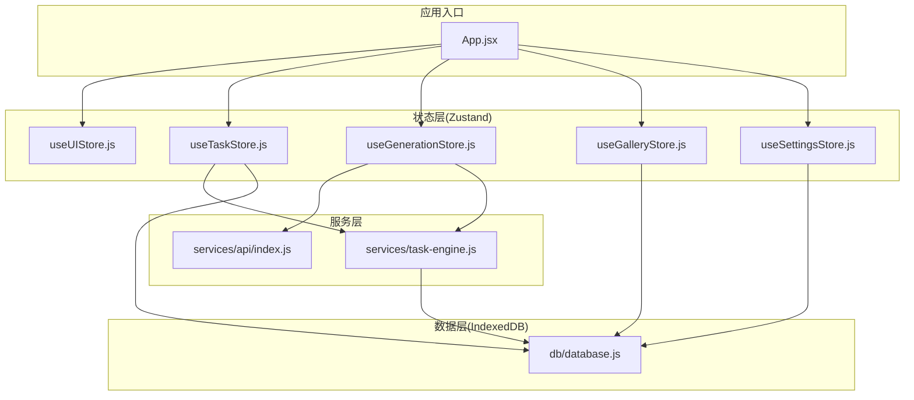
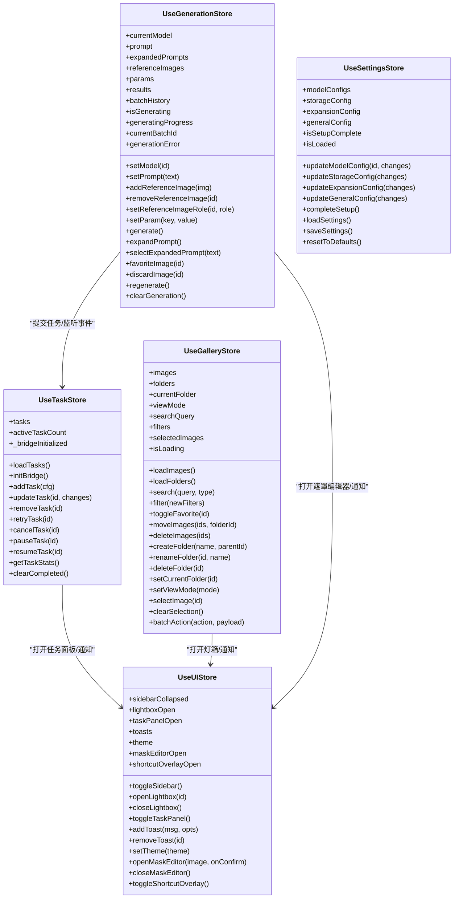
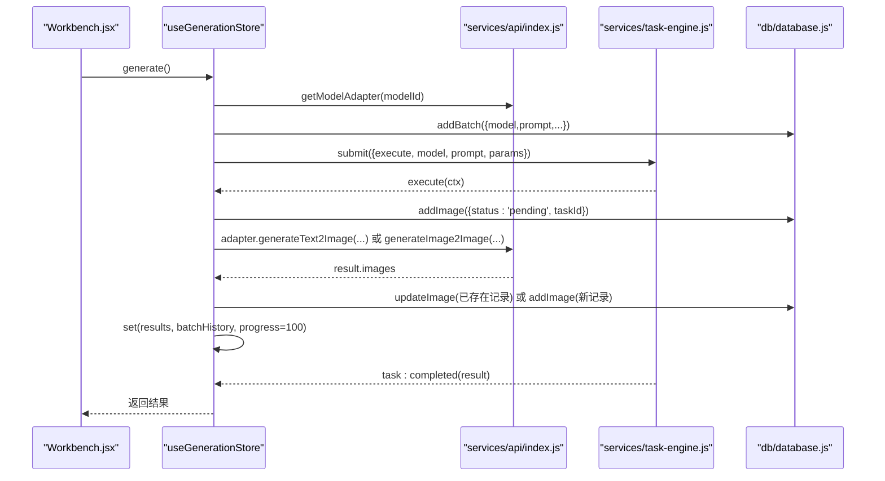
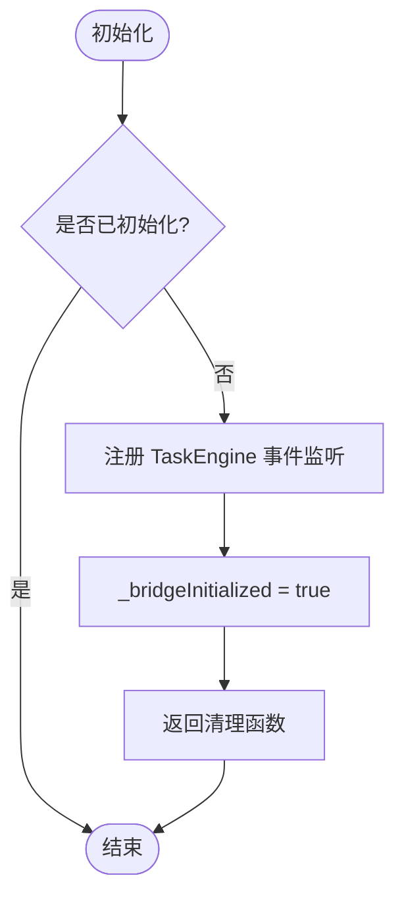
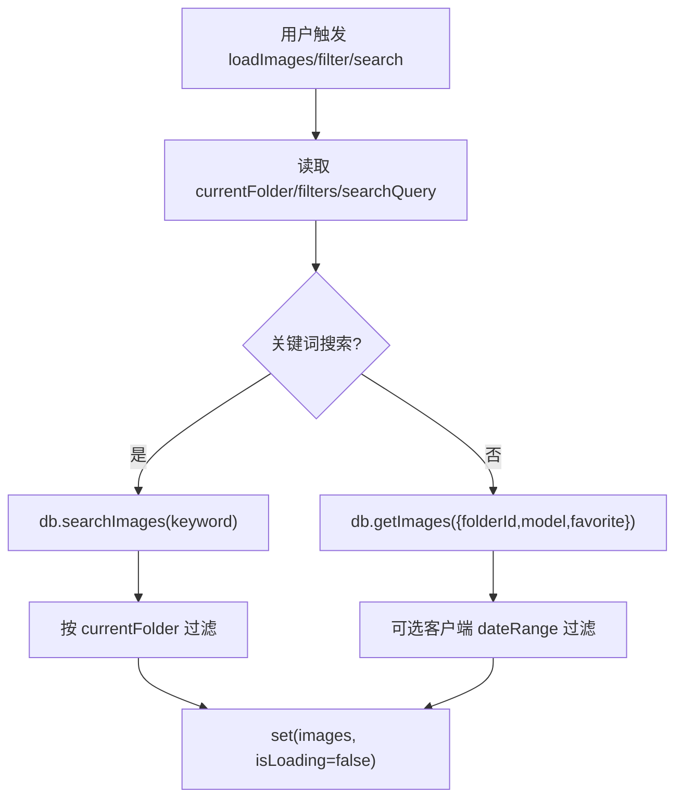
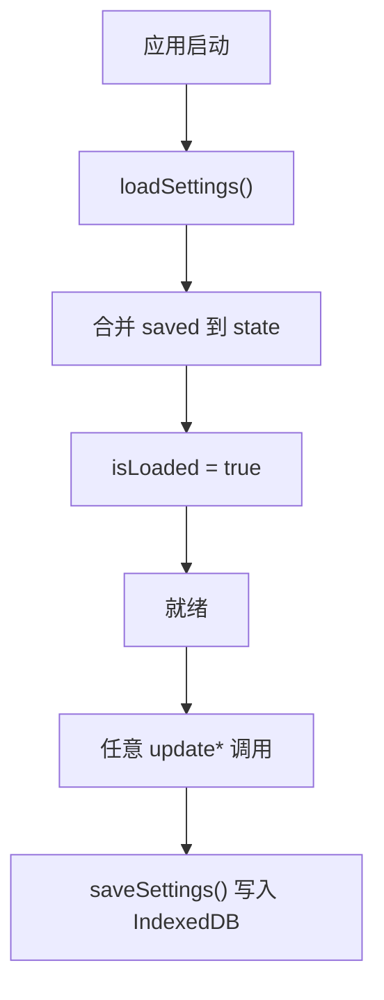
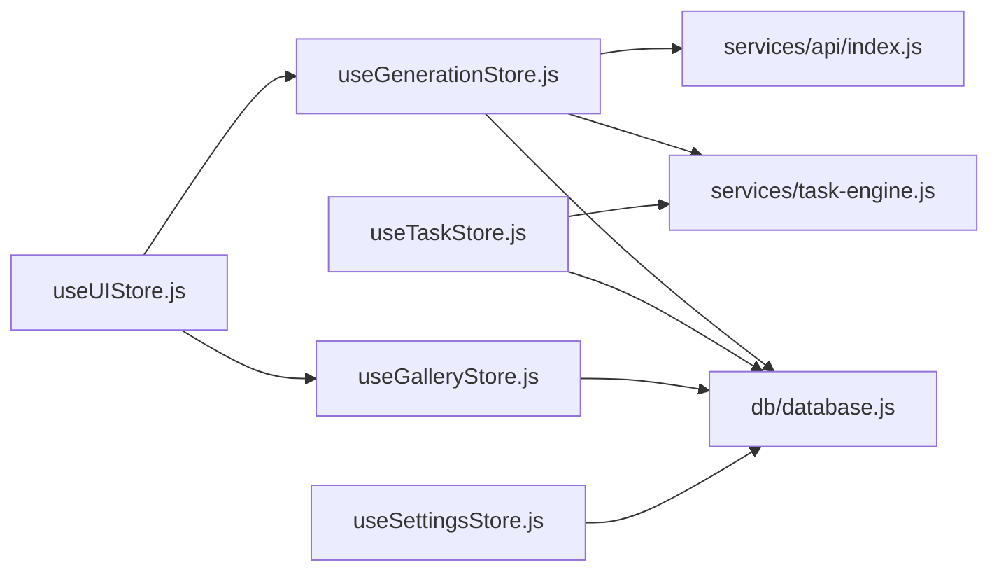
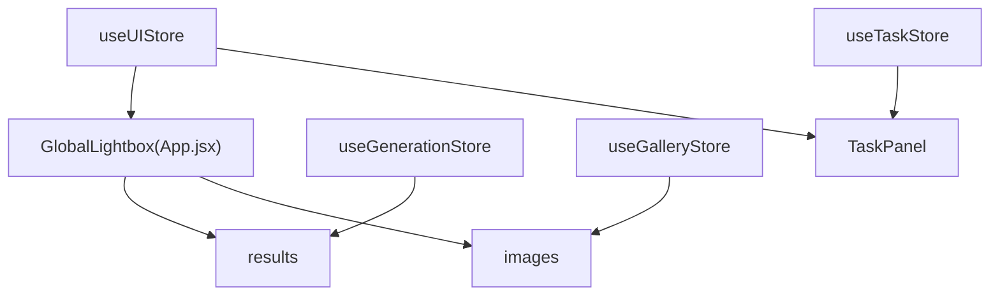

# 状态管理架构

<cite>
**本文引用的文件**   
- [useGalleryStore.js](file://app/src/stores/useGalleryStore.js)
- [useGenerationStore.js](file://app/src/stores/useGenerationStore.js)
- [useSettingsStore.js](file://app/src/stores/useSettingsStore.js)
- [useTaskStore.js](file://app/src/stores/useTaskStore.js)
- [useUIStore.js](file://app/src/stores/useUIStore.js)
- [database.js](file://app/src/db/database.js)
- [task-engine.js](file://app/src/services/task-engine.js)
- [models.js](file://app/src/constants/models.js)
- [App.jsx](file://app/src/App.jsx)
- [index.js](file://app/src/services/api/index.js)
</cite>

## 目录
1. [简介](#简介)
2. [项目结构](#项目结构)
3. [核心组件](#核心组件)
4. [架构总览](#架构总览)
5. [详细组件分析](#详细组件分析)
6. [依赖关系分析](#依赖关系分析)
7. [性能考量](#性能考量)
8. [故障排查指南](#故障排查指南)
9. [结论](#结论)
10. [附录](#附录)

## 简介
本文件为 AI Image Studio 的状态管理架构文档，聚焦基于 Zustand 的 Store 设计、模块划分与状态同步机制。文档将说明各 Store 的职责边界、状态结构设计、方法封装策略，解释跨组件状态共享、持久化方案与性能优化实践，并给出状态关系图与更新流程图，帮助读者理解状态变化的传播路径。同时提供最佳实践、调试技巧与测试策略建议。

## 项目结构
状态管理相关代码集中在 stores 目录，配合 IndexedDB 数据层 database.js 与后台任务引擎 task-engine.js 形成“Store + DB + Engine”的三层协作模式：
- Store 层：使用 Zustand create 创建全局状态，暴露读写方法与副作用逻辑
- 数据层：Dexie 封装 IndexedDB，提供统一 CRUD 与查询接口
- 任务层：TaskEngine 负责并发控制、重试、事件广播与进度上报

图表来源
- [App.jsx:1-364](file://app/src/App.jsx#L1-L364)
- [useUIStore.js:1-159](file://app/src/stores/useUIStore.js#L1-L159)
- [useGalleryStore.js:1-204](file://app/src/stores/useGalleryStore.js#L1-L204)
- [useGenerationStore.js:1-360](file://app/src/stores/useGenerationStore.js#L1-L360)
- [useTaskStore.js:1-173](file://app/src/stores/useTaskStore.js#L1-L173)
- [useSettingsStore.js:1-162](file://app/src/stores/useSettingsStore.js#L1-L162)
- [database.js:1-339](file://app/src/db/database.js#L1-L339)
- [task-engine.js:1-319](file://app/src/services/task-engine.js#L1-L319)
- [index.js:1-39](file://app/src/services/api/index.js#L1-L39)

章节来源
- [App.jsx:1-364](file://app/src/App.jsx#L1-L364)
- [useUIStore.js:1-159](file://app/src/stores/useUIStore.js#L1-L159)
- [useGalleryStore.js:1-204](file://app/src/stores/useGalleryStore.js#L1-L204)
- [useGenerationStore.js:1-360](file://app/src/stores/useGenerationStore.js#L1-L360)
- [useTaskStore.js:1-173](file://app/src/stores/useTaskStore.js#L1-L173)
- [useSettingsStore.js:1-162](file://app/src/stores/useSettingsStore.js#L1-L162)
- [database.js:1-339](file://app/src/db/database.js#L1-L339)
- [task-engine.js:1-319](file://app/src/services/task-engine.js#L1-L319)
- [index.js:1-39](file://app/src/services/api/index.js#L1-L39)

## 核心组件
- useUIStore：全局 UI 状态（侧边栏、灯箱、任务面板、通知、主题、遮罩编辑器、快捷键覆盖层）
- useGalleryStore：图库与文件夹管理（图片列表、视图模式、搜索、筛选、选择、批量操作）
- useGenerationStore：工作区生成状态（模型、提示词、参考图、参数、结果、批次历史、生成中标志）
- useTaskStore：后台任务管理（任务列表、活跃计数、增删改查、重试/取消/暂停/恢复、统计）
- useSettingsStore：应用设置与模型配置（模型开关与默认参数、存储配置、扩写配置、通用设置、向导完成标记），持久化到 IndexedDB

职责边界
- UI 与业务解耦：UI 仅维护展示态；业务态由 Gallery/Generation/Task/Settings 管理
- 跨页面共享：通过 Zustand 全局 store 实现跨组件共享（如灯箱、主题、任务面板）
- 异步与持久化：所有涉及 I/O 的操作在 Store 内封装，保证 UI 只调用方法而不直接访问 DB

章节来源
- [useUIStore.js:1-159](file://app/src/stores/useUIStore.js#L1-L159)
- [useGalleryStore.js:1-204](file://app/src/stores/useGalleryStore.js#L1-L204)
- [useGenerationStore.js:1-360](file://app/src/stores/useGenerationStore.js#L1-L360)
- [useTaskStore.js:1-173](file://app/src/stores/useTaskStore.js#L1-L173)
- [useSettingsStore.js:1-162](file://app/src/stores/useSettingsStore.js#L1-L162)

## 架构总览
Zustand Store 作为单一事实源，结合 Immer produce 进行不可变更新；IndexedDB 作为持久化层；TaskEngine 作为后台任务调度器并通过事件驱动更新 TaskStore。

图表来源
- [useUIStore.js:1-159](file://app/src/stores/useUIStore.js#L1-L159)
- [useGalleryStore.js:1-204](file://app/src/stores/useGalleryStore.js#L1-L204)
- [useGenerationStore.js:1-360](file://app/src/stores/useGenerationStore.js#L1-L360)
- [useTaskStore.js:1-173](file://app/src/stores/useTaskStore.js#L1-L173)
- [useSettingsStore.js:1-162](file://app/src/stores/useSettingsStore.js#L1-L162)

## 详细组件分析

### useGenerationStore（生成工作流）
- 状态结构
  - 当前模型、提示词、扩展提示词、参考图、参数、结果、批次历史、生成中标志、进度、错误信息
- 关键流程
  - generate：校验输入 -> 创建批次 -> 获取适配器 -> 提交 TaskEngine.execute -> 持久化结果 -> 更新 results 与 batchHistory
  - expandPrompt：调用 LLM 适配器扩写提示词
  - favoriteImage/discardImage：更新本地状态并持久化
- 与外部集成
  - 通过 services/api/index.js 获取模型适配器
  - 通过 TaskEngine 执行异步生成，支持 onProgress 与 onTaskSubmitted 回调
  - 通过 db/database.js 写入 batches/images

图表来源
- [useGenerationStore.js:112-290](file://app/src/stores/useGenerationStore.js#L112-L290)
- [index.js:20-31](file://app/src/services/api/index.js#L20-L31)
- [task-engine.js:57-81](file://app/src/services/task-engine.js#L57-L81)
- [database.js:144-171](file://app/src/db/database.js#L144-L171)
- [database.js:43-96](file://app/src/db/database.js#L43-L96)

章节来源
- [useGenerationStore.js:1-360](file://app/src/stores/useGenerationStore.js#L1-L360)
- [index.js:1-39](file://app/src/services/api/index.js#L1-L39)
- [task-engine.js:1-319](file://app/src/services/task-engine.js#L1-L319)
- [database.js:1-339](file://app/src/db/database.js#L1-L339)

### useTaskStore（任务桥接）
- 职责：加载任务、订阅 TaskEngine 事件刷新任务列表、对任务进行增删改查与重试/取消/暂停/恢复
- 事件桥：initBridge 一次性注册 TaskEngine 的事件监听，自动刷新任务列表与活跃计数
- 失败回退：当 TaskEngine 操作异常时，手动更新任务状态以保证 UI 一致性

图表来源
- [useTaskStore.js:39-64](file://app/src/stores/useTaskStore.js#L39-L64)
- [task-engine.js:191-211](file://app/src/services/task-engine.js#L191-L211)

章节来源
- [useTaskStore.js:1-173](file://app/src/stores/useTaskStore.js#L1-L173)
- [task-engine.js:1-319](file://app/src/services/task-engine.js#L1-L319)

### useGalleryStore（图库与文件夹）
- 职责：图片列表、文件夹树、视图模式、搜索与筛选、选择与批量操作
- 数据流：从 IndexedDB 读取 images/folders，客户端二次过滤（日期范围等），更新 images 与 selectedImages
- 典型操作：toggleFavorite、moveImages、deleteImages、create/rename/deleteFolder、setCurrentFolder、batchAction

图表来源
- [useGalleryStore.js:30-88](file://app/src/stores/useGalleryStore.js#L30-L88)
- [database.js:56-110](file://app/src/db/database.js#L56-L110)

章节来源
- [useGalleryStore.js:1-204](file://app/src/stores/useGalleryStore.js#L1-L204)
- [database.js:1-339](file://app/src/db/database.js#L1-L339)

### useSettingsStore（设置与持久化）
- 职责：模型配置、存储配置、扩写配置、通用设置、向导完成标记
- 持久化：loadSettings 从 IndexedDB 合并到内存；saveSettings 将内存状态落盘
- 默认值：根据 constants/models.js 构建默认模型配置

图表来源
- [useSettingsStore.js:109-149](file://app/src/stores/useSettingsStore.js#L109-L149)
- [database.js:280-295](file://app/src/db/database.js#L280-L295)
- [models.js:1-106](file://app/src/constants/models.js#L1-L106)

章节来源
- [useSettingsStore.js:1-162](file://app/src/stores/useSettingsStore.js#L1-L162)
- [database.js:1-339](file://app/src/db/database.js#L1-L339)
- [models.js:1-106](file://app/src/constants/models.js#L1-L106)

### useUIStore（全局 UI）
- 职责：侧边栏折叠、灯箱、任务面板、通知、主题、遮罩编辑器、快捷键覆盖层
- 特点：纯展示态，无 I/O；提供便捷方法（如 addToast 自动定时移除）

章节来源
- [useUIStore.js:1-159](file://app/src/stores/useUIStore.js#L1-L159)

## 依赖关系分析
- Store 间耦合
  - GenerationStore 依赖 TaskEngine 与 API 适配器，间接影响 TaskStore 与 UIStore
  - TaskStore 依赖 TaskEngine 事件与数据库
  - GalleryStore 与 SettingsStore 主要依赖数据库
- 外部依赖
  - Dexie（IndexedDB）、uuid、immer、React Router、Hotkeys 等
- 可能的循环依赖
  - 当前未见显式循环引用；GenerationStore 与 TaskEngine 通过事件与回调解耦

图表来源
- [useGenerationStore.js:1-360](file://app/src/stores/useGenerationStore.js#L1-L360)
- [useTaskStore.js:1-173](file://app/src/stores/useTaskStore.js#L1-L173)
- [useGalleryStore.js:1-204](file://app/src/stores/useGalleryStore.js#L1-L204)
- [useSettingsStore.js:1-162](file://app/src/stores/useSettingsStore.js#L1-L162)
- [useUIStore.js:1-159](file://app/src/stores/useUIStore.js#L1-L159)
- [index.js:1-39](file://app/src/services/api/index.js#L1-L39)
- [task-engine.js:1-319](file://app/src/services/task-engine.js#L1-L319)
- [database.js:1-339](file://app/src/db/database.js#L1-L339)

章节来源
- [useGenerationStore.js:1-360](file://app/src/stores/useGenerationStore.js#L1-L360)
- [useTaskStore.js:1-173](file://app/src/stores/useTaskStore.js#L1-L173)
- [useGalleryStore.js:1-204](file://app/src/stores/useGalleryStore.js#L1-L204)
- [useSettingsStore.js:1-162](file://app/src/stores/useSettingsStore.js#L1-L162)
- [useUIStore.js:1-159](file://app/src/stores/useUIStore.js#L1-L159)
- [index.js:1-39](file://app/src/services/api/index.js#L1-L39)
- [task-engine.js:1-319](file://app/src/services/task-engine.js#L1-L319)
- [database.js:1-339](file://app/src/db/database.js#L1-L339)

## 性能考量
- 细粒度订阅：组件仅订阅所需字段，避免整棵状态树变更导致的重渲染
- Immer produce：以不可变方式更新嵌套对象，减少不必要的浅比较开销
- 批量更新：gallery 的 batchAction 与 generation 的结果批处理，减少多次 set 调用
- 分页与懒加载：图库使用 displayCount 增量加载，降低首屏压力
- 去抖与节流：搜索输入使用延时触发，避免频繁查询
- 任务并发控制：TaskEngine 限制最大并发数，避免浏览器资源耗尽
- 索引与排序：IndexedDB 定义复合索引与默认排序，提升查询效率

[本节为通用指导，不直接分析具体文件]

## 故障排查指南
- 常见问题定位
  - 生成失败：检查 GenerationStore 的错误分支与 TaskEngine 的重试逻辑，确认 onTaskSubmitted 是否成功写入 pending 记录
  - 任务状态不同步：确认 TaskStore.initBridge 是否被调用且未重复注册；查看 TaskEngine 事件是否触发
  - 设置未持久化：检查 SettingsStore.saveSettings 是否被调用，IndexedDB 是否可用
  - 图库筛选无效：确认 filters/dateRange 是否正确传递至 getImages 或 searchImages
- 调试技巧
  - 在关键 action 前后打印日志（如 GenerationStore.generate、TaskEngine._runTask）
  - 使用浏览器 DevTools 监控 IndexedDB 表变化
  - 临时增加 isLoaded 或 _bridgeInitialized 断点，确保初始化顺序正确
- 测试策略
  - 单元测试：对每个 Store 的 action 编写用例，模拟 DB 与 TaskEngine 行为（可 mock）
  - 集成测试：验证 GenerationStore.generate 端到端流程（含 onProgress 与 onTaskSubmitted）
  - 回归测试：切换模型、批量操作、任务重试/取消等关键路径

章节来源
- [useGenerationStore.js:283-290](file://app/src/stores/useGenerationStore.js#L283-L290)
- [useTaskStore.js:39-64](file://app/src/stores/useTaskStore.js#L39-L64)
- [useSettingsStore.js:138-149](file://app/src/stores/useSettingsStore.js#L138-L149)
- [useGalleryStore.js:30-88](file://app/src/stores/useGalleryStore.js#L30-L88)
- [task-engine.js:259-296](file://app/src/services/task-engine.js#L259-L296)

## 结论
AI Image Studio 采用 Zustand 作为状态中心，结合 Immer 进行高效不可变更新，配合 IndexedDB 持久化与 TaskEngine 异步任务编排，形成了清晰的分层架构。Store 职责明确、方法封装合理，跨组件共享与事件驱动更新保证了良好的可扩展性与可维护性。通过细粒度订阅、批量更新、并发控制与索引优化等手段，系统在交互体验与性能之间取得平衡。后续可在类型安全、错误边界与自动化测试方面进一步增强。

[本节为总结，不直接分析具体文件]

## 附录

### 状态关系图（跨 Store 共享）

图表来源
- [App.jsx:203-239](file://app/src/App.jsx#L203-L239)
- [useUIStore.js:1-159](file://app/src/stores/useUIStore.js#L1-L159)
- [useGenerationStore.js:1-360](file://app/src/stores/useGenerationStore.js#L1-L360)
- [useGalleryStore.js:1-204](file://app/src/stores/useGalleryStore.js#L1-L204)
- [useTaskStore.js:1-173](file://app/src/stores/useTaskStore.js#L1-L173)

### 最佳实践清单
- 单一事实源：每个领域一个 Store，避免状态分散
- 方法即副作用：I/O 与副作用统一封装在 Store action 中
- 不可变更新：优先使用 produce 更新嵌套结构
- 事件驱动：跨模块通信尽量通过事件总线（如 TaskEngine）
- 渐进增强：先内存后持久化，保证离线可用性
- 可观测性：关键路径添加日志与指标，便于排障

[本节为通用指导，不直接分析具体文件]