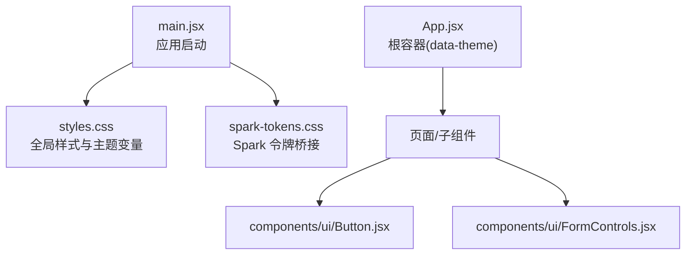
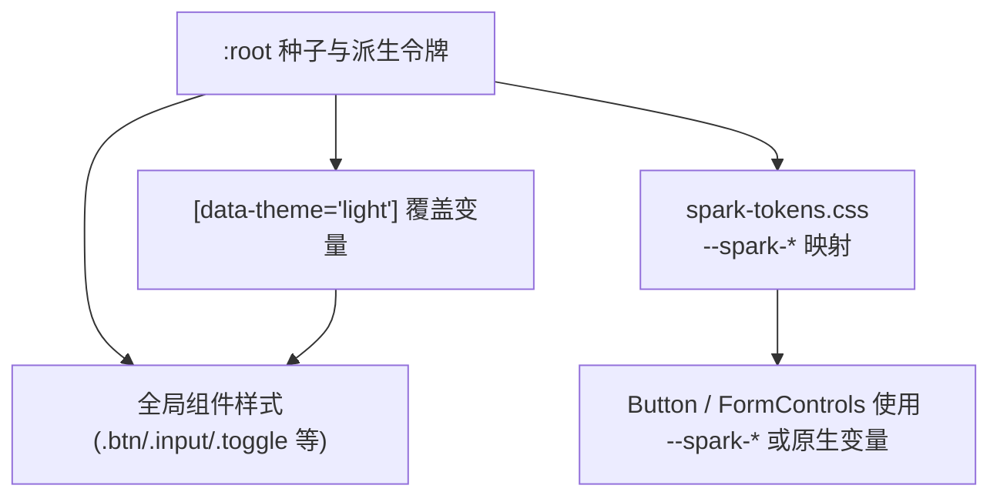
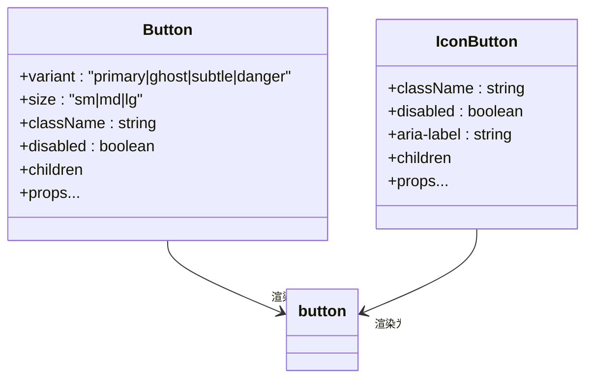
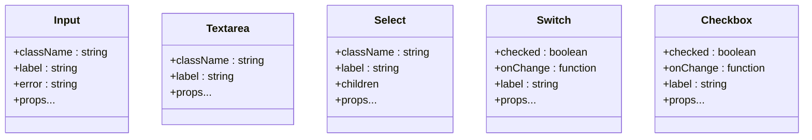
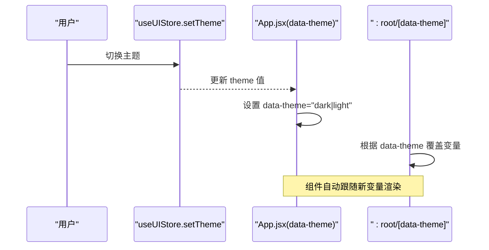
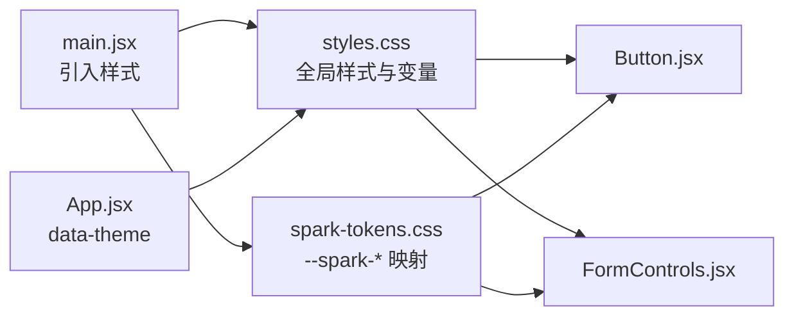

# UI 基础组件

<cite>
**本文引用的文件**
- [Button.jsx](file://app/src/components/ui/Button.jsx)
- [FormControls.jsx](file://app/src/components/ui/FormControls.jsx)
- [spark-tokens.css](file://app/src/components/ui/spark-tokens.css)
- [styles.css](file://app/src/styles.css)
- [main.jsx](file://app/src/main.jsx)
- [App.jsx](file://app/src/App.jsx)
- [Settings.jsx](file://app/src/pages/Settings.jsx)
</cite>

## 目录
1. [简介](#简介)
2. [项目结构](#项目结构)
3. [核心组件](#核心组件)
4. [架构总览](#架构总览)
5. [详细组件分析](#详细组件分析)
6. [依赖关系分析](#依赖关系分析)
7. [性能与可访问性](#性能与可访问性)
8. [样式定制与主题切换](#样式定制与主题切换)
9. [API 参考](#api-参考)
10. [故障排查](#故障排查)
11. [结论](#结论)

## 简介
本文件面向 AI Image Studio 的 UI 基础组件，聚焦以下目标：
- 详细说明 Button（按钮）与 FormControls（表单控件）等基础 UI 组件的设计规范与实现细节。
- 深入解析 Spark Tokens 样式系统：CSS 变量定义、主题切换机制与样式隔离策略。
- 分析组件的属性接口设计、事件处理模式与可访问性支持。
- 提供样式定制方案、响应式设计与跨浏览器兼容性建议。
- 给出完整的 API 参考、使用示例路径与自定义主题开发指南。

## 项目结构
UI 基础组件位于 app/src/components/ui 下，包含：
- Button.jsx：导出 Button 与 IconButton 两个按钮类组件。
- FormControls.jsx：导出 Input、Textarea、Select、Switch、Checkbox 五个表单控件。
- spark-tokens.css：将底层设计令牌以 --spark-* 命名空间重新导出，供上层组件或第三方库消费。

应用入口在 main.jsx 中引入 styles.css 与 spark-tokens.css，确保全局样式与设计令牌可用。App.jsx 作为根容器，通过 data-theme 属性驱动主题切换。

图表来源
- [main.jsx:1-32](file://app/src/main.jsx#L1-L32)
- [styles.css:1-172](file://app/src/styles.css#L1-L172)
- [spark-tokens.css:1-53](file://app/src/components/ui/spark-tokens.css#L1-L53)
- [App.jsx:298-303](file://app/src/App.jsx#L298-L303)

章节来源
- [main.jsx:1-32](file://app/src/main.jsx#L1-L32)
- [App.jsx:298-303](file://app/src/App.jsx#L298-L303)

## 核心组件
本节概述各组件的职责与交互方式，后续章节将展开详细分析与图示。

- Button：通用按钮，支持多种变体与尺寸；IconButton：纯图标按钮，适合工具栏与操作区。
- FormControls：输入框、文本域、下拉选择、开关、复选框，统一标签与错误提示布局，遵循一致的间距与字体规范。
- Spark Tokens：通过 CSS 变量集中管理颜色、圆角、阴影、间距、字体、过渡等，并提供 --spark-* 命名空间以兼容外部设计体系。

章节来源
- [Button.jsx:1-57](file://app/src/components/ui/Button.jsx#L1-L57)
- [FormControls.jsx:1-62](file://app/src/components/ui/FormControls.jsx#L1-L62)
- [spark-tokens.css:1-53](file://app/src/components/ui/spark-tokens.css#L1-L53)
- [styles.css:234-326](file://app/src/styles.css#L234-L326)

## 架构总览
整体样式与主题架构如下：
- 种子令牌与派生令牌在 styles.css 的 :root 中定义，覆盖背景、文字、强调色、边框、圆角、阴影、排版、间距、过渡等。
- 浅色主题通过 [data-theme="light"] 覆盖部分变量，实现一键切换。
- App.jsx 根节点设置 data-theme，驱动主题切换。
- spark-tokens.css 将 --bg-*、--text-* 等映射为 --spark-color-*、--spark-radius-* 等，形成“Spark 语义层”。

图表来源
- [styles.css:6-172](file://app/src/styles.css#L6-L172)
- [spark-tokens.css:7-52](file://app/src/components/ui/spark-tokens.css#L7-L52)
- [App.jsx:298-303](file://app/src/App.jsx#L298-L303)

## 详细组件分析

### Button 与 IconButton
- 职责
  - Button：通用按钮，支持 primary、ghost、subtle、danger 四种变体，以及 sm、md、lg 三种尺寸。
  - IconButton：无文本图标按钮，常用于工具栏、关闭、编辑等操作。
- 属性接口
  - Button：variant、size、className、disabled、children，其余 props 透传给原生 button。
  - IconButton：className、disabled、aria-label、children，其余 props 透传。
- 样式与状态
  - 通过组合基础类 .btn 与变体/尺寸修饰类实现外观变化。
  - disabled 状态统一降低不透明度并禁用指针事件。
- 可访问性
  - 默认渲染为 <button>，具备键盘可聚焦与可点击能力。
  - IconButton 支持 aria-label 提供无障碍描述。
- 事件处理
  - 透传所有 DOM 事件（如 onClick），由调用方控制业务逻辑。

图表来源
- [Button.jsx:16-35](file://app/src/components/ui/Button.jsx#L16-L35)
- [Button.jsx:37-54](file://app/src/components/ui/Button.jsx#L37-L54)

章节来源
- [Button.jsx:1-57](file://app/src/components/ui/Button.jsx#L1-L57)
- [styles.css:234-326](file://app/src/styles.css#L234-L326)

### FormControls 系列
- 组件列表
  - Input：单行输入，支持 label 与 error 显示。
  - Textarea：多行文本输入，支持 label。
  - Select：下拉选择，支持 label 与 children 选项。
  - Switch：开关，受控于 checked 与 onChange，支持 label。
  - Checkbox：复选框，受控于 checked 与 onChange，支持 label。
- 属性接口
  - 均支持 className 与剩余 props 透传给原生元素。
  - Input 额外支持 label、error；Switch/Checkbox 支持 checked、onChange、label。
- 样式与布局
  - 统一采用 flex-col/gap-1 的垂直布局，label 与控件间距一致。
  - 使用 --fs-sm/--fs-base 与 --text-secondary 保持层级清晰。
  - Switch 使用 role="switch" 与 aria-checked 提升可访问性。
- 事件处理
  - Switch/Checkbox 内部维护点击切换逻辑，并通过 onChange 回调通知父组件。
  - 其他控件透传原生事件，由父组件绑定 onChange/onBlur 等。

图表来源
- [FormControls.jsx:3-11](file://app/src/components/ui/FormControls.jsx#L3-L11)
- [FormControls.jsx:13-20](file://app/src/components/ui/FormControls.jsx#L13-L20)
- [FormControls.jsx:22-31](file://app/src/components/ui/FormControls.jsx#L22-L31)
- [FormControls.jsx:33-46](file://app/src/components/ui/FormControls.jsx#L33-L46)
- [FormControls.jsx:48-61](file://app/src/components/ui/FormControls.jsx#L48-L61)

章节来源
- [FormControls.jsx:1-62](file://app/src/components/ui/FormControls.jsx#L1-L62)
- [styles.css:327-389](file://app/src/styles.css#L327-L389)
- [styles.css:584-632](file://app/src/styles.css#L584-L632)

### Spark Tokens 样式系统
- 设计令牌分层
  - 种子令牌：--seed-bg、--seed-fg、--seed-primary、--seed-accent、--seed-surface、--seed-radius。
  - 语义令牌：--bg-*、--text-*、--accent-*、--border-*、--radius-*、--shadow-*、--fs-*、--fw-*、--lh-*、--sp-*、--transition-* 等。
  - Spark 桥接：--spark-color-*、--spark-radius-*、--spark-spacing-*、--spark-font-*、--spark-shadow-* 等，直接映射到语义令牌。
- 主题切换机制
  - 通过 [data-theme="light"] 覆盖关键变量，实现深色/浅色主题无缝切换。
  - App.jsx 根节点设置 data-theme，配合 store 中的 theme 值进行动态切换。
- 样式隔离策略
  - 使用 CSS 变量而非内联硬编码，保证主题一致性。
  - 组件仅依赖语义化变量与基础类名，避免耦合具体色值。
  - Spark 命名空间对外暴露，便于第三方组件或扩展复用。

图表来源
- [App.jsx:298-303](file://app/src/App.jsx#L298-L303)
- [styles.css:149-172](file://app/src/styles.css#L149-L172)
- [spark-tokens.css:7-52](file://app/src/components/ui/spark-tokens.css#L7-L52)

章节来源
- [styles.css:6-172](file://app/src/styles.css#L6-L172)
- [spark-tokens.css:1-53](file://app/src/components/ui/spark-tokens.css#L1-L53)
- [App.jsx:298-303](file://app/src/App.jsx#L298-L303)

## 依赖关系分析
- 组件与样式
  - Button/IconButton 依赖 .btn、.btn-icon 及其变体/尺寸类，这些类在 styles.css 中定义。
  - FormControls 依赖 .input、.textarea、.select、.toggle、.checkbox 等类。
- 主题与令牌
  - 所有组件通过 CSS 变量获取颜色、圆角、阴影、字号等，从而与主题解耦。
  - spark-tokens.css 提供 --spark-* 别名，便于与外部设计系统对接。
- 入口与挂载
  - main.jsx 引入 styles.css 与 spark-tokens.css，确保全局可用。
  - App.jsx 通过 data-theme 控制主题，影响全局变量。

图表来源
- [main.jsx:4-5](file://app/src/main.jsx#L4-L5)
- [styles.css:234-326](file://app/src/styles.css#L234-L326)
- [spark-tokens.css:7-52](file://app/src/components/ui/spark-tokens.css#L7-L52)
- [App.jsx:298-303](file://app/src/App.jsx#L298-L303)

章节来源
- [main.jsx:1-32](file://app/src/main.jsx#L1-L32)
- [styles.css:234-326](file://app/src/styles.css#L234-L326)
- [spark-tokens.css:1-53](file://app/src/components/ui/spark-tokens.css#L1-L53)
- [App.jsx:298-303](file://app/src/App.jsx#L298-L303)

## 性能与可访问性
- 性能
  - 组件均为轻量函数式组件，无额外运行时开销。
  - 样式基于 CSS 变量与类名，避免频繁重排重绘。
  - 动画与过渡使用统一的 --transition-* 变量，确保一致性与可控性。
- 可访问性
  - 按钮与开关使用原生 <button> 与 role="switch"/aria-checked，支持键盘导航与屏幕阅读器。
  - IconButton 支持 aria-label 提供无障碍描述。
  - 全局 :focus-visible 提供清晰的焦点指示。
  - 建议在复杂交互中补充 aria-describedby 关联错误信息（例如 Input.error）。

章节来源
- [styles.css:219-228](file://app/src/styles.css#L219-L228)
- [FormControls.jsx:33-46](file://app/src/components/ui/FormControls.jsx#L33-L46)
- [Button.jsx:37-54](file://app/src/components/ui/Button.jsx#L37-L54)

## 样式定制与主题切换
- 主题切换
  - 在 App.jsx 根节点设置 data-theme="dark|light"，即可切换全局主题。
  - 通过 useUIStore.setTheme 更新 theme 值，触发数据驱动的主题变更。
- 样式定制
  - 推荐通过覆盖 :root 中的语义变量来定制主题（如 --accent-primary、--bg-base、--radius-md 等）。
  - 若需局部定制，可在组件外层包裹自定义类名，利用 CSS 变量或类名优先级覆盖。
- 响应式设计
  - 使用统一的间距与字号变量，结合媒体查询调整布局。
  - 按钮尺寸与输入框宽度可通过 size 与 className 灵活适配不同屏幕。
- 跨浏览器兼容性
  - 使用标准 CSS 变量与伪类，主流浏览器均支持。
  - 滚动条样式针对 WebKit 做了优化，必要时可补充 Firefox 兼容规则。

章节来源
- [App.jsx:298-303](file://app/src/App.jsx#L298-L303)
- [styles.css:6-172](file://app/src/styles.css#L6-L172)
- [styles.css:203-217](file://app/src/styles.css#L203-L217)

## API 参考

### Button
- 属性
  - variant: "primary" | "ghost" | "subtle" | "danger"
  - size: "sm" | "md" | "lg"
  - className: string
  - disabled: boolean
  - children: ReactNode
  - ...props: 透传给原生 button
- 行为
  - 透传所有 DOM 事件（如 onClick、onKeyDown）。
- 示例路径
  - [App.jsx:107-109](file://app/src/App.jsx#L107-L109)

章节来源
- [Button.jsx:16-35](file://app/src/components/ui/Button.jsx#L16-L35)
- [App.jsx:107-109](file://app/src/App.jsx#L107-L109)

### IconButton
- 属性
  - className: string
  - disabled: boolean
  - aria-label: string
  - children: ReactNode
  - ...props: 透传给原生 button
- 行为
  - 透传所有 DOM 事件。
- 示例路径
  - [App.jsx:107-109](file://app/src/App.jsx#L107-L109)

章节来源
- [Button.jsx:37-54](file://app/src/components/ui/Button.jsx#L37-L54)
- [App.jsx:107-109](file://app/src/App.jsx#L107-L109)

### Input
- 属性
  - className: string
  - label: string
  - error: string
  - ...props: 透传给原生 input
- 行为
  - 支持 label 与错误提示展示。
- 示例路径
  - [Settings.jsx:226](file://app/src/pages/Settings.jsx#L226)

章节来源
- [FormControls.jsx:3-11](file://app/src/components/ui/FormControls.jsx#L3-L11)
- [Settings.jsx:226](file://app/src/pages/Settings.jsx#L226)

### Textarea
- 属性
  - className: string
  - label: string
  - ...props: 透传给原生 textarea
- 行为
  - 支持 label 展示。
- 示例路径
  - [Settings.jsx:272](file://app/src/pages/Settings.jsx#L272)

章节来源
- [FormControls.jsx:13-20](file://app/src/components/ui/FormControls.jsx#L13-L20)
- [Settings.jsx:272](file://app/src/pages/Settings.jsx#L272)

### Select
- 属性
  - className: string
  - label: string
  - children: ReactNode
  - ...props: 透传给原生 select
- 行为
  - 支持 label 与选项列表。
- 示例路径
  - [Settings.jsx:235](file://app/src/pages/Settings.jsx#L235)

章节来源
- [FormControls.jsx:22-31](file://app/src/components/ui/FormControls.jsx#L22-L31)
- [Settings.jsx:235](file://app/src/pages/Settings.jsx#L235)

### Switch
- 属性
  - checked: boolean
  - onChange: (checked: boolean) => void
  - label: string
  - ...props: 透传给原生 button
- 行为
  - 点击切换 checked 状态，触发 onChange。
- 示例路径
  - [Settings.jsx:285](file://app/src/pages/Settings.jsx#L285)

章节来源
- [FormControls.jsx:33-46](file://app/src/components/ui/FormControls.jsx#L33-L46)
- [Settings.jsx:285](file://app/src/pages/Settings.jsx#L285)

### Checkbox
- 属性
  - checked: boolean
  - onChange: (checked: boolean) => void
  - label: string
  - ...props: 透传给容器 div
- 行为
  - 点击切换 checked 状态，触发 onChange。
- 示例路径
  - 未在当前仓库中找到直接使用，可按相同模式集成。

章节来源
- [FormControls.jsx:48-61](file://app/src/components/ui/FormControls.jsx#L48-L61)

## 故障排查
- 主题未生效
  - 检查 App.jsx 根节点是否设置了 data-theme。
  - 确认 main.jsx 已引入 styles.css 与 spark-tokens.css。
- 样式冲突
  - 优先使用 CSS 变量覆盖，避免直接修改基础类名。
  - 如需局部覆盖，使用更具体的选择器或自定义类名。
- 可访问性问题
  - 为 IconButton 提供 aria-label。
  - 为复杂表单控件添加 aria-describedby 指向错误信息。
- 浏览器差异
  - 滚动条样式主要针对 WebKit，Firefox 需要额外兼容。
  - 某些旧版浏览器对 CSS 变量支持有限，需考虑降级方案。

章节来源
- [main.jsx:4-5](file://app/src/main.jsx#L4-L5)
- [App.jsx:298-303](file://app/src/App.jsx#L298-L303)
- [styles.css:203-217](file://app/src/styles.css#L203-L217)

## 结论
AI Image Studio 的 UI 基础组件以 CSS 变量为核心，实现了高度可定制的主题系统与一致的视觉语言。Button 与 FormControls 提供了简洁而强大的接口，满足常见交互需求。Spark Tokens 桥接层进一步提升了与外部设计系统的兼容性。通过合理的属性设计、事件透传与可访问性支持，组件具备良好的扩展性与可维护性。建议在实际项目中继续完善错误提示的可访问性增强与跨浏览器兼容策略，以获得更稳定的用户体验。