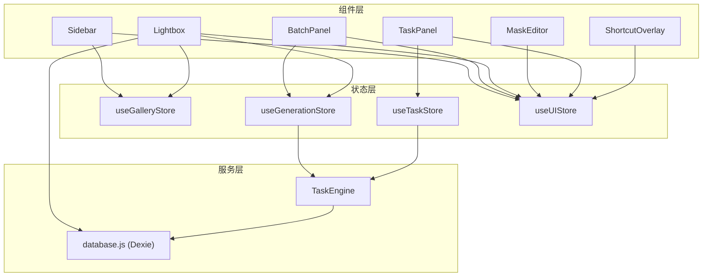
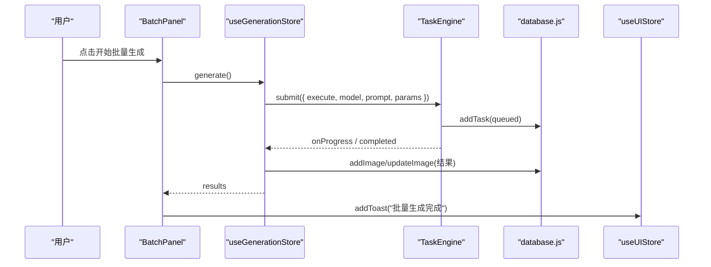
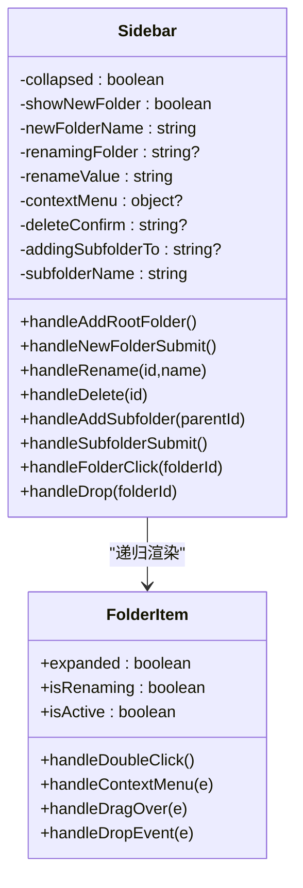
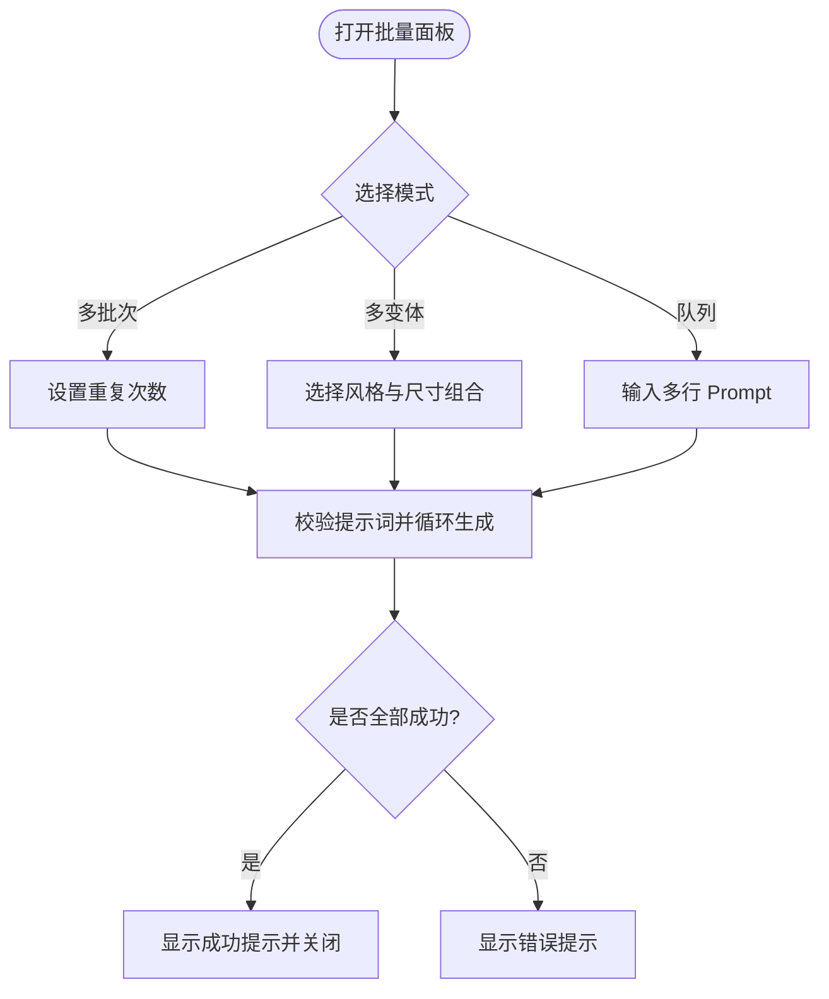
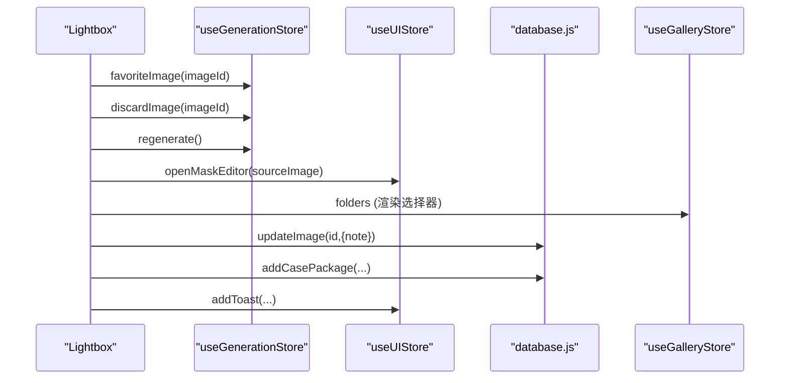
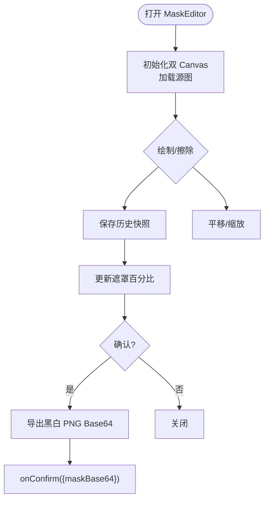
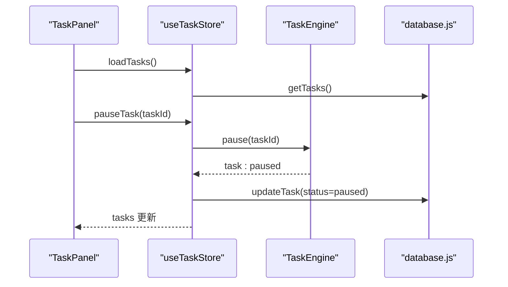
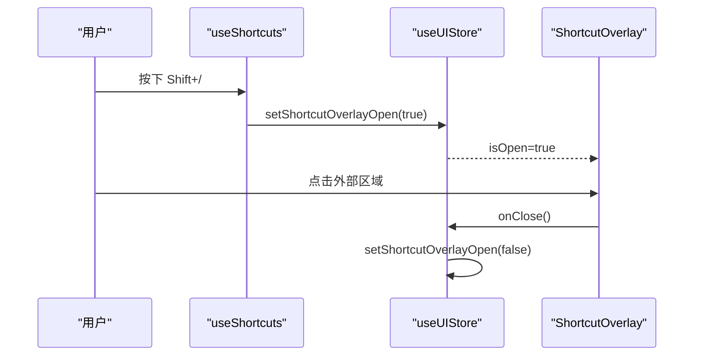
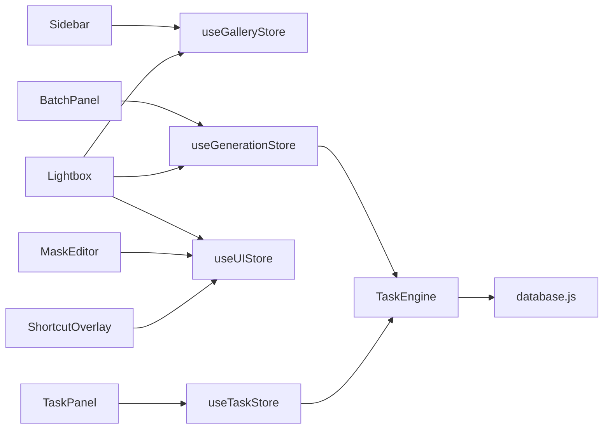

# 业务组件设计

<cite>
**本文引用的文件列表**
- [Sidebar.jsx](file://app/src/components/Sidebar.jsx)
- [BatchPanel.jsx](file://app/src/components/BatchPanel.jsx)
- [Lightbox.jsx](file://app/src/components/Lightbox.jsx)
- [MaskEditor.jsx](file://app/src/components/MaskEditor.jsx)
- [TaskPanel.jsx](file://app/src/components/TaskPanel.jsx)
- [ShortcutOverlay.jsx](file://app/src/components/ShortcutOverlay.jsx)
- [useGalleryStore.js](file://app/src/stores/useGalleryStore.js)
- [useGenerationStore.js](file://app/src/stores/useGenerationStore.js)
- [useTaskStore.js](file://app/src/stores/useTaskStore.js)
- [useUIStore.js](file://app/src/stores/useUIStore.js)
- [useShortcuts.js](file://app/src/hooks/useShortcuts.js)
- [task-engine.js](file://app/src/services/task-engine.js)
- [database.js](file://app/src/db/database.js)
</cite>

## 目录
1. [简介](#简介)
2. [项目结构](#项目结构)
3. [核心组件总览](#核心组件总览)
4. [架构总览](#架构总览)
5. [详细组件分析](#详细组件分析)
6. [依赖关系分析](#依赖关系分析)
7. [性能与可复用性](#性能与可复用性)
8. [样式定制与响应式策略](#样式定制与响应式策略)
9. [使用示例与最佳实践](#使用示例与最佳实践)
10. [故障排查指南](#故障排查指南)
11. [结论](#结论)

## 简介
本文件面向 AI Image Studio 的业务层组件，系统性梳理 Sidebar（侧边栏）、BatchPanel（批量面板）、Lightbox（图片查看器）、MaskEditor（蒙版编辑器）、TaskPanel（任务面板）、ShortcutOverlay（快捷键覆盖层）等核心组件的设计模式、Props 接口、事件处理机制、状态管理以及与 Store 和后台任务的协作方式。文档同时提供架构图、流程图、类图与序列图，帮助读者快速理解组件职责边界、数据流与扩展点。

## 项目结构
- 组件位于 app/src/components，按功能域组织；状态通过 Zustand store 集中管理；后台任务由 TaskEngine 统一调度；持久化通过 Dexie IndexedDB 实现。
- 关键路径：
  - 组件层：各业务组件
  - 状态层：useGalleryStore、useGenerationStore、useTaskStore、useUIStore
  - 服务层：TaskEngine（任务引擎）、数据库层 database.js
  - 快捷键系统：useShortcuts + ShortcutOverlay

图表来源
- [Sidebar.jsx:1-371](file://app/src/components/Sidebar.jsx#L1-L371)
- [BatchPanel.jsx:1-675](file://app/src/components/BatchPanel.jsx#L1-L675)
- [Lightbox.jsx:1-702](file://app/src/components/Lightbox.jsx#L1-L702)
- [MaskEditor.jsx:1-804](file://app/src/components/MaskEditor.jsx#L1-L804)
- [TaskPanel.jsx:1-538](file://app/src/components/TaskPanel.jsx#L1-L538)
- [ShortcutOverlay.jsx:1-137](file://app/src/components/ShortcutOverlay.jsx#L1-L137)
- [useGalleryStore.js:1-204](file://app/src/stores/useGalleryStore.js#L1-L204)
- [useGenerationStore.js:1-360](file://app/src/stores/useGenerationStore.js#L1-L360)
- [useTaskStore.js:1-173](file://app/src/stores/useTaskStore.js#L1-L173)
- [useUIStore.js:1-159](file://app/src/stores/useUIStore.js#L1-L159)
- [task-engine.js:1-319](file://app/src/services/task-engine.js#L1-L319)
- [database.js:1-200](file://app/src/db/database.js#L1-L200)

章节来源
- [Sidebar.jsx:1-371](file://app/src/components/Sidebar.jsx#L1-L371)
- [BatchPanel.jsx:1-675](file://app/src/components/BatchPanel.jsx#L1-L675)
- [Lightbox.jsx:1-702](file://app/src/components/Lightbox.jsx#L1-L702)
- [MaskEditor.jsx:1-804](file://app/src/components/MaskEditor.jsx#L1-L804)
- [TaskPanel.jsx:1-538](file://app/src/components/TaskPanel.jsx#L1-L538)
- [ShortcutOverlay.jsx:1-137](file://app/src/components/ShortcutOverlay.jsx#L1-L137)
- [useGalleryStore.js:1-204](file://app/src/stores/useGalleryStore.js#L1-L204)
- [useGenerationStore.js:1-360](file://app/src/stores/useGenerationStore.js#L1-L360)
- [useTaskStore.js:1-173](file://app/src/stores/useTaskStore.js#L1-L173)
- [useUIStore.js:1-159](file://app/src/stores/useUIStore.js#L1-L159)
- [task-engine.js:1-319](file://app/src/services/task-engine.js#L1-L319)
- [database.js:1-200](file://app/src/db/database.js#L1-L200)

## 核心组件总览
- Sidebar：导航与文件夹树管理，支持创建/重命名/删除/拖拽移动图片到文件夹，联动路由与图库筛选。
- BatchPanel：批量生成入口，支持“多批次”、“多变体”、“Prompt 队列”三种模式，驱动生成流程并反馈进度与结果。
- Lightbox：全屏查看与操作，支持收藏、淘汰、重新生成、设为参考、局部重绘、移动到文件夹、加入知识库、下载、复制 Prompt、缩放与键盘导航。
- MaskEditor：基于双 Canvas 的遮罩绘制工具，支持画笔/橡皮擦、撤销/重做、全选/清除/反转、上传外部 mask、对比原图、导出黑白掩码。
- TaskPanel：任务面板，分组展示进行中/排队中/已完成/失败任务，支持暂停/继续/取消/重试/移除等操作。
- ShortcutOverlay：全局快捷键速查覆盖层，配合 useShortcuts 实现上下文感知的快捷键作用域切换。

章节来源
- [Sidebar.jsx:1-371](file://app/src/components/Sidebar.jsx#L1-L371)
- [BatchPanel.jsx:1-675](file://app/src/components/BatchPanel.jsx#L1-L675)
- [Lightbox.jsx:1-702](file://app/src/components/Lightbox.jsx#L1-L702)
- [MaskEditor.jsx:1-804](file://app/src/components/MaskEditor.jsx#L1-L804)
- [TaskPanel.jsx:1-538](file://app/src/components/TaskPanel.jsx#L1-L538)
- [ShortcutOverlay.jsx:1-137](file://app/src/components/ShortcutOverlay.jsx#L1-L137)

## 架构总览
组件通过 Zustand store 进行跨组件通信，生成任务经由 TaskEngine 异步执行，结果持久化至 IndexedDB。UI 状态（如弹窗、面板开关、主题）集中在 useUIStore。

图表来源
- [BatchPanel.jsx:48-101](file://app/src/components/BatchPanel.jsx#L48-L101)
- [useGenerationStore.js:112-290](file://app/src/stores/useGenerationStore.js#L112-L290)
- [task-engine.js:57-81](file://app/src/services/task-engine.js#L57-L81)
- [database.js:43-50](file://app/src/db/database.js#L43-L50)
- [useUIStore.js:80-103](file://app/src/stores/useUIStore.js#L80-L103)

## 详细组件分析

### Sidebar（侧边栏）
- 职责
  - 顶部导航项渲染与高亮匹配
  - 文件夹树构建与递归渲染
  - 文件夹增删改、子文件夹创建、右键菜单、拖拽移动图片
  - 折叠/展开控制
- Props 与内部状态
  - 无外部 props，内部维护 collapsed、contextMenu、新增/重命名输入态、删除确认等
- 事件与交互
  - 双击进入重命名、Enter 提交、Esc 取消
  - 右键菜单触发重命名/删除
  - 拖拽放置将选中图片移动到目标文件夹
- 状态管理与通信
  - 读取/更新 useGalleryStore 中的 folders、currentFolder、selectedImages、moveImages、createFolder、renameFolder、deleteFolder
  - 通过 useUIStore.addToast 反馈操作结果
  - 使用 react-router-dom 的 Link 与 useNavigate 进行页面跳转
- 可复用性与扩展
  - FolderItem 为纯展示+回调的子组件，便于替换或扩展上下文菜单
  - 可通过注入新的底部导航项扩展功能入口

图表来源
- [Sidebar.jsx:44-130](file://app/src/components/Sidebar.jsx#L44-L130)
- [Sidebar.jsx:154-371](file://app/src/components/Sidebar.jsx#L154-L371)

章节来源
- [Sidebar.jsx:1-371](file://app/src/components/Sidebar.jsx#L1-L371)
- [useGalleryStore.js:125-152](file://app/src/stores/useGalleryStore.js#L125-L152)
- [useUIStore.js:80-103](file://app/src/stores/useUIStore.js#L80-L103)

### BatchPanel（批量面板）
- 职责
  - 提供三种批量模式：多批次、多变体、Prompt 队列
  - 计算预计生成数量与时间，驱动生成流程
- Props 与内部状态
  - isOpen、onClose、initialMode
  - 内部维护 activeMode、batchCount、promptVariables、selectedSizes、queuePrompts、isSubmitting
- 事件与交互
  - Tab 切换模式
  - 数值步进器调整批次数
  - 多选尺寸复选框
  - 文本域输入多行 Prompt
  - 提交后循环调用生成 API
- 状态管理与通信
  - 使用 useGenerationStore.setPrompt/setParam/generate 设置参数并提交任务
  - 使用 useUIStore.addToast 反馈成功/错误信息
- 可复用性与扩展
  - 模式可扩展为更多组合策略
  - 变量与参数变量可抽象为配置对象以便动态渲染

图表来源
- [BatchPanel.jsx:31-101](file://app/src/components/BatchPanel.jsx#L31-L101)
- [useGenerationStore.js:112-290](file://app/src/stores/useGenerationStore.js#L112-L290)
- [useUIStore.js:80-103](file://app/src/stores/useUIStore.js#L80-L103)

章节来源
- [BatchPanel.jsx:1-675](file://app/src/components/BatchPanel.jsx#L1-L675)
- [useGenerationStore.js:112-290](file://app/src/stores/useGenerationStore.js#L112-L290)
- [useUIStore.js:80-103](file://app/src/stores/useUIStore.js#L80-L103)

### Lightbox（图片查看器）
- 职责
  - 全屏查看图片，展示提示词、模型、参数、备注
  - 提供收藏、淘汰、重新生成、设为参考、局部重绘、移动到文件夹、加入知识库、下载、复制 Prompt、缩放与键盘导航
- Props 与内部状态
  - isOpen、onClose、images、currentIndex
  - 内部维护 currentImageIndex、zoomLevel、note、copied、showFolderPicker
- 事件与交互
  - 左右箭头切换图片，Esc 关闭
  - 按钮触发收藏/淘汰/重新生成/设为参考/局部重绘/移动到/加入知识库/下载
  - 复制 Prompt 到剪贴板
  - 右侧面板编辑备注并持久化
- 状态管理与通信
  - 使用 useGenerationStore.favoriteImage/discardImage/regenerate/addReferenceImage
  - 使用 useUIStore.openMaskEditor/addToast
  - 使用 useGalleryStore.folders 渲染文件夹选择
  - 使用 database.updateImage/addCasePackage 持久化备注与知识库条目
- 可复用性与扩展
  - 右侧操作区可按需扩展更多动作
  - 支持从冷存储加载图片用于局部重绘

图表来源
- [Lightbox.jsx:71-165](file://app/src/components/Lightbox.jsx#L71-L165)
- [useGenerationStore.js:316-344](file://app/src/stores/useGenerationStore.js#L316-L344)
- [useUIStore.js:135-143](file://app/src/stores/useUIStore.js#L135-L143)
- [database.js:84-86](file://app/src/db/database.js#L84-L86)

章节来源
- [Lightbox.jsx:1-702](file://app/src/components/Lightbox.jsx#L1-L702)
- [useGenerationStore.js:316-344](file://app/src/stores/useGenerationStore.js#L316-L344)
- [useUIStore.js:135-143](file://app/src/stores/useUIStore.js#L135-L143)
- [useGalleryStore.js:1-204](file://app/src/stores/useGalleryStore.js#L1-L204)
- [database.js:84-86](file://app/src/db/database.js#L84-L86)

### MaskEditor（蒙版编辑器）
- 职责
  - 基于双 Canvas 的遮罩绘制：背景图与半透明红色遮罩叠加
  - 支持画笔/橡皮擦、撤销/重做、全选/清除/反转、上传外部 mask、对比原图、导出黑白 PNG
- Props 与内部状态
  - isOpen、onClose、sourceImage、onConfirm
  - 内部维护 activeTool、brushSize、compareMode、historyIndex、maskPercent、zoom/pan 等
- 事件与交互
  - 指针事件绘制与平移（空格键拖动）
  - 滚轮缩放
  - 键盘快捷键：B/E/[ ]、Ctrl+Z/Ctrl+Shift+Z、Space
  - 确认时导出 mask 并回调 onConfirm
- 状态管理与通信
  - 通过 useUIStore.openMaskEditor/closeMaskEditor 控制打开与关闭
  - 导出 maskBase64 供上层调用（例如局部重绘）
- 可复用性与扩展
  - 工具集可插拔扩展（如套索、填充）
  - 历史栈长度与采样策略可配置以平衡性能与精度

图表来源
- [MaskEditor.jsx:43-87](file://app/src/components/MaskEditor.jsx#L43-L87)
- [MaskEditor.jsx:103-154](file://app/src/components/MaskEditor.jsx#L103-L154)
- [MaskEditor.jsx:319-360](file://app/src/components/MaskEditor.jsx#L319-L360)
- [useUIStore.js:135-143](file://app/src/stores/useUIStore.js#L135-L143)

章节来源
- [MaskEditor.jsx:1-804](file://app/src/components/MaskEditor.jsx#L1-L804)
- [useUIStore.js:135-143](file://app/src/stores/useUIStore.js#L135-L143)

### TaskPanel（任务面板）
- 职责
  - 分组展示任务：进行中（含暂停）、排队中、已完成、失败
  - 提供暂停/继续/取消/重试/移除等操作
- Props 与内部状态
  - isOpen、onClose
  - 内部维护 expandedSections 控制分组展开
- 事件与交互
  - 点击分组标题切换展开/收起
  - 任务卡片内操作按钮触发对应 action
- 状态管理与通信
  - 使用 useTaskStore.loadTasks/cancelTask/retryTask/pauseTask/resumeTask/removeTask
  - 使用 useUIStore.addToast 反馈操作结果
  - 与 TaskEngine 事件桥接刷新任务列表
- 可复用性与扩展
  - 分组逻辑可配置化
  - 可添加批量操作（如批量重试/清理）

图表来源
- [TaskPanel.jsx:26-37](file://app/src/components/TaskPanel.jsx#L26-L37)
- [useTaskStore.js:39-64](file://app/src/stores/useTaskStore.js#L39-L64)
- [task-engine.js:148-178](file://app/src/services/task-engine.js#L148-L178)
- [database.js:200-200](file://app/src/db/database.js#L200-L200)

章节来源
- [TaskPanel.jsx:1-538](file://app/src/components/TaskPanel.jsx#L1-L538)
- [useTaskStore.js:1-173](file://app/src/stores/useTaskStore.js#L1-L173)
- [task-engine.js:148-178](file://app/src/services/task-engine.js#L148-L178)

### ShortcutOverlay（快捷键覆盖层）
- 职责
  - 展示全局快捷键速查，按组分类呈现
- Props 与内部状态
  - isOpen、onClose
- 事件与交互
  - 点击遮罩关闭
  - 内容来自 SHORTCUT_GROUPS
- 状态管理与通信
  - 受 useUIStore.shortcutOverlayOpen 控制显示
  - 与 useShortcuts 的 useGlobalShortcuts/useShortcutScopes 协同工作

图表来源
- [useShortcuts.js:52-55](file://app/src/hooks/useShortcuts.js#L52-L55)
- [useUIStore.js:147-157](file://app/src/stores/useUIStore.js#L147-L157)
- [ShortcutOverlay.jsx:9-118](file://app/src/components/ShortcutOverlay.jsx#L9-L118)

章节来源
- [ShortcutOverlay.jsx:1-137](file://app/src/components/ShortcutOverlay.jsx#L1-L137)
- [useShortcuts.js:1-185](file://app/src/hooks/useShortcuts.js#L1-L185)
- [useUIStore.js:147-157](file://app/src/stores/useUIStore.js#L147-L157)

## 依赖关系分析
- 组件与 Store 的耦合度较低，主要通过 props 与 store actions 通信，符合单向数据流。
- 生成流程解耦于 UI：BatchPanel 仅负责参数准备与 UI 反馈，具体执行在 useGenerationStore 与 TaskEngine 中。
- 任务状态由 TaskEngine 事件驱动，useTaskStore 作为桥接层，避免组件直接监听底层事件。
- 数据库访问集中在 database.js，组件不直接读写 IndexedDB，降低副作用风险。

图表来源
- [Sidebar.jsx:1-371](file://app/src/components/Sidebar.jsx#L1-L371)
- [BatchPanel.jsx:1-675](file://app/src/components/BatchPanel.jsx#L1-L675)
- [Lightbox.jsx:1-702](file://app/src/components/Lightbox.jsx#L1-L702)
- [MaskEditor.jsx:1-804](file://app/src/components/MaskEditor.jsx#L1-L804)
- [TaskPanel.jsx:1-538](file://app/src/components/TaskPanel.jsx#L1-L538)
- [ShortcutOverlay.jsx:1-137](file://app/src/components/ShortcutOverlay.jsx#L1-L137)
- [useGenerationStore.js:1-360](file://app/src/stores/useGenerationStore.js#L1-L360)
- [useTaskStore.js:1-173](file://app/src/stores/useTaskStore.js#L1-L173)
- [useUIStore.js:1-159](file://app/src/stores/useUIStore.js#L1-L159)
- [task-engine.js:1-319](file://app/src/services/task-engine.js#L1-L319)
- [database.js:1-200](file://app/src/db/database.js#L1-L200)

章节来源
- [useGenerationStore.js:112-290](file://app/src/stores/useGenerationStore.js#L112-L290)
- [useTaskStore.js:39-64](file://app/src/stores/useTaskStore.js#L39-L64)
- [task-engine.js:57-81](file://app/src/services/task-engine.js#L57-L81)

## 性能与可复用性
- 性能优化
  - MaskEditor 采用采样像素计算遮罩占比，避免全量像素遍历带来的卡顿。
  - TaskEngine 支持并发上限与指数退避重试，防止瞬时压力过大。
  - Lightbox 与 Sidebar 大量使用 CSS 变量与 transform，减少重排重绘。
- 可复用性
  - FolderItem 为独立子组件，便于在其他树形结构中复用。
  - BatchPanel 的模式可配置化，便于扩展新策略。
  - 所有 UI 状态集中于 useUIStore，便于统一管理弹窗、面板与主题。
- 建议
  - 对大列表渲染考虑虚拟滚动（如 Gallery 图片过多）。
  - 对复杂表单（如多变体）引入表单库以提升可维护性。
  - 将常用操作封装为 hooks 或高阶组件，减少重复代码。

[本节为通用指导，无需源码引用]

## 样式定制与响应式策略
- 样式体系
  - 全面使用 CSS 变量（如 --bg-panel、--accent-primary、--radius-md、--fs-sm 等），便于主题切换与一致性维护。
  - 组件内联样式与 className 结合，保持灵活性与可测试性。
- 响应式适配
  - 侧边栏宽度通过 CSS 变量控制，支持折叠态与展开态平滑过渡。
  - Lightbox 与 MaskEditor 使用相对单位与最大宽高限制，适配不同屏幕尺寸。
- 主题
  - useUIStore 提供 theme 状态与切换方法，应用 data-theme 属性驱动全局主题。

章节来源
- [useUIStore.js:119-131](file://app/src/stores/useUIStore.js#L119-L131)
- [Sidebar.jsx:247-258](file://app/src/components/Sidebar.jsx#L247-L258)
- [Lightbox.jsx:186-196](file://app/src/components/Lightbox.jsx#L186-L196)
- [MaskEditor.jsx:493-503](file://app/src/components/MaskEditor.jsx#L493-L503)

## 使用示例与最佳实践
- 使用示例
  - 打开批量面板：传入 isOpen/onClose/initialMode，根据模式设置参数后调用生成。
  - 打开 Lightbox：传入 images 与 currentIndex，监听 onClose 关闭。
  - 打开 MaskEditor：通过 useUIStore.openMaskEditor(image, onConfirm)，在 onConfirm 中获取 maskBase64 并发起局部重绘。
  - 打开 TaskPanel：通过 useUIStore.toggleTaskPanel/openTaskPanel/closeTaskPanel 控制显示。
  - 打开快捷键覆盖层：通过 useUIStore.setShortcutOverlayOpen(true)。
- 最佳实践
  - 组件尽量无副作用，依赖 store actions 与回调函数。
  - 对外暴露最小必要 props，内部状态私有化。
  - 错误处理统一通过 addToast 反馈，并在必要时记录日志。
  - 对长耗时操作使用 TaskEngine，避免阻塞主线程。
  - 对敏感操作（删除、移动）提供二次确认或明确提示。

章节来源
- [BatchPanel.jsx:8-27](file://app/src/components/BatchPanel.jsx#L8-L27)
- [Lightbox.jsx:13-29](file://app/src/components/Lightbox.jsx#L13-L29)
- [useUIStore.js:135-143](file://app/src/stores/useUIStore.js#L135-L143)
- [useUIStore.js:55-72](file://app/src/stores/useUIStore.js#L55-L72)
- [useUIStore.js:147-157](file://app/src/stores/useUIStore.js#L147-L157)

## 故障排查指南
- 常见问题
  - 批量生成未触发：检查提示词是否为空、生成标志位 isGenerating 是否被占用。
  - 任务无法重试：确认任务状态为 failed 或 cancelled，且 TaskEngine 支持该状态的重试。
  - 遮罩导出为空：确保已绘制遮罩区域（maskPercent > 0），并正确调用 exportMask。
  - 快捷键冲突：检查 useShortcuts 的作用域优先级，确保当前上下文启用了正确的 scope。
- 定位方法
  - 查看 console 日志输出（如 GenerationStore、TaskEngine、TaskStore 的错误日志）。
  - 检查 IndexedDB 中 tasks/images 表的状态与字段是否正确更新。
  - 使用浏览器开发者工具观察网络请求与 IndexedDB 写入。
- 恢复策略
  - 对于失败任务，优先尝试重试；若仍失败，检查后端适配器与网络环境。
  - 对于遮罩问题，清空并重绘，或使用上传外部 mask 功能导入。

章节来源
- [useGenerationStore.js:283-290](file://app/src/stores/useGenerationStore.js#L283-L290)
- [task-engine.js:269-292](file://app/src/services/task-engine.js#L269-L292)
- [useTaskStore.js:109-124](file://app/src/stores/useTaskStore.js#L109-L124)
- [MaskEditor.jsx:319-360](file://app/src/components/MaskEditor.jsx#L319-L360)
- [useShortcuts.js:116-134](file://app/src/hooks/useShortcuts.js#L116-L134)

## 结论
AI Image Studio 的业务组件围绕 Zustand 状态管理与 TaskEngine 任务调度构建，形成清晰的数据流与职责边界。Sidebar、BatchPanel、Lightbox、MaskEditor、TaskPanel、ShortcutOverlay 各司其职，并通过统一的 UI 状态与通知机制协同工作。整体架构具备良好的可复用性与扩展性，适合持续迭代与功能增强。