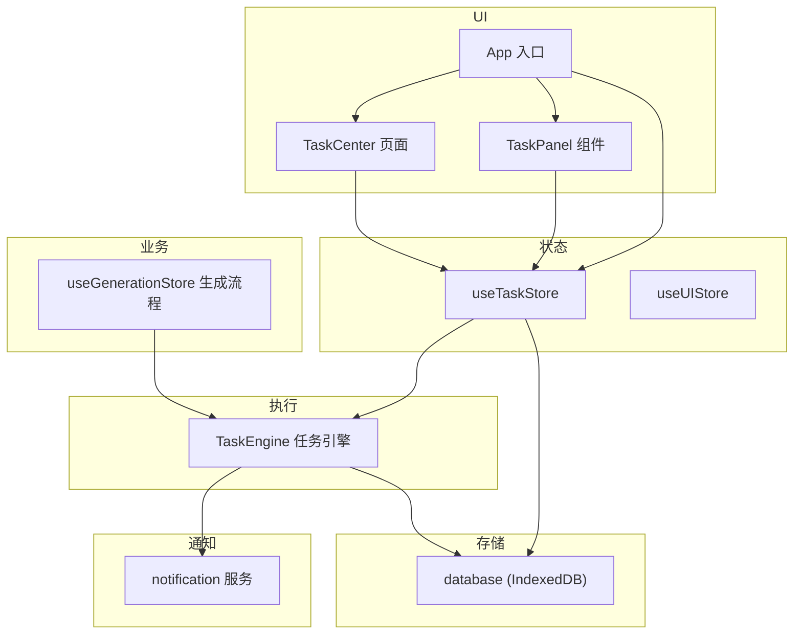
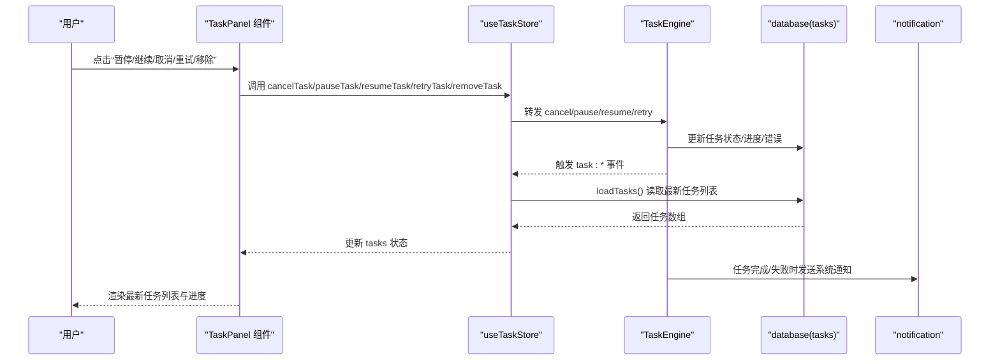
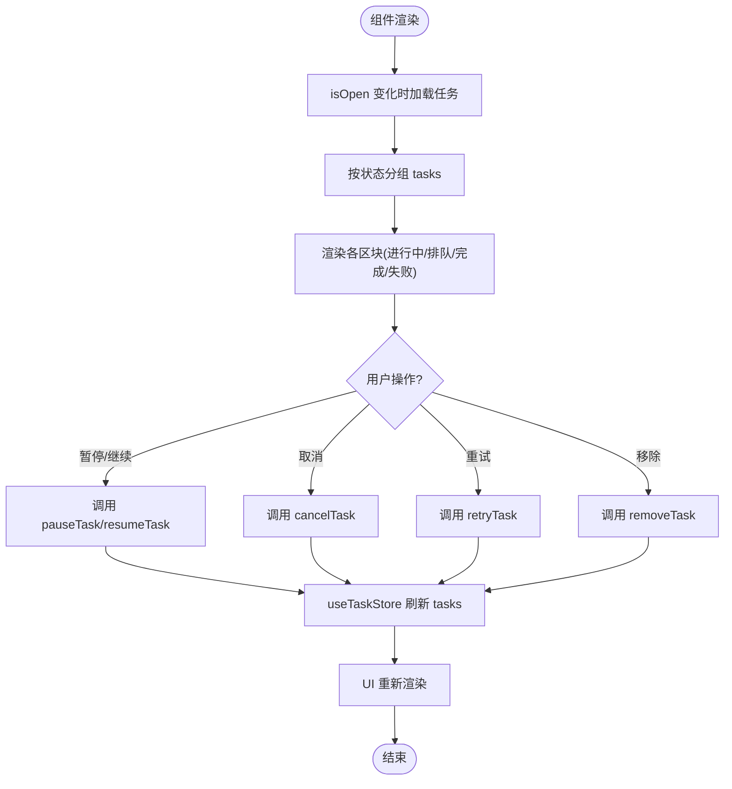
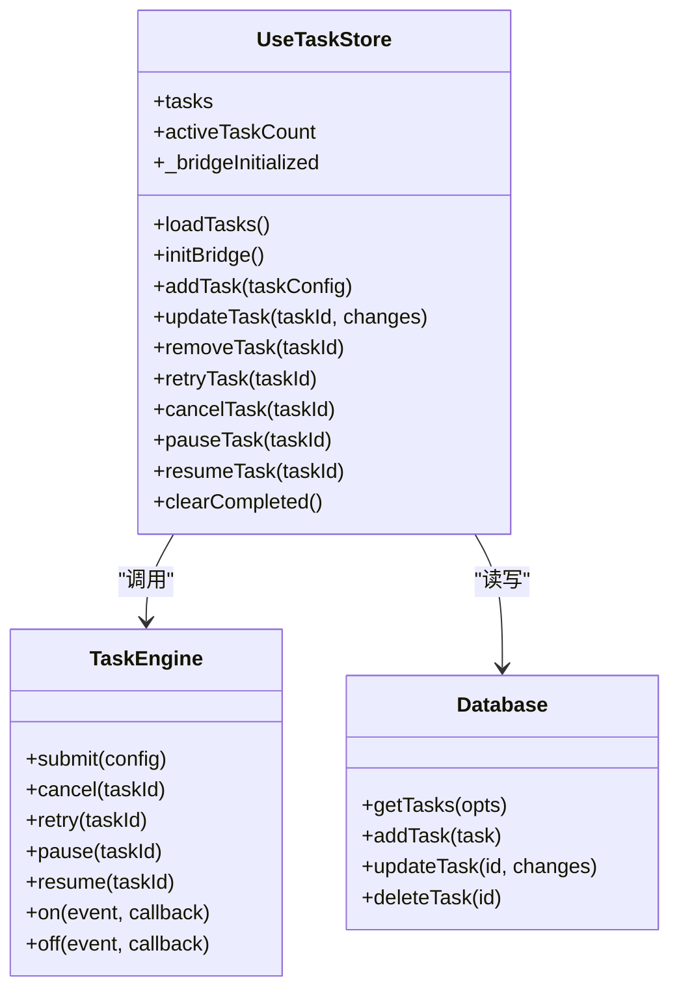
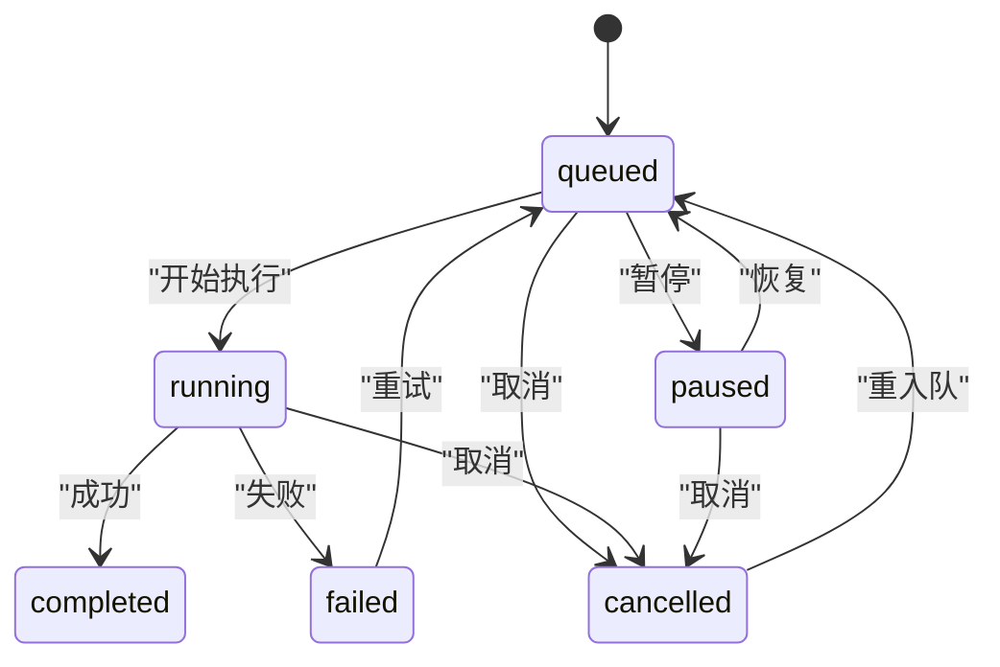
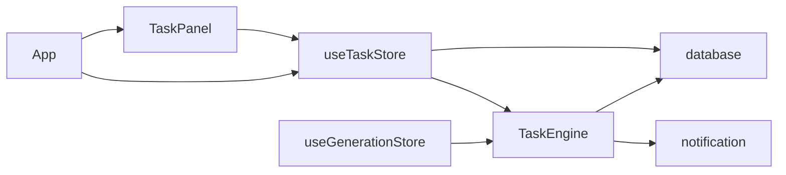

# 任务面板组件 (TaskPanel)

<cite>
**本文引用的文件**   
- [app/src/components/TaskPanel.jsx](file://app/src/components/TaskPanel.jsx)
- [app/src/stores/useTaskStore.js](file://app/src/stores/useTaskStore.js)
- [app/src/services/task-engine.js](file://app/src/services/task-engine.js)
- [app/src/db/database.js](file://app/src/db/database.js)
- [app/src/pages/TaskCenter.jsx](file://app/src/pages/TaskCenter.jsx)
- [app/src/App.jsx](file://app/src/App.jsx)
- [app/src/stores/useUIStore.js](file://app/src/stores/useUIStore.js)
- [app/src/services/notification.js](file://app/src/services/notification.js)
- [app/src/stores/useGenerationStore.js](file://app/src/stores/useGenerationStore.js)
</cite>

## 目录
1. [简介](#简介)
2. [项目结构](#项目结构)
3. [核心组件](#核心组件)
4. [架构总览](#架构总览)
5. [详细组件分析](#详细组件分析)
6. [依赖关系分析](#依赖关系分析)
7. [性能与内存优化](#性能与内存优化)
8. [故障排查指南](#故障排查指南)
9. [结论](#结论)
10. [附录：使用示例与集成指南](#附录使用示例与集成指南)

## 简介
本文件为 AI Image Studio 的任务面板组件 TaskPanel 的完整技术文档。内容覆盖任务列表展示、状态监控、进度条显示、错误提示等特性；深入解析组件与任务引擎的实时通信机制、状态同步策略和事件监听处理；分析任务状态更新逻辑、UI 渲染优化、内存管理与性能调优方案；并提供数据结构设计、消息协议与错误处理机制说明，以及具体使用示例、配置选项与集成指南。

## 项目结构
围绕 TaskPanel 的关键代码分布在以下模块：
- UI 层：TaskPanel 组件（侧边任务面板）与 TaskCenter 页面（全屏任务中心）
- 状态层：useTaskStore（Zustand 任务状态桥接）、useUIStore（全局 UI 状态）
- 执行层：TaskEngine（后台任务调度器，含并发控制、重试、事件广播）
- 持久化层：database（IndexedDB 封装，包含 tasks 表）
- 通知层：notification（浏览器系统通知）
- 应用入口：App.jsx（初始化任务桥接、打开任务面板入口）
- 生成流程：useGenerationStore（通过 TaskEngine 提交图像生成任务）

图表来源
- [app/src/components/TaskPanel.jsx:1-538](file://app/src/components/TaskPanel.jsx#L1-L538)
- [app/src/pages/TaskCenter.jsx:1-218](file://app/src/pages/TaskCenter.jsx#L1-L218)
- [app/src/stores/useTaskStore.js:1-173](file://app/src/stores/useTaskStore.js#L1-L173)
- [app/src/services/task-engine.js:1-319](file://app/src/services/task-engine.js#L1-L319)
- [app/src/db/database.js:1-339](file://app/src/db/database.js#L1-L339)
- [app/src/App.jsx:1-364](file://app/src/App.jsx#L1-L364)
- [app/src/services/notification.js:1-113](file://app/src/services/notification.js#L1-L113)
- [app/src/stores/useGenerationStore.js:1-360](file://app/src/stores/useGenerationStore.js#L1-L360)

章节来源
- [app/src/components/TaskPanel.jsx:1-538](file://app/src/components/TaskPanel.jsx#L1-L538)
- [app/src/stores/useTaskStore.js:1-173](file://app/src/stores/useTaskStore.js#L1-L173)
- [app/src/services/task-engine.js:1-319](file://app/src/services/task-engine.js#L1-L319)
- [app/src/db/database.js:1-339](file://app/src/db/database.js#L1-L339)
- [app/src/pages/TaskCenter.jsx:1-218](file://app/src/pages/TaskCenter.jsx#L1-L218)
- [app/src/App.jsx:1-364](file://app/src/App.jsx#L1-L364)
- [app/src/services/notification.js:1-113](file://app/src/services/notification.js#L1-L113)
- [app/src/stores/useGenerationStore.js:1-360](file://app/src/stores/useGenerationStore.js#L1-L360)

## 核心组件
- TaskPanel 组件
  - 功能：右侧滑出式任务面板，分组展示“进行中/排队中/已完成/失败”任务，支持暂停/继续、取消、重试、移除等操作，提供进度条与错误信息展示。
  - 数据源：useTaskStore.tasks（由 Zustand 管理），按 status 分组渲染。
  - 交互：调用 useTaskStore 提供的 cancelTask、retryTask、pauseTask、resumeTask、removeTask 等方法，触发后端任务引擎与数据库更新。
  - 导航：底部链接跳转至“查看全部任务”（#/task-center）。

- useTaskStore
  - 职责：维护任务列表、活跃任务计数；桥接 TaskEngine 事件到 Zustand 状态；提供 add/update/remove/retry/cancel/pause/resume 等动作。
  - 事件桥：initBridge 订阅 TaskEngine 的所有任务事件，统一刷新任务列表，确保 UI 实时同步。

- TaskEngine
  - 职责：后台任务调度器，实现最大并发、FIFO 队列、指数退避重试、状态机流转、进度上报、自动持久化、事件广播。
  - 关键 API：submit、submitWithId、cancel、retry、pause、resume、on/off、setMaxConcurrent、getStats。
  - 事件：task:queued、task:started、task:progress、task:completed、task:failed、task:cancelled、task:paused、task:retry。

- database（tasks 表）
  - 字段：id、type、status、model、prompt、params、progress、error、result、retryCount、createdAt、updatedAt 等。
  - 索引：按 createdAt 倒序查询，支持按 status 过滤。

- App.jsx
  - 职责：在应用启动时加载任务、初始化任务桥接、请求系统通知权限；提供任务指示器与 TaskPanel 挂载点。

- notification
  - 职责：封装浏览器 Notification API，在任务完成或失败时推送系统通知。

- useGenerationStore
  - 职责：构建 execute 函数并通过 TaskEngine.submit 提交图像生成任务；在 onProgress/onTaskSubmitted 回调中持久化中间态与结果。

章节来源
- [app/src/components/TaskPanel.jsx:1-538](file://app/src/components/TaskPanel.jsx#L1-L538)
- [app/src/stores/useTaskStore.js:1-173](file://app/src/stores/useTaskStore.js#L1-L173)
- [app/src/services/task-engine.js:1-319](file://app/src/services/task-engine.js#L1-L319)
- [app/src/db/database.js:1-339](file://app/src/db/database.js#L1-L339)
- [app/src/App.jsx:1-364](file://app/src/App.jsx#L1-L364)
- [app/src/services/notification.js:1-113](file://app/src/services/notification.js#L1-L113)
- [app/src/stores/useGenerationStore.js:1-360](file://app/src/stores/useGenerationStore.js#L1-L360)

## 架构总览
下图展示了从用户操作到任务执行、状态同步与 UI 更新的完整链路。

图表来源
- [app/src/components/TaskPanel.jsx:1-538](file://app/src/components/TaskPanel.jsx#L1-L538)
- [app/src/stores/useTaskStore.js:1-173](file://app/src/stores/useTaskStore.js#L1-L173)
- [app/src/services/task-engine.js:1-319](file://app/src/services/task-engine.js#L1-L319)
- [app/src/db/database.js:1-339](file://app/src/db/database.js#L1-L339)
- [app/src/services/notification.js:1-113](file://app/src/services/notification.js#L1-L113)

## 详细组件分析

### TaskPanel 组件
- 布局与交互
  - 固定右侧面板，宽度 360px，支持展开/收起动画。
  - 顶部标题与任务总数徽章，右上角关闭按钮。
  - 内容区滚动容器，分四个区块：进行中、排队中、已完成、失败。
  - 每个区块可折叠/展开，显示对应数量徽章。
- 任务项渲染
  - 进行中：显示 prompt、模型标签、百分比与进度条；根据状态显示“暂停/继续”、“取消”按钮。
  - 排队中：紧凑行内展示，支持“移除”。
  - 已完成：显示模型、更新时间，支持“移除”。
  - 失败：红色边框高亮，显示错误信息，支持“重试”与“移除”，并弹出 toast 提示。
- 数据分组
  - 使用 useMemo 将 tasks 按 status 分组，减少重复计算。
- 事件绑定
  - 所有操作均通过 useTaskStore 暴露的方法进行，避免直接操作数据库。
- 导航
  - 底部链接跳转至“全部任务”页面。

图表来源
- [app/src/components/TaskPanel.jsx:1-538](file://app/src/components/TaskPanel.jsx#L1-L538)
- [app/src/stores/useTaskStore.js:1-173](file://app/src/stores/useTaskStore.js#L1-L173)

章节来源
- [app/src/components/TaskPanel.jsx:1-538](file://app/src/components/TaskPanel.jsx#L1-L538)

### useTaskStore 状态桥接
- 状态
  - tasks: 任务列表
  - activeTaskCount: 活跃任务数（running/queued）
  - _bridgeInitialized: 防止重复初始化事件桥
- 动作
  - loadTasks：从 IndexedDB 读取任务并计算活跃数
  - initBridge：一次性订阅 TaskEngine 的事件，统一刷新任务列表
  - addTask/updateTask/removeTask：对 tasks 表的增删改
  - retryTask/cancelTask/pauseTask/resumeTask：委托给 TaskEngine，并在异常时回退本地更新
  - clearCompleted：批量删除已完成任务
- 事件桥
  - 订阅事件：task:queued、task:started、task:progress、task:completed、task:failed、task:cancelled、task:paused、task:retry
  - 每次事件后调用 loadTasks 保证 UI 与持久化一致

图表来源
- [app/src/stores/useTaskStore.js:1-173](file://app/src/stores/useTaskStore.js#L1-L173)
- [app/src/services/task-engine.js:1-319](file://app/src/services/task-engine.js#L1-L319)
- [app/src/db/database.js:1-339](file://app/src/db/database.js#L1-L339)

章节来源
- [app/src/stores/useTaskStore.js:1-173](file://app/src/stores/useTaskStore.js#L1-L173)

### TaskEngine 任务引擎
- 并发与队列
  - 最大并发可配置（默认 3），内部使用 FIFO 队列与活动任务 Map 管理。
- 状态机
  - 合法转换：queued→running|cancelled|paused；running→completed|failed|cancelled；paused→queued|cancelled；failed→queued（重试）；completed 无出站；cancelled→queued（重入队）。
- 生命周期
  - submit：创建任务记录（status=queued），加入队列，触发 task:queued，尝试处理队列。
  - _runTask：标记 running，构造执行上下文（signal、taskId、onProgress），执行 execute 函数；成功则 completed，失败则判断是否可重试（指数退避），否则 failed。
  - cancel：若处于活动任务则中止控制器，并从队列移除；更新状态并触发事件。
  - pause/resume：暂停运行中或排队中的任务；恢复仅将 paused 任务置为 queued。
  - retry：从 DB 获取任务，校验状态，重置进度与错误，增加重试次数，重新入队。
- 事件
  - 任务进入队列、开始、进度、完成、失败、取消、暂停、重试等事件，供 store 订阅刷新。
- 通知
  - 完成/失败时调用 notification 服务推送系统通知。

图表来源
- [app/src/services/task-engine.js:1-319](file://app/src/services/task-engine.js#L1-L319)

章节来源
- [app/src/services/task-engine.js:1-319](file://app/src/services/task-engine.js#L1-L319)

### database（tasks 表）
- 表结构与索引
  - 主键自增 id
  - 常用字段：type、status、model、prompt、params、progress、error、result、retryCount、createdAt、updatedAt
  - 索引：createdAt 倒序；[status+createdAt] 复合索引用于按状态筛选
- 常用方法
  - getTasks：支持按 status 过滤与分页限制
  - updateTask：增量更新字段
  - deleteTask：删除单条任务
  - getTaskStats：统计 total/active/queued/completed/failed

章节来源
- [app/src/db/database.js:1-339](file://app/src/db/database.js#L1-L339)

### App.jsx 集成要点
- 启动时
  - 调用 loadTasks 初始化任务列表
  - 调用 useTaskStore.getState().initBridge() 建立事件桥，并在卸载时清理
  - 请求系统通知权限
- 挂载
  - 渲染 TaskIndicator（右下角浮动按钮，显示活跃任务数）
  - 渲染 TaskPanel 组件，受 useUIStore.taskPanelOpen 控制

章节来源
- [app/src/App.jsx:1-364](file://app/src/App.jsx#L1-L364)

### notification 服务
- 能力
  - 请求权限、发送系统通知、点击聚焦窗口、自动关闭
- 集成
  - 任务完成/失败时由 TaskEngine 调用 notifyTaskComplete/notifyTaskFailed

章节来源
- [app/src/services/notification.js:1-113](file://app/src/services/notification.js#L1-L113)

### useGenerationStore 生成流程
- 生成步骤
  - 选择模型与参数，构建 execute 函数
  - 调用 TaskEngine.submit 提交任务
  - 在适配器回调中持久化 pending 记录与最终结果
- 与 TaskPanel 的关系
  - 生成的任务会出现在任务列表中，状态与进度实时更新

章节来源
- [app/src/stores/useGenerationStore.js:1-360](file://app/src/stores/useGenerationStore.js#L1-L360)

## 依赖关系分析
- 组件耦合
  - TaskPanel 仅依赖 useTaskStore 与 useUIStore，不直接访问数据库或任务引擎，符合低耦合原则。
- 事件驱动
  - TaskEngine 作为事件源，useTaskStore 作为订阅者，TaskPanel 作为消费者，形成清晰的数据流。
- 外部依赖
  - Dexie（IndexedDB）、uuid、lucide-react 图标库、react-router-dom（路由跳转）

图表来源
- [app/src/components/TaskPanel.jsx:1-538](file://app/src/components/TaskPanel.jsx#L1-L538)
- [app/src/stores/useTaskStore.js:1-173](file://app/src/stores/useTaskStore.js#L1-L173)
- [app/src/services/task-engine.js:1-319](file://app/src/services/task-engine.js#L1-L319)
- [app/src/db/database.js:1-339](file://app/src/db/database.js#L1-L339)
- [app/src/services/notification.js:1-113](file://app/src/services/notification.js#L1-L113)
- [app/src/App.jsx:1-364](file://app/src/App.jsx#L1-L364)
- [app/src/stores/useGenerationStore.js:1-360](file://app/src/stores/useGenerationStore.js#L1-L360)

章节来源
- [app/src/components/TaskPanel.jsx:1-538](file://app/src/components/TaskPanel.jsx#L1-L538)
- [app/src/stores/useTaskStore.js:1-173](file://app/src/stores/useTaskStore.js#L1-L173)
- [app/src/services/task-engine.js:1-319](file://app/src/services/task-engine.js#L1-L319)
- [app/src/db/database.js:1-339](file://app/src/db/database.js#L1-L339)
- [app/src/services/notification.js:1-113](file://app/src/services/notification.js#L1-L113)
- [app/src/App.jsx:1-364](file://app/src/App.jsx#L1-L364)
- [app/src/stores/useGenerationStore.js:1-360](file://app/src/stores/useGenerationStore.js#L1-L360)

## 性能与内存优化
- 渲染优化
  - 使用 useMemo 对任务分组进行缓存，避免频繁重组导致的重渲染。
  - 列表项使用稳定 key（task.id），提升 React 列表 diff 效率。
  - 进度条使用 CSS transition 平滑过渡，减少高频更新带来的抖动。
- 状态同步
  - 事件桥统一刷新任务列表，避免多处重复订阅导致的状态不一致。
  - 对于高频进度事件，建议在上层做节流（例如每 200ms 刷新一次），以减少 IndexedDB 写入与 UI 重绘压力。
- 内存管理
  - TaskEngine 在 finally 中清理活动任务引用，避免泄漏。
  - useTaskStore.initBridge 返回清理函数，在组件卸载时解除事件监听。
- 并发与重试
  - 合理设置最大并发（默认 3），避免过多并发造成网络拥塞与 UI 卡顿。
  - 指数退避重试降低瞬时失败率，但需关注重试上限与错误分类。
- 大数据量场景
  - 当任务量较大时，可在 useTaskStore.loadTasks 中引入分页或虚拟列表，减少 DOM 节点数量。
  - 对已完成任务提供“清空已完成”能力，定期清理历史数据。

[本节为通用性能建议，无需特定文件来源]

## 故障排查指南
- 常见问题
  - 任务未显示：检查 useTaskStore.initBridge 是否被调用；确认 TaskEngine 事件是否正常触发；查看 IndexedDB 是否有任务记录。
  - 进度不更新：检查 execute 中是否正确调用 onProgress；确认 TaskEngine 是否发出 task:progress 事件。
  - 无法暂停/取消：确认任务是否处于活动状态或仍在队列中；检查 TaskEngine.cancel/pause 返回值与事件。
  - 重试失败：检查任务当前状态是否为 failed 或 cancelled；确认 _isRetryableError 判定是否符合预期。
- 日志定位
  - 控制台输出：TaskEngine 与 useTaskStore 均有日志打印，便于定位事件与错误。
  - 系统通知：任务完成/失败时会推送系统通知，可作为辅助验证手段。
- 回退策略
  - useTaskStore 的动作在调用 TaskEngine 失败时，会尝试本地更新状态，保证 UI 基本可用。

章节来源
- [app/src/stores/useTaskStore.js:1-173](file://app/src/stores/useTaskStore.js#L1-L173)
- [app/src/services/task-engine.js:1-319](file://app/src/services/task-engine.js#L1-L319)
- [app/src/services/notification.js:1-113](file://app/src/services/notification.js#L1-L113)

## 结论
TaskPanel 组件以清晰的职责边界与事件驱动架构，实现了任务的全生命周期可视化与管理。通过 useTaskStore 与 TaskEngine 的解耦设计，UI 与执行层保持松耦合，具备良好的扩展性与可维护性。配合 IndexedDB 持久化与系统通知，提供了稳定的用户体验。建议在大数据量场景下进一步优化列表渲染与事件刷新频率，以获得更流畅的交互体验。

[本节为总结性内容，无需特定文件来源]

## 附录：使用示例与集成指南

### 在应用中启用任务面板
- 在应用入口（App.jsx）中：
  - 启动时加载任务并初始化事件桥
  - 挂载 TaskPanel 组件，并通过 useUIStore 控制开关
  - 请求系统通知权限

章节来源
- [app/src/App.jsx:1-364](file://app/src/App.jsx#L1-L364)

### 提交一个图像生成任务
- 在工作台（useGenerationStore）中：
  - 构建 execute 函数，调用适配器接口
  - 在 onProgress 中上报进度，在 onTaskSubmitted 中持久化 pending 记录
  - 通过 TaskEngine.submit 提交任务

章节来源
- [app/src/stores/useGenerationStore.js:1-360](file://app/src/stores/useGenerationStore.js#L1-L360)

### 任务面板操作示例
- 暂停/继续：点击对应按钮，调用 pauseTask/resumeTask
- 取消：点击取消按钮，调用 cancelTask
- 重试：失败任务点击重试，调用 retryTask
- 移除：点击移除按钮，调用 removeTask

章节来源
- [app/src/components/TaskPanel.jsx:1-538](file://app/src/components/TaskPanel.jsx#L1-L538)
- [app/src/stores/useTaskStore.js:1-173](file://app/src/stores/useTaskStore.js#L1-L173)

### 配置选项
- 最大并发：TaskEngine.setMaxConcurrent(n)，默认 3
- 重试策略：指数退避，最大重试次数 3（由 _isRetryableError 判定）
- 通知权限：requestPermission 在应用启动时调用

章节来源
- [app/src/services/task-engine.js:1-319](file://app/src/services/task-engine.js#L1-L319)
- [app/src/services/notification.js:1-113](file://app/src/services/notification.js#L1-L113)

### 数据结构与消息协议
- 任务对象（tasks 表）
  - 关键字段：id、type、status、model、prompt、params、progress、error、result、retryCount、createdAt、updatedAt
- 事件协议（TaskEngine 事件）
  - task:queued、task:started、task:progress、task:completed、task:failed、task:cancelled、task:paused、task:retry
  - 事件数据包含 taskId 及相关上下文（如 progress、error、result）

章节来源
- [app/src/db/database.js:1-339](file://app/src/db/database.js#L1-L339)
- [app/src/services/task-engine.js:1-319](file://app/src/services/task-engine.js#L1-L319)