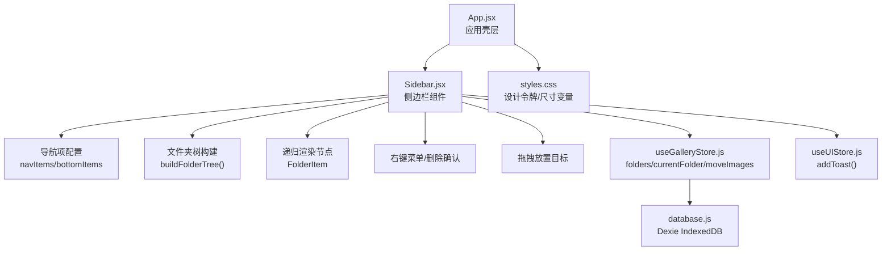
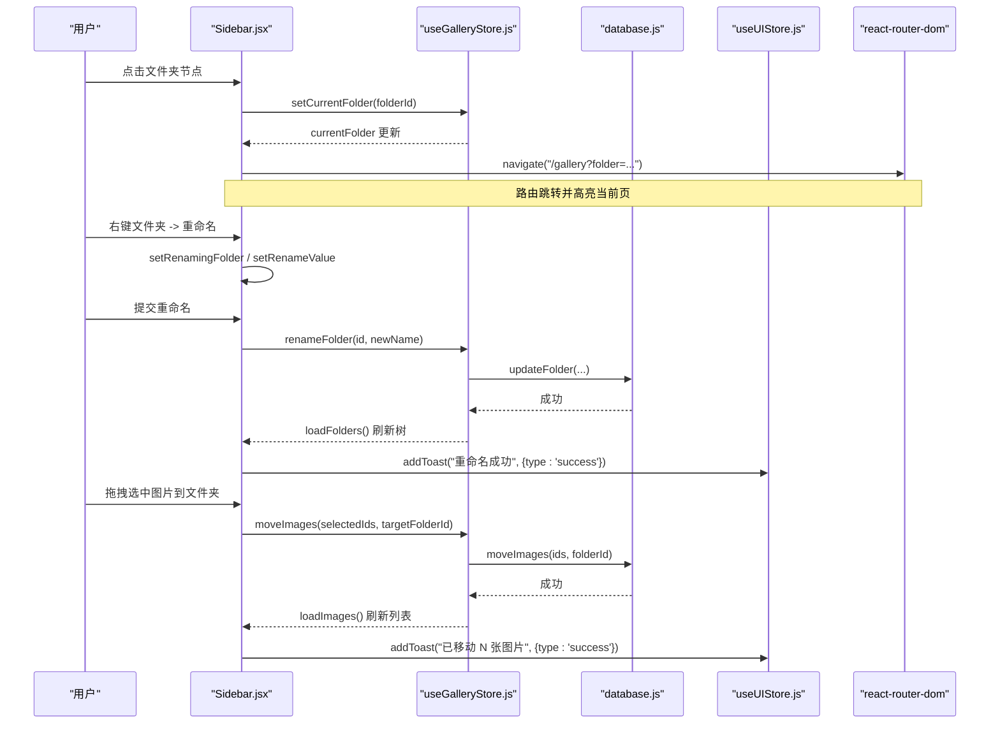
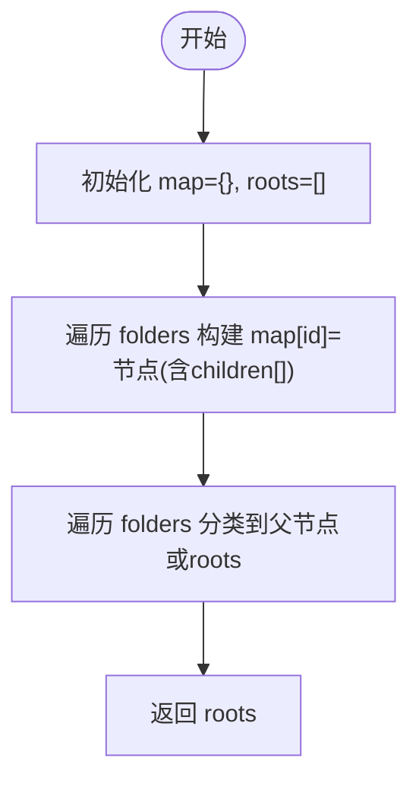
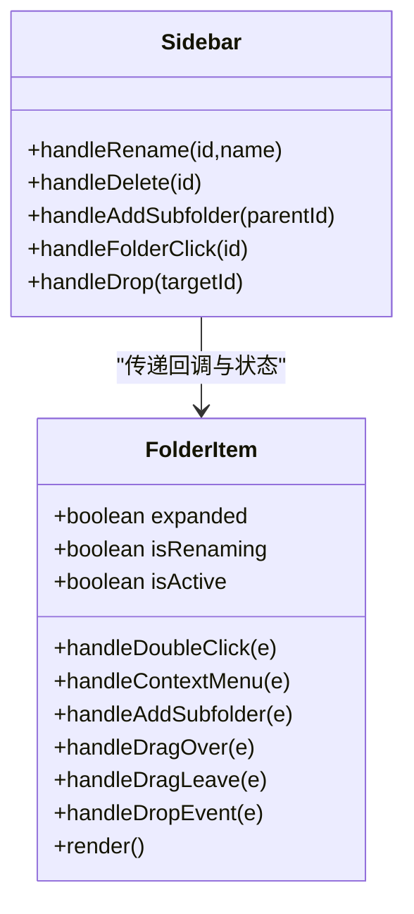
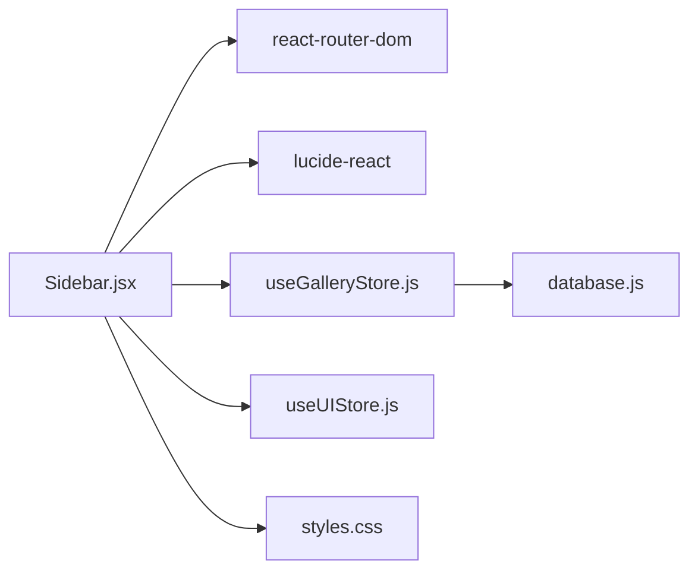

# 侧边栏组件 (Sidebar)

<cite>
**本文引用的文件**   
- [app/src/components/Sidebar.jsx](file://app/src/components/Sidebar.jsx)
- [app/src/stores/useGalleryStore.js](file://app/src/stores/useGalleryStore.js)
- [app/src/stores/useUIStore.js](file://app/src/stores/useUIStore.js)
- [app/src/db/database.js](file://app/src/db/database.js)
- [app/src/App.jsx](file://app/src/App.jsx)
- [app/src/styles.css](file://app/src/styles.css)
- [app/src/components/ui/Button.jsx](file://app/src/components/ui/Button.jsx)
</cite>

## 目录
1. [简介](#简介)
2. [项目结构](#项目结构)
3. [核心组件与职责](#核心组件与职责)
4. [架构总览](#架构总览)
5. [详细组件分析](#详细组件分析)
6. [依赖关系分析](#依赖关系分析)
7. [性能考量](#性能考量)
8. [故障排查指南](#故障排查指南)
9. [结论](#结论)
10. [附录：使用示例与最佳实践](#附录使用示例与最佳实践)

## 简介
本文件为 AI Image Studio 的侧边栏组件（Sidebar）提供系统化、可落地的技术文档。内容覆盖导航菜单、文件夹树形结构管理、拖拽移动图片、右键菜单、状态管理与 Zustand 集成、路由联动、响应式布局、交互事件处理、样式定制方案与性能优化策略，并附带使用示例与最佳实践。

## 项目结构
侧边栏位于应用壳层中，作为左侧固定宽度的导航面板，承载全局导航、文件夹树以及折叠控制等能力。其数据来源于 Gallery Store（Zustand），持久化由 IndexedDB 提供；主题与 UI 状态由 UI Store 统一管理。

图表来源
- [app/src/App.jsx:304-306](file://app/src/App.jsx#L304-L306)
- [app/src/components/Sidebar.jsx:11-25](file://app/src/components/Sidebar.jsx#L11-L25)
- [app/src/components/Sidebar.jsx:27-42](file://app/src/components/Sidebar.jsx#L27-L42)
- [app/src/components/Sidebar.jsx:44-130](file://app/src/components/Sidebar.jsx#L44-L130)
- [app/src/components/Sidebar.jsx:154-186](file://app/src/components/Sidebar.jsx#L154-L186)
- [app/src/stores/useGalleryStore.js:11-26](file://app/src/stores/useGalleryStore.js#L11-L26)
- [app/src/stores/useGalleryStore.js:64-72](file://app/src/stores/useGalleryStore.js#L64-L72)
- [app/src/stores/useGalleryStore.js:101-108](file://app/src/stores/useGalleryStore.js#L101-L108)
- [app/src/stores/useUIStore.js:80-103](file://app/src/stores/useUIStore.js#L80-L103)
- [app/src/db/database.js:196-229](file://app/src/db/database.js#L196-L229)
- [app/src/styles.css:137-147](file://app/src/styles.css#L137-L147)

章节来源
- [app/src/App.jsx:297-327](file://app/src/App.jsx#L297-L327)
- [app/src/components/Sidebar.jsx:154-186](file://app/src/components/Sidebar.jsx#L154-L186)
- [app/src/styles.css:137-147](file://app/src/styles.css#L137-L147)

## 核心组件与职责
- Sidebar（主容器）
  - 负责整体布局、折叠态、导航区、文件夹树区域、底部工具入口、上下文菜单与删除确认弹窗。
  - 通过 useGalleryStore 订阅 folders、currentFolder、selectedImages 等状态，调用 createFolder/renameFolder/deleteFolder/moveImages/loadFolders 等方法。
  - 通过 useUIStore.addToast 反馈操作结果。
  - 使用 react-router-dom 的 Link/useLocation/useNavigate 完成导航与高亮匹配。
- FolderItem（递归节点）
  - 负责单个文件夹节点的展开/收起、重命名输入、双击进入编辑、右键菜单触发、子文件夹添加入口、拖拽放置高亮与 drop 回调。
  - 通过 depth 控制缩进，递归渲染 children。
- buildFolderTree（树构建算法）
  - 将扁平的 folder 列表转换为父子关系的树结构，返回根节点数组。
- NavItem（导航项）
  - 根据 collapsed 状态决定文本显示与对齐方式，支持 tooltip 提示。
- 上下文菜单与删除确认
  - 右键菜单定位到鼠标坐标，支持“重命名”和“删除”。
  - 删除前弹出确认框，确认后执行删除逻辑。

章节来源
- [app/src/components/Sidebar.jsx:11-25](file://app/src/components/Sidebar.jsx#L11-L25)
- [app/src/components/Sidebar.jsx:27-42](file://app/src/components/Sidebar.jsx#L27-L42)
- [app/src/components/Sidebar.jsx:44-130](file://app/src/components/Sidebar.jsx#L44-L130)
- [app/src/components/Sidebar.jsx:132-152](file://app/src/components/Sidebar.jsx#L132-L152)
- [app/src/components/Sidebar.jsx:335-367](file://app/src/components/Sidebar.jsx#L335-L367)

## 架构总览
侧边栏在应用启动时挂载于 App 壳层内，通过 HashRouter 进行页面路由切换。文件夹树的数据来自 useGalleryStore，后者从 IndexedDB 读取并缓存。用户交互（创建/重命名/删除/拖拽移动）均通过 store actions 写入数据库，再刷新本地状态。

图表来源
- [app/src/components/Sidebar.jsx:231-244](file://app/src/components/Sidebar.jsx#L231-L244)
- [app/src/stores/useGalleryStore.js:148-152](file://app/src/stores/useGalleryStore.js#L148-L152)
- [app/src/stores/useGalleryStore.js:101-108](file://app/src/stores/useGalleryStore.js#L101-L108)
- [app/src/db/database.js:122-127](file://app/src/db/database.js#L122-L127)
- [app/src/stores/useUIStore.js:80-103](file://app/src/stores/useUIStore.js#L80-L103)
- [app/src/components/Sidebar.jsx:208-216](file://app/src/components/Sidebar.jsx#L208-L216)

## 详细组件分析

### 导航菜单与路由高亮
- 顶部导航项 navItems 与底部 bottomItems 分别定义主要功能入口与辅助入口。
- isActive 函数根据 location.pathname 与 search 精确匹配，支持 exact 标志与带查询参数的路径。
- 折叠状态下仅显示图标，非折叠显示图标+文字，hover 与 active 态通过 CSS 变量统一控制。

章节来源
- [app/src/components/Sidebar.jsx:11-25](file://app/src/components/Sidebar.jsx#L11-L25)
- [app/src/components/Sidebar.jsx:187-193](file://app/src/components/Sidebar.jsx#L187-L193)
- [app/src/components/Sidebar.jsx:132-152](file://app/src/components/Sidebar.jsx#L132-L152)

### 文件夹树构建算法
- 输入：扁平的 folders 数组（包含 id、parentId、name 等）。
- 过程：
  - 建立 id -> 节点映射 map。
  - 遍历 folders，将每个元素放入 map，并初始化 children 为空数组。
  - 再次遍历 folders，若存在 parentId 且对应父节点在 map 中，则将其加入父节点的 children；否则视为根节点。
- 输出：根节点数组 roots。
- 复杂度：时间 O(n)，空间 O(n)。

图表来源
- [app/src/components/Sidebar.jsx:27-42](file://app/src/components/Sidebar.jsx#L27-L42)

章节来源
- [app/src/components/Sidebar.jsx:27-42](file://app/src/components/Sidebar.jsx#L27-L42)

### 递归渲染与交互（FolderItem）
- 展开/收起：有子节点时点击切换 expanded 状态。
- 重命名：双击进入编辑模式，Enter 提交，Escape 取消；失焦自动提交。
- 右键菜单：阻止默认行为与冒泡，记录 x/y 坐标与目标文件夹信息。
- 添加子文件夹：悬停显示 + 按钮，点击后在当前层级插入输入框。
- 拖拽放置：onDragOver/onDragLeave/onDrop 控制高亮与回调。
- 递归渲染：当 expanded 且有 children 时，递归渲染子节点，depth 递增以控制缩进。

图表来源
- [app/src/components/Sidebar.jsx:44-130](file://app/src/components/Sidebar.jsx#L44-L130)
- [app/src/components/Sidebar.jsx:208-244](file://app/src/components/Sidebar.jsx#L208-L244)

章节来源
- [app/src/components/Sidebar.jsx:44-130](file://app/src/components/Sidebar.jsx#L44-L130)

### 右键菜单与删除确认
- 右键菜单：固定定位到鼠标位置，包含“重命名”和“删除”两个选项。
- 删除确认：遮罩层居中对话框，二次确认后才执行删除。
- 关闭策略：点击文档任意处关闭菜单；点击遮罩关闭确认框。

章节来源
- [app/src/components/Sidebar.jsx:335-367](file://app/src/components/Sidebar.jsx#L335-L367)
- [app/src/components/Sidebar.jsx:185](file://app/src/components/Sidebar.jsx#L185)

### 拖拽移动图片
- 数据来源：从 useGalleryStore.getState().selectedImages 获取当前选中的图片 ID 集合。
- 目标：drop 到某个文件夹节点时，调用 moveImages(selectedImages, folderId)。
- 反馈：成功后 toast 提示移动数量；失败则错误提示。

章节来源
- [app/src/components/Sidebar.jsx:236-244](file://app/src/components/Sidebar.jsx#L236-L244)
- [app/src/stores/useGalleryStore.js:101-108](file://app/src/stores/useGalleryStore.js#L101-L108)
- [app/src/db/database.js:122-127](file://app/src/db/database.js#L122-L127)

### 状态管理与 Zustand 集成
- useGalleryStore
  - 关键状态：folders、currentFolder、selectedImages。
  - 关键方法：loadFolders、createFolder、renameFolder、deleteFolder、setCurrentFolder、moveImages。
  - 副作用：修改后调用 loadFolders/loadImages 刷新视图。
- useUIStore
  - 关键方法：addToast(message, opts) 用于操作反馈。
- 与数据库交互
  - database.js 基于 Dexie 封装了 folders/images 的增删改查与批量操作。

章节来源
- [app/src/stores/useGalleryStore.js:11-26](file://app/src/stores/useGalleryStore.js#L11-L26)
- [app/src/stores/useGalleryStore.js:64-72](file://app/src/stores/useGalleryStore.js#L64-L72)
- [app/src/stores/useGalleryStore.js:125-146](file://app/src/stores/useGalleryStore.js#L125-L146)
- [app/src/stores/useUIStore.js:80-103](file://app/src/stores/useUIStore.js#L80-L103)
- [app/src/db/database.js:196-229](file://app/src/db/database.js#L196-L229)

### 路由导航逻辑
- 点击文件夹：调用 setCurrentFolder 更新当前文件夹，并通过 navigate 跳转到 /gallery?folder=xxx。
- 导航高亮：isActive 对 exact 与带 query 的路径进行匹配。

章节来源
- [app/src/components/Sidebar.jsx:231-234](file://app/src/components/Sidebar.jsx#L231-L234)
- [app/src/components/Sidebar.jsx:187-193](file://app/src/components/Sidebar.jsx#L187-L193)

### 响应式设计
- 宽度变量：--sidebar-width 与 --sidebar-collapsed 控制展开与收起宽度。
- 过渡动画：width/min-width 使用 transition-base 平滑过渡。
- 折叠态：隐藏文本，仅保留图标与必要控件。

章节来源
- [app/src/styles.css:137-147](file://app/src/styles.css#L137-L147)
- [app/src/components/Sidebar.jsx:247-253](file://app/src/components/Sidebar.jsx#L247-L253)

## 依赖关系分析
- 组件内部依赖
  - React：useState/useRef/useEffect、React.Fragment。
  - react-router-dom：Link/useLocation/useNavigate。
  - lucide-react：图标库。
- 状态与数据
  - useGalleryStore：文件夹与图片相关状态与操作。
  - useUIStore：通知与全局 UI 状态。
  - database.js：IndexedDB 持久化。
- 样式
  - styles.css：设计令牌、组件基础样式、侧边栏尺寸变量。
  - Button.jsx：通用按钮组件（侧边栏未直接引用，但可作为扩展点）。

图表来源
- [app/src/components/Sidebar.jsx:1-9](file://app/src/components/Sidebar.jsx#L1-L9)
- [app/src/stores/useGalleryStore.js:1-10](file://app/src/stores/useGalleryStore.js#L1-L10)
- [app/src/stores/useUIStore.js:1-11](file://app/src/stores/useUIStore.js#L1-L11)
- [app/src/db/database.js:14-31](file://app/src/db/database.js#L14-L31)
- [app/src/styles.css:137-147](file://app/src/styles.css#L137-L147)

章节来源
- [app/src/components/Sidebar.jsx:1-9](file://app/src/components/Sidebar.jsx#L1-L9)
- [app/src/stores/useGalleryStore.js:1-10](file://app/src/stores/useGalleryStore.js#L1-L10)
- [app/src/stores/useUIStore.js:1-11](file://app/src/stores/useUIStore.js#L1-L11)
- [app/src/db/database.js:14-31](file://app/src/db/database.js#L14-L31)

## 性能考量
- 树构建复杂度：O(n) 线性时间与空间，适合中等规模文件夹结构。
- 递归渲染：仅在 expanded 时渲染子树，避免全量渲染深层级节点。
- 事件冒泡控制：多处 e.stopPropagation() 防止误触父级事件，减少不必要的重渲染。
- 样式与过渡：使用 CSS 变量与 transition 提升交互流畅度。
- 建议优化方向
  - 大数据集懒加载：按需加载子节点（如点击展开后再请求子目录）。
  - 虚拟滚动：当单级节点过多时考虑虚拟化列表。
  - 选择态优化：将 selectedImages 的变更合并批处理，减少多次 moveImages 调用。
  - 树节点 memoization：对 FolderItem 使用 React.memo 并结合稳定 key 与 props 引用，降低重复渲染。

[本节为通用性能建议，不直接分析具体代码行]

## 故障排查指南
- 右键菜单无法关闭
  - 检查是否在 document 上注册了 click 监听器来关闭菜单，并确保清理函数正确移除监听。
- 重命名输入框未聚焦或未自动选择文本
  - 确认 isRenaming 变化时的 useEffect 是否执行，ref 是否正确绑定。
- 拖拽无响应
  - 确保 onDragOver 调用了 preventDefault，且 onDrop 能正确触发回调。
- 删除后图片仍显示在旧文件夹
  - 检查 deleteFolder 是否清空 currentFolder 并重新加载 images。
- Toast 未显示
  - 确认 addToast 被调用且 duration > 0，UIStore 的 toasts 状态是否被渲染。

章节来源
- [app/src/components/Sidebar.jsx:185](file://app/src/components/Sidebar.jsx#L185)
- [app/src/components/Sidebar.jsx:51-53](file://app/src/components/Sidebar.jsx#L51-L53)
- [app/src/components/Sidebar.jsx:67-69](file://app/src/components/Sidebar.jsx#L67-L69)
- [app/src/stores/useGalleryStore.js:138-146](file://app/src/stores/useGalleryStore.js#L138-L146)
- [app/src/stores/useUIStore.js:80-103](file://app/src/stores/useUIStore.js#L80-L103)

## 结论
Sidebar 组件以清晰的职责划分与良好的状态管理实现了完整的侧边导航与文件夹管理能力。通过 Zustand 与 IndexedDB 的结合，保证了数据的持久化与实时同步；通过 CSS 变量与过渡动画提升了用户体验。建议在大规模数据场景下引入懒加载与虚拟化进一步优化性能。

[本节为总结性内容，不直接分析具体代码行]

## 附录：使用示例与最佳实践

### 基本用法
- 在应用壳层中引入并渲染 Sidebar，配合 HashRouter 与 Routes 实现页面切换。
- 通过 useGalleryStore 提供的 actions 与 Sidebar 交互，无需手动维护文件夹状态。

章节来源
- [app/src/App.jsx:304-306](file://app/src/App.jsx#L304-L306)
- [app/src/stores/useGalleryStore.js:125-146](file://app/src/stores/useGalleryStore.js#L125-L146)

### Props 接口设计（概念说明）
- 由于 Sidebar 是独立模块，内部通过 store 订阅状态，并未暴露复杂 props。若需复用，可考虑抽取以下可配置项：
  - collapsed: boolean（外部控制折叠态）
  - onToggleCollapse: () => void（折叠切换回调）
  - renderNavItems?: Array（自定义导航项）
  - renderBottomItems?: Array（自定义底部项）
  - className/style: 样式覆盖

[本节为概念性接口设计，不直接分析具体代码行]

### 样式定制方案
- 使用 CSS 变量调整侧边栏宽度、颜色、圆角、阴影等。
- 通过 data-theme 切换明暗主题，侧边栏样式随主题变量自动适配。

章节来源
- [app/src/styles.css:137-147](file://app/src/styles.css#L137-L147)
- [app/src/styles.css:149-172](file://app/src/styles.css#L149-L172)

### 最佳实践
- 事件冒泡控制：在嵌套交互（如文件夹项内的按钮）中使用 stopPropagation 避免上层误触发。
- 异步操作反馈：所有写操作后使用 addToast 告知用户成功或失败。
- 路由与状态一致性：切换文件夹时同时更新 currentFolder 与 URL 查询参数，保证浏览器前进后退一致。
- 可访问性：为交互元素提供 aria-label 与键盘支持（Enter/Escape）。

章节来源
- [app/src/components/Sidebar.jsx:63-65](file://app/src/components/Sidebar.jsx#L63-L65)
- [app/src/stores/useUIStore.js:80-103](file://app/src/stores/useUIStore.js#L80-L103)
- [app/src/components/Sidebar.jsx:231-234](file://app/src/components/Sidebar.jsx#L231-L234)