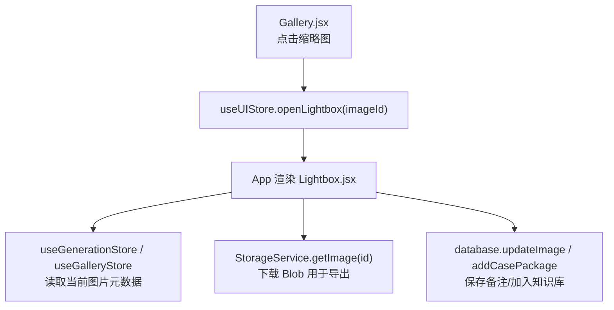
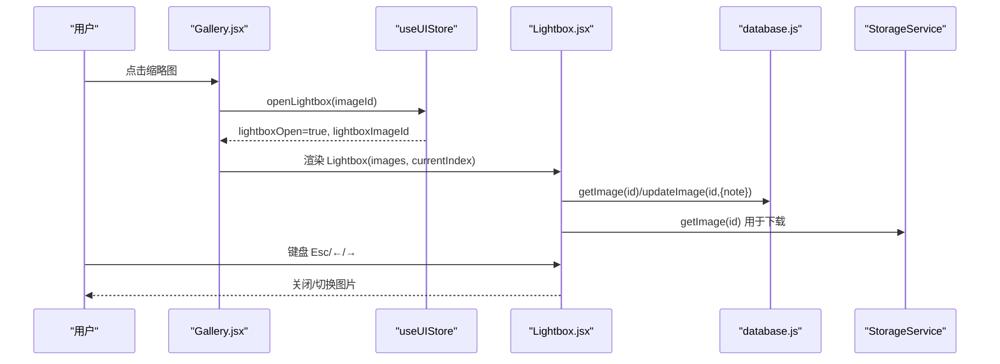
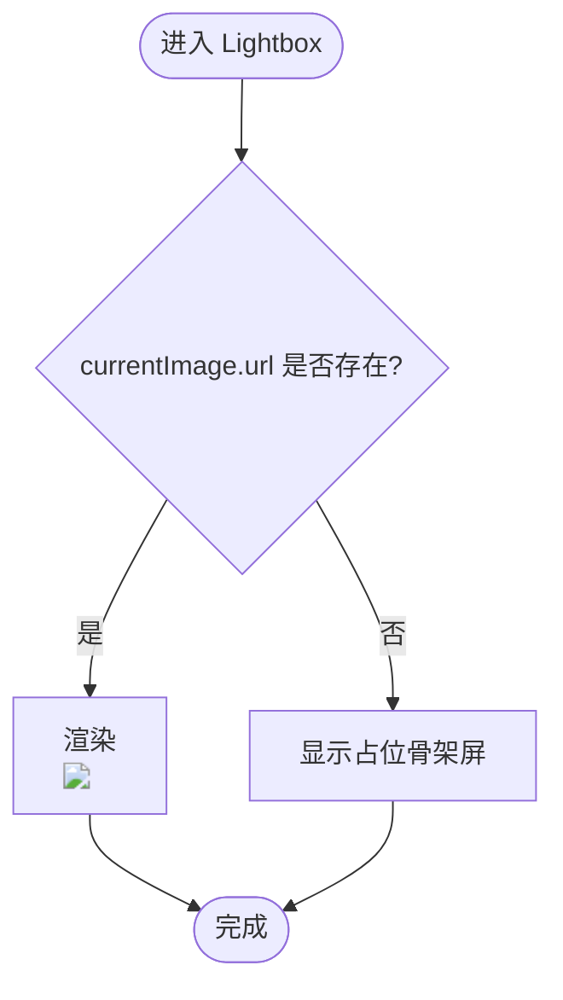
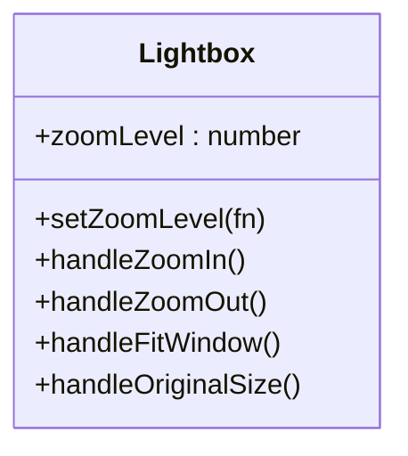
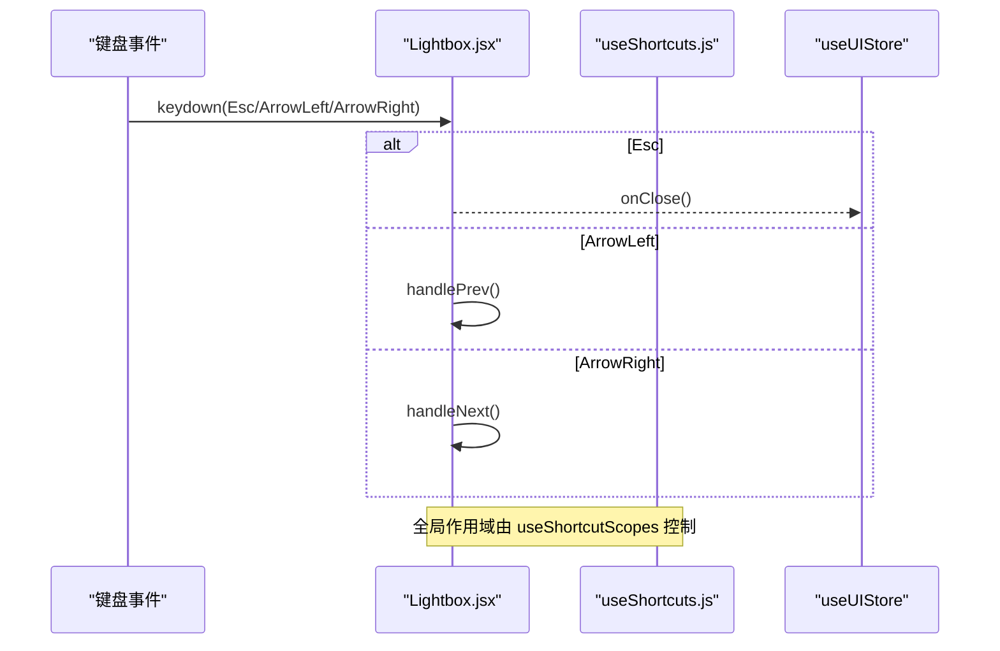
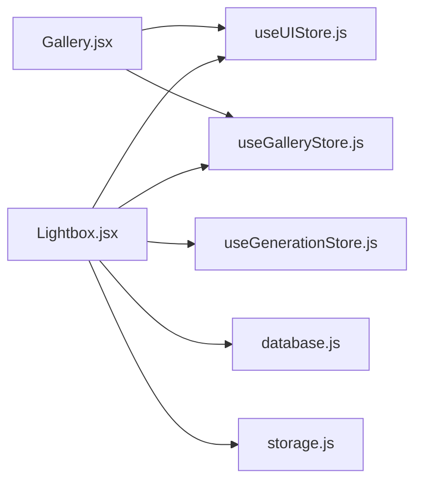

# 图片查看器组件 (Lightbox)

<cite>
**本文引用的文件**   
- [Lightbox.jsx](file://app/src/components/Lightbox.jsx)
- [useUIStore.js](file://app/src/stores/useUIStore.js)
- [useGalleryStore.js](file://app/src/stores/useGalleryStore.js)
- [useShortcuts.js](file://app/src/hooks/useShortcuts.js)
- [Gallery.jsx](file://app/src/pages/Gallery.jsx)
- [database.js](file://app/src/db/database.js)
- [storage.js](file://app/src/services/storage.js)
- [styles.css](file://app/src/styles.css)
</cite>

## 目录
1. [简介](#简介)
2. [项目结构](#项目结构)
3. [核心组件](#核心组件)
4. [架构总览](#架构总览)
5. [详细组件分析](#详细组件分析)
6. [依赖关系分析](#依赖关系分析)
7. [性能与内存管理](#性能与内存管理)
8. [故障排查指南](#故障排查指南)
9. [结论](#结论)
10. [附录：使用示例与配置](#附录使用示例与配置)

## 简介
本文件为 AI Image Studio 的图片查看器（Lightbox）组件提供系统化、可落地的技术文档。内容覆盖全屏展示、缩放控制、键盘导航、事件处理、状态管理、与其他模块的通信模式，以及图片加载策略、内存管理与性能优化建议。同时给出使用示例、自定义选项与兼容性说明，帮助开发者快速集成并扩展该组件。

## 项目结构
Lightbox 位于组件层，通过全局 UI Store 打开/关闭，从图库页触发，读取数据库记录并通过存储服务获取图片资源。整体调用链如下：

图表来源
- [Gallery.jsx:430-460](file://app/src/pages/Gallery.jsx#L430-L460)
- [useUIStore.js:45-53](file://app/src/stores/useUIStore.js#L45-L53)
- [Lightbox.jsx:13-29](file://app/src/components/Lightbox.jsx#L13-L29)
- [storage.js:87-97](file://app/src/services/storage.js#L87-L97)
- [database.js:84-86](file://app/src/db/database.js#L84-L86)

章节来源
- [Gallery.jsx:430-460](file://app/src/pages/Gallery.jsx#L430-L460)
- [useUIStore.js:45-53](file://app/src/stores/useUIStore.js#L45-L53)
- [Lightbox.jsx:13-29](file://app/src/components/Lightbox.jsx#L13-L29)

## 核心组件
Lightbox 是一个全屏图片查看器，具备以下能力：
- 全屏遮罩与居中展示
- 左右切换上一张/下一张
- 缩放控制（放大、缩小、适应窗口、原始大小）
- 键盘导航（Esc 关闭、左右箭头切换）
- 右侧信息面板（提示词、模型、参数、用户备注）
- 操作按钮（收藏、淘汰、重新生成、设为参考、局部重绘、移动到文件夹、加入知识库、下载）
- 与全局快捷键系统联动

章节来源
- [Lightbox.jsx:13-182](file://app/src/components/Lightbox.jsx#L13-L182)
- [useShortcuts.js:94-110](file://app/src/hooks/useShortcuts.js#L94-L110)

## 架构总览
下图展示了 Lightbox 在应用中的位置及关键交互路径：

图表来源
- [Gallery.jsx:430-460](file://app/src/pages/Gallery.jsx#L430-L460)
- [useUIStore.js:45-53](file://app/src/stores/useUIStore.js#L45-L53)
- [Lightbox.jsx:167-180](file://app/src/components/Lightbox.jsx#L167-L180)
- [database.js:79-86](file://app/src/db/database.js#L79-L86)
- [storage.js:87-97](file://app/src/services/storage.js#L87-L97)

## 详细组件分析

### 组件职责与接口
- 输入属性
  - isOpen: 是否显示
  - onClose: 关闭回调
  - images: 当前列表（由上层传入）
  - currentIndex: 当前索引
- 内部状态
  - currentImageIndex: 当前图片索引
  - zoomLevel: 缩放级别
  - note: 用户备注（本地编辑后持久化）
  - copied: 复制反馈状态
  - showFolderPicker: 移动文件夹选择弹窗
- 外部依赖
  - useGenerationStore: 收藏、淘汰、重新生成、添加参考图
  - useUIStore: Toast 通知、打开蒙版编辑器
  - useGalleryStore: 文件夹列表
  - database.js: 更新备注、加入知识库
  - StorageService: 下载图片 Blob

章节来源
- [Lightbox.jsx:13-29](file://app/src/components/Lightbox.jsx#L13-L29)
- [Lightbox.jsx:19-25](file://app/src/components/Lightbox.jsx#L19-L25)

### 图片加载与预览策略
- 数据来源
  - 优先使用 currentImage.url；若为空则显示占位骨架屏。
- 下载流程
  - 通过 StorageService.getImage(id) 获取 Blob，再创建 Object URL 触发浏览器下载。
- 冷/热区适配
  - 当 storageZone 为 cold 且存在 ossUrl 时，局部重绘直接走 OSS URL；普通预览仍以上层传入的 url/blobUrl 为主。

图表来源
- [Lightbox.jsx:294-304](file://app/src/components/Lightbox.jsx#L294-L304)
- [storage.js:87-97](file://app/src/services/storage.js#L87-L97)

章节来源
- [Lightbox.jsx:294-304](file://app/src/components/Lightbox.jsx#L294-L304)
- [storage.js:87-97](file://app/src/services/storage.js#L87-L97)

### 缩放控制与动画过渡
- 缩放范围
  - 最小 0.25，最大 3.0，步进 0.25
- 显示百分比
  - Math.round(zoomLevel * 100)
- 过渡效果
  - 容器 transform: scale(zoomLevel)，配合 CSS transition 实现平滑缩放

图表来源
- [Lightbox.jsx:184-185](file://app/src/components/Lightbox.jsx#L184-L185)
- [Lightbox.jsx:622-696](file://app/src/components/Lightbox.jsx#L622-L696)

章节来源
- [Lightbox.jsx:184-185](file://app/src/components/Lightbox.jsx#L184-L185)
- [Lightbox.jsx:622-696](file://app/src/components/Lightbox.jsx#L622-L696)

### 旋转操作
- 现状
  - 当前未实现旋转功能。
- 建议方案
  - 新增 rotateAngle 状态，结合 transform: rotate(...) 与 transition 实现平滑旋转。
  - 增加旋转按钮与键盘快捷键（如 R）。
  - 注意与缩放叠加时的 transform 组合顺序。

[本节为概念性建议，不直接分析具体代码]

### 键盘导航与全局快捷键
- 组件内监听
  - Esc 关闭；左/右箭头切换图片
- 全局快捷键
  - useShortcuts 中定义 Lightbox 相关快捷键，并在不同作用域下启用/禁用

图表来源
- [Lightbox.jsx:167-180](file://app/src/components/Lightbox.jsx#L167-L180)
- [useShortcuts.js:94-110](file://app/src/hooks/useShortcuts.js#L94-L110)
- [useShortcuts.js:116-134](file://app/src/hooks/useShortcuts.js#L116-L134)

章节来源
- [Lightbox.jsx:167-180](file://app/src/components/Lightbox.jsx#L167-L180)
- [useShortcuts.js:94-110](file://app/src/hooks/useShortcuts.js#L94-L110)
- [useShortcuts.js:116-134](file://app/src/hooks/useShortcuts.js#L116-L134)

### 触摸手势
- 现状
  - 当前未实现触摸滑动切换与捏合缩放。
- 建议方案
  - 引入 react-use-gesture 或自研 PointerEvent 处理：
    - onPointerDown/onPointerMove/onPointerUp 计算位移阈值判断“滑动手势”
    - 捏合缩放通过两个指针距离变化驱动 zoomLevel
  - 移动端布局适配：隐藏右侧面板或改为底部抽屉式

[本节为概念性建议，不直接分析具体代码]

### 事件处理机制与副作用
- 复制 Prompt
  - navigator.clipboard.writeText，成功后显示 Toast 并重置图标
- 下载图片
  - 通过 StorageService.getImage(id) 获取 Blob，创建 Object URL 触发 a.download
- 收藏/淘汰/重新生成/设为参考
  - 调用 useGenerationStore 对应 action
- 局部重绘
  - 根据 storageZone 决定使用 OSS URL 或本地 blobUrl，调用 openMaskEditor
- 移动到文件夹
  - 弹出文件夹选择，确认后 updateImage(folderId)
- 加入知识库
  - 构造 case package 并写入数据库

章节来源
- [Lightbox.jsx:50-165](file://app/src/components/Lightbox.jsx#L50-L165)

### 状态管理与跨组件通信
- 打开/关闭
  - Gallery 调用 useUIStore.openLightbox(imageId)
  - Lightbox 接收 isOpen 与 onClose
- 图片数据
  - 上层传入 images 与 currentIndex，组件内部维护 currentImageIndex
- 备注持久化
  - 切换图片时异步读取数据库备注；修改后调用 updateImage 保存
- 通知
  - 统一通过 useUIStore.addToast 反馈操作结果

章节来源
- [useUIStore.js:45-53](file://app/src/stores/useUIStore.js#L45-L53)
- [Lightbox.jsx:31-40](file://app/src/components/Lightbox.jsx#L31-L40)
- [Lightbox.jsx:94-99](file://app/src/components/Lightbox.jsx#L94-L99)

### 响应式与视觉设计
- 遮罩层级
  - z-index 变量 --z-lightbox 确保浮层在最上层
- 占位骨架屏
  - .ph-img 类提供渐变骨架样式
- 过渡与动效
  - 使用 CSS 变量定义的 transition-* 实现平滑缩放与交互反馈

章节来源
- [styles.css:143](file://app/src/styles.css#L143)
- [styles.css:633-640](file://app/src/styles.css#L633-L640)
- [Lightbox.jsx:186-196](file://app/src/components/Lightbox.jsx#L186-L196)

## 依赖关系分析

图表来源
- [Lightbox.jsx:7-11](file://app/src/components/Lightbox.jsx#L7-L11)
- [Gallery.jsx:9-11](file://app/src/pages/Gallery.jsx#L9-L11)

章节来源
- [Lightbox.jsx:7-11](file://app/src/components/Lightbox.jsx#L7-L11)
- [Gallery.jsx:9-11](file://app/src/pages/Gallery.jsx#L9-L11)

## 性能与内存管理
- 图片加载
  - 直接使用 url 渲染，避免额外解码开销；下载时使用 Blob + Object URL，完成后及时 revokeObjectURL
- 内存释放
  - 删除图片时 StorageService 会撤销 blobUrl/thumbnailUrl，防止内存泄漏
- 冷/热区迁移
  - 热区容量超限时自动将旧图迁移到 OSS，减少 IndexedDB 占用
- 缩略图
  - 存储层生成固定尺寸缩略图，提升列表加载速度
- 建议优化
  - 对大图进行懒加载与按需解码
  - 在移动端限制最大缩放比例，降低 GPU 压力
  - 对频繁操作的函数使用 useCallback/useMemo 缓存（组件已部分采用）

章节来源
- [storage.js:120-128](file://app/src/services/storage.js#L120-L128)
- [storage.js:252-298](file://app/src/services/storage.js#L252-L298)
- [storage.js:323-347](file://app/src/services/storage.js#L323-L347)
- [Lightbox.jsx:59-69](file://app/src/components/Lightbox.jsx#L59-L69)

## 故障排查指南
- 无法下载图片
  - 检查 StorageService.getImage 返回是否为空；确认 hot zone 是否有 blobUrl
- 打开局部重绘失败
  - 若图片在冷区且无 ossUrl，需先拉取或上传至 OSS；检查 openMaskEditor 是否正确传入 URL
- 备注未保存
  - 确认 updateImage 调用成功；检查 IndexedDB 表 images 字段是否包含 note
- 快捷键无效
  - 检查 useShortcutScopes 是否正确启用 lightbox 作用域；确认页面路由不在其他高优先级作用域

章节来源
- [storage.js:87-97](file://app/src/services/storage.js#L87-L97)
- [Lightbox.jsx:102-120](file://app/src/components/Lightbox.jsx#L102-L120)
- [Lightbox.jsx:94-99](file://app/src/components/Lightbox.jsx#L94-L99)
- [useShortcuts.js:116-134](file://app/src/hooks/useShortcuts.js#L116-L134)

## 结论
Lightbox 提供了完整的全屏图片查看体验，涵盖缩放、导航、操作与持久化等核心能力。其架构清晰，依赖明确，易于扩展。建议在后续版本中加入旋转、触摸手势与更完善的移动端适配，以进一步提升用户体验。

## 附录：使用示例与配置

### 基本用法
- 在图库页点击缩略图时调用 openLightbox(imageId)
- 在 App 根节点根据 useUIStore.lightboxOpen 决定是否渲染 Lightbox
- 向 Lightbox 传入 images 与 currentIndex，内部负责切换与展示

章节来源
- [Gallery.jsx:430-460](file://app/src/pages/Gallery.jsx#L430-L460)
- [useUIStore.js:45-53](file://app/src/stores/useUIStore.js#L45-L53)
- [Lightbox.jsx:13-29](file://app/src/components/Lightbox.jsx#L13-L29)

### 自定义配置项
- 缩放步长与范围
  - 可通过调整 setZoomLevel 的边界值与步进来定制
- 键盘快捷键
  - 在 useShortcuts.js 中扩展 Lightbox 作用域的快捷键映射
- 主题与样式
  - 基于 CSS 变量 --z-lightbox、--transition-* 等进行主题化

章节来源
- [Lightbox.jsx:622-696](file://app/src/components/Lightbox.jsx#L622-L696)
- [useShortcuts.js:139-184](file://app/src/hooks/useShortcuts.js#L139-L184)
- [styles.css:132-147](file://app/src/styles.css#L132-L147)

### 兼容性说明
- 现代浏览器均支持 Clipboard API、Blob、Object URL、Canvas 等特性
- 对于不支持 Clipboard API 的环境，应降级提示用户手动复制
- 移动端建议使用触摸库增强交互体验

[本节为通用兼容性建议，不直接分析具体代码]