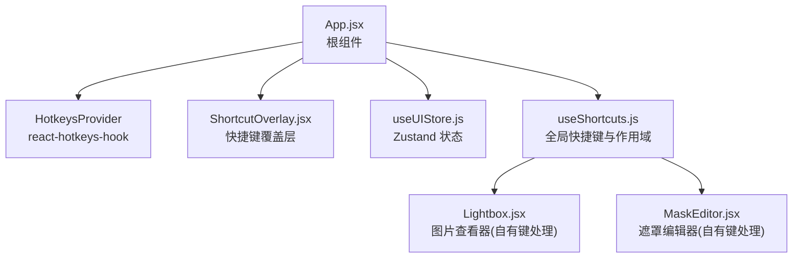
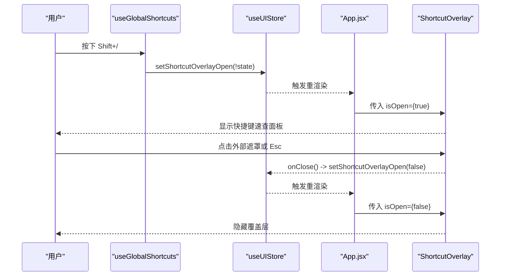
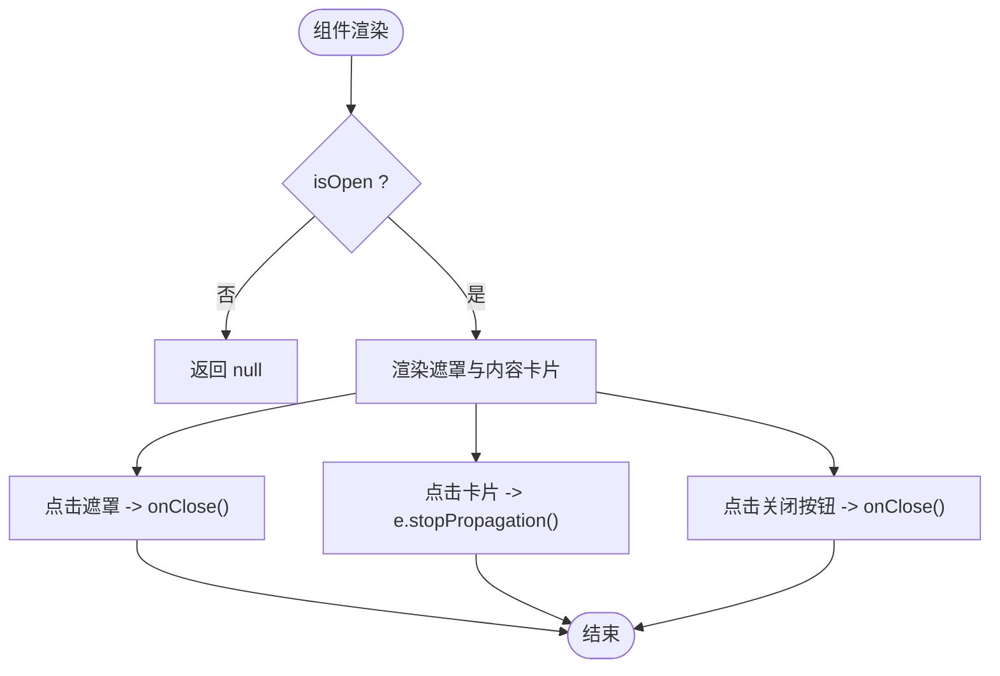
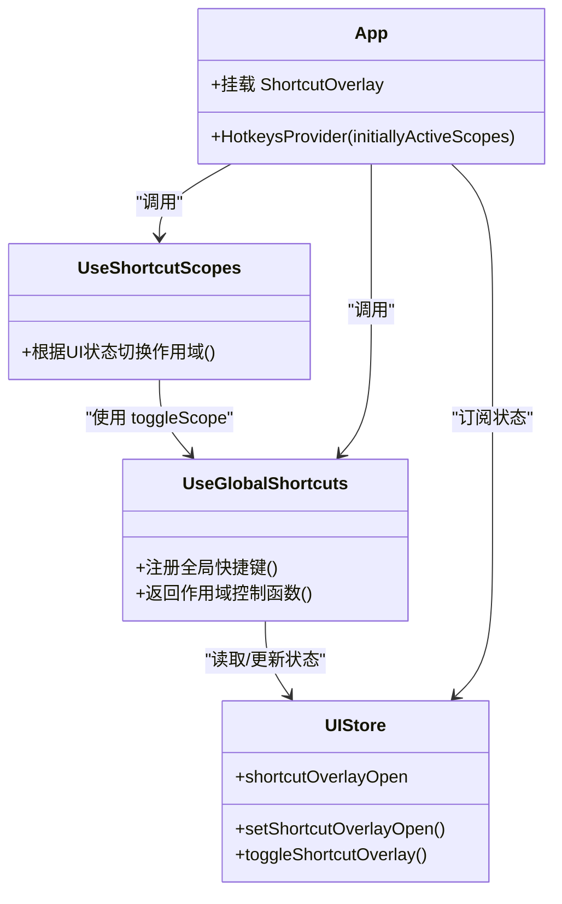
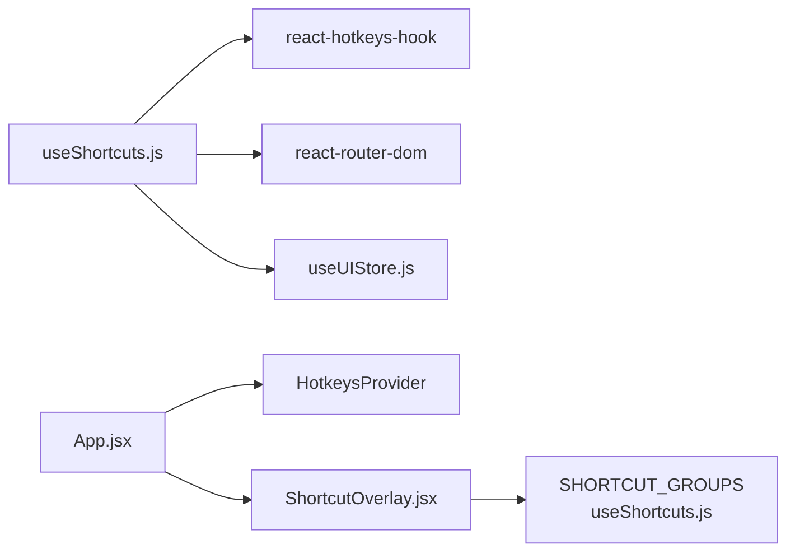

# 快捷键覆盖层组件 (ShortcutOverlay)

<cite>
**本文引用的文件**   
- [app/src/components/ShortcutOverlay.jsx](file://app/src/components/ShortcutOverlay.jsx)
- [app/src/hooks/useShortcuts.js](file://app/src/hooks/useShortcuts.js)
- [app/src/App.jsx](file://app/src/App.jsx)
- [app/src/stores/useUIStore.js](file://app/src/stores/useUIStore.js)
- [app/src/components/Lightbox.jsx](file://app/src/components/Lightbox.jsx)
- [app/src/components/MaskEditor.jsx](file://app/src/components/MaskEditor.jsx)
</cite>

## 目录
1. [简介](#简介)
2. [项目结构](#项目结构)
3. [核心组件与能力](#核心组件与能力)
4. [架构总览](#架构总览)
5. [详细组件分析](#详细组件分析)
6. [依赖关系分析](#依赖关系分析)
7. [性能与可访问性](#性能与可访问性)
8. [使用示例与扩展指南](#使用示例与扩展指南)
9. [故障排除](#故障排除)
10. [结论](#结论)

## 简介
本文件围绕 AI Image Studio 的“快捷键覆盖层”（ShortcutOverlay）进行系统化文档化，重点解析其功能实现、全局快捷键处理机制、按键组合识别、事件冒泡控制、浏览器兼容性、动态配置展示、用户自定义支持思路、持久化方案、生命周期管理、性能优化与可访问性支持。同时提供使用示例、扩展开发指南和常见问题排查方法，帮助开发者快速理解并安全扩展该子系统。

## 项目结构
快捷键系统由以下关键部分构成：
- 覆盖层 UI 组件：负责渲染快捷键速查面板，响应关闭交互
- 全局快捷键 Hook：集中注册全局与上下文相关的快捷键，维护作用域优先级
- 应用入口集成：在根组件中启用 HotkeysProvider 并挂载覆盖层
- 状态存储：通过 Zustand store 管理覆盖层开关等 UI 状态
- 其他上下文：Lightbox 与 MaskEditor 各自拥有独立键盘处理逻辑，并通过作用域与全局系统协作

图表来源
- [app/src/App.jsx:353-363](file://app/src/App.jsx#L353-L363)
- [app/src/components/ShortcutOverlay.jsx:1-136](file://app/src/components/ShortcutOverlay.jsx#L1-L136)
- [app/src/hooks/useShortcuts.js:1-184](file://app/src/hooks/useShortcuts.js#L1-L184)
- [app/src/stores/useUIStore.js:1-159](file://app/src/stores/useUIStore.js#L1-L159)
- [app/src/components/Lightbox.jsx:167-180](file://app/src/components/Lightbox.jsx#L167-L180)
- [app/src/components/MaskEditor.jsx:751-762](file://app/src/components/MaskEditor.jsx#L751-L762)

章节来源
- [app/src/App.jsx:353-363](file://app/src/App.jsx#L353-L363)
- [app/src/components/ShortcutOverlay.jsx:1-136](file://app/src/components/ShortcutOverlay.jsx#L1-L136)
- [app/src/hooks/useShortcuts.js:1-184](file://app/src/hooks/useShortcuts.js#L1-L184)
- [app/src/stores/useUIStore.js:1-159](file://app/src/stores/useUIStore.js#L1-L159)

## 核心组件与能力
- 快捷键覆盖层（ShortcutOverlay）
  - 全屏遮罩 + 居中卡片布局，展示分组后的快捷键列表
  - 点击遮罩或右上角按钮关闭；内部阻止事件冒泡避免误关
  - 从 useShortcuts 导入 SHORTCUT_GROUPS 常量，按组渲染标题与条目
- 全局快捷键 Hook（useGlobalShortcuts / useShortcutScopes）
  - 基于 react-hotkeys-hook v5 的作用域机制，实现 5 层优先级：mask-editor > lightbox > workbench > gallery > global
  - 注册全局导航（G 序列）、生成、扩写提示词、切换模型、打开/关闭覆盖层等
  - 根据路由与 UI 状态动态开启/关闭各作用域
- 应用集成（App.jsx）
  - 以 HotkeysProvider 包裹应用，初始激活 global 作用域
  - 在 AppInner 中调用 useGlobalShortcuts 与 useShortcutScopes，并挂载 ShortcutOverlay

章节来源
- [app/src/components/ShortcutOverlay.jsx:1-136](file://app/src/components/ShortcutOverlay.jsx#L1-L136)
- [app/src/hooks/useShortcuts.js:1-184](file://app/src/hooks/useShortcuts.js#L1-L184)
- [app/src/App.jsx:245-351](file://app/src/App.jsx#L245-L351)

## 架构总览
快捷键系统采用“声明式注册 + 作用域调度 + 状态驱动 UI”的架构：
- 声明式注册：在 Hook 中使用 useHotkeys 声明快捷键与回调
- 作用域调度：通过 toggleScope 动态启用/禁用不同作用域，形成优先级
- 状态驱动 UI：覆盖层的显示/隐藏由 Zustand store 中的 shortcutOverlayOpen 驱动

图表来源
- [app/src/hooks/useShortcuts.js:52-63](file://app/src/hooks/useShortcuts.js#L52-L63)
- [app/src/stores/useUIStore.js:147-157](file://app/src/stores/useUIStore.js#L147-L157)
- [app/src/App.jsx:333-337](file://app/src/App.jsx#L333-L337)
- [app/src/components/ShortcutOverlay.jsx:24-37](file://app/src/components/ShortcutOverlay.jsx#L24-L37)

## 详细组件分析

### 快捷键覆盖层组件（ShortcutOverlay）
- 职责
  - 作为全局参考面板，展示所有已注册的快捷键分组信息
  - 提供关闭交互（点击遮罩、Esc、关闭按钮）
- 数据源
  - 从 useShortcuts 导入 SHORTCUT_GROUPS，包含全局、工作台、Lightbox、Mask 编辑器的快捷键描述
- 交互细节
  - 外层容器 onClick 关闭；内层卡片 onClick 阻止冒泡，防止误关
  - 使用 CSS 变量统一主题样式，保持与设计系统一致
- 可访问性
  - 关闭按钮设置 aria-label，便于屏幕阅读器识别
  - 使用 kbd 标签呈现按键，语义清晰

图表来源
- [app/src/components/ShortcutOverlay.jsx:9-118](file://app/src/components/ShortcutOverlay.jsx#L9-L118)
- [app/src/hooks/useShortcuts.js:139-184](file://app/src/hooks/useShortcuts.js#L139-L184)

章节来源
- [app/src/components/ShortcutOverlay.jsx:1-136](file://app/src/components/ShortcutOverlay.jsx#L1-L136)
- [app/src/hooks/useShortcuts.js:139-184](file://app/src/hooks/useShortcuts.js#L139-L184)

### 全局快捷键与作用域管理（useGlobalShortcuts / useShortcutScopes）
- 作用域优先级
  - mask-editor（最高）> lightbox > workbench > gallery > global（始终可用）
- 全局快捷键
  - Shift+/：切换覆盖层显示
  - Esc：优先关闭覆盖层，其次关闭 Lightbox
  - G 序列导航：g>w 工作台、g>g 图库、g>k 知识库、g>t 任务中心
- 工作台快捷键
  - mod+enter：生成图片（防重复触发）
  - e：扩写提示词
  - 1/2/3：切换模型
- 作用域同步
  - 根据当前路由与 UI 状态（lightbox/maskEditor 是否打开）动态启用/禁用对应作用域
- 冲突检测与优先级
  - 通过 toggleScope 精确控制哪些作用域生效，从而避免冲突
  - 高优先级作用域（如 mask-editor）会屏蔽低优先级作用域的快捷键

图表来源
- [app/src/hooks/useShortcuts.js:22-134](file://app/src/hooks/useShortcuts.js#L22-L134)
- [app/src/stores/useUIStore.js:147-157](file://app/src/stores/useUIStore.js#L147-L157)
- [app/src/App.jsx:353-363](file://app/src/App.jsx#L353-L363)

章节来源
- [app/src/hooks/useShortcuts.js:1-184](file://app/src/hooks/useShortcuts.js#L1-L184)
- [app/src/stores/useUIStore.js:1-159](file://app/src/stores/useUIStore.js#L1-L159)
- [app/src/App.jsx:245-351](file://app/src/App.jsx#L245-L351)

### 与其他上下文的协作（Lightbox / MaskEditor）
- Lightbox
  - 自行监听 window keydown，处理 Esc、左右箭头等
  - 在全局系统中被标记为“lightboox 作用域”，当打开时提升优先级
- MaskEditor
  - 直接通过 keydown 监听处理画笔、橡皮擦、撤销/重做、缩放等
  - 在全局系统中具有最高优先级，确保复杂操作不被干扰

章节来源
- [app/src/components/Lightbox.jsx:167-180](file://app/src/components/Lightbox.jsx#L167-L180)
- [app/src/components/MaskEditor.jsx:751-762](file://app/src/components/MaskEditor.jsx#L751-L762)
- [app/src/hooks/useShortcuts.js:94-101](file://app/src/hooks/useShortcuts.js#L94-L101)

## 依赖关系分析
- 组件依赖
  - ShortcutOverlay 依赖 useShortcuts 导出的 SHORTCUT_GROUPS 常量
  - useGlobalShortcuts 依赖 react-hotkeys-hook、react-router-dom、Zustand stores
  - App.jsx 依赖 HotkeysProvider 初始化全局作用域
- 外部库
  - react-hotkeys-hook：提供 useHotkeys、useHotkeysContext、HotkeysProvider
  - lucide-react：图标资源（X 关闭图标）
  - zustand：全局状态管理（UI 状态）

图表来源
- [app/src/components/ShortcutOverlay.jsx:1-4](file://app/src/components/ShortcutOverlay.jsx#L1-L4)
- [app/src/hooks/useShortcuts.js:13-17](file://app/src/hooks/useShortcuts.js#L13-L17)
- [app/src/App.jsx:353-363](file://app/src/App.jsx#L353-L363)

章节来源
- [app/src/components/ShortcutOverlay.jsx:1-136](file://app/src/components/ShortcutOverlay.jsx#L1-L136)
- [app/src/hooks/useShortcuts.js:1-184](file://app/src/hooks/useShortcuts.js#L1-L184)
- [app/src/App.jsx:353-363](file://app/src/App.jsx#L353-L363)

## 性能与可访问性
- 性能优化
  - 覆盖层仅在 isOpen 为真时渲染，减少不必要的 DOM 节点
  - 使用 CSS 变量与固定样式对象，避免运行时计算开销
  - 事件处理尽量轻量，仅切换状态或阻止冒泡
- 可访问性
  - 关闭按钮具备 aria-label，利于无障碍读屏
  - 使用 kbd 标签表示按键，增强语义
  - 建议后续补充 role="dialog" 与焦点管理（见“扩展开发指南”）

[本节为通用指导，不直接分析具体文件]

## 使用示例与扩展指南

### 基本用法
- 在应用根组件中启用 HotkeysProvider，并初始激活 global 作用域
- 在页面级 Hook 中注册全局与工作区快捷键，并根据 UI 状态切换作用域
- 在根组件挂载 ShortcutOverlay，绑定 isOpen 与 onClose

章节来源
- [app/src/App.jsx:353-363](file://app/src/App.jsx#L353-L363)
- [app/src/hooks/useShortcuts.js:22-134](file://app/src/hooks/useShortcuts.js#L22-L134)
- [app/src/App.jsx:333-337](file://app/src/App.jsx#L333-L337)

### 扩展新快捷键
- 在 useGlobalShortcuts 中添加新的 useHotkeys 声明，指定 scopes 与 preventDefault
- 若需要新增分组，更新 SHORTCUT_GROUPS 常量，使覆盖层同步显示
- 如需更高优先级，创建新作用域并在 useShortcutScopes 中根据 UI 状态启用

章节来源
- [app/src/hooks/useShortcuts.js:49-110](file://app/src/hooks/useShortcuts.js#L49-L110)
- [app/src/hooks/useShortcuts.js:139-184](file://app/src/hooks/useShortcuts.js#L139-L184)

### 用户自定义支持与持久化方案
- 现状
  - 当前 SHORTCUT_GROUPS 为静态常量，用于覆盖层展示
  - 未内置用户自定义快捷键与持久化逻辑
- 推荐方案
  - 将 SHORTCUT_GROUPS 迁移至 settings store（useSettingsStore），并提供 updateGeneralConfig 或专用字段保存用户映射
  - 在应用启动时从 IndexedDB 加载用户配置，合并默认配置后注入到 Hook 与覆盖层
  - 提供设置界面允许用户重新绑定快捷键，实时校验冲突并反馈

章节来源
- [app/src/hooks/useShortcuts.js:139-184](file://app/src/hooks/useShortcuts.js#L139-L184)
- [app/src/stores/useSettingsStore.js:47-161](file://app/src/stores/useSettingsStore.js#L47-L161)

### 生命周期管理与事件冒泡控制
- 生命周期
  - 覆盖层组件无副作用，纯展示；开关由父组件状态驱动
  - 全局快捷键在 Hook 中注册，随组件挂载生效，卸载自动清理
- 事件冒泡
  - 覆盖层内部卡片阻止冒泡，避免点击内容区域误触关闭
  - 全局 Esc 处理优先关闭覆盖层，再关闭 Lightbox，保证层级正确

章节来源
- [app/src/components/ShortcutOverlay.jsx:24-37](file://app/src/components/ShortcutOverlay.jsx#L24-L37)
- [app/src/hooks/useShortcuts.js:57-63](file://app/src/hooks/useShortcuts.js#L57-L63)

### 浏览器兼容性处理
- 依赖库兼容
  - react-hotkeys-hook 对主流现代浏览器良好支持
- 注意事项
  - 某些输入框场景下需考虑 preventDefault 行为
  - 移动端虚拟键盘可能影响组合键体验，建议在移动端降级或提示

[本节为通用指导，不直接分析具体文件]

## 故障排除
- 快捷键无效
  - 检查对应作用域是否被启用（useShortcutScopes）
  - 确认是否在输入框或特定元素上导致默认行为未被阻止
- 覆盖层无法关闭
  - 检查 onClose 是否正确传递到组件
  - 确认 Esc 处理逻辑是否被其他监听提前消费
- 冲突问题
  - 调整作用域优先级，确保高优先级上下文（如 MaskEditor）能屏蔽低优先级快捷键
- 自定义快捷键不生效
  - 确认配置已持久化并在应用启动时加载
  - 检查是否存在同名冲突或作用域未启用

章节来源
- [app/src/hooks/useShortcuts.js:116-134](file://app/src/hooks/useShortcuts.js#L116-L134)
- [app/src/components/ShortcutOverlay.jsx:24-37](file://app/src/components/ShortcutOverlay.jsx#L24-L37)

## 结论
ShortcutOverlay 作为全局快捷键速查面板，配合 useGlobalShortcuts 与 useShortcutScopes 实现了清晰的快捷键分层与冲突管理。通过 Zustand 状态驱动与 HotkeysProvider 作用域机制，系统在多上下文（工作台、图库、Lightbox、MaskEditor）间保持了良好的优先级与一致性。未来可在用户自定义与持久化方面进一步增强，以提升灵活性与用户体验。