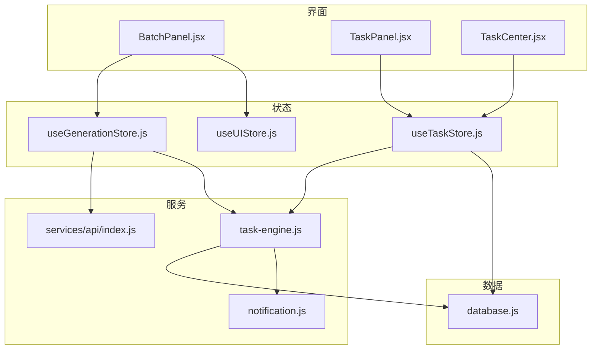
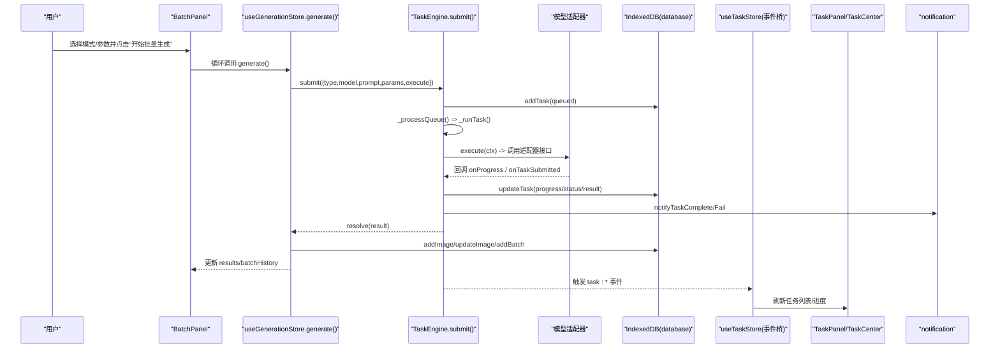
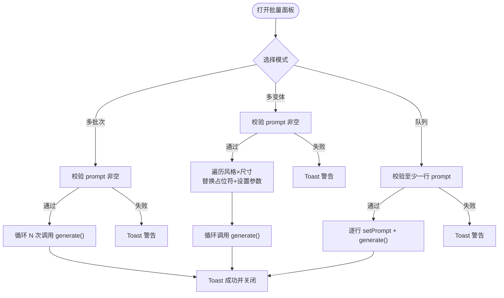
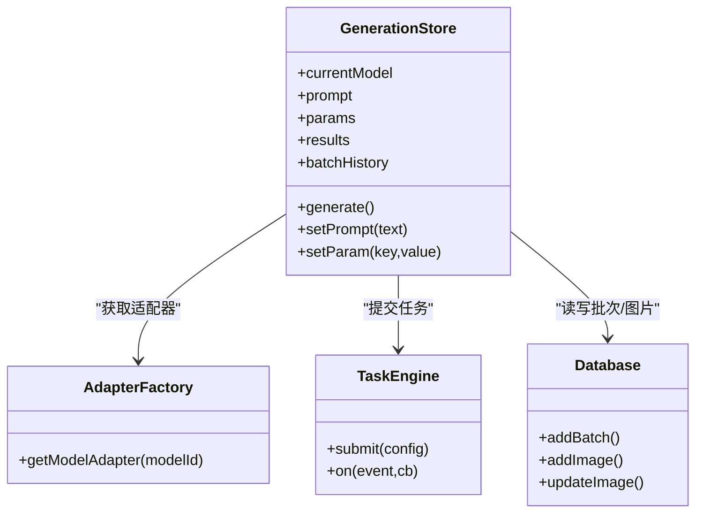
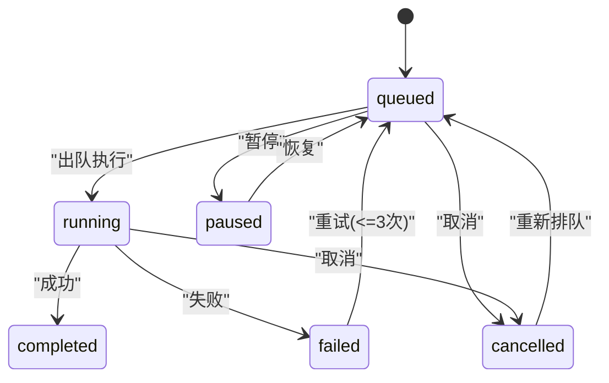
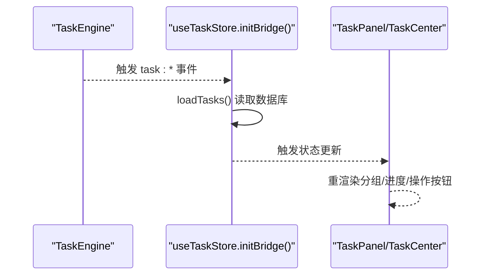
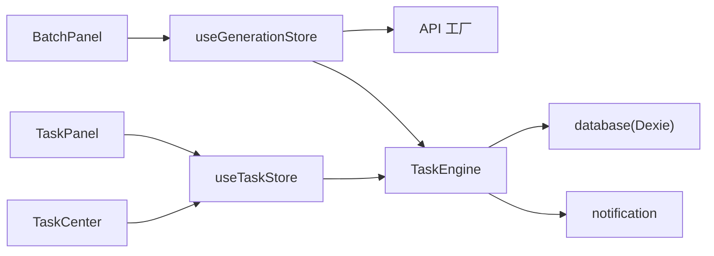

# 批量面板组件 (BatchPanel)

<cite>
**本文引用的文件**   
- [app/src/components/BatchPanel.jsx](file://app/src/components/BatchPanel.jsx)
- [app/src/stores/useGenerationStore.js](file://app/src/stores/useGenerationStore.js)
- [app/src/services/task-engine.js](file://app/src/services/task-engine.js)
- [app/src/stores/useTaskStore.js](file://app/src/stores/useTaskStore.js)
- [app/src/pages/TaskCenter.jsx](file://app/src/pages/TaskCenter.jsx)
- [app/src/db/database.js](file://app/src/db/database.js)
- [app/src/services/notification.js](file://app/src/services/notification.js)
- [app/src/components/TaskPanel.jsx](file://app/src/components/TaskPanel.jsx)
- [app/src/stores/useUIStore.js](file://app/src/stores/useUIStore.js)
- [app/src/services/api/index.js](file://app/src/services/api/index.js)
</cite>

## 目录
1. [简介](#简介)
2. [项目结构](#项目结构)
3. [核心组件](#核心组件)
4. [架构总览](#架构总览)
5. [详细组件分析](#详细组件分析)
6. [依赖关系分析](#依赖关系分析)
7. [性能考量](#性能考量)
8. [故障排除指南](#故障排除指南)
9. [结论](#结论)
10. [附录：API 参考与使用示例](#附录api-参考与使用示例)

## 简介
本文件为 AI Image Studio 的“批量面板”（BatchPanel）组件提供系统化、可落地的技术文档。内容覆盖批量任务创建、参数配置、进度监控、结果管理、队列与并发控制、错误处理与重试、状态同步机制、用户反馈系统，以及与任务引擎和持久化层的集成方式。同时给出数据流设计、性能优化策略、使用示例与排障建议，帮助开发者快速理解并扩展该组件。

## 项目结构
围绕 BatchPanel 的关键代码分布在以下模块：
- UI 层：批量面板、任务侧边栏、任务中心页面
- 状态层：生成状态存储、任务状态存储、全局 UI 状态
- 服务层：任务引擎、通知服务、API 适配工厂
- 数据层：IndexedDB 封装

图表来源
- [app/src/components/BatchPanel.jsx:1-675](file://app/src/components/BatchPanel.jsx#L1-L675)
- [app/src/stores/useGenerationStore.js:1-360](file://app/src/stores/useGenerationStore.js#L1-L360)
- [app/src/services/task-engine.js:1-319](file://app/src/services/task-engine.js#L1-L319)
- [app/src/stores/useTaskStore.js:1-173](file://app/src/stores/useTaskStore.js#L1-L173)
- [app/src/pages/TaskCenter.jsx:1-218](file://app/src/pages/TaskCenter.jsx#L1-L218)
- [app/src/db/database.js:1-339](file://app/src/db/database.js#L1-L339)
- [app/src/services/notification.js:1-113](file://app/src/services/notification.js#L1-L113)
- [app/src/components/TaskPanel.jsx:1-538](file://app/src/components/TaskPanel.jsx#L1-L538)
- [app/src/stores/useUIStore.js:1-159](file://app/src/stores/useUIStore.js#L1-L159)
- [app/src/services/api/index.js:1-39](file://app/src/services/api/index.js#L1-L39)

章节来源
- [app/src/components/BatchPanel.jsx:1-675](file://app/src/components/BatchPanel.jsx#L1-L675)
- [app/src/stores/useGenerationStore.js:1-360](file://app/src/stores/useGenerationStore.js#L1-L360)
- [app/src/services/task-engine.js:1-319](file://app/src/services/task-engine.js#L1-L319)
- [app/src/stores/useTaskStore.js:1-173](file://app/src/stores/useTaskStore.js#L1-L173)
- [app/src/pages/TaskCenter.jsx:1-218](file://app/src/pages/TaskCenter.jsx#L1-L218)
- [app/src/db/database.js:1-339](file://app/src/db/database.js#L1-L339)
- [app/src/services/notification.js:1-113](file://app/src/services/notification.js#L1-L113)
- [app/src/components/TaskPanel.jsx:1-538](file://app/src/components/TaskPanel.jsx#L1-L538)
- [app/src/stores/useUIStore.js:1-159](file://app/src/stores/useUIStore.js#L1-L159)
- [app/src/services/api/index.js:1-39](file://app/src/services/api/index.js#L1-L39)

## 核心组件
- BatchPanel：提供三种批量模式——多批次、多变体、Prompt 队列；负责输入校验、参数组合、调用生成流程、展示预览与操作按钮、通过 Toast 反馈结果。
- useGenerationStore：维护当前模型、提示词、参数、结果集、批历史等；封装 generate()，将具体执行逻辑交给 TaskEngine 异步运行。
- TaskEngine：后台任务调度器，实现最大并发、FIFO 队列、指数退避重试、状态机、事件总线、进度上报、浏览器通知。
- useTaskStore：桥接 TaskEngine 事件到 Zustand 状态，供 TaskPanel 与 TaskCenter 实时渲染。
- database：基于 Dexie 的 IndexedDB 封装，持久化任务、图片、批次等。
- notification：浏览器通知封装，用于任务完成/失败提醒。
- api/index：模型适配器工厂，按模型 ID 返回对应适配器实例。

章节来源
- [app/src/components/BatchPanel.jsx:1-675](file://app/src/components/BatchPanel.jsx#L1-L675)
- [app/src/stores/useGenerationStore.js:1-360](file://app/src/stores/useGenerationStore.js#L1-L360)
- [app/src/services/task-engine.js:1-319](file://app/src/services/task-engine.js#L1-L319)
- [app/src/stores/useTaskStore.js:1-173](file://app/src/stores/useTaskStore.js#L1-L173)
- [app/src/db/database.js:1-339](file://app/src/db/database.js#L1-L339)
- [app/src/services/notification.js:1-113](file://app/src/services/notification.js#L1-L113)
- [app/src/services/api/index.js:1-39](file://app/src/services/api/index.js#L1-L39)

## 架构总览
下图展示了从用户点击“开始批量生成”到任务执行、持久化与 UI 更新的完整链路。

图表来源
- [app/src/components/BatchPanel.jsx:48-101](file://app/src/components/BatchPanel.jsx#L48-L101)
- [app/src/stores/useGenerationStore.js:112-290](file://app/src/stores/useGenerationStore.js#L112-L290)
- [app/src/services/task-engine.js:57-297](file://app/src/services/task-engine.js#L57-L297)
- [app/src/db/database.js:235-274](file://app/src/db/database.js#L235-L274)
- [app/src/stores/useTaskStore.js:39-64](file://app/src/stores/useTaskStore.js#L39-L64)
- [app/src/services/notification.js:78-103](file://app/src/services/notification.js#L78-L103)

## 详细组件分析

### BatchPanel 组件
- 功能要点
  - 三种模式：多批次（同一 prompt 重复 N 次）、多变体（变量 × 尺寸排列组合）、Prompt 队列（逐行提交）。
  - 输入校验：prompt 非空、队列至少一行、数值范围限制（1-50）。
  - 交互：Tab 切换、数量步进器、尺寸多选、预览统计、禁用态与加载动画。
  - 反馈：成功/警告/错误 Toast；完成后自动关闭面板。
- 关键流程
  - 多批次：for 循环调用 generate()，每次以相同 prompt/参数提交任务。
  - 多变体：遍历风格与尺寸组合，动态替换 prompt 占位符并设置 size 参数后提交。
  - 队列：按行拆分 prompt，依次 setPrompt + generate()。
- 与状态/服务的耦合
  - 通过 useGenerationStore 的 generate/setPrompt/setParam 驱动生成。
  - 通过 useUIStore.addToast 进行用户反馈。
- 复杂度与边界
  - 时间复杂度：O(N)，N 为提交次数（批次×每批张数或组合数）。
  - 内存占用：仅维护少量本地状态，不缓存大量中间结果。
  - 边界处理：空 prompt 拦截、提交中防抖（isSubmitting 禁用按钮）、异常捕获并 Toast。

图表来源
- [app/src/components/BatchPanel.jsx:48-101](file://app/src/components/BatchPanel.jsx#L48-L101)

章节来源
- [app/src/components/BatchPanel.jsx:1-675](file://app/src/components/BatchPanel.jsx#L1-L675)

### useGenerationStore.generate()
- 职责
  - 构建执行函数 execute(ctx)，根据是否图生图选择不同适配器方法。
  - 在适配器回调 onTaskSubmitted 时立即写入 pending 图片记录，确保刷新后可恢复。
  - 适配器返回结果后，持久化图片并更新 store 的 results 与 batchHistory。
  - 通过 TaskEngine.submit 提交任务，由引擎在后台执行。
- 关键路径
  - 获取适配器：getModelAdapter(currentModel)。
  - 创建批次：addBatch。
  - 提交任务：TaskEngine.submit({ type, model, prompt, params, execute })。
  - 结果落库：updateImage/addImage，并更新本地 results。
- 错误处理
  - 适配器异常时尝试将 pending 记录标记为 failed。
  - 最终 catch 设置 generationError 并向上抛出。

图表来源
- [app/src/stores/useGenerationStore.js:112-290](file://app/src/stores/useGenerationStore.js#L112-L290)
- [app/src/services/api/index.js:20-31](file://app/src/services/api/index.js#L20-L31)
- [app/src/db/database.js:144-171](file://app/src/db/database.js#L144-L171)
- [app/src/db/database.js:43-91](file://app/src/db/database.js#L43-L91)

章节来源
- [app/src/stores/useGenerationStore.js:1-360](file://app/src/stores/useGenerationStore.js#L1-L360)
- [app/src/services/api/index.js:1-39](file://app/src/services/api/index.js#L1-L39)
- [app/src/db/database.js:1-339](file://app/src/db/database.js#L1-L339)

### TaskEngine 任务引擎
- 能力概览
  - 最大并发：默认 3，可通过 setMaxConcurrent 调整。
  - 队列：FIFO，内部数组维护等待项。
  - 状态机：queued → running → completed/failed/cancelled/paused；支持 retry 与 re-queue。
  - 事件：task:queued/started/progress/completed/failed/cancelled/paused/retry。
  - 持久化：所有状态变更均写库，支持刷新恢复。
  - 重试：指数退避，最多 3 次，仅对可重试错误（5xx、网络错误等）。
- 关键流程
  - submit：生成 taskId，持久化为 queued，入队并触发 _processQueue。
  - _runTask：分配控制器 AbortController，执行 execute(ctx)，上报进度，完成/失败分支。
  - cancel/pause/resume/retry：跨状态安全地改变任务生命周期。
- 并发与背压
  - 当 active.size < maxConcurrent 且 queue.length > 0 时出队执行，避免过载。
- 通知
  - 完成/失败时调用通知服务推送系统通知。

图表来源
- [app/src/services/task-engine.js:24-31](file://app/src/services/task-engine.js#L24-L31)
- [app/src/services/task-engine.js:57-297](file://app/src/services/task-engine.js#L57-L297)

章节来源
- [app/src/services/task-engine.js:1-319](file://app/src/services/task-engine.js#L1-L319)
- [app/src/services/notification.js:1-113](file://app/src/services/notification.js#L1-L113)

### useTaskStore 与 UI 联动
- 作用
  - 初始化事件桥：监听 TaskEngine 全部事件，统一刷新任务列表。
  - 暴露 actions：addTask/updateTask/removeTask/retryTask/cancelTask/pauseTask/resumeTask/clearCompleted。
- 渲染
  - TaskPanel：右侧抽屉式任务面板，分组显示进行中/排队/已完成/失败，支持暂停/继续/移除/重试。
  - TaskCenter：独立页面，更丰富的统计与筛选视图。

图表来源
- [app/src/stores/useTaskStore.js:39-64](file://app/src/stores/useTaskStore.js#L39-L64)
- [app/src/stores/useTaskStore.js:22-33](file://app/src/stores/useTaskStore.js#L22-L33)
- [app/src/components/TaskPanel.jsx:1-538](file://app/src/components/TaskPanel.jsx#L1-L538)
- [app/src/pages/TaskCenter.jsx:1-218](file://app/src/pages/TaskCenter.jsx#L1-L218)

章节来源
- [app/src/stores/useTaskStore.js:1-173](file://app/src/stores/useTaskStore.js#L1-L173)
- [app/src/components/TaskPanel.jsx:1-538](file://app/src/components/TaskPanel.jsx#L1-L538)
- [app/src/pages/TaskCenter.jsx:1-218](file://app/src/pages/TaskCenter.jsx#L1-L218)

### 数据与持久化
- 表结构（部分）
  - tasks：id, type, status, model, prompt, params, progress, error, result, retryCount, createdAt, updatedAt
  - images：id, batchId, folderId, model, prompt, url, thumbnailUrl, params, favorite, storageZone, width, height, status, taskId, createdAt
  - batches：id, sessionId, model, prompt, createdAt
- 写入时机
  - 任务：submit 时写入 queued；_runTask 过程中更新 progress/status；完成/失败时写入 result/error。
  - 图片：适配器回调 onTaskSubmitted 先写入 pending；成功后更新或新增记录。
  - 批次：每次 generate 前创建批次记录。

章节来源
- [app/src/db/database.js:22-31](file://app/src/db/database.js#L22-L31)
- [app/src/db/database.js:235-274](file://app/src/db/database.js#L235-L274)
- [app/src/db/database.js:43-91](file://app/src/db/database.js#L43-L91)
- [app/src/db/database.js:144-171](file://app/src/db/database.js#L144-L171)

## 依赖关系分析
- 组件耦合
  - BatchPanel 低耦合于 UI Store 与 Generation Store，通过函数式调用解耦业务细节。
  - GenerationStore 依赖 API 工厂与 TaskEngine，屏蔽底层适配器差异。
  - TaskEngine 与数据库、通知服务松耦合，通过事件与回调通信。
- 外部依赖
  - Dexie（IndexedDB）、uuid、lucide-react 图标库、Zustand/immer 状态管理。
- 潜在风险
  - 若适配器未正确实现 onProgress/onTaskSubmitted，可能导致进度不更新或刷新丢失。
  - 高并发下 IndexedDB 写入频繁，需关注主线程阻塞与事务开销。

图表来源
- [app/src/components/BatchPanel.jsx:1-675](file://app/src/components/BatchPanel.jsx#L1-L675)
- [app/src/stores/useGenerationStore.js:1-360](file://app/src/stores/useGenerationStore.js#L1-L360)
- [app/src/services/task-engine.js:1-319](file://app/src/services/task-engine.js#L1-L319)
- [app/src/stores/useTaskStore.js:1-173](file://app/src/stores/useTaskStore.js#L1-L173)
- [app/src/components/TaskPanel.jsx:1-538](file://app/src/components/TaskPanel.jsx#L1-L538)
- [app/src/pages/TaskCenter.jsx:1-218](file://app/src/pages/TaskCenter.jsx#L1-L218)
- [app/src/db/database.js:1-339](file://app/src/db/database.js#L1-L339)
- [app/src/services/notification.js:1-113](file://app/src/services/notification.js#L1-L113)
- [app/src/services/api/index.js:1-39](file://app/src/services/api/index.js#L1-L39)

## 性能考量
- 并发控制
  - 默认最大并发 3，适合大多数浏览器环境；可根据后端限流与带宽调优。
- 队列与背压
  - FIFO 保证顺序性；active 集合限制并行度，避免雪崩。
- 重试与退避
  - 指数退避降低瞬时压力；仅对可重试错误重试，避免无效重试风暴。
- 持久化频率
  - 任务进度与状态高频更新，建议合并小粒度更新或在 UI 层做节流（如每 200ms 刷新一次）。
- 大任务批量
  - 多变体模式下组合数可能较大，建议在 UI 上增加上限提示与分批确认。
- 内存与渲染
  - 避免在 execute 中持有大对象引用；图片 URL 优先采用远端地址，减少内存占用。

[本节为通用指导，无需特定文件来源]

## 故障排除指南
- 常见问题
  - 无任务出现在列表中：检查 initBridge 是否调用；确认 TaskEngine 事件是否触发；查看数据库 tasks 表是否有记录。
  - 进度不更新：确认适配器是否正确调用 ctx.onProgress；检查 _runTask 中的进度上报逻辑。
  - 刷新后任务丢失：确认 onTaskSubmitted 是否写入 pending 图片记录；检查 tasks/images/batches 写入是否成功。
  - 无法重试：仅在 failed/cancelled 状态允许重试；确认 retry 逻辑与数据库状态一致。
  - 通知未弹出：检查 Notification 权限；确认 notifyTaskComplete/Failed 被调用。
- 定位步骤
  - 打开控制台，观察 TaskEngine 事件日志与数据库写入日志。
  - 在 TaskCenter 查看失败原因与重试计数。
  - 核对 BatchPanel 的 Toast 信息，确认前端校验是否通过。

章节来源
- [app/src/stores/useTaskStore.js:39-64](file://app/src/stores/useTaskStore.js#L39-L64)
- [app/src/services/task-engine.js:259-305](file://app/src/services/task-engine.js#L259-L305)
- [app/src/services/notification.js:19-43](file://app/src/services/notification.js#L19-L43)
- [app/src/pages/TaskCenter.jsx:192-214](file://app/src/pages/TaskCenter.jsx#L192-L214)

## 结论
BatchPanel 作为批量任务的入口，通过清晰的模式划分与严格的输入校验，结合 useGenerationStore 与 TaskEngine 的强有力支撑，实现了稳定可靠的批量生成体验。其事件驱动的 UI 同步、完善的持久化与通知机制，以及可配置的并发与重试策略，共同构成了可扩展、可观测、可运维的批量处理能力。后续可在 UI 层引入更细粒度的进度聚合、批量取消/暂停、任务优先级与资源配额等增强特性。

[本节为总结，无需特定文件来源]

## 附录：API 参考与使用示例

### 组件 API（BatchPanel）
- Props
  - isOpen: boolean，是否显示面板
  - onClose: function，关闭回调
  - initialMode: 'batch' | 'variants' | 'queue'，初始模式
- 行为
  - 多批次：在同一 prompt 与参数下重复提交 N 次
  - 多变体：按风格与尺寸组合生成，支持占位符替换与参数覆盖
  - 队列：逐行 prompt 依次提交

章节来源
- [app/src/components/BatchPanel.jsx:8-27](file://app/src/components/BatchPanel.jsx#L8-L27)
- [app/src/components/BatchPanel.jsx:48-101](file://app/src/components/BatchPanel.jsx#L48-L101)

### 状态与动作（useGenerationStore）
- 关键状态
  - currentModel, prompt, params, results, batchHistory, isGenerating, generatingProgress
- 关键动作
  - generate(): 提交任务并持久化结果
  - setPrompt(text), setParam(key, value): 更新提示词与参数
  - clearGeneration(): 清空生成状态

章节来源
- [app/src/stores/useGenerationStore.js:22-35](file://app/src/stores/useGenerationStore.js#L22-L35)
- [app/src/stores/useGenerationStore.js:112-290](file://app/src/stores/useGenerationStore.js#L112-L290)

### 任务引擎（TaskEngine）
- 公共方法
  - setMaxConcurrent(n): 设置并发上限
  - submit(config): 提交任务，返回 Promise
  - submitWithId(dbTaskId, config): 使用已有任务 ID 提交
  - cancel(taskId)/pause(taskId)/resume(taskId)/retry(taskId): 生命周期控制
  - getStats(): 获取活跃/排队/并发上限统计
  - on(event, cb)/off(event, cb): 事件订阅
- 事件
  - task:queued/started/progress/completed/failed/cancelled/paused/retry

章节来源
- [app/src/services/task-engine.js:44-187](file://app/src/services/task-engine.js#L44-L187)
- [app/src/services/task-engine.js:189-211](file://app/src/services/task-engine.js#L189-L211)

### 任务状态存储（useTaskStore）
- 状态
  - tasks: 任务列表
  - activeTaskCount: 活跃任务数
- 动作
  - loadTasks()/initBridge()
  - addTask/updateTask/removeTask
  - retryTask/cancelTask/pauseTask/resumeTask
  - clearCompleted/getTaskStats

章节来源
- [app/src/stores/useTaskStore.js:14-17](file://app/src/stores/useTaskStore.js#L14-L17)
- [app/src/stores/useTaskStore.js:22-173](file://app/src/stores/useTaskStore.js#L22-L173)

### 使用示例（概念流程）
- 多批次
  - 打开 BatchPanel，选择“多批次”，设置重复次数，点击“开始批量生成”。
- 多变体
  - 选择“多变体”，定义风格变量与尺寸选项，预览组合数，点击“开始批量生成”。
- 队列
  - 选择“Prompt 队列”，粘贴多行 prompt，点击“开始队列生成”。

[本节为概念说明，无需特定文件来源]