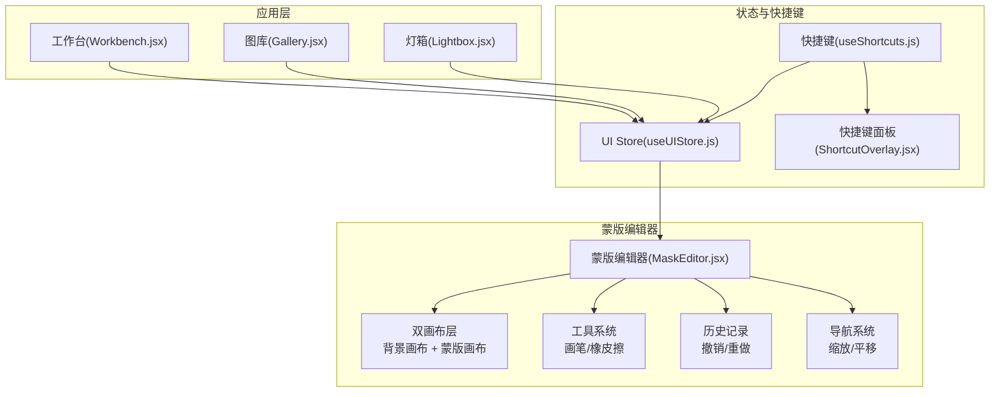
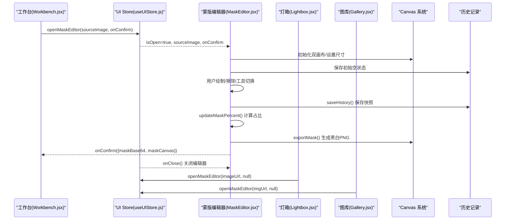
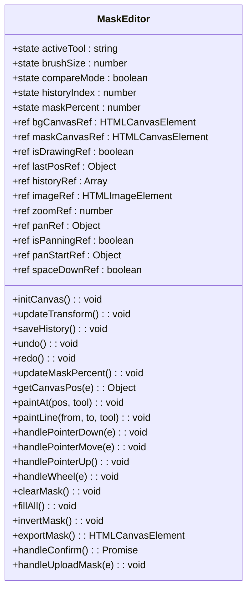
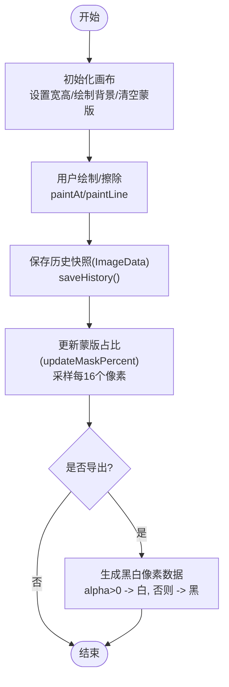
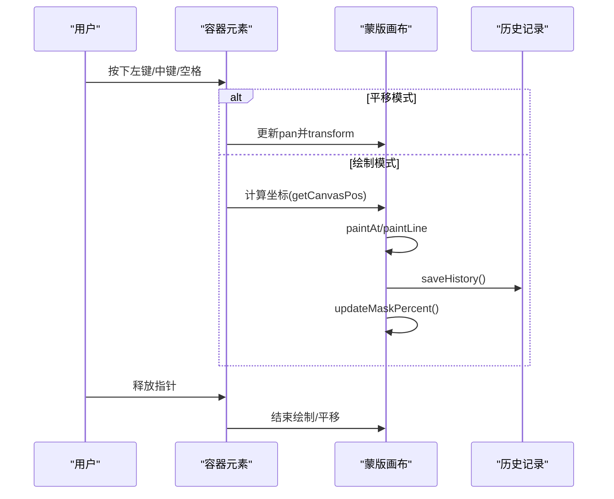
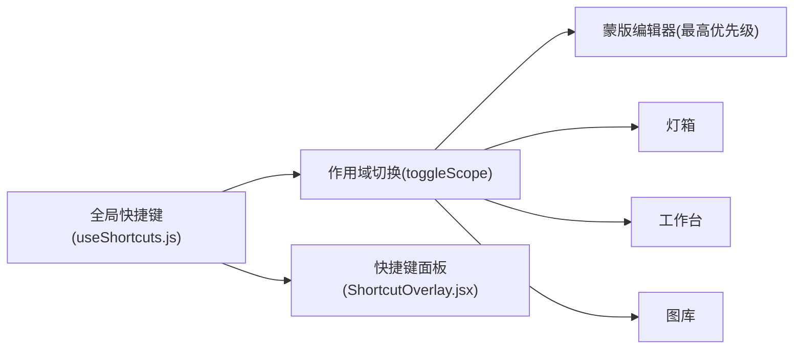
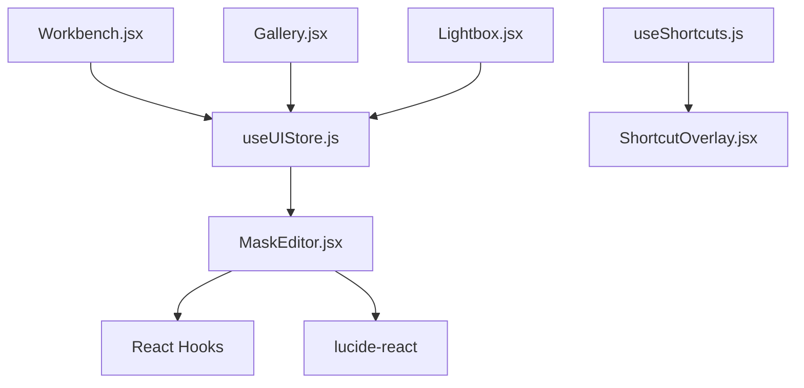

# 蒙版编辑器组件 (MaskEditor)

<cite>
**本文引用的文件**
- [app/src/components/MaskEditor.jsx](file://app/src/components/MaskEditor.jsx)
- [app/src/hooks/useShortcuts.js](file://app/src/hooks/useShortcuts.js)
- [app/src/components/ShortcutOverlay.jsx](file://app/src/components/ShortcutOverlay.jsx)
- [app/src/stores/useUIStore.js](file://app/src/stores/useUIStore.js)
- [app/src/pages/Workbench.jsx](file://app/src/pages/Workbench.jsx)
- [app/src/components/Lightbox.jsx](file://app/src/components/Lightbox.jsx)
- [app/src/pages/Gallery.jsx](file://app/src/pages/Gallery.jsx)
</cite>

## 更新摘要
**变更内容**
- 更新了双画布架构的详细实现说明
- 增强了画笔工具和橡皮擦功能的描述
- 完善了撤销重做操作的技术细节
- 补充了缩放平移导航的实现机制
- 增加了外部蒙版导入功能的详细说明
- 优化了性能考量部分的分析

## 目录
1. [简介](#简介)
2. [项目结构](#项目结构)
3. [核心组件](#核心组件)
4. [架构总览](#架构总览)
5. [详细组件分析](#详细组件分析)
6. [依赖关系分析](#依赖关系分析)
7. [性能考量](#性能考量)
8. [故障排查指南](#故障排查指南)
9. [结论](#结论)
10. [附录：使用示例与扩展指南](#附录使用示例与扩展指南)

## 简介
本文件为 AI Image Studio 的"蒙版编辑器"（MaskEditor）组件提供系统化、可落地的技术文档。该组件基于 Canvas API 实现了 sophisticated 的双画布架构，提供局部重绘所需的蒙版绘制、工具选择、图层管理、撤销重做、缩放平移、对比预览、导出黑白掩码等完整功能，并与全局快捷键系统、UI Store 以及工作区/图库/灯箱等页面深度集成，形成流畅的局部重绘工作流。

## 项目结构
MaskEditor 位于 components 目录下，是一个独立的 React 函数式组件；其交互逻辑通过 refs 和 useCallback 优化，状态由本地 state 管理，并通过 onConfirm 回调将结果回传给调用方。全局快捷键系统与 UI Store 负责打开/关闭蒙版编辑器及上下文切换。

**图表来源**
- [app/src/components/MaskEditor.jsx:1-810](file://app/src/components/MaskEditor.jsx#L1-L810)
- [app/src/hooks/useShortcuts.js:1-185](file://app/src/hooks/useShortcuts.js#L1-L185)
- [app/src/components/ShortcutOverlay.jsx:1-137](file://app/src/components/ShortcutOverlay.jsx#L1-L137)
- [app/src/stores/useUIStore.js:1-159](file://app/src/stores/useUIStore.js#L1-L159)
- [app/src/pages/Workbench.jsx:420-435](file://app/src/pages/Workbench.jsx#L420-L435)
- [app/src/components/Lightbox.jsx:105-125](file://app/src/components/Lightbox.jsx#L105-L125)
- [app/src/pages/Gallery.jsx:310-320](file://app/src/pages/Gallery.jsx#L310-L320)

**章节来源**
- [app/src/components/MaskEditor.jsx:1-810](file://app/src/components/MaskEditor.jsx#L1-L810)
- [app/src/stores/useUIStore.js:133-159](file://app/src/stores/useUIStore.js#L133-L159)
- [app/src/hooks/useShortcuts.js:1-185](file://app/src/hooks/useShortcuts.js#L1-L185)

## 核心组件
- **双画布架构**
  - 背景画布：静态展示原图，仅在缩放/平移时重绘，确保渲染性能
  - 蒙版画布：半透明红色覆盖层，用户在此进行涂抹/擦除操作
- **工具与操作**
  - 画笔工具：圆形笔刷，支持线段插值绘制，MASK_COLOR 填充半透明红色
  - 橡皮擦工具：destination-out 合成模式擦除蒙版区域
  - 全选/清除/反转：批量编辑蒙版区域的快捷操作
  - 上传外部蒙版：将黑白图转换为内部蒙版格式，支持阈值化处理
  - 导出功能：将蒙版转为黑白 PNG（白=蒙版区域，黑=保留区域）
- **历史与撤销重做**
  - 固定长度历史栈（MAX_HISTORY=20），保存 ImageData 快照
  - 支持撤销/重做操作，自动管理历史索引边界
- **缩放与平移导航**
  - 滚轮缩放：限制缩放范围 0.25x-4x，CSS transform 驱动
  - 空格+拖拽平移：中键或空格+左键进入平移模式
  - 实时坐标转换：屏幕坐标到画布像素坐标的精确映射
- **对比模式**
  - 按住空格或点击对比按钮，临时隐藏蒙版以查看原图
  - 平滑过渡动画效果，提升用户体验
- **键盘快捷键**
  - B/E 切换工具、[ ] 调整笔刷大小、Ctrl+Z/Ctrl+Shift+Z 撤销重做、Space 对比

**章节来源**
- [app/src/components/MaskEditor.jsx:17-18](file://app/src/components/MaskEditor.jsx#L17-L18)
- [app/src/components/MaskEditor.jsx:43-87](file://app/src/components/MaskEditor.jsx#L43-L87)
- [app/src/components/MaskEditor.jsx:102-154](file://app/src/components/MaskEditor.jsx#L102-L154)
- [app/src/components/MaskEditor.jsx:156-256](file://app/src/components/MaskEditor.jsx#L156-L256)
- [app/src/components/MaskEditor.jsx:258-316](file://app/src/components/MaskEditor.jsx#L258-L316)
- [app/src/components/MaskEditor.jsx:318-395](file://app/src/components/MaskEditor.jsx#L318-L395)
- [app/src/components/MaskEditor.jsx:397-429](file://app/src/components/MaskEditor.jsx#L397-L429)
- [app/src/components/MaskEditor.jsx:431-465](file://app/src/components/MaskEditor.jsx#L431-L465)

## 架构总览
下图展示了从页面触发到蒙版确认的完整流程，包括状态管理与回调传递。

**图表来源**
- [app/src/pages/Workbench.jsx:420-435](file://app/src/pages/Workbench.jsx#L420-L435)
- [app/src/stores/useUIStore.js:135-143](file://app/src/stores/useUIStore.js#L135-L143)
- [app/src/components/MaskEditor.jsx:348-360](file://app/src/components/MaskEditor.jsx#L348-L360)
- [app/src/components/Lightbox.jsx:105-125](file://app/src/components/Lightbox.jsx#L105-L125)
- [app/src/pages/Gallery.jsx:310-320](file://app/src/pages/Gallery.jsx#L310-L320)

## 详细组件分析

### 组件类结构与职责
MaskEditor 为单一函数式组件，内部通过多个 useCallback 封装功能模块，职责清晰、耦合度低。

**图表来源**
- [app/src/components/MaskEditor.jsx:20-87](file://app/src/components/MaskEditor.jsx#L20-L87)
- [app/src/components/MaskEditor.jsx:102-154](file://app/src/components/MaskEditor.jsx#L102-L154)
- [app/src/components/MaskEditor.jsx:156-256](file://app/src/components/MaskEditor.jsx#L156-L256)
- [app/src/components/MaskEditor.jsx:258-316](file://app/src/components/MaskEditor.jsx#L258-L316)
- [app/src/components/MaskEditor.jsx:318-395](file://app/src/components/MaskEditor.jsx#L318-L395)
- [app/src/components/MaskEditor.jsx:397-465](file://app/src/components/MaskEditor.jsx#L397-L465)

**章节来源**
- [app/src/components/MaskEditor.jsx:1-810](file://app/src/components/MaskEditor.jsx#L1-L810)

### 画布绘制与像素操作
- **初始化流程**
  - 根据图片自然尺寸设置画布分辨率，确保像素级精度
  - 背景画布绘制原图或渐变占位；蒙版画布清空并启用 willReadFrequently 优化
- **坐标转换算法**
  - 通过 getBoundingClientRect 与 canvas.width/height 计算缩放比例
  - 将屏幕坐标映射到画布像素坐标，支持任意缩放级别下的精确绘制
- **绘制算法实现**
  - paintAt：在当前位置绘制圆形笔触（画笔填充 MASK_COLOR；橡皮擦使用 destination-out 擦除）
  - paintLine：两点间直线插值绘制，设置 lineCap/lineJoin 为 round，保证线条平滑
- **像素操作优化**
  - updateMaskPercent：采样每第16个像素的 alpha 通道统计蒙版占比，降低大图遍历开销
  - invertMask：新建临时画布，先填充蒙版色，再用 destination-out 擦除原蒙版区域，实现反转
  - exportMask：遍历 alpha 通道生成黑白图像数据（alpha>0 为白，否则为黑），输出 PNG Blob

**图表来源**
- [app/src/components/MaskEditor.jsx:43-87](file://app/src/components/MaskEditor.jsx#L43-L87)
- [app/src/components/MaskEditor.jsx:156-217](file://app/src/components/MaskEditor.jsx#L156-L217)
- [app/src/components/MaskEditor.jsx:141-154](file://app/src/components/MaskEditor.jsx#L141-L154)
- [app/src/components/MaskEditor.jsx:287-316](file://app/src/components/MaskEditor.jsx#L287-L316)
- [app/src/components/MaskEditor.jsx:318-346](file://app/src/components/MaskEditor.jsx#L318-L346)

**章节来源**
- [app/src/components/MaskEditor.jsx:43-87](file://app/src/components/MaskEditor.jsx#L43-L87)
- [app/src/components/MaskEditor.jsx:156-217](file://app/src/components/MaskEditor.jsx#L156-L217)
- [app/src/components/MaskEditor.jsx:141-154](file://app/src/components/MaskEditor.jsx#L141-L154)
- [app/src/components/MaskEditor.jsx:287-316](file://app/src/components/MaskEditor.jsx#L287-L316)
- [app/src/components/MaskEditor.jsx:318-346](file://app/src/components/MaskEditor.jsx#L318-L346)

### 鼠标事件处理与手势
- **指针事件处理**
  - handlePointerDown：中键或空格+左键进入平移模式；左键进入绘制模式，记录起点并立即绘制一次点
  - handlePointerMove：平移模式下更新 pan 并刷新 transform；绘制模式下按路径插值连续绘制
  - handlePointerUp：结束绘制或平移，必要时保存历史并更新蒙版占比
- **滚轮缩放控制**
  - handleWheel：限制缩放范围 0.25-4 倍，更新 zoom 并刷新 transform
- **对比模式实现**
  - Space 键切换 compareMode，控制蒙版画布透明度，便于对照原图
  - 平滑过渡动画效果，提升视觉体验

**图表来源**
- [app/src/components/MaskEditor.jsx:219-256](file://app/src/components/MaskEditor.jsx#L219-L256)
- [app/src/components/MaskEditor.jsx:258-264](file://app/src/components/MaskEditor.jsx#L258-L264)
- [app/src/components/MaskEditor.jsx:397-429](file://app/src/components/MaskEditor.jsx#L397-L429)

**章节来源**
- [app/src/components/MaskEditor.jsx:219-256](file://app/src/components/MaskEditor.jsx#L219-L256)
- [app/src/components/MaskEditor.jsx:258-264](file://app/src/components/MaskEditor.jsx#L258-L264)
- [app/src/components/MaskEditor.jsx:397-429](file://app/src/components/MaskEditor.jsx#L397-L429)

### 工具选择与工具栏设计
- **工具类型实现**
  - 画笔工具：用 MASK_COLOR 填充圆形/线段，支持动态笔刷大小调节
  - 橡皮擦工具：destination-out 合成模式擦除，保持蒙版边缘平滑
- **工具栏界面**
  - 顶部工具栏包含画笔、橡皮擦、笔刷大小滑块、全选、清除、反转、撤销、重做、上传外部蒙版、对比开关、关闭按钮
  - 右侧信息面板显示说明、图例与快捷键提示
  - 底部状态栏显示已选择区域百分比，并提供取消/确认按钮
- **外部蒙版导入**
  - 支持上传黑白图像文件，自动转换为蒙版格式
  - 阈值化处理：亮度>128的像素视为蒙版区域
  - 实时预览导入效果，支持撤销操作

**章节来源**
- [app/src/components/MaskEditor.jsx:504-637](file://app/src/components/MaskEditor.jsx#L504-L637)
- [app/src/components/MaskEditor.jsx:712-763](file://app/src/components/MaskEditor.jsx#L712-L763)
- [app/src/components/MaskEditor.jsx:766-798](file://app/src/components/MaskEditor.jsx#L766-L798)
- [app/src/components/MaskEditor.jsx:362-395](file://app/src/components/MaskEditor.jsx#L362-L395)

### 快捷键支持与全局集成
- **蒙版编辑器内快捷键**
  - B/E 切换工具、[ ] 调整笔刷大小、Ctrl+Z/Ctrl+Shift+Z 撤销重做、Space 对比
- **全局快捷键系统**
  - useShortcuts 定义多作用域（全局、工作台、图库、灯箱、蒙版编辑器），优先级从高到低
  - ShortcutOverlay 提供全屏快捷键速查面板
  - 智能作用域管理：蒙版编辑器具有最高优先级

**图表来源**
- [app/src/hooks/useShortcuts.js:1-185](file://app/src/hooks/useShortcuts.js#L1-L185)
- [app/src/components/ShortcutOverlay.jsx:1-137](file://app/src/components/ShortcutOverlay.jsx#L1-L137)
- [app/src/components/MaskEditor.jsx:397-429](file://app/src/components/MaskEditor.jsx#L397-L429)

**章节来源**
- [app/src/hooks/useShortcuts.js:1-185](file://app/src/hooks/useShortcuts.js#L1-L185)
- [app/src/components/ShortcutOverlay.jsx:1-137](file://app/src/components/ShortcutOverlay.jsx#L1-L137)
- [app/src/components/MaskEditor.jsx:397-429](file://app/src/components/MaskEditor.jsx#L397-L429)

### 图层管理与导出机制
- **图层模型架构**
  - 背景层：静态原图，仅在变换时重绘
  - 蒙版层：半透明红色覆盖，用于指示需要重新生成的区域
- **导出策略实现**
  - 将蒙版层的 alpha 通道转换为黑白像素数据，白色表示蒙版区域，黑色表示保留区域
  - 返回 base64 字符串与 Canvas 对象，供上层调用
  - 支持 CORS 跨域图片处理，通过代理服务器绕过浏览器安全限制

**章节来源**
- [app/src/components/MaskEditor.jsx:318-360](file://app/src/components/MaskEditor.jsx#L318-L360)
- [app/src/components/MaskEditor.jsx:431-465](file://app/src/components/MaskEditor.jsx#L431-L465)

### 颜色选择与透明度控制机制
- **蒙版颜色配置**
  - 常量 MASK_COLOR 定义为 rgba(220, 38, 38, 0.4)，半透明红色用于可视化蒙版区域
- **透明度控制机制**
  - 对比模式下，蒙版画布 opacity 置 0，以便观察原图
  - 导出时忽略颜色，仅依据 alpha 通道生成黑白图
  - 平滑过渡动画效果，提升用户体验

**章节来源**
- [app/src/components/MaskEditor.jsx:17-18](file://app/src/components/MaskEditor.jsx#L17-L18)
- [app/src/components/MaskEditor.jsx:682-694](file://app/src/components/MaskEditor.jsx#L682-L694)
- [app/src/components/MaskEditor.jsx:318-346](file://app/src/components/MaskEditor.jsx#L318-L346)

### 蒙版生成与边缘检测
- **蒙版生成方式**
  - 通过画笔/橡皮擦直接生成蒙版；支持全选、清除、反转、上传外部蒙版
  - 实时蒙版占比计算，帮助用户了解覆盖范围
- **边缘检测现状**
  - 当前未实现自动边缘检测算法，所有蒙版区域均由用户手动绘制或导入
  - 未来可扩展智能辅助绘制功能

**章节来源**
- [app/src/components/MaskEditor.jsx:266-316](file://app/src/components/MaskEditor.jsx#L266-L316)
- [app/src/components/MaskEditor.jsx:362-395](file://app/src/components/MaskEditor.jsx#L362-L395)

## 依赖关系分析
- **组件依赖**
  - React Hooks：useState、useRef、useEffect、useCallback
  - 图标库：lucide-react 提供工具栏图标
- **应用集成**
  - UI Store：openMaskEditor/closeMaskEditor 控制打开/关闭与回调
  - 快捷键系统：useShortcuts 与 ShortcutOverlay 提供全局快捷键与帮助面板
  - 页面入口：Workbench/Lightbox/Gallery 通过 UI Store 打开蒙版编辑器

**图表来源**
- [app/src/components/MaskEditor.jsx:1-5](file://app/src/components/MaskEditor.jsx#L1-L5)
- [app/src/stores/useUIStore.js:133-159](file://app/src/stores/useUIStore.js#L133-L159)
- [app/src/hooks/useShortcuts.js:1-185](file://app/src/hooks/useShortcuts.js#L1-L185)
- [app/src/components/ShortcutOverlay.jsx:1-137](file://app/src/components/ShortcutOverlay.jsx#L1-L137)
- [app/src/pages/Workbench.jsx:420-435](file://app/src/pages/Workbench.jsx#L420-L435)
- [app/src/components/Lightbox.jsx:105-125](file://app/src/components/Lightbox.jsx#L105-L125)
- [app/src/pages/Gallery.jsx:310-320](file://app/src/pages/Gallery.jsx#L310-L320)

**章节来源**
- [app/src/components/MaskEditor.jsx:1-5](file://app/src/components/MaskEditor.jsx#L1-L5)
- [app/src/stores/useUIStore.js:133-159](file://app/src/stores/useUIStore.js#L133-L159)
- [app/src/hooks/useShortcuts.js:1-185](file://app/src/hooks/useShortcuts.js#L1-L185)
- [app/src/components/ShortcutOverlay.jsx:1-137](file://app/src/components/ShortcutOverlay.jsx#L1-L137)
- [app/src/pages/Workbench.jsx:420-435](file://app/src/pages/Workbench.jsx#L420-L435)
- [app/src/components/Lightbox.jsx:105-125](file://app/src/components/Lightbox.jsx#L105-L125)
- [app/src/pages/Gallery.jsx:310-320](file://app/src/pages/Gallery.jsx#L310-L320)

## 性能考量
- **采样统计优化**
  - 蒙版占比计算采用步长采样（每第16个像素），显著降低大图遍历成本
  - 采样总数计算：Math.floor(total / 16)，平衡精度与性能
- **历史栈容量控制**
  - 固定最大历史数（MAX_HISTORY=20），避免内存无限增长
  - 自动截断向前历史，保持栈大小恒定
- **频繁读取优化**
  - 获取 2D 上下文时启用 willReadFrequently，提升 getImageData/putImageData 性能
  - 减少不必要的上下文创建和销毁
- **变换渲染优化**
  - 使用 CSS transform 进行缩放/平移，利用 GPU 加速
  - 背景画布仅在变换时重绘，蒙版画布独立更新
- **事件处理优化**
  - 使用 useCallback 缓存事件处理器，避免不必要的重渲染
  - passive:false 的 wheel 监听器，确保 preventDefault 生效
- **内存管理**
  - 及时清理 URL.createObjectURL 创建的临时对象
  - 合理管理 ImageData 对象的创建和销毁

**章节来源**
- [app/src/components/MaskEditor.jsx:141-154](file://app/src/components/MaskEditor.jsx#L141-L154)
- [app/src/components/MaskEditor.jsx:102-116](file://app/src/components/MaskEditor.jsx#L102-L116)
- [app/src/components/MaskEditor.jsx:79-80](file://app/src/components/MaskEditor.jsx#L79-L80)
- [app/src/components/MaskEditor.jsx:89-100](file://app/src/components/MaskEditor.jsx#L89-L100)
- [app/src/components/MaskEditor.jsx:458-465](file://app/src/components/MaskEditor.jsx#L458-L465)

## 故障排查指南
- **蒙版无变化**
  - 检查 activeTool 是否为画笔；确认 brushSize 不为 0
  - 确认蒙版画布可见性（compareMode 下会隐藏蒙版）
  - 验证坐标转换是否正确：getCanvasPos 返回值是否在画布范围内
- **撤销/重做无效**
  - 检查历史索引边界；确认 saveHistory 被正确调用
  - 验证历史栈容量是否达到 MAX_HISTORY 限制
- **导出结果为全黑**
  - 确认蒙版区域 alpha>0；检查 exportMask 的 alpha 判断逻辑
  - 验证蒙版画布的 ImageData 是否正确保存
- **快捷键不生效**
  - 确认蒙版编辑器处于激活状态（isOpen=true）
  - 检查窗口 keydown/keyup 监听是否正确挂载和清理
- **缩放/平移异常**
  - 检查 container 的 overflow 与 transformOrigin；确认 wheel 监听器非 passive
  - 验证坐标转换公式：scaleX/scaleY 计算是否正确
- **外部蒙版导入失败**
  - 检查文件格式和大小限制
  - 验证阈值处理逻辑：brightness > 128 的判断条件

**章节来源**
- [app/src/components/MaskEditor.jsx:118-139](file://app/src/components/MaskEditor.jsx#L118-L139)
- [app/src/components/MaskEditor.jsx:318-346](file://app/src/components/MaskEditor.jsx#L318-L346)
- [app/src/components/MaskEditor.jsx:397-429](file://app/src/components/MaskEditor.jsx#L397-L429)
- [app/src/components/MaskEditor.jsx:458-465](file://app/src/components/MaskEditor.jsx#L458-L465)
- [app/src/components/MaskEditor.jsx:362-395](file://app/src/components/MaskEditor.jsx#L362-L395)

## 结论
MaskEditor 以双画布为核心，结合高效的像素采样、固定长度历史栈与 CSS transform 缩放/平移，提供了流畅且易用的局部重绘体验。其与全局快捷键系统和 UI Store 的良好集成，使得蒙版编辑器能够无缝嵌入工作台、图库与灯箱等多场景。组件实现了 sophisticated 的 Canvas 操作，包括画笔工具、橡皮擦功能、撤销重做操作、缩放平移导航和外部蒙版导入能力，为 AI 图像编辑提供了强大的蒙版绘制解决方案。未来可在边缘检测、智能辅助绘制等方面进一步扩展。

## 附录：使用示例与扩展指南

### 基本用法
- **在工作台/图库/灯箱中通过 UI Store 打开蒙版编辑器**
  - 传入源图片 URL 与确认回调
  - 支持本地文件和远程图片（通过代理服务器）
- **用户在蒙版编辑器中绘制蒙版后**
  - 点击"确认 Mask"，onConfirm 回调接收 base64 与 Canvas 对象
  - 可直接用于 GPT-image-2 的局部重绘 API

**章节来源**
- [app/src/pages/Workbench.jsx:420-435](file://app/src/pages/Workbench.jsx#L420-L435)
- [app/src/components/Lightbox.jsx:105-125](file://app/src/components/Lightbox.jsx#L105-L125)
- [app/src/pages/Gallery.jsx:310-320](file://app/src/pages/Gallery.jsx#L310-L320)
- [app/src/stores/useUIStore.js:135-143](file://app/src/stores/useUIStore.js#L135-L143)
- [app/src/components/MaskEditor.jsx:348-360](file://app/src/components/MaskEditor.jsx#L348-L360)

### 扩展开发建议
- **新增工具类型**
  - 在 activeTool 分支中添加新工具（如套索、矩形选区）
  - 在 paintAt/paintLine 中实现对应绘制逻辑
  - 更新工具栏界面和快捷键绑定
- **自定义蒙版颜色**
  - 修改 MASK_COLOR 常量或暴露配置项
  - 允许用户自定义蒙版色与透明度
- **增强边缘检测**
  - 在导出前对 alpha 通道执行阈值化与形态学操作
  - 实现智能边缘平滑和抗锯齿效果
- **性能优化**
  - 对超大图像采用分块处理与离屏渲染
  - 考虑 WebAssembly 加速像素操作
  - 实现虚拟滚动和懒加载机制
- **快捷键扩展**
  - 在 useShortcuts 中增加新的作用域与组合键
  - 保持优先级与冲突处理一致
- **外部蒙版增强**
  - 支持更多图像格式（SVG、PSD等）
  - 实现蒙版预处理和自动优化功能

**章节来源**
- [app/src/components/MaskEditor.jsx:169-217](file://app/src/components/MaskEditor.jsx#L169-L217)
- [app/src/components/MaskEditor.jsx:17-18](file://app/src/components/MaskEditor.jsx#L17-L18)
- [app/src/hooks/useShortcuts.js:1-185](file://app/src/hooks/useShortcuts.js#L1-L185)
- [app/src/components/MaskEditor.jsx:362-395](file://app/src/components/MaskEditor.jsx#L362-L395)