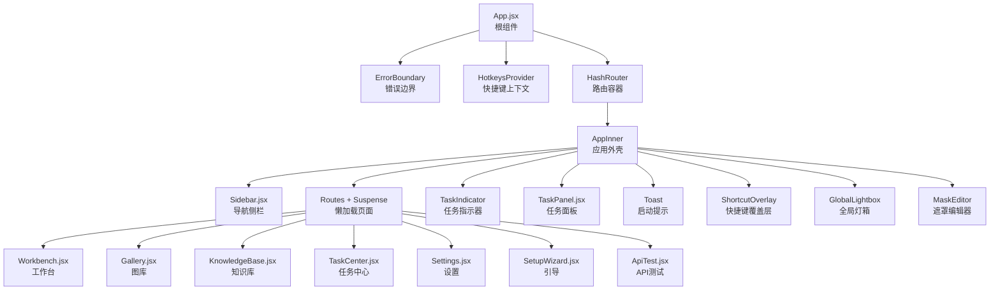
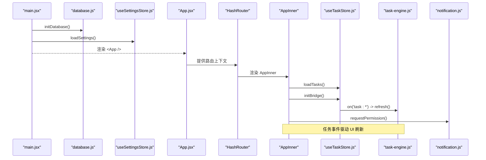
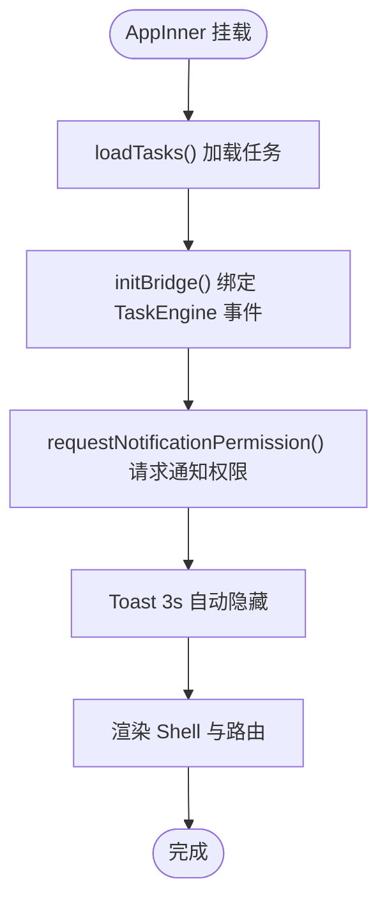
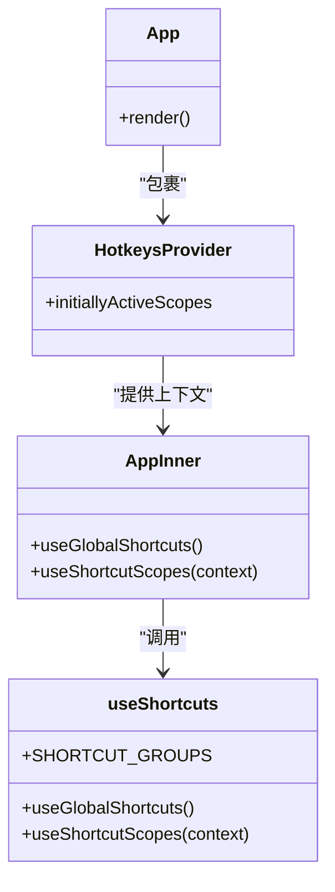
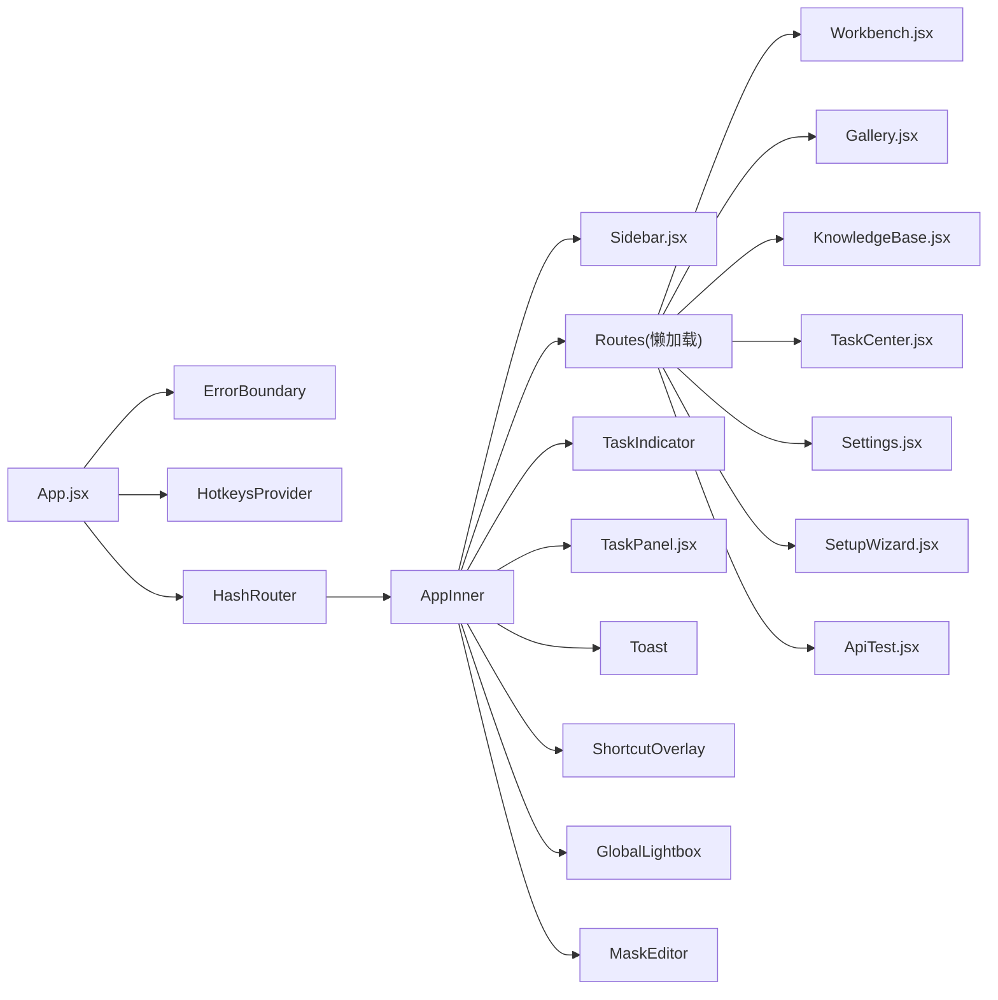
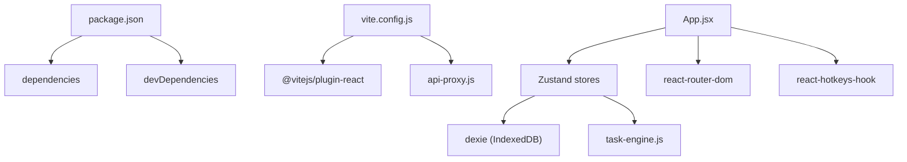

# 根组件设计

<cite>
**本文引用的文件**   
- [app/src/App.jsx](file://app/src/App.jsx)
- [app/src/main.jsx](file://app/src/main.jsx)
- [app/package.json](file://app/package.json)
- [app/vite.config.js](file://app/vite.config.js)
- [app/src/hooks/useShortcuts.js](file://app/src/hooks/useShortcuts.js)
- [app/src/services/notification.js](file://app/src/services/notification.js)
- [app/src/stores/useUIStore.js](file://app/src/stores/useUIStore.js)
- [app/src/stores/useTaskStore.js](file://app/src/stores/useTaskStore.js)
- [app/src/components/Sidebar.jsx](file://app/src/components/Sidebar.jsx)
- [app/src/components/TaskPanel.jsx](file://app/src/components/TaskPanel.jsx)
- [app/src/pages/Workbench.jsx](file://app/src/pages/Workbench.jsx)
- [app/src/services/task-engine.js](file://app/src/services/task-engine.js)
- [app/src/db/database.js](file://app/src/db/database.js)
</cite>

## 目录
1. [简介](#简介)
2. [项目结构](#项目结构)
3. [核心组件](#核心组件)
4. [架构总览](#架构总览)
5. [详细组件分析](#详细组件分析)
6. [依赖关系分析](#依赖关系分析)
7. [性能考量](#性能考量)
8. [故障排查指南](#故障排查指南)
9. [结论](#结论)
10. [附录](#附录)

## 简介
本文件聚焦 AI Image Studio 的根组件 App.jsx，系统性阐述其职责与架构：错误边界 ErrorBoundary、应用外壳 AppInner、路由与懒加载、全局状态集成、快捷键系统初始化、通知权限请求等。同时给出组件树与依赖图、生命周期与副作用处理、性能优化策略，以及关键实现路径与最佳实践。

## 项目结构
根组件位于 app/src/App.jsx，作为整个应用的顶层容器，负责：
- 提供错误边界保护
- 注入快捷键上下文（HotkeysProvider）
- 配置 HashRouter 路由
- 组织应用外壳 AppInner（侧边栏、主内容区、全局浮层）
- 启动任务引擎桥接、请求通知权限、管理 Toast 提示

图表来源
- [app/src/App.jsx:1-364](file://app/src/App.jsx#L1-L364)
- [app/src/components/Sidebar.jsx:1-200](file://app/src/components/Sidebar.jsx#L1-L200)
- [app/src/components/TaskPanel.jsx:1-200](file://app/src/components/TaskPanel.jsx#L1-L200)
- [app/src/pages/Workbench.jsx:1-200](file://app/src/pages/Workbench.jsx#L1-L200)

章节来源
- [app/src/App.jsx:1-364](file://app/src/App.jsx#L1-L364)
- [app/src/main.jsx:1-32](file://app/src/main.jsx#L1-L32)
- [app/package.json:1-30](file://app/package.json#L1-L30)
- [app/vite.config.js:1-13](file://app/vite.config.js#L1-L13)

## 核心组件
- 错误边界 ErrorBoundary
  - 捕获子树渲染错误，展示友好错误页并提供“重新加载”按钮。
  - 通过 getDerivedStateFromError 更新 hasError/error 状态；componentDidCatch 记录错误日志。
  - 作用域：包裹整个应用，确保任何子组件异常不会导致白屏。

- 应用外壳 AppInner
  - 订阅全局 UI 与任务状态（useUIStore、useTaskStore），控制任务面板、遮罩编辑器、快捷键覆盖层、全局灯箱等。
  - 在 useEffect 中完成：
    - 加载任务并初始化 TaskEngine 事件桥接（返回清理函数）。
    - 请求浏览器通知权限。
    - 自动隐藏启动 Toast。
  - 使用 Suspense 包裹 Routes，配合 lazy 实现页面级懒加载。
  - 布局：左侧 Sidebar，右侧主内容区，底部悬浮任务指示器，顶部/全局浮层（任务面板、Toast、快捷键覆盖层、全局灯箱、遮罩编辑器）。

- 全局灯箱 GlobalLightbox
  - 从 useGenerationStore.results 或 useGalleryStore.images 中定位当前图片，计算索引后传递给 Lightbox。
  - 若目标图片不在任一列表，则构造最小占位对象以维持交互。

- 启动提示 Toast
  - 显示“应用已就绪”，点击可跳转首页，支持关闭。

- 任务指示器 TaskIndicator
  - 固定右下角，显示进行中任务数，悬停显示提示文本，点击打开任务面板。

章节来源
- [app/src/App.jsx:26-62](file://app/src/App.jsx#L26-L62)
- [app/src/App.jsx:245-351](file://app/src/App.jsx#L245-L351)
- [app/src/App.jsx:203-239](file://app/src/App.jsx#L203-L239)
- [app/src/App.jsx:79-113](file://app/src/App.jsx#L79-L113)
- [app/src/App.jsx:115-197](file://app/src/App.jsx#L115-L197)

## 架构总览
根组件将“错误边界 + 快捷键上下文 + 路由”作为外层壳，内部 AppInner 承担业务编排：
- 状态层：Zustand 多 store（UI、任务、生成、图库、设置）
- 服务层：TaskEngine 后台任务调度、通知服务、IndexedDB 持久化
- 视图层：Sidebar、Pages（懒加载）、全局浮层（TaskPanel、Toast、ShortcutOverlay、GlobalLightbox、MaskEditor）

图表来源
- [app/src/main.jsx:1-32](file://app/src/main.jsx#L1-L32)
- [app/src/App.jsx:353-363](file://app/src/App.jsx#L353-L363)
- [app/src/App.jsx:272-284](file://app/src/App.jsx#L272-L284)
- [app/src/stores/useTaskStore.js:39-64](file://app/src/stores/useTaskStore.js#L39-L64)
- [app/src/services/task-engine.js:189-200](file://app/src/services/task-engine.js#L189-L200)
- [app/src/services/notification.js:19-43](file://app/src/services/notification.js#L19-L43)

## 详细组件分析

### 错误边界 ErrorBoundary
- 职责：捕获子树运行时错误，避免崩溃，提供恢复入口。
- 关键点：
  - getDerivedStateFromError 同步更新错误状态。
  - componentDidCatch 输出详细错误信息便于调试。
  - 提供“重新加载”按钮，重置状态并刷新页面。
- 建议：
  - 对网络/异步错误可在上层 try/catch 处理，错误边界主要兜底渲染期错误。

章节来源
- [app/src/App.jsx:26-62](file://app/src/App.jsx#L26-L62)

### 应用外壳 AppInner
- 状态订阅：
  - UI 状态：任务面板开关、主题、遮罩编辑器、快捷键覆盖层、灯箱等。
  - 任务状态：进行中任务计数、任务加载与桥接。
- 副作用：
  - 挂载时加载任务并初始化 TaskEngine 事件桥接，返回清理函数用于卸载时解绑。
  - 挂载时请求通知权限。
  - 启动 Toast 自动消失计时器。
- 路由与懒加载：
  - 使用 React.lazy 与 Suspense 按需加载页面，提升首屏性能。
- 全局浮层：
  - 任务指示器、任务面板、Toast、快捷键覆盖层、全局灯箱、遮罩编辑器。

图表来源
- [app/src/App.jsx:272-292](file://app/src/App.jsx#L272-L292)
- [app/src/App.jsx:316-326](file://app/src/App.jsx#L316-L326)

章节来源
- [app/src/App.jsx:245-351](file://app/src/App.jsx#L245-L351)

### 路由与懒加载策略
- 路由模式：HashRouter，适合静态部署场景。
- 懒加载：
  - Workbench、Gallery、KnowledgeBase、TaskCenter、Settings、SetupWizard、ApiTest 均通过 lazy 动态导入。
  - 使用 Suspense 提供 LoadingSkeleton 骨架屏，提升感知性能。
- 路由表：
  - / → Workbench
  - /gallery → Gallery
  - /knowledge-base → KnowledgeBase
  - /task-center → TaskCenter
  - /settings → Settings
  - /setup → SetupWizard
  - /api-test → ApiTest

章节来源
- [app/src/App.jsx:18-24](file://app/src/App.jsx#L18-L24)
- [app/src/App.jsx:316-326](file://app/src/App.jsx#L316-L326)

### 全局状态管理集成
- Zustand 多 store：
  - useUIStore：UI 开关、主题、灯箱、遮罩编辑器、快捷键覆盖层、Toast 队列。
  - useTaskStore：任务列表、活动任务计数、与 TaskEngine 的事件桥接。
  - useGenerationStore：工作区生成流程、结果、批处理历史等。
  - useGalleryStore：图库数据与文件夹管理。
  - useSettingsStore：应用设置持久化。
- 集成方式：
  - AppInner 订阅必要状态，触发 UI 行为（如打开/关闭面板）。
  - TaskEngine 事件驱动 useTaskStore.refresh，进而驱动 UI 实时更新。

章节来源
- [app/src/stores/useUIStore.js:1-159](file://app/src/stores/useUIStore.js#L1-L159)
- [app/src/stores/useTaskStore.js:1-173](file://app/src/stores/useTaskStore.js#L1-L173)
- [app/src/stores/useGenerationStore.js:1-200](file://app/src/stores/useGenerationStore.js#L1-L200)

### 快捷键系统初始化
- 基于 react-hotkeys-hook v5，采用 scope 机制实现优先级：
  - mask-editor > lightbox > workbench > gallery > global
- 初始化流程：
  - HotkeysProvider 初始激活 'global' 作用域。
  - AppInner 调用 useGlobalShortcuts 注册各作用域快捷键。
  - useShortcutScopes 根据 UI 状态切换作用域启用/禁用。
- 典型快捷键：
  - Shift+/ 打开快捷键覆盖层
  - Esc 关闭覆盖层/灯箱
  - G+W/G+G/G+K/G+T 快速导航
  - 工作台：Ctrl/Cmd+Enter 生成、E 扩写提示词、1/2/3 切换模型

图表来源
- [app/src/App.jsx:353-363](file://app/src/App.jsx#L353-L363)
- [app/src/hooks/useShortcuts.js:22-134](file://app/src/hooks/useShortcuts.js#L22-L134)

章节来源
- [app/src/hooks/useShortcuts.js:1-185](file://app/src/hooks/useShortcuts.js#L1-L185)
- [app/src/App.jsx:267-270](file://app/src/App.jsx#L267-L270)

### 通知权限请求
- 启动阶段调用 requestPermission，兼容不支持或不允许的情况。
- 成功授权后，后续任务完成/失败可通过 notifyTaskComplete/notifyTaskFailed 推送系统通知。

章节来源
- [app/src/App.jsx:282-284](file://app/src/App.jsx#L282-L284)
- [app/src/services/notification.js:19-43](file://app/src/services/notification.js#L19-L43)

### 组件树结构与依赖关系

图表来源
- [app/src/App.jsx:1-364](file://app/src/App.jsx#L1-L364)
- [app/src/components/Sidebar.jsx:1-200](file://app/src/components/Sidebar.jsx#L1-L200)
- [app/src/components/TaskPanel.jsx:1-200](file://app/src/components/TaskPanel.jsx#L1-L200)
- [app/src/pages/Workbench.jsx:1-200](file://app/src/pages/Workbench.jsx#L1-L200)

## 依赖关系分析
- 外部依赖（来自 package.json）：
  - react、react-dom、react-router-dom、react-hotkeys-hook、zustand、dexie、immer、lucide-react、axios、ali-oss、uuid 等。
- 构建与开发：
  - Vite + @vitejs/plugin-react，自定义插件 api-proxy 用于本地 API 代理。
- 模块耦合：
  - App.jsx 低耦合于具体页面，通过路由与懒加载解耦。
  - 通过 Zustand store 与 TaskEngine 事件进行跨组件通信，降低直接依赖。

图表来源
- [app/package.json:1-30](file://app/package.json#L1-L30)
- [app/vite.config.js:1-13](file://app/vite.config.js#L1-L13)
- [app/src/App.jsx:1-16](file://app/src/App.jsx#L1-L16)

章节来源
- [app/package.json:1-30](file://app/package.json#L1-L30)
- [app/vite.config.js:1-13](file://app/vite.config.js#L1-L13)

## 性能考量
- 路由懒加载：所有页面组件使用 React.lazy 动态导入，减少首屏体积。
- 骨架屏：Suspense fallback 提供 LoadingSkeleton，改善用户感知。
- 状态订阅粒度：useUIStore/useTaskStore 仅订阅所需字段，避免不必要重渲染。
- 事件桥接：TaskEngine 事件统一刷新任务列表，避免频繁全量更新。
- 资源释放：initBridge 返回清理函数，在卸载时解绑事件监听，防止内存泄漏。
- 构建优化：Vite 开发服务器严格端口与 host 配置，保证稳定环境。

[本节为通用指导，不直接分析具体文件]

## 故障排查指南
- 错误边界未生效
  - 检查是否在 App 顶层正确包裹 ErrorBoundary。
  - 查看控制台错误日志，确认错误类型是否为渲染期错误。
- 任务面板无数据
  - 确认 loadTasks 是否执行，initBridge 是否正确绑定事件。
  - 检查 IndexedDB 是否有任务记录。
- 快捷键无效
  - 确认 HotkeysProvider 已提供 initialScopes。
  - 检查 useShortcutScopes 是否正确切换作用域。
- 通知无法弹出
  - 检查浏览器是否支持 Notification API，权限是否授予。
  - 确认 requestPermission 是否被调用且返回 granted。

章节来源
- [app/src/App.jsx:26-62](file://app/src/App.jsx#L26-L62)
- [app/src/stores/useTaskStore.js:39-64](file://app/src/stores/useTaskStore.js#L39-L64)
- [app/src/hooks/useShortcuts.js:116-134](file://app/src/hooks/useShortcuts.js#L116-L134)
- [app/src/services/notification.js:19-43](file://app/src/services/notification.js#L19-L43)

## 结论
App.jsx 作为根组件，承担了错误防护、全局上下文注入、路由与懒加载、应用外壳编排、全局状态与后台任务集成、快捷键与通知等关键职责。通过清晰的职责划分与模块化设计，实现了高内聚、低耦合的可维护架构。结合懒加载、骨架屏与事件驱动的刷新策略，整体具备良好的用户体验与性能表现。

[本节为总结性内容，不直接分析具体文件]

## 附录
- 关键实现路径参考
  - 错误边界实现：[app/src/App.jsx:26-62](file://app/src/App.jsx#L26-L62)
  - 应用外壳与副作用：[app/src/App.jsx:245-351](file://app/src/App.jsx#L245-L351)
  - 路由与懒加载：[app/src/App.jsx:18-24](file://app/src/App.jsx#L18-L24), [app/src/App.jsx:316-326](file://app/src/App.jsx#L316-L326)
  - 全局灯箱逻辑：[app/src/App.jsx:203-239](file://app/src/App.jsx#L203-L239)
  - 快捷键系统与作用域：[app/src/hooks/useShortcuts.js:22-134](file://app/src/hooks/useShortcuts.js#L22-L134)
  - 通知权限与服务：[app/src/services/notification.js:19-43](file://app/src/services/notification.js#L19-L43)
  - 任务存储与事件桥接：[app/src/stores/useTaskStore.js:39-64](file://app/src/stores/useTaskStore.js#L39-L64)
  - 任务引擎类与方法：[app/src/services/task-engine.js:33-200](file://app/src/services/task-engine.js#L33-L200)
  - 数据库层（Dexie）：[app/src/db/database.js:20-31](file://app/src/db/database.js#L20-L31)
  - 启动引导与设置加载：[app/src/main.jsx:12-29](file://app/src/main.jsx#L12-L29)