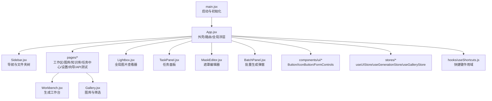
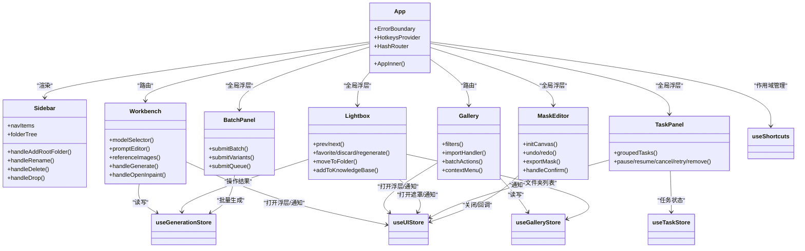
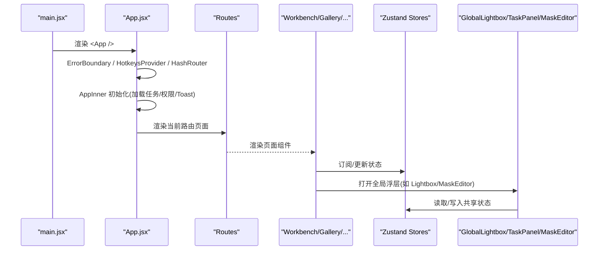
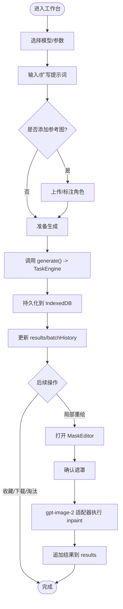
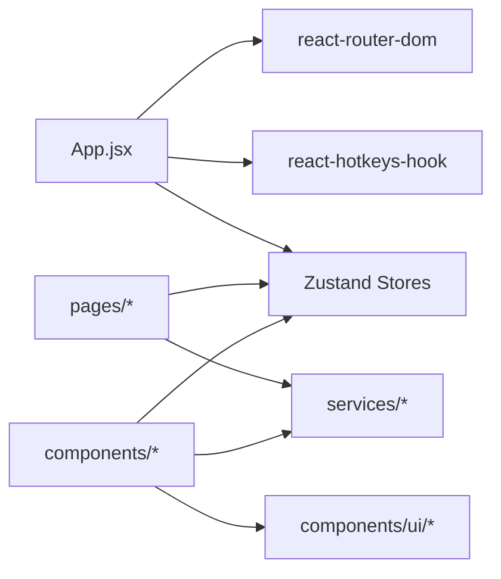

# 组件层次结构

<cite>
**本文引用的文件**
- [main.jsx](file://app/src/main.jsx)
- [App.jsx](file://app/src/App.jsx)
- [Sidebar.jsx](file://app/src/components/Sidebar.jsx)
- [Workbench.jsx](file://app/src/pages/Workbench.jsx)
- [Gallery.jsx](file://app/src/pages/Gallery.jsx)
- [Lightbox.jsx](file://app/src/components/Lightbox.jsx)
- [TaskPanel.jsx](file://app/src/components/TaskPanel.jsx)
- [MaskEditor.jsx](file://app/src/components/MaskEditor.jsx)
- [BatchPanel.jsx](file://app/src/components/BatchPanel.jsx)
- [Button.jsx](file://app/src/components/ui/Button.jsx)
- [useUIStore.js](file://app/src/stores/useUIStore.js)
- [useGenerationStore.js](file://app/src/stores/useGenerationStore.js)
- [useGalleryStore.js](file://app/src/stores/useGalleryStore.js)
- [useShortcuts.js](file://app/src/hooks/useShortcuts.js)
</cite>

## 目录
1. [简介](#简介)
2. [项目结构](#项目结构)
3. [核心组件](#核心组件)
4. [架构总览](#架构总览)
5. [详细组件分析](#详细组件分析)
6. [依赖关系分析](#依赖关系分析)
7. [性能考量](#性能考量)
8. [故障排查指南](#故障排查指南)
9. [结论](#结论)
10. [附录](#附录)

## 简介
本文件面向 AI Image Studio 的 React 前端，系统化梳理组件层次结构、父子关系与通信模式。重点说明根组件 App.jsx 的职责、页面组件的组织方式、可复用组件设计原则，以及状态提升、事件冒泡与上下文传递策略。文档包含组件关系图与依赖图，并讨论可测试性、可维护性与性能优化建议。

## 项目结构
应用采用“页面 + 通用组件 + UI 原子组件 + 全局状态（Zustand）+ 快捷键 Hook”的分层组织：
- 入口与外壳：main.jsx 初始化数据库与设置后挂载 App；App.jsx 提供路由、错误边界、全局浮层与快捷方式作用域。
- 页面：Workbench（工作台）、Gallery（图库）、KnowledgeBase、TaskCenter、Settings、SetupWizard、ApiTest。
- 通用组件：Sidebar（侧边导航与文件夹树）、Lightbox（全屏图片查看）、TaskPanel（任务面板）、MaskEditor（遮罩编辑器）、BatchPanel（批量生成）。
- UI 原子组件：Button、IconButton、FormControls 等。
- 全局状态：useUIStore、useGenerationStore、useGalleryStore、useTaskStore、useSettingsStore。
- 快捷键系统：useShortcuts.js 基于 react-hotkeys-hook 的作用域管理。

图表来源
- [main.jsx:1-32](file://app/src/main.jsx#L1-L32)
- [App.jsx:1-364](file://app/src/App.jsx#L1-L364)
- [Sidebar.jsx:1-371](file://app/src/components/Sidebar.jsx#L1-L371)
- [Workbench.jsx:1-800](file://app/src/pages/Workbench.jsx#L1-L800)
- [Gallery.jsx:1-527](file://app/src/pages/Gallery.jsx#L1-L527)
- [Lightbox.jsx:1-702](file://app/src/components/Lightbox.jsx#L1-L702)
- [TaskPanel.jsx:1-538](file://app/src/components/TaskPanel.jsx#L1-L538)
- [MaskEditor.jsx:1-800](file://app/src/components/MaskEditor.jsx#L1-L800)
- [BatchPanel.jsx:1-675](file://app/src/components/BatchPanel.jsx#L1-L675)
- [Button.jsx:1-57](file://app/src/components/ui/Button.jsx#L1-L57)
- [useUIStore.js:1-159](file://app/src/stores/useUIStore.js#L1-L159)
- [useGenerationStore.js:1-360](file://app/src/stores/useGenerationStore.js#L1-L360)
- [useGalleryStore.js:1-204](file://app/src/stores/useGalleryStore.js#L1-L204)
- [useShortcuts.js:1-185](file://app/src/hooks/useShortcuts.js#L1-L185)

章节来源
- [main.jsx:1-32](file://app/src/main.jsx#L1-L32)
- [App.jsx:1-364](file://app/src/App.jsx#L1-L364)

## 核心组件
- 根外壳 App.jsx
  - 职责：错误边界、热键作用域提供者、HashRouter 路由容器、全局浮层（任务指示器、任务面板、Toast、全局 Lightbox、遮罩编辑器）、主题与样式注入。
  - 关键子组件：Sidebar、TaskIndicator、TaskPanel、ShortcutOverlay、GlobalLightbox、MaskEditor。
  - 全局状态订阅：useUIStore、useGenerationStore、useGalleryStore、useTaskStore。
  - 路由懒加载：Workbench、Gallery、KnowledgeBase、TaskCenter、Settings、SetupWizard、ApiTest。
- 侧边栏 Sidebar.jsx
  - 职责：主导航、文件夹树构建与交互（创建/重命名/删除/拖拽移动）、当前文件夹选择与路由联动。
  - 状态来源：useGalleryStore（folders、currentFolder、actions），useUIStore（addToast）。
- 工作台 Workbench.jsx
  - 职责：模型选择、提示词编辑与扩写、参考图上传与管理、参数控制、生成流程编排、结果展示与操作（收藏/淘汰/下载/局部重绘/重新生成）、批量生成入口。
  - 状态来源：useGenerationStore（模型、提示词、参数、结果、批历史、生成标志）、useUIStore（openLightbox/openMaskEditor/addToast）。
- 图库 Gallery.jsx
  - 职责：图片列表渲染（网格/列表）、搜索与过滤（关键词/日期/比例/收藏）、批量操作（收藏/移动/导出/删除）、导入本地图片、右键菜单与详情抽屉。
  - 状态来源：useGalleryStore（images/folders/viewMode/selectedImages/actions）、useUIStore（openLightbox/openMaskEditor/addToast）、useGenerationStore（跳转回工作台并回填参数）。
- 全局 Lightbox.jsx
  - 职责：全屏浏览、缩放、复制提示词、收藏/淘汰/重新生成、移动到文件夹、加入知识库、打开遮罩编辑器。
  - 状态来源：useGenerationStore（favorite/discard/regenerate/addReferenceImage）、useUIStore（openMaskEditor/addToast）、useGalleryStore（folders）。
- 任务面板 TaskPanel.jsx
  - 职责：按状态分组显示任务（进行中/排队中/已完成/失败），支持暂停/继续/取消/重试/移除。
  - 状态来源：useTaskStore（tasks/actions），useUIStore（addToast）。
- 遮罩编辑器 MaskEditor.jsx
  - 职责：双画布遮罩绘制（画笔/橡皮擦/撤销/重做/全选/清除/反转/上传外部遮罩）、缩放平移、对比原图、导出黑白遮罩并回调确认。
  - 触发来源：Workbench/Gallery/Lightbox 通过 useUIStore.openMaskEditor 打开。
- 批量生成 BatchPanel.jsx
  - 职责：多批次/多变体/Prompt 队列三种模式，循环调用生成接口并反馈进度与结果。
  - 状态来源：useGenerationStore（generate/setPrompt/setParam）、useUIStore（addToast）。
- UI 原子 Button.jsx
  - 职责：统一按钮变体与尺寸类名，提供 IconButton 图标按钮。

章节来源
- [App.jsx:1-364](file://app/src/App.jsx#L1-L364)
- [Sidebar.jsx:1-371](file://app/src/components/Sidebar.jsx#L1-L371)
- [Workbench.jsx:1-800](file://app/src/pages/Workbench.jsx#L1-L800)
- [Gallery.jsx:1-527](file://app/src/pages/Gallery.jsx#L1-L527)
- [Lightbox.jsx:1-702](file://app/src/components/Lightbox.jsx#L1-L702)
- [TaskPanel.jsx:1-538](file://app/src/components/TaskPanel.jsx#L1-L538)
- [MaskEditor.jsx:1-800](file://app/src/components/MaskEditor.jsx#L1-L800)
- [BatchPanel.jsx:1-675](file://app/src/components/BatchPanel.jsx#L1-L675)
- [Button.jsx:1-57](file://app/src/components/ui/Button.jsx#L1-L57)

## 架构总览
整体采用“外壳 + 页面 + 浮层 + 全局状态 + 快捷键作用域”的架构。App 作为外壳负责全局能力装配，页面聚焦业务场景，浮层承载跨页面能力（Lightbox、MaskEditor、TaskPanel），全局状态集中管理跨组件数据，快捷键系统通过作用域优先级避免冲突。

图表来源
- [App.jsx:1-364](file://app/src/App.jsx#L1-L364)
- [Sidebar.jsx:1-371](file://app/src/components/Sidebar.jsx#L1-L371)
- [Workbench.jsx:1-800](file://app/src/pages/Workbench.jsx#L1-L800)
- [Gallery.jsx:1-527](file://app/src/pages/Gallery.jsx#L1-L527)
- [Lightbox.jsx:1-702](file://app/src/components/Lightbox.jsx#L1-L702)
- [TaskPanel.jsx:1-538](file://app/src/components/TaskPanel.jsx#L1-L538)
- [MaskEditor.jsx:1-800](file://app/src/components/MaskEditor.jsx#L1-L800)
- [BatchPanel.jsx:1-675](file://app/src/components/BatchPanel.jsx#L1-L675)
- [useUIStore.js:1-159](file://app/src/stores/useUIStore.js#L1-L159)
- [useGenerationStore.js:1-360](file://app/src/stores/useGenerationStore.js#L1-L360)
- [useGalleryStore.js:1-204](file://app/src/stores/useGalleryStore.js#L1-L204)
- [useShortcuts.js:1-185](file://app/src/hooks/useShortcuts.js#L1-L185)

## 详细组件分析

### 根组件 App.jsx 的职责与布局
- 错误边界：捕获子树异常并提供“重新加载”恢复路径。
- 热键作用域：使用 HotkeysProvider 初始作用域为 global，并在 AppInner 中根据页面与浮层状态动态切换作用域。
- 路由：HashRouter + Routes 定义各页面路由，配合 Suspense 与 LoadingSkeleton 实现懒加载骨架屏。
- 全局浮层：
  - TaskIndicator：右下角浮动按钮，显示进行中的任务数，点击打开 TaskPanel。
  - TaskPanel：右侧滑出面板，分组展示任务及操作。
  - Toast：顶部通知，自动消失。
  - GlobalLightbox：从任意页面打开的全局图片查看器，数据来源为 useGenerationStore.results 或 useGalleryStore.images。
  - MaskEditor：遮罩编辑器，由 Workbench/Gallery/Lightbox 通过 useUIStore.openMaskEditor 打开。
- 初始化：加载任务、请求通知权限、Toast 自动隐藏。

图表来源
- [main.jsx:1-32](file://app/src/main.jsx#L1-L32)
- [App.jsx:1-364](file://app/src/App.jsx#L1-L364)
- [useUIStore.js:1-159](file://app/src/stores/useUIStore.js#L1-L159)
- [useGenerationStore.js:1-360](file://app/src/stores/useGenerationStore.js#L1-L360)
- [useGalleryStore.js:1-204](file://app/src/stores/useGalleryStore.js#L1-L204)

章节来源
- [App.jsx:1-364](file://app/src/App.jsx#L1-L364)

### 页面组件组织结构与工作流
- 工作台 Workbench
  - 模型选择与参数同步：根据模型能力调整默认参数与数量范围。
  - 提示词扩写：调用 LLM 适配器扩展提示词，用户可选择使用。
  - 参考图管理：上传/角色标注/上限校验。
  - 生成流程：封装为 useGenerationStore.generate，提交到 TaskEngine，持久化到 IndexedDB，完成后更新 results 与 batchHistory。
  - 局部重绘：打开 MaskEditor，确认后以 gpt-image-2 适配器执行 inpaint，结果追加至 results。
- 图库 Gallery
  - 搜索与过滤：关键词搜索、日期/比例/收藏过滤，客户端二次筛选。
  - 批量操作：收藏/移动/导出/删除，结合 useGalleryStore.batchAction。
  - 导入本地图片：生成缩略图与尺寸信息，写入数据库并刷新列表。
  - 与工作台联动：右键菜单可将图片设为参考图或回填参数回到工作台再生成。

图表来源
- [Workbench.jsx:1-800](file://app/src/pages/Workbench.jsx#L1-L800)
- [useGenerationStore.js:1-360](file://app/src/stores/useGenerationStore.js#L1-L360)
- [MaskEditor.jsx:1-800](file://app/src/components/MaskEditor.jsx#L1-L800)

章节来源
- [Workbench.jsx:1-800](file://app/src/pages/Workbench.jsx#L1-L800)
- [Gallery.jsx:1-527](file://app/src/pages/Gallery.jsx#L1-L527)

### 可复用组件与设计原则
- 原子组件 Button/IconButton：通过 variant 与 size 组合类名，保持样式一致性与可扩展性。
- 浮层组件 Lightbox/TaskPanel/MaskEditor/BatchPanel：
  - 受控开关：通过 isOpen 与 onClose 控制显隐。
  - 数据源：从 Zustand store 读取所需数据，避免重复状态。
  - 副作用：在组件内处理键盘事件、窗口事件、DOM 监听，确保生命周期清理。
- 侧边栏 Sidebar：
  - 文件夹树递归渲染：buildFolderTree 将扁平列表转为树形结构，FolderItem 递归渲染。
  - 交互：双击重命名、右键菜单、拖拽移动图片、新增子文件夹。

章节来源
- [Button.jsx:1-57](file://app/src/components/ui/Button.jsx#L1-L57)
- [Lightbox.jsx:1-702](file://app/src/components/Lightbox.jsx#L1-L702)
- [TaskPanel.jsx:1-538](file://app/src/components/TaskPanel.jsx#L1-L538)
- [MaskEditor.jsx:1-800](file://app/src/components/MaskEditor.jsx#L1-L800)
- [BatchPanel.jsx:1-675](file://app/src/components/BatchPanel.jsx#L1-L675)
- [Sidebar.jsx:1-371](file://app/src/components/Sidebar.jsx#L1-L371)

### 状态提升、事件冒泡与上下文传递
- 状态提升策略
  - 全局 UI 状态（侧边栏折叠、Lightbox、任务面板、主题、遮罩编辑器开关）集中在 useUIStore，App 层订阅并向下传递 open/close 回调。
  - 生成相关状态（模型、提示词、参数、结果、批历史）集中在 useGenerationStore，Workbench 与 Lightbox 共同消费。
  - 图库与文件夹状态集中在 useGalleryStore，Sidebar 与 Gallery 共同消费。
- 事件冒泡机制
  - 浮层内部事件（如 Lightbox 的左右切换、缩放）在组件内自行处理，避免冒泡干扰上层。
  - 全局快捷键通过 useShortcuts.js 的作用域管理，优先级从高到低：mask-editor > lightbox > workbench > gallery > global，防止冲突。
- 上下文传递模式
  - 路由上下文：React Router 的 useLocation/useNavigate 用于导航与高亮。
  - 热键上下文：react-hotkeys-hook 的 useHotkeysContext 提供 toggleScope，App 层统一管理作用域激活。

章节来源
- [useUIStore.js:1-159](file://app/src/stores/useUIStore.js#L1-L159)
- [useGenerationStore.js:1-360](file://app/src/stores/useGenerationStore.js#L1-L360)
- [useGalleryStore.js:1-204](file://app/src/stores/useGalleryStore.js#L1-L204)
- [useShortcuts.js:1-185](file://app/src/hooks/useShortcuts.js#L1-L185)
- [App.jsx:1-364](file://app/src/App.jsx#L1-L364)

## 依赖关系分析
- 组件耦合度
  - App 与页面：松耦合，通过路由与 Suspense 解耦。
  - 页面与浮层：通过 useUIStore 的 open/close 回调与状态字段解耦，避免直接引用。
  - 页面与 Store：强依赖各自领域 Store，职责清晰。
  - 浮层与 Store：Lightbox 同时依赖 generation 与 gallery 两个 Store，但仅读取必要字段，保持低耦合。
- 外部依赖
  - react-router-dom：路由与导航。
  - react-hotkeys-hook：快捷键与作用域。
  - zustand + immer：轻量状态管理与不可变更新。
  - lucide-react：图标库。
  - IndexedDB 与 StorageService：数据持久化与图片存储。

图表来源
- [App.jsx:1-364](file://app/src/App.jsx#L1-L364)
- [useShortcuts.js:1-185](file://app/src/hooks/useShortcuts.js#L1-L185)
- [useUIStore.js:1-159](file://app/src/stores/useUIStore.js#L1-L159)
- [useGenerationStore.js:1-360](file://app/src/stores/useGenerationStore.js#L1-L360)
- [useGalleryStore.js:1-204](file://app/src/stores/useGalleryStore.js#L1-L204)

章节来源
- [App.jsx:1-364](file://app/src/App.jsx#L1-L364)
- [useShortcuts.js:1-185](file://app/src/hooks/useShortcuts.js#L1-L185)

## 性能考量
- 路由懒加载：页面组件使用 lazy + Suspense，减少首屏体积。
- 状态订阅粒度：Zustand 允许精确订阅，避免无关重渲染。
- 大列表渲染：Gallery 使用分页加载（displayCount）与虚拟滚动思路（按需加载更多）。
- Canvas 性能：MaskEditor 采样像素计算遮罩百分比，限制历史记录长度，避免内存膨胀。
- 图片资源：StorageService 与缩略图策略降低大图传输成本。
- 事件监听清理：所有 window/document 事件均在 useEffect 中注册与清理，防止泄漏。

[本节为通用指导，不直接分析具体文件]

## 故障排查指南
- 错误边界
  - 现象：子树抛出异常时显示错误界面与“重新加载”按钮。
  - 定位：检查 App.jsx 的 ErrorBoundary 捕获逻辑与子组件异常堆栈。
- 快捷键冲突
  - 现象：某些快捷键无效或误触发。
  - 定位：检查 useShortcuts.js 的作用域优先级与条件启用逻辑，确认页面与浮层状态。
- 生成失败
  - 现象：生成报错或无结果。
  - 定位：查看 useGenerationStore.generate 的错误分支与 IndexedDB 记录状态（pending/failed/completed）。
- 遮罩编辑器无法打开
  - 现象：点击局部重绘无响应。
  - 定位：检查 useUIStore.openMaskEditor 的调用与 sourceImage 有效性，确认 MaskEditor 的 isOpen 状态。

章节来源
- [App.jsx:26-62](file://app/src/App.jsx#L26-L62)
- [useShortcuts.js:1-185](file://app/src/hooks/useShortcuts.js#L1-L185)
- [useGenerationStore.js:112-290](file://app/src/stores/useGenerationStore.js#L112-L290)
- [useUIStore.js:135-143](file://app/src/stores/useUIStore.js#L135-L143)

## 结论
AI Image Studio 的组件层次结构清晰、职责划分明确：App 作为外壳提供全局能力，页面组件专注业务场景，浮层组件承载跨页面功能，Zustand 集中管理状态，快捷键系统通过作用域避免冲突。该架构具备良好的可测试性（组件可独立测试、Store 可模拟）、可维护性（分层清晰、依赖明确）与性能优化空间（懒加载、精准订阅、Canvas 采样与分页加载）。

[本节为总结，不直接分析具体文件]

## 附录
- 组件间通信模式速览
  - Props 传递：父组件向子组件传递数据与回调（如 TaskPanel 的 isOpen/onClose）。
  - Store 订阅：组件通过 Zustand 订阅共享状态（如 Lightbox 订阅 results/folders）。
  - 回调函数：子组件通过 props 回调通知父组件（如 MaskEditor.onConfirm）。
  - 路由上下文：useLocation/useNavigate 驱动导航与高亮。
  - 热键上下文：useHotkeysContext 管理作用域激活。

[本节为概念性内容，不直接分析具体文件]