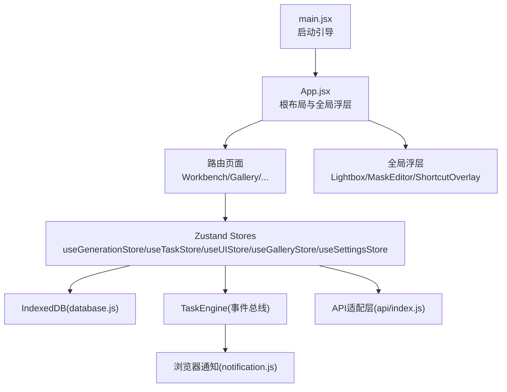
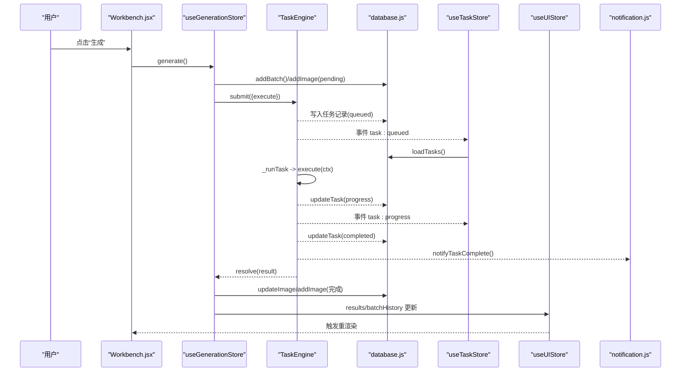
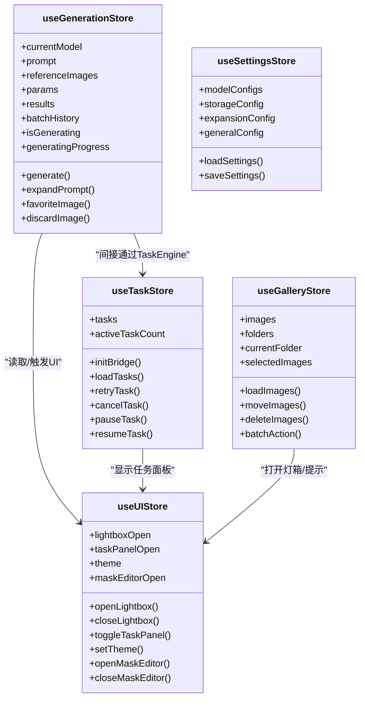
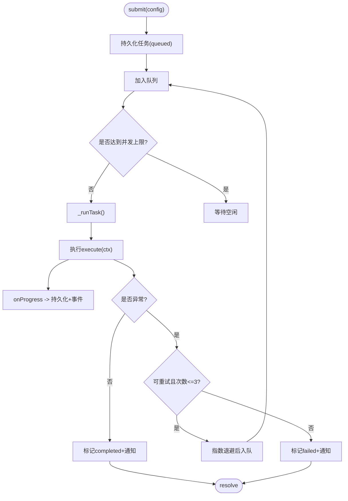
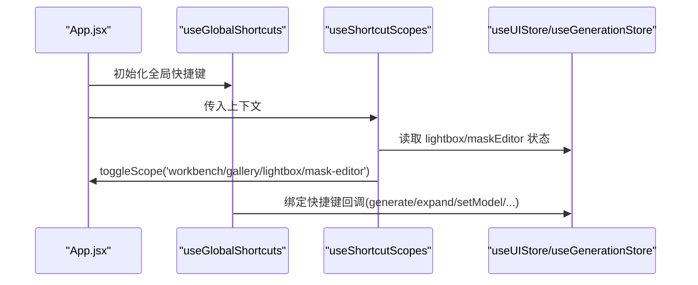
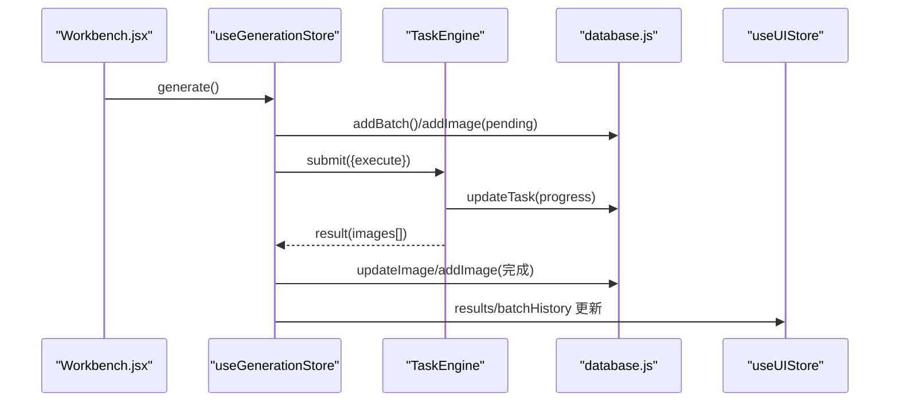
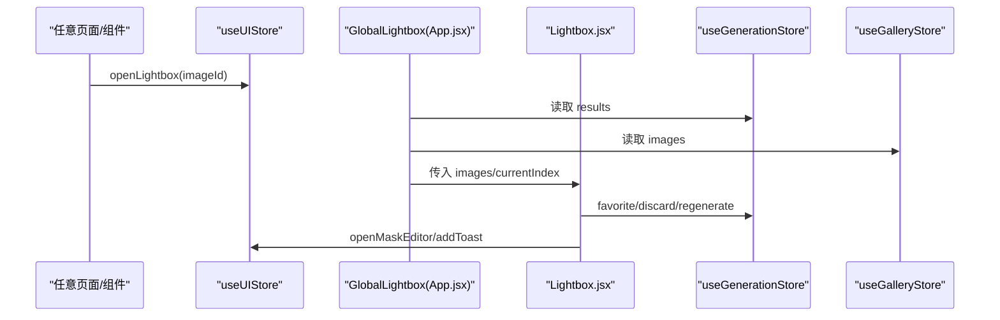
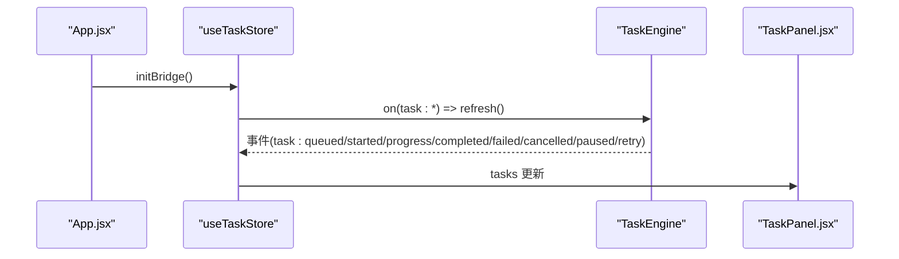
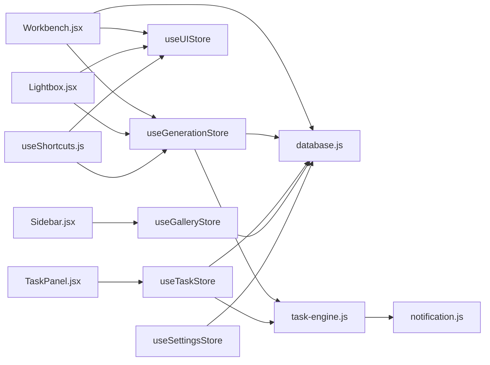

# 组件通信模式

<cite>
**本文引用的文件**   
- [App.jsx](file://app/src/App.jsx)
- [main.jsx](file://app/src/main.jsx)
- [useGenerationStore.js](file://app/src/stores/useGenerationStore.js)
- [useTaskStore.js](file://app/src/stores/useTaskStore.js)
- [useUIStore.js](file://app/src/stores/useUIStore.js)
- [useGalleryStore.js](file://app/src/stores/useGalleryStore.js)
- [useSettingsStore.js](file://app/src/stores/useSettingsStore.js)
- [useShortcuts.js](file://app/src/hooks/useShortcuts.js)
- [task-engine.js](file://app/src/services/task-engine.js)
- [notification.js](file://app/src/services/notification.js)
- [database.js](file://app/src/db/database.js)
- [Workbench.jsx](file://app/src/pages/Workbench.jsx)
- [Lightbox.jsx](file://app/src/components/Lightbox.jsx)
- [Sidebar.jsx](file://app/src/components/Sidebar.jsx)
- [TaskPanel.jsx](file://app/src/components/TaskPanel.jsx)
- [api/index.js](file://app/src/services/api/index.js)
</cite>

## 目录
1. [简介](#简介)
2. [项目结构](#项目结构)
3. [核心组件](#核心组件)
4. [架构总览](#架构总览)
5. [详细组件分析](#详细组件分析)
6. [依赖分析](#依赖分析)
7. [性能考虑](#性能考虑)
8. [故障排查指南](#故障排查指南)
9. [结论](#结论)
10. [附录](#附录)

## 简介
本文件系统性梳理 AI Image Studio 的组件通信模式，覆盖以下关键机制：
- 基于 Zustand 的全局状态管理（生成、任务、图库、UI、设置）
- 自定义 Hooks 的事件处理与快捷键作用域控制
- 上下文传递（路由、热键上下文）
- 事件总线模式（TaskEngine 事件驱动）
- 状态提升策略、单向数据流实现与组件解耦设计
- 异步通信处理、错误传播机制与数据同步策略
- 适用场景、性能影响与最佳实践

## 项目结构
应用采用“页面 + 组件 + Store + 服务”的分层组织方式。全局入口负责初始化数据库与设置，随后挂载 React 应用；页面与通用组件通过订阅 Zustand store 获取状态并触发更新；后台任务由 TaskEngine 统一调度并通过事件总线通知 UI 刷新。

图示来源
- [main.jsx:1-32](file://app/src/main.jsx#L1-L32)
- [App.jsx:1-364](file://app/src/App.jsx#L1-L364)
- [database.js:1-339](file://app/src/db/database.js#L1-L339)
- [task-engine.js:1-319](file://app/src/services/task-engine.js#L1-L319)
- [notification.js:1-113](file://app/src/services/notification.js#L1-L113)
- [api/index.js:1-39](file://app/src/services/api/index.js#L1-L39)

章节来源
- [main.jsx:1-32](file://app/src/main.jsx#L1-L32)
- [App.jsx:1-364](file://app/src/App.jsx#L1-L364)

## 核心组件
- 全局状态层（Zustand）
  - useGenerationStore：工作区生成流程、结果与批历史
  - useTaskStore：后台任务列表、活跃计数、与 TaskEngine 事件桥接
  - useUIStore：侧栏、灯箱、任务面板、主题、遮罩编辑器开关等
  - useGalleryStore：图库、文件夹、筛选、选择与批量操作
  - useSettingsStore：模型配置、存储配置、扩展配置、通用设置及持久化
- 事件总线（TaskEngine）
  - 任务队列、并发控制、重试与进度上报，事件驱动 UI 刷新
- 自定义 Hook（useShortcuts）
  - 基于 react-hotkeys-hook 的作用域管理与快捷键绑定
- 服务与数据层
  - database.js：IndexedDB 封装
  - notification.js：浏览器通知
  - api/index.js：模型适配器工厂与 LLM 单例

章节来源
- [useGenerationStore.js:1-360](file://app/src/stores/useGenerationStore.js#L1-L360)
- [useTaskStore.js:1-173](file://app/src/stores/useTaskStore.js#L1-L173)
- [useUIStore.js:1-159](file://app/src/stores/useUIStore.js#L1-L159)
- [useGalleryStore.js:1-204](file://app/src/stores/useGalleryStore.js#L1-L204)
- [useSettingsStore.js:1-162](file://app/src/stores/useSettingsStore.js#L1-L162)
- [task-engine.js:1-319](file://app/src/services/task-engine.js#L1-L319)
- [useShortcuts.js:1-185](file://app/src/hooks/useShortcuts.js#L1-L185)
- [database.js:1-339](file://app/src/db/database.js#L1-L339)
- [notification.js:1-113](file://app/src/services/notification.js#L1-L113)
- [api/index.js:1-39](file://app/src/services/api/index.js#L1-L39)

## 架构总览
整体遵循“单向数据流 + 事件驱动”的架构：
- 用户交互在页面或组件中触发 Store 动作
- Store 调用服务（API/DB/TaskEngine）执行副作用
- TaskEngine 通过事件广播任务生命周期变化
- 各 Store 监听事件并刷新 IndexedDB，进而驱动 UI 更新
- 全局浮层（Lightbox、MaskEditor、ShortcutOverlay）通过 useUIStore 跨页面共享

图示来源
- [Workbench.jsx:1-800](file://app/src/pages/Workbench.jsx#L1-L800)
- [useGenerationStore.js:1-360](file://app/src/stores/useGenerationStore.js#L1-L360)
- [task-engine.js:1-319](file://app/src/services/task-engine.js#L1-L319)
- [useTaskStore.js:1-173](file://app/src/stores/useTaskStore.js#L1-L173)
- [database.js:1-339](file://app/src/db/database.js#L1-L339)
- [notification.js:1-113](file://app/src/services/notification.js#L1-L113)

## 详细组件分析

### 全局状态管理（Zustand）
- 职责划分清晰：每个 Store 聚焦一个领域（生成、任务、UI、图库、设置）
- 使用 immer produce 进行不可变更新，减少样板代码
- 异步操作后回写 IndexedDB，保证刷新一致性
- 通过 selector 订阅最小状态片段，避免不必要重渲染

图示来源
- [useGenerationStore.js:1-360](file://app/src/stores/useGenerationStore.js#L1-L360)
- [useTaskStore.js:1-173](file://app/src/stores/useTaskStore.js#L1-L173)
- [useUIStore.js:1-159](file://app/src/stores/useUIStore.js#L1-L159)
- [useGalleryStore.js:1-204](file://app/src/stores/useGalleryStore.js#L1-L204)
- [useSettingsStore.js:1-162](file://app/src/stores/useSettingsStore.js#L1-L162)

章节来源
- [useGenerationStore.js:1-360](file://app/src/stores/useGenerationStore.js#L1-L360)
- [useTaskStore.js:1-173](file://app/src/stores/useTaskStore.js#L1-L173)
- [useUIStore.js:1-159](file://app/src/stores/useUIStore.js#L1-L159)
- [useGalleryStore.js:1-204](file://app/src/stores/useGalleryStore.js#L1-L204)
- [useSettingsStore.js:1-162](file://app/src/stores/useSettingsStore.js#L1-L162)

### 事件总线模式（TaskEngine）
- 提供提交、取消、重试、暂停/恢复、统计等 API
- 内部维护队列与活动任务集合，支持最大并发
- 通过 on/_emit 暴露事件：task:queued、task:started、task:progress、task:completed、task:failed、task:cancelled、task:paused、task:retry
- 失败自动指数退避重试，成功/失败均持久化并触发通知

图示来源
- [task-engine.js:1-319](file://app/src/services/task-engine.js#L1-L319)
- [notification.js:1-113](file://app/src/services/notification.js#L1-L113)

章节来源
- [task-engine.js:1-319](file://app/src/services/task-engine.js#L1-L319)
- [notification.js:1-113](file://app/src/services/notification.js#L1-L113)

### 自定义 Hooks 与快捷键作用域
- useGlobalShortcuts：集中注册全局与工作区快捷键，访问 Store 状态与方法
- useShortcutScopes：根据当前路由与 UI 状态动态启用/禁用作用域，确保优先级（遮罩 > 灯箱 > 工作区 > 图库 > 全局）
- 与 App.jsx 集成，在根层级统一管理作用域

图示来源
- [useShortcuts.js:1-185](file://app/src/hooks/useShortcuts.js#L1-L185)
- [App.jsx:1-364](file://app/src/App.jsx#L1-L364)

章节来源
- [useShortcuts.js:1-185](file://app/src/hooks/useShortcuts.js#L1-L185)
- [App.jsx:1-364](file://app/src/App.jsx#L1-L364)

### 上下文传递与路由
- 路由上下文：React Router 提供 navigate/location，用于导航与条件逻辑
- 热键上下文：react-hotkeys-hook 的 HotkeysProvider 与 useHotkeysContext 提供作用域切换能力
- 应用级 ErrorBoundary 捕获子树错误并提供恢复入口

章节来源
- [App.jsx:1-364](file://app/src/App.jsx#L1-L364)

### 页面与组件间的通信示例

#### 生成流程（Workbench → Store → TaskEngine → DB → UI）
- Workbench 收集参数并调用 useGenerationStore.generate
- Store 创建批次与待完成任务，提交至 TaskEngine
- TaskEngine 执行适配器，上报进度，完成后持久化结果
- Store 更新 results 与 batchHistory，UI 响应式刷新

图示来源
- [Workbench.jsx:1-800](file://app/src/pages/Workbench.jsx#L1-L800)
- [useGenerationStore.js:1-360](file://app/src/stores/useGenerationStore.js#L1-L360)
- [task-engine.js:1-319](file://app/src/services/task-engine.js#L1-L319)
- [database.js:1-339](file://app/src/db/database.js#L1-L339)

章节来源
- [Workbench.jsx:1-800](file://app/src/pages/Workbench.jsx#L1-L800)
- [useGenerationStore.js:1-360](file://app/src/stores/useGenerationStore.js#L1-L360)

#### 全局灯箱（Lightbox）跨页面访问
- App.jsx 中的 GlobalLightbox 从 useGenerationStore.results 与 useGalleryStore.images 中解析目标图片
- Lightbox 组件通过 useUIStore.openLightbox/closeLightbox 控制显隐
- 支持收藏、淘汰、重新生成、设为参考、移动到文件夹、加入知识库等操作

图示来源
- [App.jsx:1-364](file://app/src/App.jsx#L1-L364)
- [Lightbox.jsx:1-702](file://app/src/components/Lightbox.jsx#L1-L702)
- [useGenerationStore.js:1-360](file://app/src/stores/useGenerationStore.js#L1-L360)
- [useGalleryStore.js:1-204](file://app/src/stores/useGalleryStore.js#L1-L204)
- [useUIStore.js:1-159](file://app/src/stores/useUIStore.js#L1-L159)

章节来源
- [App.jsx:1-364](file://app/src/App.jsx#L1-L364)
- [Lightbox.jsx:1-702](file://app/src/components/Lightbox.jsx#L1-L702)

#### 任务面板（TaskPanel）实时刷新
- App.jsx 在启动时调用 useTaskStore.initBridge，订阅 TaskEngine 事件
- 所有任务状态变更都会触发 loadTasks，TaskPanel 自动刷新分组视图

图示来源
- [App.jsx:1-364](file://app/src/App.jsx#L1-L364)
- [useTaskStore.js:1-173](file://app/src/stores/useTaskStore.js#L1-L173)
- [task-engine.js:1-319](file://app/src/services/task-engine.js#L1-L319)
- [TaskPanel.jsx:1-538](file://app/src/components/TaskPanel.jsx#L1-L538)

章节来源
- [useTaskStore.js:1-173](file://app/src/stores/useTaskStore.js#L1-L173)
- [TaskPanel.jsx:1-538](file://app/src/components/TaskPanel.jsx#L1-L538)

#### 侧边栏与图库联动
- Sidebar 通过 useGalleryStore 加载文件夹树、创建/重命名/删除文件夹、拖拽移动选中图片
- 点击文件夹项更新 currentFolder 并导航到 /gallery?folder=...
- Gallery 页面根据 currentFolder 与 filters 查询 images

章节来源
- [Sidebar.jsx:1-371](file://app/src/components/Sidebar.jsx#L1-L371)
- [useGalleryStore.js:1-204](file://app/src/stores/useGalleryStore.js#L1-L204)

### 概念性概览
- 状态提升策略：将跨页面共享的状态（如灯箱、遮罩编辑器、任务面板）提升到 App.jsx 并通过 useUIStore 管理
- 单向数据流：组件只读 Store，通过 actions 修改；Store 再调用服务与持久化
- 组件解耦：通过 Store 与事件总线降低直接耦合，便于测试与替换实现

[本节为概念性说明，不直接分析具体文件]

## 依赖分析
- 模块内聚与耦合
  - Store 之间低耦合，仅通过必要方法或事件间接交互
  - TaskEngine 作为独立单例，被多个 Store 与页面消费
  - database.js 作为唯一持久化入口，避免分散的 DB 访问
- 外部依赖
  - Dexie（IndexedDB）、react-router-dom、react-hotkeys-hook、uuid、immer
- 潜在循环依赖
  - 未发现明显循环引用；Store 与服务/DB 单向依赖

图示来源
- [Workbench.jsx:1-800](file://app/src/pages/Workbench.jsx#L1-L800)
- [useGenerationStore.js:1-360](file://app/src/stores/useGenerationStore.js#L1-L360)
- [useTaskStore.js:1-173](file://app/src/stores/useTaskStore.js#L1-L173)
- [useUIStore.js:1-159](file://app/src/stores/useUIStore.js#L1-L159)
- [useGalleryStore.js:1-204](file://app/src/stores/useGalleryStore.js#L1-L204)
- [useSettingsStore.js:1-162](file://app/src/stores/useSettingsStore.js#L1-L162)
- [useShortcuts.js:1-185](file://app/src/hooks/useShortcuts.js#L1-L185)
- [task-engine.js:1-319](file://app/src/services/task-engine.js#L1-L319)
- [notification.js:1-113](file://app/src/services/notification.js#L1-L113)
- [database.js:1-339](file://app/src/db/database.js#L1-L339)
- [TaskPanel.jsx:1-538](file://app/src/components/TaskPanel.jsx#L1-L538)
- [Lightbox.jsx:1-702](file://app/src/components/Lightbox.jsx#L1-L702)
- [Sidebar.jsx:1-371](file://app/src/components/Sidebar.jsx#L1-L371)

章节来源
- [task-engine.js:1-319](file://app/src/services/task-engine.js#L1-L319)
- [database.js:1-339](file://app/src/db/database.js#L1-L339)

## 性能考虑
- 细粒度订阅：使用 selector 仅订阅需要的字段，减少重渲染
- 不可变更新：immer produce 简化复杂对象更新，避免浅比较失效
- 事件驱动刷新：TaskEngine 事件仅在必要时触发 loadTasks，避免频繁轮询
- 懒加载与 Suspense：页面级 lazy 与 Suspense 降低首屏体积
- 并发控制：TaskEngine 限制并发，避免过多请求导致卡顿
- 本地缓存：IndexedDB 持久化，减少重复网络请求

[本节提供一般性指导，不直接分析具体文件]

## 故障排查指南
- 生成失败
  - 检查 TaskEngine 事件 task:failed 与 error 信息
  - 确认 adapter 抛出错误是否被 catch 并持久化
  - 查看浏览器通知是否触发
- 任务未刷新
  - 确认 App.jsx 已调用 useTaskStore.initBridge
  - 检查 TaskEngine.on 是否正确注册并返回清理函数
- 灯箱无法打开
  - 确认 useUIStore.lightboxOpen 与 lightboxImageId 是否设置
  - 检查 GlobalLightbox 是否能从 results 或 images 中找到对应图片
- 快捷键无效
  - 检查 useShortcutScopes 是否正确启用对应作用域
  - 确认 HotkeysProvider 初始作用域包含 'global'

章节来源
- [task-engine.js:1-319](file://app/src/services/task-engine.js#L1-L319)
- [useTaskStore.js:1-173](file://app/src/stores/useTaskStore.js#L1-L173)
- [App.jsx:1-364](file://app/src/App.jsx#L1-L364)
- [useShortcuts.js:1-185](file://app/src/hooks/useShortcuts.js#L1-L185)

## 结论
本项目通过“Zustand 全局状态 + TaskEngine 事件总线 + IndexedDB 持久化”的组合，实现了清晰的单向数据流与良好的组件解耦。不同通信模式的组合使得跨页面共享、异步任务与实时反馈得以高效实现。建议继续遵循：
- 明确 Store 边界，保持单一职责
- 优先使用事件总线进行跨模块异步通信
- 谨慎提升状态，避免过度耦合
- 对关键路径增加错误边界与用户提示

[本节为总结性内容，不直接分析具体文件]

## 附录
- 适用场景与最佳实践
  - 全局 UI 状态（主题、弹窗、面板）：useUIStore
  - 业务领域状态（生成、图库、设置）：对应 Store
  - 长耗时异步任务：TaskEngine + 事件驱动
  - 跨页面共享浮层：App.jsx 顶层组件 + useUIStore
  - 快捷键与作用域：useShortcuts + HotkeysProvider
- 数据同步策略
  - 先写 DB，再更新 Store，最后触发 UI
  - 失败回滚或降级（例如 pending 记录更新失败则插入新记录）
- 错误传播机制
  - 适配器异常 → Store catch → 持久化错误信息 → 通知用户
  - TaskEngine 失败重试与最终失败通知

[本节为补充说明，不直接分析具体文件]