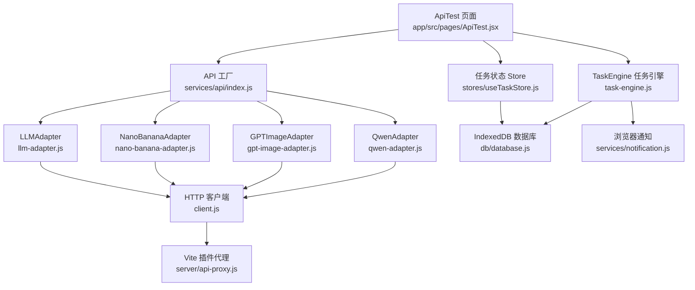
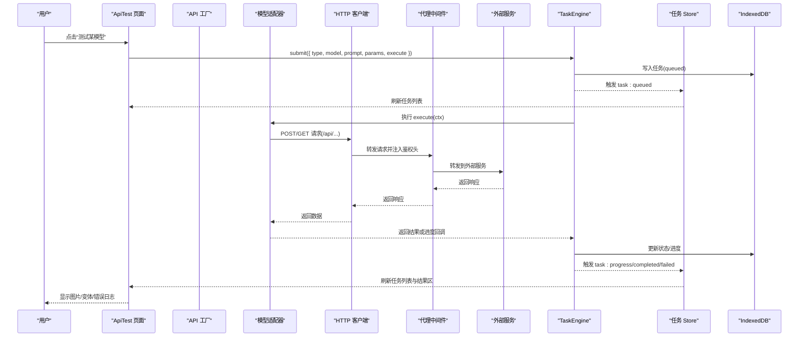
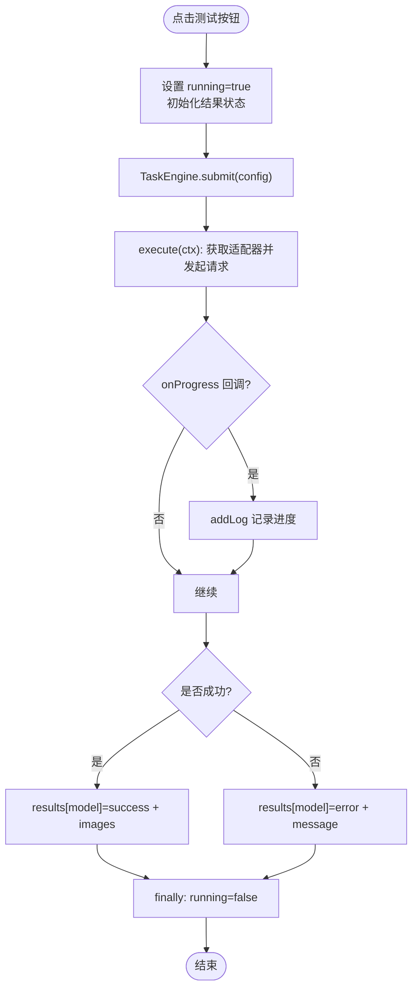
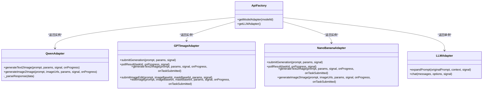
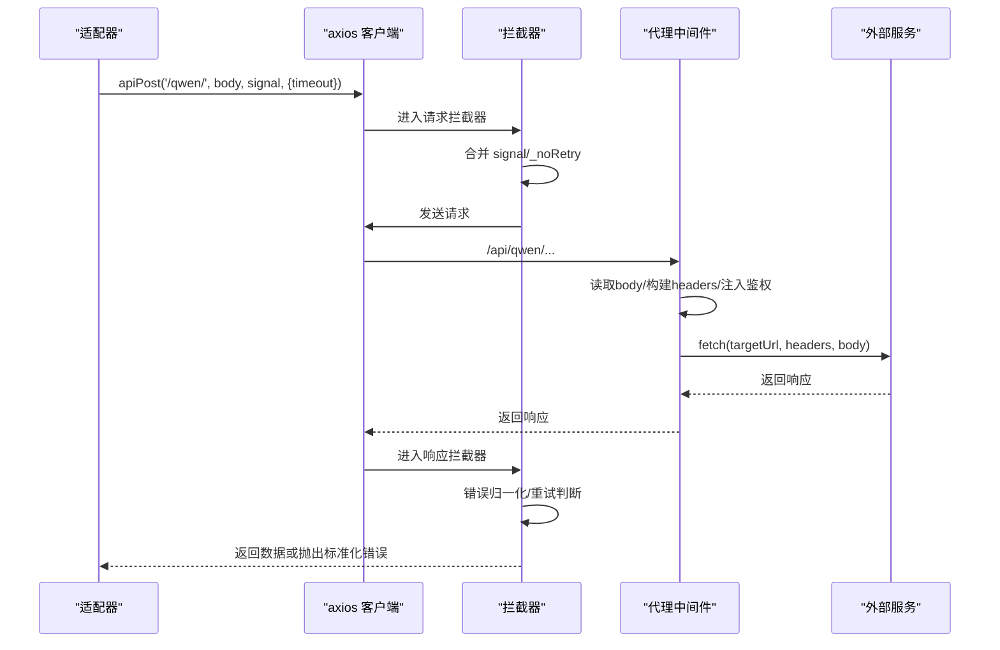
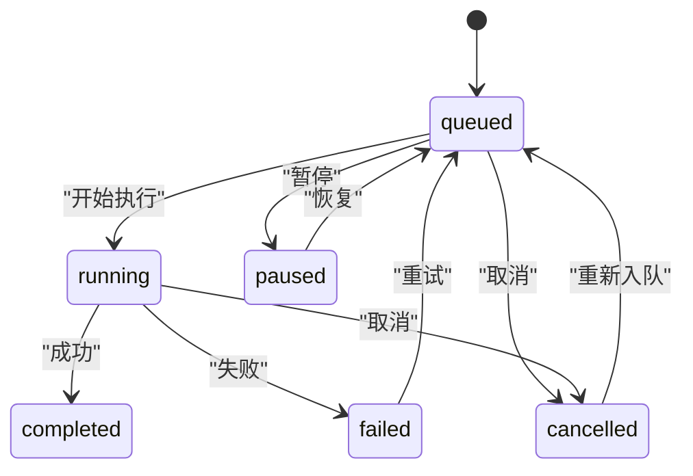
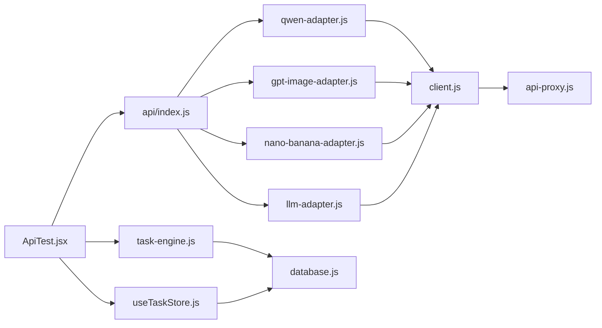

# API 测试页面 (ApiTest)

<cite>
**本文引用的文件**   
- [app/src/pages/ApiTest.jsx](file://app/src/pages/ApiTest.jsx)
- [app/src/services/api/index.js](file://app/src/services/api/index.js)
- [app/src/services/api/client.js](file://app/src/services/api/client.js)
- [app/src/server/api-proxy.js](file://app/src/server/api-proxy.js)
- [app/src/services/api/qwen-adapter.js](file://app/src/services/api/qwen-adapter.js)
- [app/src/services/api/gpt-image-adapter.js](file://app/src/services/api/gpt-image-adapter.js)
- [app/src/services/api/nano-banana-adapter.js](file://app/src/services/api/nano-banana-adapter.js)
- [app/src/services/api/llm-adapter.js](file://app/src/services/api/llm-adapter.js)
- [app/src/services/task-engine.js](file://app/src/services/task-engine.js)
- [app/src/stores/useTaskStore.js](file://app/src/stores/useTaskStore.js)
- [app/src/db/database.js](file://app/src/db/database.js)
- [app/src/services/notification.js](file://app/src/services/notification.js)
</cite>

## 目录
1. [简介](#简介)
2. [项目结构](#项目结构)
3. [核心组件](#核心组件)
4. [架构总览](#架构总览)
5. [详细组件分析](#详细组件分析)
6. [依赖关系分析](#依赖关系分析)
7. [性能与可靠性](#性能与可靠性)
8. [故障排查指南](#故障排查指南)
9. [结论](#结论)
10. [附录](#附录)

## 简介
本文件为 AI Image Studio 的 API 测试页面（ApiTest）提供系统化、可操作的文档。内容覆盖：
- 开发调试能力：请求构造、响应查看、错误诊断工具
- 测试用例的创建、保存与执行机制
- 与各模型适配器（Qwen、GPT-image-2、Nano Banana 2、LLM 扩展）的集成测试逻辑
- 请求日志记录、进度指标收集、调试信息展示
- 模拟响应、断点调试与自动化测试脚本支持建议
- 测试结果分析报告、对比视图与导出功能设计建议
- 开发者友好的调试界面设计与错误定位辅助说明

## 项目结构
ApiTest 页面位于 pages 层，通过 services/api 下的适配器调用后端代理，再由代理转发到各外部服务；任务调度由 TaskEngine 管理，状态持久化在 IndexedDB，UI 状态由 Zustand store 桥接。

图表来源
- [app/src/pages/ApiTest.jsx:1-391](file://app/src/pages/ApiTest.jsx#L1-L391)
- [app/src/services/api/index.js:1-39](file://app/src/services/api/index.js#L1-L39)
- [app/src/services/api/client.js:1-146](file://app/src/services/api/client.js#L1-L146)
- [app/src/server/api-proxy.js:1-190](file://app/src/server/api-proxy.js#L1-L190)
- [app/src/services/api/qwen-adapter.js:1-209](file://app/src/services/api/qwen-adapter.js#L1-L209)
- [app/src/services/api/gpt-image-adapter.js:1-336](file://app/src/services/api/gpt-image-adapter.js#L1-L336)
- [app/src/services/api/nano-banana-adapter.js:1-265](file://app/src/services/api/nano-banana-adapter.js#L1-L265)
- [app/src/services/api/llm-adapter.js:1-150](file://app/src/services/api/llm-adapter.js#L1-L150)
- [app/src/services/task-engine.js:1-319](file://app/src/services/task-engine.js#L1-L319)
- [app/src/stores/useTaskStore.js:1-173](file://app/src/stores/useTaskStore.js#L1-L173)
- [app/src/db/database.js:1-339](file://app/src/db/database.js#L1-L339)
- [app/src/services/notification.js:1-113](file://app/src/services/notification.js#L1-L113)

章节来源
- [app/src/pages/ApiTest.jsx:1-391](file://app/src/pages/ApiTest.jsx#L1-L391)
- [app/src/services/api/index.js:1-39](file://app/src/services/api/index.js#L1-L39)

## 核心组件
- ApiTest 页面：提供统一入口，包含提示词输入、模型测试按钮、结果区、任务引擎状态面板和日志面板。
- API 工厂：按 modelId 返回对应适配器实例，并提供 LLM 单例。
- HTTP 客户端：基于 axios，封装重试、取消、超时、拦截器标准化错误等能力。
- 代理中间件：将 /api/* 路由转发至外部服务并注入鉴权头。
- 模型适配器：分别实现不同模型的请求构造、解析、轮询策略与错误处理。
- 任务引擎：并发控制、队列、状态机、自动重试、进度上报、事件广播。
- 任务 Store：桥接 TaskEngine 事件到 Zustand 状态，供 UI 实时刷新。
- 数据库层：使用 Dexie 持久化任务、图片、批次等数据。
- 通知服务：封装浏览器通知，用于任务完成/失败提醒。

章节来源
- [app/src/pages/ApiTest.jsx:1-391](file://app/src/pages/ApiTest.jsx#L1-L391)
- [app/src/services/api/index.js:1-39](file://app/src/services/api/index.js#L1-L39)
- [app/src/services/api/client.js:1-146](file://app/src/services/api/client.js#L1-L146)
- [app/src/server/api-proxy.js:1-190](file://app/src/server/api-proxy.js#L1-L190)
- [app/src/services/api/qwen-adapter.js:1-209](file://app/src/services/api/qwen-adapter.js#L1-L209)
- [app/src/services/api/gpt-image-adapter.js:1-336](file://app/src/services/api/gpt-image-adapter.js#L1-L336)
- [app/src/services/api/nano-banana-adapter.js:1-265](file://app/src/services/api/nano-banana-adapter.js#L1-L265)
- [app/src/services/api/llm-adapter.js:1-150](file://app/src/services/api/llm-adapter.js#L1-L150)
- [app/src/services/task-engine.js:1-319](file://app/src/services/task-engine.js#L1-L319)
- [app/src/stores/useTaskStore.js:1-173](file://app/src/stores/useTaskStore.js#L1-L173)
- [app/src/db/database.js:1-339](file://app/src/db/database.js#L1-L339)
- [app/src/services/notification.js:1-113](file://app/src/services/notification.js#L1-L113)

## 架构总览
下图展示了从用户点击“测试”到最终结果展示的完整链路，包括异步任务的提交、轮询、进度回调与 UI 更新。

图表来源
- [app/src/pages/ApiTest.jsx:86-203](file://app/src/pages/ApiTest.jsx#L86-L203)
- [app/src/services/task-engine.js:57-92](file://app/src/services/task-engine.js#L57-L92)
- [app/src/services/task-engine.js:222-297](file://app/src/services/task-engine.js#L222-L297)
- [app/src/services/api/client.js:18-88](file://app/src/services/api/client.js#L18-L88)
- [app/src/server/api-proxy.js:121-186](file://app/src/server/api-proxy.js#L121-L186)
- [app/src/stores/useTaskStore.js:39-64](file://app/src/stores/useTaskStore.js#L39-L64)

## 详细组件分析

### ApiTest 页面
- 功能要点
  - 统一的 Prompt 输入框，作为所有模型测试的默认提示词。
  - 四个测试按钮：Qwen Image 3、GPT-image-2、Nano Banana 2、LLM 扩展。
  - 每个模型的结果区块：运行中/成功/失败状态、错误消息、图片网格、LLM 变体文本。
  - 任务引擎状态面板：统计总数、活跃、排队、完成、失败数量及最近任务表格。
  - 日志面板：带时间戳与类型（info/success/error），自动滚动，支持清空。
- 交互流程
  - 点击按钮后设置 running 状态与初始结果，调用 TaskEngine.submit，传入 execute 函数。
  - execute 内部获取对应适配器并调用 generateText2Image，附带进度回调与 AbortSignal。
  - 成功时更新 results[modelId] 为 { status:'success', images }；失败时记录 error。
  - finally 重置 running 状态。
- 调试特性
  - addLog 统一输出结构化日志，便于快速定位问题阶段。
  - 结果区直接展示图片 URL 前缀，方便复制与二次验证。
  - 任务表展示 ID 片段、模型、状态、进度，便于关联日志。

图表来源
- [app/src/pages/ApiTest.jsx:86-203](file://app/src/pages/ApiTest.jsx#L86-L203)
- [app/src/pages/ApiTest.jsx:68-76](file://app/src/pages/ApiTest.jsx#L68-L76)
- [app/src/pages/ApiTest.jsx:272-311](file://app/src/pages/ApiTest.jsx#L272-L311)
- [app/src/pages/ApiTest.jsx:349-387](file://app/src/pages/ApiTest.jsx#L349-L387)

章节来源
- [app/src/pages/ApiTest.jsx:1-391](file://app/src/pages/ApiTest.jsx#L1-L391)

### API 工厂与适配器
- 工厂职责
  - getModelAdapter(modelId)：根据 modelId 返回具体适配器实例。
  - getLLMAdapter()：返回 LLMAdapter 单例，用于提示词扩展。
- 适配器概览
  - QwenAdapter：同步 T2I/I2I，长超时，尺寸规范化，DashScope 错误提取。
  - GPTImageAdapter：EvoLink 异步生成，提交+轮询，指数退避，多种响应格式兼容。
  - NanoBananaAdapter：EvoLink 异步生成，同策略，支持 I2I。
  - LLMAdapter：OpenAI/DashScope 兼容 chat/completions，JSON 数组解析容错。

图表来源
- [app/src/services/api/index.js:20-38](file://app/src/services/api/index.js#L20-L38)
- [app/src/services/api/qwen-adapter.js:51-207](file://app/src/services/api/qwen-adapter.js#L51-L207)
- [app/src/services/api/gpt-image-adapter.js:156-335](file://app/src/services/api/gpt-image-adapter.js#L156-L335)
- [app/src/services/api/nano-banana-adapter.js:125-264](file://app/src/services/api/nano-banana-adapter.js#L125-L264)
- [app/src/services/api/llm-adapter.js:23-149](file://app/src/services/api/llm-adapter.js#L23-L149)

章节来源
- [app/src/services/api/index.js:1-39](file://app/src/services/api/index.js#L1-L39)
- [app/src/services/api/qwen-adapter.js:1-209](file://app/src/services/api/qwen-adapter.js#L1-L209)
- [app/src/services/api/gpt-image-adapter.js:1-336](file://app/src/services/api/gpt-image-adapter.js#L1-L336)
- [app/src/services/api/nano-banana-adapter.js:1-265](file://app/src/services/api/nano-banana-adapter.js#L1-L265)
- [app/src/services/api/llm-adapter.js:1-150](file://app/src/services/api/llm-adapter.js#L1-L150)

### HTTP 客户端与代理
- 客户端能力
  - 基础配置：baseURL=/api，默认超时 60s，长耗时专用 client 超时 5min。
  - 拦截器：统一错误归一化、自动重试（指数退避）、AbortController 信号透传。
  - 便捷方法：apiGet/apiPost/apiPut/apiDelete/createCancellable。
- 代理中间件
  - 路由：/api/qwen、/api/evolink、/api/oss、/api/llm。
  - 鉴权：从环境变量注入 Authorization Bearer 或 OSS 访问头。
  - 转发：读取 body、构建目标 URL、转发请求与响应、过滤不需要的头部。

图表来源
- [app/src/services/api/client.js:18-88](file://app/src/services/api/client.js#L18-L88)
- [app/src/services/api/client.js:100-146](file://app/src/services/api/client.js#L100-L146)
- [app/src/server/api-proxy.js:55-116](file://app/src/server/api-proxy.js#L55-L116)
- [app/src/server/api-proxy.js:121-186](file://app/src/server/api-proxy.js#L121-L186)

章节来源
- [app/src/services/api/client.js:1-146](file://app/src/services/api/client.js#L1-L146)
- [app/src/server/api-proxy.js:1-190](file://app/src/server/api-proxy.js#L1-L190)

### 任务引擎与状态桥接
- 任务引擎
  - 并发控制：最大并发数可调，FIFO 队列。
  - 生命周期：queued -> running -> completed/failed/cancelled/paused，支持失败重试与重入队。
  - 事件系统：task:queued/started/progress/completed/failed/cancelled/paused/retry。
  - 持久化：每次状态变更写库，支持恢复与统计。
- 任务 Store
  - 监听引擎事件，统一刷新 tasks 列表，暴露增删改查与重试/暂停/恢复等操作。
  - 计算 activeTaskCount，供 UI 展示。

图表来源
- [app/src/services/task-engine.js:18-31](file://app/src/services/task-engine.js#L18-L31)
- [app/src/services/task-engine.js:222-297](file://app/src/services/task-engine.js#L222-L297)
- [app/src/stores/useTaskStore.js:39-64](file://app/src/stores/useTaskStore.js#L39-L64)

章节来源
- [app/src/services/task-engine.js:1-319](file://app/src/services/task-engine.js#L1-L319)
- [app/src/stores/useTaskStore.js:1-173](file://app/src/stores/useTaskStore.js#L1-L173)
- [app/src/db/database.js:235-274](file://app/src/db/database.js#L235-L274)

## 依赖关系分析
- 耦合与内聚
  - ApiTest 仅依赖工厂与 TaskEngine，保持高内聚低耦合。
  - 适配器之间无相互依赖，各自独立维护协议细节。
  - 客户端与代理解耦，通过标准 REST 接口通信。
- 外部依赖
  - axios：HTTP 请求与拦截器。
  - Dexie：IndexedDB 封装。
  - uuid：任务 ID 生成。
- 潜在循环依赖
  - 当前未发现循环引用；适配器只依赖 client，TaskEngine 不反向依赖适配器。

图表来源
- [app/src/pages/ApiTest.jsx:1-391](file://app/src/pages/ApiTest.jsx#L1-L391)
- [app/src/services/api/index.js:1-39](file://app/src/services/api/index.js#L1-L39)
- [app/src/services/api/client.js:1-146](file://app/src/services/api/client.js#L1-L146)
- [app/src/server/api-proxy.js:1-190](file://app/src/server/api-proxy.js#L1-L190)
- [app/src/services/task-engine.js:1-319](file://app/src/services/task-engine.js#L1-L319)
- [app/src/stores/useTaskStore.js:1-173](file://app/src/stores/useTaskStore.js#L1-L173)
- [app/src/db/database.js:1-339](file://app/src/db/database.js#L1-L339)

章节来源
- [app/src/pages/ApiTest.jsx:1-391](file://app/src/pages/ApiTest.jsx#L1-L391)
- [app/src/services/api/index.js:1-39](file://app/src/services/api/index.js#L1-L39)
- [app/src/services/api/client.js:1-146](file://app/src/services/api/client.js#L1-L146)
- [app/src/server/api-proxy.js:1-190](file://app/src/server/api-proxy.js#L1-L190)
- [app/src/services/task-engine.js:1-319](file://app/src/services/task-engine.js#L1-L319)
- [app/src/stores/useTaskStore.js:1-173](file://app/src/stores/useTaskStore.js#L1-L173)
- [app/src/db/database.js:1-339](file://app/src/db/database.js#L1-L339)

## 性能与可靠性
- 超时与重试
  - 通用请求默认 60s 超时；Qwen 同步生成使用 5min 长超时。
  - 客户端内置指数退避重试（最多 3 次），适配网络抖动与 5xx。
  - 适配器层对提交阶段也实现自定义重试，避免代理 502 导致失败。
- 轮询策略
  - 初始间隔 2s，指数增长至最大 10s，总等待上限 5min，支持取消。
  - 进度估算采用对数曲线，避免长时间无反馈。
- 并发与队列
  - 任务引擎默认最大并发 3，FIFO 队列，失败自动重试并重入队。
- 资源释放
  - 通过 AbortController 支持中断，避免悬挂请求与内存泄漏。
- 存储与 IO
  - 任务状态落库，保障刷新后可恢复；批量更新减少频繁 IO。

[本节为通用指导，无需特定文件来源]

## 故障排查指南
- 常见问题定位
  - 鉴权失败：检查代理中间件的环境变量是否正确加载，确认 Authorization 头注入。
  - 超时：确认是否为长耗时任务，必要时调整 timeout 或使用 longRunningClient。
  - 轮询卡住：检查任务状态与 progress 字段，确认服务端返回格式是否符合预期。
  - 响应格式异常：查看适配器 parseSubmitResponse/_parseResponse 的日志键值，比对实际返回。
- 调试技巧
  - 利用日志面板的时间戳与类型筛选，快速定位错误阶段。
  - 在浏览器控制台搜索 “[QwenAdapter]”、“[GPTImageAdapter]”、“[NanoBananaAdapter]”、“[LLMAdapter]” 关键字。
  - 打开 Network 面板，观察 /api/* 请求的 Headers 与 Body，确认代理转发正确。
  - 使用 createCancellable 配合按钮禁用态，防止重复提交。
- 通知与持久化
  - 若未收到浏览器通知，检查权限与 Notification API 支持情况。
  - 通过任务表与数据库查询，核对任务状态与错误信息。

章节来源
- [app/src/server/api-proxy.js:121-186](file://app/src/server/api-proxy.js#L121-L186)
- [app/src/services/api/client.js:38-88](file://app/src/services/api/client.js#L38-L88)
- [app/src/services/api/gpt-image-adapter.js:115-154](file://app/src/services/api/gpt-image-adapter.js#L115-L154)
- [app/src/services/api/nano-banana-adapter.js:82-114](file://app/src/services/api/nano-banana-adapter.js#L82-L114)
- [app/src/services/api/qwen-adapter.js:41-49](file://app/src/services/api/qwen-adapter.js#L41-L49)
- [app/src/services/notification.js:19-43](file://app/src/services/notification.js#L19-L43)
- [app/src/db/database.js:235-274](file://app/src/db/database.js#L235-L274)

## 结论
ApiTest 页面提供了面向多模型的一体化测试体验，结合任务引擎与持久化，实现了可靠的端到端验证。通过清晰的日志、进度反馈与错误归一化，开发者可以快速定位问题并进行迭代优化。后续可在该基础上扩展模拟响应、断点调试与自动化测试脚本支持，进一步提升调试效率与回归质量。

[本节为总结性内容，无需特定文件来源]

## 附录

### 测试用例的创建、保存与执行机制
- 创建
  - 在 ApiTest 页面输入 Prompt 与参数，点击对应模型按钮即可创建一次测试用例。
- 保存
  - 当前页面未显式持久化历史用例；可通过扩展 useTaskStore 增加“保存用例”动作，将 prompt、params、model 写入 settings 或 casePackages 表。
- 执行
  - 通过 TaskEngine.submit 提交执行，execute 中调用适配器进行真实请求。
  - 支持 onProgress 回调与 AbortSignal 取消。

章节来源
- [app/src/pages/ApiTest.jsx:86-203](file://app/src/pages/ApiTest.jsx#L86-L203)
- [app/src/services/task-engine.js:57-92](file://app/src/services/task-engine.js#L57-L92)
- [app/src/db/database.js:280-295](file://app/src/db/database.js#L280-L295)

### 与模型适配器的集成测试逻辑
- Qwen：同步返回，长超时，尺寸规范化，错误提取。
- GPT-image-2/Nano Banana 2：异步提交+轮询，指数退避，兼容多种响应结构。
- LLM：OpenAI/DashScope 兼容，JSON 数组解析容错。

章节来源
- [app/src/services/api/qwen-adapter.js:60-105](file://app/src/services/api/qwen-adapter.js#L60-L105)
- [app/src/services/api/gpt-image-adapter.js:252-272](file://app/src/services/api/gpt-image-adapter.js#L252-L272)
- [app/src/services/api/nano-banana-adapter.js:199-217](file://app/src/services/api/nano-banana-adapter.js#L199-L217)
- [app/src/services/api/llm-adapter.js:35-61](file://app/src/services/api/llm-adapter.js#L35-L61)

### 请求日志记录、性能指标与调试信息
- 日志
  - 页面级 addLog 统一格式化输出，支持类型区分与自动滚动。
  - 适配器层 console.log 打印关键请求/响应摘要。
- 性能指标
  - 进度百分比来自适配器 onProgress 回调与轮询估算。
  - 任务表展示进度与状态，便于宏观监控。
- 调试信息
  - 代理中间件打印目标 URL、Headers、Body 大小与 Content-Type。
  - 客户端拦截器打印错误归一化后的 message/status/data。

章节来源
- [app/src/pages/ApiTest.jsx:68-76](file://app/src/pages/ApiTest.jsx#L68-L76)
- [app/src/server/api-proxy.js:55-116](file://app/src/server/api-proxy.js#L55-L116)
- [app/src/services/api/client.js:38-88](file://app/src/services/api/client.js#L38-L88)
- [app/src/services/api/gpt-image-adapter.js:115-154](file://app/src/services/api/gpt-image-adapter.js#L115-L154)

### 模拟响应、断点调试与自动化测试脚本支持
- 模拟响应
  - 建议在适配器层增加“mock 模式”开关，当启用时直接返回预设 JSON，绕过网络请求。
  - 可在代理中间件增加本地 mock 路由，返回固定响应以验证 UI 分支。
- 断点调试
  - 在浏览器 Sources 面板对适配器 parse 方法与代理中间件设置断点，逐步检查数据结构。
- 自动化测试脚本
  - 可扩展一个 CLI 或 Playwright 脚本，驱动 ApiTest 页面的按钮点击与结果断言。
  - 或将测试逻辑抽取为纯函数，脱离 UI 直接调用适配器与 TaskEngine。

[本节为概念性建议，无需特定文件来源]

### 测试结果的分析报告、对比视图与导出功能
- 分析报告
  - 基于任务表与日志，汇总成功率、平均耗时、失败原因分布。
- 对比视图
  - 在同一页面并列展示多个模型的图片结果，便于直观对比风格与质量。
- 导出功能
  - 将测试结果（prompt、参数、图片 URL、状态、错误信息）导出为 JSON/CSV，便于归档与复盘。

[本节为概念性建议，无需特定文件来源]

### 开发者友好的调试界面设计与错误定位辅助
- 界面设计
  - 分区清晰：输入区、按钮区、结果区、任务状态区、日志区。
  - 颜色语义：成功绿色、失败红色、运行中橙色，提升可读性。
- 错误定位辅助
  - 日志含时间戳与类型，支持一键清空。
  - 结果区展示错误消息与图片 URL 前缀，便于复制与二次验证。
  - 任务表展示 ID 片段与进度，便于跨模块关联。

章节来源
- [app/src/pages/ApiTest.jsx:207-387](file://app/src/pages/ApiTest.jsx#L207-L387)