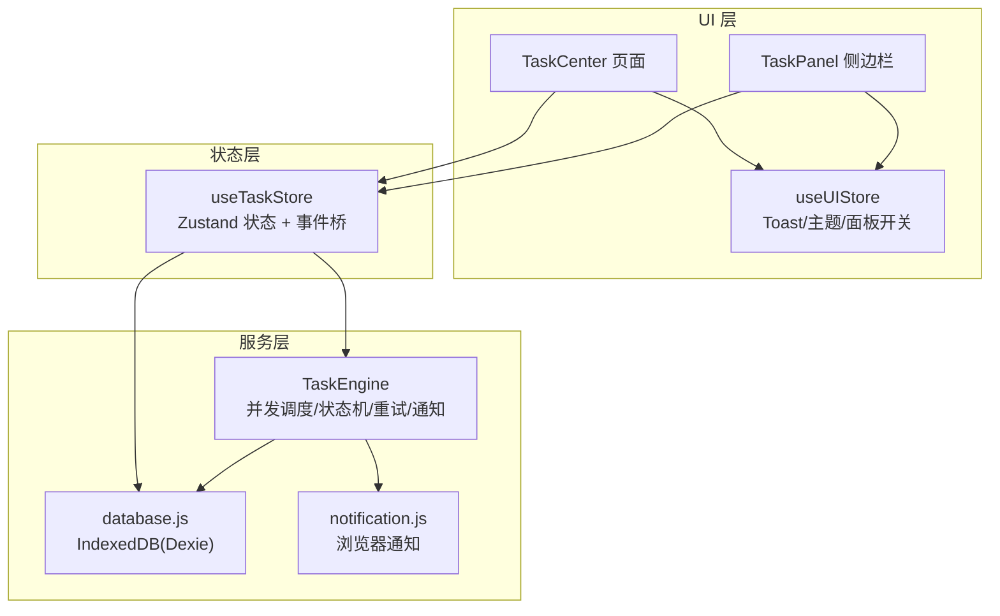
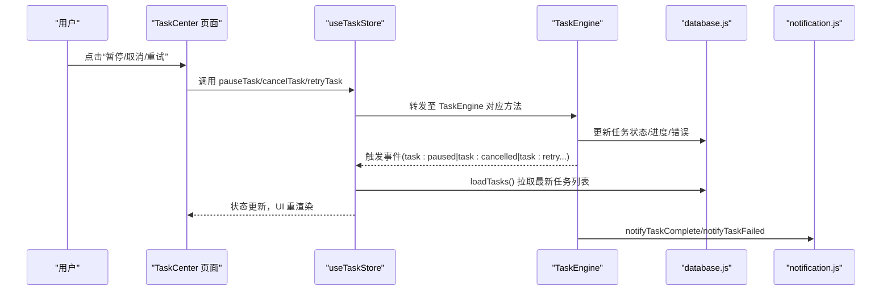
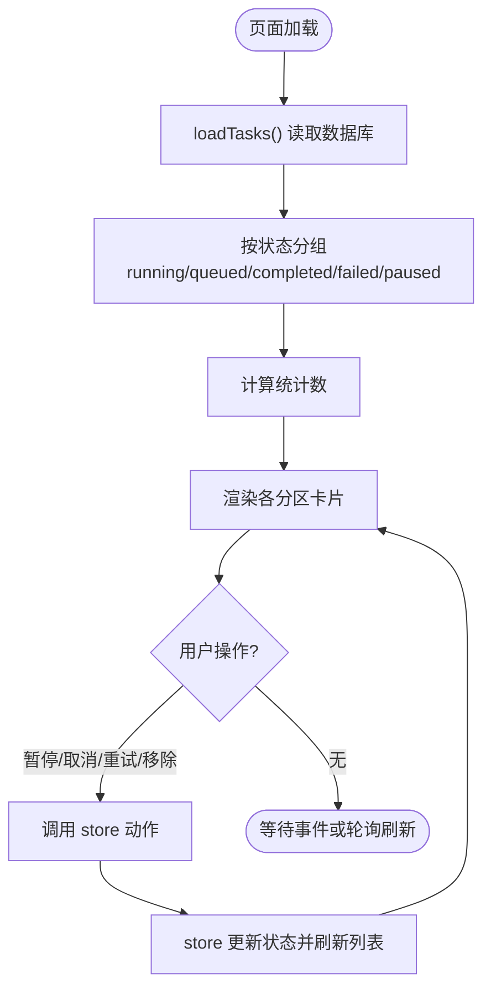
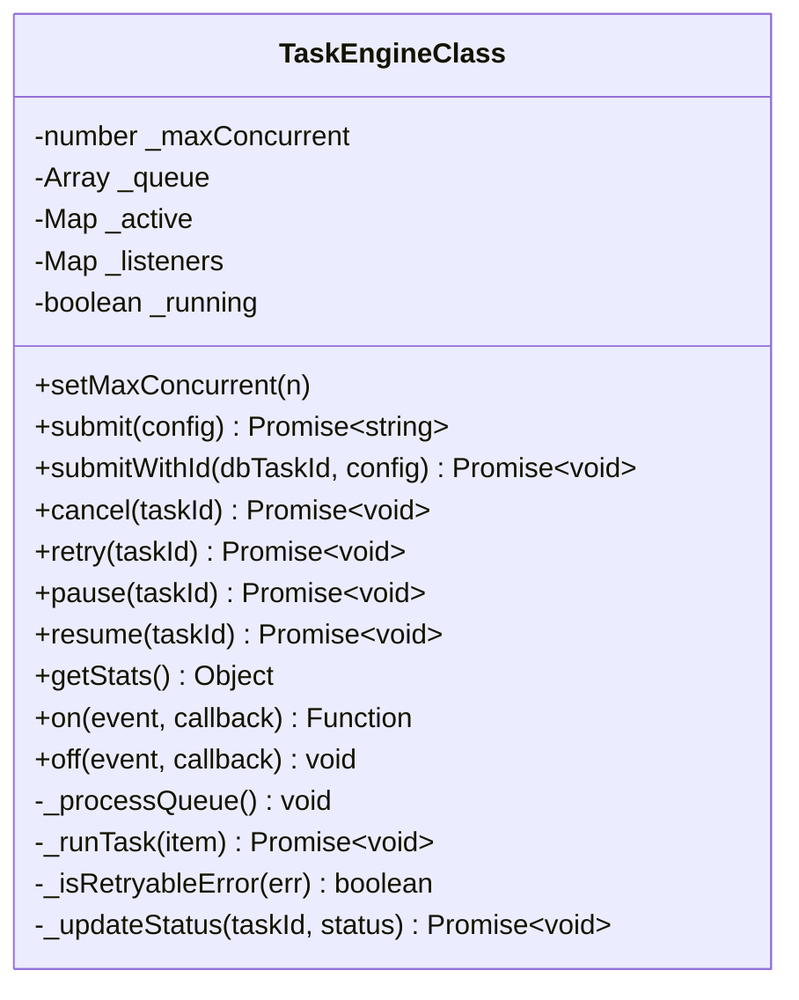
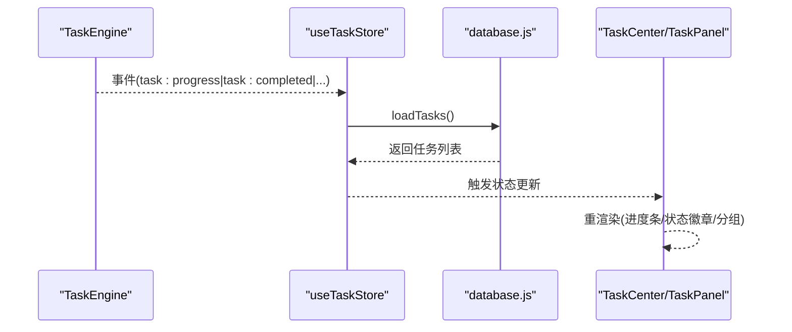
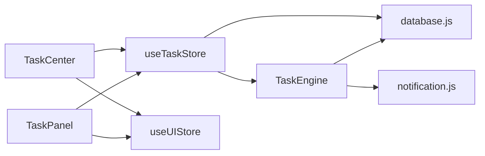

# 任务中心页面 (TaskCenter)

<cite>
**本文引用的文件**   
- [app/src/pages/TaskCenter.jsx](file://app/src/pages/TaskCenter.jsx)
- [app/src/services/task-engine.js](file://app/src/services/task-engine.js)
- [app/src/stores/useTaskStore.js](file://app/src/stores/useTaskStore.js)
- [app/src/components/TaskPanel.jsx](file://app/src/components/TaskPanel.jsx)
- [app/src/db/database.js](file://app/src/db/database.js)
- [app/src/services/notification.js](file://app/src/services/notification.js)
- [app/src/stores/useUIStore.js](file://app/src/stores/useUIStore.js)
</cite>

## 目录
1. [简介](#简介)
2. [项目结构](#项目结构)
3. [核心组件](#核心组件)
4. [架构总览](#架构总览)
5. [详细组件分析](#详细组件分析)
6. [依赖关系分析](#依赖关系分析)
7. [性能与实时性](#性能与实时性)
8. [故障排查指南](#故障排查指南)
9. [结论](#结论)
10. [附录](#附录)

## 简介
本文件面向 AI Image Studio 的任务中心页面，系统性阐述 TaskCenter 组件如何与 TaskEngine 服务层协作，实现后台任务的监控与管理。文档覆盖：
- 任务状态机在 UI 层的映射（queued、running、completed、failed、cancelled、paused）
- 任务队列的实时刷新机制、进度条更新与错误重试提示
- 统计信息计算逻辑、任务筛选与排序的实现思路
- 任务控制操作（暂停、取消、重试）的用户交互设计与状态同步机制
- 任务历史记录查询与性能监控数据的展示方案

## 项目结构
围绕任务中心的关键代码分布在以下模块：
- 页面视图：TaskCenter 页面与侧边任务面板 TaskPanel
- 状态桥接：useTaskStore 将 TaskEngine 事件桥接到 Zustand 状态，供 UI 消费
- 任务引擎：TaskEngine 负责并发调度、状态机、持久化、通知与重试
- 数据层：database.js 基于 Dexie 提供 IndexedDB 读写能力
- 通知：notification.js 封装浏览器通知 API
- UI 全局状态：useUIStore 管理 Toast 等通用 UI 状态

图表来源
- [app/src/pages/TaskCenter.jsx:1-218](file://app/src/pages/TaskCenter.jsx#L1-L218)
- [app/src/components/TaskPanel.jsx:1-538](file://app/src/components/TaskPanel.jsx#L1-L538)
- [app/src/stores/useTaskStore.js:1-173](file://app/src/stores/useTaskStore.js#L1-L173)
- [app/src/services/task-engine.js:1-319](file://app/src/services/task-engine.js#L1-L319)
- [app/src/db/database.js:1-339](file://app/src/db/database.js#L1-L339)
- [app/src/services/notification.js:1-113](file://app/src/services/notification.js#L1-L113)
- [app/src/stores/useUIStore.js:1-159](file://app/src/stores/useUIStore.js#L1-L159)

章节来源
- [app/src/pages/TaskCenter.jsx:1-218](file://app/src/pages/TaskCenter.jsx#L1-L218)
- [app/src/components/TaskPanel.jsx:1-538](file://app/src/components/TaskPanel.jsx#L1-L538)
- [app/src/stores/useTaskStore.js:1-173](file://app/src/stores/useTaskStore.js#L1-L173)
- [app/src/services/task-engine.js:1-319](file://app/src/services/task-engine.js#L1-L319)
- [app/src/db/database.js:1-339](file://app/src/db/database.js#L1-L339)
- [app/src/services/notification.js:1-113](file://app/src/services/notification.js#L1-L113)
- [app/src/stores/useUIStore.js:1-159](file://app/src/stores/useUIStore.js#L1-L159)

## 核心组件
- TaskCenter 页面：按状态分组渲染任务列表，提供统计概览、展开/折叠、清空已完成等操作；对运行中任务显示进度条与暂停/取消按钮；失败任务支持重试与移除；完成任务可跳转画廊查看结果。
- useTaskStore：维护 tasks 列表与活跃计数，暴露 loadTasks/addTask/updateTask/removeTask/retryTask/cancelTask/pauseTask/resumeTask/clearCompleted 等方法；通过 initBridge 订阅 TaskEngine 事件并刷新本地状态，驱动 UI 实时更新。
- TaskEngine：单例任务调度器，维护最大并发、FIFO 队列、活动任务集合；定义状态转换规则；提供 submit/submitWithId/cancel/retry/pause/resume/getStats 等接口；内部使用 AbortController 支持中断；实现指数退避重试与浏览器通知。
- database.js：基于 Dexie 的 IndexedDB 封装，提供 tasks 表的增删改查与统计方法。
- notification.js：封装浏览器通知，用于任务完成/失败的桌面级提醒。
- useUIStore：管理 Toast 消息、侧边任务面板开关等全局 UI 状态。

章节来源
- [app/src/pages/TaskCenter.jsx:1-218](file://app/src/pages/TaskCenter.jsx#L1-L218)
- [app/src/stores/useTaskStore.js:1-173](file://app/src/stores/useTaskStore.js#L1-L173)
- [app/src/services/task-engine.js:1-319](file://app/src/services/task-engine.js#L1-L319)
- [app/src/db/database.js:1-339](file://app/src/db/database.js#L1-L339)
- [app/src/services/notification.js:1-113](file://app/src/services/notification.js#L1-L113)
- [app/src/stores/useUIStore.js:1-159](file://app/src/stores/useUIStore.js#L1-L159)

## 架构总览
下图展示了从用户操作到任务执行、状态变更、UI 更新的完整链路。

图表来源
- [app/src/pages/TaskCenter.jsx:60-65](file://app/src/pages/TaskCenter.jsx#L60-L65)
- [app/src/stores/useTaskStore.js:109-157](file://app/src/stores/useTaskStore.js#L109-L157)
- [app/src/services/task-engine.js:94-178](file://app/src/services/task-engine.js#L94-L178)
- [app/src/services/task-engine.js:254-291](file://app/src/services/task-engine.js#L254-L291)
- [app/src/services/notification.js:78-103](file://app/src/services/notification.js#L78-L103)

## 详细组件分析

### TaskCenter 页面
- 数据获取与初始化：组件挂载时调用 loadTasks 拉取任务列表。
- 分组与统计：根据任务 status 分组为 running/queued/completed/failed/paused，并计算各状态数量作为统计展示。
- 状态映射与视觉反馈：
  - queued：显示序号、模型标签、提示词摘要，支持移除。
  - running：显示模型标签、更新时间、进度条与百分比，支持暂停与取消。
  - paused：单独分组，支持恢复与移除。
  - completed：显示模型、图片数量、时间，支持跳转到画廊查看。
  - failed/cancelled：合并到失败组，显示错误信息，支持重试与移除。
- 交互与反馈：所有控制操作均包裹 try/catch，并通过 addToast 给出成功/失败提示。
- 时间格式化：提供 formatTimeAgo 统一显示相对时间。

图表来源
- [app/src/pages/TaskCenter.jsx:24-66](file://app/src/pages/TaskCenter.jsx#L24-L66)
- [app/src/pages/TaskCenter.jsx:43-58](file://app/src/pages/TaskCenter.jsx#L43-L58)
- [app/src/pages/TaskCenter.jsx:106-127](file://app/src/pages/TaskCenter.jsx#L106-L127)
- [app/src/pages/TaskCenter.jsx:130-145](file://app/src/pages/TaskCenter.jsx#L130-L145)
- [app/src/pages/TaskCenter.jsx:148-164](file://app/src/pages/TaskCenter.jsx#L148-L164)
- [app/src/pages/TaskCenter.jsx:166-189](file://app/src/pages/TaskCenter.jsx#L166-L189)
- [app/src/pages/TaskCenter.jsx:191-214](file://app/src/pages/TaskCenter.jsx#L191-L214)

章节来源
- [app/src/pages/TaskCenter.jsx:1-218](file://app/src/pages/TaskCenter.jsx#L1-L218)

### TaskEngine 服务层
- 并发与队列：维护 _maxConcurrent、_queue、_active；_processQueue 循环取出队首任务启动执行，直到达到并发上限或队列为空。
- 状态机：VALID_TRANSITIONS 定义了合法的状态迁移路径，确保状态变更一致性。
- 生命周期：
  - submit/submitWithId：创建任务记录（初始 queued），入队并触发 task:queued。
  - cancel：若任务在执行中则中止控制器并置 cancelled；若在队列中则直接移除并置 cancelled。
  - retry：仅允许对 failed/cancelled 任务重试，重置 progress/error，递增 retryCount，重新入队。
  - pause/resume：暂停会中止运行中任务或标记队列中的任务为 paused；恢复则将 paused 任务重新入队。
  - 执行流程：设置 running，构造 ctx（含 signal、onProgress、taskId），执行 execute；完成后置 completed 并触发 task:completed；异常时判断是否可重试，指数退避后回退为 queued，否则置 failed 并触发 task:failed。
- 事件系统：on/off/_emit 提供轻量事件总线，供 useTaskStore 订阅以刷新 UI。
- 通知：任务完成/失败时调用 notification.js 发送桌面通知。

图表来源
- [app/src/services/task-engine.js:33-314](file://app/src/services/task-engine.js#L33-L314)

章节来源
- [app/src/services/task-engine.js:1-319](file://app/src/services/task-engine.js#L1-L319)

### useTaskStore 状态桥接
- 职责：维护 tasks 数组与 activeTaskCount；提供 CRUD 与任务控制动作；通过 initBridge 订阅 TaskEngine 的所有关键事件并在每次事件后统一刷新任务列表，保证 UI 与后端一致。
- 事件监听：包括 task:queued、task:started、task:progress、task:completed、task:failed、task:cancelled、task:paused、task:retry。
- 容错策略：当调用 TaskEngine 失败时，尝试降级为直接更新本地任务状态，避免 UI 不一致。

图表来源
- [app/src/stores/useTaskStore.js:39-64](file://app/src/stores/useTaskStore.js#L39-L64)
- [app/src/stores/useTaskStore.js:22-33](file://app/src/stores/useTaskStore.js#L22-L33)

章节来源
- [app/src/stores/useTaskStore.js:1-173](file://app/src/stores/useTaskStore.js#L1-L173)

### 数据库与通知
- database.js：tasks 表包含 id、type、status、model、prompt、params、progress、error、result、retryCount、createdAt、updatedAt 等字段；提供 getTasks、updateTask、deleteTask、getTaskStats 等方法。
- notification.js：封装 requestPermission、notifyTaskComplete、notifyTaskFailed，自动关闭与点击聚焦窗口。

章节来源
- [app/src/db/database.js:235-274](file://app/src/db/database.js#L235-L274)
- [app/src/services/notification.js:19-43](file://app/src/services/notification.js#L19-L43)
- [app/src/services/notification.js:78-103](file://app/src/services/notification.js#L78-L103)

### TaskPanel 侧边栏
- 功能：与 TaskCenter 类似，但采用右侧滑出面板形式，适合在工作区快速查看任务。
- 差异点：
  - 分组方式：将 running 与 paused 合并为“进行中”，其余分组相同。
  - 交互：进行中任务根据状态切换“暂停/继续”按钮；失败任务支持重试与移除；底部提供“查看全部任务”链接跳转至 /#/task-center。
  - 打开时机：isOpen 为真时触发 loadTasks。

章节来源
- [app/src/components/TaskPanel.jsx:1-538](file://app/src/components/TaskPanel.jsx#L1-L538)

## 依赖关系分析
- TaskCenter/TaskPanel 依赖 useTaskStore 提供的状态与动作。
- useTaskStore 依赖 TaskEngine 的事件系统与 database.js 的数据存取。
- TaskEngine 依赖 database.js 进行持久化，依赖 notification.js 发送通知。
- TaskCenter/TaskPanel 通过 useUIStore 弹出 Toast 反馈。

图表来源
- [app/src/pages/TaskCenter.jsx:1-218](file://app/src/pages/TaskCenter.jsx#L1-L218)
- [app/src/components/TaskPanel.jsx:1-538](file://app/src/components/TaskPanel.jsx#L1-L538)
- [app/src/stores/useTaskStore.js:1-173](file://app/src/stores/useTaskStore.js#L1-L173)
- [app/src/services/task-engine.js:1-319](file://app/src/services/task-engine.js#L1-L319)
- [app/src/db/database.js:1-339](file://app/src/db/database.js#L1-L339)
- [app/src/services/notification.js:1-113](file://app/src/services/notification.js#L1-L113)
- [app/src/stores/useUIStore.js:1-159](file://app/src/stores/useUIStore.js#L1-L159)

章节来源
- [app/src/pages/TaskCenter.jsx:1-218](file://app/src/pages/TaskCenter.jsx#L1-L218)
- [app/src/components/TaskPanel.jsx:1-538](file://app/src/components/TaskPanel.jsx#L1-L538)
- [app/src/stores/useTaskStore.js:1-173](file://app/src/stores/useTaskStore.js#L1-L173)
- [app/src/services/task-engine.js:1-319](file://app/src/services/task-engine.js#L1-L319)
- [app/src/db/database.js:1-339](file://app/src/db/database.js#L1-L339)
- [app/src/services/notification.js:1-113](file://app/src/services/notification.js#L1-L113)
- [app/src/stores/useUIStore.js:1-159](file://app/src/stores/useUIStore.js#L1-L159)

## 性能与实时性
- 实时刷新机制：
  - 事件驱动：useTaskStore.initBridge 订阅 TaskEngine 的多类事件，每次事件后统一 loadTasks 刷新，避免频繁局部更新带来的抖动。
  - 进度更新：TaskEngine 在执行过程中通过 onProgress 回调写入 progress 并触发 task:progress，UI 即时反映进度条变化。
- 并发控制：
  - TaskEngine 默认最大并发为 3，可通过 setMaxConcurrent 调整，平衡吞吐与资源占用。
- 重试策略：
  - 指数退避：对可重试错误（如 5xx、网络错误）最多重试 3 次，间隔按 2^(retryCount-1) 秒增长，降低服务端压力。
- 存储优化：
  - 使用 IndexedDB 持久化任务，避免刷新丢失；getTaskStats 提供聚合统计，减少前端计算开销。
- UI 渲染优化：
  - 使用 useMemo 对分组与统计进行缓存，仅在 tasks 变化时重算。
  - 进度条宽度使用 CSS transition 平滑过渡，提升观感。

[本节为通用性能建议，不直接分析具体文件]

## 故障排查指南
- 任务无法重试：
  - 检查任务当前状态是否为 failed 或 cancelled；非该状态将抛出错误。
  - 确认 TaskEngine.retry 是否被正确调用，以及数据库是否存在对应记录。
- 任务取消无效：
  - 若任务已在执行中，需确保 execute 函数响应 AbortController.signal 的中断信号。
  - 若任务在队列中，应直接从队列移除并更新状态为 cancelled。
- 进度不更新：
  - 确认 execute 函数是否正确调用 ctx.onProgress(percent)。
  - 检查 TaskEngine 是否触发了 task:progress 事件，且 useTaskStore 已订阅。
- 通知未弹出：
  - 确认已调用 requestPermission 并获得授权。
  - 检查浏览器是否支持 Notification API。
- 状态不同步：
  - 检查 useTaskStore.initBridge 是否只初始化一次，避免重复订阅导致多次刷新。
  - 观察控制台日志，确认 TaskEngine 事件是否正常发出。

章节来源
- [app/src/services/task-engine.js:118-146](file://app/src/services/task-engine.js#L118-L146)
- [app/src/services/task-engine.js:94-116](file://app/src/services/task-engine.js#L94-L116)
- [app/src/services/task-engine.js:233-236](file://app/src/services/task-engine.js#L233-L236)
- [app/src/services/notification.js:19-43](file://app/src/services/notification.js#L19-L43)
- [app/src/stores/useTaskStore.js:39-64](file://app/src/stores/useTaskStore.js#L39-L64)

## 结论
TaskCenter 页面通过 useTaskStore 与 TaskEngine 紧密协作，实现了完整的任务监控与管理闭环。UI 层清晰映射了任务状态机，提供了直观的视觉反馈与便捷的控制操作；服务层保证了高内聚的任务调度、可靠的重试与通知机制；数据层借助 IndexedDB 实现了持久化与高效查询。整体架构具备良好的扩展性与可维护性，适合在复杂生成工作流中稳定运行。

[本节为总结性内容，不直接分析具体文件]

## 附录

### 任务状态机与 UI 映射
- 状态定义与转换：
  - queued -> running | cancelled | paused
  - running -> completed | failed | cancelled
  - paused -> queued | cancelled
  - failed -> queued（重试）
  - cancelled -> queued（重新提交）
- UI 映射：
  - queued：排队中列表，显示序号与模型标签，支持移除。
  - running：进行中列表，显示进度条与百分比，支持暂停/取消。
  - paused：已暂停列表，支持恢复/移除。
  - completed：已完成列表，显示结果数量与时间，支持跳转查看。
  - failed/cancelled：失败列表，显示错误信息，支持重试/移除。

章节来源
- [app/src/services/task-engine.js:24-31](file://app/src/services/task-engine.js#L24-L31)
- [app/src/pages/TaskCenter.jsx:43-58](file://app/src/pages/TaskCenter.jsx#L43-L58)
- [app/src/components/TaskPanel.jsx:30-37](file://app/src/components/TaskPanel.jsx#L30-L37)

### 任务控制操作流程
- 暂停：
  - 运行中：中止控制器，状态改为 paused，触发 task:paused。
  - 队列中：直接标记为 paused，触发 task:paused。
- 恢复：
  - 仅对 paused 任务有效，将其状态改为 queued 并重新入队。
- 取消：
  - 运行中：中止控制器，状态改为 cancelled，触发 task:cancelled。
  - 队列中：移除并标记为 cancelled，触发 task:cancelled。
- 重试：
  - 仅对 failed/cancelled 任务有效，重置 progress/error，递增 retryCount，重新入队。

章节来源
- [app/src/services/task-engine.js:148-178](file://app/src/services/task-engine.js#L148-L178)
- [app/src/services/task-engine.js:94-116](file://app/src/services/task-engine.js#L94-L116)
- [app/src/services/task-engine.js:118-146](file://app/src/services/task-engine.js#L118-L146)

### 统计信息与筛选排序
- 统计信息：
  - 页面统计：基于分组后的长度计算 running/queued/completed/failed 数量。
  - 数据库统计：getTaskStats 返回 total/active/queued/completed/failed 汇总。
- 筛选与排序：
  - 当前实现按状态分组展示，未提供跨状态的关键词搜索与多列排序。
  - 可扩展方向：在 database.js 的 getTasks 增加 keyword/model/status 过滤参数；在前端增加下拉筛选与排序控件。

章节来源
- [app/src/pages/TaskCenter.jsx:55-58](file://app/src/pages/TaskCenter.jsx#L55-L58)
- [app/src/db/database.js:265-274](file://app/src/db/database.js#L265-L274)

### 任务历史记录与性能监控展示方案
- 历史记录：
  - 使用 database.js 的 getTasks 获取全部任务，结合 createdAt/updatedAt 排序展示历史。
  - 可在 TaskCenter 增加分页与加载更多，避免一次性渲染大量数据。
- 性能监控：
  - 利用 TaskEngine.getStats 获取 active/queued/maxConcurrent 指标。
  - 在页面顶部增加迷你仪表盘，展示并发负载与队列积压情况。
  - 可选：记录任务耗时分布（完成时间戳差值），用于后续分析与优化。

章节来源
- [app/src/services/task-engine.js:180-187](file://app/src/services/task-engine.js#L180-L187)
- [app/src/db/database.js:243-251](file://app/src/db/database.js#L243-L251)