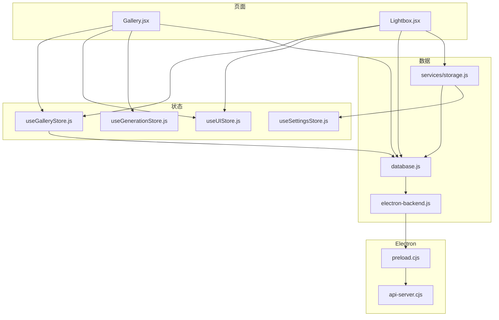
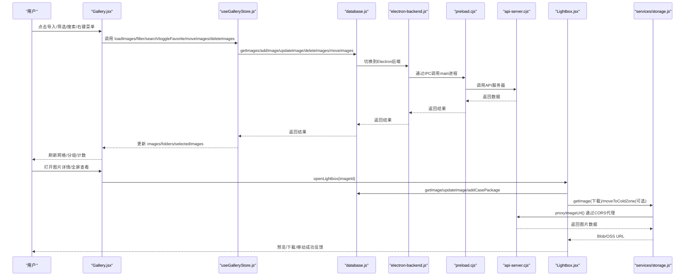
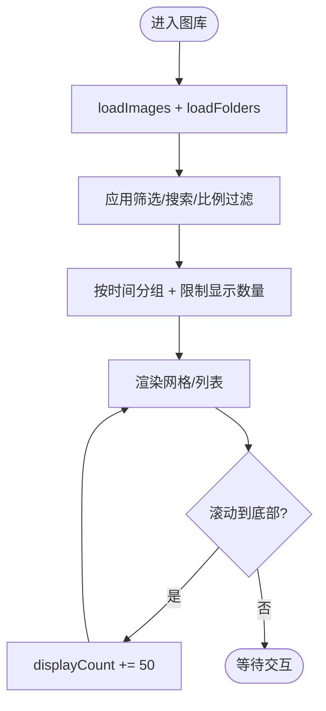
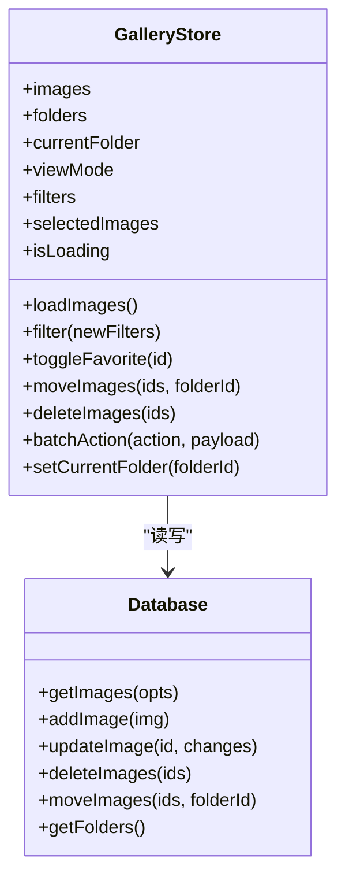
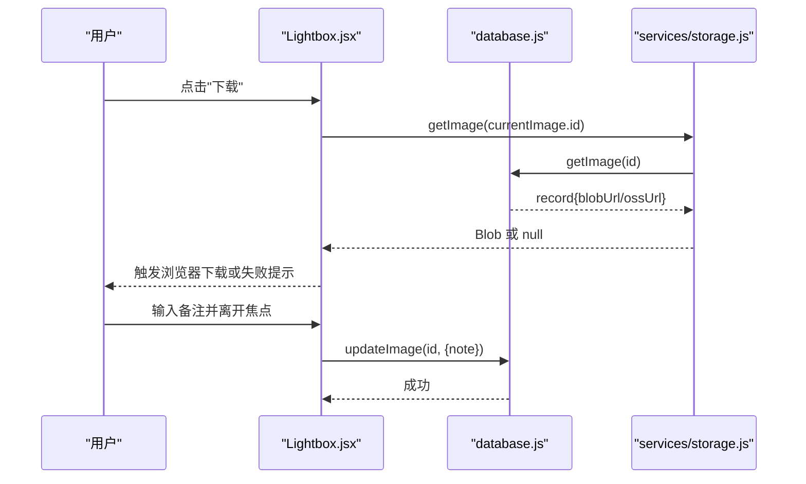
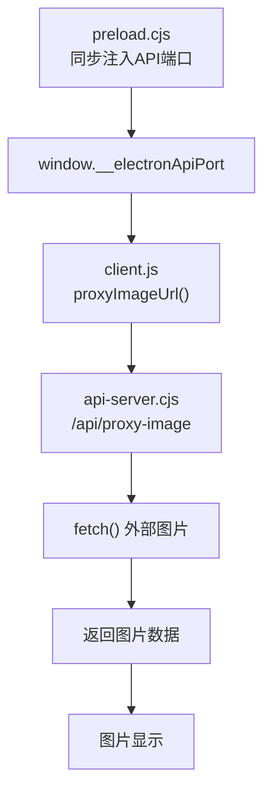
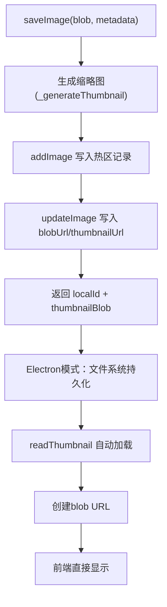
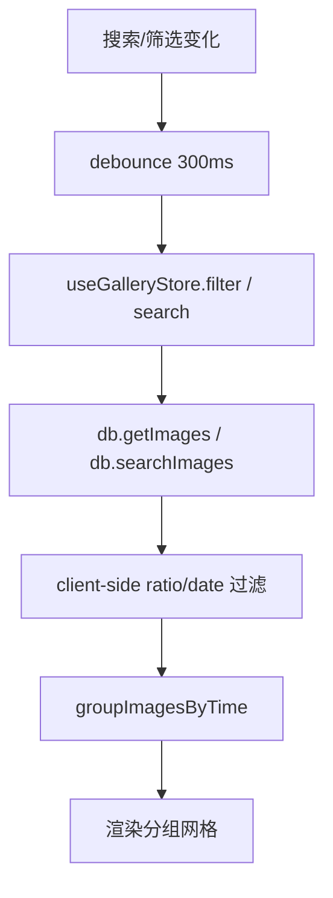
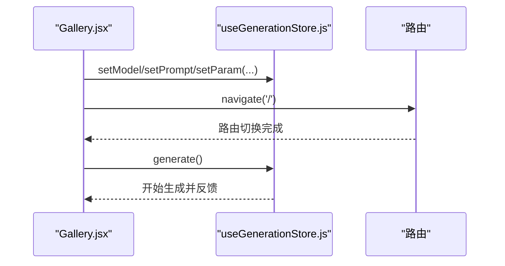
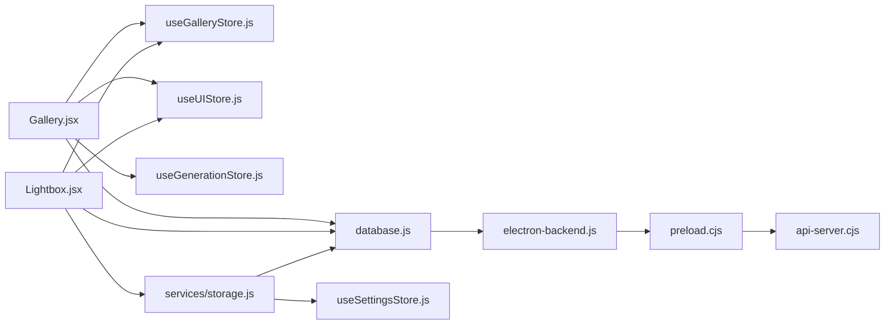

# 图库页面 (Gallery)

<cite>
**本文引用的文件列表**
- [app/src/pages/Gallery.jsx](file://app/src/pages/Gallery.jsx)
- [app/src/stores/useGalleryStore.js](file://app/src/stores/useGalleryStore.js)
- [app/src/components/Lightbox.jsx](file://app/src/components/Lightbox.jsx)
- [app/src/db/database.js](file://app/src/db/database.js)
- [app/src/services/storage.js](file://app/src/services/storage.js)
- [app/src/stores/useSettingsStore.js](file://app/src/stores/useSettingsStore.js)
- [app/src/stores/useUIStore.js](file://app/src/stores/useUIStore.js)
- [app/src/stores/useGenerationStore.js](file://app/src/stores/useGenerationStore.js)
- [app/src/services/api/client.js](file://app/src/services/api/client.js)
- [app/src/db/electron-backend.js](file://app/src/db/electron-backend.js)
- [app/electron/preload.cjs](file://app/electron/preload.cjs)
- [app/electron/api-server.cjs](file://app/electron/api-server.cjs)
</cite>

## 更新摘要
**变更内容**
- 修复了Electron模式下图片显示的关键问题，增强了缩略图加载机制
- 改进了生产构建环境下的URL解析逻辑，确保CORS代理正常工作
- 优化了Electron IPC通信中的API端口检测与传递机制
- 完善了数据库后端在Electron模式下的缩略图处理流程

## 目录
1. [简介](#简介)
2. [项目结构](#项目结构)
3. [核心组件](#核心组件)
4. [架构总览](#架构总览)
5. [详细组件分析](#详细组件分析)
6. [依赖关系分析](#依赖关系分析)
7. [性能与优化](#性能与优化)
8. [故障排查指南](#故障排查指南)
9. [结论](#结论)
10. [附录](#附录)

## 简介
本文件为 AI Image Studio 的"图库页面"提供系统化、可落地的技术文档。重点覆盖：
- Gallery 组件的图片浏览、搜索、分类与管理能力
- 与 useGalleryStore 的状态管理交互（数据获取、文件夹操作、批量处理）
- 图片网格布局渲染、虚拟滚动优化与缩略图加载策略
- 收藏系统、标签管理与存储区域切换的实现细节
- 文件上传处理、拖拽排序、右键菜单操作和用户偏好设置的数据持久化方案
- 图片预览、下载和删除操作的完整工作流说明
- **新增**：Electron模式下图片显示问题的修复与URL解析优化

## 项目结构
图库功能由以下关键模块协作完成：
- 页面层：Gallery 负责 UI 与用户交互，组合搜索、筛选、分组、选择、批量操作等
- 状态层：useGalleryStore 维护图片集合、文件夹树、视图模式、筛选条件、选中项等
- 数据层：database.js 基于 Dexie 封装 IndexedDB 读写；storage.js 封装本地热区与云端冷区的存取
- 展示层：Lightbox 提供全屏预览、缩放、备注、移动、加入知识库等操作
- 全局 UI：useUIStore 管理 Lightbox、通知、遮罩编辑器开关等
- 生成联动：useGenerationStore 提供从图库回到工作区继续生成的上下文注入
- **新增**：Electron IPC 桥接层，支持SQLite数据库访问和文件系统操作

**图表来源**
- [app/src/pages/Gallery.jsx:1-539](file://app/src/pages/Gallery.jsx#L1-L539)
- [app/src/components/Lightbox.jsx:1-702](file://app/src/components/Lightbox.jsx#L1-L702)
- [app/src/stores/useGalleryStore.js:1-224](file://app/src/stores/useGalleryStore.js#L1-L224)
- [app/src/stores/useUIStore.js:1-159](file://app/src/stores/useUIStore.js#L1-L159)
- [app/src/stores/useGenerationStore.js:1-360](file://app/src/stores/useGenerationStore.js#L1-L360)
- [app/src/db/database.js:1-114](file://app/src/db/database.js#L1-L114)
- [app/src/services/storage.js:1-456](file://app/src/services/storage.js#L1-L456)
- [app/src/stores/useSettingsStore.js:1-162](file://app/src/stores/useSettingsStore.js#L1-L162)
- [app/src/db/electron-backend.js:1-346](file://app/src/db/electron-backend.js#L1-L346)
- [app/electron/preload.cjs:1-88](file://app/electron/preload.cjs#L1-L88)
- [app/electron/api-server.cjs:1-606](file://app/electron/api-server.cjs#L1-L606)

**章节来源**
- [app/src/pages/Gallery.jsx:1-539](file://app/src/pages/Gallery.jsx#L1-L539)
- [app/src/stores/useGalleryStore.js:1-224](file://app/src/stores/useGalleryStore.js#L1-L224)
- [app/src/components/Lightbox.jsx:1-702](file://app/src/components/Lightbox.jsx#L1-L702)
- [app/src/db/database.js:1-114](file://app/src/db/database.js#L1-L114)
- [app/src/services/storage.js:1-456](file://app/src/services/storage.js#L1-L456)
- [app/src/stores/useSettingsStore.js:1-162](file://app/src/stores/useSettingsStore.js#L1-L162)
- [app/src/stores/useUIStore.js:1-159](file://app/src/stores/useUIStore.js#L1-L159)
- [app/src/stores/useGenerationStore.js:1-360](file://app/src/stores/useGenerationStore.js#L1-L360)
- [app/src/db/electron-backend.js:1-346](file://app/src/db/electron-backend.js#L1-L346)
- [app/electron/preload.cjs:1-88](file://app/electron/preload.cjs#L1-L88)
- [app/electron/api-server.cjs:1-606](file://app/electron/api-server.cjs#L1-L606)

## 核心组件
- Gallery 页面
  - 顶部工具栏：搜索类型切换（关键词/语义/以图搜图）、视图模式（网格/列表）、导入按钮
  - 筛选栏：模型、日期范围、比例、收藏等筛选，支持快捷入口（最近/收藏）
  - 主内容区：按时间分组（今天/昨天/本周/本月/更早），懒加载显示，悬停快捷操作
  - 右侧详情面板：提示词、参数、操作（下载/收藏/全屏/删除）
  - 右键菜单：再生成、参考图、微调 prompt、局部重绘、移动到文件夹、收藏、淘汰、导出
  - 批量操作条：移动、收藏、导出、淘汰
- Lightbox 全屏预览
  - 左右切换、键盘导航、缩放控制
  - 右侧信息面板：提示词、模型、参数、用户备注
  - 操作：收藏、淘汰、重新生成、设为参考、局部重绘、移动到文件夹、加入知识库、下载
- useGalleryStore 状态管理
  - 图片列表、文件夹树、当前文件夹、视图模式、搜索与筛选、选中项、加载态
  - 动作：加载图片/文件夹、搜索、筛选、收藏切换、移动、删除、批量操作、创建/重命名/删除文件夹、切换当前文件夹
- database.js 数据层
  - 基于 Dexie 的 images/batches/sessions/folders/tasks/settings/casePackages 表
  - 提供增删改查、批量更新、统计、初始化等
- storage.js 存储服务
  - 热区（IndexedDB Blob）与冷区（OSS）双存储
  - 缩略图生成、冷热迁移、容量检查与自动迁移、统计
- useSettingsStore 设置持久化
  - 模型配置、存储配置、扩展配置、通用配置、向导完成标记
- useUIStore 全局 UI
  - 侧边栏、Lightbox、任务面板、Toast、主题、遮罩编辑器开关
- useGenerationStore 生成联动
  - 将图库图片的参数注入工作区，支持"用相同参数再来一批"、"以此图为参考图"、"微调 prompt 再生成"
- **新增**：Electron IPC 桥接层
  - preload.cjs 暴露安全的 IPC 接口给 renderer 进程
  - electron-backend.js 实现 SQLite 数据库访问
  - api-server.cjs 提供内嵌 HTTP 代理服务器

**章节来源**
- [app/src/pages/Gallery.jsx:1-539](file://app/src/pages/Gallery.jsx#L1-L539)
- [app/src/components/Lightbox.jsx:1-702](file://app/src/components/Lightbox.jsx#L1-L702)
- [app/src/stores/useGalleryStore.js:1-224](file://app/src/stores/useGalleryStore.js#L1-L224)
- [app/src/db/database.js:1-114](file://app/src/db/database.js#L1-L114)
- [app/src/services/storage.js:1-456](file://app/src/services/storage.js#L1-L456)
- [app/src/stores/useSettingsStore.js:1-162](file://app/src/stores/useSettingsStore.js#L1-L162)
- [app/src/stores/useUIStore.js:1-159](file://app/src/stores/useUIStore.js#L1-L159)
- [app/src/stores/useGenerationStore.js:1-360](file://app/src/stores/useGenerationStore.js#L1-L360)
- [app/electron/preload.cjs:1-88](file://app/electron/preload.cjs#L1-L88)
- [app/src/db/electron-backend.js:1-346](file://app/src/db/electron-backend.js#L1-L346)
- [app/electron/api-server.cjs:1-606](file://app/electron/api-server.cjs#L1-L606)

## 架构总览
下图展示了图库页面的端到端流程：用户交互触发状态变更，状态层调用数据库或存储服务，最终驱动 UI 更新。**新增**了Electron IPC通信路径。

**图表来源**
- [app/src/pages/Gallery.jsx:1-539](file://app/src/pages/Gallery.jsx#L1-L539)
- [app/src/stores/useGalleryStore.js:1-224](file://app/src/stores/useGalleryStore.js#L1-L224)
- [app/src/components/Lightbox.jsx:1-702](file://app/src/components/Lightbox.jsx#L1-L702)
- [app/src/db/database.js:1-114](file://app/src/db/database.js#L1-L114)
- [app/src/services/storage.js:1-456](file://app/src/services/storage.js#L1-L456)
- [app/src/db/electron-backend.js:1-346](file://app/src/db/electron-backend.js#L1-L346)
- [app/electron/preload.cjs:1-88](file://app/electron/preload.cjs#L1-L88)
- [app/electron/api-server.cjs:1-606](file://app/electron/api-server.cjs#L1-L606)

## 详细组件分析

### Gallery 组件
- 数据获取与过滤
  - 初始化时加载 images 与 folders，并根据 URL 参数恢复当前文件夹
  - 搜索采用防抖，关键词搜索走数据库层；语义/以图搜图预留入口
  - 筛选包含模型、收藏、日期范围、比例；日期范围在客户端二次过滤
  - 使用 useMemo 计算 clientFiltered 与 groups，并按 displayCount 分页
- 虚拟滚动与懒加载
  - 通过监听滚动事件，当接近底部时增加 displayCount，实现"加载更多"
  - 未引入第三方虚拟列表库，采用增量渲染策略
- 缩略图与网格布局
  - 网格模式使用 CSS Grid 自适应列数，列表模式为单行卡片
  - 图片优先使用 thumbnailUrl，其次 blobUrl/url
  - 导入时通过 Canvas 生成缩略图并保存
- **新增**：Electron模式URL解析优化
  - `getImageDisplayUrl` 函数增强了对Electron环境的识别
  - 通过 `proxyImageUrl` 正确处理CORS代理URL
  - 支持blob URL、data URL和远程URL的统一处理
- 收藏系统与标签
  - 收藏通过 toggleFavorite 同步到数据库并即时更新本地状态
  - 标签字段 tags 存在于图片记录中，但当前 UI 未暴露编辑入口
- 存储区域切换
  - 图片记录含 storageZone 字段（hot/cold），当前页面不直接提供切换入口，但 Lightbox 下载路径会考虑冷区 OSS URL
- 文件上传处理
  - 支持 JPG/PNG/WebP 多文件导入，校验类型后逐个读取、生成缩略图、写入数据库
  - 导入完成后刷新 images 列表并给出 Toast 反馈
- 右键菜单与批量操作
  - 右键菜单提供"用相同参数再来一批"、"以此图为参考图"、"微调 prompt 再生成"、"局部重绘"、"移动到文件夹"、"收藏/取消收藏"、"淘汰"、"导出"
  - 批量操作支持移动、收藏、导出、淘汰，操作后清空选择并刷新
- 用户偏好设置
  - 视图模式 viewMode 保存在 useGalleryStore 内存中，如需持久化可在设置页扩展
- 拖拽排序
  - 当前未实现拖拽排序功能

**图表来源**
- [app/src/pages/Gallery.jsx:147-150](file://app/src/pages/Gallery.jsx#L147-L150)
- [app/src/pages/Gallery.jsx:140-145](file://app/src/pages/Gallery.jsx#L140-L145)
- [app/src/pages/Gallery.jsx:440-474](file://app/src/pages/Gallery.jsx#L440-L474)

**章节来源**
- [app/src/pages/Gallery.jsx:1-539](file://app/src/pages/Gallery.jsx#L1-L539)

### useGalleryStore 状态管理
- 状态字段
  - images、folders、currentFolder、viewMode、searchQuery、searchType、filters、selectedImages、isLoading
- 关键动作
  - loadImages：根据 searchType 与 filters 查询数据库，并在客户端应用 dateRange 过滤
  - filter：合并新筛选条件并重新加载
  - toggleFavorite：切换收藏并更新本地 images
  - moveImages/deleteImages：批量更新/删除，并清理 selectedImages
  - batchAction：统一分发 favorite/move/delete 等批量操作
  - setCurrentFolder：切换当前文件夹并重置选择
- **新增**：Blob URL重建机制
  - 页面刷新后自动重建有效的blob URL
  - 处理跨会话的blob URL失效问题
  - 确保Electron模式下缩略图正确加载
- 复杂度与一致性
  - 使用 immer produce 进行不可变更新，保证响应式
  - 批量操作顺序执行，避免并发竞争

**图表来源**
- [app/src/stores/useGalleryStore.js:1-224](file://app/src/stores/useGalleryStore.js#L1-L224)
- [app/src/db/database.js:1-114](file://app/src/db/database.js#L1-L114)

**章节来源**
- [app/src/stores/useGalleryStore.js:1-224](file://app/src/stores/useGalleryStore.js#L1-L224)
- [app/src/db/database.js:1-114](file://app/src/db/database.js#L1-L114)

### Lightbox 全屏预览
- 导航与缩放
  - 左右箭头与键盘 ← → 切换，Esc 关闭；缩放级别 0.25~3.0，支持适应窗口与 1:1
- 信息面板
  - 提示词复制、模型标识、参数展示、用户备注（实时保存到数据库）
- 操作
  - 收藏/淘汰/重新生成/设为参考/局部重绘/移动到文件夹/加入知识库/下载
  - 下载优先从热区 Blob 获取，若不存在则回退提示错误
  - 移动到文件夹通过 updateImage 更新 folderId
  - 加入知识库通过 addCasePackage 保存案例包

**图表来源**
- [app/src/components/Lightbox.jsx:59-99](file://app/src/components/Lightbox.jsx#L59-L99)
- [app/src/db/database.js:84-86](file://app/src/db/database.js#L84-L86)
- [app/src/services/storage.js:87-97](file://app/src/services/storage.js#L87-L97)

**章节来源**
- [app/src/components/Lightbox.jsx:1-702](file://app/src/components/Lightbox.jsx#L1-L702)
- [app/src/db/database.js:1-114](file://app/src/db/database.js#L1-L114)
- [app/src/services/storage.js:1-456](file://app/src/services/storage.js#L1-L456)

### Electron IPC 桥接层
- **新增**：preload.cjs 安全桥接
  - 同步注入API端口到window.__electronApiPort，避免竞态条件
  - 暴露安全的IPC接口给renderer进程，包括数据库操作、文件系统操作、OSS同步等
  - 支持30个数据库操作函数的IPC调用
- **新增**：electron-backend.js SQLite后端
  - 实现与Dexie后端完全兼容的接口
  - 处理Blob到ArrayBuffer的转换，支持IPC传输
  - 自动加载缩略图文件并创建blob URL
  - 支持图片文件的读写和删除操作
- **新增**：api-server.cjs 内嵌HTTP服务器
  - 提供/api/proxy-image路由处理外部图片CORS请求
  - 支持动态端口分配和生产环境部署
  - 集成数据库REST API和图片代理服务

**图表来源**
- [app/electron/preload.cjs:3-7](file://app/electron/preload.cjs#L3-L7)
- [app/src/services/api/client.js:182-190](file://app/src/services/api/client.js#L182-L190)
- [app/electron/api-server.cjs:523-555](file://app/electron/api-server.cjs#L523-L555)

**章节来源**
- [app/electron/preload.cjs:1-88](file://app/electron/preload.cjs#L1-L88)
- [app/src/db/electron-backend.js:1-346](file://app/src/db/electron-backend.js#L1-L346)
- [app/electron/api-server.cjs:1-606](file://app/electron/api-server.cjs#L1-L606)

### 存储与缩略图策略
- 热区（IndexedDB）
  - 图片以 Blob 形式存储在热区，thumbnailUrl/blobUrl 指向内存对象 URL
  - 适合频繁访问与快速预览
- 冷区（OSS）
  - 通过 StorageService.uploadToOSS 上传至阿里云 OSS，记录 ossKey/ossUrl
  - moveToColdZone 会将热区 Blob 上传后释放本地引用，降低内存占用
- 缩略图生成
  - 使用 Canvas 将原图按比例缩放至最大维度（默认 200px），再转 Blob 保存
- 容量检查与自动迁移
  - checkAndMigrate 依据阈值（来自设置）将最旧的热区图片迁移到冷区，直到低于阈值
- **新增**：Electron模式缩略图优化
  - electron-backend.js 自动从文件系统加载缩略图
  - 创建有效的blob URL供前端直接使用
  - 处理缩略图文件缺失的异常情况

**图表来源**
- [app/src/services/storage.js:51-80](file://app/src/services/storage.js#L51-L80)
- [app/src/services/storage.js:323-347](file://app/src/services/storage.js#L323-L347)
- [app/src/db/electron-backend.js:87-103](file://app/src/db/electron-backend.js#L87-L103)

**章节来源**
- [app/src/services/storage.js:1-456](file://app/src/services/storage.js#L1-L456)
- [app/src/stores/useSettingsStore.js:1-162](file://app/src/stores/useSettingsStore.js#L1-L162)
- [app/src/db/electron-backend.js:1-346](file://app/src/db/electron-backend.js#L1-L346)

### 搜索、筛选与分组
- 搜索
  - 关键词搜索：调用 db.searchImages，匹配 prompt/model/tags 子串
  - 语义/以图搜图：预留入口，当前仅提示即将推出
- 筛选
  - 模型、收藏、日期范围、比例；日期范围在客户端过滤 createdAt
- 分组
  - groupImagesByTime 将图片分为今天/昨天/本周/本月/更早，支持折叠/展开

**图表来源**
- [app/src/pages/Gallery.jsx:122-124](file://app/src/pages/Gallery.jsx#L122-L124)
- [app/src/pages/Gallery.jsx:140-145](file://app/src/pages/Gallery.jsx#L140-L145)
- [app/src/pages/Gallery.jsx:46-63](file://app/src/pages/Gallery.jsx#L46-L63)
- [app/src/stores/useGalleryStore.js:95-108](file://app/src/stores/useGalleryStore.js#L95-L108)
- [app/src/db/database.js:56](file://app/src/db/database.js#L56)

**章节来源**
- [app/src/pages/Gallery.jsx:1-539](file://app/src/pages/Gallery.jsx#L1-L539)
- [app/src/stores/useGalleryStore.js:1-224](file://app/src/stores/useGalleryStore.js#L1-L224)
- [app/src/db/database.js:1-114](file://app/src/db/database.js#L1-L114)

### 批量处理与工作区联动
- 批量收藏/移动/删除
  - 通过 batchAction 分发，循环调用数据库接口，完成后清空选择并刷新
- 工作区联动
  - "用相同参数再来一批"：将 model/prompt/params 注入 useGenerationStore，跳转工作区并触发 generate
  - "以此图为参考图"：将图片 URL 作为 referenceImage 添加到工作区
  - "微调 prompt 再生成"：仅注入 prompt/params，便于在工作区修改后生成

**图表来源**
- [app/src/pages/Gallery.jsx:272-285](file://app/src/pages/Gallery.jsx#L272-L285)
- [app/src/stores/useGenerationStore.js:112-290](file://app/src/stores/useGenerationStore.js#L112-L290)

**章节来源**
- [app/src/pages/Gallery.jsx:1-539](file://app/src/pages/Gallery.jsx#L1-L539)
- [app/src/stores/useGenerationStore.js:1-360](file://app/src/stores/useGenerationStore.js#L1-L360)

## 依赖关系分析
- 组件耦合
  - Gallery 强依赖 useGalleryStore 与 useUIStore，弱依赖 useGenerationStore（用于联动）
  - Lightbox 依赖 useUIStore（打开遮罩编辑器）、useGalleryStore（文件夹树）、database.js、storage.js
- 外部依赖
  - Dexie（IndexedDB 封装）
  - ali-oss（云存储 SDK）
  - lucide-react（图标）
- **新增**：Electron依赖
  - electron（主进程框架）
  - sqlite3（SQLite数据库）
  - http（内置HTTP服务器）
- 潜在循环依赖
  - 当前未见循环 import；Lightbox 动态导入 database 以避免首屏体积过大

**图表来源**
- [app/src/pages/Gallery.jsx:1-539](file://app/src/pages/Gallery.jsx#L1-L539)
- [app/src/components/Lightbox.jsx:1-702](file://app/src/components/Lightbox.jsx#L1-L702)
- [app/src/stores/useGalleryStore.js:1-224](file://app/src/stores/useGalleryStore.js#L1-L224)
- [app/src/stores/useUIStore.js:1-159](file://app/src/stores/useUIStore.js#L1-L159)
- [app/src/stores/useGenerationStore.js:1-360](file://app/src/stores/useGenerationStore.js#L1-L360)
- [app/src/db/database.js:1-114](file://app/src/db/database.js#L1-L114)
- [app/src/services/storage.js:1-456](file://app/src/services/storage.js#L1-L456)
- [app/src/stores/useSettingsStore.js:1-162](file://app/src/stores/useSettingsStore.js#L1-L162)
- [app/src/db/electron-backend.js:1-346](file://app/src/db/electron-backend.js#L1-L346)
- [app/electron/preload.cjs:1-88](file://app/electron/preload.cjs#L1-L88)
- [app/electron/api-server.cjs:1-606](file://app/electron/api-server.cjs#L1-L606)

**章节来源**
- [app/src/pages/Gallery.jsx:1-539](file://app/src/pages/Gallery.jsx#L1-L539)
- [app/src/components/Lightbox.jsx:1-702](file://app/src/components/Lightbox.jsx#L1-L702)
- [app/src/stores/useGalleryStore.js:1-224](file://app/src/stores/useGalleryStore.js#L1-L224)
- [app/src/stores/useUIStore.js:1-159](file://app/src/stores/useUIStore.js#L1-L159)
- [app/src/stores/useGenerationStore.js:1-360](file://app/src/stores/useGenerationStore.js#L1-L360)
- [app/src/db/database.js:1-114](file://app/src/db/database.js#L1-L114)
- [app/src/services/storage.js:1-456](file://app/src/services/storage.js#L1-L456)
- [app/src/stores/useSettingsStore.js:1-162](file://app/src/stores/useSettingsStore.js#L1-L162)
- [app/src/db/electron-backend.js:1-346](file://app/src/db/electron-backend.js#L1-L346)
- [app/electron/preload.cjs:1-88](file://app/electron/preload.cjs#L1-L88)
- [app/electron/api-server.cjs:1-606](file://app/electron/api-server.cjs#L1-L606)

## 性能与优化
- 虚拟滚动与懒加载
  - 当前采用"增量加载"策略（displayCount 递增），未使用第三方虚拟列表库
  - 建议：对超大数据集引入 react-window 或 react-virtualized，减少 DOM 节点数量
- 缩略图与图片加载
  - 导入时生成缩略图，列表/网格优先使用 thumbnailUrl，减少大图渲染开销
  - 建议：结合 IntersectionObserver 实现按需加载，避免一次性加载过多图片
- 批量下载节流
  - 批量导出已做简单延时（200ms）避免浏览器拦截
  - 建议：使用队列+并发控制，提升稳定性
- 存储冷热迁移
  - 通过 checkAndMigrate 自动迁移旧图到冷区，降低热区占用
  - 建议：在设置页暴露手动迁移入口与进度反馈
- 渲染优化
  - 使用 useMemo 缓存过滤与分组结果，避免重复计算
  - 建议：对大数组进一步拆分渲染单元（如分组内分页）
- **新增**：Electron模式性能优化
  - 预加载API端口避免运行时检测开销
  - 缩略图文件直接从磁盘读取，避免IPC传输开销
  - 使用http.createServer提供高性能图片代理服务

[本节为通用性能建议，无需特定文件来源]

## 故障排查指南
- 导入失败
  - 现象：提示"请选择 JPG/PNG/WebP 格式的图片"或"导入失败"
  - 排查：确认文件类型、浏览器是否允许读取文件、Canvas 是否可用
  - 相关位置：导入处理逻辑与错误捕获
- 下载失败
  - 现象：提示"下载失败"或"图片未找到"
  - 排查：检查热区是否存在 blobUrl；若为冷区图片，需先拉取 OSS 资源
  - 相关位置：Lightbox 下载与 StorageService.getImage
- 移动失败
  - 现象：提示"移动失败"
  - 排查：检查数据库更新是否成功、目标文件夹是否存在
  - 相关位置：moveImages/updateImage
- 收藏无效
  - 现象：收藏状态未更新
  - 排查：检查 toggleFavorite 是否成功、本地 images 是否同步
  - 相关位置：toggleFavorite 与数据库更新
- 搜索无结果
  - 现象：关键词搜索为空
  - 排查：确认 searchImages 是否命中 prompt/model/tags；检查索引与大小写
  - 相关位置：searchImages 实现
- **新增**：Electron模式图片显示问题
  - 现象：Electron环境下图片无法显示或缩略图加载失败
  - 排查：检查window.__electronApiPort是否正确注入、API服务器是否正常启动
  - 相关位置：preload.cjs、api-server.cjs、electron-backend.js
- **新增**：CORS代理问题
  - 现象：外部图片无法通过代理加载
  - 排查：检查/api/proxy-image路由是否正确配置、目标URL是否有效
  - 相关位置：client.js proxyImageUrl函数、api-server.cjs代理路由

**章节来源**
- [app/src/pages/Gallery.jsx:160-240](file://app/src/pages/Gallery.jsx#L160-L240)
- [app/src/components/Lightbox.jsx:59-99](file://app/src/components/Lightbox.jsx#L59-L99)
- [app/src/stores/useGalleryStore.js:111-143](file://app/src/stores/useGalleryStore.js#L111-L143)
- [app/src/db/database.js:56](file://app/src/db/database.js#L56)
- [app/src/services/storage.js:108-151](file://app/src/services/storage.js#L108-L151)
- [app/electron/preload.cjs:3-7](file://app/electron/preload.cjs#L3-L7)
- [app/electron/api-server.cjs:523-555](file://app/electron/api-server.cjs#L523-L555)
- [app/src/services/api/client.js:182-190](file://app/src/services/api/client.js#L182-L190)

## 结论
图库页面围绕 Gallery 组件构建了完整的图片浏览、搜索、筛选、分组、批量操作与预览体系，并通过 useGalleryStore 与 database.js、storage.js 形成清晰的数据流。**本次更新重点修复了Electron模式下的图片显示问题**，通过增强缩略图加载机制和优化URL解析逻辑，确保了生产构建环境下的稳定运行。当前实现已满足日常使用需求，后续可在虚拟滚动、按需加载、标签编辑、拖拽排序与设置持久化方面进一步增强体验与性能。

[本节为总结性内容，无需特定文件来源]

## 附录
- 快捷键与交互
  - 右键菜单：再生成/参考图/微调 prompt/局部重绘/移动/收藏/淘汰/导出
  - 键盘：Lightbox 下 Esc 关闭，← → 切换
- 数据模型要点
  - images 表包含：id、folderId、model、prompt、url、thumbnailUrl、params、favorite、storageZone、createdAt、width、height、tags、status 等
  - folders 表：id、name、parentId、createdAt
  - casePackages 表：imageId、originalPrompt、model、params、annotation、tags、imageUrl、createdAt
- **新增**：Electron环境变量
  - window.__electronApiPort：API服务器端口号
  - window.electronAPI：IPC接口对象
  - 支持30个数据库操作和文件系统操作

**章节来源**
- [app/src/db/database.js:22-31](file://app/src/db/database.js#L22-L31)
- [app/src/components/Lightbox.jsx:141-165](file://app/src/components/Lightbox.jsx#L141-L165)
- [app/electron/preload.cjs:10-87](file://app/electron/preload.cjs#L10-L87)