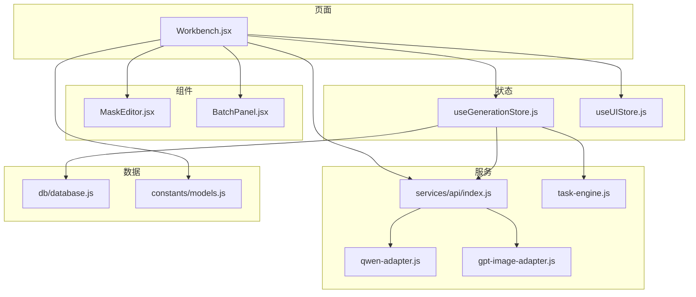
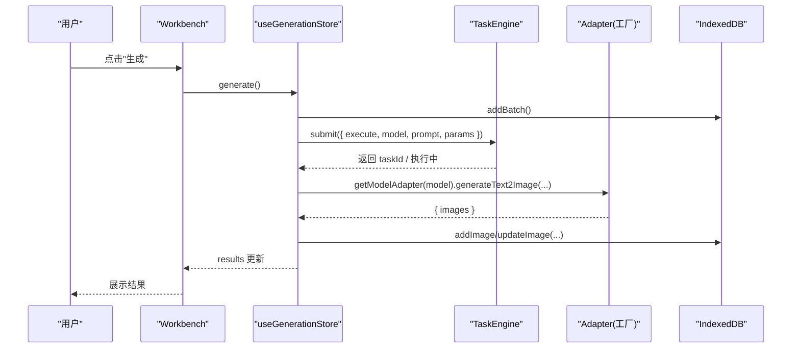
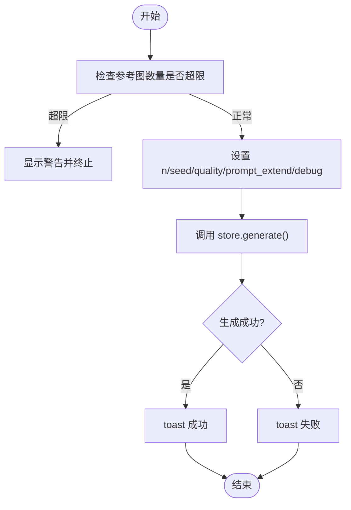
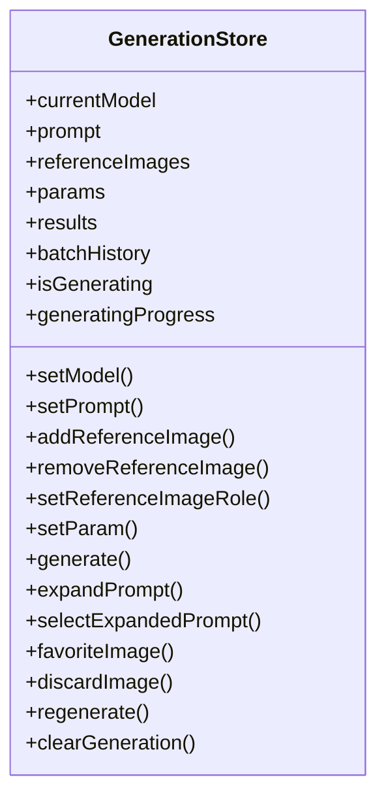
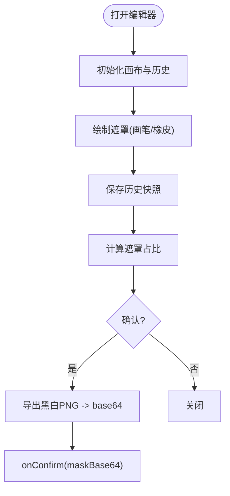
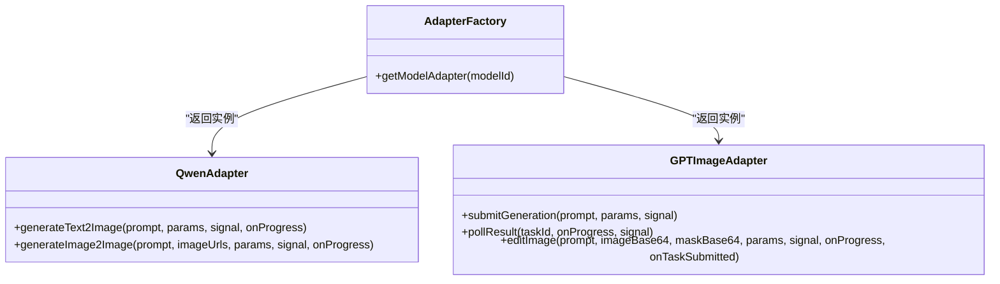
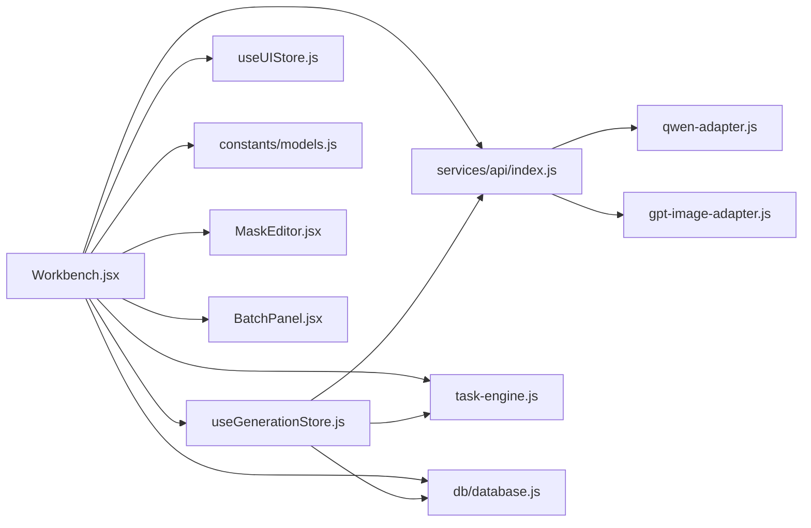
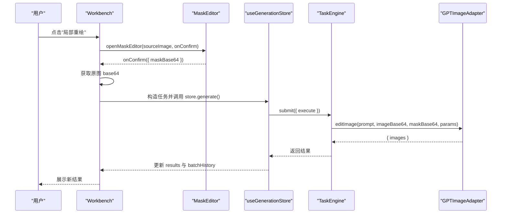

# 工作台页面 (Workbench)

<cite>
**本文引用的文件**   
- [app/src/pages/Workbench.jsx](file://app/src/pages/Workbench.jsx)
- [app/src/stores/useGenerationStore.js](file://app/src/stores/useGenerationStore.js)
- [app/src/stores/useUIStore.js](file://app/src/stores/useUIStore.js)
- [app/src/components/MaskEditor.jsx](file://app/src/components/MaskEditor.jsx)
- [app/src/components/BatchPanel.jsx](file://app/src/components/BatchPanel.jsx)
- [app/src/services/api/index.js](file://app/src/services/api/index.js)
- [app/src/services/api/qwen-adapter.js](file://app/src/services/api/qwen-adapter.js)
- [app/src/services/api/gpt-image-adapter.js](file://app/src/services/api/gpt-image-adapter.js)
- [app/src/constants/models.js](file://app/src/constants/models.js)
- [app/src/services/task-engine.js](file://app/src/services/task-engine.js)
- [app/src/db/database.js](file://app/src/db/database.js)
- [app/src/hooks/useShortcuts.js](file://app/src/hooks/useShortcuts.js)
</cite>

## 更新摘要
**变更内容**   
- 增强了动态模型切换功能，支持实时参数同步和参考图数量警告
- 改进了参考图片管理系统，新增角色标签分类和拖拽上传功能
- 完善了批量生成控制面板，支持多批次、多变体和Prompt队列三种模式
- 实现了实时进度跟踪和任务状态管理机制
- 增强了上下文菜单功能，支持换模型生成和局部重绘快捷操作

## 目录
1. [简介](#简介)
2. [项目结构](#项目结构)
3. [核心组件与功能](#核心组件与功能)
4. [架构总览](#架构总览)
5. [详细组件分析](#详细组件分析)
6. [依赖关系分析](#依赖关系分析)
7. [性能优化策略](#性能优化策略)
8. [用户交互流程](#用户交互流程)
9. [错误处理机制](#错误处理机制)
10. [键盘快捷键支持](#键盘快捷键支持)
11. [结论](#结论)

## 简介
本文件为 AI Image Studio 的"工作台"页面提供深入的技术文档，覆盖以下关键能力：
- 提示词编辑器（含扩写助手）
- 动态模型选择器（多模型适配与实时参数同步）
- 智能参考图片管理（角色标注、数量限制、拖拽上传）
- 生成参数配置（尺寸、质量、分辨率、Seed、回调等）
- 结果展示区（网格布局、上下文菜单、收藏/下载/复用）
- 状态管理模式（useGenerationStore 与 useUIStore 协作、本地 UI 状态、useEffect 生命周期）
- 多模型适配器集成（Qwen、GPT-image-2、Nano Banana）
- 批量生成功能（多批次、多变体、Prompt 队列）
- 局部重绘（蒙版编辑）工作流
- 实时进度跟踪与任务状态管理
- 性能优化（懒加载、内存管理、异步任务控制）
- 用户交互流程、错误处理与键盘快捷键

## 项目结构
工作台由一个主页面组件 Workbench 与多个子组件、存储、服务层共同构成。整体采用"页面 + 组件 + Store + Service + DB"的分层组织方式。

**图表来源**
- [app/src/pages/Workbench.jsx:1-120](file://app/src/pages/Workbench.jsx#L1-L120)
- [app/src/stores/useGenerationStore.js:1-60](file://app/src/stores/useGenerationStore.js#L1-L60)
- [app/src/stores/useUIStore.js:1-40](file://app/src/stores/useUIStore.js#L1-L40)
- [app/src/services/api/index.js:1-39](file://app/src/services/api/index.js#L1-L39)
- [app/src/services/api/qwen-adapter.js:1-60](file://app/src/services/api/qwen-adapter.js#L1-L60)
- [app/src/services/api/gpt-image-adapter.js:1-60](file://app/src/services/api/gpt-image-adapter.js#L1-L60)
- [app/src/services/task-engine.js:1-60](file://app/src/services/task-engine.js#L1-L60)
- [app/src/db/database.js:1-40](file://app/src/db/database.js#L1-L40)
- [app/src/constants/models.js:1-40](file://app/src/constants/models.js#L1-L40)

**章节来源**
- [app/src/pages/Workbench.jsx:1-120](file://app/src/pages/Workbench.jsx#L1-L120)
- [app/src/constants/models.js:1-110](file://app/src/constants/models.js#L1-L110)

## 核心组件与功能
- 提示词编辑器
  - 文本输入框、字符计数、Token 估算提示
  - 扩写助手：调用 LLM 适配器生成多条变体，支持一键选用
- 动态模型选择器
  - 基于常量配置渲染标签页，切换时同步默认参数与能力约束
  - 实时参考图数量检查与警告提示
  - 模型特定参数自动重置与验证
- 智能参考图片管理
  - 拖拽/点击上传，最多 N 张（按模型能力），支持角色标签（通用/风格/构图/色彩/主体）
  - 实时数量限制检查和警告提示
  - 颜色编码的角色标识系统
- 生成参数配置
  - 文生图/图生图模式切换
  - 尺寸/比例预设映射到各模型原生 size
  - 质量等级、分辨率（特定模型）、prompt_extend（Qwen）、debug 模式（Qwen）
  - Seed 随机/固定
- 结果展示区
  - 自适应网格布局，悬停显示操作按钮（收藏、淘汰、重新生成、用作参考、复制 Prompt、下载）
  - 右键上下文菜单（快速重出、换模型生成、局部重绘等）
  - 批次历史侧边栏（可恢复某批次的结果）
- 批量生成控制面板
  - 多批次：同一 prompt 重复 N 次
  - 多变体：变量替换 + 尺寸组合
  - Prompt 队列：逐行提交
- 局部重绘（蒙版编辑）
  - 双画布（背景+遮罩），画笔/橡皮擦、撤销/重做、缩放平移、对比原图、导出黑白掩码 PNG
  - 仅对支持 inpainting 的模型可用（当前为 gpt-image-2）
- 实时进度跟踪
  - 生成进度百分比显示
  - 任务状态实时更新
  - 失败重试与错误提示

**章节来源**
- [app/src/pages/Workbench.jsx:503-1187](file://app/src/pages/Workbench.jsx#L503-L1187)
- [app/src/components/BatchPanel.jsx:1-120](file://app/src/components/BatchPanel.jsx#L1-L120)
- [app/src/components/MaskEditor.jsx:1-120](file://app/src/components/MaskEditor.jsx#L1-L120)

## 架构总览
工作台通过 Zustand store 集中管理生成态与 UI 态；业务逻辑集中在 useGenerationStore.generate 中，借助 TaskEngine 调度并发任务，并通过适配器工厂选择具体模型实现。

**图表来源**
- [app/src/stores/useGenerationStore.js:112-290](file://app/src/stores/useGenerationStore.js#L112-L290)
- [app/src/services/task-engine.js:57-120](file://app/src/services/task-engine.js#L57-L120)
- [app/src/services/api/index.js:20-31](file://app/src/services/api/index.js#L20-L31)
- [app/src/db/database.js:144-170](file://app/src/db/database.js#L144-L170)

## 详细组件分析

### Workbench 主页面
- 状态订阅
  - 从 useGenerationStore 订阅 currentModel/prompt/params/results/isGenerating 等
  - 从 useUIStore 订阅 lightbox/maskEditor/toast 等
- 本地 UI 状态
  - 展开/收起更多参数、尺寸预设、生成数量、质量、Seed、prompt_extend、debug、批量下拉、上下文菜单位置等
- useEffect 生命周期
  - 模型切换时同步默认参数与 UI 值
  - 挂载时动态导入 getBatches 并初始化 batchHistory
  - 监听 refWarning 自动消失、点击外部关闭右键菜单
  - 全局快捷键监听（⌘/Ctrl+Enter 触发生成）
- 动态模型切换增强
  - handleModelChange 函数支持实时参数同步
  - 参考图数量超限警告提示
  - 模型特定参数自动重置（质量、分辨率等）
- 生成流程
  - 校验参考图数量上限
  - 设置 n/seed/quality/prompt_extend 等参数
  - 调用 store.generate()，成功后 toast 提示
- 提示词扩写
  - 调用 store.expandPrompt()，失败 toast 提示
- 智能参考图上传与管理
  - 支持拖放与 input 多选，创建 URL.createObjectURL 预览
  - 角色标签系统：通用/风格/构图/色彩/主体，带颜色编码
  - 移除时清理引用（浏览器卸载时回收）
- 结果操作
  - 收藏/淘汰/重新生成/用作参考/复制 Prompt/下载
  - 右键菜单快捷操作（包括"换模型生成"子菜单）
- 批量生成入口
  - 下拉菜单打开 BatchPanel，支持三种模式
- 局部重绘（蒙版）
  - 打开 MaskEditor，确认后获取原图 base64，构造任务并提交
  - 使用 gpt-image-2 的 editImage 接口完成重绘
- 实时进度跟踪
  - generatingProgress 状态实时更新
  - 生成按钮显示进度百分比

**图表来源**
- [app/src/pages/Workbench.jsx:165-182](file://app/src/pages/Workbench.jsx#L165-L182)
- [app/src/pages/Workbench.jsx:432-441](file://app/src/pages/Workbench.jsx#L432-L441)
- [app/src/pages/Workbench.jsx:275-295](file://app/src/pages/Workbench.jsx#L275-L295)

**章节来源**
- [app/src/pages/Workbench.jsx:63-182](file://app/src/pages/Workbench.jsx#L63-L182)
- [app/src/pages/Workbench.jsx:184-210](file://app/src/pages/Workbench.jsx#L184-L210)
- [app/src/pages/Workbench.jsx:211-248](file://app/src/pages/Workbench.jsx#L211-L248)
- [app/src/pages/Workbench.jsx:297-310](file://app/src/pages/Workbench.jsx#L297-L310)
- [app/src/pages/Workbench.jsx:311-429](file://app/src/pages/Workbench.jsx#L311-L429)
- [app/src/pages/Workbench.jsx:432-448](file://app/src/pages/Workbench.jsx#L432-L448)
- [app/src/pages/Workbench.jsx:450-455](file://app/src/pages/Workbench.jsx#L450-L455)
- [app/src/pages/Workbench.jsx:1117-1187](file://app/src/pages/Workbench.jsx#L1117-L1187)
- [app/src/pages/Workbench.jsx:1193-1333](file://app/src/pages/Workbench.jsx#L1193-L1333)
- [app/src/pages/Workbench.jsx:1339-1495](file://app/src/pages/Workbench.jsx#L1339-L1495)

### useGenerationStore（生成状态管理）
- 状态字段
  - currentModel、prompt、expandedPrompts、referenceImages、params、results、batchHistory、isGenerating、generatingProgress、currentBatchId、generationError
- 关键动作
  - setModel：切换模型并重置相关状态
  - addReferenceImage/removeReferenceImage/setReferenceImageRole：参考图增删改
  - setParam：单参更新
  - generate：核心流程
    - 创建批次记录
    - 构建 execute(ctx)，根据是否有参考图选择 I2I/T2I 路径
    - onTaskSubmitted 回调用于持久化 pending 任务记录
    - 调用适配器方法，解析结果并写入 IndexedDB
    - 更新 results 与 batchHistory
  - expandPrompt/selectExpandedPrompt：LLM 扩写与选用
  - favoriteImage/discardImage/regenerate/clearGeneration：结果管理与清理
- 与 TaskEngine 集成
  - 提交任务，接收进度事件，异常重试与取消

**图表来源**
- [app/src/stores/useGenerationStore.js:22-110](file://app/src/stores/useGenerationStore.js#L22-L110)
- [app/src/stores/useGenerationStore.js:112-290](file://app/src/stores/useGenerationStore.js#L112-L290)
- [app/src/stores/useGenerationStore.js:295-358](file://app/src/stores/useGenerationStore.js#L295-L358)

**章节来源**
- [app/src/stores/useGenerationStore.js:1-386](file://app/src/stores/useGenerationStore.js#L1-L386)

### useUIStore（全局 UI 状态）
- 管理侧边栏折叠、Lightbox、任务面板、Toast、主题
- 管理蒙版编辑器开关、源图与确认回调
- 管理快捷键浮层开关

**章节来源**
- [app/src/stores/useUIStore.js:1-159](file://app/src/stores/useUIStore.js#L1-L159)

### MaskEditor（蒙版编辑器）
- 双画布架构：bgCanvas（静态背景）+ maskCanvas（透明遮罩叠加）
- 工具：画笔/橡皮擦、笔刷大小、全选/清除/反转、撤销/重做、上传外部 Mask
- 交互：滚轮缩放、空格键对比原图、鼠标拖拽平移
- 导出：将遮罩转换为黑白 PNG（白=需重绘区域），base64 回传
- 快捷键：B/E/[ ]、Ctrl+Z/Ctrl+Shift+Z、Space

**图表来源**
- [app/src/components/MaskEditor.jsx:43-116](file://app/src/components/MaskEditor.jsx#L43-116)
- [app/src/components/MaskEditor.jsx:141-154](file://app/src/components/MaskEditor.jsx#L141-154)
- [app/src/components/MaskEditor.jsx:318-360](file://app/src/components/MaskEditor.jsx#L318-360)
- [app/src/components/MaskEditor.jsx:397-429](file://app/src/components/MaskEditor.jsx#L397-429)

**章节来源**
- [app/src/components/MaskEditor.jsx:1-810](file://app/src/components/MaskEditor.jsx#L1-L810)

### BatchPanel（批量生成控制面板）
- 三模式：多批次、多变体、Prompt 队列
- 统一调用 store.generate() 串行执行，完成后 toast 提示
- 多变体支持变量替换与尺寸组合，实时计算预计产出数
- 增强的用户界面：
  - 清晰的标签页导航
  - 实时预览和统计信息
  - 友好的错误处理和用户反馈
  - 响应式布局和交互设计

**章节来源**
- [app/src/components/BatchPanel.jsx:1-675](file://app/src/components/BatchPanel.jsx#L1-L675)

### 多模型适配器与工厂
- 工厂函数 getModelAdapter 根据 modelId 返回对应适配器实例
- QwenAdapter：同步长耗时请求，T2I/I2I 均支持，size 对齐倍数要求
- GPTImageAdapter：异步任务提交+指数退避轮询，支持 text2image 与 image edit（mask）
- NanoBananaAdapter：在 index 中导出，具体实现未在本节展开

**图表来源**
- [app/src/services/api/index.js:20-31](file://app/src/services/api/index.js#L20-L31)
- [app/src/services/api/qwen-adapter.js:51-173](file://app/src/services/api/qwen-adapter.js#L51-L173)
- [app/src/services/api/gpt-image-adapter.js:156-336](file://app/src/services/api/gpt-image-adapter.js#L156-L336)

**章节来源**
- [app/src/services/api/index.js:1-39](file://app/src/services/api/index.js#L1-L39)
- [app/src/services/api/qwen-adapter.js:1-209](file://app/src/services/api/qwen-adapter.js#L1-L209)
- [app/src/services/api/gpt-image-adapter.js:1-336](file://app/src/services/api/gpt-image-adapter.js#L1-L336)

### 任务引擎（TaskEngine）
- 最大并发、FIFO 队列、指数退避重试、状态机（queued/running/completed/failed/cancelled/paused）
- 事件发射器：task:queued/started/progress/completed/retry/failed/cancelled/paused
- 持久化：所有状态变更落库，支持刷新后恢复

**章节来源**
- [app/src/services/task-engine.js:1-319](file://app/src/services/task-engine.js#L1-L319)

### 数据库层（IndexedDB via Dexie）
- 表：images/batches/sessions/folders/tasks/settings/casePackages
- 常用操作：add/get/update/delete/search/toggleFavorite/moveImages/getStats 等

**章节来源**
- [app/src/db/database.js:1-200](file://app/src/db/database.js#L1-L200)

## 依赖关系分析
- Workbench 依赖：
  - useGenerationStore（生成状态与流程）
  - useUIStore（UI 弹窗/通知/蒙版编辑器）
  - constants/models（模型能力与默认参数）
  - services/api（适配器工厂与各适配器）
  - services/task-engine（任务调度）
  - db/database（持久化）
  - components/MaskEditor、components/BatchPanel（子组件）
- 耦合与内聚
  - 高内聚：生成流程集中于 store，UI 仅负责触发与展示
  - 低耦合：适配器通过工厂解耦，TaskEngine 抽象任务执行细节
  - 潜在循环：无直接循环依赖；动态 import 避免启动期开销

**图表来源**
- [app/src/pages/Workbench.jsx:1-120](file://app/src/pages/Workbench.jsx#L1-L120)
- [app/src/stores/useGenerationStore.js:1-60](file://app/src/stores/useGenerationStore.js#L1-L60)
- [app/src/services/api/index.js:1-39](file://app/src/services/api/index.js#L1-L39)
- [app/src/services/task-engine.js:1-60](file://app/src/services/task-engine.js#L1-L60)
- [app/src/db/database.js:1-40](file://app/src/db/database.js#L1-L40)

**章节来源**
- [app/src/pages/Workbench.jsx:1-120](file://app/src/pages/Workbench.jsx#L1-L120)
- [app/src/stores/useGenerationStore.js:1-60](file://app/src/stores/useGenerationStore.js#L1-L60)
- [app/src/services/api/index.js:1-39](file://app/src/services/api/index.js#L1-L39)
- [app/src/services/task-engine.js:1-60](file://app/src/services/task-engine.js#L1-L60)
- [app/src/db/database.js:1-40](file://app/src/db/database.js#L1-L40)

## 性能优化策略
- 懒加载
  - 动态 import database.getBatches 仅在需要时加载，减少首屏体积
- 内存管理
  - 参考图使用 URL.createObjectURL 预览，移除时尽量释放引用（浏览器卸载时回收）
  - 遮罩编辑器使用双画布，仅在必要时重绘背景，遮罩增量绘制
- 异步与并发
  - TaskEngine 控制最大并发（默认 3），FIFO 队列，指数退避重试，避免雪崩
  - 适配器内部对网络错误进行重试与超时控制（如 GPT-image-2 轮询上限 5 分钟）
- 渲染优化
  - 结果网格按数量自适应列数，避免过多 DOM 节点
  - 骨架屏占位提升感知性能
- 实时进度优化
  - 生成进度使用节流更新，避免频繁状态重渲染
  - 批量操作采用串行执行，防止资源竞争

## 用户交互流程
- 动态模型切换流程
  - 点击模型标签 → 验证参考图数量 → 同步参数 → 显示警告（如有）→ 更新UI
- 智能参考图管理流程
  - 拖拽/选择图片 → 验证格式和大小 → 添加至列表 → 分配角色标签 → 实时更新数量统计
- 生成流程
  - 输入提示词 → 可选添加参考图 → 调整参数 → 点击"生成"或快捷键触发 → 右侧结果区展示
- 扩写流程
  - 点击"扩写助手" → 调用 LLM 适配器 → 展示多条变体 → 选择一条替换当前 prompt
- 批量生成
  - 打开批量面板 → 选择模式（多批次/多变体/队列）→ 提交 → 依次调用生成
- 局部重绘
  - 结果区点击"局部重绘" → 打开蒙版编辑器 → 涂抹区域 → 确认 → 提交 editImage 任务 → 结果追加至列表

**图表来源**
- [app/src/pages/Workbench.jsx:345-429](file://app/src/pages/Workbench.jsx#L345-L429)
- [app/src/components/MaskEditor.jsx:348-360](file://app/src/components/MaskEditor.jsx#L348-360)
- [app/src/stores/useGenerationStore.js:112-290](file://app/src/stores/useGenerationStore.js#L112-L290)
- [app/src/services/api/gpt-image-adapter.js:316-336](file://app/src/services/api/gpt-image-adapter.js#L316-L336)

## 错误处理机制
- 生成失败
  - store.generate 捕获异常并设置 generationError，UI 顶部显示错误信息
  - 适配器层抛出带上下文的错误消息（如 Qwen/GPT 的错误解析）
- 任务失败与重试
  - TaskEngine 识别可重试错误（5xx、网络错误、超时），指数退避重试最多 3 次
  - 失败后持久化错误信息，支持后续重试/取消
- 网络与超时
  - Qwen 同步调用设置较长超时（5 分钟）
  - GPT-image-2 轮询设置总超时与间隔上限，支持 AbortSignal 取消
- 用户反馈
  - 使用 toast 提示成功/失败/警告，便于即时反馈
- 参考图验证
  - 实时检查参考图数量和格式，提供明确的错误提示
- 批量操作错误处理
  - 单个任务失败不影响其他任务继续执行
  - 汇总错误信息并提供重试选项

**章节来源**
- [app/src/stores/useGenerationStore.js:283-290](file://app/src/stores/useGenerationStore.js#L283-L290)
- [app/src/services/api/qwen-adapter.js:100-105](file://app/src/services/api/qwen-adapter.js#L100-L105)
- [app/src/services/api/gpt-image-adapter.js:183-190](file://app/src/services/api/gpt-image-adapter.js#L183-L190)
- [app/src/services/task-engine.js:259-296](file://app/src/services/task-engine.js#L259-L296)

## 键盘快捷键支持
- 全局快捷键
  - Shift+/ 打开快捷键浮层
  - Esc 关闭浮层/Lightbox
  - G+W/G+G/G+K/G+T 导航到不同页面
- 工作台快捷键
  - ⌘/Ctrl+Enter 触发生成
  - E 扩写提示词
  - 1/2/3 切换模型
- 蒙版编辑器快捷键
  - B 画笔、E 橡皮擦、[ ] 调节笔刷大小
  - Ctrl+Z/Ctrl+Shift+Z 撤销/重做
  - Space 按住对比原图
- 作用域管理
  - 基于 react-hotkeys-hook 的 scope 机制，优先级：mask-editor > lightbox > workbench > gallery > global

**章节来源**
- [app/src/hooks/useShortcuts.js:22-134](file://app/src/hooks/useShortcuts.js#L22-134)
- [app/src/components/MaskEditor.jsx:397-429](file://app/src/components/MaskEditor.jsx#L397-429)
- [app/src/pages/Workbench.jsx:432-441](file://app/src/pages/Workbench.jsx#L432-L441)

## 结论
工作台以清晰的职责分层与模块化设计实现了多模型图像生成的完整体验：统一的生成流程、灵活的参数配置、强大的批量与局部重绘能力、健壮的异步任务管理与完善的错误处理。通过 Zustand 集中式状态与 TaskEngine 并发控制，系统在易用性与性能之间取得良好平衡。

**最新增强功能**：
- 动态模型切换提供了更流畅的用户体验，支持实时参数同步和智能警告
- 改进的参考图片管理系统通过角色标签和拖拽上传提升了工作效率
- 完整的批量生成控制面板满足了大规模图像生成的需求
- 实时进度跟踪和任务状态管理增强了系统的可靠性和用户体验

未来可在以下方面继续优化：
- 进一步细化遮罩编辑器的性能（大分辨率下的像素级采样优化）
- 引入更细粒度的缓存策略（例如结果缩略图缓存）
- 扩展批量任务的可视化队列与断点续跑能力
- 增强模型切换的智能推荐功能
- 优化参考图管理的AI辅助分类功能