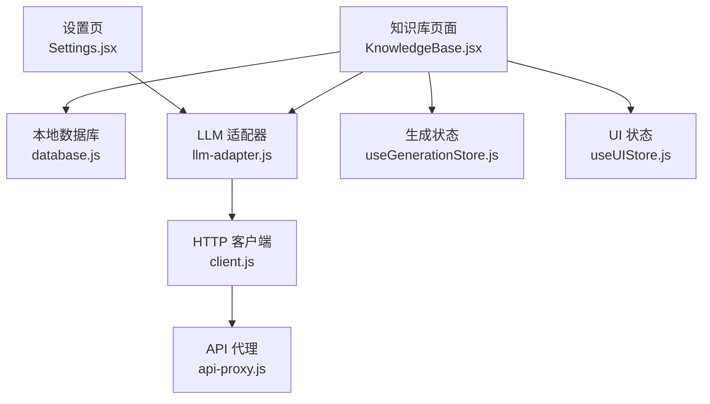
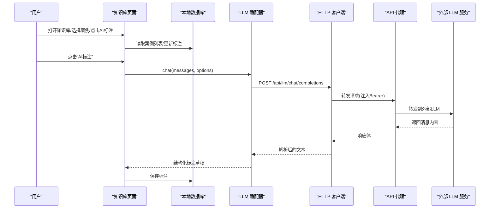
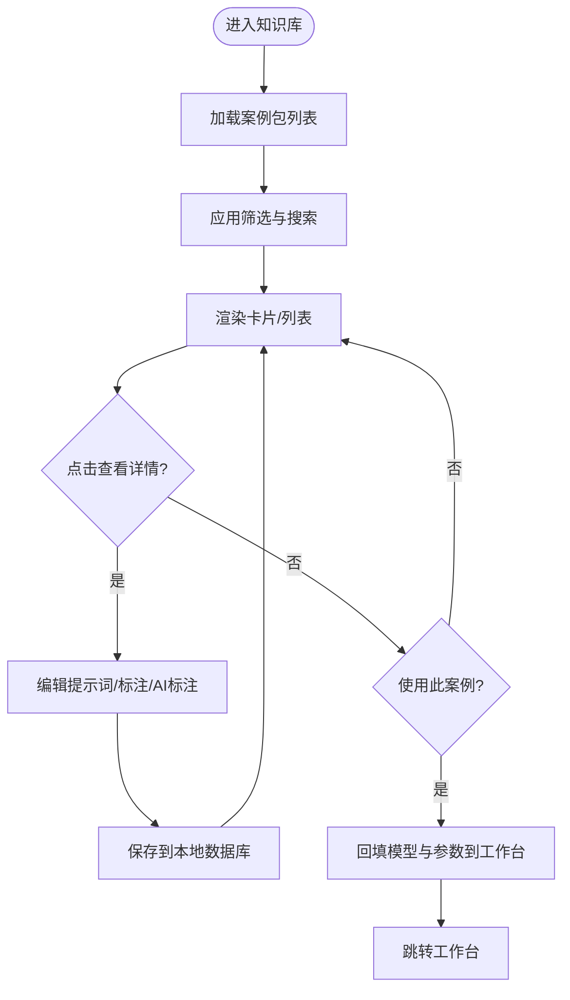
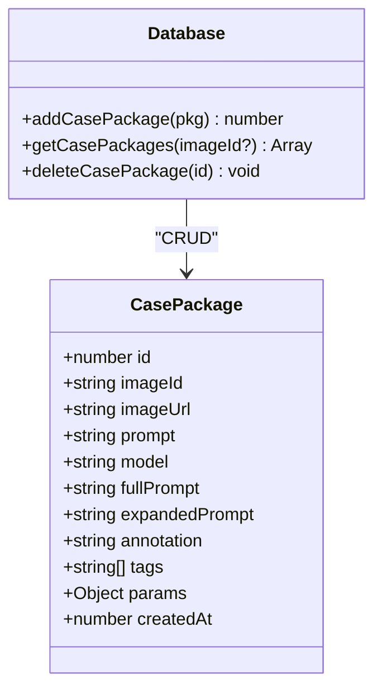
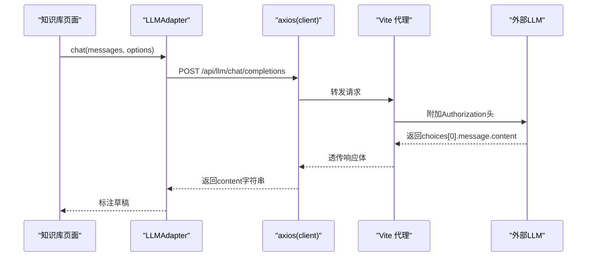
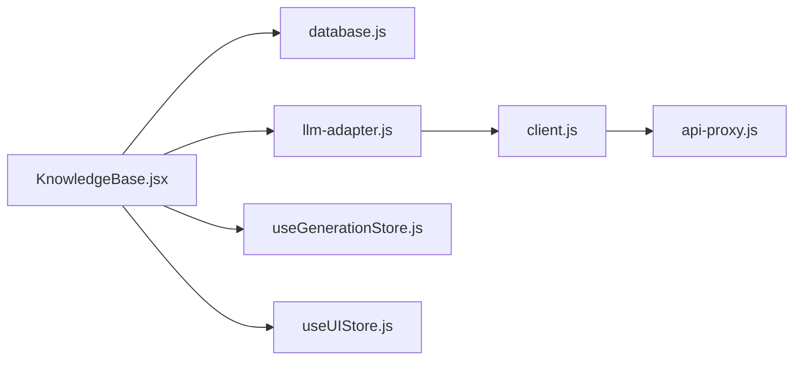

# 知识库页面 (KnowledgeBase)

<cite>
**本文引用的文件**
- [app/src/pages/KnowledgeBase.jsx](file://app/src/pages/KnowledgeBase.jsx)
- [app/src/db/database.js](file://app/src/db/database.js)
- [app/src/services/api/index.js](file://app/src/services/api/index.js)
- [app/src/services/api/llm-adapter.js](file://app/src/services/api/llm-adapter.js)
- [app/src/services/api/client.js](file://app/src/services/api/client.js)
- [app/src/server/api-proxy.js](file://app/src/server/api-proxy.js)
- [app/src/stores/useGenerationStore.js](file://app/src/stores/useGenerationStore.js)
- [app/src/stores/useUIStore.js](file://app/src/stores/useUIStore.js)
- [app/src/pages/Settings.jsx](file://app/src/pages/Settings.jsx)
</cite>

## 目录
1. [简介](#简介)
2. [项目结构](#项目结构)
3. [核心组件](#核心组件)
4. [架构总览](#架构总览)
5. [详细组件分析](#详细组件分析)
6. [依赖关系分析](#依赖关系分析)
7. [性能与优化](#性能与优化)
8. [故障排查指南](#故障排查指南)
9. [结论](#结论)
10. [附录](#附录)

## 简介
本文件面向 AI Image Studio 的“知识库”页面，系统性梳理其 RAG（检索增强生成）能力的前端实现现状、数据流与扩展点。当前版本在前端实现了案例包管理、提示词扩写与标注辅助、以及基于本地 IndexedDB 的知识库检索；RAG 的向量存储、相似度计算与结果排序等后端能力尚未在当前仓库中实现，但已预留配置项与接口路径，便于后续接入。

## 项目结构
知识库相关代码主要分布在以下位置：
- 页面与交互：app/src/pages/KnowledgeBase.jsx
- 本地数据库层：app/src/db/database.js（IndexedDB + Dexie）
- LLM 适配与 HTTP 客户端：app/src/services/api/*
- 代理转发（开发环境）：app/src/server/api-proxy.js
- 工作区状态与 UI 通知：app/src/stores/*
- 设置页（RAG Top-K、模板占位符等）：app/src/pages/Settings.jsx

图表来源
- [app/src/pages/KnowledgeBase.jsx:1-120](file://app/src/pages/KnowledgeBase.jsx#L1-L120)
- [app/src/db/database.js:298-318](file://app/src/db/database.js#L298-L318)
- [app/src/services/api/llm-adapter.js:1-60](file://app/src/services/api/llm-adapter.js#L1-L60)
- [app/src/services/api/client.js:1-146](file://app/src/services/api/client.js#L1-L146)
- [app/src/server/api-proxy.js:120-190](file://app/src/server/api-proxy.js#L120-L190)
- [app/src/stores/useGenerationStore.js:1-60](file://app/src/stores/useGenerationStore.js#L1-L60)
- [app/src/stores/useUIStore.js:1-60](file://app/src/stores/useUIStore.js#L1-L60)
- [app/src/pages/Settings.jsx:264-276](file://app/src/pages/Settings.jsx#L264-L276)

章节来源
- [app/src/pages/KnowledgeBase.jsx:1-120](file://app/src/pages/KnowledgeBase.jsx#L1-L120)
- [app/src/db/database.js:298-318](file://app/src/db/database.js#L298-L318)
- [app/src/services/api/llm-adapter.js:1-60](file://app/src/services/api/llm-adapter.js#L1-L60)
- [app/src/services/api/client.js:1-146](file://app/src/services/api/client.js#L1-L146)
- [app/src/server/api-proxy.js:120-190](file://app/src/server/api-proxy.js#L120-L190)
- [app/src/stores/useGenerationStore.js:1-60](file://app/src/stores/useGenerationStore.js#L1-L60)
- [app/src/stores/useUIStore.js:1-60](file://app/src/stores/useUIStore.js#L1-L60)
- [app/src/pages/Settings.jsx:264-276](file://app/src/pages/Settings.jsx#L264-L276)

## 核心组件
- 知识库页面 KnowledgeBase
  - 负责案例包的增删改查、筛选与搜索、详情编辑、AI 标注生成、使用案例回填工作台参数。
- 本地数据库 database
  - 通过 Dexie 维护 casePackages 表，提供 add/get/delete 等操作。
- LLM 适配器 llm-adapter
  - 封装 /api/llm/chat/completions 调用，支持通用 chat 与 prompt 扩写。
- HTTP 客户端 client
  - 统一 axios 实例、重试与取消、长耗时请求专用实例。
- API 代理 api-proxy
  - 开发环境下将 /api/llm 转发至外部 LLM 服务并注入鉴权头。
- 状态与通知 useGenerationStore / useUIStore
  - 工作区模型与参数同步、全局 Toast 通知。
- 设置页 Settings
  - 暴露 RAG Top-K 与标注辅助模板占位符配置入口。

章节来源
- [app/src/pages/KnowledgeBase.jsx:1-120](file://app/src/pages/KnowledgeBase.jsx#L1-L120)
- [app/src/db/database.js:298-318](file://app/src/db/database.js#L298-L318)
- [app/src/services/api/llm-adapter.js:1-60](file://app/src/services/api/llm-adapter.js#L1-L60)
- [app/src/services/api/client.js:1-146](file://app/src/services/api/client.js#L1-L146)
- [app/src/server/api-proxy.js:120-190](file://app/src/server/api-proxy.js#L120-L190)
- [app/src/stores/useGenerationStore.js:1-60](file://app/src/stores/useGenerationStore.js#L1-L60)
- [app/src/stores/useUIStore.js:1-60](file://app/src/stores/useUIStore.js#L1-L60)
- [app/src/pages/Settings.jsx:264-276](file://app/src/pages/Settings.jsx#L264-L276)

## 架构总览
下图展示了知识库页面的关键交互链路：用户操作触发前端逻辑，读取或写入本地 IndexedDB；AI 标注与提示词扩写通过 LLMAdapter 调用后端代理，最终到达外部 LLM 服务。

图表来源
- [app/src/pages/KnowledgeBase.jsx:113-136](file://app/src/pages/KnowledgeBase.jsx#L113-L136)
- [app/src/services/api/llm-adapter.js:131-148](file://app/src/services/api/llm-adapter.js#L131-L148)
- [app/src/services/api/client.js:112-116](file://app/src/services/api/client.js#L112-L116)
- [app/src/server/api-proxy.js:174-183](file://app/src/server/api-proxy.js#L174-L183)

## 详细组件分析

### 知识库页面 KnowledgeBase
- 功能要点
  - 加载与展示：从 IndexedDB 拉取案例包，支持网格/列表视图、按模型与时间范围过滤、关键词在提示词/标注/标签中的子串匹配。
  - 案例包 CRUD：新增弹窗录入提示词与模型，支持一键 AI 生成标注；详情页可编辑原始提示词、扩写提示词与用户标注；删除需二次确认。
  - 使用案例：将案例的模型与参数回填到工作台 store，并跳转回工作台。
  - AI 标注：调用 LLMAdapter.chat，以系统提示词约束输出格式，生成结构化标注草稿供用户编辑后保存。
- 数据流
  - 读：getCasePackages -> 映射为前端用例对象 -> 渲染
  - 写：db.casePackages.update/add/delete -> 本地持久化
  - AI：getLLMAdapter().chat -> /api/llm/chat/completions -> 代理转发 -> 外部 LLM
- 复杂度与边界
  - 过滤与搜索为 O(n) 线性扫描，适合中小规模知识库；当数据量增大时需引入索引或后端检索。
  - 删除前二次确认避免误删；异常时通过 Toast 反馈。

图表来源
- [app/src/pages/KnowledgeBase.jsx:38-64](file://app/src/pages/KnowledgeBase.jsx#L38-L64)
- [app/src/pages/KnowledgeBase.jsx:205-222](file://app/src/pages/KnowledgeBase.jsx#L205-L222)
- [app/src/pages/KnowledgeBase.jsx:138-154](file://app/src/pages/KnowledgeBase.jsx#L138-L154)
- [app/src/pages/KnowledgeBase.jsx:113-136](file://app/src/pages/KnowledgeBase.jsx#L113-L136)

章节来源
- [app/src/pages/KnowledgeBase.jsx:38-64](file://app/src/pages/KnowledgeBase.jsx#L38-L64)
- [app/src/pages/KnowledgeBase.jsx:82-104](file://app/src/pages/KnowledgeBase.jsx#L82-L104)
- [app/src/pages/KnowledgeBase.jsx:113-136](file://app/src/pages/KnowledgeBase.jsx#L113-L136)
- [app/src/pages/KnowledgeBase.jsx:138-154](file://app/src/pages/KnowledgeBase.jsx#L138-L154)
- [app/src/pages/KnowledgeBase.jsx:205-222](file://app/src/pages/KnowledgeBase.jsx#L205-L222)

### 本地数据库 layer（casePackages）
- 表结构与索引
  - 表名：casePackages
  - 主键：自增 id
  - 索引：imageId、createdAt
- 关键方法
  - addCasePackage：插入新案例包，默认 createdAt 为当前时间
  - getCasePackages：按 imageId 过滤或按创建时间倒序返回全部
  - deleteCasePackage：按 id 删除
- 使用方式
  - 页面初始化时拉取全量案例包，并在编辑/新增/删除后即时更新本地状态

图表来源
- [app/src/db/database.js:298-318](file://app/src/db/database.js#L298-L318)

章节来源
- [app/src/db/database.js:298-318](file://app/src/db/database.js#L298-L318)

### LLM 适配器与 HTTP 客户端
- LLMAdapter
  - 提供 expandPrompt 与 chat 两个方法，均通过 /api/llm/chat/completions 调用外部 LLM。
  - chat 用于知识库的“AI 标注”，expandPrompt 用于工作台的提示词扩写。
- HTTP 客户端
  - 统一 baseURL=/api，内置重试与取消信号；提供 longRunningClient 用于长耗时任务。
- 代理转发
  - 开发环境中间件将 /api/llm 转发至配置的 LLM_BASE，并注入 Authorization Bearer Token。

图表来源
- [app/src/services/api/llm-adapter.js:131-148](file://app/src/services/api/llm-adapter.js#L131-L148)
- [app/src/services/api/client.js:112-116](file://app/src/services/api/client.js#L112-L116)
- [app/src/server/api-proxy.js:174-183](file://app/src/server/api-proxy.js#L174-L183)

章节来源
- [app/src/services/api/llm-adapter.js:1-60](file://app/src/services/api/llm-adapter.js#L1-L60)
- [app/src/services/api/llm-adapter.js:131-148](file://app/src/services/api/llm-adapter.js#L131-L148)
- [app/src/services/api/client.js:1-146](file://app/src/services/api/client.js#L1-L146)
- [app/src/server/api-proxy.js:174-183](file://app/src/server/api-proxy.js#L174-L183)

### 与工作台集成
- 使用案例回填
  - 根据所选案例的 model 与 params，调用 useGenerationStore 的 setModel/setParam/setPrompt，随后导航回工作台。
- 影响范围
  - 仅修改当前会话的工作台状态，不直接写入历史或批量记录。

章节来源
- [app/src/pages/KnowledgeBase.jsx:138-154](file://app/src/pages/KnowledgeBase.jsx#L138-L154)
- [app/src/stores/useGenerationStore.js:38-52](file://app/src/stores/useGenerationStore.js#L38-L52)

### 设置页与 RAG 配置
- 现有配置项
  - RAG Top-K：控制检索返回的最相关文档数量（数值 1-10）。
  - 标注辅助模板：支持 {{user_prompt}} 与 {{rag_context}} 占位符，用于拼接上下文。
- 说明
  - 这些配置项为后续 RAG 检索与提示词组装提供参数与模板入口，当前前端未实现向量检索与 rag_context 填充逻辑。

章节来源
- [app/src/pages/Settings.jsx:264-276](file://app/src/pages/Settings.jsx#L264-L276)

## 依赖关系分析
- 组件耦合
  - KnowledgeBase 强依赖 database.js 的 casePackages 接口与 services/api 的 LLM 适配层。
  - 与 useGenerationStore 弱耦合，仅通过 setModel/setParam/setPrompt 进行参数回填。
- 外部依赖
  - Axios 作为 HTTP 客户端；Dexie 作为 IndexedDB 封装；Lucide 图标库。
- 潜在循环依赖
  - 未发现循环引用；模块职责清晰。

图表来源
- [app/src/pages/KnowledgeBase.jsx:1-12](file://app/src/pages/KnowledgeBase.jsx#L1-L12)
- [app/src/services/api/index.js:1-39](file://app/src/services/api/index.js#L1-L39)
- [app/src/services/api/llm-adapter.js:1-10](file://app/src/services/api/llm-adapter.js#L1-L10)
- [app/src/services/api/client.js:1-24](file://app/src/services/api/client.js#L1-L24)
- [app/src/server/api-proxy.js:120-190](file://app/src/server/api-proxy.js#L120-L190)
- [app/src/stores/useGenerationStore.js:1-20](file://app/src/stores/useGenerationStore.js#L1-L20)
- [app/src/stores/useUIStore.js:1-20](file://app/src/stores/useUIStore.js#L1-L20)

章节来源
- [app/src/services/api/index.js:1-39](file://app/src/services/api/index.js#L1-L39)
- [app/src/services/api/llm-adapter.js:1-10](file://app/src/services/api/llm-adapter.js#L1-L10)
- [app/src/services/api/client.js:1-24](file://app/src/services/api/client.js#L1-L24)
- [app/src/server/api-proxy.js:120-190](file://app/src/server/api-proxy.js#L120-L190)
- [app/src/stores/useGenerationStore.js:1-20](file://app/src/stores/useGenerationStore.js#L1-L20)
- [app/src/stores/useUIStore.js:1-20](file://app/src/stores/useUIStore.js#L1-L20)

## 性能与优化
- 当前实现
  - 本地检索为内存过滤，时间复杂度 O(n)，空间复杂度 O(n)。
  - LLM 调用具备重试与超时保护，长耗时任务使用独立客户端。
- 建议优化方向
  - 前端索引：对高频字段（prompt、annotation、tags、model）建立轻量索引或使用 Web Worker 加速过滤。
  - 分页与懒加载：当案例包数量较大时，采用分页或虚拟滚动减少首屏渲染压力。
  - 缓存策略：对 LLM 生成的标注结果做短期缓存（如按 prompt+expandedPrompt 哈希），避免重复调用。
  - 增量更新：后台监听 IndexedDB 变更事件，按需刷新局部视图而非全量重绘。
  - 网络优化：对 LLM 请求增加去抖与合并策略，避免短时间内多次并发。

[本节为通用指导，无需源码引用]

## 故障排查指南
- 常见问题
  - 无法连接 LLM：检查 .env 中 VITE_EXPANSION_LLM_BASE 与 VITE_EXPANSION_LLM_KEY 是否配置正确；确认代理路由 /api/llm 可用。
  - 代理失败：查看浏览器控制台与终端日志，确认 api-proxy 是否正确转发与注入 Authorization。
  - 本地数据异常：检查 IndexedDB 权限与配额；必要时重置应用数据。
  - 标注生成失败：确认 LLM 返回 content 非空且可解析；必要时降级为原始输入。
- 定位步骤
  - 打开开发者工具 Network 面板，观察 /api/llm/chat/completions 的请求与响应。
  - 在终端查看 api-proxy 日志，确认目标 URL 与头部信息。
  - 在 Console 中搜索 “[LLMAdapter]”、“[api-proxy]” 关键字快速定位错误堆栈。

章节来源
- [app/src/services/api/llm-adapter.js:53-61](file://app/src/services/api/llm-adapter.js#L53-L61)
- [app/src/server/api-proxy.js:109-116](file://app/src/server/api-proxy.js#L109-L116)
- [app/src/services/api/client.js:38-85](file://app/src/services/api/client.js#L38-L85)

## 结论
当前知识库页面已具备完善的案例包管理与 AI 标注辅助能力，并通过 LLMAdapter 与代理机制打通了外部大模型服务。RAG 的核心配置项（Top-K、模板占位符）已在设置页暴露，为后续接入向量检索与相似度排序奠定了基础。建议在数据量增长后引入索引与分页，并结合缓存与增量更新提升整体体验。

[本节为总结性内容，无需源码引用]

## 附录

### 与后端服务的交互逻辑（现状与规划）
- 现状
  - 知识库检索：纯前端本地过滤（prompt/annotation/tags 子串匹配）。
  - AI 标注：通过 /api/llm/chat/completions 调用外部 LLM，返回文本型标注草稿。
- 规划（待实现）
  - 知识向量存储：在后端构建向量索引（如基于 embedding 模型），将案例包的 prompt、annotation、tags 等文本转为向量入库。
  - 相似度计算与排序：查询时将用户输入也向量化，计算余弦相似度并按得分降序返回 Top-K。
  - 结果融合：结合模型类型、时间权重与标签相关性进行重排。
  - 接口设计建议
    - POST /api/kb/search
      - 入参：{ query, top_k, filters: { model, date_range, tags }, template_vars: { user_prompt, rag_context } }
      - 出参：{ results: [{ id, score, snippet, metadata }], context: string }
    - 由 Settings 中的 RAG Top-K 与模板占位符驱动拼装 rag_context。

[本节为概念性说明，无需源码引用]

### 提示词模板管理系统（现状与规划）
- 现状
  - 设置页提供“标注辅助模板”文本框，支持 {{user_prompt}} 与 {{rag_context}} 占位符。
- 规划
  - 版本控制：为模板引入版本号与变更记录，支持回滚与灰度发布。
  - 共享机制：支持团队级模板共享与权限控制（只读/可编辑）。
  - 预览与校验：在线预览模板渲染效果，并对非法占位符进行校验。

[本节为概念性说明，无需源码引用]

### 导入导出与备份恢复（现状与规划）
- 现状
  - 无现成的导入导出与备份恢复功能。
- 规划
  - 导出：将 casePackages 表序列化为 JSON 文件，包含元数据与时间戳。
  - 导入：校验 JSON 结构，去重与冲突处理（按 id 或唯一键合并）。
  - 备份恢复：定时导出到 OSS（借助现有 OSS 配置），支持一键恢复。

[本节为概念性说明，无需源码引用]