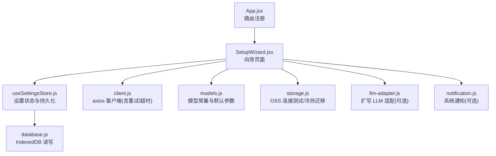
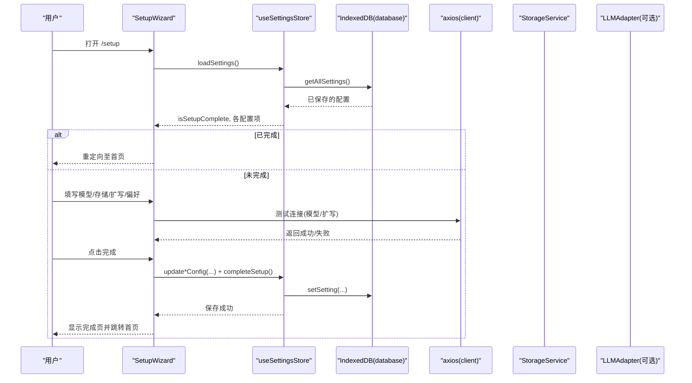
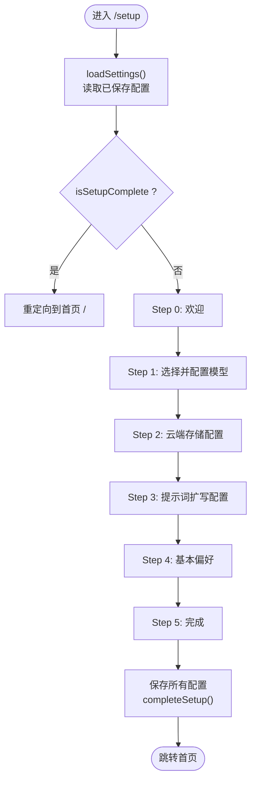
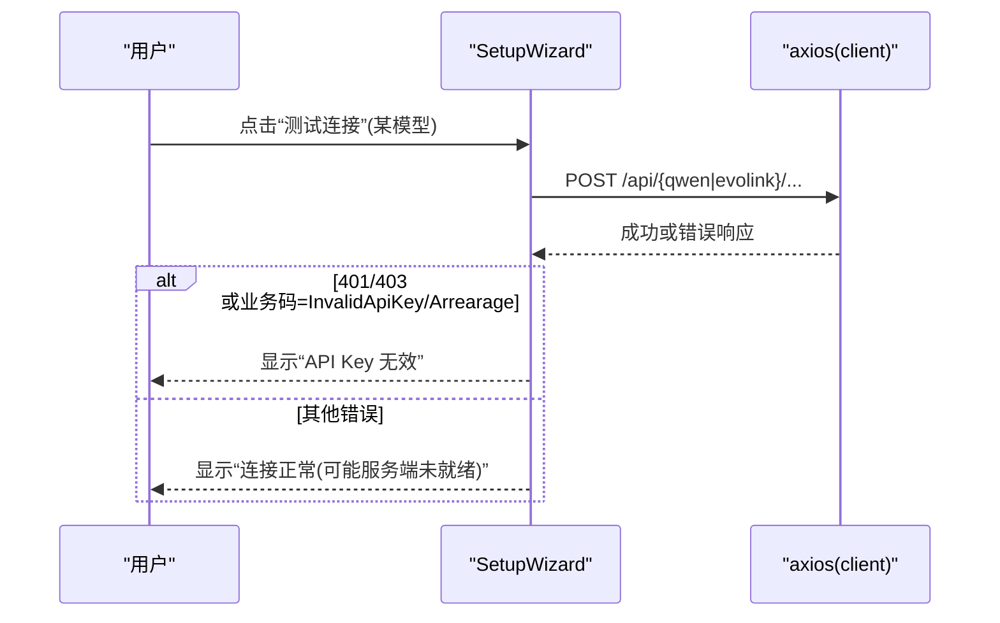
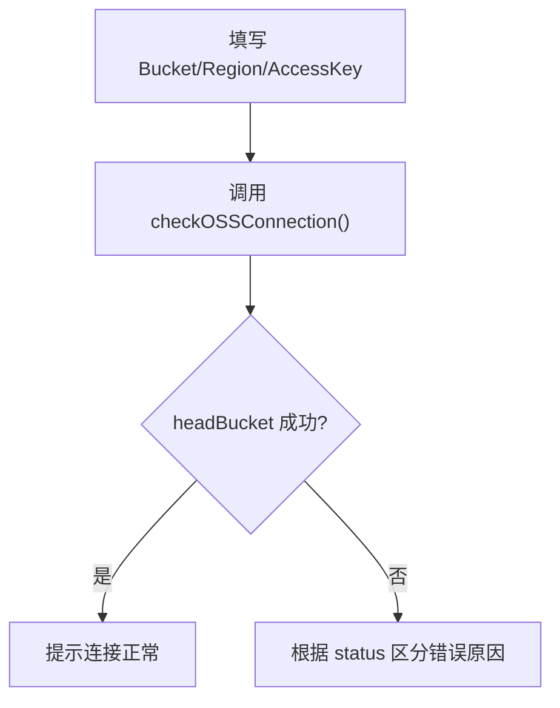
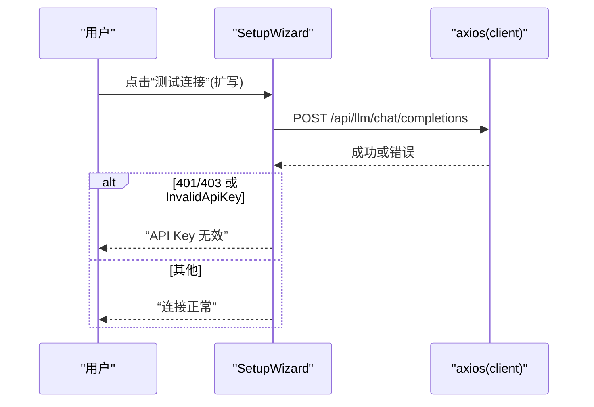
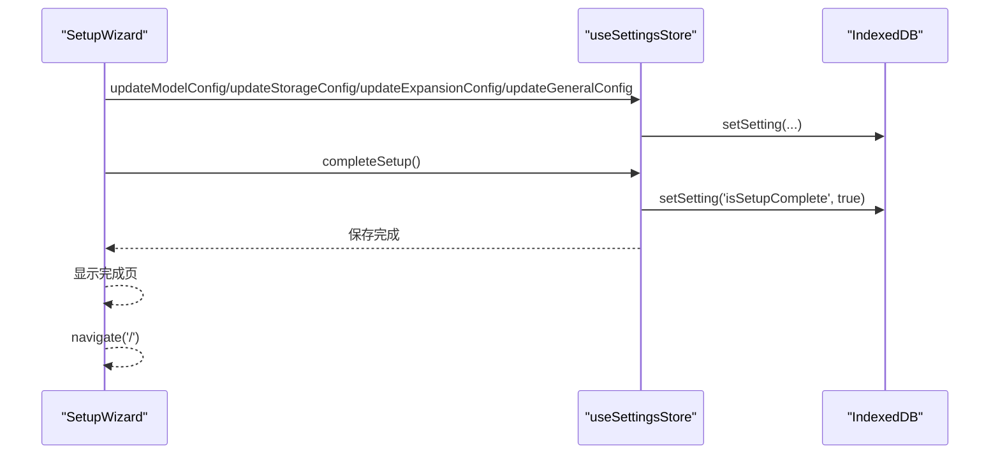
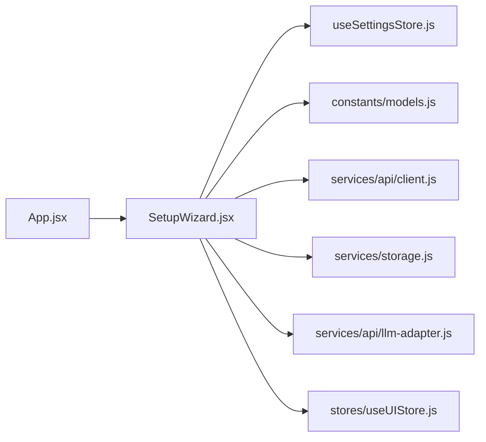

# 设置向导页面 (SetupWizard)

<cite>
**本文引用的文件**   
- [app/src/pages/SetupWizard.jsx](file://app/src/pages/SetupWizard.jsx)
- [app/src/stores/useSettingsStore.js](file://app/src/stores/useSettingsStore.js)
- [app/src/constants/models.js](file://app/src/constants/models.js)
- [app/src/db/database.js](file://app/src/db/database.js)
- [app/src/services/api/client.js](file://app/src/services/api/client.js)
- [app/src/services/storage.js](file://app/src/services/storage.js)
- [app/src/App.jsx](file://app/src/App.jsx)
- [app/src/services/api/llm-adapter.js](file://app/src/services/api/llm-adapter.js)
- [app/src/services/notification.js](file://app/src/services/notification.js)
</cite>

## 目录
1. [简介](#简介)
2. [项目结构](#项目结构)
3. [核心组件](#核心组件)
4. [架构总览](#架构总览)
5. [详细组件分析](#详细组件分析)
6. [依赖关系分析](#依赖关系分析)
7. [性能与可用性考量](#性能与可用性考量)
8. [故障排查指南](#故障排查指南)
9. [结论](#结论)
10. [附录：配置项与环境变量](#附录配置项与环境变量)

## 简介
本文件为 AI Image Studio 的设置向导页面（SetupWizard）提供系统化、可操作的技术文档。内容覆盖引导式配置流程的实现细节，包括新用户初始化、API 密钥验证、环境检测、多步骤状态管理、表单校验与数据收集、条件分支与错误处理、用户反馈机制，以及完成后的应用初始化与数据迁移策略。同时给出可扩展方案，如配置预填、模板导入与快速启动。

## 项目结构
设置向导位于 pages 层，通过路由挂载；其状态持久化由 settings store 负责，底层使用 IndexedDB；网络请求统一走 axios 客户端并通过 Vite 代理转发到后端 API；存储能力（冷热分层）由 StorageService 提供；模型常量定义在 constants 中。

图表来源
- [app/src/App.jsx:317-325](file://app/src/App.jsx#L317-L325)
- [app/src/pages/SetupWizard.jsx:75-138](file://app/src/pages/SetupWizard.jsx#L75-L138)
- [app/src/stores/useSettingsStore.js:108-149](file://app/src/stores/useSettingsStore.js#L108-L149)
- [app/src/db/database.js:276-295](file://app/src/db/database.js#L276-L295)
- [app/src/services/api/client.js:18-33](file://app/src/services/api/client.js#L18-L33)
- [app/src/constants/models.js:8-95](file://app/src/constants/models.js#L8-L95)
- [app/src/services/storage.js:17-42](file://app/src/services/storage.js#L17-L42)
- [app/src/services/api/llm-adapter.js:23-61](file://app/src/services/api/llm-adapter.js#L23-L61)
- [app/src/services/notification.js:19-43](file://app/src/services/notification.js#L19-L43)

章节来源
- [app/src/App.jsx:317-325](file://app/src/App.jsx#L317-L325)
- [app/src/pages/SetupWizard.jsx:75-138](file://app/src/pages/SetupWizard.jsx#L75-L138)
- [app/src/stores/useSettingsStore.js:108-149](file://app/src/stores/useSettingsStore.js#L108-L149)
- [app/src/db/database.js:276-295](file://app/src/db/database.js#L276-L295)
- [app/src/services/api/client.js:18-33](file://app/src/services/api/client.js#L18-L33)
- [app/src/constants/models.js:8-95](file://app/src/constants/models.js#L8-L95)
- [app/src/services/storage.js:17-42](file://app/src/services/storage.js#L17-L42)
- [app/src/services/api/llm-adapter.js:23-61](file://app/src/services/api/llm-adapter.js#L23-L61)
- [app/src/services/notification.js:19-43](file://app/src/services/notification.js#L19-L43)

## 核心组件
- SetupWizard 页面：实现 6 步引导（欢迎、模型、存储、扩写、偏好、完成），负责本地表单状态、跨步骤导航、保存与跳转。
- useSettingsStore：集中管理模型配置、存储配置、扩写配置、通用配置及“是否已完成向导”标记，并提供持久化接口。
- database：基于 Dexie 的 IndexedDB 封装，提供 key/value 设置存取。
- client：统一的 axios 实例，内置重试、超时、取消信号等拦截器。
- models：模型元数据与默认参数，驱动向导中的模型列表与默认值。
- storage：OSS 客户端构建与连接测试、冷热区迁移、缩略图生成等。
- llm-adapter：提示词扩写的 LLM 调用适配器（用于后续功能，向导中仅做连通性测试）。
- notification：浏览器通知能力封装（非向导必需，但可作为扩展入口）。

章节来源
- [app/src/pages/SetupWizard.jsx:75-138](file://app/src/pages/SetupWizard.jsx#L75-L138)
- [app/src/stores/useSettingsStore.js:47-106](file://app/src/stores/useSettingsStore.js#L47-L106)
- [app/src/db/database.js:276-295](file://app/src/db/database.js#L276-L295)
- [app/src/services/api/client.js:18-88](file://app/src/services/api/client.js#L18-L88)
- [app/src/constants/models.js:8-95](file://app/src/constants/models.js#L8-L95)
- [app/src/services/storage.js:17-42](file://app/src/services/storage.js#L17-L42)
- [app/src/services/api/llm-adapter.js:23-61](file://app/src/services/api/llm-adapter.js#L23-L61)
- [app/src/services/notification.js:19-43](file://app/src/services/notification.js#L19-L43)

## 架构总览
下图展示了向导从加载、读取已有配置、用户交互、保存到完成跳转的整体流程。

图表来源
- [app/src/pages/SetupWizard.jsx:114-138](file://app/src/pages/SetupWizard.jsx#L114-L138)
- [app/src/stores/useSettingsStore.js:108-149](file://app/src/stores/useSettingsStore.js#L108-L149)
- [app/src/db/database.js:276-295](file://app/src/db/database.js#L276-L295)
- [app/src/services/api/client.js:18-33](file://app/src/services/api/client.js#L18-L33)
- [app/src/services/storage.js:17-42](file://app/src/services/storage.js#L17-L42)
- [app/src/services/api/llm-adapter.js:23-61](file://app/src/services/api/llm-adapter.js#L23-L61)

## 详细组件分析

### 向导流程与状态管理
- 步骤定义：欢迎、模型、存储、扩写、偏好、完成，共 6 步。
- 状态来源：
  - 模型配置：按 MODEL_ORDER 遍历 MODELS，初始化每个模型的 enabled/apiKey/endpoint。
  - 存储配置：热区容量、Bucket/Region/AccessKey。
  - 扩写配置：模型、API Key、Endpoint。
  - 偏好：默认模型、热区大小。
- 导航控制：next/back 限制范围；完成时保存并跳转到首页。
- 完成判定：若 isSetupComplete 为真，进入即重定向至首页，避免重复配置。

图表来源
- [app/src/pages/SetupWizard.jsx:114-138](file://app/src/pages/SetupWizard.jsx#L114-L138)
- [app/src/pages/SetupWizard.jsx:259-279](file://app/src/pages/SetupWizard.jsx#L259-L279)
- [app/src/stores/useSettingsStore.js:101-106](file://app/src/stores/useSettingsStore.js#L101-L106)

章节来源
- [app/src/pages/SetupWizard.jsx:75-138](file://app/src/pages/SetupWizard.jsx#L75-L138)
- [app/src/pages/SetupWizard.jsx:259-279](file://app/src/pages/SetupWizard.jsx#L259-L279)
- [app/src/stores/useSettingsStore.js:101-106](file://app/src/stores/useSettingsStore.js#L101-L106)

### 模型配置与 API 密钥验证
- 模型列表与默认参数来自 constants/models.js，包含 qwen-image-3、gpt-image-2、nanobanana-2。
- 支持启用/禁用单个模型，并在启用后输入 apiKey 和 endpoint。
- 连接测试逻辑：
  - qwen-image-3：调用 /api/qwen/，根据响应码或业务 code 判断是否有效。
  - gpt-image-2：调用 /api/evolink/v1/images/generations，解析错误信息判断 Key 是否有效。
  - 其他模型：统一走 evolink 图像生成端点，进行最小请求测试。
- 结果展示：即时反馈“连接正常/无效/失败”，并附带耗时。

图表来源
- [app/src/pages/SetupWizard.jsx:156-224](file://app/src/pages/SetupWizard.jsx#L156-L224)
- [app/src/services/api/client.js:18-33](file://app/src/services/api/client.js#L18-L33)

章节来源
- [app/src/pages/SetupWizard.jsx:156-224](file://app/src/pages/SetupWizard.jsx#L156-L224)
- [app/src/constants/models.js:8-95](file://app/src/constants/models.js#L8-L95)

### 存储配置与 OSS 环境检测
- 字段：Bucket、Region、AccessKeyId、AccessKeySecret、热区容量。
- 环境检测：可通过 StorageService.checkOSSConnection 对 headBucket 发起探测，返回明确错误语义（无权限/Bucket 不存在/连接失败）。
- 注意：向导当前未直接集成 OSS 连通性按钮，但提供了完整配置项，可在后续扩展。

图表来源
- [app/src/services/storage.js:17-42](file://app/src/services/storage.js#L17-L42)
- [app/src/services/storage.js:181-197](file://app/src/services/storage.js#L181-L197)

章节来源
- [app/src/services/storage.js:17-42](file://app/src/services/storage.js#L17-L42)
- [app/src/services/storage.js:181-197](file://app/src/services/storage.js#L181-L197)

### 提示词扩写配置与 LLM 连通性测试
- 支持选择扩写模型（qwen-max/plus/turbo）、输入 API Key 与 Endpoint。
- 连通性测试：POST /api/llm/chat/completions，最小消息体，根据响应码或业务码判断 Key 有效性。
- 该能力由 llm-adapter 抽象，便于后续在生成流程中复用。

图表来源
- [app/src/pages/SetupWizard.jsx:226-257](file://app/src/pages/SetupWizard.jsx#L226-L257)
- [app/src/services/api/llm-adapter.js:23-61](file://app/src/services/api/llm-adapter.js#L23-L61)

章节来源
- [app/src/pages/SetupWizard.jsx:226-257](file://app/src/pages/SetupWizard.jsx#L226-L257)
- [app/src/services/api/llm-adapter.js:23-61](file://app/src/services/api/llm-adapter.js#L23-L61)

### 偏好设置与默认模型
- 热区大小：滑块调整（GB），影响后续冷热迁移阈值。
- 默认模型：从已配置的模型中选择，作为工作区默认生成目标。

章节来源
- [app/src/pages/SetupWizard.jsx:435-466](file://app/src/pages/SetupWizard.jsx#L435-L466)
- [app/src/constants/models.js:8-95](file://app/src/constants/models.js#L8-L95)

### 保存与完成
- 保存顺序：模型配置 → 存储配置 → 扩写配置 → 通用配置 → 标记完成。
- 持久化：useSettingsStore.saveSettings 将各配置写入 IndexedDB 的 settings 表。
- 完成跳转：completeSetup 后，显示完成页并导航至首页。

图表来源
- [app/src/pages/SetupWizard.jsx:259-279](file://app/src/pages/SetupWizard.jsx#L259-L279)
- [app/src/stores/useSettingsStore.js:108-149](file://app/src/stores/useSettingsStore.js#L108-L149)
- [app/src/db/database.js:276-295](file://app/src/db/database.js#L276-L295)

章节来源
- [app/src/pages/SetupWizard.jsx:259-279](file://app/src/pages/SetupWizard.jsx#L259-L279)
- [app/src/stores/useSettingsStore.js:108-149](file://app/src/stores/useSettingsStore.js#L108-L149)
- [app/src/db/database.js:276-295](file://app/src/db/database.js#L276-L295)

### 条件分支与错误处理
- 前置检查：若 isSetupComplete 为真，直接进入首页，避免重复配置。
- 模型测试：
  - 未配置 endpoint/key：直接提示“未配置”。
  - 401/403 或业务码 InvalidApiKey/Arrearage：提示“API Key 无效”。
  - 其他错误：视为“连接正常”（服务端可能返回业务错误但不影响连通性）。
- 扩写测试：类似逻辑，针对 /api/llm/chat/completions。
- 保存失败：捕获异常并弹出错误 toast。

章节来源
- [app/src/pages/SetupWizard.jsx:114-138](file://app/src/pages/SetupWizard.jsx#L114-L138)
- [app/src/pages/SetupWizard.jsx:156-224](file://app/src/pages/SetupWizard.jsx#L156-L224)
- [app/src/pages/SetupWizard.jsx:226-257](file://app/src/pages/SetupWizard.jsx#L226-L257)
- [app/src/pages/SetupWizard.jsx:259-279](file://app/src/pages/SetupWizard.jsx#L259-L279)

### 用户反馈机制
- Toast 通知：保存成功/失败均通过 UI Store 的 addToast 展示。
- 进度指示：测试连接时显示加载动画，完成后即时更新结果文本。
- 完成页：展示已启用模型数量，鼓励进入工作区。

章节来源
- [app/src/pages/SetupWizard.jsx:259-279](file://app/src/pages/SetupWizard.jsx#L259-L279)
- [app/src/stores/useUIStore.js:80-103](file://app/src/stores/useUIStore.js#L80-L103)

### 配置预填、模板导入与快速启动（扩展方案）
- 配置预填：
  - 利用环境变量注入默认值（如 VITE_EXPANSION_LLM_MODEL），在 useSettingsStore 的默认配置中读取并填充。
  - 首次安装时，可从后端拉取“站点级默认配置”并合并到本地。
- 模板导入：
  - 提供 JSON 模板（包含 modelConfigs/storageConfig/expansionConfig/generalConfig），在向导前一步提供“导入模板”按钮，解析后回填表单。
  - 导入后可一键执行“测试连接”，再进入下一步。
- 快速启动：
  - 若检测到部分关键配置缺失（如默认模型未选），在“完成”前阻止提交并高亮必填项。
  - 提供“使用推荐配置”按钮，一键启用常用模型并填入示例 Endpoint（需配合后端白名单或网关鉴权）。

[本节为概念性扩展建议，不直接分析具体代码文件]

### 向导完成后的应用初始化与数据迁移
- 应用初始化：
  - App 启动时加载任务、初始化桥接、请求通知权限；这些与向导无关，但在向导完成后即可正常使用。
- 数据迁移：
  - StorageService.checkAndMigrate 会根据 hotCapacity 阈值自动将旧图片迁移到冷区（OSS），释放本地空间。
  - 建议在向导完成且用户首次进入工作区时触发一次迁移检查。

章节来源
- [app/src/App.jsx:272-284](file://app/src/App.jsx#L272-L284)
- [app/src/services/storage.js:252-298](file://app/src/services/storage.js#L252-L298)

## 依赖关系分析
- SetupWizard 依赖：
  - useSettingsStore：读写配置、持久化、完成标记。
  - constants/models：模型元数据与默认参数。
  - services/api/client：HTTP 请求（含重试/超时）。
  - services/storage：OSS 客户端构建与连接测试（可扩展到向导内）。
  - services/api/llm-adapter：扩写 LLM 适配（向导仅做连通性测试）。
  - stores/useUIStore：toast 通知。
- 路由与挂载：
  - App.jsx 注册 /setup 路由，懒加载 SetupWizard。

图表来源
- [app/src/pages/SetupWizard.jsx:75-138](file://app/src/pages/SetupWizard.jsx#L75-L138)
- [app/src/App.jsx:317-325](file://app/src/App.jsx#L317-L325)

章节来源
- [app/src/pages/SetupWizard.jsx:75-138](file://app/src/pages/SetupWizard.jsx#L75-L138)
- [app/src/App.jsx:317-325](file://app/src/App.jsx#L317-L325)

## 性能与可用性考量
- 网络请求：
  - 统一使用 axios 实例，具备指数退避重试与超时控制；长耗时接口使用 longRunningClient。
  - 测试连接采用较短超时（15s），避免阻塞用户体验。
- 本地存储：
  - 使用 IndexedDB 异步持久化，避免主线程阻塞。
- 界面交互：
  - 测试连接期间禁用按钮，防止重复触发。
  - 结果文案包含耗时，帮助用户感知网络质量。
- 可扩展优化：
  - 批量测试：对多个模型并行发起测试，提升效率。
  - 缓存测试结果：避免重复测试同一模型。

[本节提供通用指导，不直接分析具体代码文件]

## 故障排查指南
- 无法进入向导：
  - 确认路由 /setup 是否正确注册。
  - 检查 isSetupComplete 是否为真导致被重定向。
- 模型连接失败：
  - 检查 endpoint 与 apiKey 是否正确。
  - 查看后端代理是否可达（/api/*）。
  - 关注响应码 401/403 或业务码 InvalidApiKey/Arrearage。
- 扩写 LLM 不可用：
  - 确认 /api/llm/chat/completions 是否可用。
  - 检查模型名称与 Key 是否匹配。
- OSS 配置问题：
  - 使用 StorageService.checkOSSConnection 诊断权限与 Bucket 是否存在。
- 保存失败：
  - 检查 IndexedDB 是否可用，查看控制台错误日志。

章节来源
- [app/src/pages/SetupWizard.jsx:156-224](file://app/src/pages/SetupWizard.jsx#L156-L224)
- [app/src/pages/SetupWizard.jsx:226-257](file://app/src/pages/SetupWizard.jsx#L226-L257)
- [app/src/services/storage.js:181-197](file://app/src/services/storage.js#L181-L197)
- [app/src/stores/useSettingsStore.js:138-149](file://app/src/stores/useSettingsStore.js#L138-L149)

## 结论
SetupWizard 以清晰的多步骤流程组织新用户初始化和环境配置，结合 useSettingsStore 与 IndexedDB 实现可靠的状态持久化；通过 axios 客户端进行 API 连通性测试，提供即时反馈与错误定位；配合 StorageService 与 LLMAdapter 的能力，为后续生成与扩写功能奠定基础。整体设计具备良好的可扩展性与容错性，适合在生产环境中稳定运行。

[本节为总结性内容，不直接分析具体代码文件]

## 附录：配置项与环境变量
- 模型配置（modelConfigs）
  - 键：模型 ID（如 qwen-image-3、gpt-image-2、nanobanana-2）
  - 值：enabled、apiKey、endpoint、defaultParams
- 存储配置（storageConfig）
  - zone、autoCleanupDays、thumbnailMaxDimension、ossBucket、ossRegion、hotCapacity
- 扩写配置（expansionConfig）
  - enabled、model、maxVariations、temperature、apiKey、endpoint/apiBase
- 通用配置（generalConfig）
  - theme、language、autoSave、maxConcurrentTasks、defaultModel
- 环境变量（示例）
  - VITE_OSS_BUCKET、VITE_OSS_REGION、VITE_EXPANSION_LLM_MODEL

章节来源
- [app/src/stores/useSettingsStore.js:25-45](file://app/src/stores/useSettingsStore.js#L25-L45)
- [app/src/constants/models.js:8-95](file://app/src/constants/models.js#L8-L95)