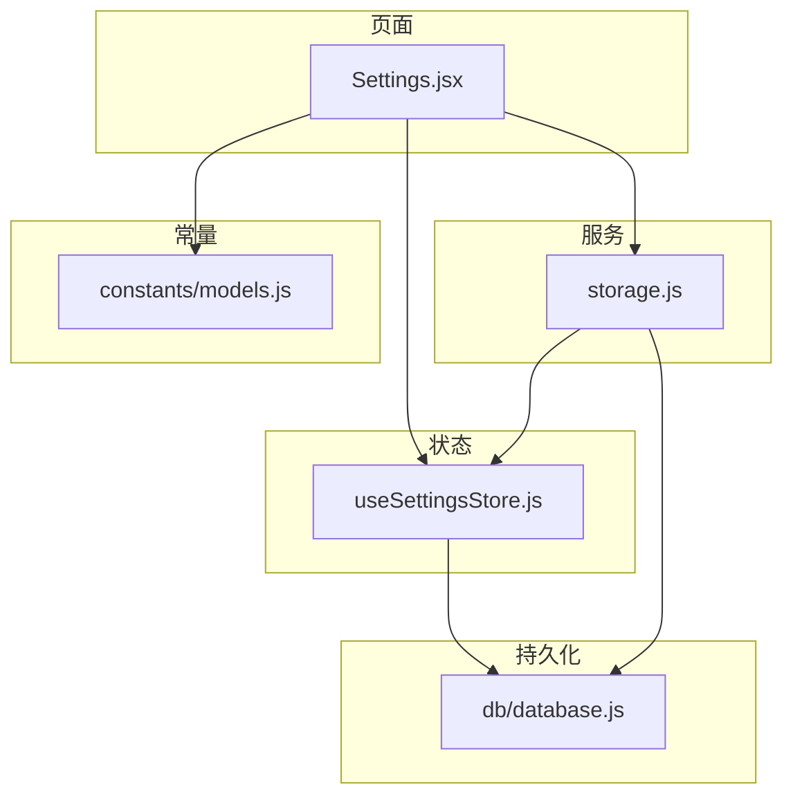
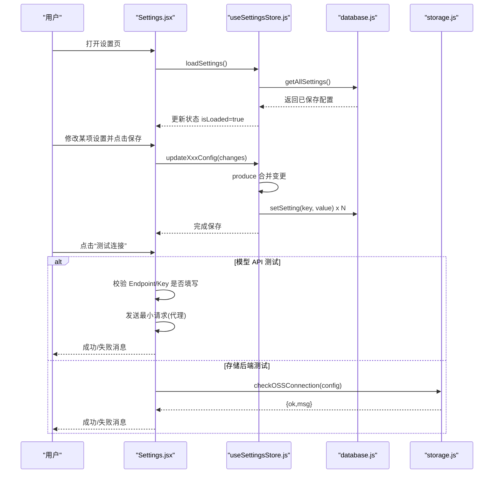
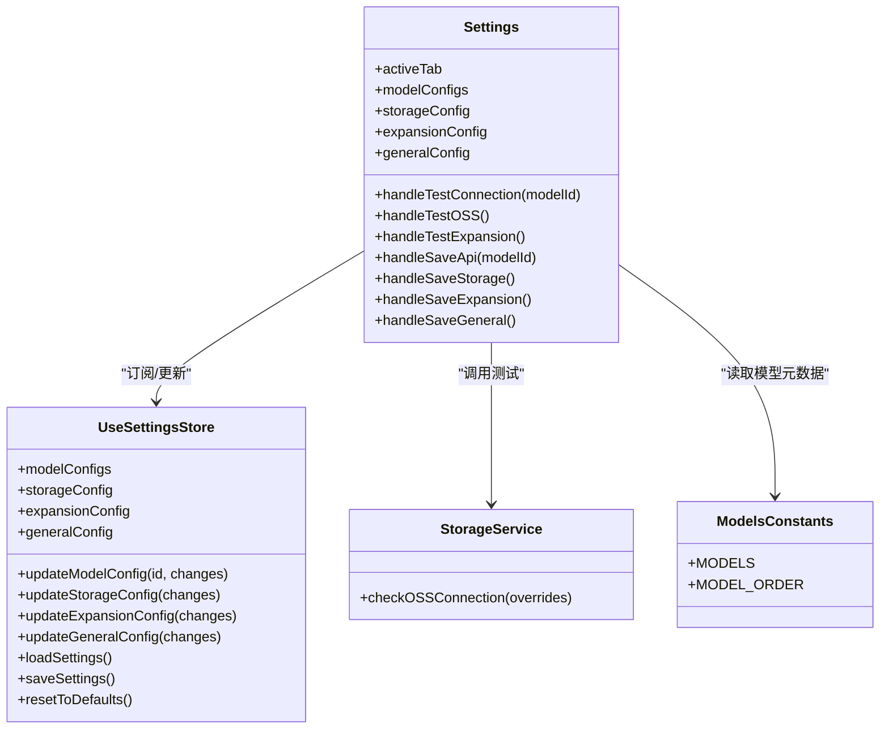
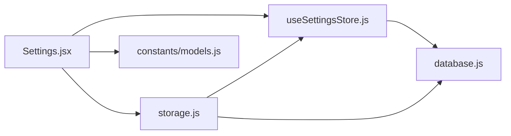
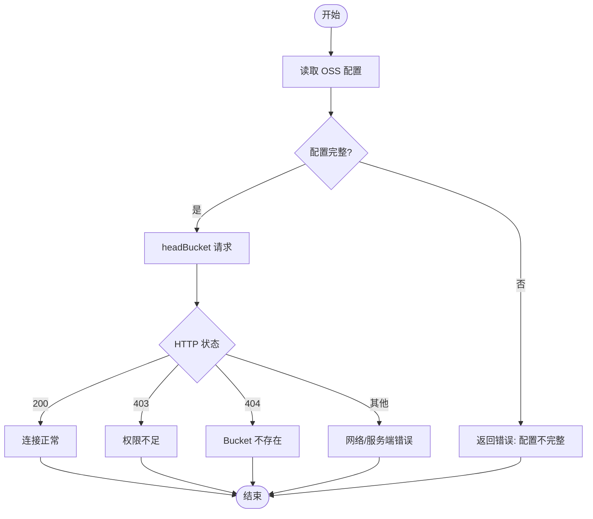

# 设置页面 (Settings)

<cite>
**本文引用的文件**   
- [app/src/pages/Settings.jsx](file://app/src/pages/Settings.jsx)
- [app/src/stores/useSettingsStore.js](file://app/src/stores/useSettingsStore.js)
- [app/src/services/storage.js](file://app/src/services/storage.js)
- [app/src/constants/models.js](file://app/src/constants/models.js)
- [app/src/db/database.js](file://app/src/db/database.js)
</cite>

## 目录
1. [简介](#简介)
2. [项目结构](#项目结构)
3. [核心组件](#核心组件)
4. [架构总览](#架构总览)
5. [详细组件分析](#详细组件分析)
6. [依赖关系分析](#依赖关系分析)
7. [性能考虑](#性能考虑)
8. [故障排查指南](#故障排查指南)
9. [结论](#结论)
10. [附录](#附录)

## 简介
本文件为 AI Image Studio 的设置页面提供综合文档，聚焦于 Settings 组件的配置管理界面实现。内容涵盖：
- 模型 API 密钥配置、存储后端设置与扩展选项管理
- 与 useSettingsStore 的状态同步机制及本地持久化策略
- 表单验证逻辑、默认值管理与动态显示逻辑
- 设置项的分类组织、搜索过滤（现状说明）和用户反馈机制
- 配置迁移、版本兼容性与错误恢复方案

## 项目结构
设置页面由以下关键模块组成：
- 页面组件：负责 UI 渲染、用户交互、状态初始化与保存
- 状态管理：集中式 store 维护所有设置并持久化到 IndexedDB
- 存储服务：封装 OSS 连接测试与热/冷区数据迁移
- 常量定义：模型能力、尺寸、默认参数等
- 数据库层：基于 Dexie 的 key/value 设置表读写

图表来源
- [app/src/pages/Settings.jsx:1-301](file://app/src/pages/Settings.jsx#L1-L301)
- [app/src/stores/useSettingsStore.js:1-162](file://app/src/stores/useSettingsStore.js#L1-L162)
- [app/src/services/storage.js:1-393](file://app/src/services/storage.js#L1-L393)
- [app/src/constants/models.js:1-106](file://app/src/constants/models.js#L1-L106)
- [app/src/db/database.js:1-339](file://app/src/db/database.js#L1-L339)

章节来源
- [app/src/pages/Settings.jsx:1-301](file://app/src/pages/Settings.jsx#L1-L301)
- [app/src/stores/useSettingsStore.js:1-162](file://app/src/stores/useSettingsStore.js#L1-L162)
- [app/src/services/storage.js:1-393](file://app/src/services/storage.js#L1-L393)
- [app/src/constants/models.js:1-106](file://app/src/constants/models.js#L1-L106)
- [app/src/db/database.js:1-339](file://app/src/db/database.js#L1-L339)

## 核心组件
- Settings 页面
  - 四个分类标签页：模型 API、存储、提示词扩写、通用
  - 每个标签页包含对应表单字段、保存按钮与连接测试
  - 使用 MaskedInput 保护敏感输入（API Key、AccessKey Secret）
  - 通过 useUIStore 提供主题切换与 Toast 通知
- useSettingsStore
  - 维护 modelConfigs、storageConfig、expansionConfig、generalConfig 四大块
  - 提供 update* 方法，内部使用 immer produce 进行不可变更新，并自动持久化
  - loadSettings/saveSettings 对接 IndexedDB settings 表
  - resetToDefaults 重置所有设置为默认值
- StorageService
  - 提供 checkOSSConnection 用于存储后端连通性测试
  - 封装热/冷区迁移、缩略图生成、统计信息等功能
- constants/models
  - 定义各模型的名称、能力、支持尺寸、默认参数等
  - 驱动 Settings 中“模型 API”标签页的动态渲染与差异化字段展示

章节来源
- [app/src/pages/Settings.jsx:1-301](file://app/src/pages/Settings.jsx#L1-L301)
- [app/src/stores/useSettingsStore.js:1-162](file://app/src/stores/useSettingsStore.js#L1-L162)
- [app/src/services/storage.js:1-393](file://app/src/services/storage.js#L1-L393)
- [app/src/constants/models.js:1-106](file://app/src/constants/models.js#L1-L106)

## 架构总览
设置页面的数据流与控制流如下：
- 页面加载时调用 loadSettings 从 IndexedDB 读取已保存配置，填充本地 state
- 用户修改表单后点击保存，触发对应的 update* 动作，store 合并变更并持久化
- 连接测试通过 axios 或 StorageService 发起网络请求，根据响应结果给出即时反馈
- 不同模型在“模型 API”页按 capabilities 和 defaultParams 动态展示差异化字段

图表来源
- [app/src/pages/Settings.jsx:74-208](file://app/src/pages/Settings.jsx#L74-L208)
- [app/src/stores/useSettingsStore.js:108-149](file://app/src/stores/useSettingsStore.js#L108-L149)
- [app/src/services/storage.js:180-197](file://app/src/services/storage.js#L180-L197)
- [app/src/db/database.js:289-295](file://app/src/db/database.js#L289-L295)

## 详细组件分析

### 设置页面 (Settings.jsx)
- 标签页组织
  - 模型 API：遍历 MODEL_ORDER，渲染每个模型的 Endpoint、API Key、保存与测试；根据模型 id 动态展示默认尺寸/质量等差异字段
  - 存储：本地路径只读、热区容量滑块+数字输入、阿里云 OSS 配置（Bucket/Region/AccessKey）、连接测试与保存
  - 提示词扩写：选择扩写模型、Endpoint、API Key、RAG Top-K、标注辅助模板、连接测试与保存
  - 通用：默认生成模型、图片默认格式、浏览器通知、声音提示、界面语言、主题切换、保存设置
- 状态同步
  - 组件挂载时调用 loadSettings，随后将 store 中的 modelConfigs/storageConfig/expansionConfig/generalConfig 映射到本地 state
  - 保存时调用 updateModelConfig/updateStorageConfig/updateExpansionConfig/updateGeneralConfig，这些方法会立即持久化
- 表单验证与用户反馈
  - 模型 API 测试前检查 Endpoint 与 API Key 是否至少一项存在，否则直接返回“未配置”提示
  - 连接测试结果以文本形式显示在按钮旁，成功/失败分别用不同颜色
  - 保存成功后通过 addToast 弹出成功提示
- 动态显示逻辑
  - 针对 qwen-image-3 展示“默认尺寸”下拉框，选项来自 models.js 的 sizes
  - 针对 gpt-image-2 展示“默认质量”下拉框，选项来自 qualities
- 搜索过滤
  - 当前页面未实现搜索过滤功能

章节来源
- [app/src/pages/Settings.jsx:9-14](file://app/src/pages/Settings.jsx#L9-L14)
- [app/src/pages/Settings.jsx:74-86](file://app/src/pages/Settings.jsx#L74-L86)
- [app/src/pages/Settings.jsx:88-158](file://app/src/pages/Settings.jsx#L88-L158)
- [app/src/pages/Settings.jsx:160-203](file://app/src/pages/Settings.jsx#L160-L203)
- [app/src/pages/Settings.jsx:204-208](file://app/src/pages/Settings.jsx#L204-L208)
- [app/src/pages/Settings.jsx:215-242](file://app/src/pages/Settings.jsx#L215-L242)
- [app/src/pages/Settings.jsx:243-263](file://app/src/pages/Settings.jsx#L243-L263)
- [app/src/pages/Settings.jsx:264-277](file://app/src/pages/Settings.jsx#L264-L277)
- [app/src/pages/Settings.jsx:278-295](file://app/src/pages/Settings.jsx#L278-L295)

#### 类图（Settings 相关）

图表来源
- [app/src/pages/Settings.jsx:1-301](file://app/src/pages/Settings.jsx#L1-L301)
- [app/src/stores/useSettingsStore.js:1-162](file://app/src/stores/useSettingsStore.js#L1-L162)
- [app/src/services/storage.js:1-393](file://app/src/services/storage.js#L1-L393)
- [app/src/constants/models.js:1-106](file://app/src/constants/models.js#L1-L106)

### 状态管理 (useSettingsStore.js)
- 默认值构建
  - modelConfigs：基于 MODELS 常量自动生成，包含 enabled 与 defaultParams
  - storageConfig：包含 zone、autoCleanupDays、thumbnailMaxDimension、ossBucket、ossRegion 等
  - expansionConfig：包含 enabled、model、maxVariations、temperature 等
  - generalConfig：包含 theme、language、autoSave、maxConcurrentTasks 等
- 更新与持久化
  - 所有 update* 方法均使用 immer produce 合并变更，然后调用 saveSettings 写入 IndexedDB
  - saveSettings 将 modelConfigs/storageConfig/expansionConfig/generalConfig/isSetupComplete 分别写入 settings 表
- 加载与容错
  - loadSettings 读取全部设置并合并到当前状态，异常时仅标记 isLoaded=true，保证 UI 可用
- 重置
  - resetToDefaults 重建默认配置并持久化

章节来源
- [app/src/stores/useSettingsStore.js:13-45](file://app/src/stores/useSettingsStore.js#L13-L45)
- [app/src/stores/useSettingsStore.js:58-99](file://app/src/stores/useSettingsStore.js#L58-L99)
- [app/src/stores/useSettingsStore.js:108-149](file://app/src/stores/useSettingsStore.js#L108-L149)
- [app/src/stores/useSettingsStore.js:151-161](file://app/src/stores/useSettingsStore.js#L151-L161)

### 存储服务 (storage.js)
- OSS 客户端构造
  - getOSSClient 从 useSettingsStore 读取最新 storageConfig，若缺少必要字段则抛出错误
- 连接测试
  - checkOSSConnection 调用 headBucket 验证 Bucket 权限与连通性，返回结构化结果
- 热/冷区迁移
  - moveToColdZone/moveToHotZone 配合数据库记录更新 blobUrl/ossKey/ossUrl 等字段
  - checkAndMigrate 依据 hotCapacity 阈值自动迁移旧图至冷区
- 缩略图生成
  - _generateThumbnail 使用 Canvas 生成最大维度 200px 的缩略图

章节来源
- [app/src/services/storage.js:20-42](file://app/src/services/storage.js#L20-L42)
- [app/src/services/storage.js:180-197](file://app/src/services/storage.js#L180-L197)
- [app/src/services/storage.js:204-244](file://app/src/services/storage.js#L204-L244)
- [app/src/services/storage.js:252-298](file://app/src/services/storage.js#L252-L298)
- [app/src/services/storage.js:323-347](file://app/src/services/storage.js#L323-L347)

### 模型常量 (constants/models.js)
- 定义三种模型的元数据：名称、提供者、能力矩阵、支持尺寸、默认参数
- 提供 MODEL_ORDER 控制 UI 展示顺序
- Settings 页面据此动态渲染差异化字段（如 qwen-image-3 的尺寸、gpt-image-2 的质量）

章节来源
- [app/src/constants/models.js:8-92](file://app/src/constants/models.js#L8-L92)
- [app/src/constants/models.js:94-106](file://app/src/constants/models.js#L94-L106)

### 数据库层 (database.js)
- settings 表：key/value 结构，供 useSettingsStore 读写
- 提供 getAllSettings/setSetting 等便捷方法
- initDatabase 用于应用启动时打开数据库

章节来源
- [app/src/db/database.js:22-31](file://app/src/db/database.js#L22-L31)
- [app/src/db/database.js:289-295](file://app/src/db/database.js#L289-L295)
- [app/src/db/database.js:327-336](file://app/src/db/database.js#L327-L336)

## 依赖关系分析
- Settings.jsx 依赖 useSettingsStore 获取/更新配置，依赖 StorageService 进行 OSS 连通性测试，依赖 constants/models 获取模型元数据
- useSettingsStore 依赖 database.js 进行持久化
- StorageService 依赖 useSettingsStore 读取最新存储配置，依赖 database.js 进行冷热区迁移时的记录更新

图表来源
- [app/src/pages/Settings.jsx:1-301](file://app/src/pages/Settings.jsx#L1-L301)
- [app/src/stores/useSettingsStore.js:1-162](file://app/src/stores/useSettingsStore.js#L1-L162)
- [app/src/services/storage.js:1-393](file://app/src/services/storage.js#L1-L393)
- [app/src/constants/models.js:1-106](file://app/src/constants/models.js#L1-L106)
- [app/src/db/database.js:1-339](file://app/src/db/database.js#L1-L339)

## 性能考虑
- 设置保存采用增量合并与即时持久化，避免全量重算
- 缩略图生成限制最大维度，减少内存占用与渲染开销
- 热区容量阈值迁移按创建时间升序处理，优先迁移旧图，降低频繁大对象操作对主线程的影响
- 连接测试统一设置超时，避免长时间阻塞 UI

[本节为通用指导，不直接分析具体文件]

## 故障排查指南
- 模型 API 测试失败
  - 现象：提示“未配置 Endpoint 和 API Key”或“API Key 无效”
  - 排查：确认 Endpoint 与 API Key 至少填写一项；检查代理端点可达性与鉴权码
  - 参考路径：[app/src/pages/Settings.jsx:88-158](file://app/src/pages/Settings.jsx#L88-L158)
- 存储后端测试失败
  - 现象：提示“连接失败”、“AccessKey 无权限访问该 Bucket”或“Bucket 不存在”
  - 排查：核对 Bucket/Region/AccessKey ID/Secret 是否正确；检查跨域与网络策略
  - 参考路径：[app/src/services/storage.js:180-197](file://app/src/services/storage.js#L180-L197)
- 设置未持久化
  - 现象：刷新后设置丢失
  - 排查：检查 IndexedDB 是否可用；查看 console 中 saveSettings 的错误日志
  - 参考路径：[app/src/stores/useSettingsStore.js:137-149](file://app/src/stores/useSettingsStore.js#L137-L149)
- 热区容量超限未迁移
  - 现象：本地存储持续增长
  - 排查：确认 hotCapacity 设置值；检查 checkAndMigrate 是否被调用；观察迁移日志
  - 参考路径：[app/src/services/storage.js:252-298](file://app/src/services/storage.js#L252-L298)

章节来源
- [app/src/pages/Settings.jsx:88-158](file://app/src/pages/Settings.jsx#L88-L158)
- [app/src/services/storage.js:180-197](file://app/src/services/storage.js#L180-L197)
- [app/src/stores/useSettingsStore.js:137-149](file://app/src/stores/useSettingsStore.js#L137-L149)
- [app/src/services/storage.js:252-298](file://app/src/services/storage.js#L252-L298)

## 结论
设置页面围绕四类配置展开，通过统一的 store 与 IndexedDB 实现可靠的状态同步与持久化。模型 API 与存储后端的连接测试提供了良好的用户反馈闭环。动态字段展示基于模型常量，便于后续扩展新模型。当前未实现配置的导入导出与全局搜索过滤，建议后续补充以提升可移植性与易用性。

[本节为总结性内容，不直接分析具体文件]

## 附录

### 配置项分类与默认值
- 模型 API
  - 字段：Endpoint、API Key、保存、测试连接
  - 动态字段：qwen-image-3 的默认尺寸；gpt-image-2 的默认质量
  - 默认值来源：models.js 的 defaultParams
- 存储
  - 字段：本地路径（只读）、热区容量（GB）、阿里云 OSS（Bucket/Region/AccessKey ID/Secret）、保存、测试连接
  - 默认值来源：DEFAULT_STORAGE_CONFIG 与环境变量
- 提示词扩写
  - 字段：扩写模型、Endpoint、API Key、RAG Top-K、标注辅助模板、保存、测试连接
  - 默认值来源：DEFAULT_EXPANSION_CONFIG 与环境变量
- 通用
  - 字段：默认生成模型、图片默认格式、浏览器通知、声音提示、界面语言、主题、保存设置
  - 默认值来源：DEFAULT_GENERAL_CONFIG

章节来源
- [app/src/stores/useSettingsStore.js:25-45](file://app/src/stores/useSettingsStore.js#L25-L45)
- [app/src/constants/models.js:8-92](file://app/src/constants/models.js#L8-L92)
- [app/src/pages/Settings.jsx:215-295](file://app/src/pages/Settings.jsx#L215-L295)

### 状态同步与持久化流程
- 初始化：loadSettings -> getAllSettings -> 合并到 store -> 页面映射到本地 state
- 保存：updateXxxConfig -> produce 合并 -> saveSettings -> setSetting(key,value)
- 重置：resetToDefaults -> 重建默认 -> saveSettings

章节来源
- [app/src/stores/useSettingsStore.js:108-161](file://app/src/stores/useSettingsStore.js#L108-L161)
- [app/src/db/database.js:289-295](file://app/src/db/database.js#L289-L295)

### 连接测试流程图（存储后端）

图表来源
- [app/src/services/storage.js:180-197](file://app/src/services/storage.js#L180-L197)

### 配置导入导出与迁移（现状与建议）
- 现状
  - 当前代码未提供显式的“导入/导出”入口
  - 所有设置均以 key/value 形式存储在 IndexedDB 的 settings 表中
- 建议实现
  - 导出：读取 getAllSettings，序列化为 JSON 并提供下载
  - 导入：解析上传的 JSON，合并到现有设置并调用 saveSettings
  - 迁移：在 loadSettings 中检测版本字段，执行必要的字段名/结构升级脚本
  - 兼容性：保留旧字段名兼容期，逐步弃用并在 UI 提示迁移结果

[本节为概念性建议，不直接分析具体文件]