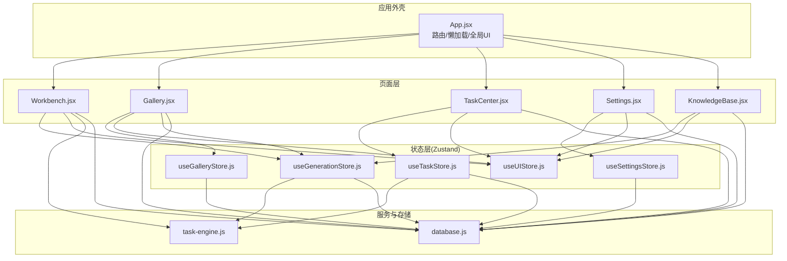
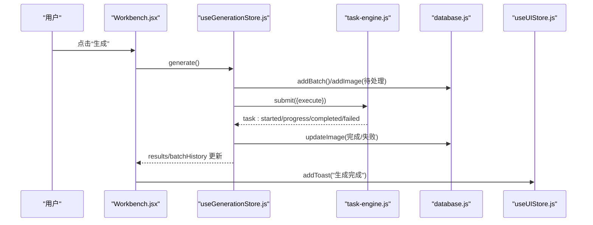
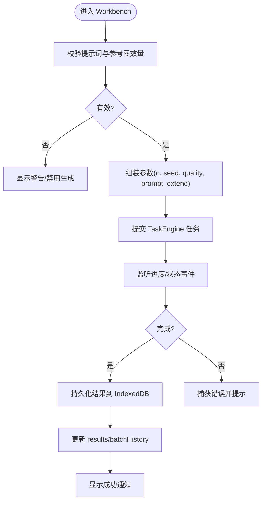
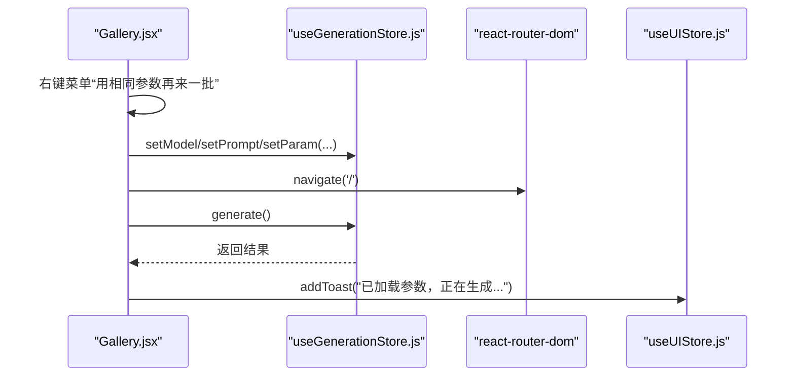
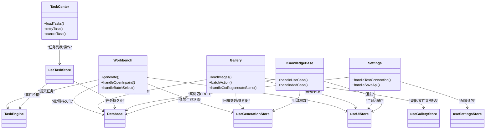

# 页面组件架构

<cite>
**本文引用的文件列表**
- [App.jsx](file://app/src/App.jsx)
- [Workbench.jsx](file://app/src/pages/Workbench.jsx)
- [Gallery.jsx](file://app/src/pages/Gallery.jsx)
- [TaskCenter.jsx](file://app/src/pages/TaskCenter.jsx)
- [Settings.jsx](file://app/src/pages/Settings.jsx)
- [KnowledgeBase.jsx](file://app/src/pages/KnowledgeBase.jsx)
- [useGenerationStore.js](file://app/src/stores/useGenerationStore.js)
- [useGalleryStore.js](file://app/src/stores/useGalleryStore.js)
- [useTaskStore.js](file://app/src/stores/useTaskStore.js)
- [useSettingsStore.js](file://app/src/stores/useSettingsStore.js)
- [useUIStore.js](file://app/src/stores/useUIStore.js)
- [task-engine.js](file://app/src/services/task-engine.js)
- [database.js](file://app/src/db/database.js)
</cite>

## 目录
1. [简介](#简介)
2. [项目结构](#项目结构)
3. [核心组件](#核心组件)
4. [架构总览](#架构总览)
5. [详细组件分析](#详细组件分析)
6. [依赖关系分析](#依赖关系分析)
7. [性能与缓存策略](#性能与缓存策略)
8. [故障排查指南](#故障排查指南)
9. [结论](#结论)

## 简介
本文件面向 AI Image Studio 的页面组件架构，系统性梳理工作台（Workbench）、图库（Gallery）、任务中心（TaskCenter）、设置（Settings）、知识库（KnowledgeBase）等核心页面的职责边界、状态管理模式、数据流以及与 Zustand store 的交互方式。文档同时覆盖页面间导航逻辑、参数传递、状态共享机制、页面级缓存策略、懒加载实现与性能优化技巧，并给出典型用户工作流映射与可视化图示。

## 项目结构
应用采用“路由 + 懒加载”的页面组织方式，主入口 App 通过 HashRouter 定义页面路由，并使用 React.lazy 对页面进行按需加载；全局 UI 能力（主题、轻盒、遮罩编辑器、通知）由 useUIStore 统一管理；业务状态按领域拆分为多个 Zustand store；后台任务由 TaskEngine 统一调度，持久化到 IndexedDB（Dexie）。

图表来源
- [App.jsx:18-24](file://app/src/App.jsx#L18-L24)
- [App.jsx:316-326](file://app/src/App.jsx#L316-L326)
- [useGenerationStore.js:108-290](file://app/src/stores/useGenerationStore.js#L108-L290)
- [useTaskStore.js:39-64](file://app/src/stores/useTaskStore.js#L39-L64)
- [task-engine.js:57-81](file://app/src/services/task-engine.js#L57-L81)
- [database.js:22-31](file://app/src/db/database.js#L22-L31)

章节来源
- [App.jsx:18-24](file://app/src/App.jsx#L18-L24)
- [App.jsx:316-326](file://app/src/App.jsx#L316-L326)

## 核心组件
- Workbench（工作台）：负责提示词输入、模型选择、参考图管理、生成参数配置、批量历史、结果展示与局部重绘入口。与 useGenerationStore 深度绑定，调用 TaskEngine 执行生成任务，并将结果落库。
- Gallery（图库）：负责图片浏览、筛选、搜索、收藏、批量操作、导入导出、移动至文件夹、上下文菜单快捷操作。与 useGalleryStore 和 useGenerationStore 协作，支持从图库跳转回工作台复用参数或作为参考图。
- TaskCenter（任务中心）：集中展示后台任务的运行、排队、暂停、重试、取消、完成与失败状态，提供统计概览与快速操作。与 useTaskStore 联动，订阅 TaskEngine 事件刷新 UI。
- Settings（设置）：管理模型 API 配置、存储配置（本地热区容量与 OSS）、提示词扩写配置、通用设置（默认模型、语言、主题等），并提供连接测试与保存。
- KnowledgeBase（知识库）：维护案例包（图像+提示词+参数+标注），支持检索、编辑、AI 辅助标注、一键回填工作台参数。

章节来源
- [Workbench.jsx:63-182](file://app/src/pages/Workbench.jsx#L63-L182)
- [Gallery.jsx:53-145](file://app/src/pages/Gallery.jsx#L53-L145)
- [TaskCenter.jsx:24-66](file://app/src/pages/TaskCenter.jsx#L24-L66)
- [Settings.jsx:38-86](file://app/src/pages/Settings.jsx#L38-L86)
- [KnowledgeBase.jsx:14-154](file://app/src/pages/KnowledgeBase.jsx#L14-L154)

## 架构总览
整体遵循“页面组件 -> Zustand Store -> 服务/数据库”的分层模式：
- 页面组件仅持有少量 UI 态，主要依赖 store 提供的读写方法。
- Store 封装业务逻辑与副作用（网络请求、IndexedDB 写入、事件桥接）。
- 后台任务通过 TaskEngine 统一调度，状态变更通过事件驱动更新 UI。
- 全局 UI 能力（主题、轻盒、遮罩编辑器、通知）集中在 useUIStore，跨页面共享。

图表来源
- [useGenerationStore.js:112-290](file://app/src/stores/useGenerationStore.js#L112-L290)
- [task-engine.js:222-297](file://app/src/services/task-engine.js#L222-L297)
- [database.js:43-96](file://app/src/db/database.js#L43-L96)
- [useUIStore.js:80-103](file://app/src/stores/useUIStore.js#L80-L103)

## 详细组件分析

### Workbench（工作台）
- 职责划分
  - 左侧面板：模型切换、Prompt 输入与扩写、参考图上传与角色标记、尺寸/质量/Seed 等参数控制、批量历史与结果预览。
  - 右侧面板：结果网格、下载、复制 Prompt、用作参考图、重新生成、打开遮罩编辑器进行局部重绘。
- 状态管理
  - 使用 useGenerationStore 管理当前模型、提示词、参考图、参数、结果、批历史、生成进度与错误信息。
  - 使用 useUIStore 管理 Toast、Lightbox、遮罩编辑器开关及回调。
- 数据流
  - 触发 generate() 后，创建批次记录并提交 TaskEngine 任务；适配器在 execute 中调用具体模型接口；完成后将结果写入 IndexedDB 并更新 store。
  - 支持键盘快捷键（Ctrl/Cmd + Enter）快速生成。
- 关键流程（生成）

图表来源
- [Workbench.jsx:164-182](file://app/src/pages/Workbench.jsx#L164-L182)
- [useGenerationStore.js:112-290](file://app/src/stores/useGenerationStore.js#L112-L290)
- [task-engine.js:222-297](file://app/src/services/task-engine.js#L222-L297)

章节来源
- [Workbench.jsx:63-182](file://app/src/pages/Workbench.jsx#L63-L182)
- [Workbench.jsx:274-295](file://app/src/pages/Workbench.jsx#L274-L295)
- [Workbench.jsx:297-309](file://app/src/pages/Workbench.jsx#L297-L309)
- [Workbench.jsx:345-429](file://app/src/pages/Workbench.jsx#L345-L429)
- [useGenerationStore.js:112-290](file://app/src/stores/useGenerationStore.js#L112-L290)

### Gallery（图库）
- 职责划分
  - 顶部工具栏：搜索（关键词/语义/以图搜图占位）、视图切换（网格/列表）、导入按钮。
  - 过滤栏：模型、日期范围、比例、收藏筛选。
  - 内容区：分组展示（今天/昨天/本周/本月/更早）、懒加载更多、右键菜单（再次生成、设为参考图、微调 Prompt、局部重绘、移动到文件夹、收藏、删除、导出）。
  - 侧边详情面板：图片预览、提示词、参数、操作。
- 状态管理
  - useGalleryStore 管理 images/folders/viewMode/search/filter/selection。
  - 与 useGenerationStore 协作，支持将图片参数回填工作台或直接作为参考图。
- 数据流
  - 初始化时加载 images 与 folders；根据 URL 参数（如 filter/folder）应用筛选；滚动触底加载更多；批量操作后刷新列表。
- 典型交互序列（从图库回到工作台再生成）

图表来源
- [Gallery.jsx:259-273](file://app/src/pages/Gallery.jsx#L259-L273)
- [useGenerationStore.js:112-290](file://app/src/stores/useGenerationStore.js#L112-L290)

章节来源
- [Gallery.jsx:53-145](file://app/src/pages/Gallery.jsx#L53-L145)
- [Gallery.jsx:147-228](file://app/src/pages/Gallery.jsx#L147-L228)
- [Gallery.jsx:259-318](file://app/src/pages/Gallery.jsx#L259-L318)
- [useGalleryStore.js:29-88](file://app/src/stores/useGalleryStore.js#L29-L88)

### TaskCenter（任务中心）
- 职责划分
  - 统计条：进行中/排队中/已完成/失败计数。
  - 分组列表：按状态折叠展开，显示进度条、时间戳、模型标签、错误信息。
  - 操作：暂停/恢复/取消/重试/移除/清空已完成。
- 状态管理
  - useTaskStore 管理 tasks 与 activeTaskCount，并在应用启动时初始化 TaskEngine 事件桥，自动刷新任务列表。
- 数据流
  - 页面挂载时 loadTasks()；订阅 TaskEngine 的事件（queued/started/progress/completed/failed/cancelled/paused/retry），每次事件后刷新任务列表。

章节来源
- [TaskCenter.jsx:24-66](file://app/src/pages/TaskCenter.jsx#L24-L66)
- [useTaskStore.js:22-64](file://app/src/stores/useTaskStore.js#L22-L64)
- [useTaskStore.js:109-157](file://app/src/stores/useTaskStore.js#L109-L157)

### Settings（设置）
- 职责划分
  - 模型 API：为每个模型配置 Endpoint 与 API Key，支持连接测试与保存。
  - 存储：本地热区容量调节、阿里云 OSS 配置与连接测试。
  - 提示词扩写：扩写模型、Endpoint、Key、RAG Top-K、模板保存与测试。
  - 通用：默认模型、图片格式、通知/声音开关、语言、主题切换。
- 状态管理
  - useSettingsStore 管理 modelConfigs/storageConfig/expansionConfig/generalConfig，并提供 saveSettings/loadSettings/resetToDefaults。
- 数据流
  - 页面加载时 loadSettings() 填充表单；保存时调用对应 update*Config 并持久化；测试连接通过代理端点发起最小请求判断连通性与鉴权。

章节来源
- [Settings.jsx:38-86](file://app/src/pages/Settings.jsx#L38-L86)
- [Settings.jsx:88-208](file://app/src/pages/Settings.jsx#L88-L208)
- [useSettingsStore.js:58-99](file://app/src/stores/useSettingsStore.js#L58-L99)
- [useSettingsStore.js:108-149](file://app/src/stores/useSettingsStore.js#L108-L149)

### KnowledgeBase（知识库）
- 职责划分
  - 案例包管理：增删改查、标签、时间/模型筛选、网格/列表视图。
  - 详情面板：原始提示词/扩写提示词可编辑、参数展示、用户标注编辑、AI 辅助标注。
  - 使用案例：回填工作台参数并跳转。
- 状态管理
  - 本地 state 维护 cases 与编辑态；通过 database.js 的 casePackages 表持久化；与 useGenerationStore 协作回填参数。
- 数据流
  - 初始化加载案例包；筛选与搜索在客户端完成；AI 标注通过 LLM 适配器生成结构化文本；保存标注与新增案例均落库。

章节来源
- [KnowledgeBase.jsx:14-154](file://app/src/pages/KnowledgeBase.jsx#L14-L154)
- [KnowledgeBase.jsx:156-203](file://app/src/pages/KnowledgeBase.jsx#L156-L203)
- [KnowledgeBase.jsx:205-222](file://app/src/pages/KnowledgeBase.jsx#L205-L222)
- [database.js:22-31](file://app/src/db/database.js#L22-L31)

## 依赖关系分析
- 页面与 Store 的耦合
  - Workbench 强依赖 useGenerationStore 与 useUIStore，间接依赖 TaskEngine 与 database。
  - Gallery 依赖 useGalleryStore 与 useUIStore，并与 useGenerationStore 双向协作（回填参数/添加参考图）。
  - TaskCenter 依赖 useTaskStore，后者与 TaskEngine 事件桥接。
  - Settings 依赖 useSettingsStore 与 useUIStore。
  - KnowledgeBase 依赖 database 与 useGenerationStore/useUIStore。
- 外部依赖
  - react-router-dom 用于路由与导航。
  - Dexie（IndexedDB）用于持久化。
  - axios 用于设置页的连接测试。
- 潜在循环依赖
  - 页面之间不直接互相 import，而是通过 store 与 router 通信，避免循环依赖。
  - Store 内部可能动态 import database 模块以降低首屏体积（例如 useGenerationStore 的 discardImage）。

图表来源
- [App.jsx:316-326](file://app/src/App.jsx#L316-L326)
- [useGenerationStore.js:112-290](file://app/src/stores/useGenerationStore.js#L112-L290)
- [useTaskStore.js:39-64](file://app/src/stores/useTaskStore.js#L39-L64)
- [task-engine.js:57-81](file://app/src/services/task-engine.js#L57-L81)
- [database.js:22-31](file://app/src/db/database.js#L22-L31)

章节来源
- [App.jsx:316-326](file://app/src/App.jsx#L316-L326)
- [useGenerationStore.js:112-290](file://app/src/stores/useGenerationStore.js#L112-L290)
- [useTaskStore.js:39-64](file://app/src/stores/useTaskStore.js#L39-L64)
- [task-engine.js:57-81](file://app/src/services/task-engine.js#L57-L81)
- [database.js:22-31](file://app/src/db/database.js#L22-L31)

## 性能与缓存策略
- 懒加载
  - 所有页面通过 React.lazy 与 Suspense 按需加载，减少首屏体积。
- 分页与无限滚动
  - Gallery 使用 displayCount 增量加载，滚动触底追加 50 张，降低渲染压力。
- 客户端筛选与分组
  - Gallery 在内存中对 images 做 ratio/dateRange 过滤与时间分组，避免频繁后端查询。
- IndexedDB 索引与查询
  - database.js 使用 Dexie 定义复合索引与排序，getImages 支持 folderId/model/favorite 过滤与 limit/offset 分页。
- 任务并发与重试
  - TaskEngine 默认最大并发 3，FIFO 队列，指数退避重试（最多 3 次），失败/完成事件驱动 UI 刷新。
- 资源释放
  - Workbench 在参考图移除时注意 Blob URL 生命周期管理（浏览器卸载时回收），避免内存泄漏。
- 建议优化
  - 大图缩略图预生成与缓存（Gallery 导入时已生成缩略图）。
  - 对长列表使用虚拟滚动替代无限滚动（当图片量极大时）。
  - 对高频 store 订阅使用 useMemo/useSelector 细粒度订阅，减少不必要重渲染。

章节来源
- [App.jsx:18-24](file://app/src/App.jsx#L18-L24)
- [Gallery.jsx:135-138](file://app/src/pages/Gallery.jsx#L135-L138)
- [database.js:56-76](file://app/src/db/database.js#L56-L76)
- [task-engine.js:269-292](file://app/src/services/task-engine.js#L269-L292)

## 故障排查指南
- 生成失败
  - 检查 useGenerationStore.generate 的错误分支与 Toast 提示；确认 TaskEngine 是否抛出可重试错误；查看 IndexedDB 中 pending 记录是否被更新为 failed。
- 任务无法取消/暂停
  - 确认 TaskEngine 的 cancel/pause 是否命中 active 或 queue；若失败，useTaskStore 会回退更新状态；检查事件桥是否初始化。
- 图库筛选无效
  - 检查 filters 对象是否正确合并；确认 dateRange 计算与 createdAt 比较逻辑；必要时重置 currentFolder。
- 设置保存未生效
  - 检查 useSettingsStore.saveSettings 是否成功写入 IndexedDB；确认各 update*Config 是否触发持久化。
- 知识库案例无法回填
  - 核对 handleUseCase 中的模型映射与参数遍历逻辑；确保 navigate('/') 后目标页面已订阅 store 变化。

章节来源
- [useGenerationStore.js:283-290](file://app/src/stores/useGenerationStore.js#L283-L290)
- [useTaskStore.js:126-157](file://app/src/stores/useTaskStore.js#L126-L157)
- [useGalleryStore.js:80-88](file://app/src/stores/useGalleryStore.js#L80-L88)
- [useSettingsStore.js:137-149](file://app/src/stores/useSettingsStore.js#L137-L149)
- [KnowledgeBase.jsx:138-154](file://app/src/pages/KnowledgeBase.jsx#L138-L154)

## 结论
AI Image Studio 的页面组件架构清晰分层：页面聚焦交互与呈现，Zustand store 承载领域状态与副作用，TaskEngine 统一调度后台任务并通过事件驱动 UI 更新，IndexedDB 提供可靠的数据持久化。通过路由懒加载、无限滚动、客户端筛选与合理的 store 订阅策略，系统在功能丰富度与性能之间取得良好平衡。后续可在大数据量场景引入虚拟滚动与更细粒度的 store 订阅，进一步提升体验。